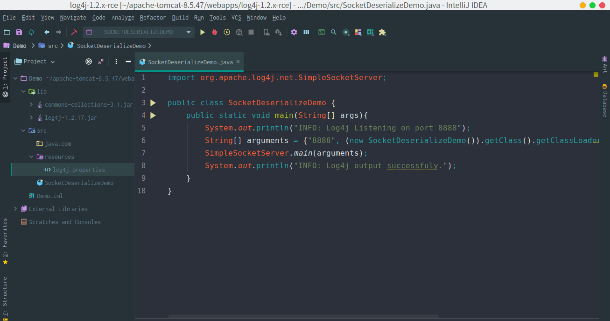

## 核对与使用边界

本文已按保存的全文审阅记录进行文字校订；本轮仅静态核对，未运行 PoC、请求目标或逐图验证。

适用条件与版本记录（来源主张，未列为明确更正的部分仍待权威资料核对）：2.x&lt;=2.8.1; explicit TCPServer8888 and CommonsCollections3.1 dependency

代码与实验材料：Full test server and Maven manifest; payload/confirmation only image/GIF; demonstrates sink flow

来源证据范围：mochazz original analysis URL supplied

- **证据待核（1）**：Empty introduction and orphan 上面 reference; image Markdown duplicated tails。保留原引用、截图位置和实验叙述；本项所缺材料未被补造，截图存在或作者宣称成功都不等于已核验其内容。

- **适用与权限边界（2）**：No textual payload invocation, remediation or explicit unauthenticated network-exposure caveat。按此限制解释本文结论，版本相同不足以证明所需角色、入口、配置、依赖或可控参数均已满足；原操作和失败记录一并保留。

历史原文标识：下文原技术材料按来源保留；仅本节明确确认的更正替代相应旧说法，标为待核的观察仍不是事实确认。

（CVE-2017-5645）Log4j 2.X反序列化漏洞
======================================

一、漏洞简介
------------

二、漏洞影响
------------

Log4j 2.x\<=2.8.1

三、复现过程
------------

### 漏洞分析

漏洞本质和上面是一样的，我们先创建如下 **Demo** 代码用于测试。

Log4j2.X反序列化漏洞/media/rId25.png)

    // src/main/java/Log4jSocketServer.java
    import org.apache.logging.log4j.core.net.server.ObjectInputStreamLogEventBridge;
    import org.apache.logging.log4j.core.net.server.TcpSocketServer;

    import java.io.IOException;
    import java.io.ObjectInputStream;

    public class Log4jSocketServer {
        public static void main(String[] args){
            TcpSocketServer<ObjectInputStream> myServer = null;
            try{
                myServer = new TcpSocketServer<ObjectInputStream>(8888, new ObjectInputStreamLogEventBridge());
            } catch(IOException e){
                e.printStackTrace();
            }
            myServer.run();
        }
    }
    <!-- maven文件pom.xml -->
    <?xml version="1.0" encoding="UTF-8"?>
    <project xmlns="http://maven.apache.org/POM/4.0.0"
             xmlns:xsi="http://www.w3.org/2001/XMLSchema-instance"
             xsi:schemaLocation="http://maven.apache.org/POM/4.0.0 http://maven.apache.org/xsd/maven-4.0.0.xsd">
        <modelVersion>4.0.0</modelVersion>

        <groupId>org.example</groupId>
        <artifactId>log4j-2.x-rce</artifactId>
        <version>1.0-SNAPSHOT</version>
        <dependencies>
            <!-- https://mvnrepository.com/artifact/org.apache.logging.log4j/log4j-core -->
            <dependency>
                <groupId>org.apache.logging.log4j</groupId>
                <artifactId>log4j-core</artifactId>
                <version>2.8.1</version>
            </dependency>
            <!-- https://mvnrepository.com/artifact/org.apache.logging.log4j/log4j-api -->
            <dependency>
                <groupId>org.apache.logging.log4j</groupId>
                <artifactId>log4j-api</artifactId>
                <version>2.8.1</version>
            </dependency>
            <!-- https://mvnrepository.com/artifact/commons-collections/commons-collections -->
            <dependency>
                <groupId>commons-collections</groupId>
                <artifactId>commons-collections</artifactId>
                <version>3.1</version>
            </dependency>
        </dependencies>

    </project>

当我们运行代码后，程序会在本地的 **8888**
端口开始等待接收数据，然后在下图第105行代码处，将接收到的数据转换成
**ObjectInputStream** 对象数据，最终在 `handler.start()` 中调用
**SocketHandler** 类的 **run** 方法。

Log4j2.X反序列化漏洞/media/rId26.png)

在 **SocketHandler** 类的 **run** 方法中， **ObjectInputStream**
对象数据被传入了 **ObjectInputStreamLogEventBridge** 类的 **logEvents**
方法，而反序列化就发生在这个方法中。

Log4j2.X反序列化漏洞/media/rId27.png)

同样这里我们添加一条 **commons-collections** 的 **Gadget**
链用来演示命令执行。

Log4j2.X反序列化漏洞/media/rId28.gif)

参考链接
--------

> https://mochazz.github.io/2019/12/26/Log4j%E5%8F%8D%E5%BA%8F%E5%88%97%E5%8C%96%E5%88%86%E6%9E%90/\#%E6%BC%8F%E6%B4%9E%E5%88%86%E6%9E%90-1
