## 核对与使用边界

本文已按保存的全文审阅记录进行文字校订；本轮仅静态核对，未运行 PoC、请求目标或逐图验证。

适用条件与版本记录（来源主张，未列为明确更正的部分仍待权威资料核对）：Apktool&lt;=2.9.1; MobSF release unspecified; attacker APK processed with writable output and predictable jadx path

代码与实验材料：Detailed MT ARSC editing workflow and write→jadx overwrite escalation, but crucial values/results screenshots; no pinned malicious APK/hash

来源证据范围：Researcher GitHub and GHSA-2hqv-2xv4-5h5w URL, latter broken across lines

- **结论使用边界（1）**：Repair split advisory URL and traversal whitespace; fixed release not named。此项限制直接适用于下文对应结论；现有正文不足以作更宽泛推论，所列方法和原始证据均保留。

- **结论使用边界（2）**：Separate library arbitrary write from MobSF-specific executable overwrite prerequisites。此项限制直接适用于下文对应结论；现有正文不足以作更宽泛推论，所列方法和原始证据均保留。

历史原文标识：下文原技术材料按来源保留；仅本节明确确认的更正替代相应旧说法，标为待核的观察仍不是事实确认。

#  Apktool任意文件写入漏洞分析 CVE-2024-21633   
原创 RoShine  洞源实验室   2024-02-08 18:01  
  
  
  
**前置知识**  
  
  
  
  
  
  
  
  
  
在复现该漏洞前，有必要了解Apktool和resources.arsc相关的基础知识，方便理解后续POC的构造。  
  
Apktool是一款流行的开源逆向工程软件，用于反编译和编译Android应用，因此，Apktool被许多其他逆向工程软件集成。  
  
官网地址：  
  
https://apktool.org/  
  
项目地址：  
  
https://github.com/iBotPeaches/Apktool  
  
该工具可以将Android应用的apk文件反编译为可编辑的项目结构，同时也可以将编辑后的文件重新打包成apk文件，反编译和重打包操作分别对应工具的d、b两个参数。  
  
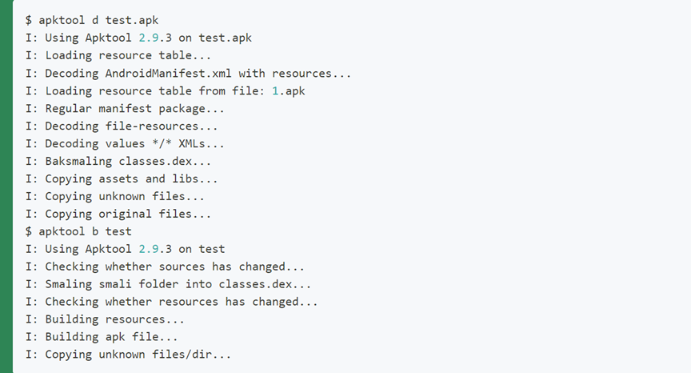  
  
resource.arsc文件是apk打包过程产生的一个资源索引文件，该文件内容是Android项目的资源和资源索引信息，/res目录中除了values外的资源文件路径都会记录在resources.arsc中。  
  
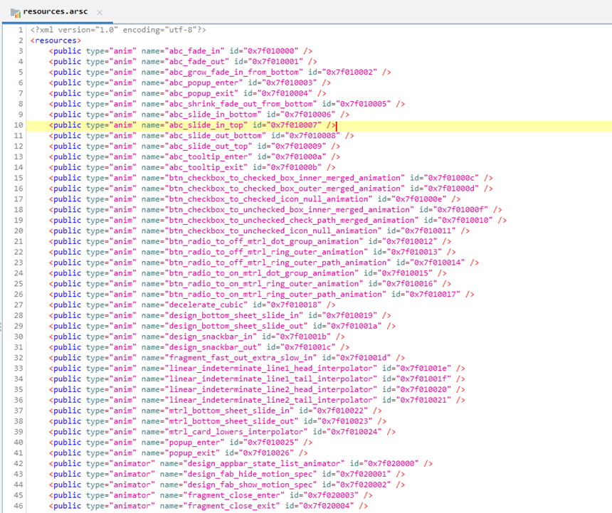  
  
  
**漏洞介绍**  
  
  
  
  
  
  
  
  
  
CVE-2024-21633漏洞Apktool在2.9.1版本及之前的版本中存在漏洞。Apktool根据资源名称判断资源文件的输出路径，攻击者可以利用这一特点将文件放置在系统上指定位置。因而，攻击者可以写入或覆盖用户具有写入权限的任何文件，甚至是在知晓用户名的情况下写入文件到当前工作目录在用户目录下。  
  
例如，名称为foo，路径为res/raw/bar的资源会被提取到res/raw/foo。但资源名称没有经过校验，因此将资源名称从foo更改为../../../../../../../../../../.. /../tmp/poc，最终会将res/raw/bar文件放置到Linux系统中的/tmp/poc中，同理Windows系统中也存在漏洞。  
  
  
**漏洞复现**  
  
  
  
  
  
  
  
  
  
该漏洞的复现参考了漏洞发现者在GitHub发布的文章，但作者没有说明POC如何构造，像jadx、AndroidStudio只能反编译apk，但无法直接编辑apk资源。最终选择使用MT管理器构造了apk，具体过程如下：  
  
在安卓模拟器安装MT管理器，这是一款多功能的APK逆向工程软件，同时兼具文件管理器功能，可以用于汉化应用、替换资源、修改布局、修改逻辑代码、资源混淆、去除签名校验等等。  
  
  
  
将我们要构造POC的apk包也安装到模拟器，而后使用MT管理器提取apk包。  
  
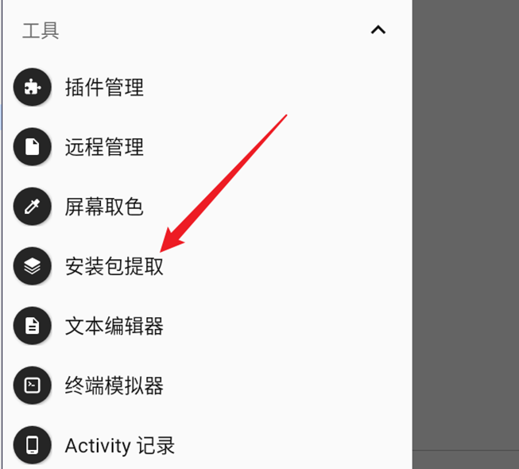  
  
点击提取后的apk包，选择查看。  
  
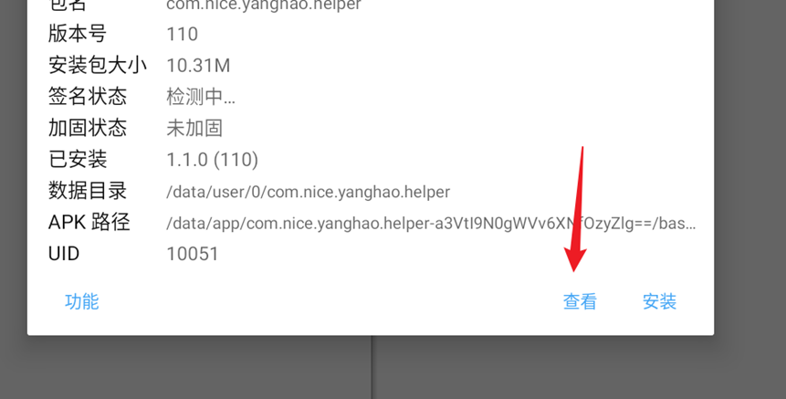  
  
选中resources.arsc，并使用ARSC编辑器打开。  
  
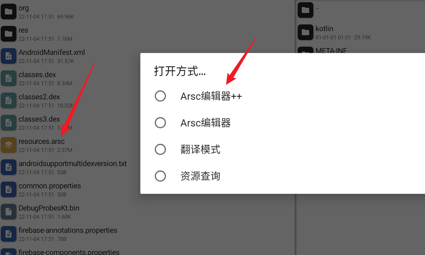  
  
找到raw目录下的type-info。  
  
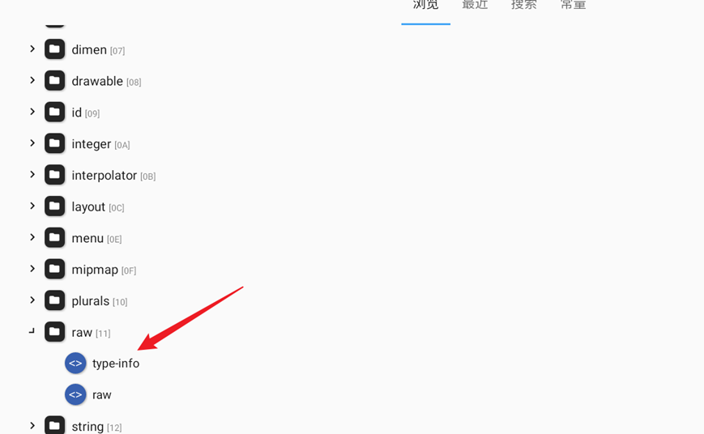  
  
在该文件中增加属性是realName，数值是路径穿越的POC，该文件中所见的id、name即为开头提到的resource.arsc文件中列出的资源名称和资源索引。  
  
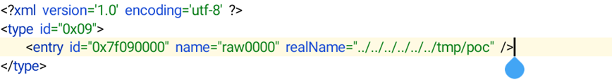  
  
之后保存修改，继续保存为工程，并进行编译。  
  
  
  
  
  
在项目编译过程中漏洞实际上会被触发，因此上述过程只是对resource.arsc进行编译，接着将修改好的resources.arsc文件通过共享文件夹提取到电脑。  
  
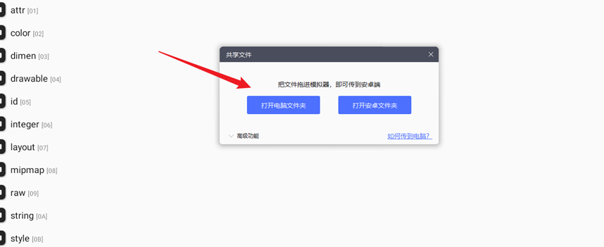  
  
使用压缩软件打开原始的apk包，删除其中的resources.arsc文件，再将修改好的resources.arsc替换进去。  
  
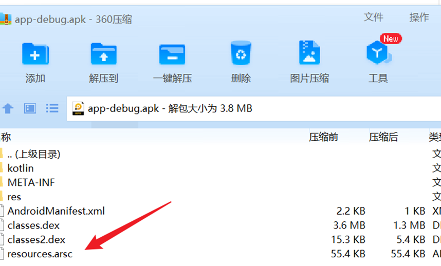  
  
我们以集成了Apktool工具的移动安全检测框架MobSF为例复现该漏洞，在MobSF中上传构造好POC的apk文件。  
  
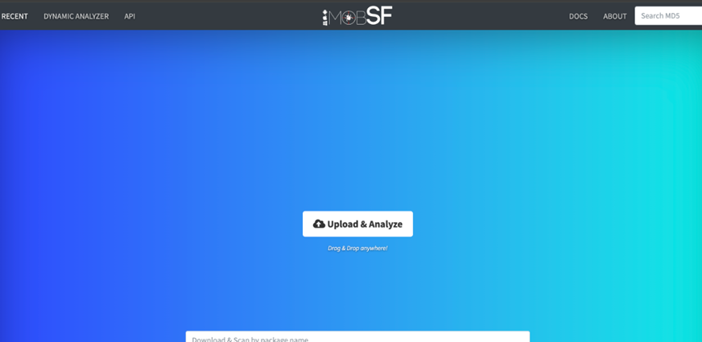  
  
上传完成后查看tmp目录，发现POC构建的poc文件被上传到了系统tmp目录。  
  
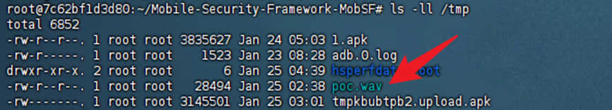  
  
但上传后的文件没有执行权限，此时仅仅是任意文件覆盖的漏洞。不过，漏洞作者在研究后发现MobSF使用jadx（另一款流行的软件逆向工程软件）作为其静态分析的一部分，它通过子进程调用jadx，但在此之前它会将jadx的权限更改为可执行文件。  
  
因此，可以使用文件名为jadx的POC作为apk的res资源文件名，在其中写入任意脚本，再通过路径穿越覆盖jadx文件实现命令执行。  
  
MobSF中上传的apk包位于/.MobSF/uploads/文件名MD5/apktool_out/res/raw，jadx的路径是/Mobile-Security-Framework-MobSF/mobsf/StaticAnalyzer/tools/jadx/bin/，需要六级目录的穿越。  
  
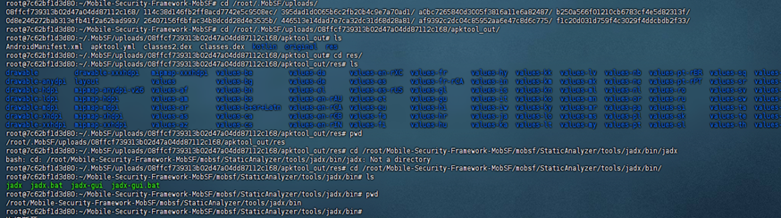  
  
按上述步骤重新使用MT管理器构造POC如下。  
  
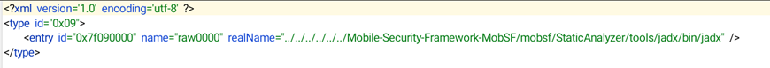  
  
再保存重新编译打包，并上传到MobSF，上传后查看jadx文件是已经被成功覆盖为写入的命令。  
  
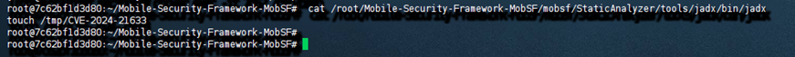  
  
  
**漏洞修复**  
  
  
  
  
  
  
  
  
  
该漏洞的修复方式很简单，新版的Apktool新增了路径穿越符号的检测代码。  
  
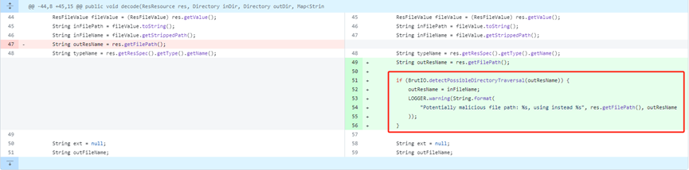  
  
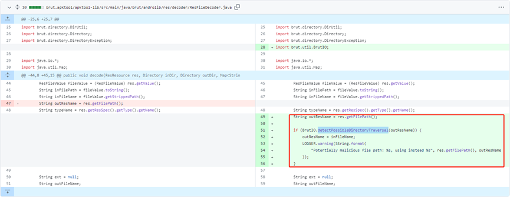  
  
  
**参考资料**  
  
  
  
  
  
  
  
  
  
https://github.com/0x33c0unt/CVE-2024-21633  
  
htt  
p  
s  
://github.com/iBotPeaches/Apktool/security/advisories/GHSA-2hqv-2xv  
4-5h5w  
  
  
  
  

---

> 来源：gelusus/wxvl（微信公众号漏洞文章自动归档，原文见文首链接）
