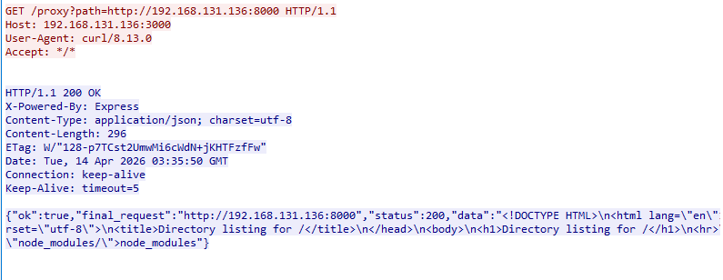
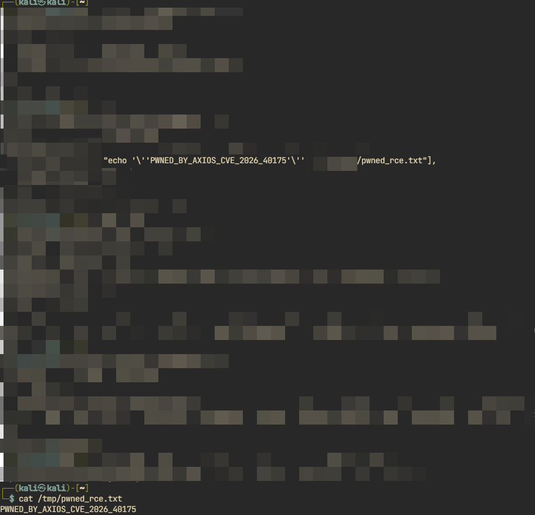
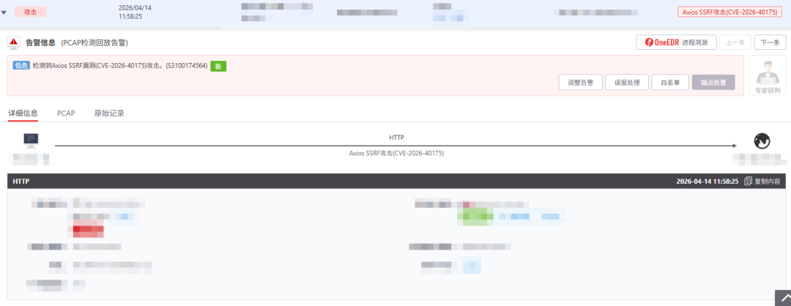

## 核对与使用边界

本文已按保存的全文审阅记录进行文字校订；本轮仅静态核对，未运行 PoC、请求目标或逐图验证。

适用条件与版本记录（来源主张，未列为明确更正的部分仍待权威资料核对）：&lt;1.15.0; unauthenticated per vendor; application-controlled URL/host exposure implicit; RCE requires additional insecure environment

代码与实验材料：SSRF and RCE evidence entirely2 screenshots; cannot verify transition or preconditions from text

来源证据范围：ThreatBook record and official Axios1.15.0 release URL; no security advisory/patch permalink

- **适用与权限边界（1）**：Prerequisites flattened; SSRF/RCE applicability must be separated；依据：无特殊要求 table versus 特定场景...不安全运行环境配置或业务代码。按此限制解释本文结论，版本相同不足以证明所需角色、入口、配置、依赖或可控参数均已满足；原操作和失败记录一并保留。

- **结论使用边界（2）**：Host-header-only mitigation not justified by described relative/absolute URL mechanism。此项限制直接适用于下文对应结论；现有正文不足以作更宽泛推论，所列方法和原始证据均保留。

- **结论使用边界（3）**：Empty consultation link and promotional bulk。此项限制直接适用于下文对应结论；现有正文不足以作更宽泛推论，所列方法和原始证据均保留。

历史原文标识：下文原技术材料按来源保留；仅本节明确确认的更正替代相应旧说法，标为待核的观察仍不是事实确认。

#  Axios爆SSRF漏洞，特定条件下可导致RCE  
原创 微步情报局
                    微步情报局  微步在线研究响应中心   2026-04-14 07:06  
  
  
  
  
  
漏洞概况  
  
  
Axios是一个基于Promise的HTTP客户端，广泛应用于浏览器和Node.js环境。  
  
近日，Axios官方发布安全通告，修复了一个SSRF漏洞（CVE-2026-40175）。  
微步情报局已成功复现该漏洞。  
经分析，该漏洞  
无需用户权限  
即可利用。攻击者可通过传入相对URL或绝对URL的方式，控制请求发送至非预期目标，从而对内网服务发起探测与访问，  
导致敏感信息泄露或内网资产被攻击。  
  
值得注意的是，在特定场景下，若结合不安全的运行环境配置或业务代码，  
影响会进一步扩大，导致远程代码执行  
。建议受影响用户  
尽快升级修复  
。（完整漏洞情报请查阅 https://x.threatbook.com/v5/vul/XVE-2026-13154）  
  
漏洞处置优先级(VPT)  
  
  
**综合处置优先级：**  
中风险  
<table><tbody><tr><td rowspan="3" style="border: 1px solid rgb(221, 221, 221);padding: 12px;vertical-align: top;font-weight: bold;background-color: rgb(248, 249, 250);"><section>基本信息</section></td><td style="border: 1px solid rgb(221, 221, 221);padding: 12px;vertical-align: top;"><section>微步编号</section></td><td style="border: 1px solid #ddd;padding: 12px;vertical-align: top;"><section>XVE-2026-13154</section></td></tr><tr><td style="border: 1px solid #ddd;padding: 12px;vertical-align: top;"><section>CVE编号</section></td><td style="border: 1px solid #ddd;padding: 12px;vertical-align: top;"><section>CVE-2026-40175</section></td></tr><tr><td style="border: 1px solid #ddd;padding: 12px;vertical-align: top;"><section>漏洞类型</section></td><td style="border: 1px solid #ddd;padding: 12px;vertical-align: top;"><section>SSRF</section></td></tr><tr><td rowspan="5" style="border: 1px solid #ddd;padding: 12px;vertical-align: top;font-weight: bold;background-color: #f8f9fa;"><section>利用条件评估</section></td><td style="border: 1px solid #ddd;padding: 12px;vertical-align: top;"><section>利用漏洞的网络条件</section></td><td style="border: 1px solid #ddd;padding: 12px;vertical-align: top;"><section>远程</section></td></tr><tr><td style="border: 1px solid #ddd;padding: 12px;vertical-align: top;"><section>是否需要绕过安全机制</section></td><td style="border: 1px solid #ddd;padding: 12px;vertical-align: top;"><section>否</section></td></tr><tr><td style="border: 1px solid #ddd;padding: 12px;vertical-align: top;"><section>对被攻击系统的要求</section></td><td style="border: 1px solid #ddd;padding: 12px;vertical-align: top;"><section>无特殊要求</section></td></tr><tr><td style="border: 1px solid #ddd;padding: 12px;vertical-align: top;"><section>利用漏洞的权限要求</section></td><td style="border: 1px solid #ddd;padding: 12px;vertical-align: top;"><section>无须用户权限</section></td></tr><tr><td style="border: 1px solid #ddd;padding: 12px;vertical-align: top;"><section>是否需要受害者配合</section></td><td style="border: 1px solid #ddd;padding: 12px;vertical-align: top;"><section>否</section></td></tr><tr><td rowspan="2" style="border: 1px solid #ddd;padding: 12px;vertical-align: top;font-weight: bold;background-color: #f8f9fa;"><section>利用情报</section></td><td style="border: 1px solid #ddd;padding: 12px;vertical-align: top;"><section>POC是否公开</section></td><td style="border: 1px solid #ddd;padding: 12px;vertical-align: top;">是</td></tr><tr><td style="border: 1px solid #ddd;padding: 12px;vertical-align: top;"><section>已知利用行为</section></td><td style="border: 1px solid #ddd;padding: 12px;vertical-align: top;"><section>暂无</section></td></tr></tbody></table>  

漏洞影响范围  
  
<table><tbody><tr><td style="border: 1px solid rgb(221, 221, 221);padding: 12px;vertical-align: top;font-weight: bold;background-color: rgb(248, 249, 250);"><section>产品名称</section></td><td style="border: 1px solid #ddd;padding: 12px;vertical-align: top;"><section>Axios</section></td></tr><tr><td style="border: 1px solid rgb(221, 221, 221);padding: 12px;vertical-align: top;font-weight: bold;background-color: rgb(248, 249, 250);"><section>受影响版本</section></td><td style="border: 1px solid #ddd;padding: 12px;vertical-align: top;"><section>&lt; 1.15.0</section></td></tr><tr><td style="border: 1px solid rgb(221, 221, 221);padding: 12px;vertical-align: top;font-weight: bold;background-color: rgb(248, 249, 250);"><section>有无修复补丁</section></td><td style="border: 1px solid #ddd;padding: 12px;vertical-align: top;"><section>有</section></td></tr></tbody></table>  

漏洞复现  
  
  
SSRF:  
  
  
  
RCE:  
  
  
  
  
修复方案  
  
### 官方修复方案  
  
官方已发布修复方案，请访问链接下载：  
  
https://github.com/axios/axios/releases/tag/v1.15.0  
### 临时缓解措施  
  
配置层：对 Host 头进行严格校验，仅允许业务使用的合法域名，避免攻击者通过伪造或覆盖 Host 头访问非预期的内部服务；同时避免直接信任 X-Forwarded-Host、X-Host、X-Original-Host 等非标准头。  
  
微步产品支撑  
  
  
微步漏洞情报于  
2026-04-11  
收录该漏洞。  
  
微步下一代威胁情报平台NGTIP及X情报社区已于漏洞收录时向漏洞订阅用户推送该漏洞情报，并将持续推送后续更新；对于已经录入资产的用户，支持实时自动化排查受影响资产。  
  
微步威胁感知平台TDP已于  
20260414  
支持检测，检测ID：  
S3100174564，  
模型/规则高于：  
20260414000000  
可检出。  
  
  
  
  
- END -  
**微步漏洞情报订阅服务**  
  
  
微步提供漏洞情报订阅服务，精准、高效助力企业漏洞运营：  
- 提供高价值漏洞情报，具备及时、准确、全面和可操作性，帮助企业高效应对漏洞应急与日常运营难题；  
  
- 可实现对高威胁漏洞提前掌握，以最快的效率解决信息差问题，缩短漏洞运营MTTR；  
  
- 提供漏洞完整的技术细节，更贴近用户漏洞处置的落地；  
  
- 将漏洞与威胁事件库、APT组织和黑产团伙攻击大数据、网络空间测绘等结合，对漏洞的实际风险进行持续动态更新  
。  
  
  
扫码在线沟通  
  
↓  
↓↓  
  
  
  
  
  
  
点此电话咨询  
  
  
  
  
**X漏洞奖励计划**  
  
  
“X漏洞奖励计划”是微步X情报社区推出的一款  
针对未公开  
漏洞的奖励计划，我们鼓励白帽子提交挖掘到的0day漏洞，并给予白帽子可观的奖励。我们期望通过该计划与白帽子共同努力，提升0day防御能力，守护数字世界安全。  
  
活动详情：  
https://x.threatbook.com/v5/vulReward  
  
  
  

---

> 来源：gelusus/wxvl（微信公众号漏洞文章自动归档，原文见文首链接）
