## 核对与使用边界

本文已按保存的全文审阅记录进行文字校订；本轮仅静态核对，未运行 PoC、请求目标或逐图验证。

适用条件与版本记录（来源主张，未列为明确更正的部分仍待权威资料核对）：&lt;6.6.0; attacker data supplied to generation APIs

代码与实验材料：ConstantPoolGen/dump explanation, both Java demos empty fences; critical implementation screenshots

来源证据范围：Official PR147 cited; source attribution only repost and vague official docs title

- **结论使用边界（1）**：Bytecode control/output-format overflow conflated with arbitrary filesystem destination write; needs consequence correction；依据：任意文件写 headline versus 源API生成任意字节码 overview。此项限制直接适用于下文对应结论；现有正文不足以作更宽泛推论，所列方法和原始证据均保留。

- **事实待核（2）**：Missing code prevents meaningful reproduction；依据：Two empty fenced blocks after demo and65500变量。该项尚不能从转载本身确定外部事实；下文相应编号、版本或修复说法只作为来源记录，不能据此判定部署受影响或已修复。明确更正另列于本节。

- **结论使用边界（3）**：65535 array+64 explanation needs exact serialization-bound proof。此项限制直接适用于下文对应结论；现有正文不足以作更宽泛推论，所列方法和原始证据均保留。

历史原文标识：下文原技术材料按来源保留；仅本节明确确认的更正替代相应旧说法，标为待核的观察仍不是事实确认。

#  CVE-2022-42920 BCEL 任意文件写漏洞   
 系统安全运维   2024-04-27 14:54  
  
## 前言  
  
Apache Commons BCEL旨在为用户提供一种方便的方法来分析、创建和操作（二进制）Java 类文件（以 .class 结尾的文件）。类由包含给定类的所有符号信息的对象表示：特别是方法、字段和字节码指令。  
  
这些对象可以从现有文件中读取，由程序（例如运行时的类加载器）转换并再次写入文件，一个更有趣的应用是在运行时从头开始创建类  
  
BCEL 包含一个名为 JustIce 的字节码验证器，它通常会为您提供比标准 JVM 消息更好的关于代码错误的信息。  
## 漏洞概述  
  
首先看看apache list中的解释  
  
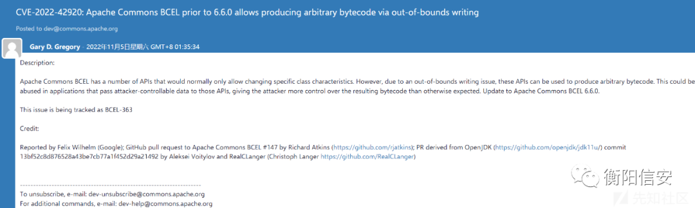  
  
Apache Commons BCEL 有许多通常只允许更改特定类特征的 API。但是，由于越界写入问题，这些 API 可用于生成任意字节码。这可能会在将攻击者可控制的数据传递给这些 API 的应用程序中被滥用，从而使攻击者能够比预期更多地控制生成的字节码  
## 影响版本  
  
< 6.6.0  
## 漏洞分析  
  
在这里我们可以看到漏洞的细节  
  
https://github.com/apache/commons-bcel/pull/147  
  
我们首先来了解一下bcel的用法  
  
查看官方文档  
  
Apache Commons BCEL™ – Home  
  
我们从上面的修复位置可以知道主要是在常量池的位置造成的越界写入漏洞  
  
我们直接关注到常量池的解释中去  
  
在ClassGen中  
  
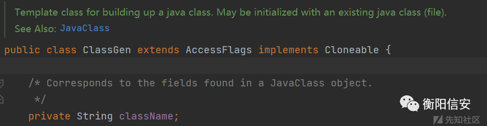  
  
该类是用来构建 Java 类的模板类。可以使用现有的 java 类（文件）进行初始化  
  
而这个类是在org.apache.bcel.generic包下的一个类，这个包提供了一个用于动态创建或转换类文件的抽象级别。它使 Java 类文件的静态约束（如硬编码的字节码地址）变得“通用”。例如，通用常量池由类 ConstantPoolGen 实现，该类提供添加不同类型常量的方法。因此，ClassGen 提供了一个接口来添加方法、字段和属性  
  
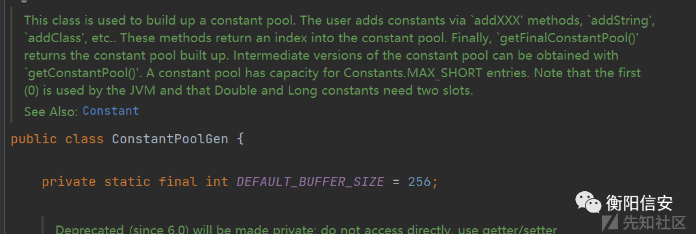  
  
对于ConstantPoolGen这个类用于构建常量池。用户通过“addXXX”方法、“addString”、“addClass”等方法添加常量。这些方法返回常量池的索引。最后，`getFinalConstantPool()' 返回建立起来的常量池。  
  
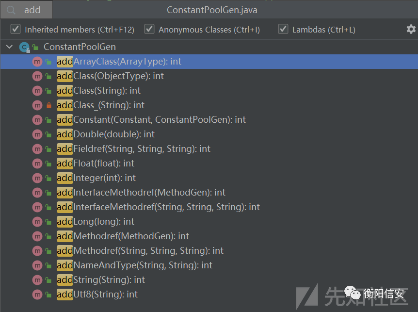  
  
该类中设计了多个addxxx方法可以添加不同类型的常量  
  
最后通过调用getFinalConstantPool方法获取创建的常量池  
  
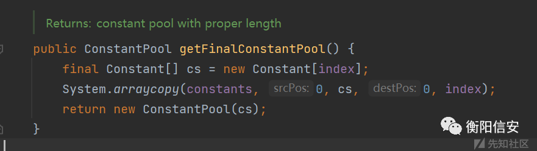  
  
之后通过调用ClassGen的相关API进行接下来的操作  
  
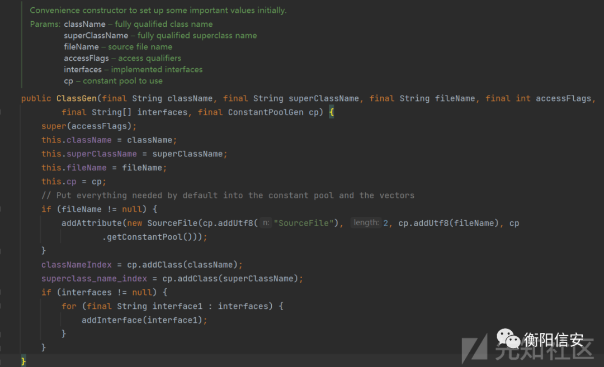  
  
看一下官方给出的关系图  
  
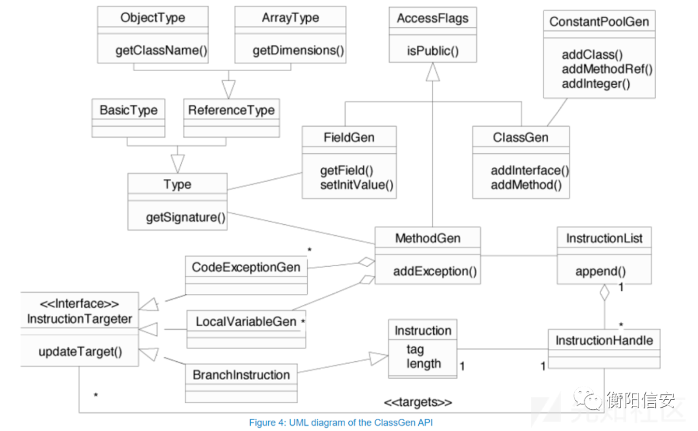  
  
对于漏洞的触发点，我们可以通过查看commit  
  
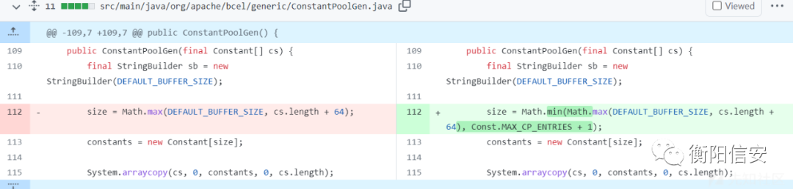  
  
在修复前，在对给定的常量数组进行初始化的时候，并没有限制传入的常量数组cs的大小  
  
只是在默认的BUFFER大小为256和在传入的常量数组长度+64之后去了个最大的值作为了size  
  
如果这时候传入的cs数组+64是大于65535这个临界值的时候将会导致越界漏洞的产生  
  
所以对于漏洞的利用只需要在常量数组中前面写入足够长的垃圾数据，后面写入恶意常量数据，将会在通过getFinalConstantPool方法返回对应的ConstantPool对象之后调用其dump方法从二进制流到文件流的转换  
  
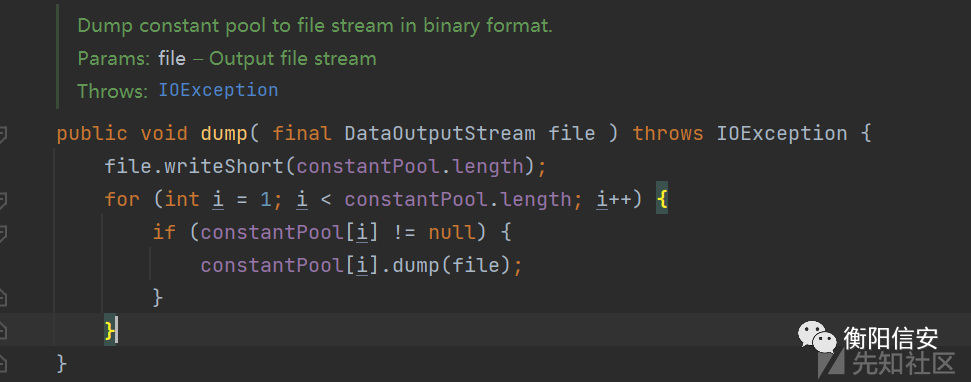  
  
就能够成功写入文件了  
## 漏洞利用  
  
我们可以简单写一个demo来通过Apache Commons BCEL API动态生成一个HelloWorld.class文件  
> 资料补充（非原文复原）：[同题公开镜像](https://www.ctfiot.com/77438.html) 的此处为 `TestBcel` 示例，使用 BCEL 生成并写出 `HelloWorld.class`；原归档未保存示例全文，可在来源的“漏洞利用”小节查阅。相关的 [Apache 官方 HelloWorldBuilder 示例](https://apache.googlesource.com/commons-bcel/+/afb03391864fdb534efb2433a811e54fed8e0c7f/src/examples/HelloWorldBuilder.java) 是另一份代码，不能代替该文的变体。Apache 的 [安全公告](https://commons.apache.org/proper/commons-bcel/security.html) 说明漏洞范围和修复背景，不等同于该示例的验证。
  
运行上面的代码，可以得到一个类文件  
  
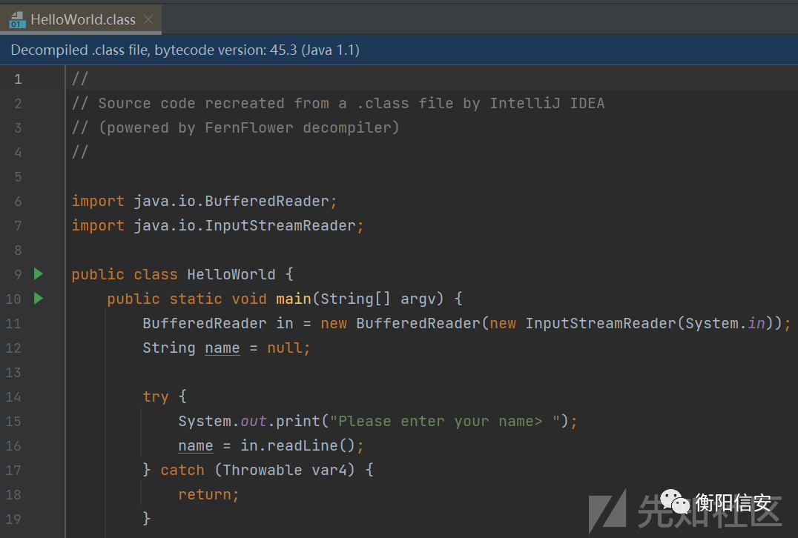  
  
主要是在后面通过cg.getJavaClass.dump中进而调用了ConstantPool#dump方法写入文件  
  
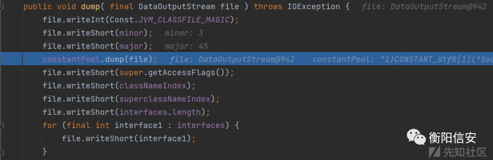  
  
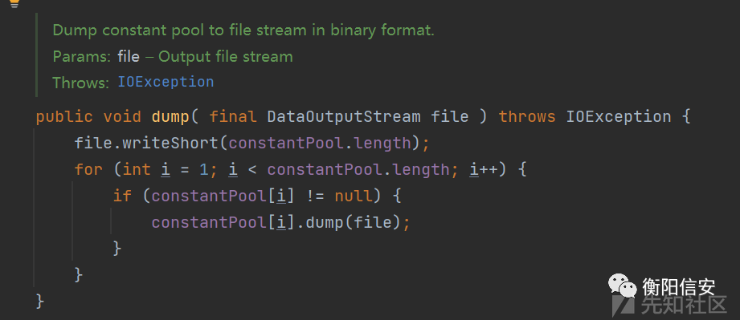  
  
根据上面的描述，如果我们在前面添加一些垃圾数据，将会导致越界写入  
  
我这里通过添加65500个变量来作为垃圾数据进行填充  
> 资料补充（非原文复原）：[同题镜像](https://www.ctfiot.com/77438.html) 此处讨论循环增加局部变量并将引用写入指令列表的示例；归档未保存原代码，请对照来源“漏洞利用”小节。此说明没有重建代码。
  
通过调试，我们可以知道这时候的constantPool.length=65570  
  
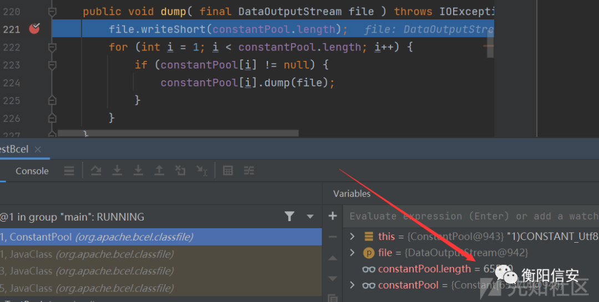  
  
将会导致多余的常量越界写入，这里我就是任意的二进制数据，可以精心构造一个完整的class文件  
  
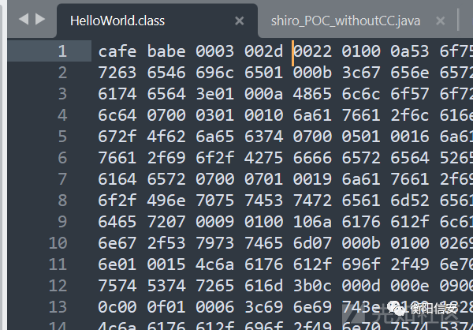  
## 漏洞修复  
  
官方通过增加上限的方式在关键方法增加了判断  
  
比如在ConstantPoolGen的构造方法中初始化常量数组的过程中  
  
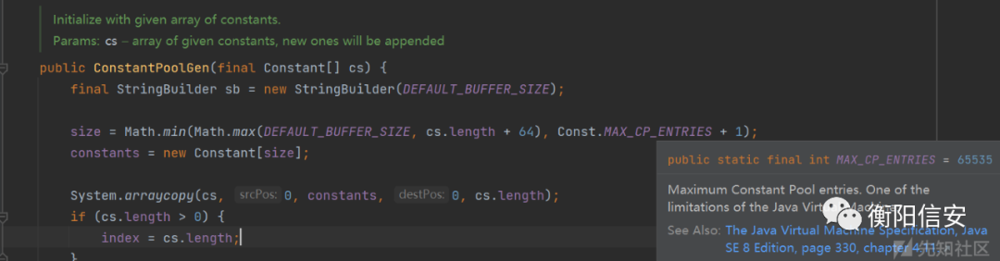  
  
又或者是在adjustSize方法中添加判断  
  
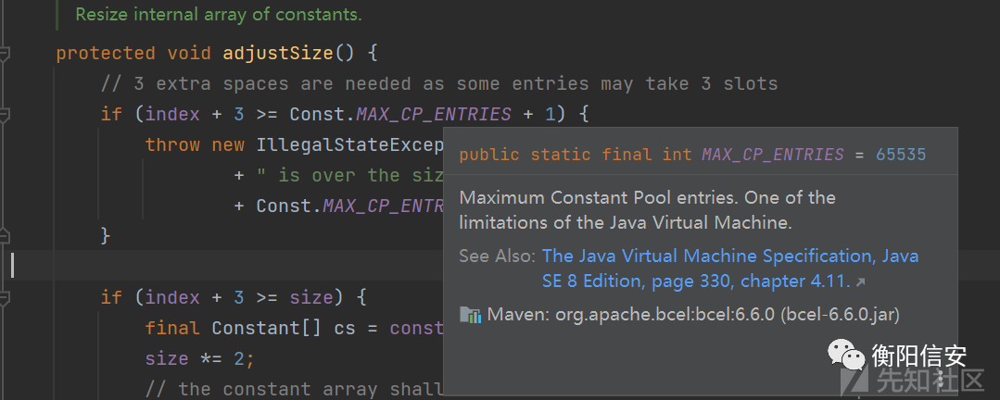  
  
最后在调用dump方法进行转换的时候也进行了限制  
  
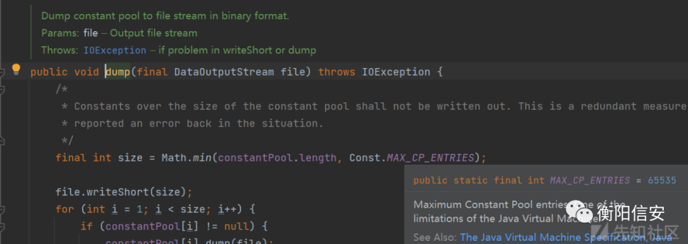  
  
尝试进行写入：  
  
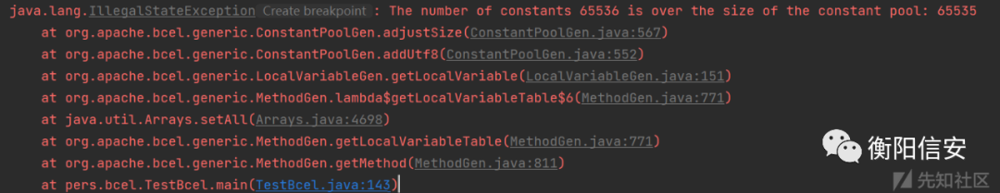  
  
将会抛出异常  
## 总结  
  
虽然这是一个影响范围并不高的CVE，但是还是能从中学到一些东西，善于关注有没有上限下限的限制？或许会有不错的收获  
  
如有侵权，请联系删除  
  
  
  
好文推荐  
  
  
  
  
[红队打点评估工具推荐](http://mp.weixin.qq.com/s?__biz=Mzk0NjE0NDc5OQ==&mid=2247508839&idx=1&sn=abc801070b0e44475887ddbf7273c2e7&chksm=c3087017f47ff901ecb212aadc22c5cbfc6407da79b43a6f48a355cc3fd8c5af79c113db5fd1&scene=21#wechat_redirect)  
  
  
[干货|红队项目日常渗透笔记](http://mp.weixin.qq.com/s?__biz=Mzk0NjE0NDc5OQ==&mid=2247509256&idx=1&sn=76aad07a0f12d44427ce898a6ab2769e&chksm=c3087678f47fff6e2b750f41514d933390a8f97efef8ed18af7d8fb557500009381cd434ec26&scene=21#wechat_redirect)  
  
  
[实战|后台getshell+提权一把梭](http://mp.weixin.qq.com/s?__biz=Mzk0NjE0NDc5OQ==&mid=2247508609&idx=1&sn=f3fcd8bf0e75d43e3f26f4eec448671f&chksm=c30871f1f47ff8e74551b09f092f8673890607257f2d39c0efa314d1888a867dc718cc20b7b3&scene=21#wechat_redirect)  
  
  
[一款漏洞查找器（挖漏洞的有力工具）](http://mp.weixin.qq.com/s?__biz=Mzk0NjE0NDc5OQ==&mid=2247507539&idx=2&sn=317a2c6cab28a61d50b22c07853c9938&chksm=c3080d23f47f8435b31476b13df045abaf358fae484d8fbe1e4dbd2618f682d18ea44d35dccb&scene=21#wechat_redirect)  
  
  
[神兵利器 | 附下载 · 红队信息搜集扫描打点利器](http://mp.weixin.qq.com/s?__biz=Mzk0NjE0NDc5OQ==&mid=2247508747&idx=1&sn=f131b1b522ee23c710a8d169c097ee4f&chksm=c308707bf47ff96dc28c760dcd62d03734ddabb684361bd96d2f258edb0d50e77cdb63a3600a&scene=21#wechat_redirect)  
  
  
[神兵利器 | 分享 直接上手就用的内存马（附下载）](http://mp.weixin.qq.com/s?__biz=Mzk0NjE0NDc5OQ==&mid=2247506855&idx=1&sn=563506565571f1784ad1cb24008bcc06&chksm=c30808d7f47f81c11b8c5f13ce3a0cc14053a77333a251cd6b2d6ba40dc9296074ae3ffd055e&scene=21#wechat_redirect)  
  
  
[推荐一款自动向hackerone发送漏洞报告的扫描器](http://mp.weixin.qq.com/s?__biz=Mzk0NjE0NDc5OQ==&mid=2247501261&idx=1&sn=0ac4d45935842842f32c7936f552ee21&chksm=c30816bdf47f9fab5900c9bfd6cea7b1d99cd32b65baec8006c244f9041b25d080b2f23fd2c1&scene=21#wechat_redirect)  
  
  
  
**关注我，学习网络安全不迷路**  
  
  

---

> 来源：gelusus/wxvl（微信公众号漏洞文章自动归档，原文见文首链接）
