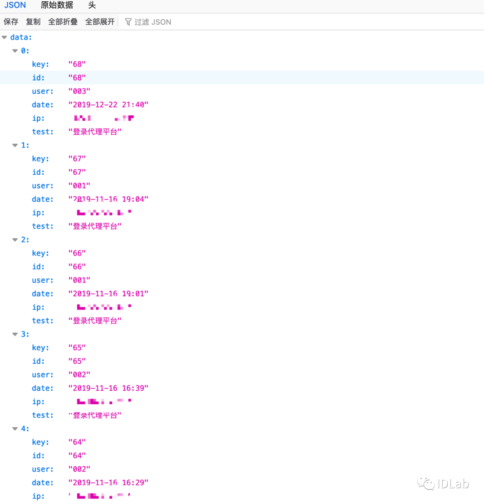

## 核对与使用边界

本文已按保存的全文审阅记录进行文字校订；本轮仅静态核对，未运行 PoC、请求目标或逐图验证。

适用条件与版本记录（来源主张，未列为明确更正的部分仍待权威资料核对）：Absent; alleged unauthenticated request to admin log endpoint

代码与实验材料：One URL and image; no method/headers/cookie-negative control or response excerpt

来源证据范围：Import batch only, original source absent

- **适用与权限边界（1）**：Empty introduction/impact; cannot establish unauthenticated access or affected versions。按此限制解释本文结论，版本相同不足以证明所需角色、入口、配置、依赖或可控参数均已满足；原操作和失败记录一并保留。

- **结论使用边界（2）**：Username/login IP disclosure only, do not generalize to arbitrary data。此项限制直接适用于下文对应结论；现有正文不足以作更宽泛推论，所列方法和原始证据均保留。

历史原文标识：下文原技术材料按来源保留；仅本节明确确认的更正替代相应旧说法，标为待核的观察仍不是事实确认。

# BSPHP 存在未授权访问漏洞

一、漏洞简介
------------

二、漏洞影响
------------

三、复现过程
------------

该处泄漏的用户名和登陆ip。

```
/admin/index.php?m=admin&c=log&a=table_json&json=get&soso_ok=1&t=user_login_log&page=1&limit=10&bsphptime=1600407394176&soso_id=1&soso=&DESC=0
```

