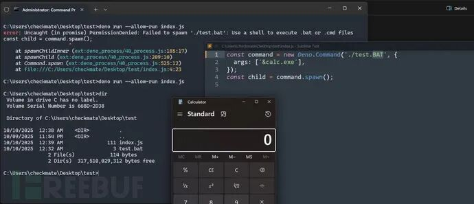

## 核对与使用边界

本文已按保存的全文审阅记录进行文字校订；本轮仅静态核对，未运行 PoC、请求目标或逐图验证。

适用条件与版本记录（来源主张，未列为明确更正的部分仍待权威资料核对）：Fix&gt;=2.6.0 asserted without affected lower bounds; node:crypto lifecycle and Windows BAT/Deno.Command separate conditions

代码与实验材料：No full PoC; crypto secret-recovery claim lacks attack derivation; Windows args snippet only

来源证据范围：SecurityOnline source; no Deno advisories or patches

- **适用与权限边界（1）**：API return/state description and inference to key recovery require primary-source verification；依据：cipher.final()产生仍活动的Cipheriv对象。按此限制解释本文结论，版本相同不足以证明所需角色、入口、配置、依赖或可控参数均已满足；原操作和失败记录一并保留。

- **适用与权限边界（2）**：Windows permission/batch restriction explanation and run-permission preconditions underspecified。按此限制解释本文结论，版本相同不足以证明所需角色、入口、配置、依赖或可控参数均已满足；原操作和失败记录一并保留。

历史原文标识：下文原技术材料按来源保留；仅本节明确确认的更正替代相应旧说法，标为待核的观察仍不是事实确认。

#  Deno曝出高危漏洞可导致密钥泄露与任意代码执行  
 FreeBuf   2026-01-19 10:32  
  
  
  
  
  
  
以"默认安全"架构著称的现代 JavaScript/TypeScript 运行时 Deno 近日曝出两个重大安全漏洞。这些漏洞分别影响运行时的加密兼容性和 Windows 平台命令执行功能，可能导致服务器敏感密钥泄露并允许攻击者执行任意代码。  
  
  
**Part01**  
## 加密模块漏洞（CVE-2026-22863）  
  
  
其中最严重的 CVE-2026-22863 漏洞 CVSS 评分高达 9.2，存在于 Deno 的 node:crypto 兼容层中——该模块旨在让 Deno 能够运行为 Node.js 编写的代码。  
  
  
根据安全公告，node:crypto 实现未能正确终止加密操作。在标准加密流程中，final() 方法本应结束加密过程并清理状态。但在受影响版本中，该方法会使加密流保持开启状态，实质上允许"无限加密"。  
  
  
报告指出，这种状态管理缺陷"可能导致暴力破解尝试，以及更精细的攻击手段以获取服务器密钥"。分析报告中提供的 PoC 显示，调用 cipher.final() 会产生一个仍保持活动状态且内部缓冲可访问的 Cipheriv 对象，而非预期的已关闭 CipherBase 对象。  
  
  
**Part02**  
## Windows 命令执行漏洞（CVE-2026-22864）  
  
  
第二个漏洞 CVE-2026-22864 影响 Deno 在 Windows 平台创建子进程的能力。分析报告详细描述了通过 Deno.Command API 执行批处理文件时"绕过已修复漏洞"的方法。  
  
  
Deno 本应具备防止子进程注入攻击的安全机制。当用户尝试直接运行 .bat 文件时，Deno 通常会抛出 PermissionDenied 错误，提示开发者"使用 shell 执行 bat 或 cmd 文件"以确保参数安全处理。  
  
  
但研究人员发现可通过修改文件扩展名大小写（特别是.BAT）或操纵命令参数来绕过限制。报告中的 PoC 截图显示，攻击者能通过在批处理文件执行环境中注入参数（args: ["&calc.exe"]）成功运行 calc.exe（Windows 计算器），实现在主机上执行任意代码。  
  
  
**Part03**  
## 修复建议  
  
  
用户应立即升级至 Deno v2.6.0 或更高版本以修复这些漏洞。  
  
  
**参考来源：**  
  
Critical Deno Flaws Risk Secrets (CVE-2026-22863) & Execution (CVE-2026-22864)  
  
https://securityonline.info/critical-deno-flaws-risk-secrets-cve-2026-22863-execution-cve-2026-22864/  
  
  
###   
###   
###   
  
**推荐阅读**  
  
  
###   
### 电台讨论  
  
****  
  
  
****  
  
  
  
  

---

> 来源：gelusus/wxvl（微信公众号漏洞文章自动归档，原文见文首链接）
