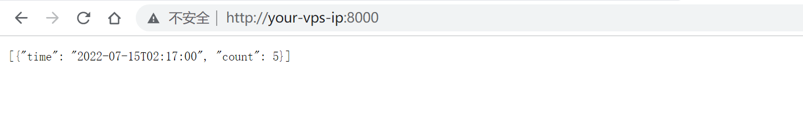
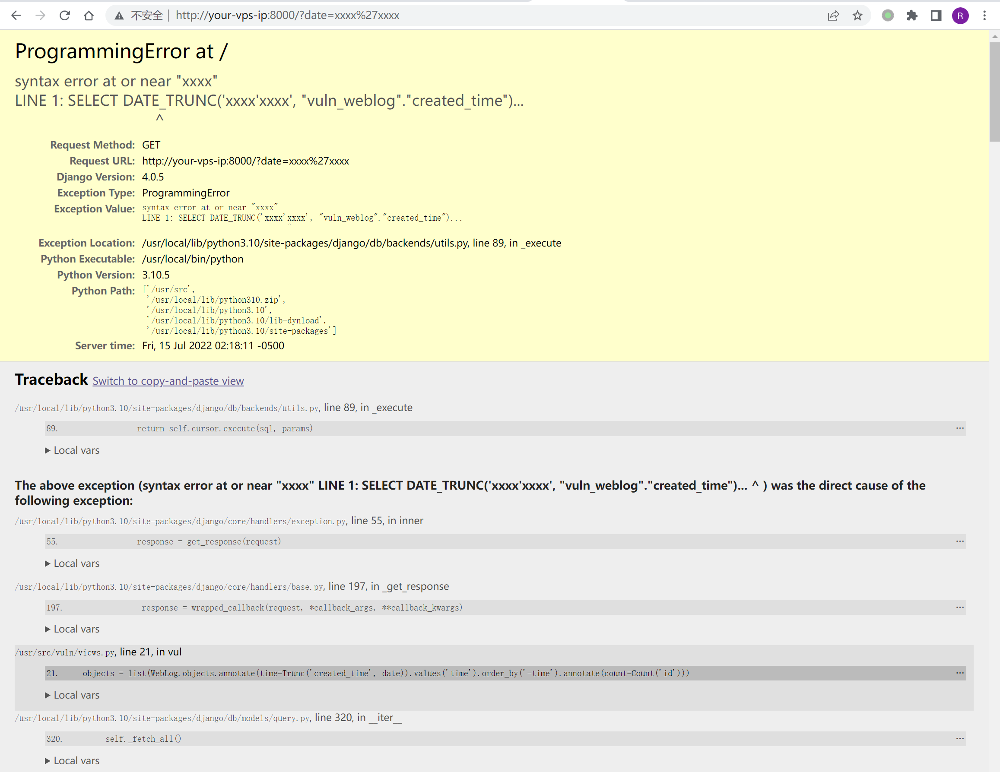

## 核对与使用边界

本文已按保存的全文审阅记录进行文字校订；本轮仅静态核对，未运行 PoC、请求目标或逐图验证。

适用条件与版本记录（来源主张，未列为明确更正的部分仍待权威资料核对）：Test4.0.5; date passed to Trunc kind; version metadata is docker-compose up -d

代码与实验材料：Minute baseline and quote-error probe; no successful data result; Extract named but not demonstrated

来源证据范围：Official July4,2022 announcement

- **事实待核（1）**：Version frontmatter contains shell command。该项尚不能从转载本身确定外部事实；下文相应编号、版本或修复说法只作为来源记录，不能据此判定部署受影响或已修复。明确更正另列于本节。

- **证据待核（2）**：Quote error alone insufficient proof; missing view and branch matrix。保留原引用、截图位置和实验叙述；本项所缺材料未被补造，截图存在或作者宣称成功都不等于已核验其内容。

历史原文标识：下文原技术材料按来源保留；仅本节明确确认的更正替代相应旧说法，标为待核的观察仍不是事实确认。

# Django Trunc(kind) and Extract(lookup_name) SQL 注入漏洞 CVE-2022-34265

## 漏洞描述

Django 在 2022 年 7 月 4 日发布了安全更新，修复了在数据库函数 `Trunc()` 和 `Extract()` 中存在的 SQL 注入漏洞。

参考链接：

- https://www.djangoproject.com/weblog/2022/jul/04/security-releases/

## 漏洞环境

启动一个 Django 4.0.5 版本的服务器：

```
docker-compose up -d
```

环境启动后，你可以在 `http://your-ip:8000` 看到一个页面。这个页面使用了 Trunc 函数来聚合页面点击数量，比如使用 `http://your-ip:8000/?date=minute` 即可看到按照分钟聚合的点击量：




## 漏洞复现

修改 `date` 参数即可复现 SQL 注入漏洞：

```
http://your-ip:8000/?date=xxxx'xxxx
```




---

> 来源：Threekiii/Vulnerability-Wiki（https://github.com/Threekiii/Vulnerability-Wiki）
