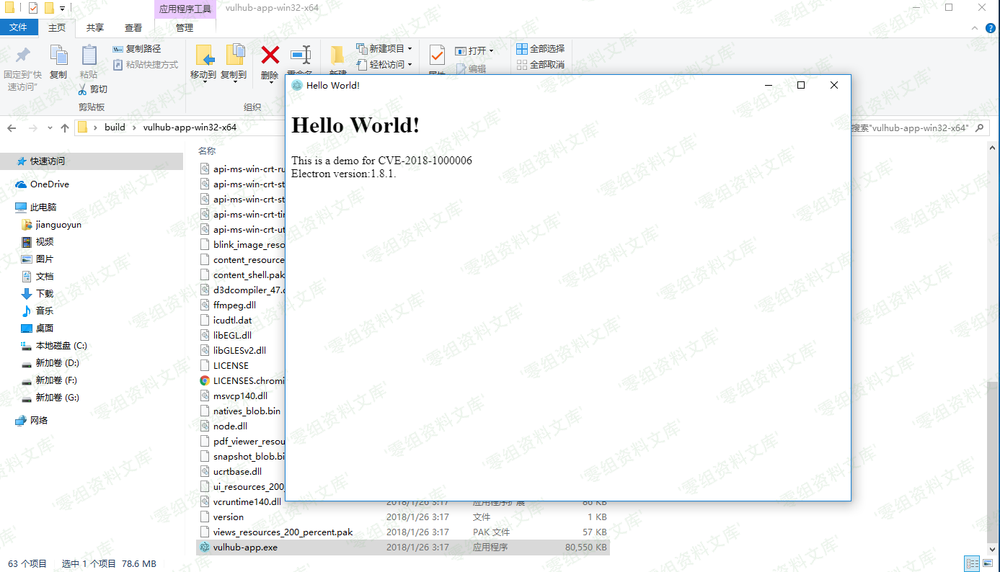
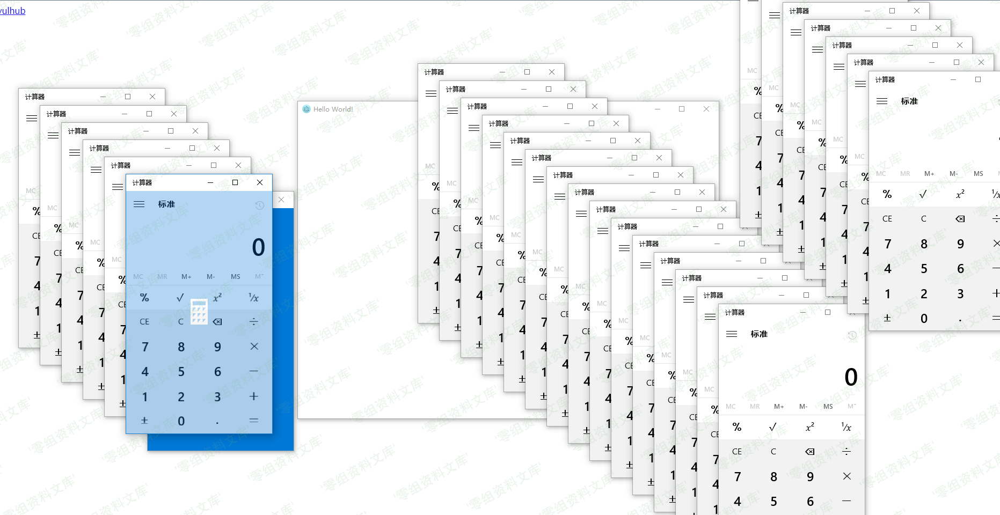

## 核对与使用边界

本文已按保存的全文审阅记录进行文字校订；本轮仅静态核对，未运行 PoC、请求目标或逐图验证。

适用条件与版本记录（来源主张，未列为明确更正的部分仍待权威资料核对）：Claims&lt;1.8.2-beta.4; test1.7.8; Windows registered handler and victim clicking link, browser-dependent

代码与实验材料：Build/start commands and packaged demo repo; actual protocol payload only linked page/screenshots

来源证据范围：ianxtianxt demo repo; no official advisory; third-party Electron mirror

- **事实待核（1）**：Incomplete branch version matrix, missing literal protocol payload and browser tested version。该项尚不能从转载本身确定外部事实；下文相应编号、版本或修复说法只作为来源记录，不能据此判定部署受影响或已修复。明确更正另列于本节。

- **代码与转录边界（2）**：Hard-coded0-sec host, malformed duplicated image suffixes。相应原代码作为存在此问题的历史样本保留，不能直接当作可运行、成功复现的 PoC；缺失内容需回原稿核对，不据此补造可执行攻击链。

历史原文标识：下文原技术材料按来源保留；仅本节明确确认的更正替代相应旧说法，标为待核的观察仍不是事实确认。

（CVE-2018-1000006）Electron 远程命令执行漏洞
=============================================

一、漏洞简介
------------

在Windows下，如果Electron开发的应用注册了Protocol
Handler（允许用户在浏览器中召起该应用），则可能出现一个参数注入漏洞，并最终导致在用户侧执行任意命令。

二、漏洞影响
------------

Electron \< v1.8.2-beta.4

三、复现过程
------------

### 编译APP

执行如下命令编译一个包含漏洞的应用：

    docker-compose run -e ARCH=64 --rm electron

上述命令中，因为软件需要在Windows平台上运行，所以需要设置ARCH的值为平台的位数：32或64。

编译完成后，再执行如下命令，启动web服务：

    docker-compose run --rm -p 8080:80 web

此时，访问`http://www.0-sec.org:8080/`即可看到POC页面。

### 漏洞复现

首先，在POC页面，点击第一个链接，下载编译好的软件`vulhub-app.tar.gz`。下载完成后解压，并运行一次：

Electron远程命令执行漏洞/media/rId26.png)

这一次将注册Protocol Handler。

然后，再回到POC页面，点击第二个链接，将会弹出目标软件和计算器：

Electron远程命令执行漏洞/media/rId27.png)

> 如果没有成功，可能是浏览器原因。经测试，新版Chrome浏览器点击POC时，会召起vulhub-app，但不会触发该漏洞。

### POC

可以直接使用 elec\_rce\\elec\_rce-win32-x64\\elec\_rce.exe

也可以自己打包成exe应用,生成有漏洞的版本应用，以版本1.7.8为例：

    electron-packager ./test elec_rce --win --out ./elec_rce --arch=x64 --version=0.0.1 --electron-version=1.7.8 --download.mirror=https://npm.taobao.org/mirrors/electron/

https://github.com/ianxtianxt/CVE-2018-1000006-DEMO
