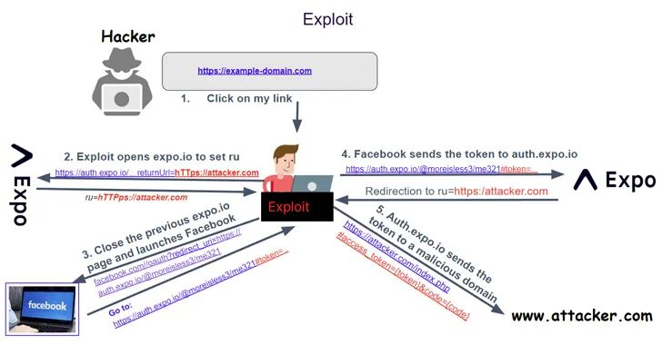

## 核对与使用边界

本文已按保存的全文审阅记录进行文字校订；本轮仅静态核对，未运行 PoC、请求目标或逐图验证。

适用条件与版本记录（来源主张，未列为明确更正的部分仍待权威资料核对）：No SDK/package range; applies proxy configuration; server patch reportedlyFebruary18,2023; click required

代码与实验材料：No PoC; token exfiltration described at high level

来源证据范围：Salt Labs/Expo cited without links

- **证据待核（1）**：Provider-account total takeover/any actions overstates token-scoped permissions absent evidence。保留原引用、截图位置和实验叙述；本项所缺材料未被补造，截图存在或作者宣称成功都不等于已核验其内容。

- **证据待核（2）**：Missing advisory/disclosure links and configuration-specific migration detail。保留原引用、截图位置和实验叙述；本项所缺材料未被补造，截图存在或作者宣称成功都不等于已核验其内容。

历史原文标识：下文原技术材料按来源保留；仅本节明确确认的更正替代相应旧说法，标为待核的观察仍不是事实确认。

#  开源平台Expo Framework 曝出高危漏洞，攻击者可劫持海量账户   
 安全客   2023-05-30 11:52  
  
近日，安全专家披露，Expo 框架中存在一个高危的OAuth安全漏洞( CVE-2023-28131 ，CVSS评分为9.6)，可被攻击者利用来劫持窃取各类在线服务中的用户数据。  
  
使用 Expo 的站点和应用程序如果使用的是 Google 和 Facebook 等第三方提供商为单点登录 (SSO) 配置 AuthSession 代理设置，攻击者就可以利用该漏洞劫持受害用户在各种平台（例如 Facebook、Google 或 Twitter）的账户，执行任意操作。  
  
Expo 类似于 Electron，是一个开源平台，用于开发在 Android、iOS 和 Web 上运行的通用原生应用程序。Expo使开发人员能够使用单一代码库创建原生 iOS、Android 和 Web 应用程序。该平台具有一系列旨在简化和加快开发过程的工具、库和服务。  
  
  
  
换句话说，可以利用该漏洞将与登录提供商（例如 Facebook）关联的秘密令牌发送到参与者控制的域，并使用它来夺取对受害者帐户的控制权。  
  
反过来，这是通过诱使目标用户点击特制链接来实现的，该链接可以通过电子邮件、短信或可疑网站等传统社会工程载体发送。  
  
依赖此框架的服务容易受到凭据泄露的影响，并且可能允许对客户账户进行大规模账户接管 (ATO)，可能会影响使用 Facebook、Google、Apple 或 Twitter 帐户使用 Expo 登录在线服务的任何人。  
  
Salt Security 的研究机构 Salt Labs 解释说，在发现该漏洞后，它立即将其披露给 Expo，Expo迅速修复了该漏洞。  
  
Expo 在一份公告中表示，它在 2023 年 2 月 18 日负责任地披露后数小时内部署了一个修补程序。还建议用户从使用AuthSession API 代理迁移到直接向第三方身份验证提供商注册深层链接 URL 方案以启用 SSO 功能.  
  
  
值得一提的是，该漏洞是在 Expo 的开放授权 (OAuth) 社交登录功能的实施方式中发现的。 安全专家表示，随着 OAuth 迅速成为行业常态，恶意人士不断寻找其中的安全漏洞。  
  
“OAuth 的错误实施可能会对公司和客户产生重大影响，因为他们会暴露宝贵的数据，而且组织必须随时了解其平台中存在的安全风险。”  
  
  

---

> 来源：gelusus/wxvl（微信公众号漏洞文章自动归档，原文见文首链接）
