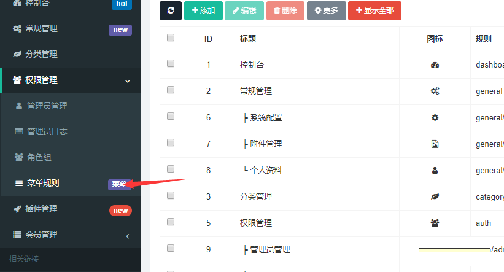
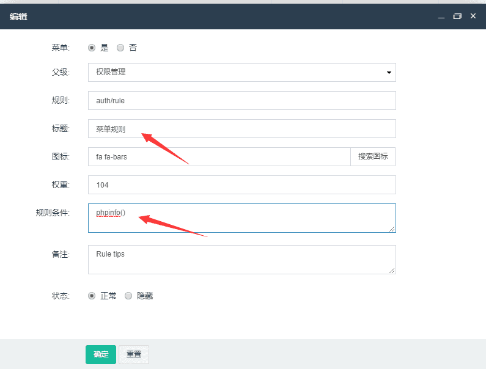
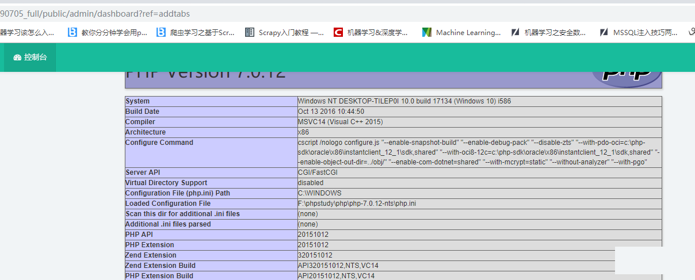
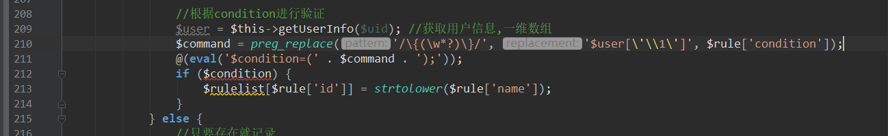

## 核对与使用边界

本文已按保存的全文审阅记录进行文字校订；本轮仅静态核对，未运行 PoC、请求目标或逐图验证。

适用条件与版本记录（来源主张，未列为明确更正的部分仍待权威资料核对）：Unknown; superadmin modification then low-privileged login

代码与实验材料：All actual payload/sink evidence screenshots; no literal code

来源证据范围：zhihuifly topic672

- **适用与权限边界（1）**：Needs superadmin first; must establish security boundary rather than imply privilege escalation from ordinary user。按此限制解释本文结论，版本相同不足以证明所需角色、入口、配置、依赖或可控参数均已满足；原操作和失败记录一并保留。

- **事实待核（2）**：Empty affected version, no patch/source API or textual rule。该项尚不能从转载本身确定外部事实；下文相应编号、版本或修复说法只作为来源记录，不能据此判定部署受影响或已修复。明确更正另列于本节。

历史原文标识：下文原技术材料按来源保留；仅本节明确确认的更正替代相应旧说法，标为待核的观察仍不是事实确认。

# FastAdmin 后台 auth\_rule 权限认证getshell

一、漏洞简介
------------

fastadmin对超管开放修改auth\_rule表的权限，造成权限认证时，能触发代码执行

二、漏洞影响
------------

三、复现过程
------------

### 首先，需要超管权限进入后台，选择权限管理，进入菜单规则

### 这里选择菜单规则，修改他的规则条件

### 保存，然后退出登录，选择一个低权限的用户登录

### TP3的代码移植到了TP5，: )

参考链接
--------

> https://www.zhihuifly.com/t/topic/672
