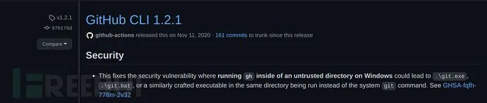
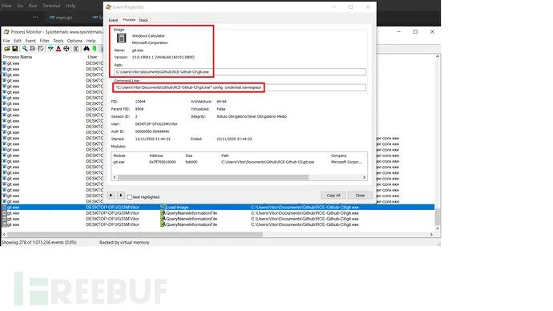
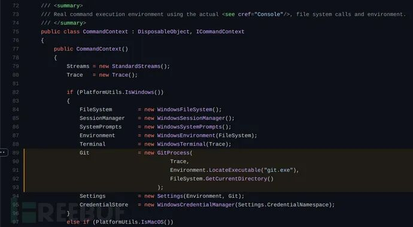
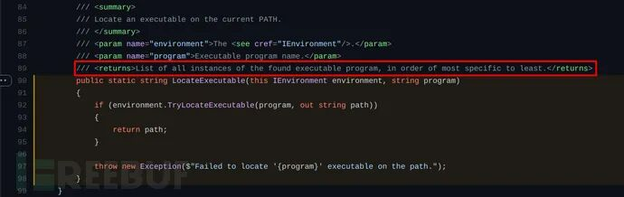
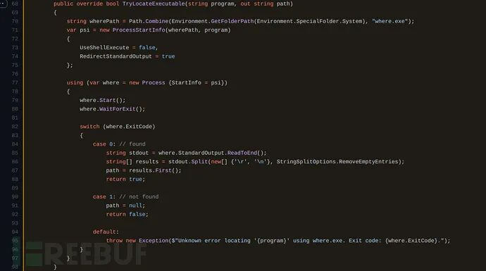
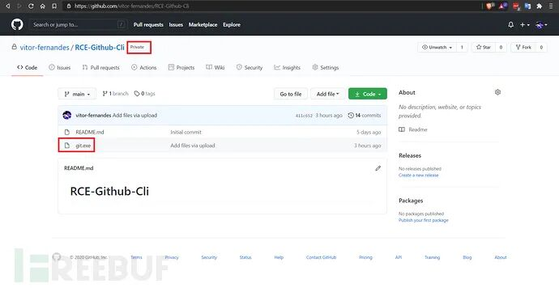
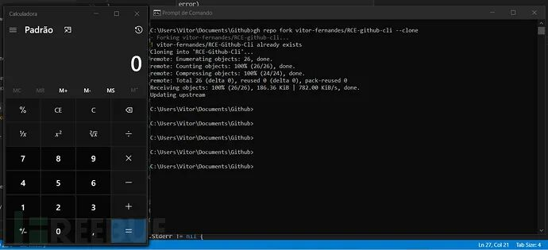

## 核对与使用边界

本文已按保存的全文审阅记录进行文字校订；本轮仅静态核对，未运行 PoC、请求目标或逐图验证。

适用条件与版本记录（来源主张，未列为明确更正的部分仍待权威资料核对）：GCM Core&lt;=2.0.280; discussesgh1.2.1 safeexec bypass; Windows private repo fork/clone; fix absent

代码与实验材料：Source path/sink narrative and gh repo fork --clone; actual code screenshots; executable name instruction says exe but restgit.exe

来源证据范围：Official GCM GHSA, Blaze researcher blog, NVD

- **适用与权限边界（1）**：Git command line equated togh and component scopes merged; defaultgitclone not recursively cloning without option。按此限制解释本文结论，版本相同不足以证明所需角色、入口、配置、依赖或可控参数均已满足；原操作和失败记录一并保留。

- **结论使用边界（2）**：Victim fork web action alone not trigger; must runCLIclone; typo executable name and emdash option; no fixes。此项限制直接适用于下文对应结论；现有正文不足以作更宽泛推论，所列方法和原始证据均保留。

历史原文标识：下文原技术材料按来源保留；仅本节明确确认的更正替代相应旧说法，标为待核的观察仍不是事实确认。

# GIT 命令行工具远程代码执行漏洞分析

<meta name="referrer" content="no-referrer"/>

> 本文由 [简悦 SimpRead](http://ksria.com/simpread/) 转码， 原文地址 [mp.weixin.qq.com](https://mp.weixin.qq.com/s/972fmkQM1YpKhFCeAj-lwg)

介绍
--

在这篇文章中，我们将会详细介绍漏洞 CVE-2020-26233。这个漏洞将影响 Windows 平台下 GitHub CLI 工具中 Git 凭证管理器核心 v2.0.280 及其之前所有版本的 GIT 命令行工具（也被称为 gh），而且一旦成功利用，攻击者将能够在供应链攻击中使用该漏洞，并攻击全球数百万的软件开发人员。

问题描述
----

在此之前，我们曾讨论过 GitHub 桌面端的远程代码执行问题，但这一次受影响的组件则是 Git 凭证管理器核心。

默认配置下，当 Git 克隆带有子模块的代码库时，它首先克隆代码库的顶层（根目录），然后递归地克隆子模块。但是在这样做时，它会从顶级目录中启动一个新的 Git 进程。

如果一个名为 git.exe 的恶意程序被存放在了代码库根目录下，那么当程序尝试读取配置信息时，Git 凭证管理器核心将调用此二进制文件。克隆过程正常进行，并且没有可见的迹象表明运行了恶意二进制文件而不是原始 git 可执行文件。

自从我们在 2020 年 11 月发布第一份报告以来，Github 创建了一个 SafeExec 库，以减轻 Windows 中二进制文件搜索顺序不一致带来的风险。

简要回顾一下，Windows 首先检查当前文件夹中是否存在给定的二进制文件，只有在找不到该二进制文件时，才会遍历 %PATH% 环境变量中的目录，直到找到目标可执行文件。

在 gh 的 v1.2.1 版本中，引入了一个 safeexec.LookPath 函数，当通过滥用 Windows 路径搜索顺序克隆新存储库时，可以阻止远程代码执行。

在仔细研究之后，我们的安全工程师 Vitor Fernandes 发现了一个绕过方法，这样就可以利用它来实现远程代码执行了。

在漏洞发现过程中，我们发现在 fork 一个新的私有存储库时，仍然可能出现远程代码执行场景。因为在克隆命令执行之后，并不会通过 safeexec.LookPath 函数来调用 “git.exe config credential.namespace”。因此，所以 Windows 将返回到其默认值并搜索 git.exe 文件当前克隆存储库中的二进制文件：

下面给出的是 src/shared/Microsoft.Git.CredentialManager/CommandContext.cs 中的代码：

我们可以看到，在第 89 行代码处，将创建一个新的进程来搜索 git.exe，而 “Environment.LocateExecutable(‘git.exe’)” 将作为目录路径参数传递给 GitProcess()函数。

下图显示的是 Environment.LocateExecutable() 函数代码：

/src/shared/Microsoft.Git.CredentialManager/EnvironmentBase.cs

函数 environment.TryLocateExecutable 的代码可以在【阅读原文】找到：

在使用 Windows 的实用工具 where.exe 时，它将会返回所有出现的文件或命令，包括 %PATH% 和当前目录的值。

漏洞利用
----

下面给出的是针对该漏洞的漏洞利用步骤：

> 创建一个新的代码库，或向现有代码库中添加文件；
> 
> 向这个代码库中上传一个 Windows 可执行文件，然后将其重命名为 exe；
> 
> 等待目标用户 fork 这个代码库；
> 
> 然后成功拿到 Shell；

在下面的例子中，我们将 calc.exe 重命名为了 git.exe，并将其上传到目标代码库中：

Fork 代码库并执行 “gh repo fork REPOSITORY_NAME —clone” 命令之后，目标设备将弹出计算器程序：

参考资料
----

> https://github.com/microsoft/Git-Credential-Manager-Core/security/advisories/GHSA-2gq7-ww4j-3m76
> 
> https://blog.blazeinfosec.com/attack-of-the-clones-github-desktop-remote-code-execution
> 
> https://superuser.com/questions/897644/how-does-windows-decide-which-executable-to-run
> 
> https://stackoverflow.com/questions/304319/is-there-an-equivalent-of-which-on-the-windows-command-line
> 
> https://nvd.nist.gov/vuln/detail/CVE-2020-26233

 交易担保 FreeBuf+ FreeBuf + 小程序：把安全装进口袋 小程序

精彩推荐

  

  

  

  

********

****************************

---

> 来源：MrWQ/vulnerability-paper（https://github.com/MrWQ/vulnerability-paper）
