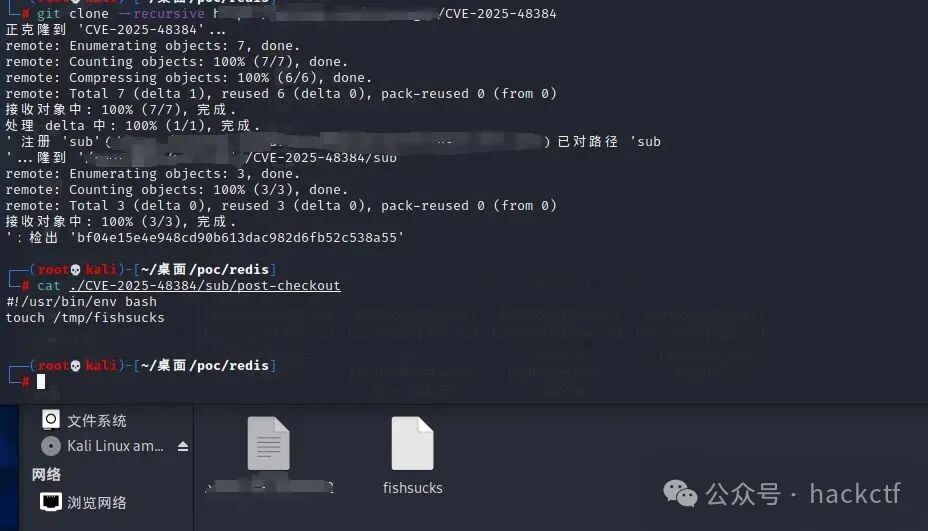

## 核对与使用边界

- 明确更正：安全阈值必须按维护分支解释：2.43.7、2.44.4、2.45.4、2.46.4、2.47.3、2.48.2、2.49.1、2.50.1 分别属于各自分支，不能把 `Git >= 2.43.7` 当作所有更高分支安全。原阈值对应的官方发布/回补应逐分支核对。
- 执行位置：恶意仓库递归克隆由哪个客户端或 CI runner 执行，代码就处于该进程权限下；不能直接外推托管 Git 服务端被执行。

本文已按保存的全文审阅记录进行文字校订；本轮仅静态核对，未运行 PoC、请求目标或逐图验证。

适用条件与版本记录（来源主张，未列为明确更正的部分仍待权威资料核对）：Branch fixes2.43.7/44.4/45.4/46.4/47.3/48.2/49.1/50.1; recursive clone attacker repo; symlink/hook specifics not detailed

代码与实验材料：Vendor reproduced claim image-only; advisory not full lab

来源证据范围：Official Git GHSA and dgl researcher article

- **事实待核（1）**：Unbounded safe range includes vulnerable later branches; use per-branch intervals；依据：Safe versions Git&gt;=2.43.7 followed by branch-specific thresholds。该项尚不能从转载本身确定外部事实；下文相应编号、版本或修复说法只作为来源记录，不能据此判定部署受影响或已修复。明确更正另列于本节。

- **结论使用边界（2）**：Remote code runs clone client/runner, not necessarily server; publicPoC/EXP status needs date retained。此项限制直接适用于下文对应结论；现有正文不足以作更宽泛推论，所列方法和原始证据均保留。

历史原文标识：下文原技术材料按来源保留；仅本节明确确认的更正替代相应旧说法，标为待核的观察仍不是事实确认。

#  Git 远程代码执行漏洞预警(CVE-2025-48384)  
奇安信CERT  TtTeam   2025-07-10 08:18  
  
●   
点击↑蓝字关注我们，获取更多安全风险通告  
  
  
<table><tbody><tr style="margin: 0px;padding: 0px;outline: 0px;max-width: 100%;visibility: visible;box-sizing: border-box !important;overflow-wrap: break-word !important;"><td colspan="4" data-colwidth="136,157,169,95" valign="middle" align="center" style="margin: 0px;padding: 5px 10px;outline: 0px;word-break: break-all;hyphens: auto;border: 1px solid rgb(70, 118, 217);max-width: 100%;background-color: rgb(70, 118, 217);visibility: visible;overflow-wrap: break-word !important;box-sizing: border-box !important;">
<strong style="margin: 0px;padding: 0px;outline: 0px;max-width: 100%;visibility: visible;box-sizing: border-box !important;overflow-wrap: break-word !important;">漏洞概述</strong> 
</td></tr><tr style="margin: 0px;padding: 0px;outline: 0px;max-width: 100%;visibility: visible;box-sizing: border-box !important;overflow-wrap: break-word !important;"><td data-colwidth="136" width="136" valign="middle" align="left" style="margin: 0px;padding: 5px 10px;outline: 0px;word-break: break-all;hyphens: auto;border: 1px solid rgb(70, 118, 217);max-width: 100%;visibility: visible;overflow-wrap: break-word !important;box-sizing: border-box !important;">
<strong style="margin: 0px;padding: 0px;outline: 0px;max-width: 100%;visibility: visible;box-sizing: border-box !important;overflow-wrap: break-word !important;">漏洞名称</strong>
</td><td colspan="3" data-colwidth="157,169,95" valign="middle" align="left" style="margin: 0px;padding: 5px 10px;outline: 0px;word-break: break-all;hyphens: auto;border: 1px solid rgb(70, 118, 217);max-width: 100%;visibility: visible;overflow-wrap: break-word !important;box-sizing: border-box !important;">
Git 远程代码执行漏洞
</td></tr><tr style="margin: 0px;padding: 0px;outline: 0px;max-width: 100%;visibility: visible;box-sizing: border-box !important;overflow-wrap: break-word !important;"><td data-colwidth="136" width="136" valign="middle" align="left" style="margin: 0px;padding: 5px 10px;outline: 0px;word-break: break-all;hyphens: auto;border: 1px solid rgb(70, 118, 217);max-width: 100%;visibility: visible;overflow-wrap: break-word !important;box-sizing: border-box !important;">
<strong style="margin: 0px;padding: 0px;outline: 0px;max-width: 100%;visibility: visible;box-sizing: border-box !important;overflow-wrap: break-word !important;">漏洞编号</strong>
</td><td colspan="3" data-colwidth="157,169,95" valign="middle" align="left" style="margin: 0px;padding: 5px 10px;outline: 0px;word-break: break-all;hyphens: auto;border: 1px solid rgb(70, 118, 217);max-width: 100%;visibility: visible;overflow-wrap: break-word !important;box-sizing: border-box !important;">
QVD-2025-26674,CVE-2025-48384
</td></tr><tr style="margin: 0px;padding: 0px;outline: 0px;max-width: 100%;visibility: visible;box-sizing: border-box !important;overflow-wrap: break-word !important;"><td data-colwidth="136" width="136" valign="middle" align="left" style="margin: 0px;padding: 5px 10px;outline: 0px;word-break: break-all;hyphens: auto;border: 1px solid rgb(70, 118, 217);max-width: 100%;visibility: visible;overflow-wrap: break-word !important;box-sizing: border-box !important;">
<strong style="margin: 0px;padding: 0px;outline: 0px;max-width: 100%;visibility: visible;box-sizing: border-box !important;overflow-wrap: break-word !important;">公开时间</strong>
</td><td data-colwidth="157" width="157" valign="middle" align="left" style="margin: 0px;padding: 5px 10px;outline: 0px;word-break: break-all;hyphens: auto;border: 1px solid rgb(70, 118, 217);max-width: 100%;visibility: visible;overflow-wrap: break-word !important;box-sizing: border-box !important;">
2025-07-08
</td><td data-colwidth="169" width="169" valign="middle" align="left" style="margin: 0px;padding: 5px 10px;outline: 0px;word-break: break-all;hyphens: auto;border: 1px solid rgb(70, 118, 217);max-width: 100%;visibility: visible;overflow-wrap: break-word !important;box-sizing: border-box !important;">
<strong style="margin: 0px;padding: 0px;outline: 0px;max-width: 100%;visibility: visible;box-sizing: border-box !important;overflow-wrap: break-word !important;">影响量级</strong>
</td><td data-colwidth="95" width="95" valign="middle" align="left" style="margin: 0px;padding: 5px 10px;outline: 0px;word-break: break-all;hyphens: auto;border: 1px solid rgb(70, 118, 217);max-width: 100%;visibility: visible;overflow-wrap: break-word !important;box-sizing: border-box !important;">
万级
</td></tr><tr style="margin: 0px;padding: 0px;outline: 0px;max-width: 100%;visibility: visible;box-sizing: border-box !important;overflow-wrap: break-word !important;"><td data-colwidth="136" width="136" valign="middle" align="left" style="margin: 0px;padding: 5px 10px;outline: 0px;word-break: break-all;hyphens: auto;border: 1px solid rgb(70, 118, 217);max-width: 100%;visibility: visible;overflow-wrap: break-word !important;box-sizing: border-box !important;">
<strong style="margin: 0px;padding: 0px;outline: 0px;max-width: 100%;visibility: visible;box-sizing: border-box !important;overflow-wrap: break-word !important;">奇安信评级</strong>
</td><td data-colwidth="157" width="157" valign="middle" align="left" style="margin: 0px;padding: 5px 10px;outline: 0px;word-break: break-all;hyphens: auto;border: 1px solid rgb(70, 118, 217);max-width: 100%;visibility: visible;overflow-wrap: break-word !important;box-sizing: border-box !important;">
<strong style="margin: 0px;padding: 0px;cursor: text;color: rgb(0, 0, 0);caret-color: rgb(255, 0, 0);font-family: 微软雅黑, &#34;Microsoft YaHei&#34;, sans-serif;visibility: visible;max-width: 100%;max-inline-size: 100%;outline: none 0px !important;box-sizing: border-box !important;overflow-wrap: break-word !important;">高危</strong>
</td><td data-colwidth="169" width="169" valign="middle" align="left" style="margin: 0px;padding: 5px 10px;outline: 0px;word-break: break-all;hyphens: auto;border: 1px solid rgb(70, 118, 217);max-width: 100%;visibility: visible;overflow-wrap: break-word !important;box-sizing: border-box !important;">
<strong style="margin: 0px;padding: 0px;outline: 0px;max-width: 100%;visibility: visible;box-sizing: border-box !important;overflow-wrap: break-word !important;"><strong style="margin: 0px;padding: 0px;cursor: text;color: rgb(0, 0, 0);caret-color: rgb(255, 0, 0);font-family: 微软雅黑, &#34;Microsoft YaHei&#34;, sans-serif;visibility: visible;max-width: 100%;max-inline-size: 100%;outline: none 0px !important;box-sizing: border-box !important;overflow-wrap: break-word !important;">CVSS 3.1分数</strong></strong>
</td><td data-colwidth="95" width="95" valign="middle" align="left" style="margin: 0px;padding: 5px 10px;outline: 0px;word-break: break-all;hyphens: auto;border: 1px solid rgb(70, 118, 217);max-width: 100%;visibility: visible;overflow-wrap: break-word !important;box-sizing: border-box !important;">
<strong style="margin: 0px;padding: 0px;outline: 0px;max-width: 100%;visibility: visible;box-sizing: border-box !important;overflow-wrap: break-word !important;">8.0</strong>
</td></tr><tr style="margin: 0px;padding: 0px;outline: 0px;max-width: 100%;visibility: visible;box-sizing: border-box !important;overflow-wrap: break-word !important;"><td data-colwidth="136" width="136" valign="middle" align="left" style="margin: 0px;padding: 5px 10px;outline: 0px;word-break: break-all;hyphens: auto;border: 1px solid rgb(70, 118, 217);max-width: 100%;visibility: visible;overflow-wrap: break-word !important;box-sizing: border-box !important;">
<strong style="margin: 0px;padding: 0px;outline: 0px;max-width: 100%;visibility: visible;box-sizing: border-box !important;overflow-wrap: break-word !important;">威胁类型</strong><strong style="margin: 0px;padding: 0px;outline: 0px;max-width: 100%;visibility: visible;box-sizing: border-box !important;overflow-wrap: break-word !important;"></strong>
</td><td data-colwidth="157" width="157" valign="middle" align="left" style="margin: 0px;padding: 5px 10px;outline: 0px;word-break: break-all;hyphens: auto;border: 1px solid rgb(70, 118, 217);max-width: 100%;visibility: visible;overflow-wrap: break-word !important;box-sizing: border-box !important;">
代码执行
</td><td data-colwidth="169" width="169" valign="middle" align="left" style="margin: 0px;padding: 5px 10px;outline: 0px;word-break: break-all;hyphens: auto;border: 1px solid rgb(70, 118, 217);max-width: 100%;visibility: visible;overflow-wrap: break-word !important;box-sizing: border-box !important;">
<strong style="margin: 0px;padding: 0px;outline: 0px;max-width: 100%;visibility: visible;box-sizing: border-box !important;overflow-wrap: break-word !important;">利用可能性</strong>
</td><td data-colwidth="95" width="95" valign="middle" align="left" style="margin: 0px;padding: 5px 10px;outline: 0px;word-break: break-all;hyphens: auto;border: 1px solid rgb(70, 118, 217);max-width: 100%;visibility: visible;overflow-wrap: break-word !important;box-sizing: border-box !important;">
<strong style="margin: 0px;padding: 0px;outline: 0px;max-width: 100%;visibility: visible;box-sizing: border-box !important;overflow-wrap: break-word !important;">高</strong>
</td></tr><tr style="margin: 0px;padding: 0px;outline: 0px;max-width: 100%;visibility: visible;box-sizing: border-box !important;overflow-wrap: break-word !important;"><td data-colwidth="136" width="136" valign="middle" align="left" style="margin: 0px;padding: 5px 10px;outline: 0px;word-break: break-all;hyphens: auto;border: 1px solid rgb(70, 118, 217);max-width: 100%;visibility: visible;overflow-wrap: break-word !important;box-sizing: border-box !important;">
<strong style="margin: 0px;padding: 0px;outline: 0px;max-width: 100%;visibility: visible;box-sizing: border-box !important;overflow-wrap: break-word !important;">POC状态</strong>
</td><td data-colwidth="157" width="157" valign="middle" align="left" style="margin: 0px;padding: 5px 10px;outline: 0px;word-break: break-all;hyphens: auto;border: 1px solid rgb(70, 118, 217);max-width: 100%;visibility: visible;overflow-wrap: break-word !important;box-sizing: border-box !important;">
<strong style="margin: 0px;padding: 0px;outline: 0px;max-width: 100%;visibility: visible;box-sizing: border-box !important;overflow-wrap: break-word !important;"></strong><strong style="margin: 0px;padding: 0px;outline: 0px;max-width: 100%;font-family: system-ui, -apple-system, BlinkMacSystemFont, &#34;Helvetica Neue&#34;, &#34;PingFang SC&#34;, &#34;Hiragino Sans GB&#34;, &#34;Microsoft YaHei UI&#34;, &#34;Microsoft YaHei&#34;, Arial, sans-serif;visibility: visible;box-sizing: border-box !important;overflow-wrap: break-word !important;">已公开</strong>
</td><td data-colwidth="169" width="169" valign="middle" align="left" style="margin: 0px;padding: 5px 10px;outline: 0px;word-break: break-all;hyphens: auto;border: 1px solid rgb(70, 118, 217);max-width: 100%;visibility: visible;overflow-wrap: break-word !important;box-sizing: border-box !important;">
<strong style="margin: 0px;padding: 0px;outline: 0px;max-width: 100%;visibility: visible;box-sizing: border-box !important;overflow-wrap: break-word !important;">在野利用状态</strong>
</td><td data-colwidth="95" width="95" valign="middle" align="left" style="margin: 0px;padding: 5px 10px;outline: 0px;word-break: break-all;hyphens: auto;border: 1px solid rgb(70, 118, 217);max-width: 100%;visibility: visible;overflow-wrap: break-word !important;box-sizing: border-box !important;">
未发现
</td></tr><tr style="margin: 0px;padding: 0px;outline: 0px;max-width: 100%;visibility: visible;box-sizing: border-box !important;overflow-wrap: break-word !important;"><td data-colwidth="136" width="136" valign="middle" align="left" style="margin: 0px;padding: 5px 10px;outline: 0px;word-break: break-all;hyphens: auto;border: 1px solid rgb(70, 118, 217);max-width: 100%;visibility: visible;overflow-wrap: break-word !important;box-sizing: border-box !important;">
<strong style="margin: 0px;padding: 0px;outline: 0px;max-width: 100%;visibility: visible;box-sizing: border-box !important;overflow-wrap: break-word !important;">EXP状态</strong>
</td><td data-colwidth="157" width="157" valign="middle" align="left" style="margin: 0px;padding: 5px 10px;outline: 0px;word-break: break-all;hyphens: auto;border: 1px solid rgb(70, 118, 217);max-width: 100%;visibility: visible;overflow-wrap: break-word !important;box-sizing: border-box !important;">
<strong style="margin: 0px;padding: 0px;outline: 0px;max-width: 100%;font-family: system-ui, -apple-system, BlinkMacSystemFont, &#34;Helvetica Neue&#34;, &#34;PingFang SC&#34;, &#34;Hiragino Sans GB&#34;, &#34;Microsoft YaHei UI&#34;, &#34;Microsoft YaHei&#34;, Arial, sans-serif;visibility: visible;box-sizing: border-box !important;overflow-wrap: break-word !important;">已公开</strong><strong style="margin: 0px;padding: 0px;outline: 0px;max-width: 100%;visibility: visible;box-sizing: border-box !important;overflow-wrap: break-word !important;"></strong>
</td><td data-colwidth="169" width="169" valign="middle" align="left" style="margin: 0px;padding: 5px 10px;outline: 0px;word-break: break-all;hyphens: auto;border: 1px solid rgb(70, 118, 217);max-width: 100%;visibility: visible;overflow-wrap: break-word !important;box-sizing: border-box !important;">
<strong style="margin: 0px;padding: 0px;outline: 0px;max-width: 100%;visibility: visible;box-sizing: border-box !important;overflow-wrap: break-word !important;">技术细节状态</strong>
</td><td data-colwidth="95" width="95" valign="middle" align="left" style="margin: 0px;padding: 5px 10px;outline: 0px;word-break: break-all;hyphens: auto;border: 1px solid rgb(70, 118, 217);max-width: 100%;visibility: visible;overflow-wrap: break-word !important;box-sizing: border-box !important;">
<strong style="margin: 0px;padding: 0px;outline: 0px;max-width: 100%;font-family: system-ui, -apple-system, BlinkMacSystemFont, &#34;Helvetica Neue&#34;, &#34;PingFang SC&#34;, &#34;Hiragino Sans GB&#34;, &#34;Microsoft YaHei UI&#34;, &#34;Microsoft YaHei&#34;, Arial, sans-serif;visibility: visible;box-sizing: border-box !important;overflow-wrap: break-word !important;">已公开</strong><strong style="margin: 0px;padding: 0px;outline: 0px;max-width: 100%;visibility: visible;box-sizing: border-box !important;overflow-wrap: break-word !important;"></strong>
</td></tr><tr style="margin: 0px;padding: 0px;outline: 0px;max-width: 100%;visibility: visible;box-sizing: border-box !important;overflow-wrap: break-word !important;"><td colspan="4" data-colwidth="136,157,169,95" valign="middle" align="left" style="margin: 0px;padding: 5px 10px;outline: 0px;word-break: break-all;hyphens: auto;border: 1px solid rgb(70, 118, 217);max-width: 100%;visibility: visible;overflow-wrap: break-word !important;box-sizing: border-box !important;">
<strong style="margin: 0px;padding: 0px;outline: 0px;max-width: 100%;visibility: visible;box-sizing: border-box !important;overflow-wrap: break-word !important;">危害描述：</strong>攻击者可诱骗用户执行导致远程代码执行，进而获取服务器权限。
</td></tr></tbody></table>  
  
  
**0****1**  
  
**漏洞详情**  
  
**>**  
**>**  
**>**  
**>**  
  
**影响组件**  
  
Git是一个分布式版本控制系统，它广泛用于协作开发和管理软件项目。Git可以跟踪文件的变化，记录每一次修改，并且允许多人协作在同一个项目上而不会互相覆盖彼此的工作。  
  
**>**  
**>**  
**>**  
**>**  
  
**漏洞描述**  
  
近日，奇安信CERT监测到官方修复  
Git 远程代码执行漏洞(CVE-2025-48384)，该漏洞源于Git 的路径解析逻辑错误，攻击者通过在子模块路径中注入回车符篡改配置，导致用户递归克隆（git clone --recursive）时触发恶意钩子脚本，最终实现远程代码执行。**目前该漏洞技术细节与POC已在互联网上公开**  
，  
**鉴于该漏洞影响范围较大，建议客户尽快做好自查及防护。**  
  
****  
  
  
**02**  
  
**影响范围**  
  
**>**  
**>**  
**>**  
**>**  
  
**影响版本**  
  
Git < 2.43.7  
  
Git 2.44.* < 2.44.4  
  
Git 2.45.* < 2.45.4  
  
Git 2.46.* < 2.46.4  
  
Git 2.47.* < 2.47.3  
  
Git 2.48.* < 2.48.2  
  
Git 2.49.* < 2.49.1  
  
Git 2.50.* < 2.50.1  
  
**>**  
**>**  
**>**  
**>**  
  
**其他受影响组件**  
  
无  
  
  
  
**03**  
  
**复现情况**  
  
目前，奇安信威胁情报中心安全研究员已成功复现**Git 远程代码执行漏洞(CVE-2025-48384)******  
，截图如下：  
  
  
  
  
  
**04**  
  
**处置建议**  
  
**>**  
**>**  
**>**  
**>**  
  
**安全更新**  
  
官方已发布修复补丁，请尽快更新至最新版本：  
  
Git >= 2.43.7  
  
Git 2.44.* >= 2.44.4  
  
Git 2.45.* >= 2.45.4  
  
Git 2.46.* >= 2.46.4  
  
Git 2.47.* >= 2.47.3  
  
Git 2.48.* >= 2.48.2  
  
Git 2.49.* >= 2.49.1  
  
Git 2.50.* >= 2.50.1  
  
官方下载网址：  
  
https://git-scm.com/  
  
修复缓解措施：  
  
谨慎克隆来源不明的仓库。  
  
  
**05**  
  
**参考资料**  
  
[1]  
https://github.com/git/git/security/advisories/GHSA-vwqx-4fm8-6qc9  
  
[2]  
https://dgl.cx/2025/07/git-clone-submodule-cve-2025-48384  
  
  
  
**06**  
  
**时间线**  
  
2025年7月9日，奇安信 CERT发布安全风险通告  
  
  

---

> 来源：gelusus/wxvl（微信公众号漏洞文章自动归档，原文见文首链接）

## Git：完整上游子模块回归验证补充

> 证据预览；未写回主库，未发布

上游修复提交 05e9cd64ee23bbadcea6bcffd6660ed02b8eab89 除配置修复外，还包含完整的真实 Git 回归用例。t/t7450-bad-git-dotfiles.sh 中的测试建立本地子模块，加入会创建 foo 标记的 post-checkout 脚本，构造带尾部回车符的子模块目录与指向 hooks 的符号链接，再执行递归克隆。

修复后断言同时检查：foo 标记未出现，post-checkout 文件仍位于包含真实回车符的正确检出目录。另一用例 t/t1300-config.sh 检查配置值写入再读取后保留末尾回车符。这里的回归覆盖了真实配置和检出路径，不只是版本判断。

用例限定 SYMLINKS,!WINDOWS,!MINGW，依赖 Git 自身测试框架；不能把片段当作独立脚本直接运行。测试会创建仓库、符号链接和钩子，并包含清理操作；漏洞侧行为可能执行钩子。本库未执行测试或克隆示例仓库。

与现有两篇通告属于同一 Git 子模块实体，适合作为补充，不据此删除原文；BundleURI 与 wincred 是另外的漏洞。

### 来源与审阅范围

- 主来源：https://github.com/git/git/commit/05e9cd64ee23bbadcea6bcffd6660ed02b8eab89
- 核对日期：2026-10-03
- 已阅读：所引原始技术正文；图片像素未查看，不使用图像推断成功
- 主库关系：`Web安全/开发框架/Git/Git 远程代码执行漏洞预警(CVE-2025-48384).md`, `Web安全/开发框架/Git/Git项目修复三大漏洞：远程代码执行、任意文件写入与缓冲区溢出.md`
- 来源快照：`web/open05.json` SHA-256 `2cb4d75883e82e5f4d3b6814a6d36b734dc0bff1db44328143da60b41520681a`
- 哈希范围：保存的网页工具文本快照，不是原站 HTTP 字节哈希

### 独立复核补注

已对照完整上游新增回归用例及其 `write_script`、`test_when_finished`、`test_expect_success`、`test_cmp` 定义；`write_script` 会设置可执行位，回归包含真实配置写入、递归克隆与文件位置/标记断言。测试框架并非独立 PoC，未执行框架或克隆恶意仓库。修复前的预期是 post-checkout 写入 `foo`，修复后的相反断言用于检测该效果消失；不能把修复后测试通过表述成本库实测利用成功。

官方 GHSA-vwqx-4fm8-6qc9 将 CVE-2025-48384 的修复点分别列为 2.43.7、2.44.4、2.45.4、2.46.4、2.47.3、2.48.2、2.49.1、2.50.1，应逐分支理解；2.50.0 不能因高于 2.43.7 就被认作修复。该方法需要允许文件名末尾 CR 和符号链接的平台、攻击者可控仓库/子模块以及递归克隆交互。执行权限属于克隆客户端/runner。官方依据：<https://github.com/git/git/security/advisories/GHSA-vwqx-4fm8-6qc9>。
