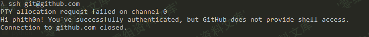
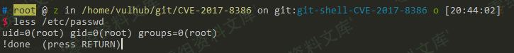
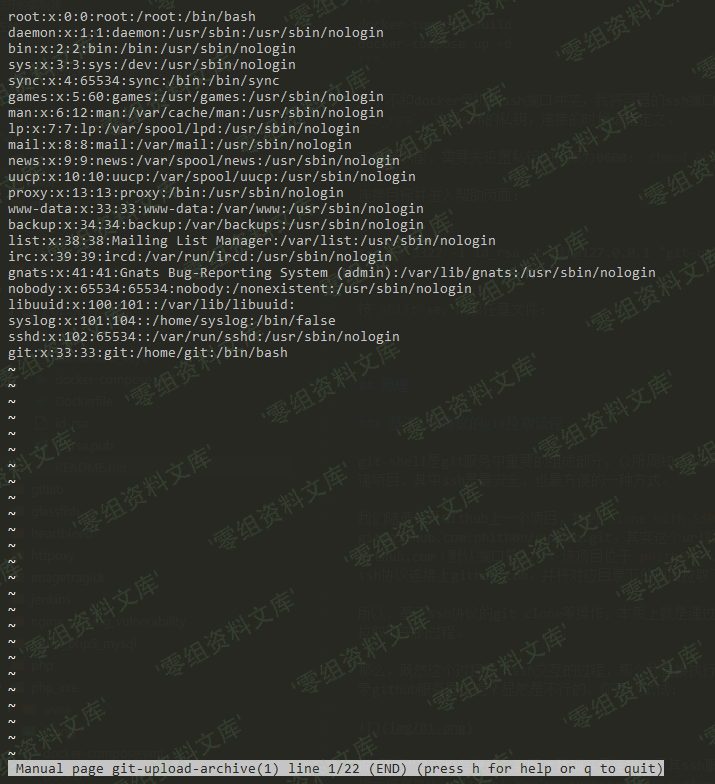

## 核对与使用边界

本文已按保存的全文审阅记录进行文字校订；本轮仅静态核对，未运行 PoC、请求目标或逐图验证。

适用条件与版本记录（来源主张，未列为明确更正的部分仍待权威资料核对）：Branch before2.4.12/2.5.6/2.6.7/2.7.5/2.8.5/2.9.4/2.10.3/2.11.2/2.12.3; SSHauth,PTY,pager and configuredshell matter

代码与实验材料：Clear forced-command versus account-shell distinction; explicit SSH --help andless steps; labkey/Docker context external, no exact path

来源证据范围：No original link, language suggests copiedVulhub/author analysis

- **事实待核（1）**：File read still limited by OS permissions; 'always' read and SSH safest assertions overbroad; no patch/remediation。该项尚不能从转载本身确定外部事实；下文相应编号、版本或修复说法只作为来源记录，不能据此判定部署受影响或已修复。明确更正另列于本节。

- **代码与转录边界（2）**：Truncated cloneSSHURL and duplicated image suffixes。相应原代码作为存在此问题的历史样本保留，不能直接当作可运行、成功复现的 PoC；缺失内容需回原稿核对，不据此补造可执行攻击链。

历史原文标识：下文原技术材料按来源保留；仅本节明确确认的更正替代相应旧说法，标为待核的观察仍不是事实确认。

（CVE-2017-8386）GIT-SHELL 沙盒绕过
===================================

一、漏洞简介
------------

二、漏洞影响
------------

Git
2.4.12之前的版本，2.5.6之前的2.5.x版本，2.6.7之前的2.6.x版本，2.7.5之前的2.7.x版本，2.8.5之前的2.8.x版本，2.9.4之前的2.9.x版本，2.10.3之前的2.10.x版本，2.11.2之前的2.11.x版本，2.12.3之前的2.12.x版本。

三、复现过程
------------

### 漏洞分析

git-shell是git服务中重要的组成部分，众所周知，git服务支持ssh、git、https三种协议来传递项目，其中ssh是最安全，也最方便的一种方式。

我们随便打开Github上一个项目，找到`Clone with SSH`里列出的地址：:phith0n/vulhub.git，其实这个url就是告诉git，ssh用户名是git，地址是github.com（默认端口是22），该项目位于`phith0n/vulhub.git`这个目录下；然后git就通过ssh协议连接上github.com，并将对应目录下的项目拉取下来。

所以，基于ssh协议的git
clone等操作，本质上就是通过ssh协议连接上git服务器，并将指定目录拉取下来的过程。

那么，既然这个过程是个ssh交互的过程，那么我直接执行`ssh git@github.com`是不是就可以登录github服务器了呢？显然是不行的，你可以试试：GIT-SHELL沙盒绕过/media/rId25.png)说"不行"其实也有偏差，实际上我确实是连接上了其ssh服务，并验证身份通过了，但他给了我一段提示信息"Hi
phith0n! You\'ve successfully authenticated, but GitHub does not provide
shell access."，就把我的连接关了。

所以，正常来说，基于ssh的git拉取过程对于git服务器是安全的。

#### 如何禁止git用户执行系统shell

那么，github这类git服务商是怎么实现上述"安全"通信的流程的呢？

让用户可以通过ssh认证身份，但又不给用户shell，这个过程有两种方法实现：

1.  创建系统用户git的时候将其shell设置成git-shell
2.  在authorized\_keys文件每个ssh-key的前面设置command，覆盖或劫持重写原本的命令

第一种方法比较直观，就是创建用户的时候不给其正常的bash或sh的shell，而是给它一个git-shell。git-shell是一个沙盒环境，在git-shell下，只允许执行沙盒内包含的命令。

第二种方法不仅在git服务器上使用，很多Linux发行版也会用到。比如aws，默认安装后是不允许root登录的，实现方法就是在/root/.ssh/authorized\_keys中设置`command="echo 'Please login as the user \"ec2-user\" rather than the user \"root\".';echo;sleep 10"`。这句话相当于覆盖了原本执行的shell，变成了echo一段文字。

当然，第二种方法内也可以用git-shell，比如在添加git用户的时候赋予其正常的`/bin/bash`，但在authorized\_keys中设置`command="git-shell -c \"$SSH_ORIGINAL_COMMAND\""`，实际上还是使用了git-shell。

#### git-shell 沙盒绕过漏洞（CVE-2017-8386）

git-shell是一个可以限制用户执行命令的shell，如果我们在git用户家目录下创建一个新目录，叫`git-shell-commands`，然后将你允许用户执行的命令放在这个目录下，这就创建好了一个沙盒。在git-shell中，只能执行`/home/git/git-shell-commands`目录下的命令。

如果系统是没有`git-shell-commands`目录，那么git-shell默认只允许执行如下三个命令：

-   `git-receive-pack `
-   `git-upload-pack `
-   `git-upload-archive `

这就是白名单。

但CVE-2017-8386的作者发现，执行`git-upload-archive --help`（或`git-receive-pack --help`），将会进入一个交互式的man页面，man又调用了less命令，最后是一个可以上下翻页的帮助文档。

本来这也没什么，但是，less命令有一个特性，就是其支持一些交互式的方法。比如在less页面中，按`shift`+e可以打开Examine功能，通过这个功能可以读取任意文件；输入`!id`就可以执行id这个命令。

可以随便找台linux计算机试一下，执行`less /etc/passwd`来到less的页面，然后在英文输入法下输入`!id`，就可以执行id命令：GIT-SHELL沙盒绕过/media/rId28.png)所以，利用这个特性，我们就可以绕过git-shell的沙盒读取任意文件，或执行任意命令了！

我们可以先试试，在Linux下直接执行git-receive-pack
\--help，再输入!id，看到的效果和上图是类似的。

#### 通过ssh进行利用

那么，如何远程利用这个漏洞？

我们前面试了，直接`ssh git@gitserver`只能拿到git-shell（或返回一段提醒文字），我们就利用上一节里提到的沙盒绕过漏洞执行命令：

    ssh -p 3322 -i id_rsa -t git@127.0.0.1 "git-upload-archive '--help'"

进入帮助页面，然后按shift+e或`!id`即可。

#### 一些限制

我前文说了，一般配置git用户，不让ssh拥有shell，有两种方法：一是创建用户的时候设置其shell为`/usr/bin/git-shell`，二是在authorized\_keys中覆盖command。

如果目标服务器使用了第一种方法，我们即使成功执行了`git-upload-archive '--help'`进入帮助页面，也不能执行命令。因为`!id`还是在git-shell下执行，git-shell中没有id命令，所以依旧执行不成功。

但读取文件是一定可以的，因为读取文件不是通过命令读取的，所以不受git-shell沙盒的影响。

如果目标服务器是用第二种方法配置的git-shell，比如我这里这个测试环境，我是在`/etc/passwd`文件设置git用户的shell是bash，而在authorized\_keys中覆盖command，执行git-shell。

这种情况下，如果我进入了帮助页面，输入`!id`是可以成功执行id命令的，因为此时id是在bash下执行的，而不是在git-shell下执行的，所以没有沙盒限制。

总的来说，这个漏洞至少能做到任意文件读取，有可能可以执行任意命令。

### 漏洞复现

#### 测试环境

编译及运行测试环境：

    docker-compose build
    docker-compose up -d

为了不和docker母机的ssh端口冲突，我将容器的ssh端口设置成3322。本目录下我生成了一个`id_rsa`，这是ssh的私钥，连接的时候请指定之。

在连接以前，需要先设置私钥的权限为0600：`chmod 0600 id_rsa`，否则连接可能失败。

正常连接其ssh服务`ssh -p 3322 -i id_rsa git@127.0.0.1`，会被git-shell给拦截，返回错误`fatal: unrecognized command ''`，并且连接被关闭。

使用\--help技巧，连接目标并进入帮助页面：

    ssh -p 3322 -i id_rsa -t git@127.0.0.1 "git-upload-archive '--help'"

按`shift`+e，读取任意文件：GIT-SHELL沙盒绕过/media/rId33.png)
